<center>
    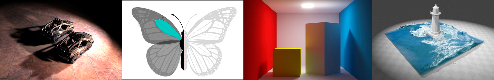
</center>

<!-- more -->

### Rasterization

#### What's After MVP?

* **M**odel transformation (placing objects)
* **V**iew transformation (placing camera)
* **P**rojection transformation
  * Orthographic projection (cuboid to "canonical" cube$\left[-1, 1\right]^3$)
  * Perspective projection (frustun to "canonical" cube)

#### Sampling Artifacts in Computer Graphics

* Signal are changing too fast (high frequency), but sampled too slowly

* Sampling = Repeat Frequency Contents

* Aliasing = Mixed Frequency Contents

* Antialiasing = Limit, then repeating
  * MSAA (Multi-Sample AA)
  * FXAA (Fast Approximate AA 图像的后处理方法） 
  * TAA (Temporal AA 利用上一帧的信息）

#### Visibility / Occlusion

##### Painter's Algorithm

Paint from back to front, overwirte in the framebuffer

##### Z-Buffer

* Store current min. z-value for each sample (pixel)
* Need an additional buffer for depth values
  * frame buffer stores color values
  * depth buffer stores (z-buffer) depth
* z is always positive value
  * samller z -> closer
  * larger z -> further

##### Z-Buffer Algorithm

* Initialize depth buffer to $\infty$
* During rasterization:

```c++
for (each triangle T)
    for (each sample (x, y, z) in T)
        if (z < zbuffer[x, y])
            framebuffer[x, y] = rgb;
            zbuffer[x, y] = z
        else
            ...
```

#### Shading

##### Definition

* In Merriam-Webster Dictionary

  The darkening or coloring of an illustration or diagram with parallel lines or a block of color.

* In Compute Graphics

  The process of applying a material to an object.
  不同物体应用不用的材质。

##### Lambertian (Diffuse) Shading

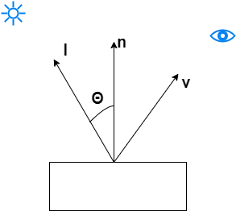

$$L_d = k_d(\frac{T}{r^2})max(0, \mathbf{n} \cdot \mathbf{l})$$

$L_d$: diffusely reflected light
$k_d$: diffuse coefficient (color) 如果$k_d$是一个表示颜色的向量，可以表示在 shading point 上吸收/反射的颜色
$\frac{T}{r^2}$: engry arrived at the shading point
$max(0, \mathbf{n} \cdot \mathbf{l})$: engry received by the shading point

* 漫反射方向和视角方向没有关系

##### Specular Term (Blinn-Phong)

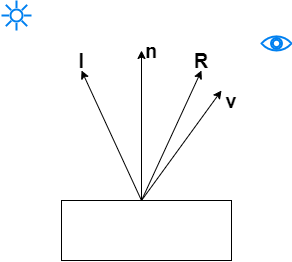

观察方向和镜面反射的方向接近的时候，就能得到高光

$\mathbf{v}$ close to mirror direction $\iff$ **half vector** near normal

$$\mathbf{h} = \frac{\mathbf{v} + \mathbf{l}}{\Vert \mathbf{v} + \mathbf{l} \Vert}$$

$$L_s=K_s(\frac{T}{r^2})max(0, \mathbf{n} \cdot \mathbf{h})^p$$

* 给定入射方向和法线方向，也可以算出反射方向进而计算出高光项，但计算量上要比半程向量复杂
* 指数$p$：点乘向量能体现两个向量是否足够接近，用来控制高光的大小

##### Ambient Term

* Add constant color to account for disregarded illumination and fill in black shadows
* This is approximate

#### Graphics Pipeline

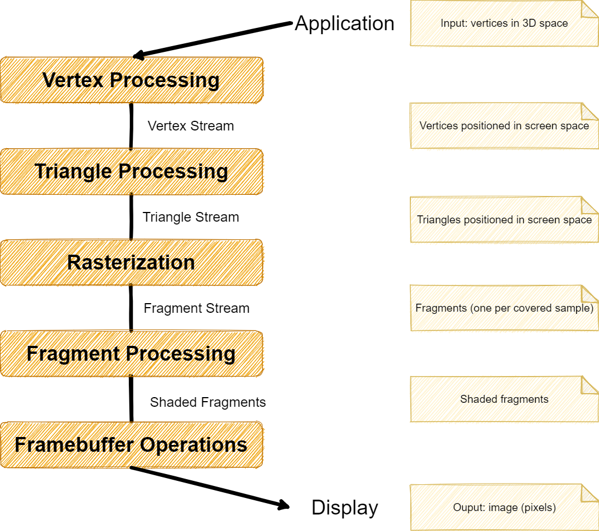

#### Interpolation Across Triangles

* Why do we want to interpolate?
  * Specify values at vertices 
  * Obtain smoothly varying values across triangles --希望在三角形内部实现平滑过渡

* What do we want to interpolate?
  * Texture coordinates, colors, normal vectors, ... --可以对三角形上任意属性进行插值

* How do we interpolate?
  * Barycentric coordinates

##### Barycentric Coordinates

A coordinate system for triangles $(\alpha, \beta, \gamma)$

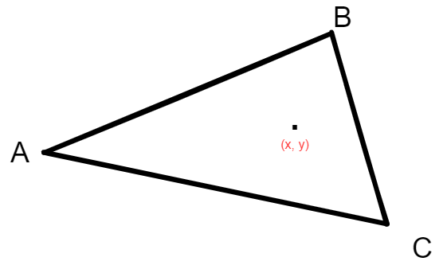

$$(x, y) = \alpha A + \beta B + \gamma C$$
$$\alpha + \beta + \gamma = 1$$

> 重心坐标：三角形所在平面上任意一点都可以表示三个顶点坐标的线性组合，条件是线性组合的系数之和为 1
> Inside the triangle if all three coordinates are non-negative

#### Texture Mapping

##### Simple Texture Mapping

```c++
for each rasterized screen sample (x, y): // usually a pixel's center
    (u, v) = evaluate texture coordinate at (x, y); // using barycentric coordinate（重心坐标）
    texcolor = texture.sample(u, v);
    set sample's color to texcolor; // using the diffuse albedo Kd
```

> ###### 一种解释方法
>
> 假设需要用的纹理（比如是$40 \times 40$）渲染左边的两个三角形（比如是$80 \times 80$），但是纹理平面非常小，那么最后导致的结果就是一个纹素要对应 4 个像素，这样在实际渲染时产生的效果就是纹理被拉伸，视觉上会有模糊的感觉
>
> ###### 另一种解释方法
>
> 纹理映射的过程会根据目标点离相机的远近，占用屏幕上不同大小的范围的像素，例如一个三角面在距离相机 20m 时占用 100 个屏幕像素，当三角面离相机更远时会看起来更小，此时可能占用 20 个屏幕像素，但是在两种情况下这个三角面使用的纹理贴图的大小是不变的。换句话说，由于纹理化表面可以相对于观察者处于任意距离和朝向，因此一个像素通常不直接对应于一个纹理像素。必须应用某种形式的滤波来确定像素的最佳颜色

##### Texture Magnification 纹理放大

###### What if the texture is too small?

就是说相对于要渲染的物体，纹理的分辨率不太高

由于要渲染的物体大于纹理平面，所以物体中的一些部分对应到纹理平面坐标可能就不是整数了，而是小数

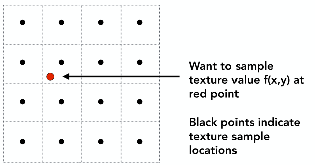

* Nearest

* Bilinear

  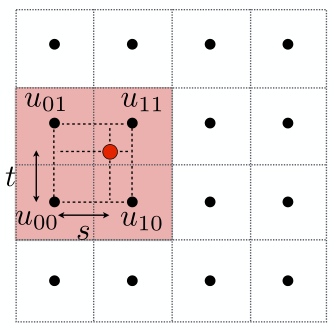

  **Linear interpolation(1D)**
  $$lerp(x, v_0, v_1) = v_0 + x(v_1 - v_0)$$

  **Two helper lerps**

  $u_0 = lerp(s, u_{00}, u_{10})$

  $u_1 = lerp(s, u_{01}, u_{11})$

  双线性插值其实就是横向和纵向两个方向做插值

* Bicubic

###### What if the texture is too large?

另一种情况就是纹理相比于要渲染的物体大，这样就会导致纹理缩小，即一个像素会覆盖多个纹素

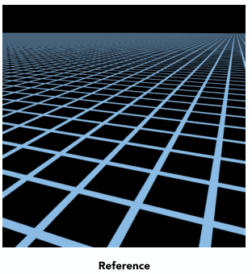

除了纹理分辨率大于要渲染的物体，在如下情况中也会出现**纹理缩小**的问题（通过透视投影将物体映射到平面，会造成近处纹理大，远处纹理小的视觉效果）。换句话说就是近处的一个像素可能只覆盖一个纹素，或者一个纹素覆盖多个像素（这种情况可用双线性插值解决），但对于远处的像素而言，一个像素会覆盖多个纹素，如下图所示（蓝点表示一个像素点，框表示该像素点所能覆盖的纹素数量）

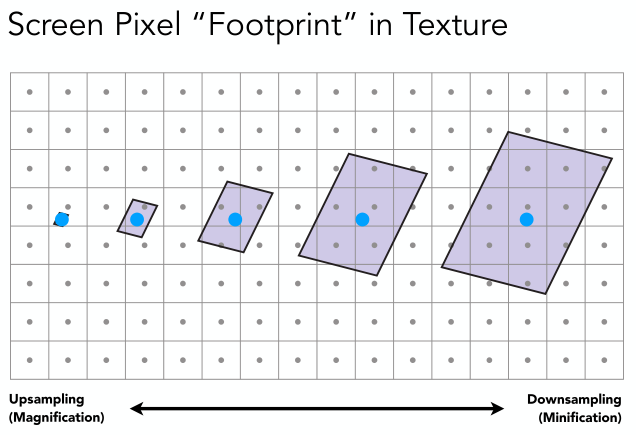

###### Mipmap

Allowing (fast, approx., square) range quries.

"Mip" comes from the Latin "multum in parvo", meaning a multitude in a small space.

###### Computing Mipmap Level `D`

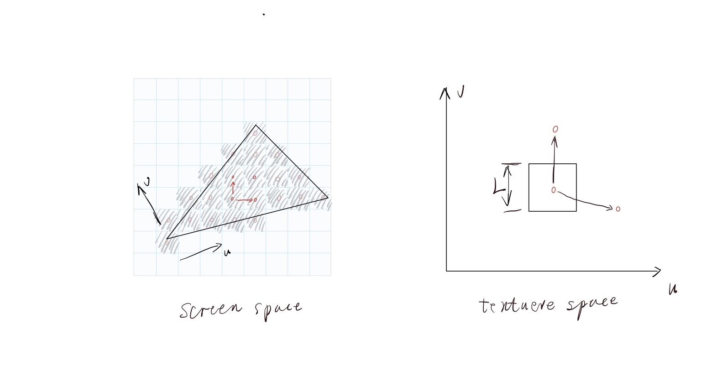

* 利用重心坐标映射到纹理坐标
* 计算出纹理上近似正方区域的边长$L$

$$D = \log_2L \quad\quad L = max\left( \sqrt{\left( \frac{du}{dx} \right)^2 + \left( \frac{dv}{dx} \right)^2},  \sqrt{\left( \frac{du}{dy} \right)^2 + \left( \frac{dv}{dy} \right)^2}\right)$$

###### Trilinear Interpolation

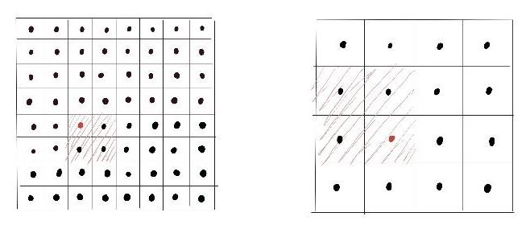

Linear interpolation based on continuous D value

Mipmap limitations: overblur

### Geometry

#### Implicit Geometry

* Points satisfy some specified relationship
  E.g. sphere: all points in 3D, where $x^2 + y^2 + z^2 = 1$. More generally, $f(x, y, z) = 0$.

* Constructive Solid Geometry
  Combine implict geometry via Boolean operations.
* Distance Functions
* Fractals

#### Explict Geometry

All points are given directly or via parameter mapping.

* Point Cloud

### $B\acute{e}zier$ Curve

#### de Castekjau Algorithm

#### Evaluating $B\acute{e}zier$ Curves Algebraic Formula

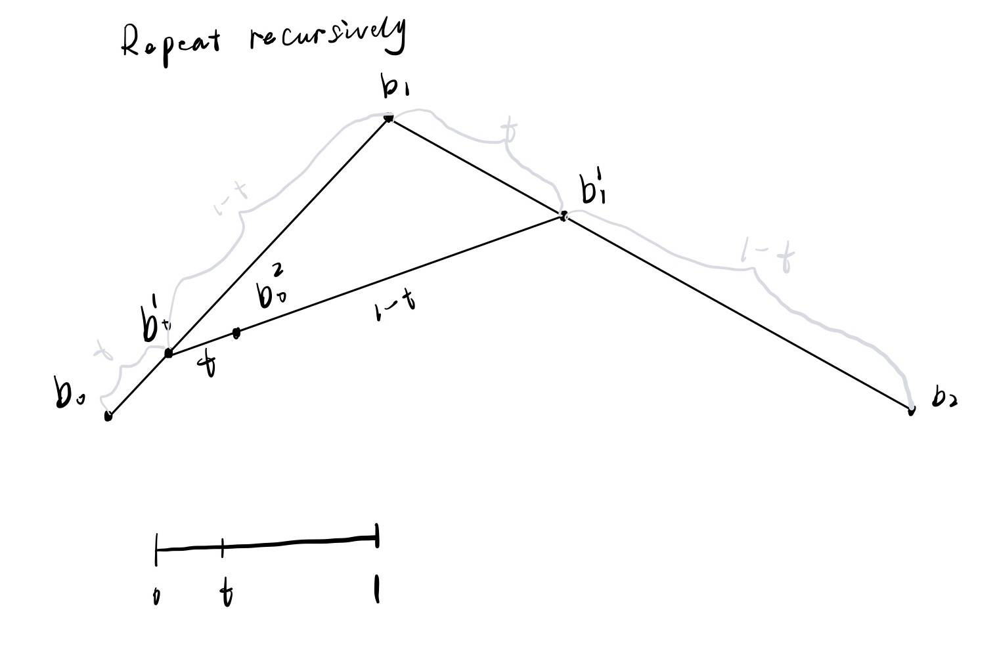

Example: quadratic $B\acute{e}zier$ curve from three points

$$\mathbf{b}_0^1(t) = (1 - t)\mathbf{b}_0 + t\mathbf{b}_1$$
$$\mathbf{b}_1^1(t) = (1 - t)\mathbf{b}_1 + t\mathbf{b}_2$$
$$\mathbf{b}_0^2(t) = (1 - t)\mathbf{b}_0^1 + t\mathbf{b}_1^1$$
$$\Downarrow$$
$$\mathbf{b}_0^2(t) = (1 - t)^2\mathbf{b}_0 + 2t(1 - t)\mathbf{b}_1 + t^2\mathbf{b}_2$$

> `t`可以理解为某一时刻

* **Bernstein form of a $B\acute{e}zier$ curve of order n:**

  $$\mathbf{b}^n(t) = \sum_{j = 0}^n{\mathbf{b}_jB_j^n(t)}$$
  
  $\mathbf{b}_j$: $B\acute{e}zier$ control points
  $B_j^n(t) = \begin{pmatrix} n \\ i \end{pmatrix} t^i(1 - t)^{n - i}$: Bernstein polynomial

###  $B\acute{e}zier$ Surfaces

### Shadow Mapping

#### Render from light

* **depth image from light source** （只需要深度图）

#### Render from eye

* **Standard image (with depth) from eye**

#### Project to light

* **Project visible points in eye view back to light source**
* **Compare the depths from light and eye**

### Ray Tracing

#### Recursive (Whitted-Style) Ray Tracing

##### Ray-Surface Intersection

* Ray equation:
  $$\mathbf{r}(t) = \mathbf{o} + t\mathbf{d} \quad 0 \le t < \infty$$

* Ray intersection with sphere

  Sphere: $(p - c)^2 - R^2 = 0$

* Ray intersection with implicit surface

  General implicit surface: $f(p) = 0$
  Solve for **real**, **positive** roots

* Ray intersection with triangle mesh

  Plane equation (if $p$ satisfies it, then $p$ is on the plane):
  $$(\mathbf{p} - \mathbf{p\prime}) \cdot \mathbf{N} = 0$$

  Solve for intersection
  $$t = \frac{\mathbf{p\prime} - \mathbf{o} \cdot \mathbf{N}}{\mathbf{d} \cdot \mathbf{N}}$$

> A faster approach, giving barycentric coordinate（重心坐标） directly
> $$\mathbf{o} + t\mathbf{d} = (1 - b_1 - b_2)\mathbf{P}_0 + b_1\mathbf{P}_1 + b_2\mathbf{P}_2$$

* Ray Intersection with Axis-Aligned Bounding Box
  * The ray enters the box **only when** it enters all pairs of slabs
  * The ray exits the box **as long as** it exits any pair of slabs
  * For each pair, calcute the $t_{min}$ and $t_{max}$ (negative is fine)
  * For the 3D box, $t_{enter} = max\{t_{min}\}$, $t_{exit} = min\{t_{max}\}$
  * if $t_{enter} < t_{exit}$, we know ray stays a while in the box.

#### Spatial Partitions（空间划分）

* Oct-Tree
* KD-Tree
* BSP-Tree

#### Object Partitions（物体划分） & Bounding Volume Hierarchy (BVH)

### Radiometry（辐射度量学）

* Radiant Energy and Flux (Power)

  * 强度
    $$Q \quad [J = Houle]$$
  * 能量
    $$\Phi = \frac{dQ}{dt} \quad [W = Watt] [lm = lumen]$$ 

* Import Light Measurements of Interest

  * Radiant Intensity: power per solid angle
    $$I(\omega) = \frac{d\Phi}{d\omega}$$
  * Solid Angle（立体角）
    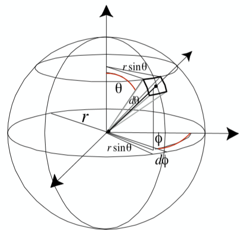
    $$\Omega = \frac{A}{r^2}$$
  * Irradiance（辐射照度）: power per unit area
    $$E(x) = \frac{d\Phi(x)}{dA}$$
  * Radiance（辐射亮度）: power per unit solid angle, per projected unit area.
    
    $$L(p, \omega) = \frac{d^2\Phi(p, \omega)}{d\omega dA cos\theta}$$

* Irradiance vs.Radiance

  * Irradiance: total power received by area $dA$
  * Radiance: power received by area $dA$ from "direction" $d\omega$

  

  $$dE(p, \omega) = L_i(p, \omega)cos\theta d\omega$$
  $$E(p) = \int_{H^2}L_i(p, \omega)cos\theta d\omega$$

  > **radiance **是来自四面八方的** irradiance **的和（积分）

#### Bidirectional Reflectance Distribution Function (BRDF)

##### Refection at a point

> 如果有一束光线进入，不同的反射方向上的能量分布。

The BRDF represents how much light is reflected into each outgoing direction $\omega_r$ from each incoming direction
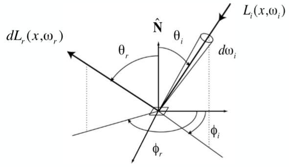
$$f_r(\omega_i \rightarrow \omega_r) = \frac{dL_r(\omega_r)}{dE_i(\omega_i)} = \frac{dL_r(\omega_r)}{L_i(\omega_i)cos\theta_i d\omega_i}$$

##### The Reflection Equation

$$L_r(p, \omega_r) = \int_{H^2}{f_r(p, \omega_i \rightarrow \omega_r)L_i(p, \omega_i)cos\theta_i d\omega_i}$$

##### The Rendering Equation

by adding an Emission term ot make it general

$$L_o(p, \omega_o) = L_e(p, \omega_o) + \int_{\Omega^+}{L_i(p, \omega_i)f_r(p, \omega_i, \omega_o)(\vec{n} \cdot \vec{\omega_i})d\omega_i}$$

* $L_o(p, \omega_o)$: Reflected Light
* $L_e(p, \omega_o)$: Emission（自发光）
* $L_i(p, \omega_i)$: Incident Light
* $f_r(p, \omega_i, \omega_o)$: BRDF
* $\vec{n} \cdot \vec{\omega_i}$: Cosine of Incident angle

###### Rendering Equation as Intergral Equation

$$L_o(p, \omega_o) = L_e(p, \omega_o) + \int_{\Omega^+}{L_i(p, \omega_i)f_r(p, \omega_i, \omega_o)(\vec{n} \cdot \vec{\omega_i})d\omega_i}$$
$$\Downarrow$$
$$l(u) = e(u) + \int{l(v)K(u, v)dv}$$
$$\Downarrow$$
$$L = E + KL$$
$$\Downarrow$$
$$L = (I - K)^{-1}E$$
$$\Downarrow$$
$$L = (I + K + K^2 + K^3 + \dots)E$$
$$\Downarrow$$
$$L = E + KE + K^2E + K^3E + \dots$$

* $E$: Emission directly from light sources $\Leftarrow$ **Shading in Rasterization**
* $KE$: Direct Illumination on surfaces $\Leftarrow$ **Shading in Rasterization**
* $k^2E$: Indirect Illumination(one bounce indirect)[mirrors, refraction]
* $k^3E$: Two bounce indirect illum.

### Path Tracing

### Materials and Appearances

#### Diffuse / Lambertian Material

> 漫反射系数

$$L_o(\omega_o) = \int_{H^2}{f_rL_i(\omega_i)cos\theta_id\omega_i}$$
$$\Downarrow$$
$$L_o(\omega_o) = f_rL_i\int_{H^2}{(\omega_i)cos\theta_id\omega_i}$$
$$\Downarrow$$
$$L_o(\omega_o) = \pi f_rL_i$$

> Diffuse's BRDF: $f_r = \frac{\rho}{\pi}$
> $\rho$ 为反射率 (albedo)

#### Glossy Material 

#### Perfect Specular Reflection

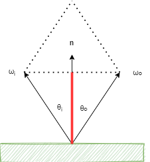

$\theta = \theta_o = \theta_i$

$$\omega_o + \omega_i = 2cos\theta \mathbf{n} = 2(\omega_i \cdot \mathbf{n})\mathbf{n}$$
$$\omega_o = -\omega_i + 2(\omega_i \cdot \mathbf{n})\mathbf{n}$$

> 两个向量$\omega_o$和$\omega_i$的和一定沿着法向量的方向，长度是 2 倍的红颜色的长度，即入射方向投影到法线方向的长度（$\omega_i \cdot \mathbf{n}$）的 2 倍

#### Specular Refraction

* Snell's Law
  $$\eta_isin\theta_i = \eta_tsin\theta_t$$

#### Fresnel Reflection / Term

### MicroFacet Material

#### Microfacet Theory

* Macroscale: flat & rough
* Microscale: bumpy（凹凸的） & specular

#### Microface BRDF

$$f(i, o) = \frac{F(i, h)G(i, o, h)D(h)}{4(n, i)(n, o)}$$

* $F(i, h)$: Frenel term
* $G(i, o, h)$: shadowing-masking term（微表面的自遮挡、自投影处理）
* $D(h)$: **distribution of normals**

#### Properties of BRDFs

* Non-negativity
* Linearity
* Reciprocity principle（可逆性）
  $$f_r(\omega_r \rightarrow \omega_i) = f_r(\omega_i \rightarrow \omega_r)$$
* Energy conservation（能量守恒）
* Isotropic（各项异性） & Anisotropic（各项同性）

#### Measuring BRDFs

### Cameras, Lenses（棱镜） and Light Fields（光场）

* Field of View

  * It it common to refer to angular field of view by focal length（焦距） of a lens used on a 35mm-format film(36 $\times$ 24mm)

* Exposure
  * $H = T \times E$
  * Exposure = time $\times$ irradiance
    * Exposure time:
      * Control by shutter
    * Irradiance:
      * Power of light falling on a unit area of sensor
      * Controlled by lens aperture（光圈） and focal length
  * Exposure Controls in Photography
    * Aperture size: Change the f-stop by opening / closing the aperture
      * f-stop 数越大光圈越小
      * F-Number definiton: the focal length divided by the diameter of the aperture
    * Shutter speed
    * IOS gain（感光度）

* Depth of Field（指成像清晰的一段范围）

### Color and Perception

#### Addtive Color（加色系统）

* Given a set of primary lights, each with its own spectral distribution
  * $s_R(\lambda)$, $s_G(\lambda)$, $s_B(\lambda)$
* Adjust the brightness of these lights and add them together
  * $Rs_R(\lambda) + Gs_G(\lambda) + Bs_B(\lambda)$

#### Color Spaces

* Standardized RGB(sRGB)
* Perceptually Organized Color Spaces
  * HSV Color Space(Hue-Saturation-Value)
    * Hue: 色调
    * Saturation: 饱和度
    * Value: 亮度
  * L\*a\*b\*
    * L* is lightness
    * a\* and b\* are color-opponent（互补色） pairs
    * a* is red-green
    * b* is blue-yellow

* CMYK: A Subtractive Color Space
  * Cyan, Magenta, Yellow and Key Widely
