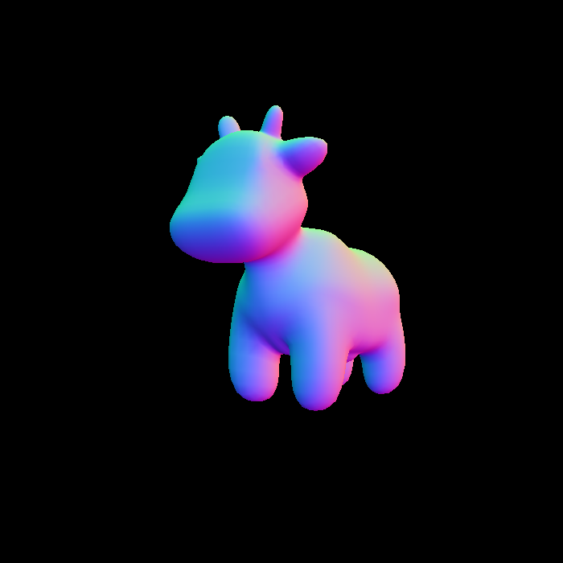
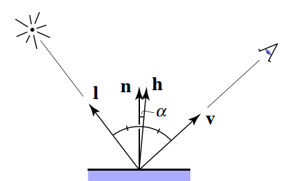
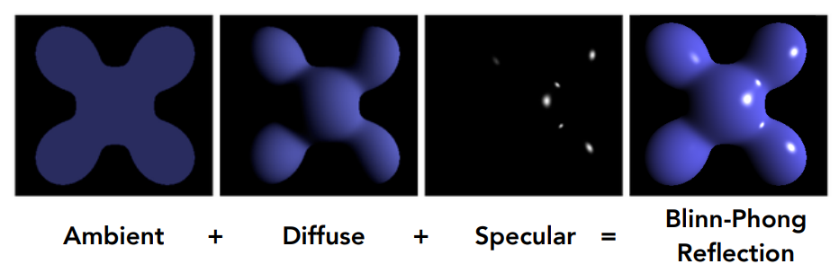
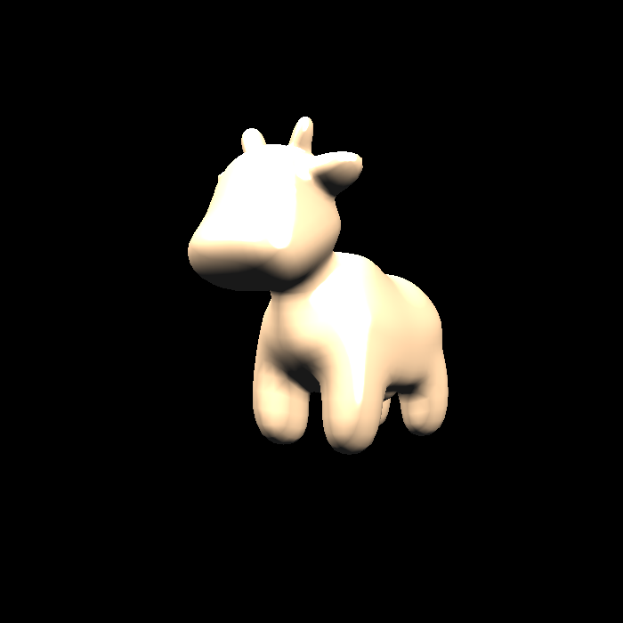
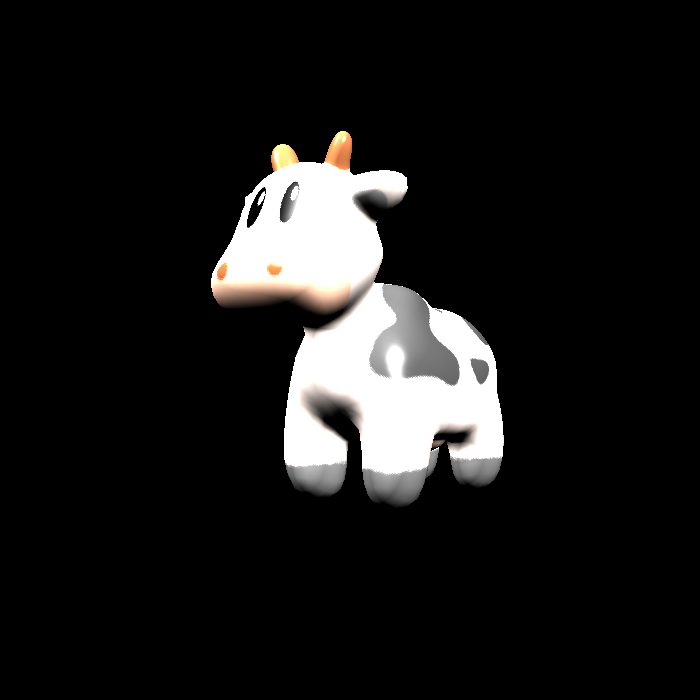
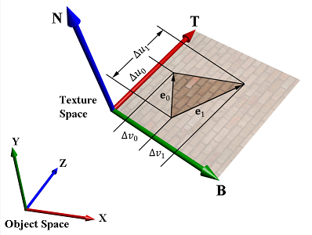
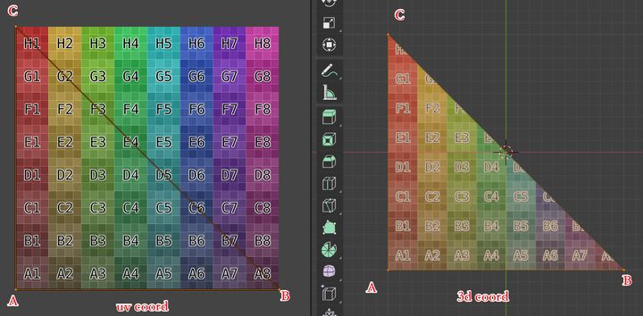
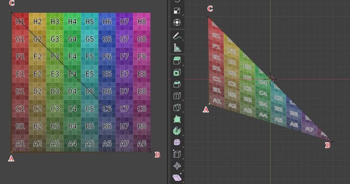
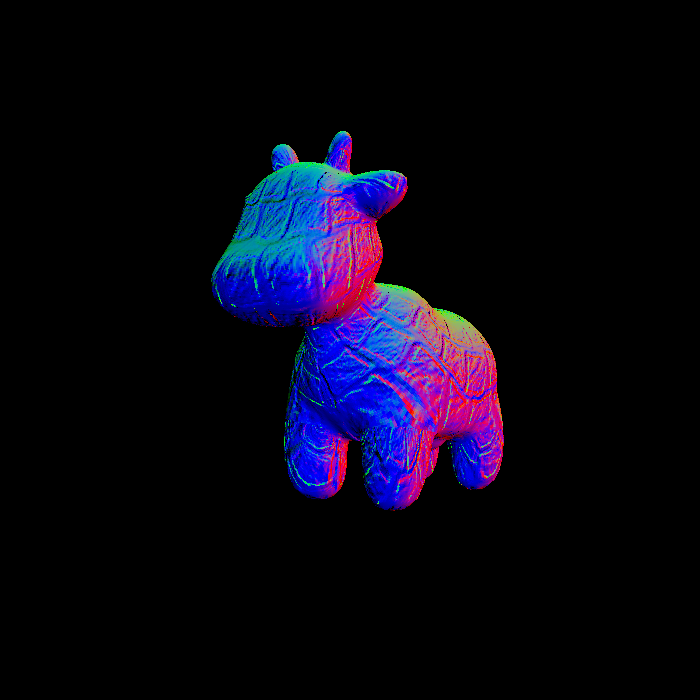
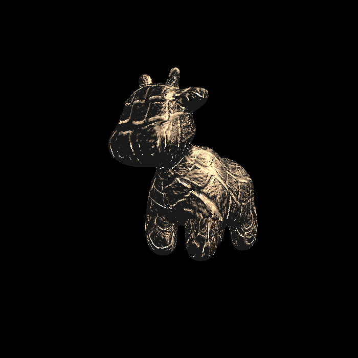

### 光栅化

与[Triangles and Z-Buffer](https://silhouettesforyou.github.io/2021/11/09/8/)一样的流程

* 计算三角形的包围盒（bounding box）
* 遍历包围盒判断点是否在三角形内
* 求解重心坐标并进行插值校正
* 更新深度值

这里需要计算颜色插值（color）、向量插值（normal）、纹理坐标插值（texcoords）和着色点坐标插值（shadingcoords）

#### `shadingcoords`

GPU先进行观测变换（Viewing Transformation），再进行光栅化。由于增加了光照，同一物体的不同位置的颜色不一样，需要结合法线等因素去计算，所以需要考虑物体在原本空间的位置。

在进行光栅化时只有像素的$(x, y)$坐标是已知的，经过深度插值，才得到了**屏幕空间**中对应的某点的坐标$(x, y, z)$。而这个坐标也不是**观察空间**（View Space或者Camera Space）里面的点，因为投影矩阵本质上是把视锥压缩成了长方体，这个坐标是经历了压缩之后的。只有利用$\alpha$，$\beta$，$\gamma$结合`rasterize_triangle`传进来的参数`viewspace_pos`插值才能算出对应**观察空间**中的像素点。得到了这个所谓的`interpolated_shadingcoords`，其实就是**观察空间**中你真正在着色的那个点。

光线作用是**观察空间**（View Space或者Camera Space）中进行的，经过了MV变换（Model和Viewpoint）的空间就是**观察空间**，这时所有空间点之间的相对位置都还是正常的，所以要在这个**观察空间**来做着色，计算光的入射和空间点的作用。经过了MVP变换的空间还是三维空间，但已经是被透视变换压缩的三维空间，因为$z$被压缩了，所以不能用这个空间来做光线作用。经过了MVP变换和Viewport变换的空间叫做**屏幕空间**（Screen Space），已经是二维空间点了，准备好成为像素了。

```c++
//Screen space rasterization
void rst::rasterizer::rasterize_triangle(const Triangle& t, const std::array<Eigen::Vector3f, 3>& view_pos) 
{
    // TODO: From your HW3, get the triangle rasterization code.
    // TODO: Inside your rasterization loop:
    //    * v[i].w() is the vertex view space depth value z.
    //    * Z is interpolated view space depth for the current pixel
    //    * zp is depth between zNear and zFar, used for z-buffer

    // float Z = 1.0 / (alpha / v[0].w() + beta / v[1].w() + gamma / v[2].w());
    // float zp = alpha * v[0].z() / v[0].w() + beta * v[1].z() / v[1].w() + gamma * v[2].z() / v[2].w();
    // zp *= Z;

    // TODO: Interpolate the attributes:
    // auto interpolated_color
    // auto interpolated_normal
    // auto interpolated_texcoords
    // auto interpolated_shadingcoords

    // Use: fragment_shader_payload payload( interpolated_color, interpolated_normal.normalized(), interpolated_texcoords, texture ? &*texture : nullptr);
    // Use: payload.view_pos = interpolated_shadingcoords;
    // Use: Instead of passing the triangle's color directly to the frame buffer, pass the color to the shaders first to get the final color;
    // Use: auto pixel_color = fragment_shader(payload);
    auto v = t.toVector4();
    auto minX = std::min(v[0].x(), std::min(v[1].x(), v[2].x()));
    auto minY = std::min(v[0].y(), std::min(v[1].y(), v[2].y()));
    auto maxX = std::max(v[0].x(), std::max(v[1].x(), v[2].x()));
    auto maxY = std::max(v[0].y(), std::max(v[1].y(), v[2].y()));
    
    for (int i = minX; i <= maxX; i++) {
        for (int j = minY; j <= maxY; j++) {
            if (insideTriangle(i + 0.5, j + 0.5, t.v)) {
                auto tup = computeBarycentric2D(i, j, t.v);

                float alpha, beta, gamma;
                std::tie(alpha, beta, gamma) = tup;
                float wReciprocal = 1.0 / (alpha / v[0].w() + beta / v[1].w() + gamma / v[2].w());
                float zInterpolated = alpha * v[0].z() / v[0].w() + beta * v[1].z() / v[1].w() + gamma * v[2].z() / v[2].w();
                zInterpolated *= wReciprocal;
                auto index = get_index(i, j);
                
                if (depth_buf[index] > zInterpolated) {
                    auto interpolated_color = interpolate(alpha, beta, gamma, t.color[0], t.color[1], t.color[2], 1);
                    auto interpolated_normal = interpolate(alpha, beta, gamma, t.normal[0], t.normal[1], t.normal[2], 1);
                    auto interpolated_texcoords = interpolate(alpha, beta, gamma, t.tex_coords[0], t.tex_coords[1], t.tex_coords[2], 1);
                    auto interpolated_shadingcoords = interpolate(alpha, beta, gamma, view_pos[0], view_pos[1], view_pos[2], 1);
                    fragment_shader_payload payload(interpolated_color, interpolated_normal.normalized(), interpolated_texcoords, texture ? &*texture : nullptr);
                    payload.view_pos = interpolated_shadingcoords;
                    auto pixel_color = fragment_shader(payload);
                    set_pixel(Eigen::Vector2i(i, j), pixel_color);
                    depth_buf[index] = zInterpolated;
                }
            }
        }
    }
}
```

### Normal 

法向贴图不考虑光照直接将着色点的法向量的值映射为颜色值即可

```c++
Eigen::Vector3f normal_fragment_shader(const fragment_shader_payload& payload)
{
    Eigen::Vector3f return_color = (payload.normal.head<3>().normalized() + Eigen::Vector3f(1.0f, 1.0f, 1.0f)) / 2.f;
    Eigen::Vector3f result;
    result << return_color.x() * 255, return_color.y() * 255, return_color.z() * 255;
    return result;
}
```

<center>
    
</center>

### Blinn-Phong

#### 漫反射（Diffuse Term）

$$
L_d = k_d(\frac{I}{r^2})\max(0, \mathbf{n}\cdot\mathbf{l})
$$


#### 高光（Specular Term）

<center>
    
</center>


$$
\begin{align}
L_s &= k_s(\frac{I}{r^2})\max(0, \cos\alpha)^p \\\\
&= k_s(\frac{I}{r^2})\max(0, \mathbf{n}\cdot\mathbf{h})^p
\end{align}
$$

其中$\mathbf{h}$是半程向量
$$
\mathbf{h} = \frac{\mathbf{v} + \mathbf{l}}{\left\||\mathbf{v} + \mathbf{l}\right\||}
$$

#### 环境光（Ambient Term）

$$
L_a = k_aI_a
$$

#### Blinn-Phong Refection Model

<center>
    
</center>

$$
\begin{align*}
L &= L_a + L_d + L_s \\\\
&= k_aI_a + k_d(\frac{I}{r^2})\max(0, \mathbf{n}\cdot\mathbf{l}) + k_s(\frac{I}{r^2})\max(0, \mathbf{n}\cdot\mathbf{h})^p
\end{align*}
$$


```c++
Eigen::Vector3f phong_fragment_shader(const fragment_shader_payload& payload)
{
    Eigen::Vector3f ka = Eigen::Vector3f(0.005, 0.005, 0.005);
    Eigen::Vector3f kd = payload.color / 255.f;
    Eigen::Vector3f ks = Eigen::Vector3f(0.7937, 0.7937, 0.7937);

    auto l1 = light{{20, 20, 20}, {500, 500, 500}};
    auto l2 = light{{-20, 20, 0}, {500, 500, 500}};

    std::vector<light> lights = {l1, l2};
    Eigen::Vector3f amb_light_intensity{10, 10, 10};
    Eigen::Vector3f eye_pos{0, 0, 10};

    float p = 150;

    Eigen::Vector3f color = payload.color;
    Eigen::Vector3f point = payload.view_pos;
    Eigen::Vector3f normal = payload.normal;

    Eigen::Vector3f result_color = {0, 0, 0};
    for (auto& light : lights)
    {
        // TODO: For each light source in the code, calculate what the *ambient*, *diffuse*, and *specular* 
        // components are. Then, accumulate that result on the *result_color* object.
        Eigen::Vector3f v = (eye_pos - point).normalized();
        Eigen::Vector3f l = (light.position - point).normalized();
        auto r = l.dot(l);
        auto h = (v + l).normalized();

        auto ls = ks.cwiseProduct(light.intensity / r) * std::pow(std::max(0.0f, normal.normalized().dot(h)), p);

        auto la = ka.cwiseProduct(amb_light_intensity);

        auto ld = kd.cwiseProduct(light.intensity / r) * std::max(0.0f, normal.normalized().dot(l));

        result_color += (la + ld + ls);

        //std::cout << "(" << result_color.x() << ", " << result_color.y() << ", " << result_color.z() << ")" << std::endl;
    }

    return result_color * 255.f;
}
```

<center>
    
</center>

### Texture Shader Fragment

**Texture**的实现只需要将纹理坐标对应的颜色传给`kd`即可，纹理坐标会出现负值，所以把$u$，$v$坐标限定在$[0,1]$范围内

```c++
Eigen::Vector3f getColor(float u, float v)
{
	// 坐标限定
	if (u < 0) u = 0;
	if (u > 1) u = 1;
	if (v < 0) v = 0;
	if (v > 1) v = 1;
    auto u_img = u * width;
    auto v_img = (1 - v) * height;
    auto color = image_data.at<cv::Vec3b>(v_img, u_img);
    return Eigen::Vector3f(color[0], color[1], color[2]);
}
```

```c++
Eigen::Vector3f texture_fragment_shader(const fragment_shader_payload& payload)
{
    Eigen::Vector3f return_color = {0, 0, 0};
    if (payload.texture)
    {
        // TODO: Get the texture value at the texture coordinates of the current fragment
        auto texcoord = payload.tex_coords;
        return_color = payload.texture->getColor(texcoord.x(), texcoord.y());
    }
    Eigen::Vector3f texture_color;
    texture_color << return_color.x(), return_color.y(), return_color.z();

    Eigen::Vector3f ka = Eigen::Vector3f(0.005, 0.005, 0.005);
    Eigen::Vector3f kd = texture_color / 255.f;
    Eigen::Vector3f ks = Eigen::Vector3f(0.7937, 0.7937, 0.7937);

    auto l1 = light{{20, 20, 20}, {500, 500, 500}};
    auto l2 = light{{-20, 20, 0}, {500, 500, 500}};

    std::vector<light> lights = {l1, l2};
    Eigen::Vector3f amb_light_intensity{10, 10, 10};
    Eigen::Vector3f eye_pos{0, 0, 10};

    float p = 150;

    Eigen::Vector3f color = texture_color;
    Eigen::Vector3f point = payload.view_pos;
    Eigen::Vector3f normal = payload.normal;

    Eigen::Vector3f result_color = {0, 0, 0};

    for (auto& light : lights)
    {
        // TODO: For each light source in the code, calculate what the *ambient*, *diffuse*, and *specular* 
        // components are. Then, accumulate that result on the *result_color* object.
        Eigen::Vector3f v = (eye_pos - point).normalized();
        Eigen::Vector3f l = (light.position - point).normalized();
        auto r = l.dot(l);
        auto h = (v + l).normalized();
        auto ls = ks.cwiseProduct(light.intensity / r) * std::pow(std::max(0.0f, normal.normalized().dot(h)), p);

        auto la = ka.cwiseProduct(amb_light_intensity);

        auto ld = kd.cwiseProduct(light.intensity / r) * std::max(0.0f, normal.normalized().dot(l));

        result_color += (la + ld + ls);
    }

    return result_color;
}
```

<center>
    
</center>

### Bump Mapping

#### 法线贴图原理

如果法线处于世界坐标中的（World Space），那称为World Space Normal。如果是处于物体本身局部坐标中的，那称为Object Space Normal。

World Space Normal一旦从贴图里解压出来后，就可以直接用了，效率很高。但是有个缺点，这个World Space Normal是固定了，如果物体没有保持原来的方向和位置，那原来生成的法线贴图就作废了。

因此保存了Object Space Normal。它从贴图里解压，还需要乘以模型-视图（Model-View）矩阵转换到世界坐标，或者转换到其他坐标取决于计算过程及需求。Object Space Normal生成的贴图，物体可以被旋转和位移。但仍有一个缺点。就是**一张贴图只能对应特定的一个模型，模型不能有变形(deform)**。

变形时，顶点关系改变了，即面的形状,方向改变了。如果面上存在一个固定的坐标系，那当物体变形、移动、旋转时，这个坐标系必定跟着面一起运动,那么在这个坐标系里的某个点或向量，不需要变动。当整个面发生变化时，**只需要计算面上的坐标系到世界坐标系的转换矩阵,那么定义在这个面上的点或坐标(固定的),乘以这个矩阵即可得到在世界中的坐标。**这个坐标系术语里称为切线空间（Tangent Space）。

#### UV与TB的关系


一个顶点结构中包含很多信息，其中就有顶点在三维空间中的位置信息，以及顶点在展开的UV中的UV坐标，且三维空间下三角形中的每一个点都必能在UV上找到对应的点，反之亦然。

<center>
    
</center>

假设$\triangle ABC$的三个顶点以逆时针排列，则对于点$A$，将$\overrightarrow{AC}$记为$\mathbf{E_1}$、$\overrightarrow{AB}$记为$\mathbf{E_2}$，$T$代表**Tangent**（切线），$B$代表**Bitangent**（副切线）。若设$A(x_1, y_1, z_1)$，UV坐标为$(u_1, v_1)$、$B(x_2, y_2, z_2)$，UV坐标为$(u_2, v_2)$、$C(x_3, y_3, z_3)$，UV坐标为$(u_3, v_3)$，对应的纹理坐标插值：
$$
\begin{aligned}
&\begin{pmatrix}
\Delta U_1 \\\\
\Delta V_1
\end{pmatrix}
=
\begin{pmatrix}
u_2 - u_1 \\\\
v_2 - v_1
\end{pmatrix}
,
&\begin{pmatrix}
\Delta U_2 \\\\
\Delta V_2
\end{pmatrix}
=
\begin{pmatrix}
u_3 - u_1 \\\\
v_3 - v_1
\end{pmatrix}
\end{aligned}
$$

则有如下公式（$T$，$B$分别和纹理坐标轴$U$，$V$是平行的，根据向量加法可得）：
$$
\begin{cases}
\mathbf{E_1} = \Delta U_1\mathbf{T} + \Delta V_1\mathbf{B} \\\\
\mathbf{E_2} = \Delta U_2\mathbf{T} + \Delta V_2\mathbf{B}
\end{cases}
$$

用矩阵来表示：
$$
\begin{bmatrix}
E_{1x} & E_{1y} & E_{1z} \\\\
E_{2x} & E_{2y} & E_{2z}
\end{bmatrix}
=
\begin{bmatrix}
\Delta U_1 & \Delta V_1 \\\\
\Delta U_2 & \Delta V_2
\end{bmatrix}
\begin{bmatrix}
T_{x} & T_{y} & T_{z} \\\\
B_{x} & B_{y} & B_{z}
\end{bmatrix}
$$
继而得出：
$$
\begin{bmatrix}
T_{x} & T_{y} & T_{z} \\\\
B_{x} & B_{y} & B_{z}
\end{bmatrix}
=
\frac{1}{\Delta U_1\Delta V_2 - \Delta U_2\Delta V_1}
\begin{bmatrix}
\Delta V_2 & -\Delta V_1 \\\\
-\Delta U_2 & \Delta U_1
\end{bmatrix}
\begin{bmatrix}
E_{1x} & E_{1y} & E_{1z} \\\\
E_{2x} & E_{2y} & E_{2z}
\end{bmatrix}
$$


<center>
    
</center>
在这种特殊情况下，此时的$T$显然恰好与U在三维空间上的映射方向相同、同理$B$也与$V$方向相同。直观上，该公式描述的数学意义是，如何将一个点从UV空间映射到三维空间，其中TB作为基矢，以UV空间中的U和V的增长作为控制参数。假设三角形中存在一点$P$，则向量$\overrightarrow{AP}=U(p)T+V(p)B$，只要知道$P$点的UV坐标值，即可得到$P$点的三维坐标值。

如果在三维空间下将三角形做一点拉伸，变成如下图所示，则UV向量在三维空间的方向将不再垂直，但依然可以很方便的辨认出纹理坐标映射的位置。

<center>
    
</center>

目前算出来的$TB$还不是真正的切线与副切线，需要经过正交化得到$TBN$矩阵：
$$
\begin{aligned}
&\mathbf{t_\perp} = norm(\mathbf{t} - (\mathbf{t} \cdot \mathbf{n} ) \ast \mathbf{n}) \\\\
&\mathbf{b_\perp} = norm(\mathbf{b} - (\mathbf{b} \cdot \mathbf{n} ) \ast \mathbf{n} - (\mathbf{b} \cdot \mathbf{t_\perp}) * \mathbf{t_\perp})
\end{aligned}
$$


```c++
Eigen::Vector3f bump_fragment_shader(const fragment_shader_payload& payload)
{
    
    Eigen::Vector3f ka = Eigen::Vector3f(0.005, 0.005, 0.005);
    Eigen::Vector3f kd = payload.color;
    Eigen::Vector3f ks = Eigen::Vector3f(0.7937, 0.7937, 0.7937);

    auto l1 = light{{20, 20, 20}, {500, 500, 500}};
    auto l2 = light{{-20, 20, 0}, {500, 500, 500}};

    std::vector<light> lights = {l1, l2};
    Eigen::Vector3f amb_light_intensity{10, 10, 10};
    Eigen::Vector3f eye_pos{0, 0, 10};

    float p = 150;

    Eigen::Vector3f color = payload.color; 
    Eigen::Vector3f point = payload.view_pos;
    Eigen::Vector3f normal = payload.normal;


    float kh = 0.2, kn = 0.1;

    // TODO: Implement bump mapping here
    // Let n = normal = (x, y, z)
    // Vector t = (x*y/sqrt(x*x+z*z),sqrt(x*x+z*z),z*y/sqrt(x*x+z*z))
    // Vector b = n cross product t
    // Matrix TBN = [t b n]
    // dU = kh * kn * (h(u+1/w,v)-h(u,v))
    // dV = kh * kn * (h(u,v+1/h)-h(u,v))
    // Vector ln = (-dU, -dV, 1)
    // Normal n = normalize(TBN * ln)

    auto n = normal.normalized();
    Eigen::Vector3f t;
    t << n.x() * n.y() / std::sqrt(n.x() * n.x() + n.z() * n.z()),
        std::sqrt(n.x() * n.x() + n.z() * n.z()),
        n.z()* n.y() / std::sqrt(n.x() * n.x() + n.z() * n.z());
    auto b = n.cross(t);

    Eigen::Matrix3f TBN;
    TBN << t, b, n;
    
    float w = payload.texture->width;
    float h = payload.texture->height;
    auto texcoord = payload.tex_coords;
    auto dU = kh * kn * (payload.texture->getColor(texcoord.x() + 1 / w, texcoord.y()).norm() - payload.texture->getColor(texcoord.x(), texcoord.y()).norm());
    auto dV = kh * kn * (payload.texture->getColor(texcoord.x(), texcoord.y() + 1 / h).norm() - payload.texture->getColor(texcoord.x(), texcoord.y()).norm());

    Eigen::Vector3f ln;
    ln << -dU, -dV, 1.0f;
    normal = TBN * ln;
    normal = normal.normalized();
    Eigen::Vector3f result_color = {0, 0, 0};
    result_color = normal;

    return result_color * 255.f;
}
```

<center>
    
</center>

### Displacement Mapping

在**Bump**的基础上应用了**Blinn-Phong**模型

```c++
Eigen::Vector3f displacement_fragment_shader(const fragment_shader_payload& payload)
{
    
    Eigen::Vector3f ka = Eigen::Vector3f(0.005, 0.005, 0.005);
    Eigen::Vector3f kd = payload.color / 255.0f;
    Eigen::Vector3f ks = Eigen::Vector3f(0.7937, 0.7937, 0.7937);

    auto l1 = light{{20, 20, 20}, {500, 500, 500}};
    auto l2 = light{{-20, 20, 0}, {500, 500, 500}};

    std::vector<light> lights = {l1, l2};
    Eigen::Vector3f amb_light_intensity{10, 10, 10};
    Eigen::Vector3f eye_pos{0, 0, 10};

    float p = 150;

    Eigen::Vector3f color = payload.color; 
    Eigen::Vector3f point = payload.view_pos;
    Eigen::Vector3f normal = payload.normal;

    float kh = 0.2, kn = 0.1;
    
    // TODO: Implement displacement mapping here
    // Let n = normal = (x, y, z)
    // Vector t = (x*y/sqrt(x*x+z*z),sqrt(x*x+z*z),z*y/sqrt(x*x+z*z))
    // Vector b = n cross product t
    // Matrix TBN = [t b n]
    // dU = kh * kn * (h(u+1/w,v)-h(u,v))
    // dV = kh * kn * (h(u,v+1/h)-h(u,v))
    // Vector ln = (-dU, -dV, 1)
    // Position p = p + kn * n * h(u,v)
    // Normal n = normalize(TBN * ln)
    
    auto n = normal.normalized();
    Eigen::Vector3f t;
    t << n.x() * n.y() / std::sqrt(n.x() * n.x() + n.z() * n.z()),
        std::sqrt(n.x() * n.x() + n.z() * n.z()),
        n.z()* n.y() / std::sqrt(n.x() * n.x() + n.z() * n.z());
    auto b = n.cross(t);

    Eigen::Matrix3f TBN;
    TBN << t, b, n;

    float w = payload.texture->width;
    float h = payload.texture->height;
    auto texcoord = payload.tex_coords;
    auto dU = kh * kn * (payload.texture->getColor(texcoord.x() + 1 / w, texcoord.y()).norm() - payload.texture->getColor(texcoord.x(), texcoord.y()).norm());
    auto dV = kh * kn * (payload.texture->getColor(texcoord.x(), texcoord.y() + 1 / h).norm() - payload.texture->getColor(texcoord.x(), texcoord.y()).norm());

    Eigen::Vector3f ln;
    ln << -dU, -dV, 1.0f;
    point = point + kn * n * payload.texture->getColor(texcoord.x(), texcoord.y()).norm();
    normal = TBN * ln;
    normal = normal.normalized();
    
    Eigen::Vector3f result_color = {0, 0, 0};

    for (auto& light : lights)
    {
        // TODO: For each light source in the code, calculate what the *ambient*, *diffuse*, and *specular* 
        // components are. Then, accumulate that result on the *result_color* object.
        Eigen::Vector3f v = (eye_pos - point).normalized();
        Eigen::Vector3f l = (light.position - point).normalized();
        auto r = l.dot(l);
        auto h = (v + l).normalized();

        auto ls = ks.cwiseProduct(light.intensity / r) * std::pow(std::max(0.0f, normal.normalized().dot(h)), p);

        auto la = ka.cwiseProduct(amb_light_intensity);

        auto ld = kd.cwiseProduct(light.intensity / r) * std::max(0.0f, normal.normalized().dot(l));

        result_color += (la + ld + ls);
    }

    return result_color * 255.f;
}
```

<center>
    
</center>
