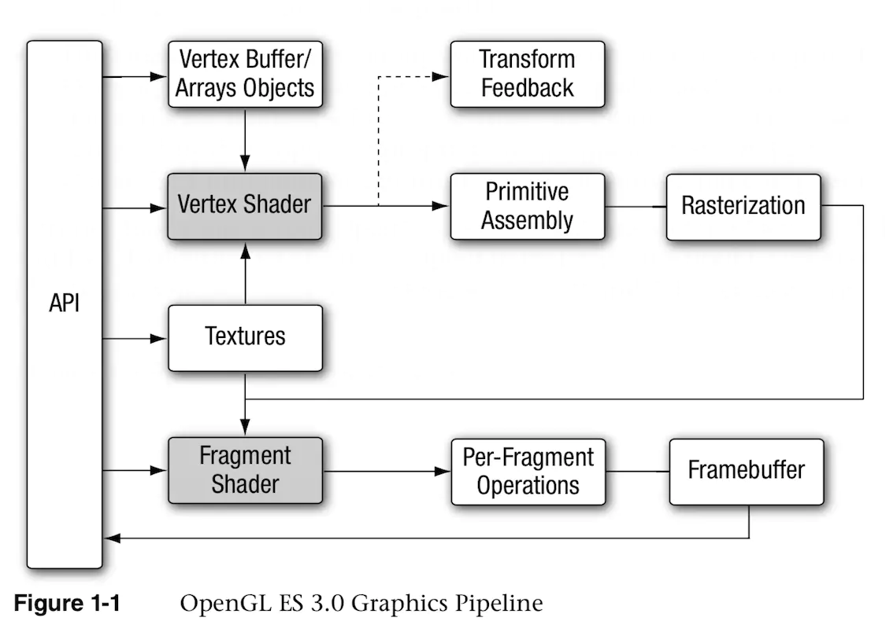
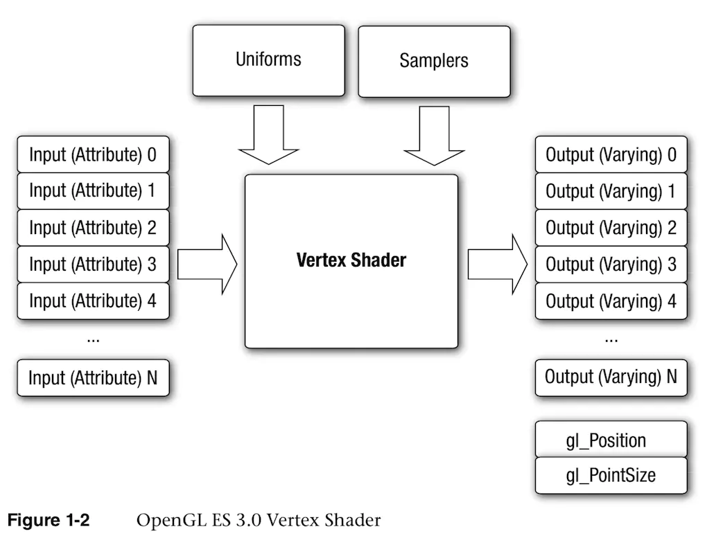
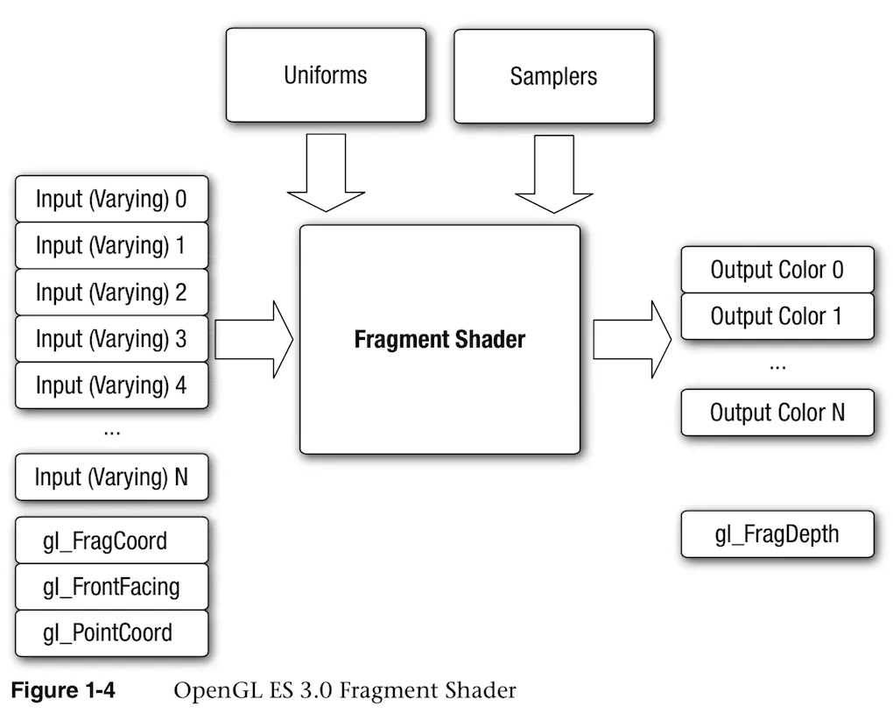

* * *

### 顶点着色器

顶点着色器负责的功能是把输入的数据进行**坐标变换，计算光照公式生成每个点颜色，计算纹理坐标**。并且把位置和纹理坐标发送到片元着色器。

#### 输入参数

* `attribute`：空间坐标、法向量、纹理坐标及顶点颜色。
* `uniform`：`uniform`保存由应用程序传递给着色器的只读常量数据。在顶点着色器中，这些数据通常是变换矩阵、光照参数、颜色等。由`uniform`修饰符修饰的变量属于全局变量。
* `sampler`：一种特殊的`uniform`，用于呈现纹理。`sampler`可用于顶点着色器和片元着色器。

#### 输出参数

* `varying`：用于存储顶点着色器的输出数据，`varying`变量会在光栅化处理阶段被线性插值。
* `gl_Position`：位置信息
* `gl_PointSize`：点大小

### 片元着色器

片元着色器的作用是处理由光栅化阶段生成的每个片元，最终计算出每个像素的最终颜色。归根结底，实际上就是数据的集合。这个数据集合包含每个像素的各个颜色分量和像素透明度的值。

#### 输入参数

* shader program：由`main`声明的一段程序源码，描述在片元上执行的操作。
* varying：顶点着色器阶段输出的`varying`变量在光栅化阶段被线性插值后输出到片元着色器作为它的输入。
* uniform：用于片元着色器的常量，如纹理参数等。
* sampler：一种特殊的`uniform`，用于呈现纹理。

#### 输出参数

`gl_FragColor`：在顶点着色器阶段只有唯一的`varying`输出变量`gl_FragColor`。
