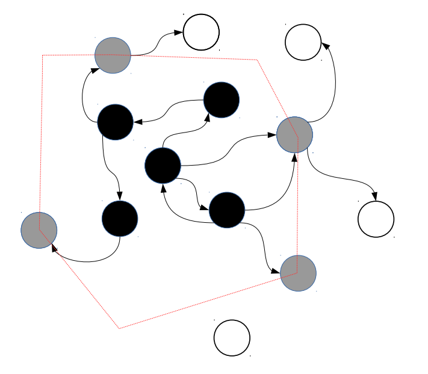

#### 垃圾回收
采用了自动内存管理。 这意味着你不用操心新创建的对象需要的内存如何分配出来， 也不用考虑在对象不再被使用后怎样释放它们所占用的内存。

Lua 运行了一个垃圾收集器来收集所有死对象 （即在 Lua 中不可能再访问到的对象）来完成自动内存管理的工作。 Lua 中所有用到的内存，如：字符串、表、用户数据、函数、线程、 内部结构等，都服从自动管理。
#### 垃圾回收器函数
```lua
-- collectgarbage("collect"): 做一次完整的垃圾收集循环。通过参数 opt 它提供了一组不同的功能
-- collectgarbage("count"): 以 K 字节数为单位返回 Lua 使用的总内存数。 这个值有小数部分，所以只需要乘上 1024 就能得到 Lua 使用的准确字节数（除非溢出）。
-- collectgarbage("restart"): 重启垃圾收集器的自动运行。
-- collectgarbage("setpause"): 将 arg 设为收集器的 间歇率。 返回 间歇率 的前一个值。
-- collectgarbage("setstepmul"): 返回 步进倍率 的前一个值。
-- collectgarbage("step"): 单步运行垃圾收集器。 步长"大小"由 arg 控制。 传入 0 时，收集器步进（不可分割的）一步。 传入非 0 值， 收集器收集相当于 Lua 分配这些多（K 字节）内存的工作。 如果收集器结束一个循环将返回 true 。
-- collectgarbage("stop"): 停止垃圾收集器的运行。 在调用重启前，收集器只会因显式的调用运行。

test = {"W","L","Q"}
print(collectgarbage("count"))

test = nil

print(collectgarbage("count"))

print(collectgarbage("collect"))

print(collectgarbage("count"))
```

#### gc 算法分析

Lua gc 采用的是**标记-清除**算法，即一次 gc 分两步：
* 在标记阶段，从根集对象开始标记，把整个对象层级都标记完，这些被标记到的对象称为可达到的对象。
* 在清除阶段，遍历上面提到的对象链表，如果对象被标记过则擦除标记并跳过，如果对象没有被标记说明他不可达到，那就把它释放掉。

lua5.1 开始采用了一种三色回收的算法

* 白色：表示对象未被标记，在 GC 周期开始之前对象为白色，如果到清除阶段还是白色，那就说明该对象不可到达，要被清除掉。
* 灰色：表示对象本身已标记，但它引用的对象未被标记，比如一个表已被标记，它的键值对象还未被标记。这表示对象标记的一个中间状态。
* 黑色：表示对象和它引用的对象都已被标记，在清除阶段黑色对象为可到达对象。

##### 对象链表
`global_State`有好多和 GC 相关的字段，其中有一些重要链表。所有 GC 对象总是在下面的链表中：
* `allgc`：所有未被标记为终结的对象
* `finobj`：所有标记为终结的对象
* `tobefnz`：所有准备终结的对象（准备调用`__gc`的对象）
* `fixedgc`：不会被回收的对象

正常情况下，新建对象都会进入`allgc`链表。

如果对象设置一个元表，且元表有`__gc`元方法，那么它会从`allgc`取出，加入到`finobj`去，并设置对象的`FINALIZEDBIT`标记为。

在标记阶段，`finobj`中的白对象会移到`tobefnz`链表去，然后标记这些对象，这样当前周期不会释放这些对象；清除完之后会进入`GCScallfin`阶段，在这里调用`tobefnz`对象的 gc 方法，同时把对象移回`allgc`链表；如果 gc 中使对象重新变成可到达，则对象复活过来；否则下个周期这个对象就会被正常清除。

`fixedgc`是那些不会被回收的对象，在新建完对象后，必须马上调用`luaC_fic`把对象从`allgc`移到`fixedgc`去。GC 的过程不会对`fixedgc`进行清除。



luajit 使用状态机来执行 gc 算法，共有 6 中状态：

* **`GCSpause`：** gc 开始阶段，初始化一些属性，将一些跟节点（主线程对象，主线程环境对象，全局对象等）push 到灰色链表中
* **`GCSpropagate`：** 分步进行扫描，每次从灰色链表 pop 一个对象，遍历该对象的子对象，例如如果该对象为 table，并且 value 没有设置为 week，则会遍历 table 所有 table 可达的 value，如果 value 为 gc 对象且为白色，则会被 push 到灰色链表中，这一步将一直持续到灰色链表为空的时候
* **`GCSatomic`：** 原子操作，因为`GCSpropagate`是分步的，所以分步过程中可能会有新的对象创建，这时候将再进行一次补充遍历，这遍历是不能被打断的，但因为绝大部分工作被`GCSpropagate`做了，所以过程会很快。新创建的没有被引用的`userdata`，如果该`userdata`自定义了 gc 元方法，则会加入到全局的`userdata`链表中，该链表会在最后一步`GCSfinalize`处理
* **`GCSsweepstring`：** 遍历全局字符串 hash 表，每次遍历一个 hash 节点，如果 hash 冲突严重，会在这里影响 gc。如果字符串为白色并且没有被设置为固定不释放，则进行释放
* **`GCSsweep`：** 遍历所有全局 gc 对象，每次遍历 40 个，如果 gc 对象为白色，将被释放
* **`GCSfinalize`：** 遍历`GCSatomic`生成的`userdata`链表，如果该`userdata`还存在 gc 元方法，调用该元方法，每次处理一个

#####  什么时候会导致 gc
`global_state`有两个字段是关于 Lua 的内存统计的：
```c++
l_mem totalbytes;
l_mem GCdebt;
```
在`lua_newstate`函数里，这两个字段初始为：
```c++
g->totalbytes = sizeof(LG);
g->GCdebt = 0;
```
在内存分配函数`luaM_realloc_`里，会根据分配或释放内存调整`GCdebt`的值：
```c++
void *luaM_realloc_(lua_State* L, void* block, size_t osize, size_t, nsize) {
    ...
    g->GCdebt = (g->GCdebt + nsize) - realosize;
    ...
}
```
判断是否触发 GC 的宏是：
```c++
#define lauC_condGC(L, pre, pos) \
    { if (G(L)->GCdebt > 0) { pre; luaC_step(L); pos; }; \
        condchangemem(L, pre, pos); }
```
`g->GCdebt`如果大于 0，就执行一次`luaC_step`。

##### 回收控制
`luaC_step`执行一步 GC：
```c++
void luaC_step(lua_State* L) {
    global_State* g = G(L);
    // 1. 计算 GC 的内存债务
    l_mem debt = getdebt(g);
    ...
    // 2. 循环执行 singlestep，知道 GC 周期完毕，或 debt 小于某个值
    do {
        lu_mem work = singlestep(L);
        debt -= work;
    } while (debt > -GCSTEPSIZE && g->gcstate != GCSpause);
    
    // 3. 如果 GC 结束，计算下一个阈值
    if (g->gcstate == GCSpause)
        setpause(g);
    else {
    // 4. 否则计算下一次触发的时机
        debt = (debt / g->gcstepmul) * STEPMULADJ;
        luaE_setdebt(g, debt);
        runafewinalizers(L);
    }
}
```

* * *

#### GC 的过程
Lua 会自动管理内存，它通过垃圾收集器回收掉不再使用的对象，所谓不再使用，可以简单理解为没有其他对象引用的对象。

Lua 使用简单的标记和清除的垃圾回收容器，每次完整的 GC 分为 4 个阶段：
* 标记（mark）：Lua 将根集对象标记为活的，根集对象实际上就是 C 注册表，像主线程和全局环境都是注册表的预定义项。从根集对象一直往下标记，任何存在于活对象中的对象，只要程序可达（弱表除外），也会被标记为活的。
* 清理（cleaning）：这一阶段，Lua 遍历那些未标记的对象，如果它们有终结函数，将它们移出到另一个列表中，后面第 4 个阶段会用到。接着遍历 Lua 弱表，把其中 key 或 value 未被标记的对象从弱表移除。
* 清除（sweep）：Lua 遍历所有对象，如表未被标记则回收掉，如果有标记则清除标记。
* 终结（finalization）：在清理阶段将有终结函数，且未被标记的对象都移到一个独立的列表中，这阶段就是遍历这个列表，并调用它们的终结函数。而这些未活的对象，实际上应该会在下一个 GC 周期才被回收掉。

在 Lua5.1 以上的版本，GC 被优化成增量式的，它和解释器交错运行，即每一个 GC 只执行一部分，这样就有效避免 GC 的时候解释器停顿太久。

##### 弱表
下面的例子能说明弱表的行为：
```lua
a = {}
mt = {__mode = 'k'} -- 设置为 k 表示 a 的 key 是弱引用；设置为 v 表示 value 是弱引用；设置为 kv 表示 key 和 value 都是弱引用
setmetatable(a, mt)

k1 = {}
a[k1] = 1
k2 = {}
a[k2] = 2
k1 = nil -- 将 k1 删除，k1 引用的那个表只存在于 a，但 a 是 key 的弱引用，所以这个表被 GC

collectgarbage()
for k, v in pairs(a) do print(v) end
-- > 2
```

##### 终结函数
就是元表有指定`__gc`元方法，如：
```lua
o = {x = 'hi'}
setmetatable(o, {__gc = function(o) print(o.x) end})
o = nil
collectgarbage() -- > hi
```

如果一个对象（有终结函数）在程序结束的时候还未被回收，Lua 会在结束的时候调用该对象的终结函数，可以利用这个特性来监控程序结束。
