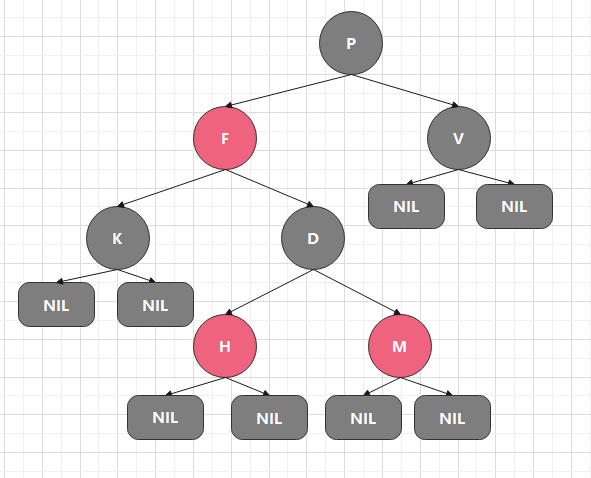
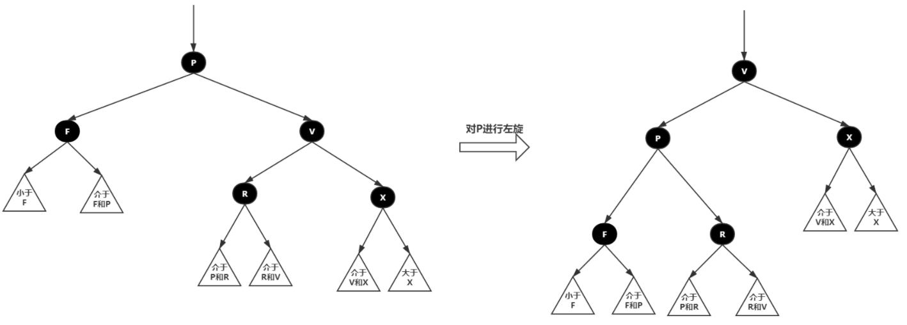
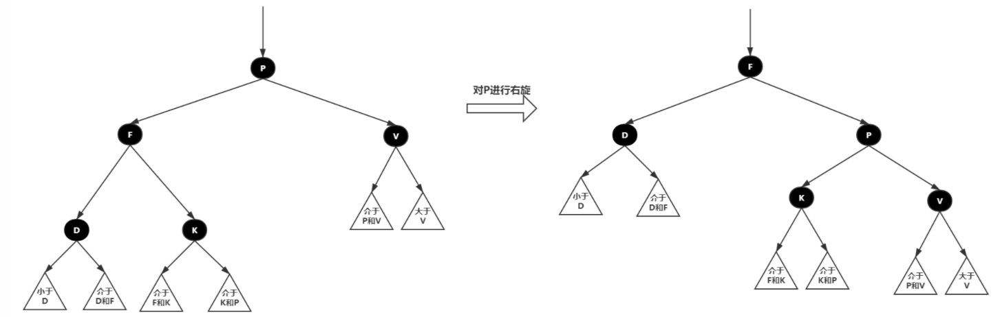

### 红黑树

虽然平衡树解决了二叉查找树退化为近似链表的缺点，不过不是最佳方案。因为平衡树要求每个节点的左子树和右子树的高度差至多等于1，这个要求实在是太严了，导致每次进行插入/删除节点的时候，几乎都会破坏平衡树的第二个规则，进而我们都需要通过左旋和右旋来进行调整，使之再次成为一颗符合要求的平衡树。显然，如果在那种插入、删除很频繁的场景中，平衡树需要频繁着进行调整，这会使平衡树的性能大打折扣，为了解决这个问题，于是有了红黑树。

### 红黑树的性质
* 每个节点要么是黑色，要么是红色
* 根节点是黑色
* 每个叶子节点（NIL）是黑色
* 每个红色节点的两个子节点一定都是黑色，不能有两个红色结点相连
* 任意一结点到每个叶子节点的路径都包含数量相同的黑节点




### 红黑树的数据结构

```c++
enum Color
{
    RED = 0,
    BLACK = 1
};

struct RBTreeNode{
    RBTreeNode * parent;
    RBTreeNode * left;
    RBTreeNode * right;
    int key;
    int data;
    Color color;
}
```

### 红黑树的时间复杂度

红黑树时间复杂度显然不会为最糟糕的$O(n)$，其操作时间复杂度最糟糕是$O(\log {n + 1})$，这是因为它在二叉查找树的基础上增加了着色和相关的性质使得红黑树相对平衡。对于红黑树，插入，删除，查找的平均复杂度都是$O(\log n)$，且不会随着节点数的增加而恶化。能保证在最坏情况下，基本的动态几何操作的时间均为$O(\log n)$。

### 红黑树保持平衡的三种操作

* 左旋：以某个节点作为指点（旋转节点），其右子节点变为旋转节点的父节点，右子节点的左子节点变为选装节点的右子节点，左子节点保持不变。
* 右旋：以某个节点作为支点（旋转节点），其左子节点变为旋转节点的父节点，左子节点的右子节点变为旋转节点的左子节点，右子节点保持不变。
* 变色：节点的颜色由红变黑或由黑边红。

**左旋**


**右旋**


