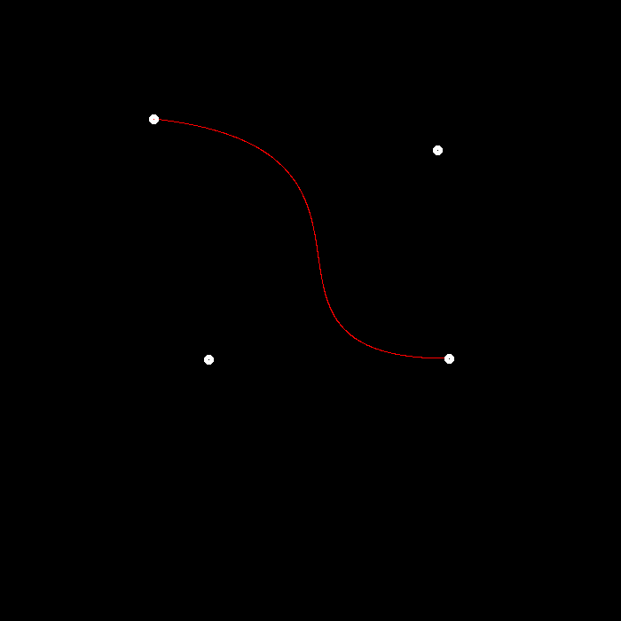

### de Castekjau Algorithm

<center>
    
    
</center>
如图所示，对于3阶的Bézier曲线在$t$时刻需要寻找3次插值点：第一次为$Q_0$，$Q_1$和$Q_2$；第二次为$R_0$和$R_1$；第三次为$B$，即曲线上的点。对应的伪代码如下：

```c++
recursive(插值点/控制点(points)，时刻(t))：
	// 递归终止条件
	只有一个插值点：
		return 该插值点；
	// 进行递归
	根据 插值点/控制点(points) 计算下一次的 插值点/控制点(_points);
	return recursive(插值点/控制点(_points), 时刻(t));
```

### 相关代码


```c++
cv::Point2f recursive_bezier(const std::vector<cv::Point2f>& control_points, float t)
{
    // TODO: Implement de Casteljau's algorithm
    if (control_points.size() == 1)
        return control_points[0];
    else
    {
        std::vector<cv::Point2f> points;
        for (auto i = 0; i < control_points.size() - 1; i += 1)
        {
            auto &p0 = control_points[i];
            auto &p1 = control_points[i + 1];
            points.emplace_back((1 - t) * p0 + t * p1);
        }
        return recursive_bezier(points, t);
    }
}
```

```c++
void bezier(const std::vector<cv::Point2f>& control_points, cv::Mat& window)
{
    // TODO: Iterate through all t = 0 to t = 1 with small steps, and call de Casteljau's 
    // recursive Bezier algorithm.
    for (double t = 0.0; t <= 1.0; t += 0.001)
    {
        auto point = recursive_bezier(control_points, t);

        window.at<cv::Vec3b>(point.y, point.x)[2] = 255;
    }
}
```

### 结果

<center>
    
</center>
