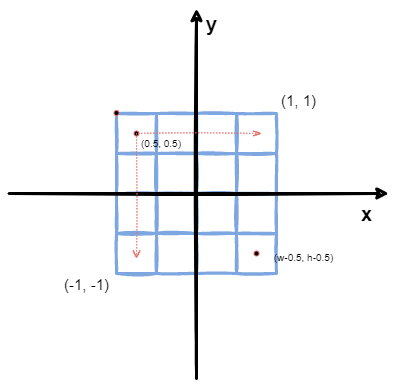
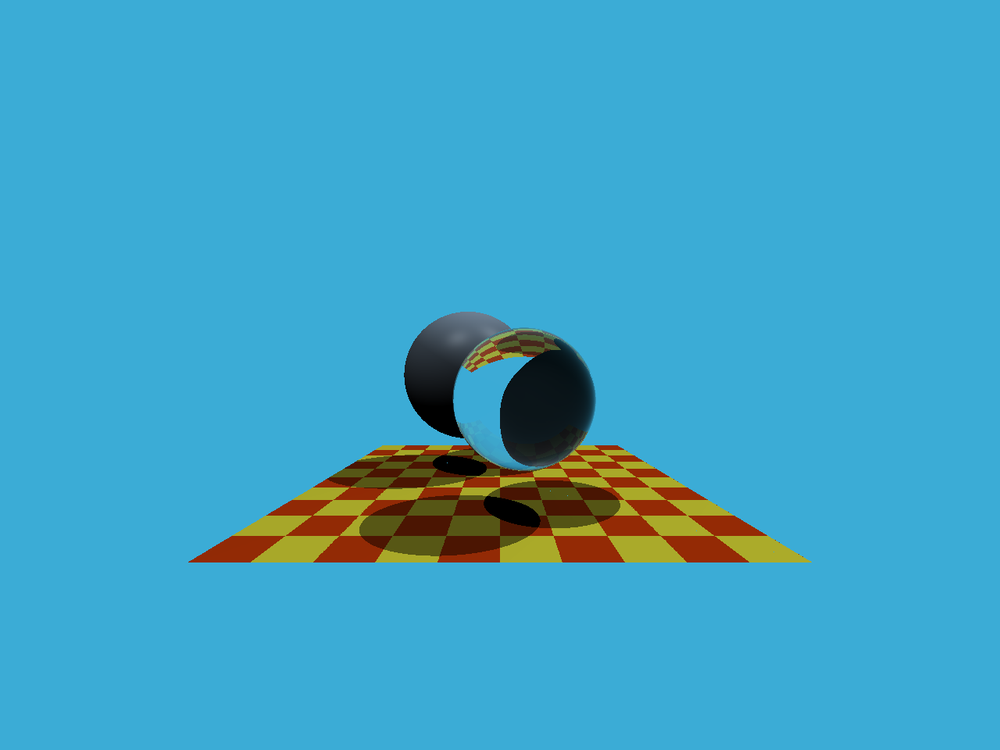

* 从`main`函数开始，定义场景的参数，添加物体（球体或三角形）到场景中，并设置其材质，然后将光源添加到场景中
* 调用`Render`函数。在遍历所有像素的循环里，生成对应的光线并将返回的颜色保存在中。在渲染过程结束后，帧缓冲区中的信息将被保存为图像
* 在生成像素对应的光线后，调用`CastRay`函数，该函数调用`trace`来查询光线与场景中最近的对象的交点

<!-- more -->

## 从摄像机位置向屏幕像素点发射光线

`Render`函数需要为每一个像素生成一条对应的光线，然后调用函数`castRay`来得到颜色，最后将颜色存储在帧缓冲区的相应像素中。 就是为屏幕上的每一个点生成一条由到屏幕上的点的方向向量，将屏幕上的点与近平面上的点一一对应即可：计算出像素点在近平面坐标系上的位置$(x_n, y_n)$；将$(x_n, y_n)$分别乘以近平面在$x$和$y$方向上的实际长度

<center>
    
</center>

如图，对于屏幕上的一个点$(i, j)$，如果屏幕长、宽分别占$w$、$h$个像素，可以计算出它在近平面坐标系上的坐标为：
$$
\begin{aligned}
x_n &= 2 \times \frac{i + 0.5}{w} - 1 \\\\
y_n &= 2 \times \frac{h - j - 1 + 0.5}{h} - 1 \\\\
\end{aligned}
$$

> 代码遍历是从`0`开始，需要加上`0.5`使其移动到像素中心，再进行坐标变换

由透视变换中的公式可得
$$
\begin{aligned}
h &= 2 \times \tan\left(\frac{fov}{2}\right) \times near \\\\
w &= aspect \times h \\\\
\end{aligned}
$$

```c++
void Renderer::Render(const Scene& scene)
{
    std::vector<Vector3f> framebuffer(scene.width * scene.height);

    float scale = std::tan(deg2rad(scene.fov * 0.5f));
    float imageAspectRatio = scene.width / (float)scene.height;

    // Use this variable as the eye position to start your rays.
    Vector3f eye_pos(0);
    int m = 0;
    for (int j = 0; j < scene.height; ++j)
    {
        for (int i = 0; i < scene.width; ++i)
        {
            // generate primary ray direction
            float x;
            float y;
            // TODO: Find the x and y positions of the current pixel to get the direction
            // vector that passes through it.
            // Also, don't forget to multiply both of them with the variable *scale*, and
            // x (horizontal) variable with the *imageAspectRatio*            
        x = (2 * (i + 0.5) / (float)scene.width - 1) * imageAspectRatio * scale;
            y = (1 - 2 * (j + 0.5) / (float)scene.height) * scale;
            Vector3f dir = Vector3f(x, y, -1) - eye_pos; // Don't forget to normalize this direction!
            dir = normalize(dir);
            framebuffer[m++] = castRay(eye_pos, dir, scene, 0);
        }
        //UpdateProgress(j / (float)scene.height);
    }

    // save framebuffer to file
    FILE* fp = fopen("binary.ppm", "wb");
    (void)fprintf(fp, "P6\n%d %d\n255\n", scene.width, scene.height);
    for (auto i = 0; i < scene.height * scene.width; ++i) {
        static unsigned char color[3];
        color[0] = (char)(255 * clamp(0, 1, framebuffer[i].x));
        color[1] = (char)(255 * clamp(0, 1, framebuffer[i].y));
    color[2] = (char)(255 * clamp(0, 1, framebuffer[i].z));
    //std::cout << '(' << color[0] << ", " << color[1] << "," << color[2] << ")" << std::endl;
        fwrite(color, 1, 3, fp);
    }
    fclose(fp);    
}
```

## 是否与三角形相交

`v0`，`v1`，`v2`是三角形的三个 顶点，`orig`是光线的起点，`dir`是光线单位化的方向向量，根据**Moller-Trumbore**算法来求解

$$
\mathbf{\vec{O}} + t\mathbf{\vec{D}} = (1 - b_1 - b_2)\mathbf{\vec{P}}_0 + b_1\mathbf{\vec{P}}_1 + b_2\mathbf{\vec{P}}_2
 \Rightarrow
\begin{bmatrix}
t \\\\
b_1 \\\\
b_2
\end{bmatrix} =
\frac{1}{\mathbf{\vec{S}}_1 \cdot \mathbf{\vec{E}}_1}
\begin{bmatrix}
\mathbf{\vec{S}}_2 \cdot \mathbf{\vec{E}}_2 \\\\
\mathbf{\vec{S}}_1 \cdot \mathbf{\vec{S}} \\\\
\mathbf{\vec{S}}_1 \cdot \mathbf{\vec{D}}
\end{bmatrix}
$$

其中

$$
\begin{aligned}
&\mathbf{\vec{E}}_1 = \mathbf{\vec{P}}_1 - \mathbf{\vec{P}}_0 \\\\
&\mathbf{\vec{E}}_2 = \mathbf{\vec{P}}_2 - \mathbf{\vec{P}}_0 \\\\
&\mathbf{\vec{S}} = \mathbf{\vec{O}} - \mathbf{\vec{P}}_0 \\\\
&\mathbf{\vec{S}}_1 = \mathbf{\vec{D}} \times \mathbf{\vec{E}}_2 \\\\
&\mathbf{\vec{S}}_2 = \mathbf{\vec{S}} \times \mathbf{\vec{E}}_1
&\end{aligned}
$$
$(1 - b_1 - b_2)$、$b_1$、$b_2$是重心坐标

```c++
bool rayTriangleIntersect(const Vector3f& v0, const Vector3f& v1, const Vector3f& v2, const Vector3f& orig,
                          const Vector3f& dir, float& tnear, float& u, float& v)
{
    // TODO: Implement this function that tests whether the triangle
    // that's specified bt v0, v1 and v2 intersects with the ray (whose
    // origin is *orig* and direction is *dir*)
    // Also don't forget to update tnear, u and v.
    auto e1 = v1 - v0;
    auto e2 = v2 - v0;
    auto s = orig - v0;
    auto s1 = crossProduct(dir, e2);
    auto s2 = crossProduct(s, e1);
    auto coeff = 1 / dotProduct(s1, e1);
    auto t = coeff * dotProduct(s2, e2);
    auto b1 = coeff * dotProduct(s1, s);
    auto b2 = coeff * dotProduct(s2, dir);
    if (t >= 0 && b1 >= 0 && b2 >= 0 && (1 - b1 - b2) >= 0)
    {
        tnear = t;
        u = b1;
        v = b2;
        return true;
    }
    return false;
}
```

## 最终结果

<center>
    
</center>
