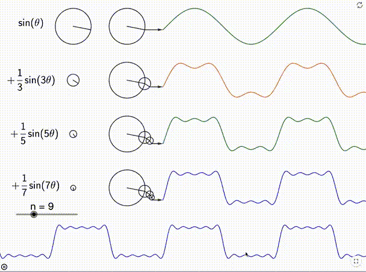
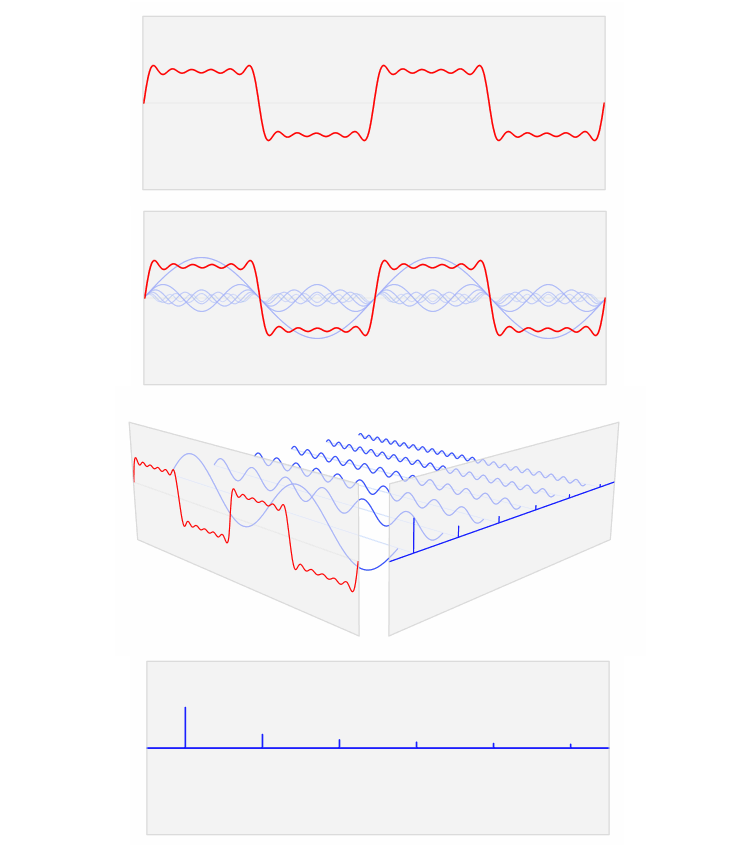
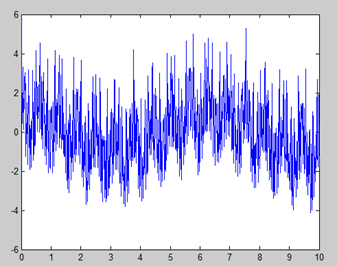
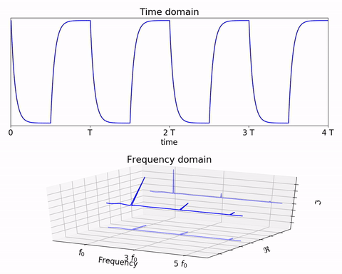
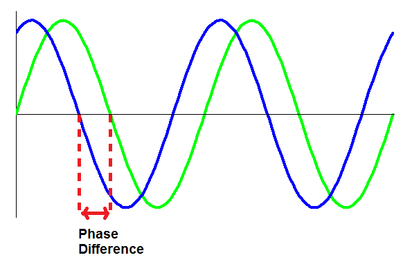
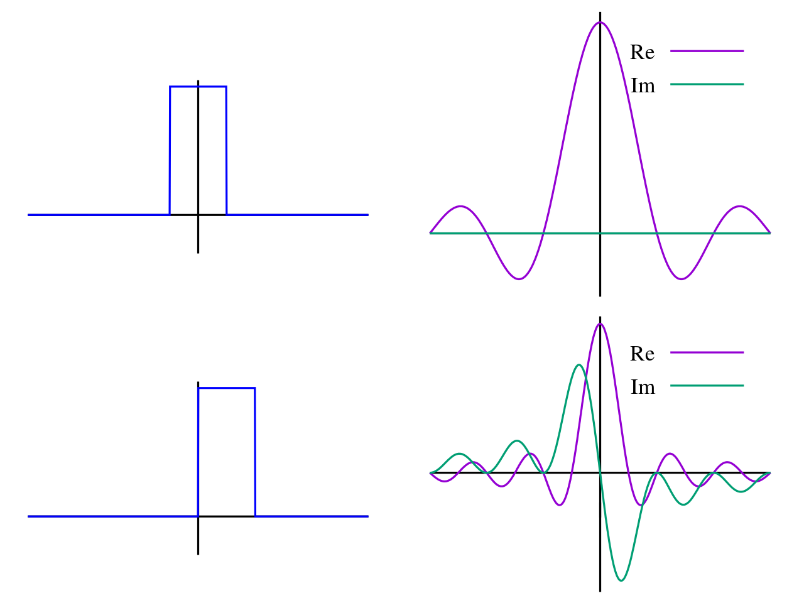
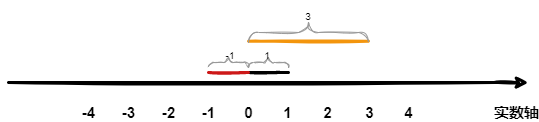
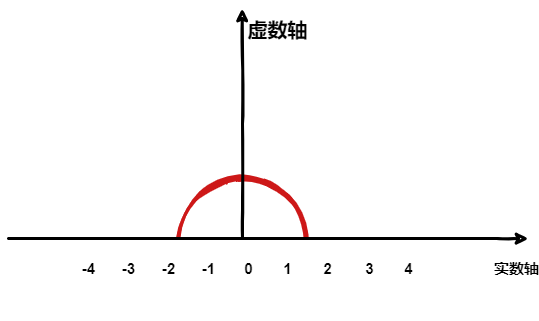
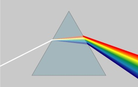
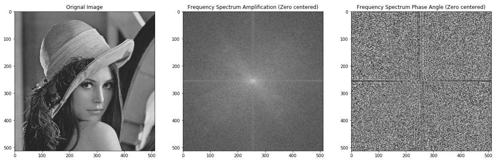

### 的频谱

>**正弦波**
>
>正弦波就是一个圆周运动在一条直线上的投影。所以频域的基本单元也可以理解为一个始终在旋转的圆
>
><center>
>    
></center>

<center>
    
</center>
如前两幅图所示，随着正弦波数量逐渐的增长，它们最终会叠加成一个标准的矩形。如果换一个角度来看，便会发现矩形波在频域的样子（即第四幅图）称为频域图像，也成为频谱。完整流程如下：

<center>
    
</center>

### 的的相位谱

#### 傅里叶分析的用处

##### 图像处理

* 图像增强与图像去噪
* 图像分割之边缘检测
* 图像特征提取
* 图像压缩

##### 工程应用

通过傅里叶变换和反变换，从一个完全杂乱无章的信号里面，可以提取出期望的低频信号，而滤掉了高频信号。

> 比如，检测到一个信号是这样的
>
> <center>
>     
> </center>
>
> 可能的曲线方程式为：
> $$
> f(x)=\cos(x)+\cos(10x)+\cos(50x)+\cos(100x)+\cos(500x)
> $$
> 需要把$\cos(500x)$从图像中剔除，在时域上很难完成，但是在频域反而很容易
>
> 所以很多在时域看似不可能做到的数学操作，而经过傅里叶变换，在频域相反很容易。尤其是从某条曲线中去除一些特定的频率成分，这在工程上称为滤波，是信号处理最重要的概念之一，只有在频域才能轻松的做到。

##### 求解微分方程

求解微分方程是一件相当麻烦的事情。因为除了要计算加减乘除，还要计算微分积分。而傅里叶变换则可以让微分和积分在频域中变为乘法和除法

#### 

<center>
    
</center>

通过时域到频域的变换，得到了一个从侧面看的频谱，但是这个频谱并没有包含时域中全部的信息。因为频谱只代表每一个对应的正弦波的振幅是多少，而没有提到相位。首先先明确的含义，在信号与系统中，代表的是正弦量的幅角，这里为初相角（三角函数$A\sin(\omega t + \psi)$中$\omega t + \psi$为相位，$\psi$为初相）。而表示的是随频率的变化情况，代表每个频率分量在时间原点所具有的。

> **相位谱的感性理解**
>
> 当船在大海中遇到多种波共同作用，由于每一种都可以被分解为多个固定频率波的叠加，故可简化为船只受到多种固定频率波叠加，姑且算做两个吧，如果这两个波的相对相位（若初始相位确定则相对相位也就确定了）不同，那么船的结果就可能完全不同。一维情况时，两个波来自于同一方向，若船恰好处于两个波同相点处，那此时波浪对船的作用最强，可能导致翻船，当然若船处于两个波的反相点处，波浪对船的作用最小，此处安全性最高（以船为分析对象，则对船来说，船的位置处算是零点，此处的相位也就是初相，两个波各自的初相不同时，那么此处综合信号强度不同对船的作用效果不同）。

时间差并不是相位差。如果将全部周期看作$2\pi$的话，相位差则是时间差在一个周期中所占的比例。将时间差除周期再乘$2\pi$，就得到了相位差。

<center>
    
</center>
将投影得到的时间差依次除以所在频率的周期，就得到了相位谱。所以，频谱是从侧面看，相位谱是从下面看。

### 

> 是一种线性积分变换，用于信号在时域（或空域）和频域之间的变换，在物理学和工程学中有许多应用。因其基本思想首先由法国学者约瑟夫·傅里叶系统地提出，所以以其名字来命名以示纪念。实际上傅里叶变换就像化学分析，确定物质的基本成分；信号来自自然界，也可对其进行分析，确定其基本成分。
>
> 经傅里叶变换生成的函数 $\hat {f}$ 称作原函数的${f}$ 傅里叶变换、亦称频谱。在许多情况下，傅里叶变换是可逆的，即可通过$\hat {f}$ 得到其原函数 ${f}$。通常情况下，${f}$是实数函数，而 $\hat {f}$  则是复函数，用一个复数来表示振幅和相位。
>
> “傅里叶变换”一词既指变换操作本身（将函数${f}$ 进行傅里叶变换），又指该操作所生成的复数函数（$\hat {f}$  是 ${f}$的傅里叶变换）。

，在时域是一个周期且连续的函数，而在频域是一个非周期离散的函数。，则是将一个时域非周期的连续信号，转换为一个在频域非周期的连续信号。

<center>
    
</center>

也可以换一个角度理解：傅里叶变换实际上是对一个周期无限大的函数进行傅里叶变换。

### 欧拉公式

>
>**虚数$\sqrt[]{i}=-1$的意义**
>
><center>
>
></center>
>
>在数轴上有一个黑色的线段，它的长度是 1。当它乘以 3 的时候，它的长度发生了变化，变成了橙色的线段，而当它乘以-1 的时候，就变成了红色的线段，或者说线段在数轴上围绕原点旋转了 180°。	
>
>乘-1 其实就是乘了两次 $i$使线段旋转了 180°，那么乘一次 $i$就是旋转了 90°。
>
><center>
>
></center>
>
>实数轴与虚数轴共同构成了一个复数的平面，也称复平面。

有了虚数轴的概念，欧拉公式如下：
$$
e^{i\theta} = \cos \theta + i \sin \theta
$$
这个公式关键的作用，是将正弦波统一成了简单的指数形式

欧拉公式所描绘的，是一个随着时间变化，在复平面上做圆周运动的点，随着时间的改变，在时间轴上就成了一条螺旋线。如果只看它的实数部分，也就是螺旋线在左侧的投影，就是一个最基础的余弦函数。而右侧的投影则是一个正弦函数。

### 指数形式的傅里叶变换

有了欧拉公式便知道：**正弦波的叠加**，也可以理解为**螺旋线的叠加**在实数空间的投影。**光波**就是螺旋线叠加的形象例子

<center>

</center>

但不同的是，傅里叶变换出来的频谱不仅仅是这样频率范围有限的叠加，而是频率从 0 到无穷所有频率的组合。

#### 再次理解正弦波

正弦波可以理解为螺线在实数轴的投影，还可以借助欧拉公式的另一种形式去理解：
$$
\begin{cases}
e^{i \theta} &= \cos \theta + i \sin \theta\\\\
e^{-i \theta} &= \cos \theta - i \sin \theta
\end{cases}
$$
将俩个式子相加再除 2，可得：
$$
\cos \theta = \frac{e^{i \theta} + e^{-i \theta}}{2}
$$
$e^{i \theta}$可以理解为一条逆时针旋转的螺旋线，那么$e^{-i \theta}$可以理解为一条顺时针旋转的螺旋线。而$\cos \theta$则是这两条旋转方向不同的螺旋线叠加的一半（）。这里，逆时针旋转的称为正频率，而顺时针旋转的称为负频率。

### 图像傅里叶变换和傅里叶逆变换原理及实现

任意信号，包括非周期信号都可以用傅里叶变换转到频域：

* 连续的：
  $$
  \begin{aligned}
  \text{fourier Transform: }f(k) =& \int^{-\infty}\_{\infty}{f(x)e^{-j2\pi kx}dx} \\\\
  \text{inverse fourier Transform: }f(x) =& \int^{-\infty}\_{\infty}{F(k)e^{j2\pi kx}dk}
  \end{aligned}
  $$

* 离散的：
  $$
  \begin{aligned}
  \text{fourier Transform: }F(x) =& \frac{1}{N}\sum^{N - 1}\_{x = 0}{f(x)e^{-j2 \pi kx / N}}, k = 0, 1, 2, \dots, N - 1 \\\\
  \text{inverse fourier transform: }f(x) =& \sum^{N - 1}\_{x = 0}{F(k)e^{j2\pi kx / N}}, x = 0, 1, 2, \dots, N - 1
  \end{aligned}
  $$
  

对图像进行傅里叶变换的原理如下公式：  
$$
F(u, v) = \sum^{H - 1}\_{x = 0}\sum^{W - 1}\_{y = 0}f(x, y)e^{-2j\pi(\frac{ux}{H} + \frac{vy}{W})}
$$

#### 相关代码

##### 普通图像的傅里叶变换结果

下面的代码显示了如何将输入图像进行傅里叶变换。傅里叶变换的结果是复数数组，展示了如何获取其实部和虚部，并求取其幅度。接下来，由于变换后图像的频谱分布具有中心对称性，将其频谱中心移到了图像的中间并进行显示。

```python
from PIL import Image
import numpy as np
import matplotlib.pyplot as plt
import cv2
from skimage.io import imread
from scipy.fftpack import ifftn, fft2, ifft2
import matplotlib.pyplot as plt
import matplotlib.cm as cm
import cmath
import warnings
%matplotlib inline
warnings.filterwarnings(action='ignore')
```

```python
def fliproi(img,ranges):
    roi=img[ranges[0]:ranges[1], ranges[2]:ranges[3]]
    roi=np.flip(roi,1)
    roi=np.flip(roi,0)
    img[ranges[0]:ranges[1], ranges[2]:ranges[3]]=roi
        
img=cv2.imread('./imgs/lena.png', cv2.IMREAD_GRAYSCALE)

def getShiftedFreqSpectrum(img):
    fimg=fft2(img, shape=img.shape, axes=tuple((0, 1)))
    fimgamp=np.abs(fimg)
    fimgphase=np.angle(fimg)
    roilen=img.shape[0]//2
    for y in [0,1]:
        for x in [0, 1]:
            ranges=[y*roilen, (y+1)*roilen,x*roilen,(x+1)*roilen]
            fliproi(fimgamp,ranges)
            fliproi(fimgphase,ranges)
    return fimg, fimgamp, fimgphase

def getFreqSpectrum(img):
    fimg=fft2(img, shape=img.shape, axes=tuple((0, 1)))
    fimgamp=np.abs(fimg)
    fimgphase=np.angle(fimg)
    return fimg, fimgamp, fimgphase

fimg,fimgamp, fimgphase=getShiftedFreqSpectrum(img)
```

```python
plt.figure(figsize=(20,20))
plt.subplot(1,3,1)
plt.imshow(img, cmap="gray")
plt.title("Orignal Image")
plt.subplot(1,3,2)
plt.imshow(np.log(fimgamp), cmap="gray")
plt.title("Frequency Spectrum Amplification (Zero centered)")
plt.subplot(1,3,3)
plt.imshow(np.abs(fimgphase), cmap="gray")
plt.title("Frequency Spectrum Phase Angle (Zero centered)")
plt.show()
```

<center>

</center>

***



[1] <a href="https://zhuanlan.zhihu.com/p/19763358?from=singlemessage&isappinstalled=1">傅里叶分析之掐死教程</a>

[2] <a href="https://www.zhihu.com/question/23175691/answer/24579168">关于傅里叶变换中的相位</a>

[3] <a href="https://github.com/yourwanghao/CMUComputationalPhotography/blob/master/class6/Notebook6.ipynb">图像的傅里叶变换</a>


