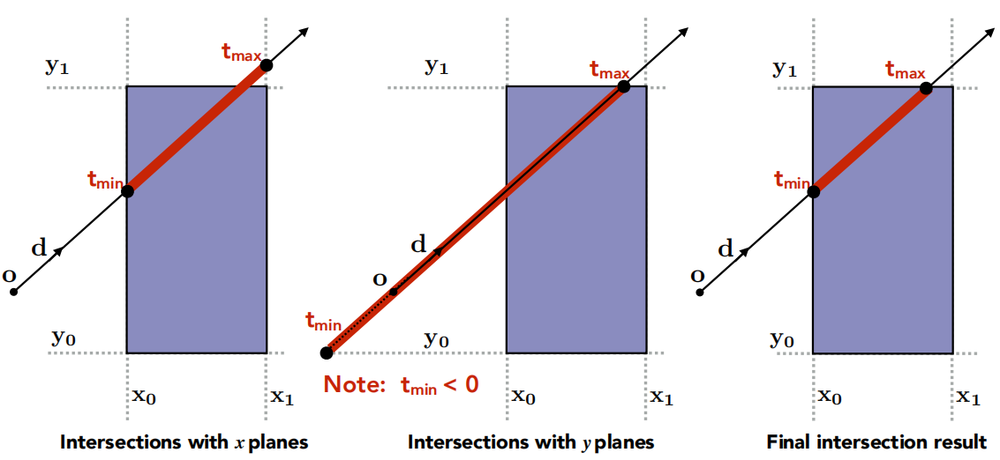
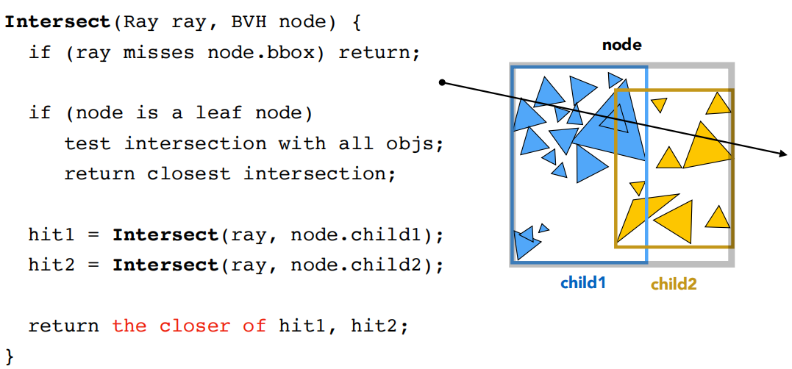
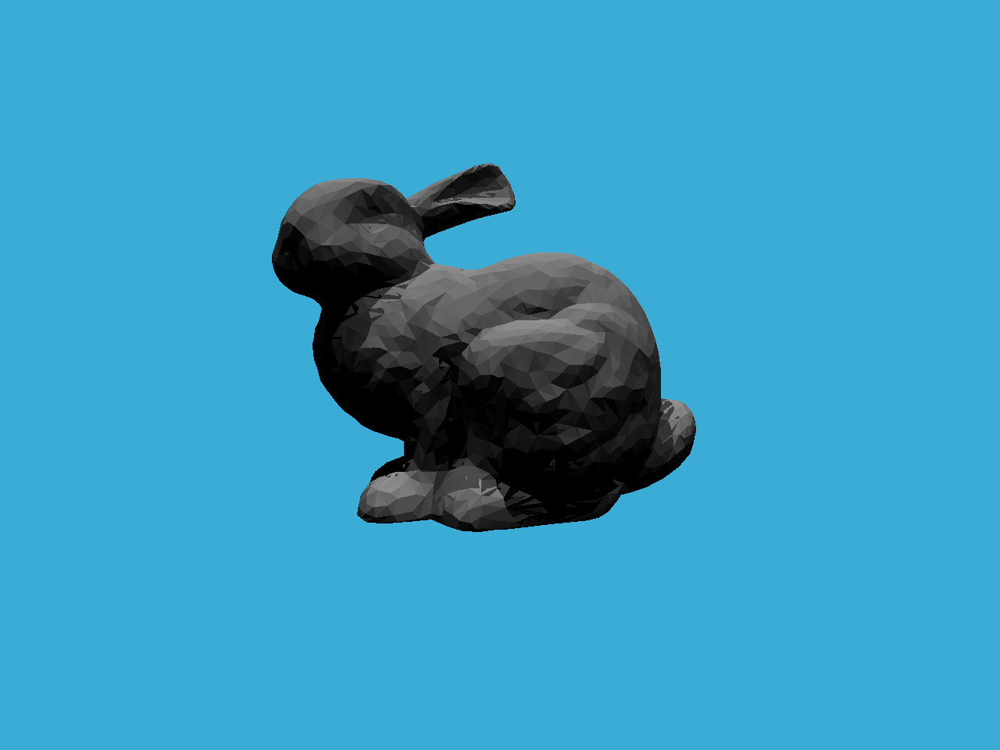

### 发射光线和与光线三角形求交

#### 发射光线

与 [Whitted Style Ray Tracing](https://silhouettesforyou.github.io/2021/11/22/21/) 中的`Render`函数相同

```c++
float x = (2 * (i + 0.5) / (float)scene.width - 1) * imageAspectRatio * scale;
float y = (1 - 2 * (j + 0.5) / (float)scene.height) * scale;
```

#### 光线与三角形相交

```c++
inline Intersection Triangle::getIntersection(Ray ray)
{
    Intersection inter;

    //
    // Moller-Trumbore 算法 
    //

    // TODO find ray triangle intersection

    if (t_tmp < 0)
        return inter;

    inter.happened = true;
    inter.coords = Vector3f(u * v0 + v * v1 + (1 - u - v) * v2);
    inter.normal = ray(t_tmp);
    inter.distance = t_tmp;
    inter.m = this->m;
    inter.obj = this;

    return inter;
}
```

* `happened`：光线是否与三角形相交

* `coords`：交点坐标

  * `Ray`重载了`()`运算符

    ```c++
    Vector3f operator()(double t) const
    {
        return origin + direction * t;
    }
    ```

* `normal`：三角形的法向量

* `distance`：时间既是距离，即`t_tmp`

* `m`：材质

* `obj`：代表三角形本身

### 是否与包围盒相交

<center>
    
</center>

空间中的射线可以由起点$\vec{O}$和时间$t$，以及方向$\vec{D}$组成：
$$
ray = \vec{O} + t\vec{D}
$$
考虑二维平面的情况，即
$$
\begin{cases}
x = x_0, \\\\
x = x_1, \\\\
y = y_0, \\\\
y = y_1.
\end{cases}
$$
那么针对$x$和$y$方向上的射线可以用如下方式描述：

$$
\begin{aligned}
x_0 &= \vec{O}_x + t\_{min}^x{\vec{D}_x} \\\\
x_1 &= \vec{O}_x + t\_{max}^x{\vec{D}_x} \\\\
y_0 &= \vec{O}_y + t\_{min}^y{\vec{D}_y} \\\\
y_1 &= \vec{O}_y + t\_{max}^y{\vec{D}_y}
\end{aligned}
$$

在三维空间中，使得光线经过包围盒的条件是：光线再包围盒上的两个点$t_{enter}$和$t_{exit}$在包围盒延展轴的里，即：
$$
\begin{cases}
t_{enter} = \max\\{t^x_{min}, t^y_{min}, t^z_{min}\\}, \\\\
t_{exit} = \min\\{t^x_{max}, t^y_{max}, t^z_{max}\\}, \\\\
t_{enter} \le t_{exit}, \\\\
t_{exit} \ge 0.
\end{cases}
$$
`dirIsNeg`表示光线在某个方向上的投影是否为反向（例如当`dirIsNeg[1] == 0`时，表示光传播方向在$y$轴上是负方向的），此时需要将$t_{min}$和$t_{max}$交换

```c++
inline bool Bounds3::IntersectP(const Ray& ray, const Vector3f& invDir, const std::array<int, 3>& dirIsNeg) const
{
    // invDir: ray direction(x,y,z), invDir=(1.0/x,1.0/y,1.0/z), use this because Multiply is faster that Division
    // dirIsNeg: ray direction(x,y,z), dirIsNeg=[int(x>0),int(y>0),int(z>0)], use this to simplify your logic
    // TODO test if ray bound intersects
    // according to the formula : P(t) = origin + direction * t
    float tx_min = (pMin.x - ray.origin.x) * invDir.x;
    float tx_max = (pMax.x - ray.origin.x) * invDir.x;

    float ty_min = (pMin.y - ray.origin.y) * invDir.y;
    float ty_max = (pMax.y - ray.origin.y) * invDir.y;

    float tz_min = (pMin.z - ray.origin.z) * invDir.z;
    float tz_max = (pMax.z - ray.origin.z) * invDir.z;

    if (!dirIsNeg[0])
    {
    	float t = tx_min;
    	tx_min = tx_max;
    	tx_max = t;
    }

    if (!dirIsNeg[1])
    {
    	float t = ty_min;
    	ty_min = ty_max;
    	ty_max = t;
    }

    if (!dirIsNeg[2])
    {
    	float t = tz_min;
    	tz_min = tz_max;
    	tz_max = t;
    }

    float t_enter = std::max(tx_min, std::max(ty_min, tz_min));
    float t_exit = std::min(tx_max, std::min(ty_max, tz_max));

    if (t_enter <= t_exit && t_exit >= 0)
    {
    	return true;
    }

    return false;
}
```

### BVH Traversal

BVH 本质上是把场景中的三角形用二叉树状的结构进行表示，中间结点包含这个结点所包含几何体的包围盒以及指向叶子结点的指针，叶子节点包含物体列表和包围盒，**当判断光线与物体是否相交时，只需要递归的判断包围盒是否与光线相交即可**：

<center>
    
</center>

```c++
Intersection BVHAccel::getIntersection(BVHBuildNode* node, const Ray& ray) const
{
    // TODO Traverse the BVH to find intersection
    Vector3f invDir = Vector3f{ 1.0f / ray.direction.x, 1.0f / ray.direction.y, 1.0f / ray.direction.z };
    std::array<int, 3> dirIsNeg = { ray.direction.x > 0, ray.direction.y > 0, ray.direction.z > 0 };
    if (!node->bounds.IntersectP(ray, invDir, dirIsNeg))
    {
    	return {};
    }

    if (node->left == nullptr && node->right == nullptr)
    {
    	return node->object->getIntersection(ray);
    }

    Intersection h1 = getIntersection(node->left, ray);
    Intersection h2 = getIntersection(node->right, ray);
    
    return h1.distance < h2.distance ? h1 : h2;
}
```

### 结果

<center>
    
</center>
