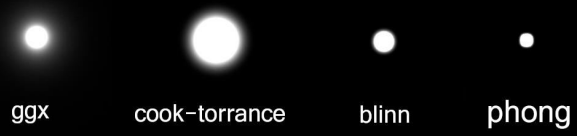
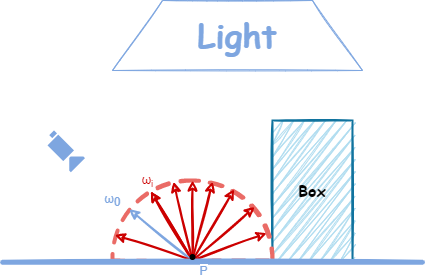
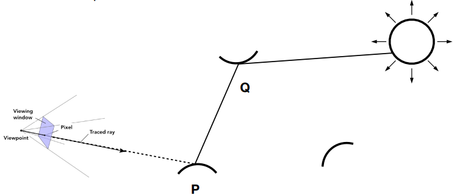
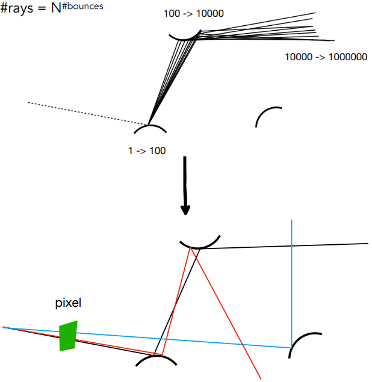
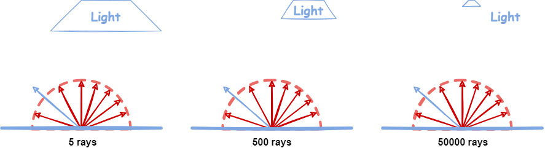

**在本次实验中，只需要修改这一个函数：**

* `castRay(const Ray ray, int depth)`in Scene.cpp：在其中实现Path Tracing算法

**可能用到的函数有：**

* `intersect(const Ray ray)`in Scene.cpp：求一条光线与场景的交点
* `sampleLight(Intersection pos, float pdf)` in Scene.cpp：在场景的所有光源上按面积 统一采样一个点，并计算该采样点的概率密度
* `sample(const Vector3f wi, const Vector3f N)` in Material.cpp：按照该材质的性质，给定入射方向与法向量，用某种分布采样一个出射方向
* `pdf(const Vector3f wi, const Vector3f wo, const Vector3f N)` in Material.cpp：给定一对入射、出射方向与法向量，计算 sample 方法得到该出射方向的概率密度
* `eval(const Vector3f wi, const Vector3f wo, const Vector3f N)` in Material.cpp：给定一对入射、出射方向与法向量，计算这种情况下的$f_r$值

**可能用到的变量有：**

* `RussianRoulette` in Scene.cpp： 

**Path Tracing伪代码**：

```c++
shade(p, wo)
    sampleLight(inter , pdf_light)
    Get x, ws, NN, emit from inter
    Shoot a ray from p to x
    If the ray is not blocked in the middle
    	L_dir = emit * eval(wo, ws, N) * dot(ws, N) * dot(ws, NN) / |x-p| ^2 / pdf_light
    L_indir = 0.0
    Test Russian Roulette with probability RussianRoulette
    wi = sample(wo, N)
    Trace a ray r(p, wi)
    If ray r hit a non -emitting object at q
    	L_indir = shade(q, wi) * eval(wo, wi, N) * dot(wi, N) / pdf(wo, wi, N) / RussianRoulette
    
    Return L_dir + L_indir
```

<!-- more -->

### Monte Carlo Integration

#### 概率相关知识

设$X$是一个随机变量，$x$是任意实数，则称$c(x) = P \\{X \le x \\},-\infty < x < \infty$为$X$的累计分布函数（Cumulative Distribution Function，CDF）。如果对于随机变量$X$的累计分布函数$c(x)$，存在非负函数$p(x)$，使对任意实数$x$，有
$$
c(x) = \int_{-\infty}^x{p(t)}dt
$$
则称$X$为连续性随机变量，其中函数$p(x)$称为$X$的，简称概率密度（Probability Distribution Function，PDF）。概率密度具有以下几个性质：

* $p(x) \ge 0$
* $\int_{-\infty}^{\infty} {p(t)dt} = 1$
* 对于任意实数$x_1,x_2(x_1 \le x_2)$，有$P\\{x_1 < X < x_2\\} = \int_{x_1}^{x_2} {p(t)dt}$
* 若$p(x)$在点$x$处连续，则有$c \prime (x) = p(x)$

设连续性随机变量$X$的概率密度函数为$p(x)$，若积分$\int_{-\infty}^{+\infty}{xp(x)dx}$绝对收敛，则称积分$\int_{-\infty}^{+\infty}{xp(x)dx}$的值为随机变量$X$的数学期望，记为$E(X)$，简称为期望：
$$
E(X) = \int_{-\infty}^{+\infty}{xp(x)dx}
$$
设$X$是一个随机变量，若存$E\Big\\{[X - E(X)]^2\Big\\}$在，则称它的值为$X$的方差，记为$D(X)$，即：
$$
D(X) = E\Big\\{[X - E(X)]^2\Big\\}\
$$
同时$X$的标准差或均方差为$\sqrt{D(X)}$，记为$\sigma(X)$，方差表示的是随机变量与其均值的偏移程度，随机变量的方差$X$可按下列公式计算:
$$
D(X) = E(X^2) - [E(X)]^2
$$

> ##### 几个定理
>
> **不等式**：设随机变量$X$具有数学期望$E(X) = \mu$，方差$D(X) = \sigma ^2$，则对于任意正数$\varepsilon$，不等式
> $$
> P\big\\{\left| X - \mu \right| \ge \varepsilon\big\\} \le \frac{\sigma ^2}{\varepsilon ^2}
> $$
> 成立。这一不等式称为切比雪夫不等式
>
> **辛钦大数定理**：设$X_1, X2, \cdots$是相互独立，服从同一分布随机变量序列，且具有数学期望$E(X_k) = \mu(k = 1, 2, \cdots)$，作前$n$个变量的算术平均$\frac{1}{n}\sum_{k = 1}^n{X_k}$，则对于任意$\varepsilon > 0$，有：
> $$
> \lim_{n \rightarrow \infty}{P\bigg\\{\left|\frac{1}{n}\sum\_{k = 1}^n{X_k - \mu}\right| < \varepsilon \bigg\\}} = 1
> $$
> **伯努利大数定理**：设$f_A$是$n$次独立重复试验中事件A发生的次数，$p$是事件A在每次试验中发生的概率，则对于任意正数$\varepsilon$，有：
> $$
> \lim_{n \rightarrow \infty}{P\bigg\\{\left|\frac{f_A}{n} - p\right| < \varepsilon \bigg\\}} = 1
> $$
> 辛钦大数定理解释了：在大量重复试验下，样本的平均值约等式总体的平均值。伯努利大数定理解释了：在大量重复试验下，样本的频率收敛于其概率。

#### 蒙特卡洛法积分

采用蒙特卡洛方法来计算函数积分，一般的定义为：设$X_1, X_2, \cdots, X_n$是相互独立的样本且服从同一分布，概率密度函数表示为$p(x)$，则函数的积分可以表示为：
$$
F_n(X) = \frac{1}{N}\sum_{k = 1}^N\frac{f(X_k)}{p(X_k)}
$$
这就是蒙特卡洛法积分的一般等式

### 重要性采样

是已知被积函数的一些分布信息而采用的一种缩减方差的策略，还有别的策略像，，等，是通过控制采样的策略达到缩减方差的目的

考虑一个简单的例子，设一个函数为
$$
f(x) = 
\begin{cases}
99 \quad x \in [0, 0.01) \\\\
1 \quad x \in [0.01,]
\end{cases}
$$

<script>
function func(x) {
  if (x < 0.01) {
  	return 99;
  } else {
  	return 1;
  }
}
function generateData() {
  let data = [];
  for (let i = 0; i <= 1; i += 0.001) {
    data.push([i, func(i)]);
  }
  return data;
}
function generateDottedLine() {
  let data = [];
  for (let i = 1; i <= 99; i += 2) {
    data.push([0.01, i]);
  }
  return data;
}
</script>
{% echarts 400 '85%' %}
option = {
  animation: true,
  grid: {
    top: 100,
    left: 50,
    right: 40,
    bottom: 50
  },
  xAxis: {
    name: 'x',
    minorTick: {
      show: true
    },
    minorSplitLine: {
      show: true
    }
  },
  yAxis: {
    name: 'y',
    min: 0,
    max: 100,
    minorTick: {
      show: true
    },
    minorSplitLine: {
      show: true
    }
  },
  series: [
    {
      type: 'scatter',
      showSymbol: false,
      clip: true,
      symbolSize: 1.5,
      data: generateData()
    },
    {
      type: 'scatter',
      showSymbol: false,
      clip: true,
      symbolSize: 1.5,
      data: generateDottedLine()
    }
  ]
};


采用蒙特卡洛法估计它的积分，选择区间$[0, 1]$之间的均匀分布作为它的随机数，那么存在绝大部分的采样点在区间$[0.01, 1]$之间，但是它对积分估计的贡献只有0.01，小部分采样点在区间$[0, 0.01)$之间，它对积分估计的贡献却非常的大，这种现象就会导致误差非常的大，简单提高采样数对估计量收敛的影响较小。那么，如果简单的选择一个采样策略：多采样区间$[0, 0.01)$的样本点，少采样$(0.01,1]$的样本点，这就违背了蒙特卡洛法的本质，产生的统计结果就没有任何意义。蒙特卡洛法的核心，是根据某一概率分布来随机采样。

#### GGX（Trowbridge-Reitz）分布

GGX即Trowbridge-Reitz分布，最初由Trowbridge和Reitz<sup>[Trowbridge 1975]</sup>推导出，在Blinn 1977年的论文 <sup>[Blinn 1977]</sup>中也有推荐此分布函数，但一直没有受到图形学界的太多关注。30多年后，Trowbridge-Reitz分布被Walter等人独立重新发现<sup>[Walter 2007]</sup>，并将其命名为GGX分布。之后，GGX分布采用风潮开始在电影<sup>[Burley 2012]</sup>和游戏<sup>[Karis 2013]，[Lagarde 2014]</sup>行业中广泛传播，成为了如今游戏行业和电影行业中最常用的法线分布函数。

<center>
    
</center>

GGX分布的公式为：
$$
D(m) = \frac{a^2}{\pi\big(1 + (m \cdot n)^2(a^2 - 1)\big)^2}
$$

### Path Tracing

#### A Simple Monte Carlo Solution

在直接光照的环境下，渲染下图中一个点

<center>
    
</center>

计算$p$点的在相机方向上的有以下渲染方程
$$
L_o(p, \omega_0) = \int_{\Omega^+}{L_i(p, \omega_i)f_r(p, \omega_i, \omega_o)(n \cdot \omega_i)d\omega_i}
$$
对于：$\int_a^b{f(x)dx \approx \frac{1}{N}\sum_{k = 1}^N{\frac{f(X_k)}{p(X_k)}}},X_k \sim p(x)$，$f(x)$就是$L_i(p, \omega_i)f_r(p, \omega_i, \omega_o)(n \cdot \omega_i)$，可以是$p(\omega_i) = \frac{1}{2\pi}$（在半球面上进行均匀采样）。所以$p$点的可以表示为：
$$
L_o(p, \omega_0) \approx \frac{1}{N}\sum_{i = 1}^N{\frac{L_i(p, \omega_i)f_r(p, \omega_i, \omega_o)(n \cdot \omega_i)}{p(\omega_i)}}
$$

#### 

<center>
    
</center>

可以写出如下伪代码：

```lua
shade(p, wo)
    Randomly choose N directions wi~pdf
    Lo = 0.0
    For each wi
        Trace a ray r(p, wi)
        If ray r hit the light
            Lo += (1 / N) * L_i * f_r * cosine / pdf(wi)
        Else If ray r hit an object at q
            Lo += (1 / N) * shade(q, -wi) * f_r * cosine / pdf(wi)
    Return Lo
```

##### Problem 1: Explosion of #rays as #bounces go up

但是光线的数量随着弹射的次数增加，以指数的量级增长#rays = N<sup>#bounces</sup>，所以假设每一个着色点只有一条光线，随之而来的就是会存在大量的噪音，通过增加经过每个像素的**paths**，再做的均值便可以减少噪音。

<center>
    
</center>

生成**paths**的伪代码如下：

```lua
ray_generation(camPos, pixel)
    Uniformly choose N sample positions within the pixel
    pixel_radiance = 0.0
    For each sample in the pixel
        Shoot a ray r(camPos, cam_to_sample)
        If ray r hit the scene at p
            pixel_radiance += 1 / N * shade(p, sample_to_cam)
    Return pixel_radiance
```

##### Problem 2: The recursive algorithm will never stop

可以通过（即以一个固定的概率$P$决定是否可以继续——是否发从相机处射射线），来解决递归算法无法结束的问题。如果采用RR的方法需要更改每一次后的值$L_o$，使得该点与实际相差不大。将$L_o$除以概率$P$，即$\frac{L_o}{P}$。那么可以求出$L_o$的期望，可以证明RR的合理性：
$$
E = P \times \frac{L_o}{P} + (1 - P) \times 0 = L_o
$$
可以写出如下伪代码：

```lua
shade(p, wo)
    Manually specify a probability P_RR
    Randomly select ksi in a uniform dist. in [0, 1]
    If (ksi > P_RR)
        return 0.0
    
    Randomly choose N directions wi~pdf
    Lo = 0.0
    For each wi
        Trace a ray r(p, wi)
        If ray r hit the light
            Lo += (1 / N) * L_i * f_r * cosine / pdf(wi) / P_RR
        Else If ray r hit an object at q
            Lo += (1 / N) * shade(q, -wi) * f_r * cosine / pdf(wi) / P_RR
    Return Lo
```

#### 

<center>
    
</center>

光源离物体越远，需要从相机发射的射线越多（在半球上采样次数越多）才能到达光源，这样会造成性能上的问题，可以通过对光源的采样来解决在半球上采样次数越多的问题，即对于直接光照，原来是从$x$点所在的半球进行采样，变成对$x^\prime$所在的光源平面采样。

<center>
    
</center>

此时为$\frac{1}{A}$（$\int{\frac{1}{A}dA = 1}$），但之前的渲染方程是对立体角进行积分，现在需要对面积进行积分。由上图和立体角的定义（）可得
$$
d\omega = \frac{dA\cos\theta^\prime}{\Arrowvert x^\prime - x\Arrowvert^2}
$$
此时渲染方程也可以写为：
$$
\begin{aligned}
L_o(p, \omega_0) &= \int_{\Omega^+}{L_i(p, \omega_i)f_r(p, \omega_i, \omega_o)(n \cdot \omega_i)d\omega_i} \\\\
&= \int_{A}{L_i(p, \omega_i)f_r(p, \omega_i, \omega_o)\frac{\cos\theta\cos\theta^\prime}{\Arrowvert x^\prime - x\Arrowvert^2}dA}
\end{aligned}
$$
现在的渲染迭代流程主要考虑以下两个部分：

* 光源能够直接到达的点，通过对光源采样后计算的$L_{dir}$（需要判断是否存在遮挡），同时不需要考虑RR
* 递归的间接光照$L_{indir}$，需要考虑RR

最终的伪代码如下：

```lua
shade(p, wo)

    # Contribution from the light source.
    Uniformly sample the light at x’ (pdf_light = 1 / A)
    Shoot a ray from p to x’
    If the ray is not blocked in the middle
        L_dir = L_i * f_r * cos θ * cos θ’ / |x’ - p|^2 / pdf_light
        
    # Contribution from other reflectors.
    L_indir = 0.0
    Test Russian Roulette with probability P_RR
    Uniformly sample the hemisphere toward wi (pdf_hemi = 1 / 2pi)
    Trace a ray r(p, wi)
    If ray r hit a non-emitting object at q
        L_indir = shade(q, -wi) * f_r * cos θ / pdf_hemi / P_RR
      
    Return L_dir + L_indir
```

### 相关代码


```c++
// Implementation of Path Tracing
Vector3f Scene::castRay(const Ray &ray, int depth) const
{
    // TO DO Implement Path Tracing Algorithm here
    Vector3f ldir = { 0, 0, 0 };
    Vector3f lindir = { 0, 0, 0 };

    Intersection objectInter = intersect(ray);
    if (!objectInter.happened)
    {
    	return {};
    }   

    if (objectInter.m->hasEmission())
    {
        return objectInter.m->getEmission();
    }

    Intersection lightInter;
    float lightPdf = 0.0f;
    sampleLight(lightInter, lightPdf);

    Vector3f obj2light = lightInter.coords - objectInter.coords;
    Vector3f obj2lightdir = obj2light.normalized();
    float distancePow2 = obj2light.x * obj2light.x + obj2light.y * obj2light.y + obj2light.z * obj2light.z;

    Ray obj2lightray = { objectInter.coords, obj2lightdir };
    Intersection t = intersect(obj2lightray);
    if (t.distance - obj2light.norm() > -EPSILON)
    {
        ldir = lightInter.emit * objectInter.m->eval(ray.direction, obj2lightdir, objectInter.normal) * dotProduct(obj2lightdir, objectInter.normal) * dotProduct(-obj2lightdir, lightInter.normal) / distancePow2 / lightPdf;
    }

    if (get_random_float() > RussianRoulette)
    {
        return ldir;
    }

    Vector3f obj2nextobjdir = objectInter.m->sample(ray.direction, objectInter.normal).normalized();
    Ray obj2nextobjray = { objectInter.coords, obj2nextobjdir };
    Intersection nextObjInter = intersect(obj2nextobjray);
    if (nextObjInter.happened && !nextObjInter.m->hasEmission())
    {
        float pdf = objectInter.m->pdf(ray.direction, obj2nextobjdir, objectInter.normal);
        lindir = castRay(obj2nextobjray, depth + 1) * objectInter.m->eval(ray.direction, obj2nextobjdir, objectInter.normal) * dotProduct(obj2nextobjdir, objectInter.normal) / pdf / RussianRoulette;
    }

    return ldir + lindir;
}
```

#### 相关函数

##### `Scene::sampleLight`→`MeshTriangle::Sample`→`BVHAccel::Sample`

最终结果是通过遍历BVH树到子节点，计算子节点光源`Object`的三角形面积，存在疑问？

##### `Material::sample`

* 首先在局部坐标系下的半球面上进行采样得到`localRay`$(r\cos\varphi, r\sin\varphi, z)$，其中$r = \sqrt{1 - z^2},z = |1 - 2x_1|$，$\varphi \in [0, 2\pi],x_1 \in [0, 1]$

  <script>
  function funcZ(x) {
    return Math.abs(1 - 2 * x);
  }
  function generateDataZ() {
    let dataZ = [];
    for (let i = 0; i <= 1; i += 0.001) {
      dataZ.push([i, funcZ(i)]);
    }
    return dataZ;
  }
  </script>
  {% echarts 400 '85%' %}
  option = {
    animation: true,
    grid: {
      top: 100,
      left: 50,
      right: 40,
      bottom: 50
    },
    xAxis: {
      name: 'x1',
      minorTick: {
        show: true
      },
      minorSplitLine: {
        show: true
      }
    },
    yAxis: {
      name: 'z',
      min: 0,
      max: 1,
      minorTick: {
        show: true
      },
      minorSplitLine: {
        show: true
      }
    },
    series: [
      {
        type: 'scatter',
        showSymbol: false,
        clip: true,
        symbolSize: 1.5,
        data: generateDataZ()
      },
    ]
  };
  
  
  $z$服从上图分布，限制了上半球。
  
* 然后通过该点的法向量$N$将`localRay`转换成世界坐标系中的向量

  > **Coordinate system from a vector**
  >
  > We can use the fact that the cross product gives a vector orthogonal to the two vectors to write a function that takes one vector and returns two new vectors so that the three of them form an orthonormal coordiante system. Specifically, all three of the vectors will be  to each other. Note that the other two vectors returned are only unique up to a rotation about the given vector. This function assumes that the vector passed in, $v_1$, has already been normalized. We first construct a perpendicular vector by zeroing one of the two components of the original vector and  the remaining two. Inspection of the two cases should make clear that $v_2$ will be normalized and that the dot product $(v_1 \cdot v_2)$ will be equal to zero. Given these two perpendicular vectors, one more cross product wraps things up to give us the third, which by definition of the cross product will be be perpendicular to the first two.
  >
  > ```c++
  > inline void CoordinateSystem(const Vector &v1, Vector *v2, Vector *v3) {
  >     if (fabsf(v1.x) > fabsf(v1.y)) {
  >         Float invLen = 1.f / sqrtf(v1.x*v1.x + v1.z*v1.z);
  >         *v2 = Vector(-v1.z * invLen, 0.f, v1.x * invLen);
  >     }
  >     else {
  >         Float invLen = 1.f / sqrtf(v1.y*v1.y + v1.z*v1.z);
  >         *v2 = Vector(0.f, v1.z * invLen, -v1.y * invLen);
  >     }
  >     *v3 = Cross(v1, *v2);
  > }
  > ```
  >
  > 

##### `Scene::intersect`

通过构建的BVH寻找射线与场景中物体的交点

##### `Material::pdf`

计算交点处的，在半球内的返回常数`0.5f / M_PI`

##### `Material::eval`

计算交点处的漫反射系数，在半球内的返回常数`Kd / M_PI`

### 结果

<center>
    
</center>

***


[1] <a href="https://pharr.org/matt/blog/images/pbr-2003.pdf">Physically Based Image Synthesis: Design and Implementation of A Rendering Sysytem</a>

