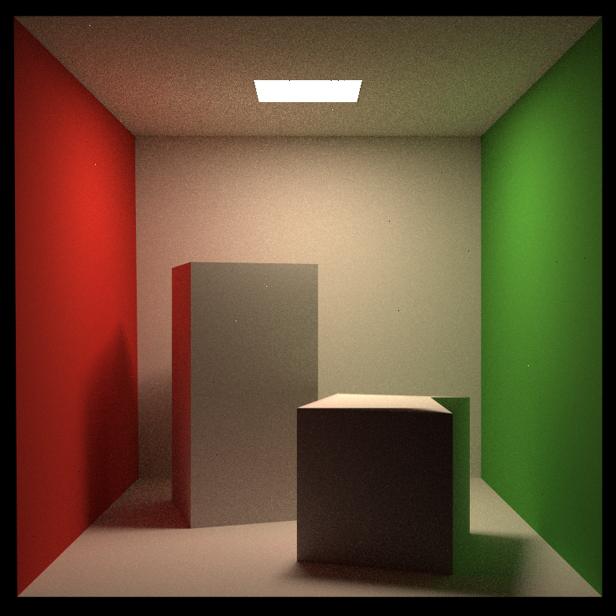

**在本次实验中，只需要修改这一个函数：**

* `castRay(const Ray ray, int depth)`in Scene.cpp：在其中实现Path Tracing算法

**可能用到的函数有：**

* `intersect(const Ray ray)`in Scene.cpp：求一条光线与场景的交点
* `sampleLight(Intersection pos, float pdf)` in Scene.cpp：在场景的所有光源上按面积 统一采样一个点，并计算该采样点的概率密度
* `sample(const Vector3f wi, const Vector3f N)` in Material.cpp：按照该材质的性质，给定入射方向与法向量，用某种分布采样一个出射方向
* `pdf(const Vector3f wi, const Vector3f wo, const Vector3f N)` in Material.cpp：给定一对入射、出射方向与法向量，计算 sample 方法得到该出射方向的概率密度
* `eval(const Vector3f wi, const Vector3f wo, const Vector3f N)` in Material.cpp：给定一对入射、出射方向与法向量，计算这种情况下的$f_r$值

**可能用到的变量有：**

* `RussianRoulette` in Scene.cpp： 

**Path Tracing伪代码**：

```c++
shade(p, wo)
    sampleLight(inter , pdf_light)
    Get x, ws, NN, emit from inter
    Shoot a ray from p to x
    If the ray is not blocked in the middle
    	L_dir = emit * eval(wo, ws, N) * dot(ws, N) * dot(ws, NN) / |x-p|^2 / pdf_light
    L_indir = 0.0
    Test Russian Roulette with probability RussianRoulette
    wi = sample(wo, N)
    Trace a ray r(p, wi)
    If ray r hit a non -emitting object at q
    	L_indir = shade(q, wi) * eval(wo, wi, N) * dot(wi, N) / pdf(wo, wi, N) / RussianRoulette
    
    Return L_dir + L_indir
```

<!-- more -->

### Monte Carlo Integration

#### 概率相关知识

设$X$是一个随机变量，$x$是任意实数，则称$c(x) = P \\{X \le x \\},-\infty < x < \infty$为$X$的累计分布函数（Cumulative Distribution Function，CDF）。如果对于随机变量$X$的累计分布函数$c(x)$，存在非负函数$p(x)$，使对任意实数$x$，有
$$
c(x) = \int_{-\infty}^x{p(t)}dt
$$
则称$X$为连续性随机变量，其中函数$p(x)$称为$X$的，简称概率密度（Probability Distribution Function，PDF）。概率密度具有以下几个性质：

* $p(x) \ge 0$
* $\int_{-\infty}^{\infty} {p(t)dt} = 1$
* 对于任意实数$x_1,x_2(x_1 \le x_2)$，有$P\\{x_1 < X < x_2\\} = \int_{x_1}^{x_2} {p(t)dt}$
* 若$p(x)$在点$x$处连续，则有$c \prime (x) = p(x)$

设连续性随机变量$X$的概率密度函数为$p(x)$，若积分$\int_{-\infty}^{+\infty}{xp(x)dx}$绝对收敛，则称积分$\int_{-\infty}^{+\infty}{xp(x)dx}$的值为随机变量$X$的数学期望，记为$E(X)$，简称为期望：
$$
E(X) = \int_{-\infty}^{+\infty}{xp(x)dx}
$$
设$X$是一个随机变量，若存$E\Big\\{[X - E(X)]^2\Big\\}$在，则称它的值为$X$的方差，记为$D(X)$，即：
$$
D(X) = E\Big\\{[X - E(X)]^2\Big\\}\
$$
同时$X$的标准差或均方差为$\sqrt{D(X)}$，记为$\sigma(X)$，方差表示的是随机变量与其均值的偏移程度，随机变量的方差$X$可按下列公式计算:
$$
D(X) = E(X^2) - [E(X)]^2
$$

> ##### 几个定理
>
> **不等式**：设随机变量$X$具有数学期望$E(X) = \mu$，方差$D(X) = \sigma ^2$，则对于任意正数$\varepsilon$，不等式
> $$
> P\big\\{\left| X - \mu \right| \ge \varepsilon\big\\} \le \frac{\sigma ^2}{\varepsilon ^2}
> $$
> 成立。这一不等式称为切比雪夫不等式
>
> **辛钦大数定理**：设$X_1, X2, \cdots$是相互独立，服从同一分布随机变量序列，且具有数学期望$E(X_k) = \mu(k = 1, 2, \cdots)$，作前$n$个变量的算术平均$\frac{1}{n}\sum_{k = 1}^n{X_k}$，则对于任意$\varepsilon > 0$，有：
> $$
> \lim_{n \rightarrow \infty}{P\bigg\\{\left|\frac{1}{n}\sum\_{k = 1}^n{X_k - \mu}\right| < \varepsilon \bigg\\}} = 1
> $$
> **伯努利大数定理**：设$f_A$是$n$次独立重复试验中事件A发生的次数，$p$是事件A在每次试验中发生的概率，则对于任意正数$\varepsilon$，有：
> $$
> \lim_{n \rightarrow \infty}{P\bigg\\{\left|\frac{f_A}{n} - p\right| < \varepsilon \bigg\\}} = 1
> $$
> 辛钦大数定理解释了：在大量重复试验下，样本的平均值约等式总体的平均值。伯努利大数定理解释了：在大量重复试验下，样本的频率收敛于其概率。

#### 蒙特卡洛法积分

采用蒙特卡洛方法来计算函数积分，一般的定义为：设$X_1, X_2, \cdots, X_n$是相互独立的样本且服从同一分布，概率密度函数表示为$p(x)$，则函数的积分可以表示为：
$$
F_n(X) = \frac{1}{N}\sum_{k = 1}^N\frac{f(X_k)}{p(X_k)}
$$
这就是蒙特卡洛法积分的一般等式

### 重要性采样

是已知被积函数的一些分布信息而采用的一种缩减方差的策略，还有别的策略像，，等，是通过控制采样的策略达到缩减方差的目的

考虑一个简单的例子，设一个函数为
$$
f(x) = 
\begin{cases}
99 \quad x \in [0, 0.01) \\\\
1 \quad x \in [0.01,]
\end{cases}
$$

<script>
function func(x) {
  if (x < 0.01) {
  	return 99;
  } else {
  	return 1;
  }
}
function generateData() {
  let data = [];
  for (let i = 0; i <= 1; i += 0.001) {
    data.push([i, func(i)]);
  }
  return data;
}
function generateDottedLine() {
  let data = [];
  for (let i = 1; i <= 99; i += 2) {
    data.push([0.01, i]);
  }
  return data;
}
</script>
{% echarts 400 '85%' %}
option = {
  animation: true,
  grid: {
    top: 100,
    left: 50,
    right: 40,
    bottom: 50
  },
  xAxis: {
    name: 'x',
    minorTick: {
      show: true
    },
    minorSplitLine: {
      show: true
    }
  },
  yAxis: {
    name: 'y',
    min: 0,
    max: 100,
    minorTick: {
      show: true
    },
    minorSplitLine: {
      show: true
    }
  },
  series: [
    {
      type: 'scatter',
      showSymbol: false,
      clip: true,
      symbolSize: 1.5,
      data: generateData()
    },
    {
      type: 'scatter',
      showSymbol: false,
      clip: true,
      symbolSize: 1.5,
      data: generateDottedLine()
    }
  ]
};


采用蒙特卡洛法估计它的积分，选择区间$[0, 1]$之间的均匀分布作为它的随机数，那么存在绝大部分的采样点在区间$[0.01, 1]$之间，但是它对积分估计的贡献只有0.01，小部分采样点在区间$[0, 0.01)$之间，它对积分估计的贡献却非常的大，这种现象就会导致误差非常的大，简单提高采样数对估计量收敛的影响较小。那么，如果简单的选择一个采样策略：多采样区间$[0, 0.01)$的样本点，少采样$(0.01,1]$的样本点，这就违背了蒙特卡洛法的本质，产生的统计结果就没有任何意义。蒙特卡洛法的核心，是根据某一概率分布来随机采样。

#### GGX（Trowbridge-Reitz）分布

GGX即Trowbridge-Reitz分布，最初由Trowbridge和Reitz<sup>[Trowbridge 1975]</sup>推导出，在Blinn 1977年的论文 <sup>[Blinn 1977]</sup>中也有推荐此分布函数，但一直没有受到图形学界的太多关注。30多年后，Trowbridge-Reitz分布被Walter等人独立重新发现<sup>[Walter 2007]</sup>，并将其命名为GGX分布。之后，GGX分布采用风潮开始在电影<sup>[Burley 2012]</sup>和游戏<sup>[Karis 2013]，[Lagarde 2014]</sup>行业中广泛传播，成为了如今游戏行业和电影行业中最常用的法线分布函数。
GGX分布的公式为：
$$
D(m) = \frac{a^2}{\pi\big(1 + (m \cdot n)^2(a^2 - 1)\big)^2}
$$
### Path Tracing


```c++
// Implementation of Path Tracing
Vector3f Scene::castRay(const Ray &ray, int depth) const
{
    // TO DO Implement Path Tracing Algorithm here
    Vector3f ldir = { 0, 0, 0 };
    Vector3f lindir = { 0, 0, 0 };

    Intersection objectInter = intersect(ray);
    if (!objectInter.happened)
    {
    	return {};
    }   

    if (objectInter.m->hasEmission())
    {
        return objectInter.m->getEmission();
    }

    Intersection lightInter;
    float lightPdf = 0.0f;
    sampleLight(lightInter, lightPdf);

    Vector3f obj2light = lightInter.coords - objectInter.coords;
    Vector3f obj2lightdir = obj2light.normalized();
    float distancePow2 = obj2light.x * obj2light.x + obj2light.y * obj2light.y + obj2light.z * obj2light.z;

    Ray obj2lightray = { objectInter.coords, obj2lightdir };
    Intersection t = intersect(obj2lightray);
    if (t.distance - obj2light.norm() > -EPSILON)
    {
        ldir = lightInter.emit * objectInter.m->eval(ray.direction, obj2lightdir, objectInter.normal) * dotProduct(obj2lightdir, objectInter.normal) * dotProduct(-obj2lightdir, lightInter.normal) / distancePow2 / lightPdf;
    }

    if (get_random_float() > RussianRoulette)
    {
        return ldir;
    }

    Vector3f obj2nextobjdir = objectInter.m->sample(ray.direction, objectInter.normal).normalized();
    Ray obj2nextobjray = { objectInter.coords, obj2nextobjdir };
    Intersection nextObjInter = intersect(obj2nextobjray);
    if (nextObjInter.happened && !nextObjInter.m->hasEmission())
    {
        float pdf = objectInter.m->pdf(ray.direction, obj2nextobjdir, objectInter.normal);
        lindir = castRay(obj2nextobjray, depth + 1) * objectInter.m->eval(ray.direction, obj2nextobjdir, objectInter.normal) * dotProduct(obj2nextobjdir, objectInter.normal) / pdf / RussianRoulette;
    }

    return ldir + lindir;
}
```


### 结果

<center>
    
</center>
