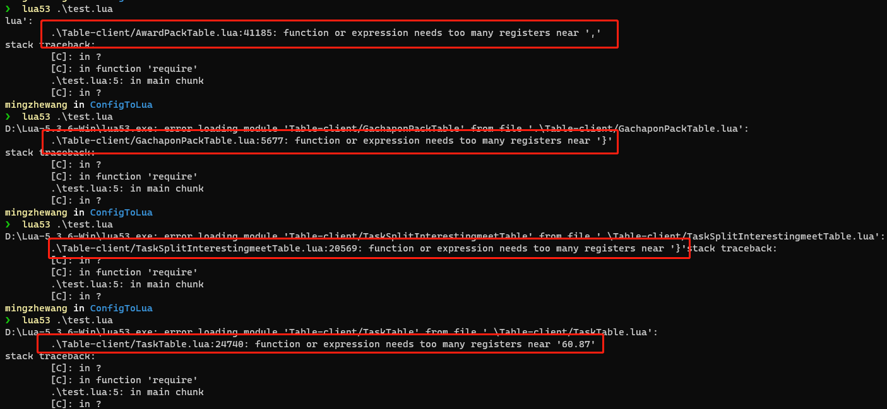

## Git相关


### 相关命令

* 分支

  * git回退本地修改

    ```sh
    git checkout <filename>
    git checkout .
    ```

  * 切换到分支

    ```sh
    git checkout <branch> # 切换到<branch>分支
    git checkout -b <branch> # 创建<branch>分支并切换到该分支
    ```

* 清空git缓存

  ```sh
  git rm -r --cached .
  ```

* 日志

  ```sh
  git log
  ```

  * `-<n>`：显示日志（q退出），显示n条日志
  * `--stat`：每个提交都列出了修改过的文件，以及其中添加和移除的行数，并在最后列出所有增减行数
  * `author`：显示指定作者的提交
  * `--grep`：过滤提交说明中的文字
  * `--<path>`：如果只关心某个文件或者目录的历史提交，可以在`git log`最后指定路径

* 比较工作区和上个提交版本的区别

  ```sh
  git diff <filename>
  ```

* 拉取

  ```sh
  git fetch # 拉取所有分支的变化
  git fetch -p # 拉取所有分支的变化，并将远端不存在的分支同步移除
  git fetch <origin master> # 拉取指定分支的变化
  ```

* 回滚

  ```sh
  git reset # 将提交记录回滚，代码不回滚
  git reset --hard # 将提交记录和代码全部回滚
  ```

* 

  ```sh
  git stash # 将当前工作区的状态存储下来
  git stash list # 查看当前有多少stash
  git stash apply --index # 把某一个stash应用回当前的分支
  git stash -include-untracked # 有些文件没有在git的track里，可以添加参数来存储对应的文件
  ```

  

* 查看某个hash所对应的object中的内容

  ```sh
  git cat-file -p <commit_id>
  ```

### Hexo部署的博客Git提交到Github账户错乱的问题

由于通过**SmartGit**设置了和（工作用的Git账号和邮箱）导致提交到Github上的版本不是自己的账户


* * *

#### 解决方法

在博客目录下找到`.deploy_git`目录（没有的话用`hexo g`生成一下就可以），然后可以看到当前目录的用户名和邮箱与自己的不一致，通过以下命令可以更改为一致的用户名和邮箱：

```shell
git config user.name SilhouettesForYou
git config user.email mgze.wang@gmail.com
```


之后再进行博客的便可以用正确的用户提交到Github

### Git文件目录结构解析

```sh
.git 
|-- COMMIT_EDITMSG  //提交commit时的信息记录
|-- FETCH_HEAD  // 记录了上次fetch的分支的commit的HASH
|-- HEAD   //记录了当前头指针在.git存储的地址，如refs/heads/brancha
|-- ORIG_HEAD 
|-- branches
|-- config  //一些开关&记录了所有分支的fetch&merge的策略，在checkout -b或--set-upstream-to
            //时将向config中添加本地分支对应的远端分支信息
|-- description
|-- hooks  //hook脚本的存储位置，里面有一些sample脚本
|   |-- applypatch-msg.sample
|   |-- commit-msg.sample
|   |-- post-update.sample
|   |-- pre-applypatch.sample
|   |-- pre-commit.sample
|   |-- pre-push.sample
|   |-- pre-rebase.sample
|   |-- prepare-commit-msg.sample
|   |-- update.sample
|-- index
|-- info
|   `-- exclude
|-- logs  // 头指针改变的日志文件
|   |-- HEAD  // 对于整个仓库的头指针改变的记录
|   `-- refs
|       |-- heads  // 对于单个本地仓库头指针改变的记录(会记录包含冲突的状态)
|       |   |-- brancha
|       |   |-- branchb
|       |   `-- main
|       `-- remotes   
|           `-- origin
|               |-- HEAD
|               |-- brancha
|               `-- branchb
|-- objects //所有commit、tree、...的快照,将commit的HASH值的前两位作为文件夹名，后面的值作为快照名
|   |-- 12 //commit的HASH值的前两位
|   |   `-- d4b6c73ffad196c6972c93e5ce9e691e5862c0  //commit的HASH值除了前两位
|   |-- 1d
|   |   `-- b538af883f712194118c2d98eb63422dc62d94
|   |-- 21
|   |   `-- a23a99b0430e5a7aa5cdd8c56012f89318c9fe
|   |-- 2c
|   |   `-- 0b785731151d48705e4985aad2520f21c36bbb
|   |-- 3b
|   |   `-- 18e512dba79e4c8300dd08aeb37f8e728b8dad
|   |-- info
|   `-- pack
|       |-- pack-0aa3e5057acbdff932634f63ea390953828409dd.idx
|       `-- pack-0aa3e5057acbdff932634f63ea390953828409dd.pack
|-- packed-refs
`-- refs  // 头指针等信息的记录
    |-- heads  //记录了每个本地分支当前头指针所在commit的HASH
    |   |-- brancha
    |   |-- branchb
    |   `-- main
    |-- remotes  //记录了每个远程分支当前头指针所在commit的HASH
    |   `-- origin
    |       |-- HEAD
    |       |-- brancha
    |       `-- branchb
    `-- tags
```

### Git切换远端分支

#### 查看所有分支

```sh
git branch -a | grep key-word

git branch -a | grep skilltest
remotes/origin/feature_4it01_skilltesttools
remotes/origin/feature_ghs_4it01_skilltesttools
```

> `git branch`不带参数,列出本地已经存在的分支，并且在当前分支的前面用`*`标记，加上-a参数可以查看所有分支列表，包括本地和远程，远程分支一般会用红色字体标记出来
>  如果用`git branch -a`没有显示全部的远程分支，可以通过`git fetch`将本地远程跟踪分支进行更新，与远程分支保持一致

#### 新建分支并切换到指定分支

```sh
git checkout -b feature_4it01_skilltesttools origin/feature_4it01_skilltesttools
```

该命令可以将远程git仓库里的指定分支拉取到本地，这样就在本地新建了一个`feature_4it01_skilltesttools`分支，并和指定的远程分支`origin/feature_4it01_skilltesttools`关联了起来。

#### 查看本地分支及追踪的分支

```sh
git branch -vv
develop                      98e306d76c5 [origin/develop: behind 1461] [AUTO COMMIT OFFLINES]commit by tools
* feature_4it01_skilltesttools c44dbb8584f [origin/feature_4it01_skilltesttools] Merge branch 'all.dev.ep7' into all.ep7.it01
```

`*`表示当前所在分支，[远程分支]表示当前本地分支追踪的远程分支，最后一个是最近一次提交的注释。

### `git cherry-pick`用法

对于多分支的代码库，将代码从一个分支转移到另一个分支是常见需求。如果需要另一个分支的所有代码变动，那么就采用`git merge`；如果只需要部分代码变动（某几个提交），这时可以采用`git cherry-pick`，它的功能是把已经存在的**commit**进行挑选，然后重新提交。

#### 转移一个提交

* 先切换到A分支`git checkout A`
* 找到这次提交`git log`，赋值`<hash code>`
* 再切换到B分支`git chekcou B`
* 把A分支下的至此提交重新提交到B分支下`git cherrt-pick <hash code>`

当执行完 `git cherry-pick`以后，将会生成一个新的提交，这个新的提交的hash值和原来的不同，但标志名称一样。

#### 转移多个提交

```sh
git cherry-pick <hash code 1> <hash code 2>
git cherry-pick <hash code begin>..<hash code end> # 左开右闭，顺序必须正确
git cherry-pick <hash code begin>^..<hash code end> # 左闭右闭
```

## Unity相关

### 几种`Update`方法的区别

#### Update

`Update`是在每次渲染新的一帧的时候才会调用

#### FixedUpdate

该函数用于固定更新，在游戏运行的过程中，每一帧的处理时间是不固定的，当需要固定间隔时间执行某些代码时，就会用到`FixedUpdate()`函数

#### LastUpdate

该函数是延迟更新函数，处于激活状态虾的脚本在每一帧里都会在`Update()`函数执行后调用该函数，通常用来调正代码执行的顺序。比如玩家的角色需要一个摄像机来跟随，那么通常角色的移动逻辑会写在`Update()`里，而摄像机跟随写在`LastUpdate()`里。这样可以确保在角色的位置计算完毕后，再根据角色位置确定摄像机的位置和视角

### Unity3D内存管理——对象池（Object Pool）

``` C
using System.Collections.Generic;
using UnityEngine.Events;

namespace UnityEngine.UI
{
    internal class ObjectPool<T> where T : new()
    {
        private readonly Stack<T> m_Stack = new Stack<T>();
        private readonly UnityAction<T> m_ActionOnGet;
        private readonly UnityAction<T> m_ActionOnRelease;

        public int countAll { get; private set; }
        public int countActive { get { return countAll - countInactive; } }
        public int countInactive { get { return m_Stack.Count; } }

        public ObjectPool(UnityAction<T> actionOnGet, UnityAction<T> actionOnRelease)
        {
            m_ActionOnGet = actionOnGet;
            m_ActionOnRelease = actionOnRelease;
        }

        public T Get()
        {
            T element;
            if (m_Stack.Count == 0)
            {
                element = new T();
                countAll++;
            }
            else
            {
                element = m_Stack.Pop();
            }
            if (m_ActionOnGet != null)
                m_ActionOnGet(element);
            return element;
        }

        public void Release(T element)
        {
            if (m_Stack.Count > 0 && ReferenceEquals(m_Stack.Peek(), element))
                Debug.LogError("Internal error. Trying to destroy object that is already released to pool.");
            if (m_ActionOnRelease != null)
                m_ActionOnRelease(element);
            m_Stack.Push(element);
        }
    }
}

```

`ObjectPool`使用了一个栈（后进先出的数据结构），当需要新建（Get）一个新的对象的时候先从栈顶取出第一个，当使用结束的时候将其释放掉（Relaease），就是将其重新放回栈里面，而不是每次都实例化一个新的对象。

### 协程

协程不是线程，不是异步执行。协程和`MonoBehaviour`的`Update`函数一样在主线程中执行，Unity在每一帧都会处理对象上的协程。

#### 协程的执行原理

##### `IEnumberator`

协程函数的返回值时`IEnumberator`，它是一个迭代器，可以把它当成执行一个序列的某个节点的指针。它3个方法，分别是

* `Current`：返回当前指向的元素
* `MoveNext`：将指针向后移动一个单位，如果移动成功，则返回`true`
* `Reset`：把位置重置为初始状态

##### `yield`

`yield`关键字用来声明序列中的下一个值或者是一个无意义的值。

当用`yield return x`（`x`是指一个具体的对象或数值）挂起协程：`MoveNext`返回为`true`，`Current`被赋值为`x`；当用`yield break`挂起协程，`MoveNext`返回为`false`。**如果`MoveNext`函数返回为`true `意味着协程的执行条件被满足，则能够从当前位置继续往下执行，否则不能从当前位置继续往下执行。只有当`MoveNext`返回`false`时，才会执行`yield return`后面的语句。**

#### 中断函数类型

| 语句                                  | 含义                                                        |
| :------------------------------------ | ----------------------------------------------------------- |
| `yield return null`/`yield return 0;` | 程序在下一帧中从当前位置继续执行                            |
| `yield return new WaitForSeconds(N);` | 程序等待N秒后从当前位置继续执行                             |
| `yield new WaitForEndOfFrame();`      | 在所有的渲染以及GUI程序执行完成后从当前位置继续执行         |
| `yield new WaitForFixedUpdate();`     | 所有脚本中的`FixedUpdate()`函数都被执行后从当前位置继续执行 |
| `yield return WWW;`                   | 等待一个网络请求完成后从当前位置继续执行                    |
| `yield return StartCoroutine(xxx);`   | 等待一个xxx的协程执行完成后从当前位置继续执行               |
| `yield break;`                        | 跳出协程                                                    |

> [What is the difference between "yield return 0" and "yield return null" in Coroutine](https://stackoverflow.com/questions/39268753/what-is-the-difference-between-yield-return-0-and-yield-return-null-in-corou)
>
> Both `yield return 0` and `yield return null` yields for a single frame. The biggest difference is that `yield return 0` allocates memory because of boxing and unboxing of the `0` that happens under the hood, but `yield return null` does **not** allocate memory. Because of this, it is highly recommended to use `yield return null` if you care about performance.

### Unity EditorWindow的`OnGUI`刷新

在编辑器模式下，`OnGUI`只有在窗口激活的状态（即鼠标移动到窗口上、点击事件等）才会刷新，执行`OnGUI`。如果需要实时刷新的话，可用OnInspectorUpdate开启窗口重绘，Unity会每秒10帧重绘窗口。

* * *

## C#相关

### C#泛型约束

在定义泛型类时。可以对代码能够在实例化类时用于类型参数的类型种类加限制。如果代码尝试使用某个约束所不允许的类型来实例化类，则会产生编译错误。这些限制成为约束，约束是使用`where`上下文关键字指定的。

| 约束           | 说明                                                         |
| -------------- | ------------------------------------------------------------ |
| `T : struct`   | 类型参数碧血是值类型，可以指定除`Nullable`以外的任何值类型   |
| `T : class`    | 类型参数必须是引用类型，包括任何类、接口、委托或数组类型     |
| `T : new()`    | 类型参数必须具有无参数的公共构造函数，当与其他约束一起使用时，`new()`约束必须最后指定 |
| `T : <基类名>` | 类型参数必须是指定的基类或派生自指定的基类                   |
| `T : <接口名>` | 类型参数必须是指定的接口或实现指定的接口，可以指定多个接口约束，接口约束也可以是泛型的 |
| `T : U`        | 为`T`提供的类型参数必须是为`U`提供的参数或派生自为`U`提供的参数，这成为裸类型约束 |

### `default`函数

`default(T)`可以得到该类型的默认值，C#在初始化时，会给未显示肤质的字段、属性赋上默认值，但值变量却不会，值变量可以使用默认构造函数赋值，或者使用`default(T)`赋值。

| 值类型                                                   | 默认值                                                       |
| -------------------------------------------------------- | ------------------------------------------------------------ |
| `bool`                                                   | `false`                                                      |
| `byte`/`int`/`sbyte` /`short` /`uint` /`ulong` /`ushort` | 0                                                            |
| `decimal`                                                | `0.0M`                                                       |
| `double`                                                 | `0.0D`                                                       |
| `float`                                                  | `0.0F`                                                       |
| `long`                                                   | `0L`                                                         |
| `enum`                                                   | 表达式`(E)0`产生的值，其中`E`为`enum`标识符                  |
| `struct`                                                 | 将所有的值类型字段设置为默认值并将所有的引用类型字段设置为`null`时产生的值 |
| 引用类型                                                 | `null`                                                       |

### C#中`is`，`as`，`using`关键字的使用

* `is`：用于检查对象是否与给定类型兼容，不会抛出异常
* `as`：用于引用类型之间转换，直接进行转换，若转换成功，则返回转换后的对象，若转换失败则返回`null`，不会抛出异常
* `using`：引用命名空间，有效回收资源，`using`关键字可以回收多个对象的资源，关键字后面的小括号内创建的对象必须实现`IDisposanble`接口，或者该类的基类已经实现了`IDisposable`接口。回收资源的时机是在`using`关键字下面的代码块执行完成之后自动调用接口方法`Dispose()`销毁对象

### `ref`和`out`关键字

C#的数据类型有两种：一种是值类型（value type），一种是引用类型（reference type）。

* 值类型：结构体（数值类型，`bool`，用户自定义结构体）、枚举和可空类型。
* 引用类型：数组、用户定义的类、接口、委托、`object`、字符串。

值类型和引用类型的区别在于：函数传递的时候，值类型把自己的值复制一份传递给别的函数；引用类型则是把自己的地址传递给函数。

`ref`和`out`都是按地址传递的，使用后都将改变原来参数的数值。`ref`可以把参数的数值传递进函数，传递到`ref`参数必须初始化，否则会报错；但是`out`是要把参数清空，无法把一个数值从`out`传递进去，传递进去后必须初始化一次。

### C#特性标签（Attribute）

公共语言运行时能够添加类似于关键字的描述性声明称为特性，以便批注编程元素（如类型、字段、方法和属性）。将特性与程序实体相关联后，可以在运行时使用**反射**查询特性。

可以将特性附加到几乎任何声明中。在C#中，通过用方括号（`[]`）将特性名称括起来，并置于应用该特性的实体的声明上方以指定特性。

#### 创建自定义特性

可以通过定义特性类创建自定义特性，特性类是直接或间接派生自`Attribute`的类，可快速轻松地识别元数据中的特性定义。

```c
[System.AttributeUsage(System.AttributeTargets.Class | System.AttributeTargets.Struct)]
public class AuthorAttribute : System.Attribute
{
    private string name;
    public double version;
    public AuthorAttribute(string name)
    {
        this.name = name;
        version = 1.0;
    }
}
```

#### 访问特性

对于自定义特性，可以用`Type`中的`IsDefined`和`GetCustomAttributes`方法来获取。

* `IsDefined`：`public abstract bool IsDefined(Type attributeType, bool inherit)`，用来加测某个特性是否应用到某个类上
* `GetCustomAttributes`：`public abstract object[] GetCustomAttributes(bool inherit)`，调用它后，会创建一个与目标相关联的特性的实例

#### 特性与注释的区别

注释是对程序源代码的一种说明，程序编译的时候会忽略它，而特性是代码的一部分，它会被编译器编译进程序的元数据里，在程序运行的时候，随时可以从元数据中提取出这些附加信息。

###  `Action`委托与`Func`委托

`Action`不能指向有返回值的方法，不能有返回值。`Func`可以指向有一个返回值的方法，且必须有返回值。

### `Activator.CreateInstance<T>`与`new`

`new`和`Activator.CreateInstance`都用于实例化一个类，`Activator.CreateInstance`使用与指定参数匹配程度最高的构造函数来创建指定类型的实例。

```c
public static T Factory<T>() where T : new()
{
    return new T();
}
```

编译器会将`return new T()`转换调用`Actuvator.CreateInstance`方法。

### C#资源回收和`IDisposable`接口的使用

* 托管资源和非托管资源

  * 托管资源由CLR来维护，自动进行垃圾回收，比如数组
  * 非托管资源不会进行自动垃圾回收，需要手动释放，比如句柄。但在c#中的非托管资源很多都被封装到.NET类中，当对象释放时内部方法同时释放非托管资源

  在C#中创建的对象，数组，列表等等都不需要考虑资源释放的问题，因为它会被CLR的垃圾回收机制自动回收。创建的对象释放时是随机的不确定时长的等待自动回收机制进行收回，有没有办法主动回收这些资源呢，比如对象占用内存较大，想主动立即释放而不等待主动回收。可以写一个方法，在这个方法里释放引用的资源就可以了，这个方法可以随便起名，当然更规范的是继承IDisposable来实现Disposable方法。

### C#中数组、`ArrayList`和`List`三者的区别

#### 数组

数组在C#中最早出现的。在内存中是连续存储的，所以它的索引速度非常快，而且赋值与修改元素也很简单。但是数组存在一些不足的地方。在数组的两个数据间插入数据是很麻烦的，而且在声明数组的时候必须指定数组的长度，数组的长度过长，会造成内存浪费，过段会造成数据溢出的错误。如果在声明数组时我们不清楚数组的长度，就会变得很麻烦。

#### `ArrayList`

`ArrayList`是命名空间`System.Collections`下的一部分，在使用该类时必须进行引用，同时继承了`IList`接口，提供了数据存储和检索。`ArrayList`对象的大小是按照其中存储的数据来动态扩充与收缩的。所以，在声明`ArrayList`对象时并不需要指定它的长度。

```c#
//ArrayList
ArrayList list1 = new ArrayList();
 
//新增数据
list1.Add("cde");
list1.Add(5678);
//修改数据
list[2] = 34;
//移除数据
list.RemoveAt(0);
//插入数据
list.Insert(0, "qwe");
```

在`ArrayList`中，不仅插入了字符串，而且插入了数字。这样在`ArrayList`中插入不同类型的数据是允许的。因为`ArrayList`会把所有插入其中的数据当作为`object`类型来处理，在使用`ArrayList`处理数据时，很可能会报类型不匹配的错误，也就是`ArrayList`**不是类型安全的**。在存储或检索值类型时通常发生**装箱**和**拆箱**操作，带来很大的性能耗损。

#### 泛型`List`

因为`ArrayList`存在不安全类型与装箱拆箱的缺点，所以出现了泛型的概念。`List`类是`ArrayList`类的泛型等效类，它的大部分用法都与`ArrayList`相似，因为`List`类也继承了`IList`接口。最关键的区别在于，在声明`List`集合时，同时需要为其声明List集合内数据的对象类型。

### Lambda表达式

使用Lambda表达式来创建匿名函数。 使用[lambda 声明运算符`=>`](https://docs.microsoft.com/zh-cn/dotnet/csharp/language-reference/operators/lambda-operator)从其主体中分离lambda参数列表。Lambda表达式可采用以下任意一种形式：

* 表达式lambda，表达式为其主体：

  ```c#
  (input-parameters) => expression
  ```

* 语句lambda，语句块作为其主体：

  ```c#
  (input-parameters) => { <sequence-of-statements> }
  ```

若要创建Lambda表达式，需要在Lambda运算符左侧指定输入参数（如果有），然后在另一侧输入表达式或语句块。

## C++相关

### C++几个预定义的宏

* `__LINE__`：源代码行号
* `__FILE__`：源文件名
* `__DATE`：编译日期
* `__TIME__`：编译时间
* `__STDC`：当要求程序严格遵循ANSI C标准时该标识被赋值为1
* `__cplusplus`：当编写C++程序时该表示被定义

## Lua相关

### Lua语法

* 定义字符串

  ```lua
  a= "双引号中可直接使用'单引号',但\"双引号\"要转义"
  b = '单引号中可直接使用"双引号",但\'单引号\'要转义'
  c = [[双方括号中
  可以直接使用'单引号'
  和"双引号"，而且可以
  换行]]
  ```

* 格式字符串可能包含以下的转义码

  `%c` - 接受一个数字，并将其转化为ASCII码表中对应的字符
  `%d`，`%i` - 接受一个数字并将其转化为有符号的整数格式
  `%o` - 接受一个数字并将其转化为八进制数格式
  `%u` - 接受一个数字并将其转化为无符号整数格式
  `%x` - 接受一个数字并将其转化为十六进制数格式，使用小写字母
  `%X` - 接受一个数字并将其转化为十六进制数格式，使用大写字母
  `%e` - 接受一个数字并将其转化为科学记数法格式，使用小写字母e
  `%E` - 接受一个数字并将其转化为科学记数法格式，使用大写字母E
  `%f` - 接受一个数字并将其转化为浮点数格式
  `%g/%G` - 接受一个数字并将其转化为`%e`（`%E`, 对应`%G`）及`%f`中较短的一种格式
  `%q` - 接受一个字符串并将其转化为可安全被Lua编译器读入的格式（即将该字符串添加了` `）
  `%s` - 接受一个字符串并按照给定的参数格式化该字符串

### Lua 堆栈操作

lua和C++之间的数据交互通过栈进行，栈中的数据通过索引值进行定位（若lua虚拟机堆栈里有$N$个元素，则可以用$1 \to N$从战地向上索引，也可以用$-1\to-N$向下索引），正数表示相对于栈底的位置偏移，负数表示相对于栈顶的位置偏移。

* `lua_gettop`：`int lua_gettop (lua_State *L);`返回栈顶元素的索引
* `lua_settop`：`void lua_settop (lua_State *L, int index);`参数允许传入任何可接受的索引以及0 。它将把堆栈的栈顶设为这个索引。如果新的栈顶比原来的大，超出部分的新元素将被填为`nil`。如果`index`为0，把栈上所有元素移除

### Lua中的模式匹配（Pattern Matching）

#### character classes

| 符号 | 匹配模式 |
| :--- | -------- |
| `%a` |          |
| `%c` |          |
| `%d` |          |
| `%l` |          |
| `%p` |          |
| `%s` | 空白字符 |
|      |          |
|      |          |
|      |          |

#### magic characters

| 符号 | 描述                                                         | 备注                                                         |
| ---- | ------------------------------------------------------------ | ------------------------------------------------------------ |
| `()` | 标记一个子模式，供后续使用，跟正则的用法类似                 |                                                              |
| `.`  | 匹配所有字符                                                 | 类似正则表达式，只不过正则表达式的，不包括回车`\n`           |
| `%`  | 1. 可用作转义符;<br/>2. 声明`character classess`;<br/>3. 跟`()`结合用于子模式匹配：`%N`，`N`是一个数字，表示匹配第`N`个子串，例如`%1,%2, ...`，跟正则表达式的`1，2, ...`类似 |                                                              |
| `^`  | 如果处于模式开头，则表示匹配输入字符串的开始位置，如果放在`[]`中，表示取补集 |                                                              |
| `$`  | 表示匹配输入字符串的结尾位置，跟正则表达式的用法基本一致     |                                                              |
| `[]` | 表示一个字符集合                                             | 例如`[%w_]`表示匹配字母数字和下划线，`[a-f]`表示匹配字母`a`到`f` |
| `+`  |                                                              |                                                              |
| `-`  | 匹配前面的模式0次或多次，返回最短的匹配结果，模式匹配中的“非贪婪模式” |                                                              |
| `*`  | 匹配前面的模式0次或多次                                      |                                                              |

### function or expression needs too many registers



### Lua中的模块与module函数

#### 编写模块的基本方法

```lua
-- test.lua
local M = {}
local modelName = ...
_G[modelName] = M
function M.play()
    print('play')
end
function M.quit()
    print('quit')
end
return M
```

模块内函数之间的调用仍然要保留模块名的限定符，如果是**私有变量还需要加 local 关键字**，**同时不能加模块名限定符。**可以把`test.lua`这个模块里的全局环境设置为`M`，于是，我们直接定义函数的时候，不需要再带`M`前缀。即：

```lua
-- test.lua
local M = {}
local modelName = ...
_G[modelName] = M

package.loaded[modname] = M
setfenv(1, M)

function play()
    print('play')
end
function quit()
    print('quit')
end
return M
```

#### `module`函数

在Lua 5.1中，可以用`module(...)` 函数来代替，如：

```lua
module(..., package.seeall)

function play()
    print('play')
end
function M.quit()
    print('quit')
end
```

由于在默认情况下，`module`不提供外部访问，必须在调用它之前，为需要访问的外部函数或模块声明适当的局部变量。然后Lua提供了一种更为方便的实现方式，即在调用`module`函数时，多传入一个`package.seeall`的参数，相当于`setmetatable(M, {__index = _G})`

#### 抵制使用`module`函数来定义Lua模块

旧式的模块定义方式是通过 `*module("filename"[,package.seeall])*`来显示声明一个包，现在官方不推荐再使用这种方式。这种方式将会返回一个由`filename`模块函数组成的`table`，并且还会定义一个包含该`table`的全局变量。

如果只给`module`函数一个参数（也就是文件名）的话，前面定义的全局变量就都不可用了，包括`print`函数等，如果要让之前的全局变量可见，必须在定义`module`的时候加上参数`package.seeall`。调用完`module`函数之后， `print`这些系统函数不可使用的原因，是当前的整个环境被压入栈，不再可达。

`module("filename", package.seeall)`这种写法仍然是不提倡的，官方给出了两点原因：

1. `package.seeall`这种方式破坏了模块的高内聚，原本引入`filename`模块只想调用它的`foobar()`函数，但是它却可以读写全局属性，例如`filename.os`。
2. `module`函数压栈操作引发的副作用，污染了全局环境变量。例如`module("filename")`会创建一个`filename`的`table`，并将这个`table`注入全局环境变量中，这样使得没有引用它的文件也能调用`filename`模块的方法。

##### 比较推荐的模块定义方法

```lua
-- square.lua 长方形模块
local _M = {}           -- 局部的变量
_M._VERSION = '1.0'     -- 模块版本

local mt = { __index = _M }

function _M.new(self, width, height)
    return setmetatable({ width=width, height=height }, mt)
end

function _M.get_square(self)
    return self.width * self.height
end

function _M.get_circumference(self)
    return (self.width + self.height) * 2
end

return _M
```

###### 引用示例代码

```lua
local square = require "square" 

local s1 = square:new(1, 2)
print(s1:get_square())          --output: 2
print(s1:get_circumference())   --output: 6
```

## Python相关

### 生成`requirements.txt`文件

#### 方法一

```shell
pip freeze > requirements.txt
```

`pip freeze`命令输出的格式和`requirements.txt`文件内容格式完全一样，因此我们可以将`pip freeze`的内容输出到文件`requirements.txt`中。在其他机器上可以根据导出的`requirements.txt`进行包安装。

#### 方法二

```shell
pipreqs . --encoding=utf8 --force
```

生成指定目录下的依赖类库
