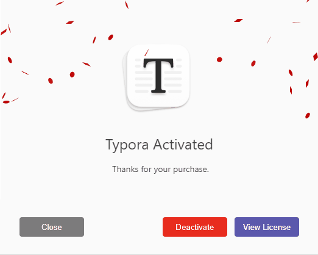

<center>
    
</center>

<!-- more -->

### 克隆 GitHub 仓库

```shell
git clone https://github.com/Mas0nShi/typoraCracker.git
```

### 安装依赖环境

```shell
pip install -r requirements.txt
```

> **可能报错，运行如下命令**
>
> ```shell
> pip install jsbeautifier
> pip install jsmin
> pip install loguru
> pip install pycryptodome
> ```

### 创建输出目录

```shell
mkdir \typoraCracker\output\
mkdir \typoraCracker\out_app_asar\
```

### 生成破解文件

```shell
python .\typora.py \Typora\resources\app.asar .\output\
```

> **可能报如下错误**
>
> ```shell
> Traceback (most recent call last):
>   File "\typoraCracker\typora.py", line 8, in <module>
>     from Crypto.Cipher import AES
> ModuleNotFoundError: No module named 'Crypto'
> ```
>
> 1. 打开`\Python\Python37\Lib\site-packages`这个路径，找到`crypto`这个文件夹
> 2. 将`crypto`这个文件夹重命名为`Crypto`

#### 替换`License.js`文件

```shell
move .\example\patch\License.js .\output\dec_app\
```

#### 重新生成`app.asar`文件

```shell
python .\typora.py -u .\key\outfile\dec_app\ .\output\out_app_asar\
```

#### 替换`app.asar`

```shell
move .\output\out_app_asar\app.asar \Typora\resources\app.asar
```

#### 生成序列号

```shell
node .\example\keygen.js
```
