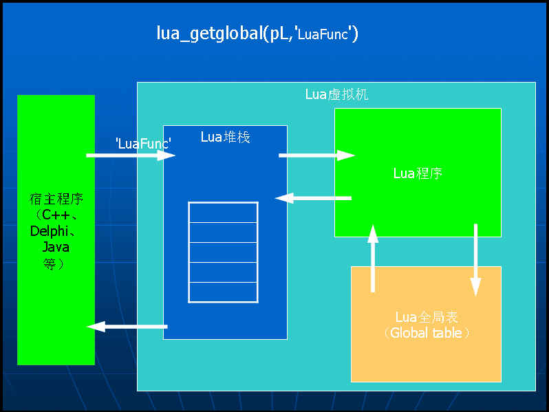
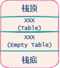
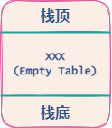
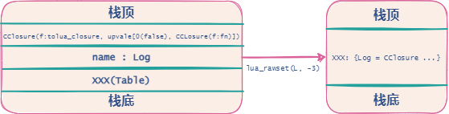

<center>
    
</center>
<!-- more -->

### lua 虚拟栈

##### lua 代码

```lua
-- file name: test.lua
function func()
    return 1, 2, 3, 4
end
```

##### C++代码

```c++
#include <iostream>  
#include "lua.hpp"  
 
int _tmain(int argc, _TCHAR* argv[])
{
	//①新建虚拟机  
	lua_State *L = luaL_newstate();
	//②载入库  
	luaL_openlibs(L);
 
	//③这里执行 test.lua  Lua 文件  
	luaL_dofile(L, "test.lua");
	//④重新设置栈底
	lua_settop(L, 0);
 
	//⑤获取 返回结果  
	lua_getglobal(L, "func");
 
	//⑥操作栈调回结果
	lua_pcall(L, 0, 4, 0);
	printf("%s\n", lua_tostring(L, 1));
	printf("%s\n", lua_tostring(L, 2));
	printf("%s\n", lua_tostring(L, 3));
	printf("%s\n", lua_tostring(L, 4));
 
	//⑦关闭虚拟机  
	lua_close(L);
 
	system("pause");
	return 0;
}
```

* ④ 这个过程，是为了确认栈底是空的，以便后面的操作是按照顺序入栈的且从 1 号栈位开始

* ⑥操作栈调回结果

  *  C++告诉，函数以输入栈，函数传入 0 个参数，会返回 4 个函数，。分别  对应上面四个参数。**栈中一个元素：`func`**
  * C++请求完毕，开始访问栈，从栈中取出`func`。**栈中无元素**
  * 得到`func`信息送给。**栈中无元素**
  * lua 程序在调用的中查找`func`，并运行返回结果`1,2,3,4`。**栈中无元素**
  *  lua 程序得到返回结果`1,2,3,4`将结果再压入栈；`1`先入栈底，`2`再入栈，以此类推。**栈中四个元素：`1,2,3,4`，顺序为栈底->栈顶**
  * 最后，C++再去栈中读取数据；这里`lua_tostring(L, 1)`是读取函数，不会改变栈内的结果的，所以当地⑥步执行完，栈中还是四个元素：`1,2,3,4`

  > 若使用`lua_pop(L, 1)` 去操作的话，可以弹出指定的位置的栈内容

### lua 热更新原理

使用 assetbundle 进行资源的更新，而由于 lua 运行时才编译的特性，所以 lua 文件也可以被看成是一种资源文件（与 fbx、Image 等一样）可以打进 ab 包中

### C#调用 lua

- 使用 Tolua 的相关类和方法都需要调用命名空间 LuaInterface

- 调用 lua 脚本必须先创建一个 lua 虚拟机

  ```C#
  LuaState lua = new LuaState();
  ```

- 在 C#中运行一段 lua 脚本最简单的方法就是 lua.DoString

  ```c#
  public object[] DoString(string chunk, string chunkName = "LuaState.DoString")
  ```

- 使用完 lua 虚拟机之后记要销毁

  - 先进行 lua 虚拟机的判空`lua.CheckTop`

### lua 调用 C#

#### 反射

C#中的反射使用`Assembly`定义和加载程序集，加载在程序集清单中列出模块，以及从此程序集中查找类型并创建该类型的实例

##### 反射用到的命名空间

```c#
System.Reflection
System.Type
System.Reflection.Assembly
```

##### 反射用到的主要类

- `System.Type`类－通过这个类可以访问任何给定数据类型的信息
- `System.Reflection.Assembly`类－它可以用于访问给定程序集的信息，或者把这个程序集加载到程序中

#### 去反射

把所有的 c# 类的`public`成员变量、成员函数，都导出到一个相对应的`Wrap`类中，而这些成员函数通过特殊的标记，映射到 lua 的虚拟机中，当在 lua 中调用相对应的函数时候，直接调用映射进去的`wrap`函数，然后再调用到实际的 c# 类，完成调用过程

##### Wrap

在 tolua 生成的 Wrap 文件中，经常遇见如此写法

```csharp
// XXXWrap.cs
L.BeginStaticLibs("XXX");
L.RegFunction("Log", Log);
L.EndStaticLibs();
```

##### BeginStaticLibs

首先`BeginStaticLibs`最终会走到这条语句上来：`LuaDLL.tolua_beginstaticclass(L, name);`这语句会执行 tolua.dll 的 C 语言对应方法，`tolua_beginstaticclass`，该方法最终会在`lua_State`栈顶生成一个名为 name 的`table`

```c
/* tolua.c */
LUALIB_API void tolua_beginstaticclass(lua_State *L, const char *name)
{    
    lua_pushstring(L, name);  /* 将 name 压入栈中，即 XXX */
    lua_newtable(L);/* 创建一个 table 压入栈中*/
    _addtoloaded(L);
    lua_pushvalue(L, -1);  
    /* 这里将栈顶表复制了一份压入栈中 即 top [XXX(table),XXX(emptytable)] bottom    */
    /* 以上操作相当于生成了名为 name 的 table :XXX = {}  */
   
    /* 以下操作抽象理解 */
    /* XXX["userdata"] = &tag  */
    lua_pushlightuserdata(L, &tag);
    lua_pushnumber(L, 1);
    lua_rawset(L, -3);

    /* XXX[".name"] = XXX  */
    lua_pushstring(L, ".name");
    _pushfullname(L, -4);
    lua_rawset(L, -3);
   
    /* XXX["__index"] = static_index_event  */
    lua_pushstring(L, "__index");
    lua_pushcfunction(L, static_index_event);
    lua_rawset(L, -3);

    /* XXX["__newindex"] = static_newindex_event  */
    lua_pushstring(L, "__newindex");
    lua_pushcfunction(L, static_newindex_event);
    lua_rawset(L, -3);      
}
```

<center>
    
    <p>最终会在 lua_State 栈顶会被压入一个名为 XXX 的 Table</p>
</center>

##### EndStaticLibs

接着先把尾给收掉，`EndStaticLibs`最后会来到`tolua.c`这边的`tolua_endstaticclass`方法，该方法最终会将栈顶元素弹出并将其设置为 - 2 位置的元表

```c
/* tolua.c */
LUALIB_API void tolua_endstaticclass(lua_State *L)
{
    lua_setmetatable(L, -2);
    lua_rawset(L, -3);    
}
```

<center>
    
    <p>弹出栈顶元素，将其设置为 XXX(Empty Table) 的元表</p>
</center>

##### RegFunction

`RegFunction`先是将要注册的方法转换成了供平台使用的指针，传递到 C 中生成可以供 lua 使用的`LuaCSFunction`函数

```c#
// LuaState.cs
public void RegFunction(string name, LuaCSFunction func)
{
    IntPtr fn = Marshal.GetFunctionPointerForDelegate(func);
    LuaDLL.tolua_function(L, name, fn);            
}
```

tolua.c 文件中`tolua_function`对传入进的函数进行了绑定

```c
/* tolua.c */
LUALIB_API void tolua_function(lua_State *L, const char *name, lua_CFunction fn)
{
    lua_pushstring(L, name);
    tolua_pushcfunction(L, fn);
    lua_rawset(L, -3); // 赋值操作：将栈顶作为 v:CClosure，倒数第二位作为 k:name，-3 位置作为 table 进行赋值 ，即 XXX[name] = CClosure
}

LUA_API int tolua_pushcfunction(lua_State *L, lua_CFunction fn)
{        
    lua_pushboolean(L, 0); // 压入布尔值 false top [0(false),name,XXX(table)] bottom
    lua_pushcfunction(L, fn); // 压入函数，这里会以 CClosure 结构体的形式被压入栈
    lua_pushcclosure(L, tolua_closure, 2); // 这里会创建一个新的 CClosure 结构，并将栈顶 2 个元素（一个布尔值与一个存放了 fn 的 Closure) 弹出并压入 CClosure 结构体中，最终将新的 CClosure 压入栈中
    return 0;
}
```

> `lua_rawset(L, -3);` 
>
>  赋值操作：将栈顶作为——`CClosure`，倒数第二位作为——`name`，-3 位置作为 table 进行赋值 ，即`XXX[name] = CClosure`

<center>
    
</center>

实际上一个 C#方法的指针其实被封装了两层：

* `lua_pushcfunction(L, fn)`时 将`fn`封装进了`CClosure`中
* `lua_pushcclosure(L, tolua_closure, 2)`时将封装了`fn`的`CClosure`再一次封装进了新的`CClosure`中

当在 lua 中调用注册的方法时，实际上是在调用最外层的`CClosure`结构体，它其中的方法是`tolua_closure`，而 C#方法指针`fn`作为该结构体栈中的值被存放着`upvalue`

```c
static int tolua_closure(lua_State *L)
{
    /*  获取到所注册的 C#方法指针 */
    lua_CFunction fn = (lua_CFunction)lua_tocfunction(L, lua_upvalueindex(2));
    /*  运行 ，因为 lua 跨语言的数据交互都借助栈来完成，所以运行结果都是通过获取栈中元素来获得 */
    int r = fn(L);    
   
    if (lua_toboolean(L, lua_upvalueindex(1)))
    {
        lua_pushboolean(L, 0);
        lua_replace(L, lua_upvalueindex(1));
        return lua_error(L);
    }
   
    return r;
}
```

* `lua_pushfunction`：实际上压入函数的过程就是形成闭包的过程，在 lua 中函数是以闭包的形式被保存的

  ```c
  /* lua.h */
  #define lua_pushcfunction(L,f)  lua_pushcclosure(L, (f), 0) /* 宏 压入闭包方法 n 为 0 */
  ```

* `lua_pushclosure`：生成闭包，将函数存放在闭包结构体中，并将栈顶 n 个元素一同压入闭包内的栈

  ```c
  typedef struct CClosure {
    ClosureHeader;
    lua_CFunction f;
    TValue upvalue[1];  /* list of upvalues */
  } CClosure;
  
  /* lua.h */
  LUA_API void  (lua_pushcclosure) (lua_State *L, lua_CFunction fn, int n);
  
  /* lapi.c */
  LUA_API void lua_pushcclosure (lua_State *L, lua_CFunction fn, int n) {
    lua_lock(L);
    if (n == 0) {
      setfvalue(L->top, fn);
      api_incr_top(L);
    }
    else {
      CClosure *cl;  
      api_checknelems(L, n);
      api_check(L, n <= MAXUPVAL, "upvalue index too large");  /* #define MAXUPVAL 255  */
      cl = luaF_newCclosure(L, n);/* 创建了闭包结构体  */
      cl->f = fn;
      L->top -= n;  /* 将栈顶 n 个元素移除并压入闭包的栈中 upvalue */
      while (n--) {
        setobj2n(L, &cl->upvalue[n], L->top + n);
        /* does not need barrier because closure is white */
      }
      setclCvalue(L, L->top, cl);
      api_incr_top(L);
      luaC_checkGC(L);
    }
    lua_unlock(L);
  }
  ```

  
