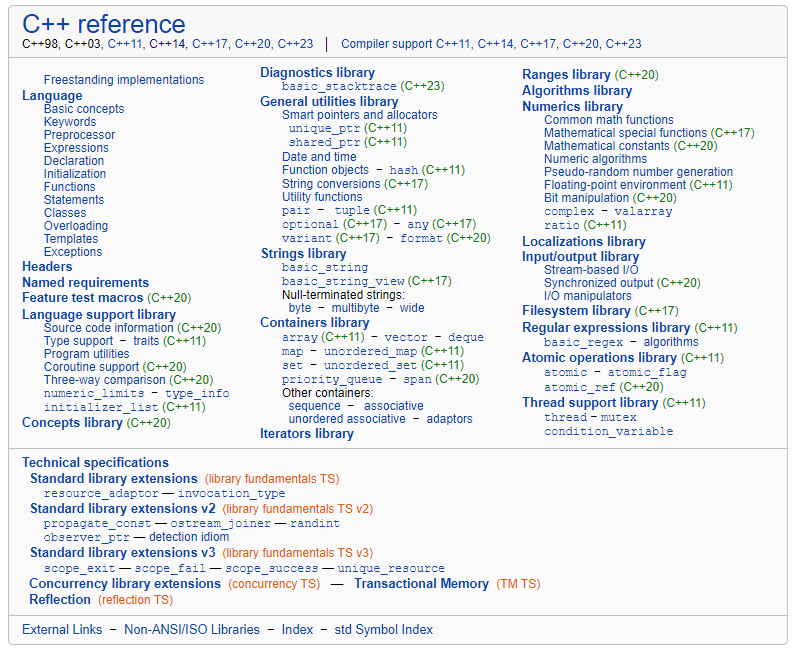

<center>
    
</center>

<!-- more -->

### `auto` & `decltype`

关于C++11新特性，最先提到的肯定是类型推导，C++11引入了`auto`和`decltype`关键字，使用他们可以在编译期就推导出变量或者表达式的类型，方便开发者编码也简化了代码。

#### `auto`

让编译器在编译器就推导出变量的类型，可以通过等号右边的类型推导出变量的类型

#### `decltype`

相对于`auto`用于推导变量类型，而`decltype`则用于推导表达式类型，这里只用于编译器分析表达式的类型，表达式实际不会进行运算

### 左值和右值

- 左值：可以取地址并且有名字的东西就是左值。
- 右值：不能取地址的没有名字的东西就是右值。
- 纯右值：运算表达式产生的临时变量、不和对象关联的原始字面量、非引用返回的临时变量、lambda表达式等都是纯右值。
- 将亡值：可以理解为即将要销毁的值。
- 左值引用：对左值进行引用的类型。
- 右值引用：对右值进行引用的类型。
- 移动语义：转移资源所有权，类似于转让或者资源窃取的意思，对于那块资源，转为自己所拥有，别人不再拥有也不会再使用。
- 完美转发：可以写一个接受任意实参的函数模板，并转发到其它函数，目标函数会收到与转发函数完全相同的实参。
- 返回值优化：当函数需要返回一个对象实例时候，就会创建一个临时对象并通过复制构造函数将目标对象复制到临时对象，这里有复制构造函数和析构函数会被多余的调用到，有代价，而通过返回值优化，C++标准允许省略调用这些复制构造函数。

### 列表初始化

在C++11中可以直接在变量名后面加上初始化列表来进行对象的初始化

#### 列表初始化的一些规则

!!! note "聚合类型"
    聚合类型可以进行直接列表初始化

* 类型是一个普通数组，如`int[5]`，`char[]`，`double[]`等

* 类型是一个类，且满足以下条件

  * 没有用户声明的构造函数
  * 没有用户提供的构造函数(允许显示预置或弃置的构造函数)
  * 没有私有或保护的非静态数据成员
  * 没有基类
  * 没有虚函数
  * 没有{}和=直接初始化的非静态数据成员
  * 没有默认成员初始化器

  ```c++
  struct A {
      int a;
      int b;
      virtual void func() {} // 含有虚函数，不是聚合类
  };
  
  struct Base {};
  struct B : public Base { // 有基类，不是聚合类
        int a;
      int b;
  };
  
  struct C {
      int a;
      int b = 10; // 有等号初始化，不是聚合类
  };
  
  struct D {
      int a;
      int b;
  private:
      int c; // 含有私有的非静态数据成员，不是聚合类
  };
  
  struct E {
        int a;
      int b;
      E() : a(0), b(0) {} // 含有默认成员初始化器，不是聚合类
  };
  ```

#### `std::initializer_list`

```c++
struct CustomVec {
    std::vector<int> data;
    CustomVec(std::initializer_list<int> list) {
        for (auto iter = list.begin(); iter != list.end(); ++iter) {
            data.push_back(*iter);
        }
    }
};
```

### `std::function` & `std::bind` & `lambda`表达式

#### `std::function`

满足以下条件之一就可称为可调用对象:

* 是一个函数指针
* 是一个具有`operator()`成员函数的类对象(传说中的仿函数)，`lambda`表达式
* 是一个可被转换为函数指针的类对象
* 是一个类成员(函数)指针
* bind表达式或其它函数对象

而`std::function`就是上面这种可调用对象的封装器，可以把`std::function`看做一个函数对象，用于表示函数这个抽象概念。`std::function`的实例可以存储、复制和调用任何可调用对象，存储的可调用对象称为`std::function`的目标，若`std::function`不含目标，则称它为空，调用空的`std::function`的目标会抛出`std::bad_function_call`异常。

#### `std::bind`

使用`std::bind`可以将可调用对象和参数一起绑定，绑定后的结果使用`std::function`进行保存，并延迟调用到任何我们需要的时候。`std::bind`通常有两大作用：

* 将可调用对象与参数一起绑定为另一个`std::function`供调用
* 将n元可调用对象转成m(m < n)元可调用对象，绑定一部分参数，这里需要使用`std::placeholders`

#### `lambda`表达式

`lambda`表达式可以说是c++11引用的最重要的特性之一，它定义了一个匿名函数，可以捕获一定范围的变量在函数内部使用，一般有如下语法形式：

```c++
auto func = [capture] (params) opt -> ret { func_body; };
```

其中`func`是可以当作`lambda`表达式的名字，作为一个函数使用，`capture`是捕获列表，`params`是参数表，`opt`是函数选项(`mutable`之类)， `ret`是返回值类型，`func_body`是函数体。

lambda表达式允许捕获一定范围内的变量：

* `[]`不捕获任何变量
* `[&]`引用捕获，捕获外部作用域所有变量，在函数体内当作引用使用
* `[=]`值捕获，捕获外部作用域所有变量，在函数内内有个副本使用
* `[=, &a]`值捕获外部作用域所有变量，按引用捕获`a`变量
* `[a]`只值捕获`a`变量，不捕获其它变量
* `[this]`捕获当前类中的`this`指针

#### 小结

`std::function`和`std::bind`使得我们平时编程过程中封装函数更加的方便，而`lambda`表达式将这种方便发挥到了极致，可以在需要的时间就地定义匿名函数，不再需要定义类或者函数等，在自定义STL规则时候也非常方便，让代码更简洁，更灵活，提高开发效率

### 模板的改进

#### 模板的右尖括号

C++11之前是不允许两个右尖括号出现的，会被认为是右移操作符，所以需要中间加个空格进行分割，避免发生编译错误。

#### 模板的别名

C++11引入了`using`，可以轻松的定义别名，而不是使用繁琐的`typedef`

#### 函数模板的默认模板参数

C++11之前只有类模板支持默认模板参数，函数模板是不支持默认模板参数的，C++11后都支持；同时C++11支持变长参数模板

### 并发

### 智能指针

### 基于范围的for循环

```c++
vector<int> vec;

for (auto iter = vec.begin(); iter != vec.end(); iter++) { // before c++11
    cout << *iter << endl;
}

for (int i : vec) { // c++11基于范围的for循环
    cout << "i" << endl;
}
```

### 委托构造函数

委托构造函数允许在同一个类中一个构造函数调用另外一个构造函数，可以在变量初始化时简化操作

```c++
struct A {
    A(){}
    A(int a) { a_ = a; }

    A(int a, int b) : A(a) { b_ = b; }

    A(int a, int b, int c) : A(a, b) { c_ = c; }

    int a_;
    int b_;
    int c_;
};
```

### 继承构造函数

继承构造函数可以让派生类直接使用基类的构造函数，如果有一个派生类，我们希望派生类采用和基类一样的构造方式，可以直接使用基类的构造函数，而不是再重新写一遍构造函数

```c++
struct Base {
    Base() {}
    Base(int a) { a_ = a; }

    Base(int a, int b) : Base(a) { b_ = b; }

    Base(int a, int b, int c) : Base(a, b) { c_ = c; }

    int a_;
    int b_;
    int c_;
};

struct Derived : Base {
    using Base::Base;
};

int main() {
    Derived a(1, 2, 3);
    return 0;
}
```

### 关键字

#### `nullptr`

`nullptr`是c++11用来表示空指针新引入的常量值，在c++中如果表示空指针语义时建议使用`nullptr`而不要使用`NULL`，因为`NULL`本质上是个`int`型的0，其实不是个指针

#### `final` & `override`

c++11关于继承新增了两个关键字，`final`用于修饰一个类，表示禁止该类进一步派生和虚函数的进一步重载，`override`用于修饰派生类中的成员函数，标明该函数重写了基类函数，如果一个函数声明了`override`但父类却没有这个虚函数，编译报错，使用`override`关键字可以避免开发者在重写基类函数时无意产生的错误

#### `default`

c++11引入`default`特性，多数时候用于声明构造函数为默认构造函数，如果类中有了自定义的构造函数，编译器就不会隐式生成默认构造函数

#### `delete`

c++中，如果开发人员没有定义特殊成员函数，那么编译器在需要特殊成员函数时候会隐式自动生成一个默认的特殊成员函数，例如拷贝构造函数或者拷贝赋值操作符。有时候想禁止对象的拷贝与赋值，可以使用`delete`修饰

```c++
struct A {
    A() = default;
    A(const A&) = delete;
    A& operator=(const A&) = delete;
    int a;
    A(int i) { a = i; }
};

int main() {
    A a1;
    A a2 = a1;  // 错误，拷贝构造函数被禁用
    A a3;
    a3 = a1;  // 错误，拷贝赋值操作符被禁用
}
```

`delele`关键字在c++11中很常用，`std::unique_ptr`就是通过`delete`修饰来禁止对象的拷贝的

#### `explicit`

`explicit`专用于修饰构造函数，表示只能显式构造，不可以被隐式转换

##### 不用`explicit`

```c++
struct A {
    A(int value) { // 没有explicit关键字
        cout << "value" << endl;
    }
};

int main() {
    A a = 1; // 可以隐式转换
    return 0;
}
```

##### 使用`explicit`

```c++
struct A {
    explicit A(int value) {
        cout << "value" << endl;
    }
};

int main() {
    A a = 1; // error，不可以隐式转换
    A aa(2); // ok
    return 0;
}
```

### `constexpr`

`constexpr`是c++11新引入的关键字，用于编译时的常量和常量函数，这里直接介绍`constexpr`和`const`的区别：两者都代表可读，`const`只表示`read only`的语义，只保证了运行时不可以被修改，但它修饰的仍然有可能是个动态变量，而`constexpr`修饰的才是真正的常量，它会在编译期间就会被计算出来，整个运行过程中都不可以被改变，`constexpr`可以用于修饰函数，这个函数的返回值会尽可能在编译期间被计算出来当作一个常量，但是如果编译期间此函数不能被计算出来，那它就会当作一个普通函数被处理

### `enum class`

c++11新增有作用域的枚举类型，不带作用域的枚举类型可以自动转换成整形，且不同的枚举可以相互比较，可能会存在潜在的难以调试的bug；使用带有作用域的枚举类型后，对不同的枚举进行比较会导致编译失败，使用带有作用域的枚举类型后，对不同的枚举进行比较会导致编译失败，同时带作用域的枚举类型可以选择底层类型，默认是`int`，可以改成其他类型

!!! Note ""
    平时编程过程中使用枚举，一定要使用有作用域的枚举取代传统的枚举

#### `sizeof`

c++11中`sizeof`可以用的类的数据成员上

#### `assertion`

```c++
static_assert(true/false, message);
```

c++11引入`static_assert`声明，用于在编译期间检查，如果第一个参数值为`false`，则打印`message`，编译失败

### 内存对齐

#### 什么是内存对齐

理论上计算机对于任何变量的访问都可以从任意位置开始，然而实际上系统会对这些变量的存放地址有限制，通常将变量首地址设为某个数N的倍数，这就是内存对齐

#### 为什么要内存对齐

* 硬件平台限制，内存以字节为单位，不同硬件平台不一定支持任何内存地址的存取，一般可能以双字节、4字节等为单位存取内存，为了保证处理器正确存取数据，需要进行内存对齐
* 提高CPU内存访问速度，一般处理器的内存存取粒度都是N的整数倍，假如访问N大小的数据，没有进行内存对齐，有可能就需要两次访问才可以读取出数据，而进行内存对齐可以一次性把数据全部读取出来，提高效率

c++11关于内存对齐新增了一些函数

```c++
void func()
{
    static std::aligned_storage<sizeof(A), alignof(A)>::type data;
    A *attr = new (&data) A;
}
```

### 随机数功能

c++11关于随机数功能则较之前丰富了很多，典型的可以选择概率分布类型

```c++
#include <time.h>

#include <iostream>
#include <random>

using namespace std;

int main() {
    std::default_random_engine random(time(nullptr));

    std::uniform_int_distribution<int> int_dis(0, 100); // 整数均匀分布
    std::uniform_real_distribution<float> real_dis(0.0, 1.0); // 浮点数均匀分布

    for (int i = 0; i < 10; ++i) {
        cout << int_dis(random) << ' ';
    }
    cout << endl;

    for (int i = 0; i < 10; ++i) {
        cout << real_dis(random) << ' ';
    }
    cout << endl;

    return 0;
}
```

### 正则表达式

```c++
#include <iostream>
#include <iterator>
#include <regex>
#include <string>

int main() {
    std::string s = "I know, I'll use2 regular expressions.";
    // 忽略大小写
    std::regex self_regex("REGULAR EXPRESSIONS", std::regex_constants::icase); 
    if (std::regex_search(s, self_regex)) {
        std::cout << "Text contains the phrase 'regular expressions'\n";
    }

    std::regex word_regex("(\\w+)");  // 匹配字母数字等字符
    auto words_begin = std::sregex_iterator(s.begin(), s.end(), word_regex);
    auto words_end = std::sregex_iterator();

    std::cout << "Found " << std::distance(words_begin, words_end) << " words\n";

    const int N = 6;
    std::cout << "Words longer than " << N << " characters:\n";
    for (std::sregex_iterator i = words_begin; i != words_end; ++i) {
        std::smatch match = *i;
        std::string match_str = match.str();
        if (match_str.size() > N) {
            std::cout << "  " << match_str << '\n';
        }
    }

    std::regex long_word_regex("(\\w{7,})");
    // 超过7个字符的单词用[]包围
    std::string new_s = std::regex_replace(s, long_word_regex, "[$&]");
    std::cout << new_s << '\n';
}
```

