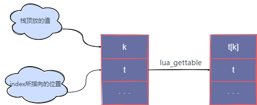

### `lua_gettable`

```c
void lua_gettable(lua_State *L, int index);
```

把`t[k]`值压入堆栈， 这里的`t`是指有效索引`index`指向的值， 而`k`则是栈顶放的值。这个函数会弹出堆栈上的 key（把结果放在栈上相同位置），在 Lua 中这个函数可能触发对应`__index`事件的元方法

<center>
    
</center>

### `lua_settable`

```c
void lua_settable(lua_State *L, int index);
```

作一个等价于`t[k] = v`的操作， 这里`t`是一个给定有效索引`index`处的值， `v `指栈顶的值， 而`k`是栈顶之下的那个值。这个函数会把键和值都从堆栈中弹出。 在 Lua 中这个函数可能触发`__newindex`事件的元方法

### `lua_rawset` & `lua_rawget`

```c
void lua_rawset(lua_State *L, int index);
void lua_rawget(lua_State *L, int index);
```

`lua_rawset`类似于`lua_settable`， 但是是作一个直接赋值，不触发元方法；`lua_rawget`类似于`lua_gettable`， 但是作一次直接访问，不触发元方法

### `lua_rawseti` & `lua_rawgeti`

```c
void lua_rawgeti(lua_State *L, int index, int n);
void lua_rawseti(lua_State *L, int index, int n);
```

* `lua_rawgeti`：把`t[n]`的值压栈， 这里的`t`是指给定索引`index`处的一个值， 这是一个直接访问，不会触发元方法
* `lua_rawseti`：等价于`t[n] = v`，这里的`t`是指给定索引`index`处的一个值， 而`v`是栈顶的值，不会触发元方法
