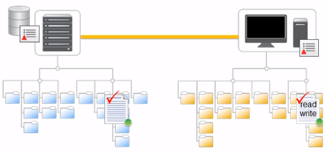
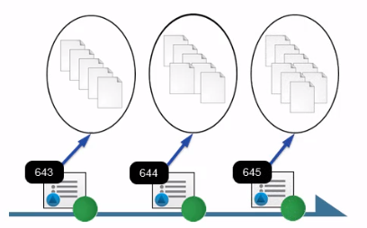
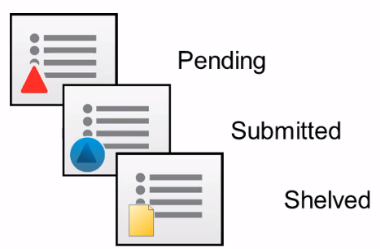
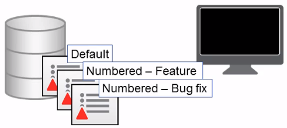
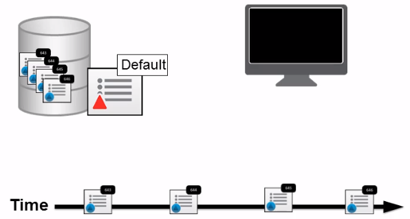

## Using Changelists to Manage Files

### Checkout

    

修改文件，必须将其`Checkout`，当`Checkout`文件是，Perforce会将有关文件的信息添加到**Changelists**，并将本地工作区中文件的可写性从**只读**更改为**读/写**

### Changelists

    

一个 Changelist 定义了一个文件和文件夹的逻辑上的分组

#### Changelist内容

一个Changelist中包含的信息包括Changelist的标识符、文件列表、更改提交的日期等等。一个 Changelist 中的文件更改的方式，可以是任意的，包括对文件内容的编辑、文件和文件夹的添加或删除、文件重命名等

#### Changelist种类

Changelist可以处于以下三种状态之一：**Pending**、**Submitted** 和 **Shelved**

    

- 未提交的Changelist被称为Pending Changelist 。
- 一旦Changelist成功提交到服务器，Changelist状态将更新为Submitted。
- Shelved是一种特殊形式的待定Changelist。可以使用Shelved的Changelist将工作区文件临时存储在服务器上，而无需将更改提交到版本文件存储库。

Perforce服务器会追踪在系统元数据中存储的Pending Changelist中Checkout的文件。当在Perforce GUI客户端中查看 Changelist时，正在查看的是存储在服务器上的Changelist的本地副本

#### 默认Changelist和编号Changelist

Perforce在每个工作区的系统元数据中维护一个**默认**的Pending Changelist。当Checkout文件时，可以将其添加到工作区的默认Pending Changelist，或创建一个新的**编号**Pending Changelist。

    

#### Changelist编号机制

Perforce维护一个编号序列，用于Changelist的ID。当创建一个新的Pending Changelist时，Perforce会使用序列中的下一个编号为Changelist分配一个ID编号。当提交在编号Pending Changelist中的修改时，Perforce会验证最初分配给 Changelist的编号是否仍然是序列中的下一个编号。如果不是（这在许多人同时在同一个仓库中工作时很常见），Perforce会在将Changelist存储到系统元数据中之前，使用序列中的下一个编号为Changelist生成一个新的 ID 编号。

因为Perforce按顺序为每个提交的Changelist生成唯一的ID号，因此Changelist的ID反映了每个Changelist提交到服务器的时间。

    

