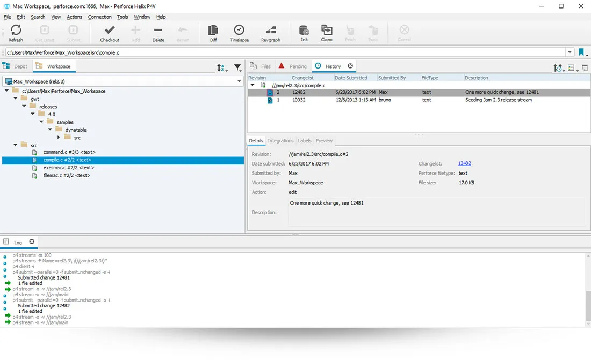

    

<!-- more -->

## Using Changelists to Manage Files

### Checkout

    

修改文件，必须将其`Checkout`，当`Checkout`文件是，Perforce 会将有关文件的信息添加到** Changelists**，并将本地工作区中文件的可写性从**只读**更改为**读/写**

### Changelists

    

一个 Changelist 定义了一个文件和文件夹的逻辑上的分组

#### Changelist 内容

一个 Changelist 中包含的信息包括 Changelist 的标识符、文件列表、更改提交的日期等等。一个 Changelist 中的文件更改的方式，可以是任意的，包括对文件内容的编辑、文件和文件夹的添加或删除、文件重命名等

#### Changelist 种类

Changelist 可以处于以下三种状态之一：**Pending**、**Submitted** 和 **Shelved**

    

- 未提交的 Changelist 被称为 Pending Changelist 。
- 一旦 Changelist 成功提交到服务器，Changelist 状态将更新为 Submitted。
- Shelved 是一种特殊形式的待定 Changelist。可以使用 Shelved 的 Changelist 将工作区文件临时存储在服务器上，而无需将更改提交到版本文件存储库。

Perforce 服务器会追踪在系统元数据中存储的 Pending Changelist 中 Checkout 的文件。当在 Perforce GUI 客户端中查看 Changelist 时，正在查看的是存储在服务器上的 Changelist 的本地副本

#### 默认 Changelist 和编号 Changelist

Perforce 在每个工作区的系统元数据中维护一个**默认**的 Pending Changelist。当 Checkout 文件时，可以将其添加到工作区的默认 Pending Changelist，或创建一个新的**编号** Pending Changelist。

    

#### Changelist 编号机制

Perforce 维护一个编号序列，用于 Changelist 的 ID。当创建一个新的 Pending Changelist 时，Perforce 会使用序列中的下一个编号为 Changelist 分配一个 ID 编号。当提交在编号 Pending Changelist 中的修改时，Perforce 会验证最初分配给 Changelist 的编号是否仍然是序列中的下一个编号。如果不是（这在许多人同时在同一个仓库中工作时很常见），Perforce 会在将 Changelist 存储到系统元数据中之前，使用序列中的下一个编号为 Changelist 生成一个新的 ID 编号。

因为 Perforce 按顺序为每个提交的 Changelist 生成唯一的 ID 号，因此 Changelist 的 ID 反映了每个 Changelist 提交到服务器的时间。

    

## Cleaning up files and directories

!!! Warning
    Changes performed by the Clean option are permanent. You cannot revert this operation.

1. Select a folder and click **Actions > Clean**, or right-click a folder and select **Clean**.

   If there are files that need to be cleaned up, the **Clean Workspace (Revert to Depot)** dialog appears.

   P4V compares your workspace to the depot and lists the following files:

   - Files that were modified locally without being checked out
   - Local files that are not in the depot
   - Depot files that are missing from your local workspace

2. By default, all files are selected for cleanup. If there are any files that you do not want to clean up, clear the respective check boxes.

3. By default, files and directories listed in `P4IGNORE` files are excluded from cleanup and remain unaffected. If you do want to include such files, clear the **Apply P4IGNORE files for this workspace** check box.

   In this case, P4V compares your workspace to the depot again and then also lists applicable files that were previously excluded in the respective section.

4. Click **Clean**.

5. In the **Confirm Deleting and Reverting Files** dialog, click **Continue** to confirm the operation.
