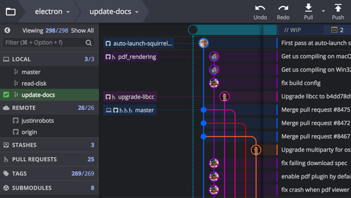

<center>
    
</center>
<!-- more -->

### 强制覆盖本地代码（与 git 远程仓库保持一致）

```sh
git fetch --all # 拉取所有更新，不同步
git reset --hard origin/master # 本地代码同步线上最新版本（会覆盖本地所有与远程仓库上同名的文件）
git pull # 再更新一次
```

### Please move or remove them before you can merge

<center>
    
</center>

```sh
git clean -d -f # To remove & delete all changes
```

### Git 推送本地分支到远端

#### 远程先开好分支然后拉到本地

```sh
git checkout -b =<branch> origin/<branch>
```

#### 本地先开好分支然后推送到远程

```sh
git checkout -b <branch> # 创建并切换到分支<branch>  
git push origin <branch> # 推送本地的<branch>分支到远程 origin 的<branch>分支
```

### Git 回滚代码到某个 commit

```sh
git reset --hard HEAD^ # 回退到上个版本
git reset --hard HEAD~3 # 回退到前三次提交之前
git reset --hard <commit-id> 退到/进到指定<commit-id>的 hashm
```
