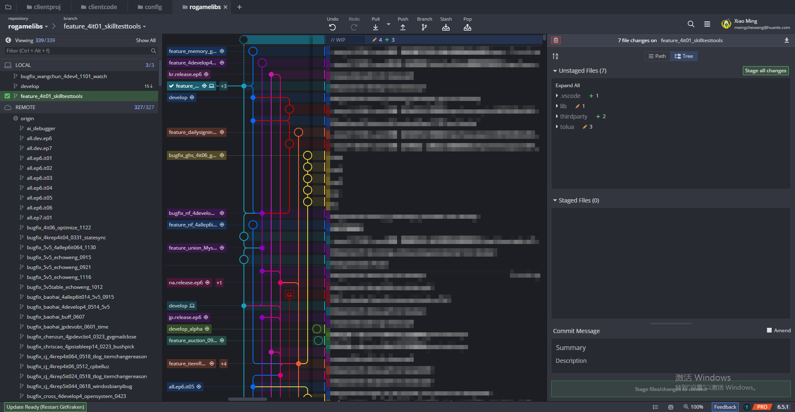
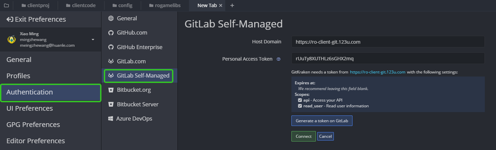
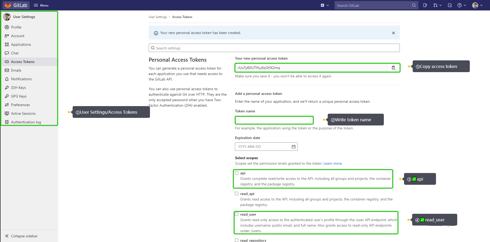
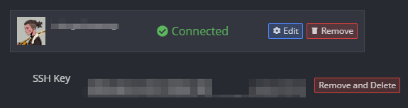
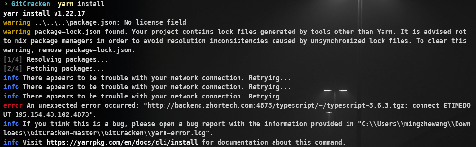
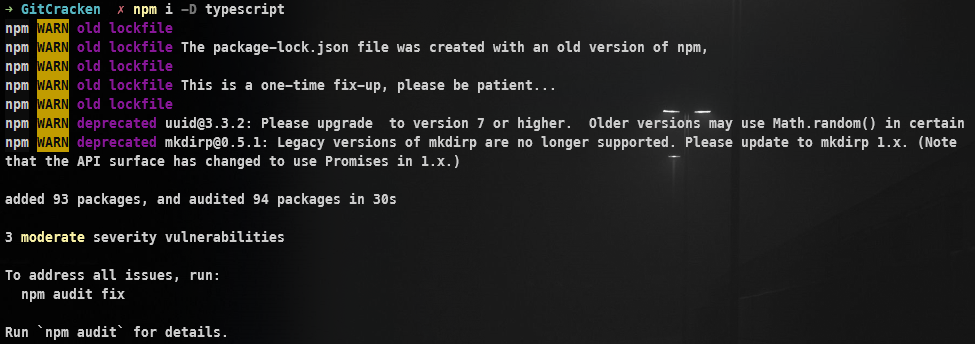
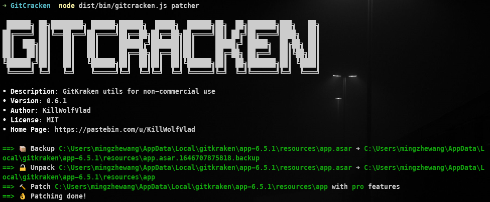
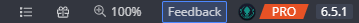

<center>
    
</center>

<!-- more -->

### GitKraken简介

[GitKraken](https://www.gitkraken.com/) 是一款界面十分美观的Git可视化管理工具，比较遗憾的是GitKraken是收费软件，类似的免费软件有 [Sourcetree](https://www.sourcetreeapp.com/) ，不过使用体验不如GitKraken。

#### GitKraken连接GitLab

##### Start a hosted repo

<center>
    
</center>

通过**File/Preferences**进入偏好设置界面，选择**Authentication**中的**GitLab Self-Managed**页面，输入GitLab地址和Token

##### 获得Personal Access Token

<center>
    
</center>

1. 进入**User Settings**，选择**Access Token**
2. 输入一个Token的名字
3. 勾选`api`和`read_user`
4. 生成Token
5. 复制Token（这个Token离开页面后将不被保存）

##### 连接成功

<center>
    
</center>

### 破解

#### 安装`yarn`

```sh
npm i yarn -g
```

#### 运行破解项目

破解前先确保GitKraken已关闭退出，破解工具在Github上是一个开源项目 [5cr1pt/GitCracken](https://github.com/5cr1pt/GitCracken) ，将该项目clone到本地，使用方法也可参考项目的README.md文件，另外也在Gitee上也有。仓库拷贝到本地后，进入仓库的 `GitCracken/GitCracken` 目录，依次执行以下指令运行破解

```sh
yarn install
yarn build
node dist/bin/gitcracken.js patcher
```

> 运行`yarn install`可能会出现连接超时的错误
>
> <center>
>     
> </center>
>
> 直接安装对应的module即可
>
> <center>
>     
> </center>

执行成功后可看到如下界面

<center>
    
</center>

在GitKraken界面右下角可以看到破解后的状态

<center>
    
</center>
