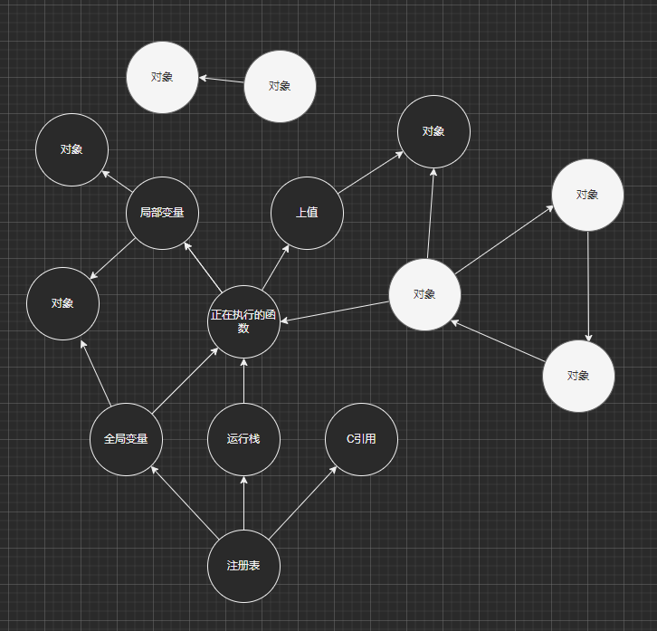

### 数组元素的插入与删除

`table.insert`与`table.remove`方法可以从数组中间的位置插入或移除一个元素。进行此操作时，lua 核心会将插入位置开始的所有元素**逐一**向后移动一位（移除元素亦然）。因此以下代码：

```lua
local t = {}
for i = 1, 10000 do
    table.insert(t, 1, i)
end
```

会移动元素$\dfrac{10000 \times 10000}{2}$次。

一般的解决方法：

1. 如果你并不要求这是一个数组（比如你不会去遍历这个表），那么你可以直接将元素置空，或是插入到表的空位中：

   ```lua
   -- 删除元素
   t[100] = nil
   
   -- 插入到表的空位中
   t[#t+1] = object
   -- 上下 2 种写法等价，但是上面的写法略微高效一些
   table.insert(t, object)
   ```

   注意这里插入到表的空位中的写法，lua 规定只有当数组是紧密的时候， `#t`才能返回数组的长度。当数组为稀疏的时候，`#t`会返回任意一个边界（`#t`非空，但`#t+1`为空），因此使用`#t+1`不会覆盖已有数据。

2. 如果你要求他一定是数组，但是不要求保持顺序，那么可以在移除时将尾部的元素挪过来填补空位：

   ```lua
   -- 删除元素
   t[100] = t[#t]
   t[#t]  = nil
   
   -- 新的元素总是添加到末尾
   t[#t+1] = object
   -- 上下 2 种写法等价，但是上面的写法略微高效一些
   table.insert(t, object)
   ```

   

3. 如果你要求他一定是数组，但是不要求保持顺序，那么可以在移除时将尾部的元素挪过来填补空位：

   ```lua
   -- 删除元素
   t[100] = false -- 往原来的位置放置一个占位符，遍历时过滤掉此占位符
   
   -- 在适当的时候，清理掉数组中的所有占位符
   local count = 0
   for i = 1, #t do
       if t[i] == false then
           t[i] = nil
       else
           count = count + 1
           t[count] = t[i]
       end
   end
   ```

### Try-Catch

你可以使用 `pcall` 与 `xpcall` 以保护模式运行一段代码，当代码发生异常后会带着错误消息回到此函数的调用处，例如：

   ```lua
   local suc, res = pcall(function ()
       local n = nil + 1
       print(n) -- 不会执行到
   end)
   print(suc, res) -- false, error message
   ```

   `xpcall` 则可以再传入一个 `catch` ，使得你可以在现场捕获错误并查看堆栈

   ```lua
   xpcall(function () 
       local n = nil + 1
       print(n) -- 不会执行到
   end, function (error_message)
       print(debug.traceback(error_message))
   end)
   ```

   > 你可以直接把 `debug.traceback` 当做 `catch` 传给 `xpcall` ，因为 `debug.traceback` 的功能之一是接收一个错误消息，然后把堆栈信息拼在错误消息后面返回回来；而 `xpcall` 会将 `catch` 的返回值作为新的错误消息返回出来，这样一来就可以在调用处查看错误堆栈。
   >
   > ```lua
   > local suc, res = xpcall(function () 
   >     local n = nil + 1
   >     print(n) -- 不会执行到
   > end, debug.traceback)
   > print(suc, res) -- false, error message with traceback
   > ```

### 判空

在 Lua 中只有 `nil` 与 `false` 会被认为是假值，而所有其他值都是真值，包括 `0` `''` `{}` 。

因此大部分情况下你只需要简单的通过 `if x then` 来进行判空。

但有一种情况是你有个非常长的操作链，例如 `local x = t.x.y.z()[1]`  而 lua 并不支持可选操作符（比如 TS 中可以这么写： `let x = t?.x?.y?.z?.()?.[1]`)

常见的几种解决方案如下：

1. 依次判空，最朴素的思路，TS 中的可选操作符最终也是编译为依次判空的

   ```lua
   local x
   if t and t.x and t.x.y and t.x.y.z then -- 这里需要确定取字段没有副作用
       local _r = t.x.y.z() -- 函数调用通常有副作用，因此需要缓存结果
       if _r then
           x = _r[1]
       else
           catchError('z() is nil')
       end
   else
       catchError('x or y or z is nil')
   end
   ```

   这个写法简单易懂，几乎没有额外开销，但是显然写起来很复杂，很不优美

2. 创建默认值，这是来自《Lua 程序设计》作者的方案

   ```lua
   local x = ((((t or {}).x or {}).z or function () end)() or {})[1]
   ```

   根据我们人工预测，每步操作大概率不会是空值，根据 Lua 的短路规则一般不会真的创建出很多对象，基本没有额外开销。而当出现空值时，作为出错情况创建一点对象也不是很有所谓。不过缺点就是括号实在是太多了，很难看清是否写对

   如果想捕获错误需要再加个捕获（假设捕获函数 `catchError` 没有返回值）：

   ```lua
   local x = ((((
        t or catchError('t is nil')   or {})
       .x or catchError('x is nil')   or {})
       .z or catchError('z is nil')   or function () end)
       () or catchError('z() is nil') or {})
       [1]
   ```

3. 封装成函数

   ```lua
   local function getValue(v, ...)
       local n = select('#', ...)
       for i = 1, n do
           local k = select(i, ...)
           if v[k] then
               v = v[k]
           else
               catchError(k .. ' is nil')
               return nil
           end
       end
       return v
   end
   -- 以上整个函数由 copilot 生成，我没仔细看，有问题告诉我
   
   local x = getValue(t, 'x', 'y', 'z', 1)
   ```

   这个方法只能支持取字段操作，没法实现函数调用。但考虑到实际工程中很少会把函数调用放到长操作链中，这也是个不错的解决方案。缺点是语义不太清晰，而且无论是不是空都需要付出很多额外的函数调用的开销

4. 所有的操作都 try 1 try

   ```lua
   local x
   xpcall(function ()
       x = t.x.y.z()[1]
   end, catchError)
   ```

   

5. 重写 `nil` 的操作。实际工程中我们经常会遇到需要连续大段的读表，直接让 Lua 对`nil`进行读字段/函数调用等操作

   Lua 可以通过 `debug.setmetatable` 给基础类型添加元表，所有该类型的值会共享同一个元表，因此我们可以给 `nil` 添加一个重载了所有运算符的元表，具体代码比较长就不贴出来了，可以到这里看：https://github.com/sumneko/lua-without-check-nil/blob/master/without-check-nil.lua

   > * 需要注意的是，在我们进行完长链操作后需要及时禁用掉此功能，以免把你其他代码中的错误吃掉
   > * 另外由于 Lua 无法重载 `asindex` ，因此无法处理 `t[nil] = 1` 这种情况

   ```lua
   local nonil = require 'without-check-nil'
   nonil.watch = function (ev, exp1, exp2)
       catchError(string.format('[%s] error, exp1 = %s, exp2 = %s', ev, exp1, exp2))
   end
   
   nonil.enable()
   local x = t.x.y.z()[1]
   nonil.disable()
   ```

#### 总结

| 方案              | 优点                        | 缺点                                                         | 开销           | 错误捕获                                   |
| ----------------- | --------------------------- | ------------------------------------------------------------ | -------------- | ------------------------------------------ |
| 依次判空          | 简单                        | 写起来麻烦 看起来费劲 1 行变 5 行                               | 有少量额外开销 | 可以手动捕获错误，但是会让代码写起来更麻烦 |
| 创建默认值        | 不会增加行数                | 操作链长的话括号会很多                                       | 有少量额外开销 | 可以手动捕获错误，但是会让代码写起来更麻烦 |
| 封装成函数        | 不会增加行数 写起来比较简单 | 只能进行取值操作                                             | 有一些额外开销 | 可以在封装函数中自动捕获                   |
| Try 1 Try         | 写起来简单 看起来直观       | 1 行变 3 行                                                     | 有一些额外开销 | 等同于手动捕获                             |
| 重写 `nil` 的操作 | 几乎不需要修改代码          | 重写 `nil` 操作为全局开关，需要记得关 如果业务和读表混在一起，可能会吃掉业务里的错误 无法处理键为空的错误 | 没有额外开销   | 通过注册 `watch` 函数来全局捕获            |

### 提升性能的写法

有时我们必须用 Lua 写一些运算密集的代码，此时可以通过一些写法略微提升性能。注意，优化性能时优先级第一是找 bug，第二是改进算法设计，之后才轮到更高效的写法。更改写法很可能会降低代码的可读性，你需要自己寻找性能与可读性之间的平衡点，适当留下注释，并且切记**不要过早优化**。

1. 使用 `t[#t+1] = n` 代替 `table.insert(t, n)` ；使用 `t[#t] = nil` 代替 `table.remove(t)` 。这是因为 Lua 调用函数的开销比运算符要高。但是使用这种写法时请注意，如果你的 `t` 是个表达式，那么这个表达式会被求 2 次

2. 使用局部变量代替全局变量，如：

   ```lua
   local tinsert = table.insert
   
   local t = {}
   for i = 1, 10000 do
       tinsert(t, i)
   end
   ```

   该写法的提升很小，只有在非常密集的循环运算中才有改写的价值

3. 使用局部变量缓存结果，如：

   ```lua
   -- 原本的代码：
   a.b.c.d[#a.b.c.d+1] = n
   call(a.b.c.d)
   a.b.c.d[#a.b.c.d] = nil
   
   -- 可以改写成：
   local t = a.b.c.d
   t[#t+1] = n
   call(t)
   t[#t] = nil
   ```

   Lua 的局部变量是没有额外开销的，因为 Lua 本身就会通过隐藏的局部变量（寄存器）来保存中间结果。例如上面例子中原本的代码，Lua 生成的字节码伪代码如下：

   ```lua
   local a1, a2, a3
   a1 = getglobal('a')
   a1 = getfield(a1, 'b')
   a1 = getfield(a1, 'c')
   a1 = getfield(a1, 'd')
   a2 = getglobal('a')
   a2 = getfield(a2, 'b')
   a2 = getfield(a2, 'c')
   a2 = getfield(a2, 'd')
   a2 = getlen(a2)
   a2 = binary('+', a2, 1)
   a3 = getglobal('n')
   setfield(a1, a2, a3)
   ```

4. 避免创建对象，主要是表

   ```lua
   local function isSupported(t)
       for _, v in ipairs {'Windows', 'macOS', 'Linux'} do
           if t[v] then
               return true
           end
       end
       return false
   end
   
   -- 改写为
   local supported = {'Windows', 'macOS', 'Linux'}
   local function isSupported(t)
       for _, v in ipairs(supported) do
           if t[v] then
               return true
           end
       end
       return false
   end
   
   -- 其实调用 ipairs 也会创建一个新的闭包，如果你非常在意，可以就改写为
   local supported = {'Windows', 'macOS', 'Linux'}
   local function isSupported(t)
       for i = 1, #supported do
           local v = supported[i]
           if t[v] then
               return true
           end
       end
       return false
   end
   
   -- 如果你连循环都不想要，那么可以使用终极手段-手动展开
   local supported = {'Windows', 'macOS', 'Linux'}
   local codes = {'local t = ...'}
   for _, v in ipairs(supported) do
       codes[#codes+1] = string.format([[
   if t[%q] then
       return true
   end
   ]], v)
   end
   codes[#codes+1] = 'return false'
   local code = table.concat(codes, '\n')
   local isSupported = load(code) -- Lua 5.1 用 loadstring
   ```

### 一些坑

1. Lua 的数组索引是从 1 开始的

2. 如果数组构造的最后一个元素是一个函数调用，要注意这个函数调用的所有返回值都保存到表里，例如：

   ```lua
   local username = 'sumneko'
   local platform = 'Windows11'
   local t = { username, string.gsub(platform, '%d+', '') }
   
   print(t[1]) -- "sumneko"
   print(t[2]) -- "Windows"
   print(t[3]) -- 1           -- 这是 string.gsub 的第二个返回值，表示成功替换了 1 次
   ```

   同理函数调用的最后一个参数也有这个问题，例如：

   ```lua
   local input = '#ffcc00'
   local n = tonumber(string.gsub(input, '#', '0x'))
   -- 上面这行会报错，因为 string.gsub 会返回 2 个返回值 "0xffcc00" 与 1，
   -- 之后相当于调用了 tonumber("0xffcc00", 1) ，表示以 1 进制转换该字符串
   ```

   解决办法：

   ```lua
   -- 1. 分成 2 行写
   local input = '#ffcc00'
   local int16 = string.gsub(input, '#', '0x')
   local n = tonumber(int16)
   
   -- 2. 加个括号强制，强制只保留第一个返回值
   local input = '#ffcc00'
   local n = tonumber((string.gsub(input, '#', '0x')))
   ```

3. `pairs` 遍历哈希表时，顺序未定义

   ```lua
   local t = {
       a = 1,
       b = 2,
       c = 3,
       d = 4,
   }
   
   for k in pairs(t) do
       print(k)
   end
   ```

4. `pairs` 遍历哈希表时，不能往这张表里保存新的字段

   ```lua
   for k in pairs(t) do
       if string.sub(k, 1, 2) == 'm_' then
           local realKey = string.sub(3)
           for i = 1, 100 do
               local newKey = realKey .. tostring(i)
               t[newKey] = true
           end
       end
   end
   
   -- 这种写法会导致未定义行为，通常表现为同一个 key 被遍历到多次，甚至是死循环
   -- 这种写法其实比较容易看出遍历时保存了数据，麻烦的是下面这种：
   
   for id, unit in pairs(AllUnitsMap) do
       if unit:isRemoved() then
           allUnitsMap[id] = nil -- 遍历表的时候修改或移除存在的字段是 OK 的
           eventDispatch('单位-移除', unit)
       end
   end
   
   -- 上面这段代码在遍历中移除元素后向外抛出了一个事件，
   -- 这是非常危险的，因为事件中可能会往表中添加元素。
   -- 在这个例子中，有可能是策划希望在某个单位被移除后创建一个新的单位出来，
   -- 而新建的单位会被添加到正在遍历的全局表中。
   ```

5. 局部函数的声明方式

   ```lua
   local f = function ()
       f() -- 这里的 f 是全局变量，因此无法递归当前函数
   end
   
   local function f()
       f() -- 这里的 f 是局部变量，会递归当前函数
   end
   -- 上下 2 个写法是等价的，上者是下者的语法糖
   local f;f = function ()
       f() -- 这里的 f 是局部变量，会递归当前函数
   end
   ```

6. `require` 只会执行文件一次，且只接受一个返回值

   ```lua
   -- 文件 A.lua
   print('loaded')
   return 1, 2, 3
   
   -- 文件 B.lua
   local x1, y1, z1 = require 'A'
   print(x1) -- 1
   print(y1) -- "@A.lua" # 第一次 require 文件时，会返回文件路径 （仅 Lua 5.4）
   print(z1) -- nil
   local x2, y2, z2 = require 'A'
   print(x1) -- 1
   print(y1) -- nil
   print(z1) -- nil
   
   -- 只会打印一次 'loaded' ，因为文件 A 只被执行了一次
   ```

   但是，如果你用不同的名字加载同一个文件，那么这个文件就会被加载多次，这是一定要避免的！

   ```lua
   -- 文件 A/init.lua
   
   require 'A.init' -- 通过 '?.lua' 搜索到 'A/init.lua'
   require 'A/init' -- 通过 '?.lua' 搜索到 'A/init.lua'
   require 'A'      -- 通过 '?/init.lua' 搜索到 'A/init.lua'
   require 'a'      -- 通过 '?/init.lua' 搜索到 'a/init.lua'，在 Windows 平台下会映射到 'A/init.lua'
   ```

   例子中的 4 行代码最终使得同一个文件被执行了 4 次

7. `os.clock` 在不同的平台行为不一致

   其实这不算是 Lua 的坑，这是 Windows 的历史遗留问题。ISO 标准中规定了 `clock()` 函数返回当前进程占用的 CPU 时间，但是 Windows 错误的实现成了当前进程从启动开始到现在经过的总时间。因此要注意不能拿他用于获取现实时间（除非只在 Windows 运行）

### 拼接字符串

Lua 的字符串是不可变对象，因此对字符串进行的操作需要创建新的字符串，例如：

```lua
local str = 'a' .. 'b' .. 'c' .. 'd'

-- 这段代码会创建 'ab' 'abc' 'abcd' 3 个字符串
```

一般来说，如果你的字符串比较短或是拼接次数比较少，那么无需在意。但如果需要再循环中进行大量拼接，那么应当使用 `table.concat` 来实现，例如：

```lua
local function f(units)
    local str = ''
    for _, u in ipairs(units) do
        str = str .. u:getUUID() .. ','
    end
    return str
end
-- 假设 units 的数组长度为 1000，且每个 unit 的 UUID 长度为 16 个字节，
-- 那么上述代码一共会创建 2000 个字符串，共申请 17M 的内存。
-- 因此将其改写为：
local function f(units)
    local buf = {}
    for _, u in ipairs(units) do
        buf[#buf+1] = u:getUUID()
        buf[#buf+1] = ','
    end
    return table.concat(buf)
end
-- 如此一来就只会创建一个字符串，申请 17K 的内存
```

### 空（none）与`nil`

在 Lua 层，由于获取一个空值时会返回`nil`，因此很难察觉到空值的存在。而在 C 层则是提供了`lua_isnil`/`lua_isnone`/`lua_isnoneornil`这 3 个 API 进行区分。大部分情况下我们确实不需要关心他们的区别，但还是有一个地方需要用到。

Lua 默认提供的几个 API 会根据参数的数量决定不同的行为，例如 `table.insert`：

* `table.insert(t, v)` 在`t`的末尾添加`v`
* `table.insert(t, pos, v)` `t`中从`pos`开始的元素都往后移动一格，然后将`v`放在`t[pos]`上

这里就是根据你传入的参数数量决定的，因此你调用`table.insert(t, v, nil)`时实际上调用的是 3 参数版本

这时候你可能会说：你当我瞎嘛，我当然知道这是 3 个参数。客官莫急，看看这两种情况：

* `table.insert(t, ...)`
* `table.insert(t, getValue())`

前一种不定参会导致你的参数数量由当前函数的调用者决定，因此你需要做好判断的工作。判断不定参的参数数量需要用到 `select` 方法：

```lua
local function count(...)
    return select('#', ...)
end

print(count()) --> 0
print(count(1, 2)) --> 2
print(count(1, 2, nil, nil)) --> 4
```

后一种则是要保证好目标函数的返回值数量：

```lua
local function getValue(n)
    if n == 0 then
        return
    elseif n == 1 then
        return nil
    elseif n == 2 then
        return nil, nil
    elseif n == 3 then
        return nil, nil, nil
    end
end

print(select('#', getValue(0))) --> 0
print(select('#', getValue(1))) --> 1
print(select('#', getValue(2))) --> 2
print(select('#', getValue(3))) --> 3
```

前文“一些坑”中有提到过，尽量使用中间变量来明确函数返回值的数量

### 不定参

不定参是不能跨越函数（作为闭包的上值）的，也就是你无法这么写：

```lua
local function factory(...)
    return function ()
        return ... --> 语法错误
    end
end
```

> 有时你会在网上的教程中看到不定参会被存到隐藏参数 arg（表）中，这是旧版 Lua 的功能，出于性能考虑已被废弃（当然 C 代码中有宏可以启用这个功能）

如果有这个需求的话，需要将不定参包装到一个表中，一般来说这么写就足够了

```lua
local function factory(...)
    local vars = { ... }
    return function ()
        return table.unpack(vars) --> Lua 5.1 为 `unpack`
    end
end
```

但有的时候我们需要保证不定参需要被**原样**返回出去，比如转发/代理任意消息。如果不定参的末尾跟着`nil`，上面的写法会导致返回出去的值的数量不同，因此需要保存不定参的数量：

```lua
local function factory(...)
    local vars = { ... }
    local num  = select('#', ...)
    return function ()
        return table.unpack(vars, 1, num)
    end
end
```

此外也可以用`table.pack`实现相同的功能：

```lua
local function factory(...)
    local vars = table.pack(...) --> Lua 5.1 不可用；LuaJIT 可用
    return function ()
       return table.unpack(vars, 1, vars.n) --> 不定参长度保存在字段 `n` 中
    end
end
```

这 2 种写法根据使用场景会有一点点的性能区别，例如：

```lua
local function getSum1(...)
    local sum = 0
    for i = 1, select('#', ...) do
        sum = sum + (select('#', i) or 0)
    end
    return sum
end

local function getSum2(...)
    local sum = 0
    local vars = table.pack(...)
    for i = 1, vars.n do
        sum = sum + (vars[i] or 0)
    end
    return sum
end
```

肉眼可见，第一种写法每个参数都要调用一次函数，第二种写法则固定要创建一张表，所以你可以根据实际情况预估一下参数数量决定使用哪种写法。不过说实话差别很小，不需要特别在意

### 环境与沙盒

Lua 通过全局表与环境表来实现全局变量。在 Lua 5.1 与 LuaJIT 中每个函数都会绑定一个环境表 (env，默认就是`_G`)，当你读写全局变量时，其实修改的是环境表中的对象。新建的函数会继承父函数的环境，同时也提供了函数`setfenv`来修改函数的环境

```lua
X = 1 
local function f()
    Y = X
end
```

```lua
-- 上面的代码在 Lua 5.1 中会被这样解释（伪代码）：
setfenv(1, env) -- `env` 是当前环境，默认为 `_G`. `env` 并不存在于变量列表中。
getfenv(1)['X'] = 1
local function f()
    getfenv(1)['Y'] = getfenv(1)['X']
end
setfenv(f, getfenv(1))
```

然而这个设计引发了很多困惑，你无法准确的判断出当前函数的内的全局变量到底是从哪个环境里读取的，因为任何人都有权限随时修改你的环境。

另一方面，如果一个函数返回了一个闭包，创建闭包的时候闭包会继承父函数的环境，但之后修改父函数的环境将无法再影响闭包。相对之下修改上值（upvalue）是可以作用于闭包的，因此这又引发了“变量作用域”规则的不一致性，引发了困扰

因此从 Lua 5.2 开始，环境改为通过上值来实现，从而统一了概念，减少了特例

```lua
-- 上面的代码在 Lua 5.2 中会被这样解释（伪代码）：
local _ENV = env -- `env` 是当前环境，默认为 `_G`.
_ENV['x'] = 1
local function f()
    _ENV['Y'] = _ENV['X']
end
```

其中`_ENV`是真实存在于局部变量列表中的，这使得环境的基础概念由每个函数单独一个环境变为了同一个文件共享同一个环境。这个方案使得函数的环境由代码写法决定，而不是由运行时的状态决定。当你修改环境时，所有的函数与闭包的环境也会被一并修改

```lua
local print = print
local pairs = pairs

_ENV = nil -- 禁止下面的代码使用全局变量，避免拼写错误导致的误用

print(pairs)
print(paris) -- 运行时这里会报错，因为被解释为了 `_ENV['paris']`，而此时的 `_ENV` 为 `nil`
```

### 垃圾回收

目前主流的垃圾回收有 2 种，分别是引用计数与标记清理。

引用计数的原理很朴素，每当对象被持有时计数+1，当持有被解除后-1，归 0 即释放。这种朴素的思想自然会产生很多问题，包括难以解决循环引用以及对于动态语言来说浪费性能等。但 Lua 没有使用这种方式的主要原因是 Lua 设计为需要频繁和 C 交互，而引用计数势必会侵入 CAPI 的部分，会给 C 的代码带来额外的心智负担。

标记清理则是从目的出发：既然垃圾回收的目的是为了清理掉无法再访问到的内存，那么我们只要进行一次可达性测试，即可找出要收集的垃圾，如图所示：

<center>
    
</center>

我们只需要从根集（注册表）出发，顺着应用链往下递归，将访问到的对象全部标记为黑色。当递归结束后，那些没有被标记到的对象便成为了垃圾可以释放掉了。这个流程实现起来很简单，因为 Lua 的结构简单，并且提供了完善的调试与反射功能，甚至使用纯 Lua 也能实现扫描，可以用于内存分析等功能

#### 增量回收

标记清理有个显而易见的问题，那就是由于单次回收需要扫描整个内存空间，会产生严重的停顿。因此需要将这个回收尽量切成小片，并分散在运行时的各个时机中

标记过程显然是一个可以拆分的流程，因为他的本质是递归，可以将递归解为一个循环，而循环只要保存一下队列与当前状态即可随时暂停与恢复

为了方便理解，我们需要引入一个中间量灰色，表示那些放在队列中等待扫描的对象（即已经确定被根集引用到，但还不知道它引用了哪些别的对象）。整个流程大概就是：

1. 将根集（注册表）标记为黑色，并将附近的节点（全局变量表、运行栈等）染为灰色
2. 随便挑一个灰色，将其标记为黑色，并将附近的白色节点染为灰色
3. 重复第 2 步，直到没有任何灰色节点为止

因为第 2 步可以随时打断，我们可以将其分散到代码的各个过程中，Lua 的默认设置为会以内存增长速度的 2 倍进行扫描，意思是每创建一个新的对象，我就会扫描 2 个灰色对象（这里假设对象大小都一样）

增量回收的加入使得 Lua 的地位发生了根本性的改变，回顾历史，Lua 正是在此时从一个纯粹的胶水语言变为了编程语言

一些使用老版本 Unity 的游戏项目有时会因为使用的 C#版本较老不支持增量回收，为了避免垃圾回收带来的停顿，将对象全部托管到了 Lua 中

另外还需要说明一点，增量回收大大增加了垃圾回收实现的复杂度，并且产生了额外的开销。一般我们通过“吞吐量”来描述垃圾回收器的性能，而增量回收势必会让吞吐量下降。因此 Lua 提供了 `collectgarbage` 接口可以通过参数调整策略，自己寻找一个吞吐量与暂停时间的平衡点

程序开发中一直有所谓的“二八原则”，垃圾回收也不例外。到目前为止我描述的都是垃圾回收中最基础的思想和最主要的实现，它们占据了 80%的情况，只需要付出 20%的经历与代码量即可完成。在这之后我们会遇到 20%的边界情况，为了对付他们，我们需要引入大量复杂的设计，付出 80%的精力与代码量

#### 写屏障

在上面的增量回收流程中，我们看到了一个理想的模型：在纯白的地图上，一个黑色出现，之后灰色边界产生并慢慢扩散，并且灰色慢慢转换为黑色，最终将地图分割为非黑即白的世界。其中灰色作为缓冲带分割了黑色与白色，黑色对象不会指向白色对象

但实际运行中，我们完全有可能在垃圾回收暂停的过程中，通过赋值操作直接将黑色对象指向白色对象，例如

```lua
_G['X'] = {} -- _G 表作为根集之一，很可能是黑色的；而新建的空表一定是白色的
```

因此我们需要引入写屏障来解决这个问题。写屏障这个名字听着很厉害，实际上就是在赋值操作里面加了个判断，发现白色对象被赋值到了黑色对象的引用中时，将其中一个对象改为灰色。到底把谁改为灰色，这个一般是根据概率统计出来的经验（分支预测），因此这里不再展开说了，理论上改谁都可以

#### 再次灰色

如果一个对象被反复改为灰色（每次从黑改灰都意味着需要重新扫描这个对象），那么这个对象会被标记为一个特殊的灰色，之后增量阶段不再扫描此对象（避免反复扫描这个对象），改为增量阶段结束后使用一个原子阶段一次性扫描

#### 弱引用

Lua 使用弱表实现了弱引用，但弱表本身也是需要扫描的，因为字符串本身虽然是个可回收对象，但是在作为弱表的键值时总是强引用。此外弱表还有个特殊的情况，考虑以下情况：

```lua
local t = setmetatable({}, { __mode = 'k' }) -- 构造一个弱键表

t[X] = Y
t[Y] = X
```

在这个例子中，表的键为弱引用，值为强引用。当扫描此表时，发现`X`与 `Y`都作为值，而该表的值为强引用，于是认为他们被引用住了，因此不会回收这 2 个对象。但实际上这是一个弱循环引用，应当被回收。

为此，Lua 引入了一个叫做“蜉蝣表”的概念，可以正确发现并回收这种弱循环引用。你问我这个“蜉蝣表”的原理？请自己去啃 [论文](http://www.inf.puc-rio.br/~roberto/docs/ry08-06.pdf) 吧，这玩意儿没人翻译，我看了一眼就睡着了

> 值得注意的是论文中提到蜉蝣表存在一些“最坏情况”，例如这个例子：
>
> ```lua
> collectgarbage 'stop'
> 
> local oo = {}
> for i = 1, 5000 do
>     oo[i] = {}
> end
> 
> local t = setmetatable({}, { __mode = 'k' })
> for i = 1, #oo do
>     local k = oo[i]
>     local v = oo[i+1]
>     t[k] = v -- t[o1] = o2, t[o2] = o3, t[o3] = o4 ...
> end
> 
> local ref = oo[1] -- 确保 o1 有个强引用
> 
> oo = nil -- 确保其他对象都没有外部引用
> 
> local clock = os.clock()
> collectgarbage()
> print(os.clock() - clock)
> ```
>
> 在这个例子中，我构造了一个蜉蝣表，表中所有的所有的键值对形成一个链，并确保只有第一个对象有外部的强引用。分别对蜉蝣表与正常表进行了垃圾回收测试：
>
> | 对象数量 | 正常表耗时 | 蜉蝣表耗时 |
> | -------- | ---------- | ---------- |
> | 5000     | 0.001      | 0.064      |
> | 10000    | 0.001      | 0.36       |
> | 15000    | 0.001      | 0.607      |
> | 20000    | 0.001      | 1.368      |
> | 25000    | 0.001      | 1.764      |
> | 30000    | 0.002      | 2.172      |
> | 35000    | 0.002      | 4.369      |
> | 40000    | 0.003      | 4.981      |
> | 45000    | 0.003      | 5.868      |
> | 50000    | 0.005      | 7.293      |
>
> 蜉蝣表是在 Lua 5.2 中被引入的，Lua 5.1 中如果没有外部强引用的话会产生内存泄漏

#### 清理弱表

弱表规定了当键或值被回收后，这个键值对会从弱表中移除。而 Lua 作为引用安全的语言，不允许引用悬空，因此在回收一个对象后必须即时把他们从弱表中移除。在这里 Lua 使用了一个原子阶段，会一次性遍历虚拟机中所有的弱表，清理掉失效的键值对。因此如果你的环境中存在大量巨大的弱表，这个清理阶段可能会造成长时间的停顿。（典型的例子是，为了追踪所有对象的存活情况，使用一个巨大的弱表保存了所有的对象）

#### 终结器（解析器）

Lua 允许你通过元方法`__gc`给对象添加一个终结器，当对象被回收后就会调用此终结器，用于释放对象背后引用的资源（比如在文件对象释放后关闭文件句柄）

为了保证一致性，所有带有终结器的的对象会在一个原子阶段依次调用（按照创建顺序的反序）。由于调用终结器时需要传入被回收的对象，因此会让这个对象活过这轮。在下一轮垃圾回收时，如果发现该对象依然没有引用就会正式删除（当然不会再调用终结器了），但如果发现该对象重新有了引用（你在终结器中将其重新引用住了，例如将其保存到了全局变量中），那么这个对象就会被正式复活，以后再被回收的话会重新触发终结器

由于调用终结器是原子操作，因此我们必须要保证终结器内的运行尽量简单以减少停顿。另外为了避免垃圾回收重入，此时的垃圾回收是暂停状态，因此不要创建太多的临时内存。说到底还是要让终结器内的操作尽量简单，复杂的事情要加入到队列中以后再做
