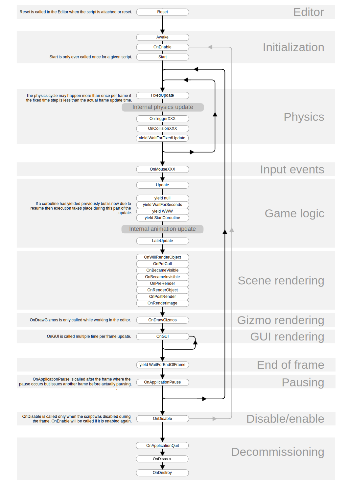
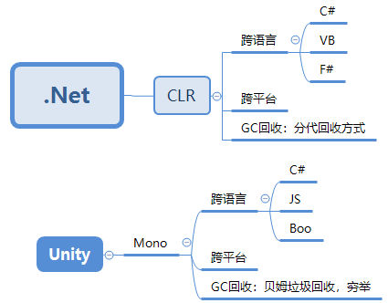
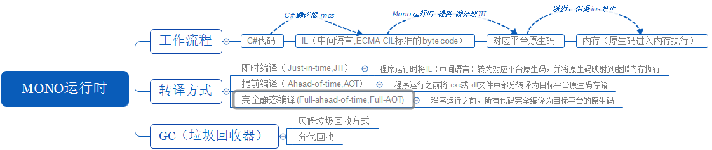
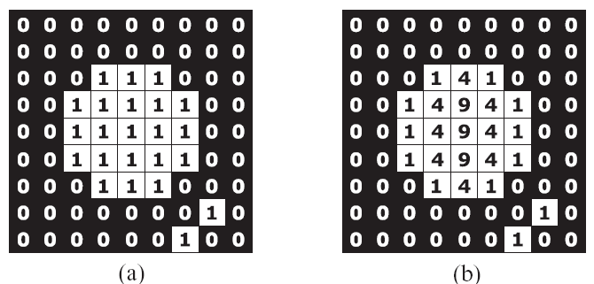
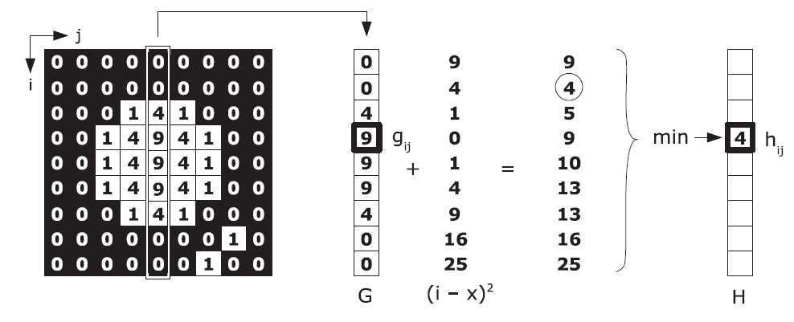
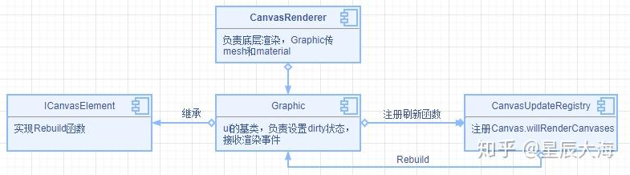
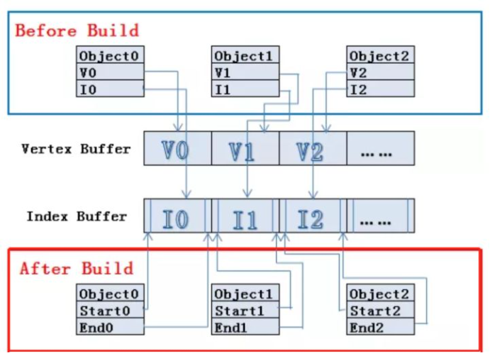
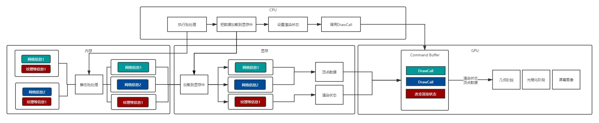
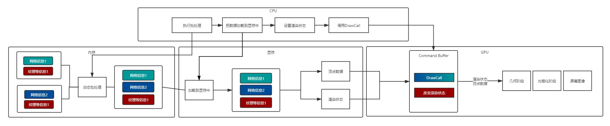

## 业务

### Unity 的运行时序

<center>
    
</center>

### Unity 垃圾回收机制

简单来看下 BDWGC（全称：Boehm-Demers-Weiser conservative garbage collector），也就是常说的 Boehm 回收器。其实它除了回收之外还做了很多分配的工作，甚至还可以用来检查内存泄漏。

而 Unity 用的是改良过的 BDWGC，它属于保守式内存回收。目前主流的回收器有如下三种：

* 保守式回收（Conservative GC），以 Boehm 为代表。
* 分代式回收（Generational GC），以 SGen（Simple Generational GC）为代表。
* 引用（计数）式内存回收（Reference Counting GC），例如 Java 就是使用的这种，但是它是结合了保守式的引用式内存回收。
那么为什么 Unity 不用分代式的呢？分代式的是否更好呢？答案是，虽然分代式确实有很多的优点，但是它们都要付出额外的代价。例如分代式的 GC，它要进行内存块的移动，一块内存在频繁分配区长时间不动的话，会被移动到长时分配区，造成额外消耗。另外每次回收的时候还要进行一个评估，判断当前内存是否是一个活跃内存，这些东西都不是免费的，而是要消耗额外的 CPU 性能。当然 sGen 也有它的优势，例如它是可移动的，可以进行合并的（可以减少内存碎片）等等。但是在计算力本身就很紧张的移动平台上，再花费 CPU 去计算内存的搬迁和移动实际上是不合算的，引用计数也有类似的问题，所以 unity 还是使用相对比较保守的 Boehm 回收。

### Unity 数据持久化你使用过哪些、说说它们之间的优缺点

#### PlayerPrefs

这是 Unity 自带的解决方案，会自动生成文件存储于本地，API 简单，封装了繁琐的序列化反序列化过程，但他只支持几种基本数据类型，`string`、`int`、`float`，比较简单的数据存读取功能的话，用这个会比较方便。

#### ScriptableObject

ScriptableObject 并不依赖于游戏对象（GameObject），也不受场景加载和卸载的影响。它的生命周期由 Unity 引擎管理

#### 序列化：Json、XML、二进制

关于序列化：

* 必须是`public`类，其中的字段或属性必须是可序列化的
* 类中的方法不会被序列化
* 构造函数不可被序列化
* 不可被序列化的数据类型：
  * 静态类或静态成员
  * 委托
  * 事件
  * 指针
  * 索引器

Json 是字符串文本，可以存储复杂一点的对象；XML 一样可以存储复杂数据对象，相较于 Json 优点是可读性良好，但效率较低，适合大量的数据配置；二进制就是 01 序列，在数据存储和传输效率、紧凑性和速度上占有优势（ProtoBuf、MessagePack）

#### 几个含 Serialize 的相关属性

* `Serializable`是一个 C#中的特性，它告诉编译器这个类是可以被序列化
* `SerializeReference`是 Unity 2019.3 引入的新特性，用于处理多态对象的序列化，使得可以在 Inspector 窗口中为该字段分配任意继承自同意父类的对象
* `SerializeField`这个是把`private`变量暴露到 Inspector 中

## C#

### List 的底层原理、Dictionary 的底层原理

#### List 底层实现浅析

##### `Add`

在`Add`前，都会调用`EnsureCapacity`来保证有充足的空间存放元素，如果容量不足，就会进行扩容，每次容量不够的时候，整个数组的容量都会扩充一倍，`_defaultCapacity`是容量的默认值为 4。因此整个扩充的路线为 4，8，16，32，64，128，256，512，1024，……以此类推

> List 使用数组形式作为底层数据结构，好处是使用索引方式提取元素很快，但在扩容的时候就会很糟糕，每次 new 数组都会造成内存垃圾，这给垃圾回收 GC 带来了很多负担

##### `Insert`

```c#
public void Insert(int index, T item) {
    // Note that insertions at the end are legal.
    if ((uint) index > (uint)_size) {
        ThrowHelper.ThrowArgumentOutOfRangeException(ExceptionArgument.index, ExceptionResource.ArgumentOutOfRange_ListInsert);
    }
    Contract.EndContractBlock();
    if (_size == _items.Length) EnsureCapacity(_size + 1);
    if (index < _size) {
        Array.Copy(_items, index, _items, index + 1, _size - index);
    }
    _items[index] = item;
    _size++;            
    _version++;
}
```

插入的关键就是`Array.Copy(_items, index, _items, index +1, _size - index)`，把指定索引加 1 到数组末尾的元素向后移动，然后赋值，这个跟数组的插入删除一样，都要花费$O(n)$的时间去挪动数组

##### `Remove`

```c#
public bool Remove(T item) {
    int index = IndexOf(item);
    if (index >= 0) {
        RemoveAt(index);
        return true;
    }
    return false;
}

public void RemoveAt(int index) {
    if ((uint)index >= (uint)_size) {
        ThrowHelper.ThrowArgumentOutOfRangeException();
    }
    Contract.EndContractBlock();
    _size--;
    if (index < _size) {
        Array.Copy(_items, index + 1, _items, index, _size - index);
    }
    _items[_size] = default(T);
    _version++;
}
```

删除跟插入相反，`Array.Copy(_items, index +1, _items, index, _size - index)`，用`IndexOf`（遍历）找到指定元素在数组中的索引，然后用指定索引加 1 到数组末尾的元素向前移动，覆盖。这个步骤，被删除元素后面的数都要往前移动，时间复杂度$O(n)$

> 在使用 List 的时候，要注意，如果过于频繁使用的话，会导致效率降低，也会造成不少内存的冗余，使得垃圾回收 (GC) 时承担了更多的压力

##### 索引

```c#
public T this[int index] {
    get {
        // Following trick can reduce the range check by one
        if ((uint) index >= (uint)_size) {
            ThrowHelper.ThrowArgumentOutOfRangeException();
        }
        Contract.EndContractBlock();
        return _items[index]; 
    }

    set {
        if ((uint) index >= (uint)_size) {
            ThrowHelper.ThrowArgumentOutOfRangeException();
        }
        Contract.EndContractBlock();
        _items[index] = value;
        _version++;
    }
}
```

##### `Clear`

```c#
public void Clear() {
    if (_size > 0)
    {
        Array.Clear(_items, 0, _size); // Don't need to doc this but we clear the elements so that the gc can reclaim the references.
        _size = 0;
    }
    _version++;
}
```

`Clear`接口在调用时并不会删除数组，而只是将数组中的元素清零，并设置 `_size` 为 0 而已，用于虚拟地表明当前容量为 0

##### `foreach`

已经在 unity5.5 解决之前，`foreach`每次获取迭代器时，会新建一个`Enumerator`，如果大量使用迭代器的话就会造成大量的垃圾对象，在 unity5.5 解决之后就不会产生额外的 GC 了

##### `Sort`

`Array.Sort`使用的是快速排序方式进行排序，List 的 `Sort` 排序的效率为$O(n \log^n)$。

#### Dictionary 底层实现浅析

##### `Entry`结构体

Dictionary 种存放数据的最小单位，调用`Add(Key, Value)`方法添加的元素都会被封装在这样的一个结构体中
```c#
private struct Entry {
    public int hashCode;    // 除符号位以外的 31 位 hashCode 值，如果该 Entry 没有被使用，那么为-1
    public int next;        // 下一个元素的下标索引，如果没有下一个就为-1
    public TKey key;        // 存放元素的键
    public TValue value;    // 存放元素的值
}
```

除了 Entry 结构体外，还有几个关键的私有变量

```c#
private int[] buckets;		// Hash 桶
private Entry[] entries;	// Entry 数组，存放元素
private int count;			// 当前 entries 的 index 位置
private int version;		// 当前版本，防止迭代过程中集合被更改
private int freeList;		// 被删除 Entry 在 entries 中的下标 index，这个位置是空闲的
private int freeCount;		// 有多少个被删除的 Entry，有多少个空闲的位置
private IEqualityComparer<TKey> comparer;	// 比较器
private KeyCollection keys;		// 存放 Key 的集合
private ValueCollection values;		// 存放 Value 的集合
```

##### Add 操作

```c#
public void Add(TKey key, TValue value) {
    Insert(key, value, true);
}

private void Insert(TKey key, TValue value, bool add){
    
    if( key == null ) {
        ThrowHelper.ThrowArgumentNullException(ExceptionArgument.key);
    }

    if (buckets == null) Initialize(0);
    // 通过 key 获取 hashCode
    int hashCode = comparer.GetHashCode(key) & 0x7FFFFFFF;
    // 计算出目标 bucket 下标
    int targetBucket = hashCode % buckets.Length;
	// 碰撞次数
    int collisionCount = 0;
    for (int i = buckets[targetBucket]; i >= 0; i = entries[i].next) {
        if (entries[i].hashCode == hashCode && comparer.Equals(entries[i].key, key)) {
            // 如果是增加操作，遍历到了相同的元素，那么抛出异常
            if (add) {      
				ThrowHelper.ThrowArgumentException(ExceptionResource.Argument_AddingDuplicate);
            }
            // 如果不是增加操作，那可能是索引赋值操作 dictionary["foo"] = "foo"
            // 那么赋值后版本++，退出
            entries[i].value = value;
            version++;
            return;
        }
        // 每遍历一个元素，都是一次碰撞
        collisionCount++;
    }
    int index;
    // 如果有被删除的元素，那么将元素放到被删除元素的空闲位置
    if (freeCount > 0) {
        index = freeList;
        freeList = entries[index].next;
        freeCount--;
    }
    else {
        // 如果当前 entries 已满，那么触发扩容
        if (count == entries.Length)
        {
            Resize();
            targetBucket = hashCode % buckets.Length;
        }
        index = count;
        count++;
    }

    // 给 entry 赋值
    entries[index].hashCode = hashCode;
    entries[index].next = buckets[targetBucket];
    entries[index].key = key;
    entries[index].value = value;
    buckets[targetBucket] = index;
    // 版本号++
    version++;

    // 如果碰撞次数大于设置的最大碰撞次数，那么触发 Hash 碰撞扩容
    if(collisionCount > HashHelpers.HashCollisionThreshold && HashHelpers.IsWellKnownEqualityComparer(comparer)) 
    {
        comparer = (IEqualityComparer<TKey>) HashHelpers.GetRandomizedEqualityComparer(comparer);
        Resize(entries.Length, true);
    }
}

```

##### Find 操作

```c#
// 寻找 Entry 元素的位置
private int FindEntry(TKey key) {
    if( key == null) {
        ThrowHelper.ThrowArgumentNullException(ExceptionArgument.key);
    }

    if (buckets != null) {
        int hashCode = comparer.GetHashCode(key) & 0x7FFFFFFF; // 获取 HashCode，忽略符号位
        // int i = buckets[hashCode % buckets.Length] 找到对应桶，然后获取 entry 在 entries 中位置
        // i >= 0; i = entries[i].next 遍历单链表
        for (int i = buckets[hashCode % buckets.Length]; i >= 0; i = entries[i].next) {
            // 找到就返回了
            if (entries[i].hashCode == hashCode && comparer.Equals(entries[i].key, key)) return i;
        }
    }
    return -1;
}

internal TValue GetValueOrDefault(TKey key) {
    int i = FindEntry(key);
    // 大于等于 0 代表找到了元素位置，直接返回 value
    // 否则返回该类型的默认值
    if (i >= 0) {
        return entries[i].value;
    }
    return default(TValue);
}

 public bool TryGetValue(TKey key, out TValue value) {
    int i = FindEntry(key);
    if (i >= 0) {
        value = entries[i].value;
        return true;
    }
    value = default(TValue);
    return false;
}
```

##### Remove 操作

```c#
public bool Remove(TKey key) {
    if(key == null) {
        ThrowHelper.ThrowArgumentNullException(ExceptionArgument.key);
    }

    if (buckets != null) {
        // 1. 通过 key 获取 hashCode
        int hashCode = comparer.GetHashCode(key) & 0x7FFFFFFF;
        // 2. 取余获取 bucket 位置
        int bucket = hashCode % buckets.Length;
        // last 用于确定是否当前 bucket 的单链表中最后一个元素
        int last = -1;
        // 3. 遍历 bucket 对应的单链表
        for (int i = buckets[bucket]; i >= 0; last = i, i = entries[i].next) {
            if (entries[i].hashCode == hashCode && comparer.Equals(entries[i].key, key)) {
                // 4. 找到元素后，如果 last< 0，代表当前是 bucket 中最后一个元素，那么直接让 bucket 内下标赋值为 entries[i].next 即可
                if (last < 0) {
                    buckets[bucket] = entries[i].next;
                }
                else {
                    // 4.1 last 不小于 0，代表当前元素处于 bucket 单链表中间位置，需要将该元素的头结点和尾节点相连起来，防止链表中断
                    entries[last].next = entries[i].next;
                }
                // 5. 将 Entry 结构体内数据初始化
                entries[i].hashCode = -1;
                // 5.1 建立 freeList 单链表
                entries[i].next = freeList;
                entries[i].key = default(TKey);
                entries[i].value = default(TValue);
                // *6. 关键的代码，freeList 等于当前的 entry 位置，下一次 Add 元素会优先 Add 到该位置
                freeList = i;
                freeCount++;
                // 7. 版本号+1
                version++;
                return true;
            }
        }
    }
    return false;
}
```

##### Resize 操作（扩容）
两种情况会发生扩容操作：
* `entries`数组满了，没有办法继续存放新的元素
* Dictionary 中发生的碰撞次数太多，会严重影响性能，也会触发扩容操作

> 目前。Net Framwork 4.7 中设置的碰撞次数阈值为 100

```c#
private void Resize() {
    Resize(HashHelpers.ExpandPrime(count), false);
}

private void Resize(int newSize, bool forceNewHashCodes) {
    Contract.Assert(newSize >= entries.Length);
    // 1. 申请新的 Buckets 和 entries
    int[] newBuckets = new int[newSize];
    for (int i = 0; i < newBuckets.Length; i++) newBuckets[i] = -1;
    Entry[] newEntries = new Entry[newSize];
    // 2. 将 entries 内元素拷贝到新的 entries 总
    Array.Copy(entries, 0, newEntries, 0, count);
    // 3. 如果是 Hash 碰撞扩容，使用新 HashCode 函数重新计算 Hash 值
    if(forceNewHashCodes) {
        for (int i = 0; i < count; i++) {
            if(newEntries[i].hashCode != -1) {
                newEntries[i].hashCode = (comparer.GetHashCode(newEntries[i].key) & 0x7FFFFFFF);
            }
        }
    }
    // 4. 确定新的 bucket 位置
    // 5. 重建 Hahs 单链表
    for (int i = 0; i < count; i++) {
        if (newEntries[i].hashCode >= 0) {
            int bucket = newEntries[i].hashCode % newSize;
            newEntries[i].next = newBuckets[bucket];
            newBuckets[bucket] = i;
        }
    }
    buckets = newBuckets;
    entries = newEntries;
}

```

##### Collection 版本控制

迭代过程中不允许集合出现变化，否则会抛出<font color="#FF6D60">System.InvalidOperationException:"Collection was modified; enumeration operation may not execute."</font>这样的异常

```c#
internal Enumerator(Dictionary<TKey,TValue> dictionary, int getEnumeratorRetType) {
    this.dictionary = dictionary;
    version = dictionary.version;
    index = 0;
    this.getEnumeratorRetType = getEnumeratorRetType;
    current = new KeyValuePair<TKey, TValue>();
}
 
public bool MoveNext() {
    if (version != dictionary.version) {
        ThrowHelper.ThrowInvalidOperationException(ExceptionResource.InvalidOperation_EnumFailedVersion);
    }
    // Use unsigned comparison since we set index to dictionary.count+1 when the enumeration ends.
    // dictionary.count+1 could be negative if dictionary.count is Int32.MaxValue
    while ((uint)index < (uint)dictionary.count) {
        if (dictionary.entries[index].hashCode >= 0) {
            current = new KeyValuePair<TKey, TValue>(dictionary.entries[index].key, dictionary.entries[index].value);
            index++;
            return true;
        }
        index++;
    }
    index = dictionary.count + 1;
    current = new KeyValuePair<TKey, TValue>();
    return false;
}
```

在迭代器初始化时，就会记录`dictionary.version`版本号，之后每一次迭代过程都会检查版本号是否一致，如果不一致将抛出异常。这样就避免了在迭代过程中修改了集合，造成很多诡异的问题

### 装修拆箱

```c#
int x = 1023;
object o = x; //装箱
int y = (int) o; //拆箱
```
装箱：值类型转换为引用对象，一般是转换为 System.Object 类型或值类型实现的接口引用类型

* 在堆中申请内存，内存大小为值类型的大小，再加上额外固定空间（引用类型的标配：`TypeHandle`和同步索引块）
* 将值类型的字段值（`x = 1023`）拷贝新分配的内存中
* 返回新引用对象的地址（给引用变量`object o`）

拆箱：引用类型转换为值类型，注意，这里的引用类型只能是被装箱的引用类型对象

* 检查实例对象（`object o`）是否有效，如是否为`null`，判断其装箱的类型与拆箱的类型（`int`）是否一致，如检测不合法，抛出异常
* 指针返回，就是获取装箱对象（`object o`）中值类型字段值的地址
* 字段拷贝，把装箱对象（`object o`）中值类型字段值拷贝到栈上，意思就是创建一个新的值类型变量来存储拆箱后的值

> * 只有值类型才有装箱、拆箱两个状态，而引用类型一直都在箱子里
> * 一般来说，装箱的性能开销更大，因为引用对象的分配更加复杂，成本也更高，值类型分配在栈上，分配和释放的效率都很高。装箱过程是需要创建一个新的引用类型对象实例，拆箱过程需要创建一个值类型字段，开销更低

### 事件委托

委托是一个类，它定义了方法的类型，使得可以将方法当作另一个方法的参数来进行传递，事件是一种特殊的委托

#### 委托

委托，是一种存储函数引用的类型。声明一个委托与声明函数类似，区别在于不包含函数体，需要使用关键字`delegate`。一个委托包含其可以引用的函数签名（返回类型和参数列表）

对于委托的初始化赋值，可以使用两种语法：
```c#
// 方法一
delegate double ProcessDelegate(double arg1, double arg2);
ProcessDelegate process;

// 方法二
process = new ProcessDelegate(Multiply) // double Multiply(double arg1, double arg2)
process = Divide; // double Divide(double arg1, double arg2)
```

委托对象可使用`+`运算符进行合并。一个合并委托调用它所合并的两个委托。只有相同类型的委托可被合并。`-`运算符可用于从合并的委托中移除组件委托。这样就可以创建一个委托被调用时要调用的方法的调用列表。但是多播委托的调用顺序无法保证

#### 委托的类型：`delegate`、`Action`、`Func`、`predicate`

* `delegate`：至少 0 个参数，至多 32 个参数，可以无返回值，也可以指定返回值类型
* `Action`：是无返回值的泛型委托
* `Func`：是有返回值的泛型委托
* `predicate`：是返回 bool 型的泛型委托

#### 事件

事件类似于异常，都由对象引发（或抛出），然后通过提供的代码进行处理。事件需要在处理之前进行订阅（ subscribe ），表示提供了在事件发生时需要执行的代码，即事件处理程序。C# 中的事件`event`关键字是语言层面的<font color="#FF6D60">观察者模式</font>的实现，将事件的发起者（被观察者）与处理者（观察者）的代码解耦。事件处理程序需要被匹配事件所要求的返回值和参数，这个限制由委托来指定

在 C#中，事件就像是一种机制，在程序运行到一定阶段的时候或者遇到某些状况的时候，就会触发一个事件。然后如果有其他代码订阅了这个事件，就会自动执行订阅的代码。描述起来很抽象，简单来讲就是在类声明一个委托，并标记这个委托是一个事件，在另一个方法中执行这个事件。其中，触发这个事件的类称为发布者，接受或者注册了处理方法的类称为订阅者

声明一个事件有两种方式，一种是直接使用`EventHandler`，另一种是自己先定义一个委托，然后用这个委托定义事件

* 使用 EventHandler

```c#
public class EventDemo
{
    public event EventHandler HandlerEvent;
}
```

* 使用自定义委托

```c#
public class EventDemo
{
    public delegate void EventDelegate(object sender, EventArgs e);
    public event EventDelegate DelegateEvent;
}
```

一般事件的定义约定俗称是一个`void`方法，第一个参数是`sender`表示事件的发布者，默认是`object`类型，第二个参数是`EventArgs`类型的事件变量，表示触发事件时需要订阅者注意的内容，一般用来传一些参数；`EventArgs`只有一个默认构造方法和几个继承自`Object`的方法。所以在开发中，会定义一个事件变量类型，为了保持一致会继承`EventArgs`

##### Demo

```c#
public class EventDemo
{
    public delegate void EventDelegate(object sender, EventArgs e);

    public event EventDelegate DelegateEvent;

    public void Trigger()
    {
        if (DelegateEvent != null)// 触发事件，按需判断事件的订阅者列表是否为空
        {
            DelegateEvent(this, new EventArgs());
        }
    }
}

EventDemo demo = new EventDemo(); 
demo.DelegateEvent += (sender, eventArgs) =>
{
    //省略订阅者的方法内容
}
demo.Trigger();//触发事件
```

将其中的`event`去掉，程序依然正常运行，不会出现任何问题。事件实际上是一个特殊的委托实例，不用事件也没有关系。实际上事件只是削弱了委托的功能，`event`在编译器角度保护了程序的安全，因为只能使用`+=`、`-=`来注册事件了，而不能使用`=`为事件关联方法。（在委托中还可以使用`=`来绑定方法，不过=是一种破坏性代码，不管之前是否已经绑定的有方法了，都会将其清除）

### C#的异步和 Unity 的协程

#### 协程 Coroutine —— <font color="#FF6D60">伪异步</font>

Unity 引擎是单线程的（也就是有一个主线程）。为了满足开发者的特定的<font color="#FF6D60">异步</font>、<font color="#FF6D60">多线程</font>的开发需求，Unity 也提供了一个<font color="#FF6D60">伪异步</font>的解决思想——协程。
需要注意的是，协程不是线程，也不是异步执行的，本质上其实还是在生命周期的`Update`中执行的

使用协程的好处就在于：
* 大大减少了`Update`函数的臃肿
* 方便开发者对代码的阅读和维护

弊端：
* 运行效率没有变化
* 不能返回值，只能注入委托调用

#### 线程 Thread —— <font color="#FF6D60">真异步</font>

多线程（Thread）是 C#带来的特性。
在 Unity 中恰当的使用多线程会提高一定的程序效率，使用多线程的场景一般是涉及到数据的加载和逻辑处理，不如文件读写，网络通信等。

!!! note "note"
    子线程内不可访问游戏对象或者组件以及相关的 Unity API，如果需要与主线程沟通的话需要进行回调

##### [利用`async`和`await`简化多线程异步调用](https://learn.microsoft.com/zh-cn/dotnet/csharp/asynchronous-programming/task-asynchronous-programming-model#BKMK_WhatHappensUnderstandinganAsyncMethod)

<center>
    
</center>

##### [官方建议](https://learn.microsoft.com/zh-cn/dotnet/csharp/asynchronous-programming/async-scenarios?source=recommendations#important-info-and-advice)

* 两者的功能是有区别的，但是一般都是被搭配一起使用
* `await`运算符通知编译器异步方法：在等待的异步过程完成后才能继续通过该点。 同时，控制返回至异步方法的调用方。
* `async`关键字仅用于修饰方法体，并且方法体中一定要有`await`关键字存在，**否则它们将永不暂停**
* 对`Task<TResult>`类型前使用`await`关键字，代表对该`Task`进行异步等待返回结果，届时会被挂起直到异步操作完成

### Coroutine 的原理、Coroutine 在哪些场景会被用到

A coroutine is a function that is executed partially and, presuming suitable conditions are met, will be resumed at some point in the future until its work is done.

即协程是一个分部执行，遇到条件（yield return 语句）会挂起，直到条件满足才会被唤醒继续执行后面的代码

通过设置 MonoBehaviour 脚本的 enabled 对协程是没有影响的，但如果`gameObject.SetActive(false)`则已经启动的协程则完全停止了，即使在 Inspector 把 gameObject 激活还是没有继续执行。也就说协程虽然是在 MonoBehvaviour 启动的（StartCoroutine）但是协程函数的地位完全是跟 MonoBehaviour 是一个层次的，不受 MonoBehaviour 的状态影响，但跟 MonoBehaviour 脚本一样受 gameObject 控制，也应该是和 MonoBehaviour 脚本一样每帧“轮询”`yield`的条件是否满足

### 值类型和引用类型

> 值类型将数据和内存都保存在同一位置，而引用类型则会有一个指向实际内存区域的指针

* <font color="#6DA9E4">值类型</font>：当将一个`int`类型的值赋值到另一个`int`类型的值时，它实际上是创建了一个完全不同的副本。换句话说，如果改变了其中某一个的值，另一个不会发生改变。C#的所有值类型均隐式派生自`System.ValueType`
* <font color="#6DA9E4">引用类型</font>：当创建一个对象并且将此对象赋值给另外一个对象时，他们彼此都指向了内存中同一块区域。因此，当将`obj`赋值给`obj1`时，他们都指向了堆中的同一块区域。换句话说，如果此时改变了其中任何一个，另一个都会受到影响

#### 哪些是值类型，哪些是引用类型

* C#的值类型包括：数值类型、`bool`、用户定义的`struct`，`enum`，可空类型
* C#的引用类型包括：数组，`class`、`interface`、`delegate`，`object`，`string`

### C#中`struct`和`class`的区别，分别存放在哪个内存区

* `struct`是值类型，`class`是对象类型
* `struct`不能被继承，`class`可以被继承
* `struct`默认的访问权限是`public`，而`class`默认的访问权限是`private`
* `struct`总是有默认的构造函数，即使是重载默认构造函数仍然会保留。这是因为`struct`的构造函数是由编译器自动生成的，但是如果重载构造函数，必需对`struct`中的变量全部初始化。并且`struct`的用途是那些描述轻量级的对象，例如`Line`，`Point`等，并且效率比较高。`class`在没有重载构造函数时有默认的无参数构造函数，但是一被重载，默认构造函数将被覆盖
* `struct`的 new 和`class`的 new 是不同的。`struct`的 new 就是执行一下构造函数创建一个新实例再对所有的字段进行拷贝。而`class`则是在堆上分配一块内存然后再执行构造函数，`struct`的内存并不是在`new`的时候分配的，而是在定义的时候分配

在 C#中，用`struct`或`class`来声明一个类型为值类型/引用类型。考虑下面的例子：

```c#
SomeType[] oneTypes = new SomeType[100];
```

* 如果`SomeType`是值类型，则只需要一次分配，大小为`SomeType`的 100 倍
* 如果`SomeType`是引用类型，刚开始需要 100 次分配，分配后数组的各元素值为`null`，然后再初始化 100 个元素，结果总共需要进行 101 次分配。这将消耗更多的时间，造成更多的内存碎片。所以，如果类型的职责主要是存储数据，值类型比较合适

#### `struct`和`class`应用上的区别

* 值类型适合存储供 C#应用程序操作的数据
* 引用类型应该用于定义应用程序的行为

#### 创建值类型的前提

* 该类型的主要职责用于数据存储
* 该类型的共有接口完全由一些数据成员存取属性定义
* 该类型永远不可能有子类
* 该类型不具有多态行为

### 对象池重复依赖和循环依赖的话怎么处理

### .Net 与 Mono 的关系

#### .Net

.Net 拥有跨语言，跨平台性

* 跨语言：就是只要是面向 .Net 平台的编程语言，用其中一种语言编写的类型就可以无缝的在另外一种语言编写的应用程序中互操作。
* 跨平台：一次编译，不需要任何代码修改，应用程序就可以运行在任意在 .Net 实现的平台上跑，即代码不依赖于操作系统，也不依赖硬件环境。一个 .Net 程序运行的核心在于 .Net

CLR（公共语言运行时，或者称为 .Net 虚拟机，类似 Java 虚拟机的概念），为了让 .Net 程序在其他平台（目前只能在 .Net 平台，windows 系统）上跑，微软官方还推出了在其他平台上 (MacOs,Linux) 跑的
.Net 的实现，就推出了。Net Core。然而，Unity 引擎需求也是需要跨平台，支持多语言（C#，Js，Boo）。就参考微软开发 .Net Core 的概念，于是，推出了 Mono

<center>
    
</center>

#### Mono

<center>
    
</center>

* mcs 编译器：C#编译器，C#编译为 IL 中间指令
* Unity 跨平台的原理：就是 Mono 运行时编译器支持将 IL 代码转为对应平台原生码，IL 可以在任何支持 CLI(Common Language Insfrastructure, 通用语言环境结构）中运行，IL 的运行是依托于 Mono 运行时
* IOS 不支持 jit 编译原因：机器码被禁止映射到内存，即封存了内存的可执行权限，变相的封锁了 jit 编译方式，[详情参考](https://www.cnblogs.com/murongxiaopifu/p/4278947.html)
* JIT 编译：将 IL 代码转为对应平台原生码并且将原生码映射到虚拟内存中执行。JIT 编译的时候 IL 是在依托 Mono 运行时，转为对应的原生码后在依托本地运行。
* AOT，JIT，Full-AOt 三者关系：注意 JIT，AOT 编译并不是互斥关系，他们可以共存。Mono 的 AOT 模式仍然会保留部分代码在程序运行时采用 jit 编译，因为 ios 被禁止了 jit，为了解决这个问题，Mono 提供了一个被称为 Full-AOT 的模式。即预先对程序集中所有 IL 代码进行 AOT 编译生成一个本地代码映像，然后在运行时直接加载这个映像而不再使用 jit

### C# 中抽象类`abstract`和接口`interface`的相同点与区别

#### 相同点

* 都可以被继承
* 都不能被实例化
* 都可以包含方法声明
* 派生类必须实现未实现的方法

#### 区别

* 抽象基类可以定义字段、属性、方法实现。接口只能定义属性、索引器、事件、和方法声明，不能包含字段。
* 抽象类是一个不完整的类，需要进一步细化，而接口是一个行为规范。微软的自定义接口总是后带able字段，证明其是表述一类“我能做。。。”
* 接口可以被多重实现，抽象类只能被单一继承
* 抽象类更多的是定义在一系列紧密相关的类间，而接口大多数是关系疏松但都实现某一功能的类中
* 抽象类是从一系列相关对象中抽象出来的概念，因此反映的是事物的内部共性；接口是为了满足外部调用而定义的一个功能约定， 因此反映的是事物的外部特性
* 接口基本上不具备继承的任何具体特点,它仅仅承诺了能够调用的方法
* 接口可以用于支持回调,而继承并不具备这个特点
* 抽象类实现的具体方法默认为虚的，但实现接口的类中的接口方法却默认为非虚的，当然您也可以声明为虚的
* 如果抽象类实现接口，则可以把接口中方法映射到抽象类中作为抽象方法而不必实现，而在抽象类的子类中实现接口中方法

## 渲染

### 渲染流程

<center>
    
</center>

### DrawCall 是什么、DrawCall 过高会有什么影响

#### 什么是 DrawCall

DrawCall 本身的含义很简单，就是 CPU 调用图像编程接口，如 OpenGL 中的`glDrawElements`命令或者 DirectX 中的`DrawlndexedPrimitive`命令，以命令 GPU 进行渲染的操作

#### 为什么 DrawCall 过高会影响帧率

在每次调用 DrawCall 之前， CPU 需要向 GPU 发送很多内容，包括数据、状态和命令等。在这一阶段， CPU 需要完成很多工作，例如检查渲染状态等。而一旦 CPU 完成了这些准备工作， GPU 就可以开始本次的渲染。GPU 的渲染能力是很强的，渲染 200 个还是 2000 个三角网格通常没有什么区别，因此渲染速度往往快于 CPU 提交命令的速度。如果 DrawCall 的数量太多， CPU 就会把大量时间花费在提交 DrawCall 上，造成 CPU 的过载

#### DrawCall 优化方案

* 静态合并
* 动态合并
* GPU Instancing
* SRP Batcher（本质上 DrawCall 不会减少，减少的是 DrawCall 数据拷贝）

!!! Warning "关于 DrawCall 相关还需要注意的问题"
    - 如果静态批处理前有一些物体共享了相同的网格，那么每一个物体都会有一个该网格的复制品（本来 Unity 只会保留一份，但是静态批处理会生成新的一个大网格，所以会保留所有物体的网格，最后合并），即一个网格会变成多个网格被发送给 GPU，这回导致一次性提交过大的数据，虽然引擎是有限制的，一般是 65535 个顶点
    - 对于那些 shader 相同，纹理不同导致的不同材质无法进行批处理的物体（比如项目中的场景环境，地面，如果都使用了比较复杂的 Shader）通过纹理合并的方法来使得它们可以被静态批处理。但这会引发带宽问题，详细原因关系到 Bus 总线带宽的问题
    - 一下子提交大量的 DrawCall 导致的卡顿问题，这个可以阅读下 [多线程渲染](https://zhuanlan.zhihu.com/p/44116722) 相关的。主要是可能是因为，提交渲染 (`eglSwapBuffers`) 会导致驱动层中缓存的渲染指令立即执行，此时 CPU 被阻塞。如果在提交渲染时驱动层缓存了大量的指令，CPU 就会被阻塞很长时间；也可能是因为提交大量 DrawCall 的时候存在纹理的 Upload
    - CPU 完成一次 DrawCall，除了需要发一个 DrawCall 的命令之外，还需要把内存中顶点数据、纹理贴图、Shader 参数通过 Bus 总线拷贝到内存分配给 GPU 的显存之中，注意这是拷贝，不是指针传递，速度不快。如果一次 DrawCall 传递的数据过大，带宽成为了瓶颈，那就会大大影响效率（其它的 DrawCall 无法出发，GPU 又处于闲置）。这种情况最有可能出现在为了减少 DrawCall，疯狂的合并纹理上。在项目中，UI 的 DrawCall 调用占了很大一部分，也会最难优化的。为了减少 DrawCall , 把 UI 合并成大的贴图，DrawCall 下降了，但是帧率却也下降了，内存使用也增加了，原因就是这个。在项目中，不会同时出现的元素不要打包到一起，保证单张合并纹理不大于 1024 一般就不会有问题了，最大尽量不要超过 2048

### LOD 是什么，优缺点是什么

LOD 技术即 Levels of Detail 的简称，意为多细节层次。LOD 技术指根据物体模型的节点在现实环境中所处的位置和重要度，决定物体渲染的资源分配，降低非重要物体的面熟和细节的，从而获得高效率的渲染运算

* 优点：可根据具体动态地渲染不同细节的模型
* 缺点：加重美术的负担，要准备不同细节的同一模型，同样的会稍微增加包体大小

### MipMap 是什么，优缺点是什么

MipMap，又叫多级渐进贴图纹理映射，根据渲染物体距离相机的远近，选用不同大小的纹理贴图

* 可以使得远处的像素不发生闪烁
* 减小带宽：因为在读取贴图的时候，正常的 UV 在 0~1 的区间连续读取，GPU 会尽量将这个 Shader 中读取这张贴图的指令拼接在一起，GPU 会将贴图中第一个读取指令的 UV 值的周围的一块像素读取到 L2，L1 缓存中，这就是贴图读取的预测策略。这样做的好处就是：由于 UV 连续，这样会有高命中率直接获取所需要 UV 值的颜色，要采样的两个 UV 距离很远时，当内存中不存在这个贴图的 UV 位置的内存数据，那么久职能清空当前已经进入缓存的数据，重新采样对应 UV 的周围一块像素值，再次放入 L2，L1 缓存中，这就是**缓存命中率降低**造成的带宽上升

缺点：会占用内存（大约为 1/3）

### OverDraw 是什么，过高会有什么影响，怎么优化 OverDraw

Overdraw 是指在渲染过程中，同一像素被多次绘制的现象。当游戏中有大量的透明物体叠加在一起时，Overdraw 就会发生。这是因为在渲染管线中，像素的颜色计算是基于背后像素的颜色计算的。当多个透明物体重叠在一起时，每个像素都需要计算多次，导致性能下降。

造成 Overdraw 的原因有很多，其中之一是使用了过多的透明材质。透明材质在渲染过程中需要额外的计算资源，因此使用过多的透明材质会增加 Overdraw 的发生概率。另一个原因是过度使用粒子系统。粒子系统在渲染过程中会产生大量的透明像素，因此过度使用粒子系统也会增加 Overdraw 的发生。

为了减少 Overdraw 对游戏性能的影响，我们可以采取一些优化措施。首先，我们可以合并多个透明物体为一个物体。通过将多个透明物体合并为一个物体，可以减少 Overdraw 的发生。其次，我们可以使用不透明的材质替代透明材质。不透明材质不需要额外的计算资源，因此可以减少 Overdraw 的发生。此外，我们还可以通过减少粒子系统的使用来减少 Overdraw 的发生。

## 工具

### TextMeshPro

#### UGUI 的`Text`的文字是如何渲染出来

`Text`继承了`MaskableGraphic`, `ILayoutElement`

```c#
protected override void OnPopulateMesh(VertexHelper toFill)
{
    if (font == null)
        return;
 
    // We don't care if we the font Texture changes while we are doing our Update.
    // The end result of cachedTextGenerator will be valid for this instance.
    // Otherwise we can get issues like Case 619238.
    m_DisableFontTextureRebuiltCallback = true;
 
    Vector2 extents = rectTransform.rect.size;
 
    var settings = GetGenerationSettings(extents);
    cachedTextGenerator.PopulateWithErrors(text, settings, gameObject);
 
    // Apply the offset to the vertices
    IList<UIVertex> verts = cachedTextGenerator.verts;
    float unitsPerPixel = 1 / pixelsPerUnit;
    int vertCount = verts.Count;
 
    // We have no verts to process just return (case 1037923)
    if (vertCount <= 0)
    {
        toFill.Clear();
        return;
    }
 
    Vector2 roundingOffset = new Vector2(verts[0].position.x, verts[0].position.y) * unitsPerPixel;
    roundingOffset = PixelAdjustPoint(roundingOffset) - roundingOffset;
    toFill.Clear();
    if (roundingOffset != Vector2.zero)
    {
        for (int i = 0; i < vertCount; ++i)
        {
            int tempVertsIndex = i & 3;
            m_TempVerts[tempVertsIndex] = verts[i];
            m_TempVerts[tempVertsIndex].position *= unitsPerPixel;
            m_TempVerts[tempVertsIndex].position.x += roundingOffset.x;
            m_TempVerts[tempVertsIndex].position.y += roundingOffset.y;
            if (tempVertsIndex == 3)
                toFill.AddUIVertexQuad(m_TempVerts);
        }
    }
    else
    {
        for (int i = 0; i < vertCount; ++i)
        {
            int tempVertsIndex = i & 3;
            m_TempVerts[tempVertsIndex] = verts[i];
            m_TempVerts[tempVertsIndex].position *= unitsPerPixel;
            if (tempVertsIndex == 3)
                toFill.AddUIVertexQuad(m_TempVerts);
        }
    }
 
    m_DisableFontTextureRebuiltCal
```

* 重写`Graphic`的`OnPopulateMesh`方法，会在`Graphic`的`Rebuild`方法被调用，为`CanvasRenderer`的 Mesh 提供了顶点位置、顶点颜色、UV 和三角形信息
* 根据用户设置生成了一个`TextGenerationSettings`文本生成设置，然后调用`TextGenerator.PopulateWithErrors`生成 Mesh 的顶点、顶点颜色、UV 和三角形信息
* 计算偏移量（例如左对齐需要紧靠左边），最后遍历`TextGenerator`的顶点数组，将它们的位置除以`pixelsPerUnit`（每单元像素）并加上偏移量（如果有的话），得到的结果填到`VertexHelper`

!!! note "UI 添加文本"
    - 文本字形是作为独立的面片 (quad) 进行渲染的，每个字符都是一个面片。这些面片通常都含有大量的空白区域围绕着字形，空白区域的大小取决于字形的形状，在放置文本时很容易就会无意中破坏其他 UI 元素的批处理
    - UI 文本的网格重建是个重点问题。当 Text 组件发生变化时，必须重新计算用于显示实际文本的多边形。当 Text 组件或它的任意级别的父节点被禁用或启用时，也需要进行重新计算

#### 游戏中的 Text Rendering

##### Bitmap font 位图字体

最简单直接的方式，就是每个字符使用一张图片来表示，打包成一个图集，然后用一种方式来描述字符的位置。用来做一些彩色 UI 字体相当方便，这种方式有一个问题，<font color="#FF6D60">就是只能支持固定大小的字体，放大后会出现模糊</font>

##### TTF OTF 字体

不同于位图的图片描述，TTF/OTF 字体使用贝塞尔曲线来描述字形 (glyph)，这样就可以保证缩放字体时不会失真。在渲染时，会动态生成需要用到的字符的字形位图并缓存起来，不同字号的字符需要不同的位图。从贝塞尔曲线生成位图，一般是用 CPU 来计算生成，现在也有使用 GPU 的 Computer Shader 等来生成的方式。这种方式是绝大多数文档等各类系统中的文本渲染方式，也是游戏 UI 中的默认选项

但是在游戏的 3D 平面中渲染一些文字的时候，会出现一些问题。因为生成的位图是按照屏幕像素来生成的，Texture 中的一个纹素 (texel) 对应一个像素 (pixel)。在 3D 空间渲染文字时，可能会在不同的角度和不同的距离观察文字，就会出现失真抖动的问题

##### 基于 SDF 绘制

在字体位图图集的基础上，计算每个像素点到周围像素点的距离，得到 SDF 的值，然后映射到 0~1 的范围，生成一张 Alpha 贴图，0.5 的值代表正好是边缘。渲染文本的时候，对 Alpha=0.5 进行 AlphaTest，就可以渲染出文本。得益于 Texture 的双线性插值，可以得到平滑边缘的文本

SDF 渲染文本的另一个巨大优势是，, 可以很方便地调整渲染的 shader，得到一些特殊的效果。比如：

* AA，在文本边缘处插值一些透明度过渡
* Outline，判断 alpha 值，0.5~1 正常渲染文本， 0.5-delta~0.5 渲染描边色
* Glow，判断 alpha 值，在 0~0.5 处插值一个发光色
* Drop Shadow， 在 Pixel Shader 中进行 UV 偏移，二次查找 SDF Texture，得到阴影

##### [GPU 绘制字形](https://zhuanlan.zhihu.com/p/143871184)

#### TextMeshPro

TextMeshPro 文字渲染插件是基于 SDF（Signed Distance Function）实现的。使其可以在任意尺寸和分辨率下清晰的渲染文本。使用一系列自定义的着色器来提升 SDF 文本渲染的能力后，TextMeshPro 可以简单的通过修改材质属性来动态地改变视觉效果，例如，放大、外边框、软阴影等，并且可以通过创建材质预设来保存这些效果，在以后重新调用

##### SDF Signed Distance Function

In mathematics and its applications, the signed distance function (or oriented distance function) is the orthogonal distance of a given point $x$ to the boundary of a set $\Omega$ in a metric space, with the sign determined by whether or not $x$ is in the interior of $\Omega$. The function has positive values at points $x$ inside $\Omega$, it decreases in value as $x$ approaches the boundary of $\Omega$ where the signed distance function is zero, and it takes negative values outside of $\Omega$. 

SDF，又可以称为定向距离函数（oriented distance function），在度量空间中的一个有限区域$\Omega$内给定一个点$x$，确定$x$到$\Omega$边界的距离，并根据$x$是否在$\Omega$内部确定距离的符号：$x$在$\Omega$内部为正，位于外部为负，位于边界上 SDF 为 0

!!! note "对应文本渲染"
    SDF 记录着当前像素点距离某一个区域的最小距离，这个区域$\Omega$可以理解为文字，就是说可以假设像素值为 0 的点在区域内，像素值为 255 的点在区域外

##### SDF 生成算法

###### Saito 的算法

欧几里得距离转换 (Euclidean Distance Transform, EDT) 简单的说即是以最常用的欧几里得距离作为
距离度量，找到每一个前景点到最近的背景点之间的距离，是将二维图片转为两个一维向量

一些基本定义：

* 背景点为 0，黑色
* 前景点为 1，白色

**step1：1-D Transformation**

从上到下，计算每一行中前景点到本行背景点距离最近的平方，得到中间结果$G$

<center>
    
</center>

如下图，（a）为原图（b）为同一行的距离平方图，即$G$，公式如下：

$$
G(i, j) = \mathop{min}\limits_y \left\{ (j - y)^2 | F(i, y) = 0 \right\}
$$

**step2：2-D Transformation**

从左到右，对每一列，对中间结果$G$进行操作，计算本列背景点与本行背景点距离平方和的最小值，得到距离图（Distance Map）$H$

<center>
    
</center>

如下图（4 即使最近距离的平方）

###### 8ssedt

设定像素点值为 0 表示空，1 表示为物体，那么对于任何一个像素点，我们要找距离它最近的目标像素点，就有以下几种情况：

* 像素点值为 1：自身就是目标点，所以距离为 0。
* 像素点值为 0：目标点应该在自己的四周，但可能是上下左右任意一方向
  * 假如当前像素点周围最近的某个像素（上下左右四个方向距离为 1 的像素）正好为 1，那这个像素点的 SDF 就应该为 1，因为不会有更近的情况了，其次就是左上、左下、右上、右下四个点，如果有为 1 的点，那该像素点的 SDF 值就应该为$\sqrt{2}$。以此类推，如果知道了当前像素点周围所有像素的 SDF 值，那么该像素点的 SDF 值一定为：
  
  ```c++
  // near 表示附近像素点
  // cur 表示当前像素
  // near.SDF 表示 near 的 SDF 值
  // Distance 表示两点之间距离
  min(near.SDF + Distance(cur, near))
  ```

[源码](http://www.codersnotes.com/notes/signed-distance-fields/)

[源码编译优化](https://www.jianshu.com/p/58271568781d)

## 动画系统

### 骨骼动画的原理

#### 基础概念

给一个模型加上骨骼前，一般要求这个模型摆成 T 字型，才方便动作师加骨骼和做动作。此时，加骨骼操作被称为骨骼绑定 (Skeleton Binding)；或者从模型角度讲叫做，模型蒙皮 (Model Skinning) 到骨骼

这个初始骨骼摆位，就是绑定姿势 (Bind Poses)。但要注意，绑定姿势本身只记录了骨骼各个关节的姿势信息，并不包括蒙皮信息。蒙皮信息是存储于模型数据里的，因为所谓蒙皮，即是让每一个顶点绑定至$1 \cdots n$个关节，这$n$个关节运动的时候，会影响到该顶点的当前位置

#### 局部关节姿势 Local Joint Poses

关节姿势分为局部关节姿势和全局关节姿势，局部关节姿势是相对直属父关节而言的，可以用一个结构体表示：

```c++
struct JointPose {
    Quaternion rot; // R 关节旋转信息
    Vector3 trans; // T 关节位移信息
    Vector3 scale; // S 关节缩放信息
}
```

一个关节只需要存一组 RTS 信息。这 3 个信息可分别转换成 3 个矩阵，并且可以合并成一个矩阵。合并后的矩阵就被称为关节仿射变换矩阵$P_j$：
$$
P_j =
\begin{bmatrix}
S_jR_j & 0 \\\\
T_j &1
\end{bmatrix}
$$
一个骨骼，就是所有关节仿射变换的集合：
$$
P^{skeleton} = P_j|_{j=0}^{N - 1}
$$
即：

```c++
struct Skeleton {
    size_t jointCount; // 关节数量
    JointPose* local Poses; // 多个局部关节姿势
}
```

把$P_j$应用到关节$j$的局部坐标系的某个点或向量$v_j$，就能把它变换到父关节$p$的坐标系：
$$
v_p = v_jP_j
$$

> 假设有$v_j=(0, 0, 0)$，表示关节$j$的局部坐标系的圆点，$P_j$是一个平移矩阵$(100, 0, 0)$，那么$P_jv_j$的结果就是$(100, 0, 0)$，即$v_p$表示父关节$p$坐标系下的坐标$(100, 0, 0)$
>
> 可以定义子关节$j$到父关节的变换为$(P_{C \rightarrow P})_j$。这样形式不太好看，可以换一种，先定义一个函数$p(j)$，$p(j)$返回关节$j$的父关节索引。那么$(P_{C \rightarrow P})_j$可以写成$P_{j \rightarrow p(j)}$

#### 全局关节姿势 Global Joint Poses

局部关节姿势是一种原始信息，实际上再渲染蒙皮动画前，需要做预处理，把局部关节姿势转换成全局关节姿势。全局关节姿势变换，指的是把关节姿势，用模型空间坐标系表示。首先定义$p(0) \equiv M$，即根关节的父节点为模型空间

每个关节$j$的全局关节姿势变换$P$，可以用刚才的$P_{j \rightarrow p(j)}$来表示：

> $$
> P_{2 \rightarrow M} = P_{2 \rightarrow 1}P_{1 \rightarrow 0}P_{0 \rightarrow M}
> $$

$$
P_{j \rightarrow M} = \prod^0_{i = j}{P_{i \rightarrow p(i)}}
$$

对每个关节都做一遍这个公式，就能得到一个全局关节姿势数组。然后可以写入`SkeletonPose`：

```c++
struct SkeletonPose {
    size_t jointCount; // 关节数量
    JointPose* localPoses; // 多个局部关节姿势
    Matrix4x4* globalPoses; // 多个全局关节姿势
}
```

全局关节姿势的存储，并不只限定于用 RTS，而是既可以用 RTS 也可以用矩阵。因为实时渲染里矩阵更通用快速，所以得存成矩阵

#### 绑定姿势矩阵（Bind Poses Matrix）、绑定姿势逆矩阵（Inversed Bind Poses Matrix）

定义矩阵$B_{j \rightarrow M}$为关节$j$在模型空间的全局绑定姿势矩阵。根据上文，$vB_{j \rightarrow M}$可以把$v$从关节$j$的局部空间变换到模型空间

反过来，要把一个点（模型的任意一个顶点）或向量，变换到关节$j$的空间，就是：
$$
v \prime(B_{j \rightarrow M})^{-1}
$$
$v \prime(B_{j \rightarrow M})^{-1}$就是绑定姿势逆矩阵，也可以写成：
$$
(B_{j \rightarrow M})^{-1} = B_{M \rightarrow j}
$$
再定义$v^B_M$为模型任意顶点$v$在绑定姿势的模型空间坐标，而$v^C_M$为当前姿势的模型空间坐标。如果要求$v^B_M$在关节$j$的局部空间坐标$v_j$，则公式为：
$$
v_j = v^B_MB_{M \rightarrow j} = v^B_M(B_{j \rightarrow M})^{-1}
$$
然后再乘以当前姿势的姿势矩阵$C$（不是绑定姿势），得到当前姿势的模型空间坐标$v^C_M$：
$$
v^C_M = v_jC_{j \rightarrow M}
$$

#### 蒙皮矩阵 Skinning Matrix

$$
v^C_M = v_jC_{j \rightarrow M} = v^B_M(B_{j \rightarrow M})^{-1}C_{j \rightarrow M} = v^B_MK_j \\\\
K_j = B_M(B_{j \rightarrow M})^{-1}C_{j \rightarrow M}
$$

$K_j$就是关节$j$的蒙皮矩阵了：把绑定姿势模型空间下的顶点，先转换到绑定姿势关节空间，然后再转换到当前姿势模型空间

ozz-animation 中算$K$矩阵的代码片段：

```c++
for (size_t j = 0; j < models.Count(); ++j) {
    skinning_matirces[j] = models[j] * mesh.inverse_bind_poses[j];
}
```

`models[j]`就是当前姿势当前时刻第$j$的关节的$C_{j \rightarrow M}$；`mesh.inverse_bind_poses[j]`就是$(B_{j \rightarrow M})^{-1}$，这个逆矩阵是预先算好的，比运行时再算逆矩阵要快得多，一般的蒙皮动画引擎都是这样做

### Animation 和 Animator

* Animator：动画控制器，控制 Mecanim 动画系统的接口，用来管理多个动画；
* Animation：用于播放动画，老版中单独的一个 Animation 也可以完成动画的播放和切换，不过状态切换之类的需要程序代码控制。在新版中，状态管理部分交给了 Animator；
* AnimationClip：动画剪辑片段，储存基于关键帧的动画，是用于 Animation 来播放动画；
* AnimationState：动画状态，用来改变单一动画的播放速度、权重、时间、层级、播放 Mode，以及混合模式；
* AnimationEvent：动画事件，用于某种条件下触发自定义函数；
* StateMachineBehaviour： 动画状态机管理器拓展类，脚本继承了该类之后，绑定到 Animator 上某 State 上面。当状态发生变化，可以重载响应函数。类似 触发器的响应函数；

### Animator 的性能缺陷

什么是 Animator Override。假设我们有个多个不同的角色，他们都有相同的动作，例如待机，跑步，攻击等等，并且触发条件也都相同。但是为了区分角色，他们相同的动作对应的动画往往都不相同，例如下图不同的跑步动画：

<center>
    <viedo src="animator-override.mp4" />
</center>

Unity 会尝试把 AnimatorController 里所有的 State 合并到一个名为 Animationset 的数据结构中。这意味着所有的 AnimationClip 再乘上所有 Clip 里所用的曲线都要经过一系列的运算。因此我们的 State 和 AnimationClip 越多越复杂，这个运算的耗时也会增加，导致性能问题

## Lua

### Lua 如何实现面向对象的三大特性

#### 面向对象的实现

* <font color="#6DA9E4">类</font>：这是对象的元表，在访问不到对象的字段时，会触发类的`index`，而`index`可以设为类自己，这样就变成访问类的字段。通常我们把对象的功能函数放在类中，让该类的所有对象都共享一套函数
* <font color="#6DA9E4">类的元表</font>：这个表是为了实现继承，类也找不到字段时，会触发类的元表的`__index`，这里会取出父类并继续访问，如此循环，一直到父类为空为止。
* <font color="#6DA9E4">对象</font>：这就是一个普通的`table`，把它的元表设为指定的类，那么它就被称为该类的对象

```lua
-- rtl.lua
local rtl = {}
local ksuper = {}   -- 作为查找父类的 key
-- 定义一个类，super 是父类，为 nil 表示没有父类
function rtl.class(super)
    local klass = {}        -- 这就是代表类的 table
    klass[ksuper] = super   -- 把父类 table 保存起来
    klass.__index = klass   -- __index 设为自己

    local _class_metatable = rtl._class_metatable   -- 这是类的元表，所有类都设置同一个元表
    if not _class_metatable then
        _class_metatable = {
            __index = function (t, k)
                -- 取得类的父类
                local super = rawget(t, ksuper)
                if super then
                    -- 然后继续访问 k，如果找不到还会触发这个__index，一直往上追溯
                    return super[k]
                else
                    return nil
                end
            end,

            __call = function (cls, ...)
                -- 创建类的对象，cls 就是类
                local obj = {}
                -- 将 cls 设为 obj 的元表，找不到 obj 的字段时，就会触发 klass.__index
                -- 而__index 指向 kclass 自己，所以相当于在 kclass 上访问字段。
                setmetatable(obj, cls)
                -- 约定_init 为类的构造函数，所以这里会调用构造函数
                local _init = cls._init
                if _init then
                    _init(obj, ...)
                end
                -- 最后返回这个对象
                return obj
            end  
        }
        rtl._class_metatable = _class_metatable
    end
    -- 设置类的元表
    setmetatable(klass, _class_metatable) 
    -- 最后返回类
    return klass
end
return rtl
```

#### 项目中的多继承实现

```lua
function class(classname, ...)
    local cls = { __cname = classname }

    local supers = { ... }
    for _, super in ipairs(supers) do
        local superType = type(super)
        assert(superType == "nil" or superType == "table" or superType == "function",
            string.format("class() - create class \"%s\" with invalid super class type \"%s\"",
                classname, superType))

        if superType == "function" then
            assert(cls.__create == nil,
                string.format("class() - create class \"%s\" with more than one creating function",
                    classname));
            -- if super is function, set it to __create
            cls.__create = super
        elseif superType == "table" then
            if super[".isclass"] then
                -- super is native class
                assert(cls.__create == nil,
                    string.format("class() - create class \"%s\" with more than one creating function or native class",
                        classname));
                cls.__create = function() return super:create() end
            else
                -- super is pure lua class
                cls.__supers = cls.__supers or {}
                cls.__supers[#cls.__supers + 1] = super
                if not cls.super then
                    -- set first super pure lua class as class.super
                    cls.super = super
                end
            end
        else
            error(string.format("class() - create class \"%s\" with invalid super type",
                        classname), 0)
        end
    end

    cls.__index = cls
    if not cls.__supers or #cls.__supers == 1 then
        setmetatable(cls, {__index = cls.super})
    else
        setmetatable(cls, {__index = function(_, key)
            local supers = cls.__supers
            for i = 1, #supers do
                local super = supers[i]
                if super[key] then return super[key] end
            end
        end})
    end

    if not cls.ctor then
        -- add default constructor
        cls.ctor = function() end
    end
    cls.new = function(...)
        local instance
        if cls.__create then
            instance = cls.__create(...)
        else
            instance = {}
        end
        setmetatableindex(instance, cls)
        instance.class = cls
        instance:ctor(...)
        return instance
    end
    cls.create = function(_, ...)
        return cls.new(...)
    end

    return cls
end

local setmetatableindex_
setmetatableindex_ = function(t, index)
    if type(t) == "userdata" then
        local peer = tolua.getpeer(t)
        if not peer then
            peer = {}
            tolua.setpeer(t, peer)
        end
        setmetatableindex_(peer, index)
    else
        local mt = getmetatable(t)
        if not mt then mt = {} end
        if not mt.__index then
            mt.__index = index
            setmetatable(t, mt)
        elseif mt.__index ~= index then
            setmetatableindex_(mt, index)
        end
    end
end
setmetatableindex = setmetatableindex_
```

## UI

### 什么是图集、图集的作用

* 所谓图集就是将很多零碎的 2 维小图整合成一张大图

* 图集的作用

  * 提升效率：图片尺寸为 2 的次幂时，GPU 处理起来会快很多，小图自己是做不到每张图都是 2 的次幂的，但打成一张大图就可以

  * UI 的合批理减少 DrawCall：打成图集后，CPU 在传送资源信息给 GPU 时，只需要传一张大图就可以了，因为 GPU 可以在这张图中的不同区域进行采样，然后拼出对应的界面

    > 这就是为什么一个 UI 界面需要用同一个图集的原因

  * 避免浪费资源：打成图集后把图片上的空间尽量利用得充实一点

### 老版的 Sprite Packer 和新版的 Sprite Altas 的区别

* Sprite Packer：2017.3 及之前使用的图集方案，通过对 Sprite 打 Tag 的方式，来自动生成图集。可以自定义打图集的策略
* Sprite Altas：2017.4 新出的图集方案，用来替代 Sprite Packer。Sprite Packer 和 Sprite Atlas 不能共存，Unity 的 Sprite Packer Mode 中的单选性决定了这个不能共存的性质
* Sprite Atlas 针对 Sprite Packer 图集打包系统在性能和易用性上的不足，进行了全面改善

### UGUI 的优化、实现过最复杂的 UI 面板是什么、简述一下自己项目中实现的 UI 框架

#### 性能消耗的关键点

unity 将 UI 的渲染分为两个步骤，对 mesh 的操作称为 Rebatch，对 material 和 layout 的操作称为 Rebuild，所以性能消耗也是在这两个部分。

##### Rebatch 的内部实现

Rebatch 发生在 C++层面，是指 Canvas 分析 UI 节点生成最优批次的过程，节点数量过多会导致算法（贪心策略）耗时较长。对应 SetVerticesDirty，当一个 canvas 中包含的 mesh 发生改变时就触发，例如 SetActive、transform 的改变、 颜色改变、文本内容改变等等，canvas 独立处理，互相不影响。消耗在对 meshes 按照深度和重叠情况排序、共享材质的检测等。

Batch 以 Canvas 为单位，同一个 Canvas 下的 UI 元素最终都会被 Batch 到一个 Mesh 中。Batch 前，UGUI 根据 UI 材质以及渲染顺序重排，在不改变渲染结果的前提下，尽可能将相同材质的 UI 元素合并在同一个 SubMesh 中，以减少 DC。Batch 只在 UI 元素发生变化时进行，合成的 Mesh 越大，耗时越大。重建对 Canvas 下所有 ui 元素生效，不论是否修改过。

5.2 之后底层是多线程的，考虑到现在手机上都是多核，这部分消耗可能会小很多。不过对于复杂的 UI，还是多注意一些更好。

##### 针对 Rebatch 的优化方法

* Canvas 动静分离，合理划分，按游戏类型和 UI 数量划分，太多也有额外消耗。
* 减少节点层次和数量，合批计算量小，速度快。
* 使用相同材质贴图的 UI 尽量保持深度相同，这样对合批算法友好，速度快。
* 修改 Image 的 Color 属性，原理是修改顶点色，会引起网格 Rebatch，同时触发 Canvas.SendWillRenderCanvases。好处在于修改顶点色材质不变，没有额外 DC。修改 shader 颜色不会重绘，材质不变，没有 Rebatch。

##### Rebuild 的触发原因

Rebuild 发生在 C#层面，是指 UGUI 库中 layout 组件调整 RectTransform 尺寸、Graphic 组件更新 Material，以及 Mask 执行 Cull 的过程，耗时和发生变化的节点数量基本呈线性相关。

只有 LayoutGroup 的直接子节点，并且是 Graphic 类型的（比如 Image 和 Text）会触发 SetLayoutDirty。

Graphic 改变的原因包括，基本的大小、旋转以及文字的变化、图片的修改等等，对应 SetMaterialDirty。

##### 针对 Rebuild 的优化方法

* 少用 layout，简单的布局 RectTransform 代替
* Canvas 动静分离，按项目类型去规划。

#### 针对组件的优化
* 不要用空的 Image，只接收事件不显示的对象，继承 Graphic，填充数据函数写成空的。
* 不显示的对象，不要 SetActive，设置 Canvas Group 的 alpha 为 0，scale 为 0，这样 vbo 不会被清除。或是 canvasRenderer.cull 为 true。
* 不需要响应事件的，取消 RaycastTarget。添加工具，代码设置 Image 和 text 默认取消。
* Canvas 渲染模式为 World Space 或 Screen Space Camera，始终分别设置事件摄像机和渲染摄像机非常重要，没有设置会通过 FindWithTag 查找主摄像机。
* 少用 Mask，用 RectMask2D 代替。
* TextMeshPro 代替原生 text。
* 字体 OutLine 多绘制 4 次。PixelPerfect 有消耗，滑动消耗更大。
* Font.CacheFontForText：生成动态字体 Font Texture，一次性打开 UI 界面中的文字越多，开销越大。如果当前 Font Texture 不能容下接下来的文字，扩大 texture，性能影响大。

#### 通用策略

* 压缩图片，降低内存，动态加载释放和缓存。
* 图集管理，减少 DrawCall，加载压力，这部分按游戏类型不同策略不同。一个简单的规则是一个 UI 只依赖自身一个图集，加上通用图集，实际做的时候图集还要多花时间检测，是个持续调优的事。
* 特定条件下用大图片代替多个小图组合，减少 OverDraw。
* 血条、飘字等实时刷新的注意性能，容易出现瓶颈。可以减少可见数量，降低远处刷新频率等。
* gameobject 隐藏方法，enable 有很大消耗，底层处理很多东西，移动坐标或是设置 layer。
* 简化 UI 结构，空的节点越少越好，层级越少越好，不用的节点及时删除。因为 UI 一般修改较多，很容易把不显示的隐藏，依然有一定消耗。
* 动态图集，用在图片数量多，不能合成一个大图集的情况。
* 界面上少挂粒子特效，动态加载。
* 全屏 UI 时关闭场景相机。

### UGUI 的理解，简单聊聊你对 Image 和 RawImage 的理解

* Image： 使用纹理（Texture）作为图像源，支持着色和 alpha 混合等高级功能
  * Mask： 可以使用另一个 Image 或 Shape 控件作为遮罩，创建更复杂的图像形状。
  * Alpha 混合： 可以设置图像的透明度，使它与背景混合或叠加。
  * 裁剪： 可以裁剪图像，只显示纹理的一部分。
* RawImage： 使用原始像素数据作为图像源，不提供着色或 alpha 混合功能，但性能更佳
  * 性能优化： 由于不进行着色或混合，因此 RawImage 控件性能更好，非常适合处理大量图像或高分辨率纹理
  * 像素完美： RawImage 控件显示图像的原始像素，没有任何平滑或抗锯齿，因此非常适合像素艺术或复古游戏

#### 遮挡 Mask

##### RectMask2D

只能遮挡矩形范围，类似 NGUIpanel 的裁剪方式。这种方式不增加 DrawCall，比 Mask 性能高些，但是只能遮挡矩形区域。

Shader 部分，定义`UNITY_UI_CLIP_RECT`，`color.a *= UnityGet2DClipping(IN.worldPosition.xy, _ClipRect);`实现裁剪；代码部分，调用`CanvasRenderer`的`EnableRectClipping`方法，传遮挡区域，底层设置给`_ClipRect`

RectMask2D 节点下的 Maskable 组件，注册到`ClipperRegistry`类，底层控制对应的 Shader 打开宏定义

##### Mask

原理设置模板缓冲值，通过测试的像素显示，从而只在指定范围内显示图像。透明度为 0 的区域不显示。将渲染分 3 个步骤，* 渲染 Mask，设置模板缓冲的值

* 渲染模板下的对象，判断模板缓冲值，相同才渲染，也就是在根节点定义的区域内渲染
* 最后将模板缓冲区设置为 0

缺点

* 打乱合批
* 圆形边缘锯齿明显，原因是并不支持边缘渐变，只有显示和不显示两个状态
* 遮挡效果只是显示，点击逻辑还是完整的区域，一般常用的，扩展一个图形更好，比如圆形

### UGUI 的重绘顺序是怎样的

CanvasUpdateRegistry 负责驱动，也就是通知需要渲染的 UI 组件，为什么用通知的方式而不是 UI 自己处理呢，UGUI 的处理流程是这样的，UI 自己记录是否需要重新渲染，注册事件给 registry，registry 在要渲染的时候触发事件，UI 再去提交数据。这样的好处是，首先 UI 各种数据会在一帧内多次改变，肯定不能每次改变都发渲染事件，一帧处理一次效率比较高。再一个如果不发事件，那就必然要在 update 里写逻辑，比统一事件要麻烦些。

UI 组件的基类是 Graphic，Graphic 核心功能是组织 mesh 和 material 然后传给底层，也就是 CanvasRenderer 类。

CanvasRenderer 连接画布和渲染组件，通过 CanvasRenderer 把网格绘制到 Canvas 上，CR 并不是直接渲染，而是交给 Canvas，Canvas 还要做合批等操作

CanvasRenderer 这个名字有点误导，并不是对应 Canvas，而是对应 Graphic。重要的接口有两个，SetMesh 和 SetMaterial。一次设置后，如果没有改变，不需要重复设置，底层有缓存，mesh 和 material 可以分开设置。

每个 Graphic 的 CanvasRenderer 保存了当前元素的 mesh 和 material，但并不会每个 Graphic 一个 drawcall，canvas 会对节点下的 Graphic 进行合批，所以一个 Graphic 设置 dirty，整个 canvas 都需要重新计算合批，这个消耗是比较大的，合理分配 canvas，对性能影响较大，这是界面渲染性能要注意的地方。

<center>
    
</center>

#### 重绘触发条件

* `enable`，`disable`，`validate`都会触发
* `SetVerticesDirty`
* MeshEffect 有变化
* shadow 属性改版
* transform 大小改变
* image 类型改变，层级改变，填充方式改变
* RawImage：texture 改变，uvRect 改变，触发动画效果
* text 内容改变，开关 richtex，等等很多，text 是最频繁 dirty 的
* `SetMaterialDirty`
* material 替换
* Image 触发动画
* 显示 mask，设置是否开启 mask
* transform 层级变化
* canvas 层级变化
* 重新计算 mask
* RawImage 替换 texture，使触发动画
* 同时 dirty，包括 layout、transform 层级改变
* Sprite 替换，改变图片大小，替换图集
* 字体改变，字体图集变化

### NGUI 和 UGUI 区别

* UGUI 在需要重绘时触发事件，NGUI 在 update 每帧检测，界面复杂的情况下会有一定额外消耗
* 合批，NGUI 开源，修改方便，也更好查问题。UGUI 只是传数据到底层，规则只能是测试和猜。不过合批的原理基本相同，性能上 UGUI 更好，底层不用 C#，在语言层面效率就更高些。
* 重绘，在 NGUI 和 UGUI 都是个性能消耗点，要注意。
* 层级，UGUI 按节点顺序，调整起来容易一点，NGUI 要点开才能看到 depth，有点麻烦
* 裁剪，NGUI 通过切换 shader，多创建一个 material 实现的，要多一个 shader，没有 UGUI 方便，而且 UGUI2D 的方式更高效，不过 NGUI 支持裁剪边缘模糊，UGUI 要自己实现。
* 图集，NGUI 的图集比较可控，UGUI 默认的图集不可控，一般还要用其他方案实现

### 对 UI 进行 SetActive 这个操作为什么要避免频繁进行，具体做了些什么内容，有什么方法可以代替它

* C#层到 Native 层的穿梭调用速度比 C#层内的速度慢。
* UI 元素的变化导致所在的 Canvas 变化，触发函数`Canvas.SendWillRenderCanvases()`与`Canvas.BuildBatch()`造成高耗时
* UI 元素的网格顶点数组改变会造成堆内存分配，触发 GC，导致耗时（不过对 UI 元素进行位置移动不会造成堆内存分配）

因此，优化也可以从以下几点考虑：

* 在 C#层设置变量来标识相应的 GO 处于 Active 还是非 Active 状态，避免对 Active 的对象进行 SetActive(true)，避免对非 Active 的对象进行 SetActive(false)。对 Active 进行 SetActive(true) 时，“底层”会进行判断，但调用的时候，就已经是从 C#层调用底层，导致开销较高。在 C#层判断好，就避免了让底层判断。
* 将要频繁变化的 UI 元素与不频繁变化的 UI 元素放在不同的 Canvas 中，减少 UI 元素变化时的耗时。
* 通过将 UI 元素的坐标移动到 Canvas 的范围之外的方法来显示与隐藏，避免 SetActive 的耗时以及 SendWillRenderCanvases 的耗时。
* 经测试，对 Component 进行`enabled = false`的操作比对 GO 进行`SetActive(false)`的操作耗时低。
* 通过添加 CanvasGroup 组件设置透明度的方式来进行显示与隐

### Canvas 的三种模式

#### 渲染模式

在 Unity3D 中，Canvas 组件有三种不同的渲染模式：Screen Space - Overlay、Screen Space - Camera 和 World Space。不同的渲染模式适用于不同的场景和需求。
* Screen Space - Overlay 是最常用的渲染模式，它将 UI 元素渲染在屏幕上，并且总是位于所有其他对象的前面。在这种模式下，UI 元素的位置是以屏幕分辨率为基准的，不受相机的影响。这种模式适用于游戏中的常驻 UI，例如菜单、血条等
* Screen Space - Camera 模式将 UI 元素渲染在相机的前面，并且会受相机的视野和位置的影响。在这种模式下，UI 元素的位置是以相机为基准的，可以随着相机的移动而移动。这种模式适用于需要 UI 元素随着相机移动的场景，例如第一人称射击游戏中的准心
* World Space 模式将 UI 元素渲染在 3D 世界中的某个位置，并且会受到场景中其他 3D 对象的遮挡和光照的影响。在这种模式下，UI 元素的位置是以场景中的 3D 坐标为基准的。这种模式适用于需要将 UI 元素与场景中的 3D 对象进行交互的场景，例如在游戏中显示 NPC 的对话框

#### 屏幕适配

在移动设备上，屏幕的尺寸和分辨率各不相同，为了能够在不同设备上正确显示 UI 元素，我们需要进行屏幕适配。在 Canvas 组件中，有两种常用的屏幕适配方式：Constant Pixel Size 和 Scale With Screen Size

* Constant Pixel Size 是一种固定像素大小的适配方式，即 UI 元素的大小不会随着屏幕尺寸的变化而变化。在这种适配方式下，UI 元素的大小是以像素为单位的，对于不同的屏幕尺寸，UI 元素的大小会有所变化。这种适配方式适用于需要保持 UI 元素大小不变的场景，例如游戏中的按钮
* Scale With Screen Size 是一种根据屏幕尺寸进行缩放的适配方式，即 UI 元素的大小会随着屏幕尺寸的变化而变化。在这种适配方式下，UI 元素的大小是以百分比为单位的，对于不同的屏幕尺寸，UI 元素的大小会按照比例进行缩放。这种适配方式适用于需要根据屏幕尺寸进行自适应的场景，例如游戏中的背景图像

## 资源管理

### 资源管理模块

#### AssetBundle 的原理

#### 如何从 Bundle 加载一份资源到 Game 里面，需要经过几次或者几个内存区

#### 如何管理 AB 包

#### 如何安全卸载 AB 包或者 Asset
 
#### 如何解决依赖

Unity 会自动收集并分析其依赖的资源，如果该资源依赖的某个资源没有被显式指定打包到 ab 中，就将其依赖的这个资源打包进该资源所在的 ab 里；如果已经被指定打包进其他 ab 里，那么这两个 ab 之间就会构成依赖关系，加载 ab 时，先加载其依赖的 ab 即可。

这一套依赖管理机制使用方便的同时也会带来一个问题：如果两个 ab A 和 B 中的一些资源都依赖了一个没有被指定要打包的资源 C，那么 C 就会同时被打进 ab A 和 B 中，造成资源的冗余，增大 ab 和安装包的体积。而这个被 A，B 依赖的资源 C 又可以分为两种类型，一种是 Assets 下外部导入的资源，即开发者导入或创建的资源；另一种则是 Unity 内置的资源，例如内置的 Shader，Default-Material 和 UGUI 一些组件如 Image 用的一些纹理资源等等。因此要解决资源冗余的问题，就要分别对这两种被依赖的资源进行处理。

##### 处理被依赖的外部资源

对于没有被指定打包的外部资源，如果多个 ab 包依赖了它，打包时该资源就会被多次打包进依赖它的 ab 包中，造成冗余。解决方案就是将这些被多个 ab 包依赖的资源打包到一个公共 ab 包中。处理过程如下：

* 使用`EditorUtility.CollectDependencies()`得到 ab 依赖的所有资源的路径
* 统计资源被所有 ab 引用的次数，将被多个 ab 引用的资源打包为公共 ab 包

> `EditorUtility.CollectDependencies()`收集到的资源包含了脚本，dll 和编辑器资源，这些资源无需打进 ab 中

##### 处理被依赖的内部资源

## 性能优化

### 使用过哪些性能分析工具、性能主要是在考虑哪方面的因素影响

#### Unity Profiler

**Unity Profiler** 是 Unity 中最常用的官方性能分析工具，在使用 Unity 开发游戏的过程中，借助 Profiler 来分析 CPU、GPU 及内存使用状况是至关重要的


### 合批的原理，合批有哪些，区别是什么

合批，也可以叫做批量渲染。合批就是通过减少 CPU 向 GPU 发送渲染命令（DrawCall）的次数，以及减少 GPU 切换渲染状态的次数，尽量让 GPU 一次多做一些事情，来提升逻辑线和渲染线的整体效率。但参与合批有个前提，就是参与合批的材质必须相同

#### 静态合批

对标记为`static`的 Mesh 自动合批。以空间换时间的策略来提升渲染效率。以存储更多网格数据为代价的

如果在使用相同材质球的条件下，在 Build 的时候 Unity 会自动地提取这些共享材质的静态模型的 Vertex Buffer 和 Index Buffer。根据其摆放在场景中的位置等最终状态信息，将这些模型的顶点数据变换到世界空间下，存储在新构建的大 Vertex Buffer 和 Index Buffer 中，并且记录每一个子模型的 Index Buffer 数据在构建的大 Index Buffer 中的起始 (start0) 及结束 (end0) 位置

<center>
    
</center>

在后续的绘制过程中，一次性提交整个合并模型的顶点数据，根据引擎的场景管理系统判断各个子模型的可见性。然后设置一次渲染状态，调用多次 DrawCall 分别绘制每一个子模型。所以其实 Static Batching 是不减少 DrawCall 的数量（但是在编辑器时由于计算方法区别 DrawCall 数量是会显示减少了的），但是由于我们预先把所有的子模型的顶点变换到了世界空间下，所以在运行时 CPU 不需要再次执行顶点变换操作，节约了少量的计算资源，并且这些子模型共享材质，所以在多次 DrawCall 调用之间并没有渲染状态的切换，渲染 API（Command Buffer）会缓存绘制命令，起到了渲染优化的目的 。

但静态合并有个很大的缺点就是打包之后会导致应用体积增大，应用运行时所占用的内存体积也会增大。例如，在茂密的森林级别将树标记为静态会严重影响内存，因为场景中所有引用相同模型的 GameObject 都必须将模型顶点信息复制，并经过计算变化到最终在世界空间中，存储在最终生成的 Vertex Buffer 中，这个时候的 vertex Buffer 会特别大

<center>
    
</center>

#### 动态合批

将数份 Mesh 的数据复制粘贴到一起，也就是实时的，每一帧都合并，但不适用于网格数据太多的物体（比如球）

在进行场景绘制之前将所有的共享同一材质的模型的顶点信息变换到世界空间中，然后通过一次 DrawCall 绘制多个模型，达到合批的目的。模型顶点变换的操作是由 CPU 完成的，所以这会带来一些 CPU 的性能消耗。并且计算的模型顶点数量不宜太多，否则 CPU 串行计算耗费的时间太长会造成场景渲染卡顿，所以 Dynamic Batching 只能处理一些小模型。所以仅仅在合批操作的性能消耗小于不合批，Dynamic Batching 才会有意义，虽然在内存占用和发布的程序体积方面要优于 Static Batching。

无法参加 Dynamic Batching 的情况：

* 物件 Mesh 大于等于 900 个面
* 代码动态改变材质变量后不算同一个材质，会不参与合批
* 如果你的着色器使用顶点位置，法线和 UV 值三种属性，那么你只能批处理 300 顶点以下的物体；如果你的着色器需要使用顶点位置，法线，UV0，UV1 和切向量，那你只能批处理 180 顶点以下的物体，否则都无法参与合批

<center>
    
</center>

#### 动态合批与静态合批的区别

1. 动态合批不会创建常驻内存的“合并后网格”，也就是说它不会在运行时造成内存的显著增长，也不会影响打包时的包体大小；
2. 动态合批在绘制前会先将顶点转换到世界坐标系下，然后再填充进顶点、索引缓冲区；静态合批后子网格不接受任何变换操作，仅手动合批后的 Root 节点可被操作，因此静态合批的顶点、索引缓冲区中的信息不会被修改（Root 的变换信息则会通过 Constant Buffer 传入）；
3. 因为 2 的原因，动态合批的主要开销在于遍历顶点进行空间变换时的对 CPU 性能的开销；静态合批没有这个操作，所以也没有这个开销；
4. 动态合批使用根据渲染器类型分配的公共缓冲区，而静态合批使用自己专用的缓冲区。

## URP

### SetPassCall 和 DrawCall

要想 CPU 和 GPU 既可以并行又可以独立工作，要使用一个命令缓冲区（Command Buffer）。命令缓冲区包含了一个命令队列，当 CPU 需要渲染一些对象时，它会通过图像编程接口向命令缓冲区添加命令，当 GPU 完成上次的渲染任务后，它会从命令队列读取一个命令并执行它，添加和读取的过程是相互独立的

命令缓冲区有很多种类型，而 Draw Call 就是其中一种，其它命令还有 Set Pass Call 等等。Set Pass Call 代表了常说的改变渲染状态，当切换材质或者切换同一材质中 Shader 的不同 Pass 进行渲染时都会触发一次 Set Pass Call。比如渲染 1000 个相同的物体和渲染 1000 个不同的物体，虽然两者 Draw Call 都是 1000，但是前者的 Set Pass Call 为 1，后者还是 1000。切换渲染状态往往比 Draw Call 更耗时，所以这也是 URP 不再支持多 Pass 的原因

每次调用 Draw Call 之前，CPU 都要向 GPU 发送很多内容，包括数据、状态和命令等。在这一阶段 CPU 需要完成很多工作，例如检查渲染状态等。一旦 CPU 完成了这些准备工作，GPU 就可以开始本次渲染，GPU 的渲染能力很强，渲染速度往往比 CPU 的提交命令速度快，如果 Draw Call 数量过多，CPU 就会把机会把大量时间花费在提交 Draw Call 上，造成 CPU 过载，游戏帧率变低

早期 Unity 只支持动态批处理和静态批处理，后来有支持了 GPU Instancing，最后 SRP 出现时支持了一种新的批处理方式——SRP Batcher

### SRP Batcher

SRP Batcher 中将 CPU 收集与提交 GPU 部分省略，并不是完全省略而是不需要每帧都给 GPU 传递数据，如果数据没有发生变化它们将被保存在 GPU 内存中，这样每帧只需要惊醒绑定数据就行，从而节省了效率。
> SRP Batcher 是否发生打断合传统方式是不同的：传统方式即使两个材质使用了**相同的着色器**也会产生 Set Pass Call，而 SRP Batcher 却不会，它判断打断并不是按材质是否变化，二十着色器变种是否发生变化，只要变种相同即使是用了不同的材质也能有效 SRP Batcher

### Constant Buffer

Unity 没有直接提供 MVP 矩阵，而是拆开成两个举证 M 和 VP，因为 VP 矩阵**在一帧中不会改变**，可以重复利用。Unity 将 M 矩阵和 VP 矩阵存入 Constant Buffer 中以提高运算效率，M 矩阵存入的 Buffer 为`UnityPerDraw Buffer`，也就是针对每个物体的绘制不会改变。VP 矩阵则存入的是`UnityPerFrame Buffer`，即每一帧 VP 矩阵并不会改变。Constant Buffer 并不是所有平台都支持，目前 OpenGL 就不支持

使用`cbuffer`关键字来引入 Constant Buffer，Constant Buffer 中还有很多其他的数据

```glsl
cbuffer UnityPerFrame {
    float4x4 unity_MatirxVP;
};
cbuffer UnityPerDraw {
    float4x4 unity_ObjectToWorld;
};
cbuffer UnityPerMaterial {
        
}
```

#### `UnityPerMaterial`

所有材质相关数据都应该在名为`UnityPerMaterial`的单个 CBUFFER 中声明

> 什么是** Per Material**
>
> 通常是在着色器属性部分声明的所有变量，不能把这些数据漏写或者写道别的 CBUFFER 中

#### `UnityPerDraw`

该 CBUFFER 应该包含所有 Unity 的内置引擎变量。`UnityPerDraw`的 CBUFFER 内部变量声明顺序也很重要，所有变量都应该遵顼名为 **Block Feature** 的布局——如果不需要，则不必声明部分块功能。`UnityPerDraw`中的所有内置引擎变量都应该为`float4`或`float4x4`类型

> 在移动平台上，开发者可能想使用`real4`类型，以节省部分 GPU 带宽。不是所有`UnityPerDraw`变量都可以使用`real4`类型

#### SRP Batcher 原理

SRP Batcher 会在主存中将模型的坐标信息、材质信息、主光阴影参数、非主光阴影参数分别保存成不同的`CBUFFER`中，只有`CBUFFEER`产生变化才会重新提交到 GPU 中。如下图所示，将模型信息、位置信息、变换信息与材质信息分开，模型可能每帧都会移动坐标，但不会每帧都修改材质参数信息，材质信息每次变化后都通过`CBUFFER`传到 GPU 中并且保存（只要没有变化就不需要重新提交），最终 Shader 在显存中通过每帧变化的坐标信息和不一定每帧变化的材质信息渲染出模型来

<center>
    
</center>

* `CBUFFER_START(UnityPerDraw)`：每个物体绘制共享的`CBUFFER`，包括模型控件转世界空间矩阵、世界空间转模型空间矩阵、LOD 参数、**世界变换参数**、灯光参数、环境贴图参数、烘焙参数、球谐光照信息
* `CBUFFER_START(UnityPerMaterial)`：同一材质只能些一个`CBUFFER_START(UnityPerMaterial)`，如果写多个会报错。由于这个`CBUFFER`是自己写的，所以所以数据的赋值在 Shader 代码的属性框架中，在材质面板中就可以设置参数了
  * 每个材质的内容持久化在 GPU 的内存上
  * 一个专用的代码路径来管理一个大的“Per Object”的`CBUFFER`

#### 着色器标识 [`Shader.PropertyToID`](https://docs.unity3d.com/cn/2022.1/ScriptReference/Shader.PropertyToID.html)

获取着色器**属性名称**的唯一标识符。使用属性标识符比将字符串传递到所有材质属性函数更有效。例如，如果要多次调用 [`Material.SetColor`](https://docs.unity3d.com/cn/2022.1/ScriptReference/Material.SetColor.html) 或者使用 [`MaterialPropertyBlock`](https://docs.unity3d.com/cn/2022.1/ScriptReference/MaterialPropertyBlock.html)，则最好只获取一次所需属性的标识符。在 Unity 中，着色器属性的每个名称（例如 `_MainTex` 或 `_Color`）均分配有唯一 整数，在整个游戏中，该整数均保持相同。在游戏的不同次运行之间或在不同机器之间，这些数字不同，因此不要存储或通过网络发送这些数字
