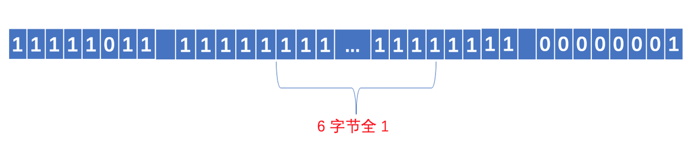
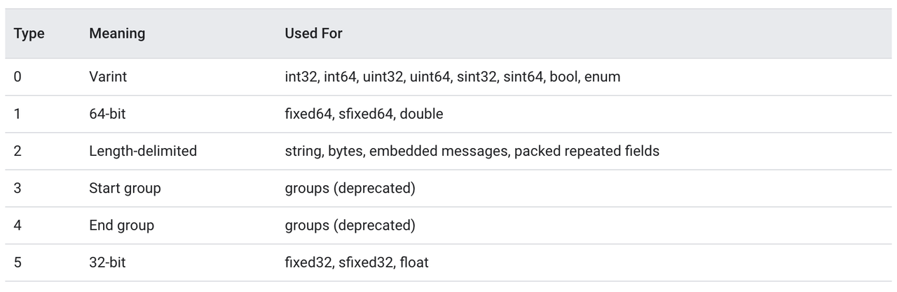
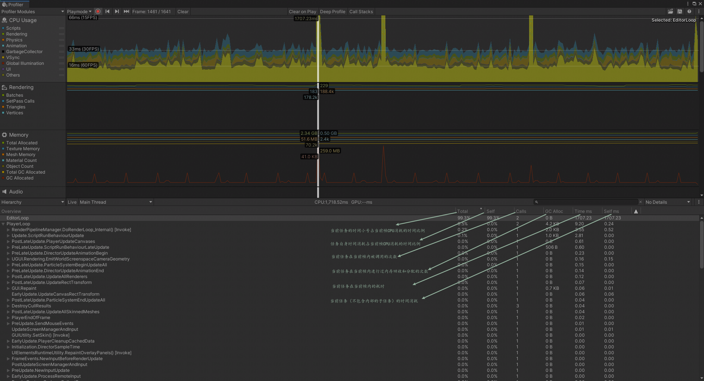
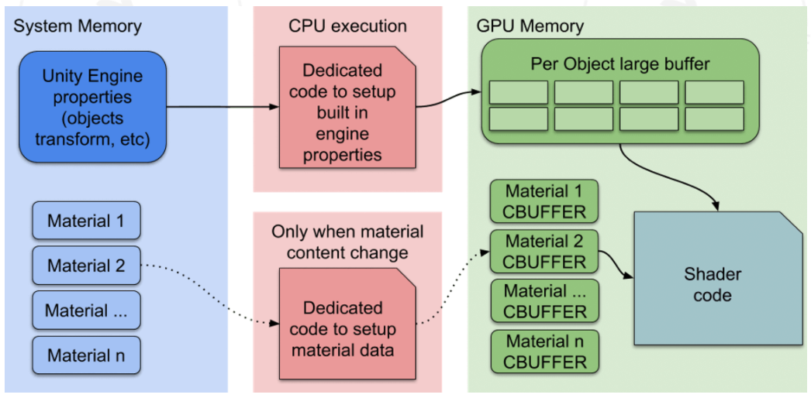

## 业务

### ProtoBuf 的基本原理是什么

> 🔗 [原文链接](https://sunyunqiang.com/blog/protobuf_encode/)

Protobuf 是由 Google 设计的一种高效、轻量级的信息描述格式，起初是在 Google 内部使用，后来被开放出来，它具有语言中立、平台中立、高效、可扩展等特性，它非常适合用来做数据存储、RPC 数据交换等。与 json、xml 相比，Protobuf 的编码长度更短、传输效率更高，其实严格意义上讲，json、xml 并非是一种「编码」, 而只能称之为「格式」, json、xml 的内容本身都是字符形式，它们的编码采用的是 ASCII 编码，本文讲述 Protobuf 的底层编码原理，以便于了解 Protobuf 为什么编码长度短并且扩展性强，与此同时我们也将了解到它有哪些不足
Protobuf 的一个典型应用场景便是做通信的数据交换格式，它在通信管道上是以纯二进制的形式进行传输，发送端使用编码器将数据序列化为二进制，接收端使用解码器将收到的二进制流进行反序列化从而取得原始信息，因此当对通信管道进行抓包时无法获知数据的详细内容，事实上，同一段 Protobuf 的二进制数据流，在接收端使用不同的解码格式进行解码，可能得到完全不同的信息。在了解 Protobuf 的底层编码细节之前，需要首先了解 Protobuf 所用到的两种主要的编码方式，它们分别是 Varints 编码和 Zigzag 编码

#### 1.1 Varints 编码

通常来说，普通的 int 数据类型，无论其值的大小，所占用的存储空间都是相等的，这点可以引起人们的思考，是否可以根据数值的大小来动态地占用存储空间，使得值比较小的数字占用较少的字节数，值相对比较大的数字占用较多的字节数，这便是变长整型编码的基本思想，采用变长整型编码的数字，其占用的字节数不是完全一致的，为了达到这一点，Varints 编码使用每个字节的最高有效位作为标志位，而剩余的 7 位以二进制补码的形式来存储数字值本身，当最高有效位为 1 时，代表其后还跟有字节，当最高有效位为 0 时，代表已经是该数字的最后的一个字节，在 Protobuf 中，使用的是 Base128 Varints 编码，之所以叫这个名字原因即是在这种方式中，使用 7 bit 来存储数字，在 Protobuf 中，Base128 Varints 采用的是小端序，即数字的低位存放在高地址，举例来看，对于数字 1, 我们假设 int 类型占 4 个字节，以标准的整型存储，其二进制表示应为

00000000 00000000 00000000 00000001

可见，只有最后一个字节存储了有效数值，前 3 个字节都是 0, 若采用 Varints 编码，其二进制形式为

00000001

因为其没有后续字节，因此其最高有效位为 0, 其余的 7 位以补码形式存放 1, 再比如数字 666, 其以标准的整型存储，其二进制表示为

00000000 00000000 00000010 10011010

而采用 Varints 编码，其二进制形式为

10011010 00000101

我们可以尝试来复原一下上面这个 Base128 Varints 编码的二进制串，首先看最高有效位，高 8 位的最高有效位为 1, 代表其后还跟有有效字节，低 8 位的最高有效位为 0, 代表其已是最后一个字节，由于 Protobuf 采用小端字节序存储数据，因此我们移除两个字节的最高有效位，并交换字节序便得到

1010011010

转换为十进制，即是数字 666

从上面的编码解码过程可以看出，可变长整型编码对于不同大小的数字，其所占用的存储空间是不同的，编码思想与 CPU 的间接寻址原理相似，都是用一比特来标识是否走到末尾，但采用这种方式存储数字，也有一个相对不好的点便是，无法对一个序列的数值进行随机查找，因为每个数字所占用的存储空间不是等长的，因此若要获得序列中的第 N 个数字，无法像等长存储那样在查找之前直接计算出 Offset, 只能从头开始顺序查找

#### 1.2 Zigzag 编码

Varints 编码的实质在于去掉数字开头的 0, 因此可缩短数字所占的存储字节数，在上面的例子中，我们只举例说明了正数的 Varints 编码，但如果数字为负数，则采用 Varints 编码会恒定占用 10 个字节，原因在于负数的符号位为 1, 对于负数其从符号位开始的高位均为 1, 在 Protobuf 的具体实现中，会将此视为一个很大的无符号数，以 Go 语言的实现为例，对于 int32 类型的 pb 字段，对于如下定义的 proto
```proto
syntax = "proto3";
package pbTest;

message Request {
    int32 a = 1;
}
```
Request 中包含类型为 int32 类型的字段，当 a 为负数时，其序列化之后将恒定占用 10 个字节，我们可以使用如下的测试代码
``` go
func main() {
    a := pbTest.Request{
        A: -5,
    }
    bytes, err := proto.Marshal(&a)
    if err != nil {
        fmt.Println(err)
        return
    }
    fmt.Println(fmt.Sprintf("%08b", bytes))
}
```
对于 int32 类型的数字 -5, 其序列化之后的二进制为

<center>
    
</center>

究其原因在于 Protobuf 的内部将 int32 类型的负数转换为 uint64 来处理，转换后的 uint64 数值的高位全为 1, 相当于是一个 8 字节的很大的无符号数，因此采用 Base128 Varints 编码后将恒定占用 10 个字节的空间，可见 Varints 编码对于表示负数毫无优势，甚至比普通的固定 32 位存储还要多占 4 个字节。Varints 编码的实质在于设法移除数字开头的 0 比特，而对于负数，由于其数字高位都是 1, 因此 Varints 编码在此场景下失效，Zigzag 编码便是为了解决这个问题，Zigzag 编码的大致思想是首先对负数做一次变换，将其映射为一个正数，变换以后便可以使用 Varints 编码进行压缩，这里关键的一点在于变换的算法，首先算法必须是可逆的，即可以根据变换后的值计算出原始值，否则就无法解码，同时要求变换算法要尽可能简单，以避免影响 Protobuf 编码、解码的速度，我们假设 n 是一个 32 位类型的数字，则 Zigzag 编码的计算方式为

`(n << 1) ^ (n >> 31)`

要注意这里左边是逻辑移位，右边是算术移位，右边的含义实际是得到一个全 1 （对于负数） 或全 0 （对于正数）的比特序列，因为对于任意一个位数为 η 的有符号数 n, 其最高位为符号位，剩下的 η - 1 位为数字位，将其算术右移 η - 1 位，由于是算术移位，因此右移时左边产生的空位将由符号位来填充，进行 η - 1 次算术右移之后便得到 η 位与原先的符号位相等的序列，然后对两边按位异或便得到 Zigzag 编码，我们用一个图示来直观地说明 Zigzag 编码的设计思想，为了简化，我们假定数字是 16 位的，先来看负数的情形，假设数字为 -5, 其在内存中的形式为

11111111 11111011

首先对其进行一次逻辑左移，移位后空出的比特位由 0 填充

11111111 11110110

然后对原数字进行 15 次算术右移，得到 16 位全为原符号位（即 1) 的数字

11111111 11111111

然后对逻辑移位和算术移位的结果按位异或，便得到最终的 Zigzag 编码

00000000 00001001

可以看到，对负数使用 Zigzag 编码以后，其高位的 1 全部变成了 0, 这样以来我们便可以使用 Varints 编码进行进一步地压缩，再来看正数的情形，对于 16 位的正数 5, 其在内存中的存储形式为

00000000 00000101

我们按照与负数相同的处理方法，可以得到其 Zigzag 编码为

00000000 00001010

从上面的结果来看，无论是正数还是负数，经过 Zigzag 编码以后，数字高位都是 0, 这样以来，便可以进一步使用 Varints 编码进行数据压缩，即 Zigzag 编码在 Protobuf 中并不单独使用，而是配合 Varints 编码共同来进行数据压缩，Google 在 Protobuf 的官方文档中写道：
Google Protobuf
If you use int32 or int64 as the type for a negative number, the resulting varint is always ten bytes long – it is, effectively, treated like a very large unsigned integer. If you use one of the signed types, the resulting varint uses ZigZag encoding, which is much more efficient.

在上面的讨论中，我们了解了 Protobuf 所使用的 Varints 编码和 Zigzag 编码的编码原理，本节我们来讨论 Protobuf 的数据组织方式，首先来看一个例子，假设客户端和服务端使用 protobuf 作为数据交换格式，proto 的具体定义为
```proto
syntax = "proto3";
package pbTest;

message Request {
    int32 age = 1;
}
```
Request 中包含了一个名称为 name 的字段，客户端和服务端双方都用同一份相同的 proto 文件是没有任何问题的，假设客户端自己将 proto 文件做了修改，修改后的 proto 文件如下
```proto
syntax = "proto3";
package pbTest;

message Request {
    int32 age_test = 1;
}
```
在这种情形下，服务端不修改应用程序仍能够正确地解码，原因在于序列化后的 Protobuf 没有使用字段名称，而仅仅采用了字段编号，与 json xml 等相比，Protobuf 不是一种完全自描述的协议格式，即接收端在没有 proto 文件定义的前提下是无法解码一个 protobuf 消息体的，与此相对的，json xml 等协议格式是完全自描述的，拿到了 json 消息体，便可以知道这段消息体中有哪些字段，每个字段的值分别是什么，其实对于客户端和服务端通信双方来说，约定好了消息格式之后完全没有必要在每一条消息中都携带字段名称，Protobuf 在通信数据中移除字段名称，这可以大大降低消息的长度，提高通信效率，Protobuf 进一步将通信线路上消息类型做了划分，如下表所示

<center>
    
</center>

对于 int32, int64, uint32 等数据类型在序列化之后都会转为 Varints 编码，除去两种已标记为 deprecated 的类型，目前 Protobuf 在序列化之后的消息类型 (wire-type) 总共有 4 种，Protobuf 除了存储字段的值之外，还存储了字段的编号以及字段在通信线路上的格式类型 (wire-type), 具体的存储方式为

`field_num << 3 | wire type`

即将字段标号逻辑左移 3 位，然后与该字段的 wire type 的编号按位或，在上表中可以看到，wire type 总共有 6 种类型，因此可以用 3 位二进制来标识，所以低 3 位实际上存储了其后所跟的数据的 wire type, 接收端可以利用这些信息，结合 proto 文件来解码消息结构体，我们以上面 proto 为例来看一段 Protobuf 实际序列化之后的完整二进制数据，假设 age 为 5, 由于 age 在 proto 文件中定义的是 int32 类型，因此序列化之后它的 wire type 为 0, 其字段编号为 1, 因此按照上面的计算方式，即 1 << 3 | 0, 所以其类型和字段编号的信息只占 1 个字节，即 00001000, 后面跟上字段值 5 的 Varints 编码，所以整个结构体序列化之后为

<center>
    
</center>

有了字段编号和 wire type, 其后所跟的数据的长度便是确定的，因此 Protobuf 是一种非常紧密的数据组织格式，其不需要特别地加入额外的分隔符来分割一个消息字段，这可大大提升通信的效率，规避冗余的数据传输

#### 1.4 总结

* Protobuf 是一种高效的数据描述格式，具有平台无关、语言无关、可扩展等特点，适合做数据存储、RPC 的通信协议等场景
* Protobuf 采用 Varints 编码和 Zigzag 编码来编码数据，其中 Varints 编码的思想是移除数字高位的 0, 用变长的二进制位来描述一个数字，对于小数字，其编码长度短，可提高数据传输效率，但由于它在每个字节的最高位额外采用了一个标志位来标记其后是否还跟有有效字节，因此对于大的正数，它会比使用普通的定长格式占用更多的空间，另外对于负数，直接采用 Varints 编码将恒定占用 10 个字节，Zigzag 编码可将负数映射为无符号的正数，然后采用 Varints 编码进行数据压缩，在各种语言的 Protobuf 实现中，对于 int32 类型的数据，Protobuf 都会转为 uint64 而后使用 Varints 编码来处理，因此当字段可能为负数时，我们应使用 sint32 或 sint64, 这样 Protobuf 会按照 Zigzag 编码将数据变换后再采用 Varints 编码进行压缩，从而缩短数据的二进制位数
* Protobuf 不是完全自描述的信息描述格式，接收端需要有相应的解码器（即 proto 定义）才可解析数据格式，序列化后的 Protobuf 数据不携带字段名，只使用字段编号来标识一个字段，因此更改 proto 的字段名不会影响数据解析（但这显然不是一种好的行为）, 字段编号会被编码进二进制的消息结构中，因此我们应尽可能地使用小字段编号
* Protobuf 是一种紧密的消息结构，编码后字段之间没有间隔，每个字段头由两部分组成：字段编号和 wire type, 字段头可确定数据段的长度，因此其字段之前无需加入间隔，也无需引入特定的数据来标记字段末尾，因此 Protobuf 的编码长度短，传输效率高

### 项目中断线重连是如何实现的

## C#

### List 的底层原理、Dictionary 的底层原理

#### List 底层实现浅析

##### `Add`

在`Add`前，都会调用`EnsureCapacity`来保证有充足的空间存放元素，如果容量不足，就会进行扩容，每次容量不够的时候，整个数组的容量都会扩充一倍，`_defaultCapacity`是容量的默认值为 4。因此整个扩充的路线为 4，8，16，32，64，128，256，512，1024，……以此类推

> List 使用数组形式作为底层数据结构，好处是使用索引方式提取元素很快，但在扩容的时候就会很糟糕，每次 new 数组都会造成内存垃圾，这给垃圾回收 GC 带来了很多负担

##### `Insert`

```c#
public void Insert(int index, T item) {
    // Note that insertions at the end are legal.
    if ((uint) index > (uint)_size) {
        ThrowHelper.ThrowArgumentOutOfRangeException(ExceptionArgument.index, ExceptionResource.ArgumentOutOfRange_ListInsert);
    }
    Contract.EndContractBlock();
    if (_size == _items.Length) EnsureCapacity(_size + 1);
    if (index < _size) {
        Array.Copy(_items, index, _items, index + 1, _size - index);
    }
    _items[index] = item;
    _size++;            
    _version++;
}
```

插入的关键就是`Array.Copy(_items, index, _items, index +1, _size - index)`，把指定索引加 1 到数组末尾的元素向后移动，然后赋值，这个跟数组的插入删除一样，都要花费$O(n)$的时间去挪动数组

##### `Remove`

```c#
public bool Remove(T item) {
    int index = IndexOf(item);
    if (index >= 0) {
        RemoveAt(index);
        return true;
    }
    return false;
}

public void RemoveAt(int index) {
    if ((uint)index >= (uint)_size) {
        ThrowHelper.ThrowArgumentOutOfRangeException();
    }
    Contract.EndContractBlock();
    _size--;
    if (index < _size) {
        Array.Copy(_items, index + 1, _items, index, _size - index);
    }
    _items[_size] = default(T);
    _version++;
}
```

删除跟插入相反，`Array.Copy(_items, index +1, _items, index, _size - index)`，用`IndexOf`（遍历）找到指定元素在数组中的索引，然后用指定索引加 1 到数组末尾的元素向前移动，覆盖。这个步骤，被删除元素后面的数都要往前移动，时间复杂度$O(n)$

> 在使用 List 的时候，要注意，如果过于频繁使用的话，会导致效率降低，也会造成不少内存的冗余，使得垃圾回收 (GC) 时承担了更多的压力

##### 索引

```c#
public T this[int index] {
    get {
        // Following trick can reduce the range check by one
        if ((uint) index >= (uint)_size) {
            ThrowHelper.ThrowArgumentOutOfRangeException();
        }
        Contract.EndContractBlock();
        return _items[index]; 
    }

    set {
        if ((uint) index >= (uint)_size) {
            ThrowHelper.ThrowArgumentOutOfRangeException();
        }
        Contract.EndContractBlock();
        _items[index] = value;
        _version++;
    }
}
```

##### `Clear`

```c#
public void Clear() {
    if (_size > 0)
    {
        Array.Clear(_items, 0, _size); // Don't need to doc this but we clear the elements so that the gc can reclaim the references.
        _size = 0;
    }
    _version++;
}
```

`Clear`接口在调用时并不会删除数组，而只是将数组中的元素清零，并设置 `_size` 为 0 而已，用于虚拟地表明当前容量为 0

##### `foreach`

已经在 unity5.5 解决之前，`foreach`每次获取迭代器时，会新建一个`Enumerator`，如果大量使用迭代器的话就会造成大量的垃圾对象，在 unity5.5 解决之后就不会产生额外的 GC 了

##### `Sort`

`Array.Sort`使用的是快速排序方式进行排序，List 的 `Sort` 排序的效率为$O(n \log^n)$。

#### Dictionary 底层实现浅析

##### `Entry`结构体

Dictionary 种存放数据的最小单位，调用`Add(Key, Value)`方法添加的元素都会被封装在这样的一个结构体中
```c#
private struct Entry {
    public int hashCode;    // 除符号位以外的 31 位 hashCode 值，如果该 Entry 没有被使用，那么为-1
    public int next;        // 下一个元素的下标索引，如果没有下一个就为-1
    public TKey key;        // 存放元素的键
    public TValue value;    // 存放元素的值
}
```

除了 Entry 结构体外，还有几个关键的私有变量

```c#
private int[] buckets;		// Hash 桶
private Entry[] entries;	// Entry 数组，存放元素
private int count;			// 当前 entries 的 index 位置
private int version;		// 当前版本，防止迭代过程中集合被更改
private int freeList;		// 被删除 Entry 在 entries 中的下标 index，这个位置是空闲的
private int freeCount;		// 有多少个被删除的 Entry，有多少个空闲的位置
private IEqualityComparer<TKey> comparer;	// 比较器
private KeyCollection keys;		// 存放 Key 的集合
private ValueCollection values;		// 存放 Value 的集合
```

##### Add 操作

```c#
public void Add(TKey key, TValue value) {
    Insert(key, value, true);
}

private void Insert(TKey key, TValue value, bool add){
    
    if( key == null ) {
        ThrowHelper.ThrowArgumentNullException(ExceptionArgument.key);
    }

    if (buckets == null) Initialize(0);
    // 通过 key 获取 hashCode
    int hashCode = comparer.GetHashCode(key) & 0x7FFFFFFF;
    // 计算出目标 bucket 下标
    int targetBucket = hashCode % buckets.Length;
	// 碰撞次数
    int collisionCount = 0;
    for (int i = buckets[targetBucket]; i >= 0; i = entries[i].next) {
        if (entries[i].hashCode == hashCode && comparer.Equals(entries[i].key, key)) {
            // 如果是增加操作，遍历到了相同的元素，那么抛出异常
            if (add) {      
				ThrowHelper.ThrowArgumentException(ExceptionResource.Argument_AddingDuplicate);
            }
            // 如果不是增加操作，那可能是索引赋值操作 dictionary["foo"] = "foo"
            // 那么赋值后版本++，退出
            entries[i].value = value;
            version++;
            return;
        }
        // 每遍历一个元素，都是一次碰撞
        collisionCount++;
    }
    int index;
    // 如果有被删除的元素，那么将元素放到被删除元素的空闲位置
    if (freeCount > 0) {
        index = freeList;
        freeList = entries[index].next;
        freeCount--;
    }
    else {
        // 如果当前 entries 已满，那么触发扩容
        if (count == entries.Length)
        {
            Resize();
            targetBucket = hashCode % buckets.Length;
        }
        index = count;
        count++;
    }

    // 给 entry 赋值
    entries[index].hashCode = hashCode;
    entries[index].next = buckets[targetBucket];
    entries[index].key = key;
    entries[index].value = value;
    buckets[targetBucket] = index;
    // 版本号++
    version++;

    // 如果碰撞次数大于设置的最大碰撞次数，那么触发 Hash 碰撞扩容
    if(collisionCount > HashHelpers.HashCollisionThreshold && HashHelpers.IsWellKnownEqualityComparer(comparer)) 
    {
        comparer = (IEqualityComparer<TKey>) HashHelpers.GetRandomizedEqualityComparer(comparer);
        Resize(entries.Length, true);
    }
}

```

##### Find 操作

```c#
// 寻找 Entry 元素的位置
private int FindEntry(TKey key) {
    if( key == null) {
        ThrowHelper.ThrowArgumentNullException(ExceptionArgument.key);
    }

    if (buckets != null) {
        int hashCode = comparer.GetHashCode(key) & 0x7FFFFFFF; // 获取 HashCode，忽略符号位
        // int i = buckets[hashCode % buckets.Length] 找到对应桶，然后获取 entry 在 entries 中位置
        // i >= 0; i = entries[i].next 遍历单链表
        for (int i = buckets[hashCode % buckets.Length]; i >= 0; i = entries[i].next) {
            // 找到就返回了
            if (entries[i].hashCode == hashCode && comparer.Equals(entries[i].key, key)) return i;
        }
    }
    return -1;
}

internal TValue GetValueOrDefault(TKey key) {
    int i = FindEntry(key);
    // 大于等于 0 代表找到了元素位置，直接返回 value
    // 否则返回该类型的默认值
    if (i >= 0) {
        return entries[i].value;
    }
    return default(TValue);
}

 public bool TryGetValue(TKey key, out TValue value) {
    int i = FindEntry(key);
    if (i >= 0) {
        value = entries[i].value;
        return true;
    }
    value = default(TValue);
    return false;
}
```

##### Remove 操作

```c#
public bool Remove(TKey key) {
    if(key == null) {
        ThrowHelper.ThrowArgumentNullException(ExceptionArgument.key);
    }

    if (buckets != null) {
        // 1. 通过 key 获取 hashCode
        int hashCode = comparer.GetHashCode(key) & 0x7FFFFFFF;
        // 2. 取余获取 bucket 位置
        int bucket = hashCode % buckets.Length;
        // last 用于确定是否当前 bucket 的单链表中最后一个元素
        int last = -1;
        // 3. 遍历 bucket 对应的单链表
        for (int i = buckets[bucket]; i >= 0; last = i, i = entries[i].next) {
            if (entries[i].hashCode == hashCode && comparer.Equals(entries[i].key, key)) {
                // 4. 找到元素后，如果 last< 0，代表当前是 bucket 中最后一个元素，那么直接让 bucket 内下标赋值为 entries[i].next 即可
                if (last < 0) {
                    buckets[bucket] = entries[i].next;
                }
                else {
                    // 4.1 last 不小于 0，代表当前元素处于 bucket 单链表中间位置，需要将该元素的头结点和尾节点相连起来，防止链表中断
                    entries[last].next = entries[i].next;
                }
                // 5. 将 Entry 结构体内数据初始化
                entries[i].hashCode = -1;
                // 5.1 建立 freeList 单链表
                entries[i].next = freeList;
                entries[i].key = default(TKey);
                entries[i].value = default(TValue);
                // *6. 关键的代码，freeList 等于当前的 entry 位置，下一次 Add 元素会优先 Add 到该位置
                freeList = i;
                freeCount++;
                // 7. 版本号+1
                version++;
                return true;
            }
        }
    }
    return false;
}
```

##### Resize 操作（扩容）
两种情况会发生扩容操作：
* `entries`数组满了，没有办法继续存放新的元素
* Dictionary 中发生的碰撞次数太多，会严重影响性能，也会触发扩容操作

> 目前。Net Framwork 4.7 中设置的碰撞次数阈值为 100

```c#
private void Resize() {
    Resize(HashHelpers.ExpandPrime(count), false);
}

private void Resize(int newSize, bool forceNewHashCodes) {
    Contract.Assert(newSize >= entries.Length);
    // 1. 申请新的 Buckets 和 entries
    int[] newBuckets = new int[newSize];
    for (int i = 0; i < newBuckets.Length; i++) newBuckets[i] = -1;
    Entry[] newEntries = new Entry[newSize];
    // 2. 将 entries 内元素拷贝到新的 entries 总
    Array.Copy(entries, 0, newEntries, 0, count);
    // 3. 如果是 Hash 碰撞扩容，使用新 HashCode 函数重新计算 Hash 值
    if(forceNewHashCodes) {
        for (int i = 0; i < count; i++) {
            if(newEntries[i].hashCode != -1) {
                newEntries[i].hashCode = (comparer.GetHashCode(newEntries[i].key) & 0x7FFFFFFF);
            }
        }
    }
    // 4. 确定新的 bucket 位置
    // 5. 重建 Hahs 单链表
    for (int i = 0; i < count; i++) {
        if (newEntries[i].hashCode >= 0) {
            int bucket = newEntries[i].hashCode % newSize;
            newEntries[i].next = newBuckets[bucket];
            newBuckets[bucket] = i;
        }
    }
    buckets = newBuckets;
    entries = newEntries;
}

```

##### Collection 版本控制

迭代过程中不允许集合出现变化，否则会抛出<font color="#FF6D60">System.InvalidOperationException:"Collection was modified; enumeration operation may not execute."</font>这样的异常

```c#
internal Enumerator(Dictionary<TKey,TValue> dictionary, int getEnumeratorRetType) {
    this.dictionary = dictionary;
    version = dictionary.version;
    index = 0;
    this.getEnumeratorRetType = getEnumeratorRetType;
    current = new KeyValuePair<TKey, TValue>();
}
 
public bool MoveNext() {
    if (version != dictionary.version) {
        ThrowHelper.ThrowInvalidOperationException(ExceptionResource.InvalidOperation_EnumFailedVersion);
    }
    // Use unsigned comparison since we set index to dictionary.count+1 when the enumeration ends.
    // dictionary.count+1 could be negative if dictionary.count is Int32.MaxValue
    while ((uint)index < (uint)dictionary.count) {
        if (dictionary.entries[index].hashCode >= 0) {
            current = new KeyValuePair<TKey, TValue>(dictionary.entries[index].key, dictionary.entries[index].value);
            index++;
            return true;
        }
        index++;
    }
    index = dictionary.count + 1;
    current = new KeyValuePair<TKey, TValue>();
    return false;
}
```

在迭代器初始化时，就会记录`dictionary.version`版本号，之后每一次迭代过程都会检查版本号是否一致，如果不一致将抛出异常。这样就避免了在迭代过程中修改了集合，造成很多诡异的问题

### 装修拆箱

```c#
int x = 1023;
object o = x; //装箱
int y = (int) o; //拆箱
```
装箱：值类型转换为引用对象，一般是转换为 System.Object 类型或值类型实现的接口引用类型

* 在堆中申请内存，内存大小为值类型的大小，再加上额外固定空间（引用类型的标配：`TypeHandle`和同步索引块）
* 将值类型的字段值（`x = 1023`）拷贝新分配的内存中
* 返回新引用对象的地址（给引用变量`object o`）

拆箱：引用类型转换为值类型，注意，这里的引用类型只能是被装箱的引用类型对象

* 检查实例对象（`object o`）是否有效，如是否为`null`，判断其装箱的类型与拆箱的类型（`int`）是否一致，如检测不合法，抛出异常
* 指针返回，就是获取装箱对象（`object o`）中值类型字段值的地址
* 字段拷贝，把装箱对象（`object o`）中值类型字段值拷贝到栈上，意思就是创建一个新的值类型变量来存储拆箱后的值

> * 只有值类型才有装箱、拆箱两个状态，而引用类型一直都在箱子里
> * 一般来说，装箱的性能开销更大，因为引用对象的分配更加复杂，成本也更高，值类型分配在栈上，分配和释放的效率都很高。装箱过程是需要创建一个新的引用类型对象实例，拆箱过程需要创建一个值类型字段，开销更低

### 事件委托

委托是一个类，它定义了方法的类型，使得可以将方法当作另一个方法的参数来进行传递，事件是一种特殊的委托

#### 委托

委托，是一种存储函数引用的类型。声明一个委托与声明函数类似，区别在于不包含函数体，需要使用关键字`delegate`。一个委托包含其可以引用的函数签名（返回类型和参数列表）

对于委托的初始化赋值，可以使用两种语法：
```c#
// 方法一
delegate double ProcessDelegate(double arg1, double arg2);
ProcessDelegate process;

// 方法二
process = new ProcessDelegate(Multiply) // double Multiply(double arg1, double arg2)
process = Divide; // double Divide(double arg1, double arg2)
```

委托对象可使用`+`运算符进行合并。一个合并委托调用它所合并的两个委托。只有相同类型的委托可被合并。`-`运算符可用于从合并的委托中移除组件委托。这样就可以创建一个委托被调用时要调用的方法的调用列表。但是多播委托的调用顺序无法保证

#### 委托的类型：`delegate`、`Action`、`Func`、`predicate`

* `delegate`：至少 0 个参数，至多 32 个参数，可以无返回值，也可以指定返回值类型
* `Action`：是无返回值的泛型委托
* `Func`：是有返回值的泛型委托
* `predicate`：是返回 bool 型的泛型委托

#### 事件

事件类似于异常，都由对象引发（或抛出），然后通过提供的代码进行处理。事件需要在处理之前进行订阅（ subscribe ），表示提供了在事件发生时需要执行的代码，即事件处理程序。C# 中的事件`event`关键字是语言层面的<font color="#FF6D60">观察者模式</font>的实现，将事件的发起者（被观察者）与处理者（观察者）的代码解耦。事件处理程序需要被匹配事件所要求的返回值和参数，这个限制由委托来指定

在 C#中，事件就像是一种机制，在程序运行到一定阶段的时候或者遇到某些状况的时候，就会触发一个事件。然后如果有其他代码订阅了这个事件，就会自动执行订阅的代码。描述起来很抽象，简单来讲就是在类声明一个委托，并标记这个委托是一个事件，在另一个方法中执行这个事件。其中，触发这个事件的类称为发布者，接受或者注册了处理方法的类称为订阅者

声明一个事件有两种方式，一种是直接使用`EventHandler`，另一种是自己先定义一个委托，然后用这个委托定义事件

* 使用 EventHandler

```c#
public class EventDemo
{
    public event EventHandler HandlerEvent;
}
```

* 使用自定义委托

```c#
public class EventDemo
{
    public delegate void EventDelegate(object sender, EventArgs e);
    public event EventDelegate DelegateEvent;
}
```

一般事件的定义约定俗称是一个`void`方法，第一个参数是`sender`表示事件的发布者，默认是`object`类型，第二个参数是`EventArgs`类型的事件变量，表示触发事件时需要订阅者注意的内容，一般用来传一些参数；`EventArgs`只有一个默认构造方法和几个继承自`Object`的方法。所以在开发中，会定义一个事件变量类型，为了保持一致会继承`EventArgs`

##### Demo

```c#
public class EventDemo
{
    public delegate void EventDelegate(object sender, EventArgs e);

    public event EventDelegate DelegateEvent;

    public void Trigger()
    {
        if (DelegateEvent != null)// 触发事件，按需判断事件的订阅者列表是否为空
        {
            DelegateEvent(this, new EventArgs());
        }
    }
}

EventDemo demo = new EventDemo(); 
demo.DelegateEvent += (sender, eventArgs) =>
{
    //省略订阅者的方法内容
}
demo.Trigger();//触发事件
```

将其中的`event`去掉，程序依然正常运行，不会出现任何问题。事件实际上是一个特殊的委托实例，不用事件也没有关系。实际上事件只是削弱了委托的功能，`event`在编译器角度保护了程序的安全，因为只能使用`+=`、`-=`来注册事件了，而不能使用`=`为事件关联方法。（在委托中还可以使用`=`来绑定方法，不过=是一种破坏性代码，不管之前是否已经绑定的有方法了，都会将其清除）

### XLua 如何与 C#进行交互

> 🔗 [深入 xLua 实现原理之 Lua 如何调用 C#](https://www.cnblogs.com/iwiniwin/p/15307368.html)

[xLua](https://github.com/Tencent/xLua) 是腾讯的一个开源项目，为 Unity、 .Net、 Mono 等 C#环境增加 Lua 脚本编程的能力。本文主要是探讨 xLua 下 Lua 调用 C#的实现原理

#### Lua 与 C#数据通信机制

无论是 Lua 调用 C#，还是 C#调用 Lua，都需要一个通信机制，来完成数据的传递。而 Lua 本身就是由 C 语言编写的，所以它出生自带一个和 C/C++ 的通信机制

Lua 和 C/C++ 的数据交互通过栈进行，操作数据时，首先将数据拷贝到"栈"上，然后获取数据，栈中的每个数据通过索引值进行定位，索引值为正时表示相对于栈底的偏移索引，索引值为负时表示相对于栈顶的偏移索引，索引值以 1 或 -1 为起始值，因此栈顶索引值永远为 -1， 栈底索引值永远为 1 。 “栈"相当于数据在 Lua 和 C/C++ 之间的中转地。每种数据都有相应的存取接口

而 C# 可以通过 P/Invoke 方式调用 Lua 的 dll，通过这个 dll 执行 Lua 的 C API。换言之 C#可以借助 C/C++ 来与 Lua 进行数据通信。在 xLua 的 LuaDLL.cs 文件中可以找到许多 DllImport 修饰的数据入栈与获取的接口

```c#
// LuaDLL.cs
[DllImport(LUADLL,CallingConvention=CallingConvention.Cdecl)]
public static extern void lua_pushnumber(IntPtr L, double number);

[DllImport(LUADLL,CallingConvention=CallingConvention.Cdecl)]
public static extern void lua_pushboolean(IntPtr L, bool value);

[DllImport(LUADLL, CallingConvention = CallingConvention.Cdecl)]
public static extern void xlua_pushinteger(IntPtr L, int value);

[DllImport(LUADLL, CallingConvention = CallingConvention.Cdecl)]
public static extern double lua_tonumber(IntPtr L, int index);

[DllImport(LUADLL, CallingConvention = CallingConvention.Cdecl)]
public static extern int xlua_tointeger(IntPtr L, int index);

[DllImport(LUADLL, CallingConvention = CallingConvention.Cdecl)]
public static extern uint xlua_touint(IntPtr L, int index);

[DllImport(LUADLL,CallingConvention=CallingConvention.Cdecl)]
public static extern bool lua_toboolean(IntPtr L, int index);
```

#### 传递 C#对象到 Lua

对于`bool`，`int`这样简单的值类型可以直接通过 C API 传递。但对于 C#对象就不同了，Lua 这边没有能与之对应的类型，因此传递到 Lua 的只是 C#对象的一个索引，具体实现请看下面的代码
```c#
// ObjectTranslator.cs
public void Push(RealStatePtr L, object o)
{
    // ...
    int index = -1;
    Type type = o.GetType();
#if !UNITY_WSA || UNITY_EDITOR
    bool is_enum = type.IsEnum;
    bool is_valuetype = type.IsValueType;
#else
    bool is_enum = type.GetTypeInfo().IsEnum;
    bool is_valuetype = type.GetTypeInfo().IsValueType;
#endif
    bool needcache = !is_valuetype || is_enum;  // 如果是引用或枚举，会进行缓存
    if (needcache && (is_enum ? enumMap.TryGetValue(o, out index) : reverseMap.TryGetValue(o, out index)))  // 如果有缓存
    {
        if (LuaAPI.xlua_tryget_cachedud(L, index, cacheRef) == 1)  
        {
            return;
        }
        //这里实在太经典了，weaktable 先删除，然后 GC 会延迟调用，当 index 会循环利用的时候，不注释这行将会导致重复释放
        //collectObject(index);
    }

    bool is_first;
    int type_id = getTypeId(L, type, out is_first);

    //如果一个 type 的定义含本身静态 readonly 实例时，getTypeId 会 push 一个实例，这时候应该用这个实例
    if (is_first && needcache && (is_enum ? enumMap.TryGetValue(o, out index) : reverseMap.TryGetValue(o, out index))) 
    {
        if (LuaAPI.xlua_tryget_cachedud(L, index, cacheRef) == 1)   
        {
            return;
        }
    }
    // C#侧进行缓存
    index = addObject(o, is_valuetype, is_enum);
    // 将代表对象的索引 push 到 lua
    LuaAPI.xlua_pushcsobj(L, index, type_id, needcache, cacheRef);
}
```

代码中的两个`if`语句主要是对缓存的判断，如果要传递的对象已经被缓存过了就直接使用缓存的。如果这个对象是被第一次传递，则进行以下两步操作
1. 通过`addObject`将对象缓存在`objects`对象池中，并得到一个索引（通过这个索引可以获取到该对象）
```c#
// ObjectTranslator.cs
int addObject(object obj, bool is_valuetype, bool is_enum)
{
    int index = objects.Add(obj);
    if (is_enum)
    {
        enumMap[obj] = index;
    }
    else if (!is_valuetype)
    {
        reverseMap[obj] = index;
    }
    
    return index;
}
```
2. 通过`xlua_pushcsobj`将代表对象的索引传递到 Lua

参数`key`表示代表对象的索引，参数`meta_ref`表示代表对象类型的表的索引，它的值是通过`getTypeId`函数获得的，后面会详细讲到。参数`need_cache`表示是否需要在 Lua 侧进行缓存，参数`cache_ref`表示 Lua 侧缓存表的索引
```C
// xlua.c
LUA_API void xlua_pushcsobj(lua_State *L, int key, int meta_ref, int need_cache, int cache_ref) {
    int* pointer = (int*)lua_newuserdata(L, sizeof(int));
    *pointer = key;
    
    if (need_cache) cacheud(L, key, cache_ref);  // Lua 侧缓存

    lua_rawgeti(L, LUA_REGISTRYINDEX, meta_ref);

    lua_setmetatable(L, -2);  // 为 userdata 设置元表
}

// 将 key = userdata 存入缓存表
static void cacheud(lua_State *L, int key, int cache_ref) {
    lua_rawgeti(L, LUA_REGISTRYINDEX, cache_ref);
    lua_pushvalue(L, -2);
    lua_rawseti(L, -2, key);
    lua_pop(L, 1);
}
```

`xlua_pushcsobj`的主要逻辑是，代表对象的索引被`push`到 Lua 后，Lua 会为其创建一个`userdata`，并将这个`userdata`指向对象索引，如果需要缓存则将`userdata`保存到缓存表中， 最后为`userdata`设置了元表。也就是说，C#对象在 Lua 这边对应的就是一个`userdata`，利用对象索引保持与 C#对象的联系。

#### 注册 C#类型信息到 Lua

为`userdata`（特指 C#对象在 Lua 这边对应的代理`userdata`，后面再出现的`userdata`也是同样的含义，就不再赘述了）设置的元表，表示的实际是对象的类型信息。在将 C#对象传递到 Lua 以后，还需要告知 Lua 该对象的类型信息，比如对象类型有哪些成员方法，属性或是静态方法等。将这些都注册到 Lua 后，Lua 才能正确的调用。这个元表是通过`getTypeId`函数生成的

```c#
// ObjectTranslator.cs
internal int getTypeId(RealStatePtr L, Type type, out bool is_first, LOGLEVEL log_level = LOGLEVEL.WARN)
{
    int type_id;
    is_first = false;
    if (!typeIdMap.TryGetValue(type, out type_id)) // no reference
    {
        // ...
        is_first = true;
        Type alias_type = null;
        aliasCfg.TryGetValue(type, out alias_type);
        LuaAPI.luaL_getmetatable(L, alias_type == null ? type.FullName : alias_type.FullName);

        if (LuaAPI.lua_isnil(L, -1)) //no meta yet, try to use reflection meta
        {
            LuaAPI.lua_pop(L, 1);

            if (TryDelayWrapLoader(L, alias_type == null ? type : alias_type))
            {
                LuaAPI.luaL_getmetatable(L, alias_type == null ? type.FullName : alias_type.FullName);
            }
            else
            {
                throw new Exception("Fatal: can not load metatable of type:" + type);
            }
        }

        //循环依赖，自身依赖自己的 class，比如有个自身类型的静态 readonly 对象。
        if (typeIdMap.TryGetValue(type, out type_id))
        {
            LuaAPI.lua_pop(L, 1);
        }
        else
        {
            // ...
            LuaAPI.lua_pushvalue(L, -1);
            type_id = LuaAPI.luaL_ref(L, LuaIndexes.LUA_REGISTRYINDEX);  // 将元表添加到注册表中
            LuaAPI.lua_pushnumber(L, type_id);
            LuaAPI.xlua_rawseti(L, -2, 1);   // 元表 [1] = type_id
            LuaAPI.lua_pop(L, 1);

            if (type.IsValueType())
            {
                typeMap.Add(type_id, type);
            }

            typeIdMap.Add(type, type_id);
        }
    }
    return type_id;
}
```

函数主要逻辑是以类的名称为`key`通过`luaL_getmetatable`获取类对应的元表，如果获取不到，则通过 `TryDelayWrapLoader`函数生成。然后调用`luaL_ref`将获取到的元表添加到 Lua 注册表中，并返回 type_id。type_id 表示的就是元表在 Lua 注册表中的索引，通过这个索引可以在 Lua 注册表中取回元表。前面提到的 `xlua_pushcsobj`函数就是利用`type_id`即`meta_ref`，获取到元表，然后为`userdata`设置的元表。
下面来看元表具体是怎样生成的

```c#
// ObjectTranslator.cs
public bool TryDelayWrapLoader(RealStatePtr L, Type type)
{
    // ...
    LuaAPI.luaL_newmetatable(L, type.FullName); //先建一个 metatable，因为加载过程可能会需要用到
    LuaAPI.lua_pop(L, 1);

    Action<RealStatePtr> loader;
    int top = LuaAPI.lua_gettop(L);
    if (delayWrap.TryGetValue(type, out loader))  // 如果有预先注册的类型元表生成器，则直接使用
    {
        delayWrap.Remove(type);
        loader(L);
    }
    else
    {
#if !GEN_CODE_MINIMIZE && !ENABLE_IL2CPP && (UNITY_EDITOR || XLUA_GENERAL) && !FORCE_REFLECTION && !NET_STANDARD_2_0
        if (!DelegateBridge.Gen_Flag && !type.IsEnum() && !typeof(Delegate).IsAssignableFrom(type) && Utils.IsPublic(type))
        {
            Type wrap = ce.EmitTypeWrap(type);
            MethodInfo method = wrap.GetMethod("__Register", BindingFlags.Static | BindingFlags.Public);
            method.Invoke(null, new object[] { L });
        }
        else
        {
            Utils.ReflectionWrap(L, type, privateAccessibleFlags.Contains(type));
        }
#else
        Utils.ReflectionWrap(L, type, privateAccessibleFlags.Contains(type));
#endif
        // ...
    }
    if (top != LuaAPI.lua_gettop(L))
    {
        throw new Exception("top change, before:" + top + ", after:" + LuaAPI.lua_gettop(L));
    }

    foreach (var nested_type in type.GetNestedTypes(BindingFlags.Public))
    {
        if (nested_type.IsGenericTypeDefinition())  // 过滤泛型类型定义
        {
            continue;
        }
        GetTypeId(L, nested_type);
    }
    
    return true;
}
```

##### TryDelayWrapLoader 主要用来处理两种情况
1. 通过`delayWrap`判断，是否有为该类生成代码，如果有，直接使用生成函数进行填充元表（`loader`方法）。在 xLua 的生成代码中有一个 XLuaGenAutoRegister.cs 文件，在这个文件中会为对应的类注册初始化器，而这个初始化器负责将类对应的元表生成函数添加到`delayWrap`中。

```c#
// XLuaGenAutoRegister.cs
public class XLua_Gen_Initer_Register__
{
    static void wrapInit0(LuaEnv luaenv, ObjectTranslator translator)
    {
        // ...
        translator.DelayWrapLoader(typeof(TestXLua), TestXLuaWrap.__Register);  // 将类型对应的元表填充函数__Register 添加到 delayWrap 中
        // ...
    }
    
    static void Init(LuaEnv luaenv, ObjectTranslator translator)
    {
        wrapInit0(luaenv, translator);
        translator.AddInterfaceBridgeCreator(typeof(System.Collections.IEnumerator), SystemCollectionsIEnumeratorBridge.__Create);
    }
    
    static XLua_Gen_Initer_Register__()
    {
            XLua.LuaEnv.AddIniter(Init);  // 注册初始化器
        }
}
```

1. 如果没有生成代码，通过反射填充元表（`ReflectionWrap`方法）

#### 使用生成函数填充元表

以`LuaCallCSharp`修饰的`TestXLua`类为例来查看生成函数是如何生成的

```c#
// TestXLua.cs
[LuaCallCSharp]
public class TestXLua
{
    public string Name;
    public void Test1(int a){
    }
    public static void Test2(int a, bool b, string c)
    {
    }
}
```

Generate Code 之后生成的 TestXLuaWrap.cs 如下所示

```c#
public class TestXLuaWrap 
{
    public static void __Register(RealStatePtr L)
    {
        ObjectTranslator translator = ObjectTranslatorPool.Instance.Find(L);
        System.Type type = typeof(TestXLua);
        Utils.BeginObjectRegister(type, L, translator, 0, 1, 1, 1);
        Utils.RegisterFunc(L, Utils.METHOD_IDX, "Test1", _m_Test1);
        Utils.RegisterFunc(L, Utils.GETTER_IDX, "Name", _g_get_Name);
        Utils.RegisterFunc(L, Utils.SETTER_IDX, "Name", _s_set_Name);
        Utils.EndObjectRegister(type, L, translator, null, null,
            null, null, null);
        Utils.BeginClassRegister(type, L, __CreateInstance, 2, 0, 0);
        Utils.RegisterFunc(L, Utils.CLS_IDX, "Test2", _m_Test2_xlua_st_);
        Utils.EndClassRegister(type, L, translator);
    }
    
    [MonoPInvokeCallbackAttribute(typeof(LuaCSFunction))]
    static int __CreateInstance(RealStatePtr L)
    {
        try {
            ObjectTranslator translator = ObjectTranslatorPool.Instance.Find(L);
            if(LuaAPI.lua_gettop(L) == 1)
            {
                TestXLua gen_ret = new TestXLua();
                translator.Push(L, gen_ret);
                return 1;
            }
        }
        catch(System.Exception gen_e) {
            return LuaAPI.luaL_error(L, "c# exception:" + gen_e);
        }
        return LuaAPI.luaL_error(L, "invalid arguments to TestXLua constructor!");
        
    }

    [MonoPInvokeCallbackAttribute(typeof(LuaCSFunction))]
    static int _m_Test1(RealStatePtr L)
    {
        try {
            ObjectTranslator translator = ObjectTranslatorPool.Instance.Find(L);
            TestXLua gen_to_be_invoked = (TestXLua)translator.FastGetCSObj(L, 1);
            {
                int _a = LuaAPI.xlua_tointeger(L, 2);
                gen_to_be_invoked.Test1( _a );
                return 0;
            }
        } catch(System.Exception gen_e) {
            return LuaAPI.luaL_error(L, "c# exception:" + gen_e);
        }
    }
    
    [MonoPInvokeCallbackAttribute(typeof(LuaCSFunction))]
    static int _m_Test2_xlua_st_(RealStatePtr L)
    {
        try {
            {
                int _a = LuaAPI.xlua_tointeger(L, 1);
                bool _b = LuaAPI.lua_toboolean(L, 2);
                string _c = LuaAPI.lua_tostring(L, 3);
                TestXLua.Test2( _a, _b, _c );
                return 0;
            }
        } catch(System.Exception gen_e) {
            return LuaAPI.luaL_error(L, "c# exception:" + gen_e);
        }
    }
    
    [MonoPInvokeCallbackAttribute(typeof(LuaCSFunction))]
    static int _g_get_Name(RealStatePtr L)
    {
        try {
            ObjectTranslator translator = ObjectTranslatorPool.Instance.Find(L);
        
            TestXLua gen_to_be_invoked = (TestXLua)translator.FastGetCSObj(L, 1);
            LuaAPI.lua_pushstring(L, gen_to_be_invoked.Name);
        } catch(System.Exception gen_e) {
            return LuaAPI.luaL_error(L, "c# exception:" + gen_e);
        }
        return 1;
    }
    
    [MonoPInvokeCallbackAttribute(typeof(LuaCSFunction))]
    static int _s_set_Name(RealStatePtr L)
    {
        try {
            ObjectTranslator translator = ObjectTranslatorPool.Instance.Find(L);
        
            TestXLua gen_to_be_invoked = (TestXLua)translator.FastGetCSObj(L, 1);
            gen_to_be_invoked.Name = LuaAPI.lua_tostring(L, 2);
        
        } catch(System.Exception gen_e) {
            return LuaAPI.luaL_error(L, "c# exception:" + gen_e);
        }
        return 0;
    }
}
```

##### 生成函数`__Register`主要是这样一个框架
1. `Utils.BeginObjectRegister`，在对类的非静态值（例如成员变量，成员方法等）进行注册前做一些准备工作。主要是为元表添加`__gc`和`__tostring`元方法，以及准备好`method`表、`getter`表、`setter`表，后面调用`RegisterFunc`时，可以选择插入到对应的表中

```c#
// Utils.cs
public static void BeginObjectRegister(Type type, RealStatePtr L, ObjectTranslator translator, int meta_count, int method_count, int getter_count,
    int setter_count, int type_id = -1)
{
    if (type == null)
    {
        if (type_id == -1) throw new Exception("Fatal: must provide a type of type_id");
        LuaAPI.xlua_rawgeti(L, LuaIndexes.LUA_REGISTRYINDEX, type_id);
    }
    else
    {
        LuaAPI.luaL_getmetatable(L, type.FullName);
        // 如果 type.FullName 对应的元表是空，则创建一个新的元表，并设置到注册表中
        if (LuaAPI.lua_isnil(L, -1))
        {
            LuaAPI.lua_pop(L, 1);
            LuaAPI.luaL_newmetatable(L, type.FullName);
        }
    }
    LuaAPI.lua_pushlightuserdata(L, LuaAPI.xlua_tag());
    LuaAPI.lua_pushnumber(L, 1);
    LuaAPI.lua_rawset(L, -3);  // 为元表设置标志

    if ((type == null || !translator.HasCustomOp(type)) && type != typeof(decimal))
    {
        LuaAPI.xlua_pushasciistring(L, "__gc");
        LuaAPI.lua_pushstdcallcfunction(L, translator.metaFunctions.GcMeta);
        LuaAPI.lua_rawset(L, -3);  // 为元表设置__gc 方法
    }

    LuaAPI.xlua_pushasciistring(L, "__tostring");
    LuaAPI.lua_pushstdcallcfunction(L, translator.metaFunctions.ToStringMeta);
    LuaAPI.lua_rawset(L, -3);  // 为元表设置__tostring 方法

    if (method_count == 0)
    {
        LuaAPI.lua_pushnil(L);
    }
    else
    {
        LuaAPI.lua_createtable(L, 0, method_count);  // 创建 method 表
    }

    if (getter_count == 0)
    {
        LuaAPI.lua_pushnil(L);
    }
    else
    {
        LuaAPI.lua_createtable(L, 0, getter_count);  // 创建 getter 表
    }

    if (setter_count == 0)
    {
        LuaAPI.lua_pushnil(L);
    }
    else
    {
        LuaAPI.lua_createtable(L, 0, setter_count);  // 创建 setter 表
    }
}
```
2. 多个`Utils.RegisterFunc`，将类的每个非静态值对应的包裹方法注册到不同的 Lua 表中。包裹方法是 Generate Code 时动态生成的，对于类的属性会生成两个包裹方法，分别是`get`和`set`包裹方法

例如成员方法`Test1`对应的包裹方法是`_m_Test1`，并被注册到了`method`表中。`Name`变量的`_g_get_Name` 包裹方法被注册到`getter`表，而`_s_set_Name`包裹方法被注册到`setter`表。这个包裹方法只是对原来方法的一层包裹，调用这个包裹方法本质上就是调用原来的方法。至于为什么需要生成包裹方法，后面会再讲到

```c#
// Utils.cs RegisterFunc 根据不同的宏定义会有不同的版本，但大同小异
public static void RegisterFunc(RealStatePtr L, int idx, string name, LuaCSFunction func)
{
    idx = abs_idx(LuaAPI.lua_gettop(L), idx);
    LuaAPI.xlua_pushasciistring(L, name);
    LuaAPI.lua_pushstdcallcfunction(L, func);
    LuaAPI.lua_rawset(L, idx);  // 将 idx 指向的表中添加键值对 name = func
}
```

3. `Utils.EndObjectRegister`，结束对类的非静态值的注册。主要逻辑是为元表生成`__index`元方法和`__newindex`元方法，这也是 Lua 调用 C#的核心所在
   
```c#
// Utils.cs
public static void EndObjectRegister(Type type, RealStatePtr L, ObjectTranslator translator, LuaCSFunction csIndexer,
    LuaCSFunction csNewIndexer, Type base_type, LuaCSFunction arrayIndexer, LuaCSFunction arrayNewIndexer)
{
    int top = LuaAPI.lua_gettop(L);
    int meta_idx = abs_idx(top, OBJ_META_IDX);
    int method_idx = abs_idx(top, METHOD_IDX);
    int getter_idx = abs_idx(top, GETTER_IDX);
    int setter_idx = abs_idx(top, SETTER_IDX);

    //begin index gen
    LuaAPI.xlua_pushasciistring(L, "__index");
    LuaAPI.lua_pushvalue(L, method_idx);  // 1. 压入 methods 表
    LuaAPI.lua_pushvalue(L, getter_idx);  // 2. 压入 getters 表

    if (csIndexer == null)
    {
        LuaAPI.lua_pushnil(L);
    }
    else
    {
        // ...
        LuaAPI.lua_pushstdcallcfunction(L, csIndexer);  // 3. 压入 csindexer
        // ...
    }

    translator.Push(L, type == null ? base_type : type.BaseType());  // 4. 压入 base

    LuaAPI.xlua_pushasciistring(L, LuaIndexsFieldName);
    LuaAPI.lua_rawget(L, LuaIndexes.LUA_REGISTRYINDEX);  // 5. 压入 indexfuncs
    if (arrayIndexer == null)
    {
        LuaAPI.lua_pushnil(L);
    }
    else
    {
        // ...
        LuaAPI.lua_pushstdcallcfunction(L, arrayIndexer);  // 6. 压入 arrayindexer
        // ...
    }

    LuaAPI.gen_obj_indexer(L);  // 生成__index 元方法

    if (type != null)
    {
        LuaAPI.xlua_pushasciistring(L, LuaIndexsFieldName);
        LuaAPI.lua_rawget(L, LuaIndexes.LUA_REGISTRYINDEX);//store in lua indexs function tables
        translator.Push(L, type);
        LuaAPI.lua_pushvalue(L, -3);
        LuaAPI.lua_rawset(L, -3);  // 注册表 [LuaIndexs][type] = __index 函数
        LuaAPI.lua_pop(L, 1);
    }

    LuaAPI.lua_rawset(L, meta_idx);
    //end index gen

    //begin newindex gen
    LuaAPI.xlua_pushasciistring(L, "__newindex");
    LuaAPI.lua_pushvalue(L, setter_idx);

    if (csNewIndexer == null)
    {
        LuaAPI.lua_pushnil(L);
    }
    else
    {
        // ...
        LuaAPI.lua_pushstdcallcfunction(L, csNewIndexer);
        // ...
    }

    translator.Push(L, type == null ? base_type : type.BaseType());

    LuaAPI.xlua_pushasciistring(L, LuaNewIndexsFieldName);
    LuaAPI.lua_rawget(L, LuaIndexes.LUA_REGISTRYINDEX);

    if (arrayNewIndexer == null)
    {
        LuaAPI.lua_pushnil(L);
    }
    else
    {
        // ...
        LuaAPI.lua_pushstdcallcfunction(L, arrayNewIndexer);
        // ...
    }

    LuaAPI.gen_obj_newindexer(L);  // 生成__newindex 元方法

    if (type != null)
    {
        LuaAPI.xlua_pushasciistring(L, LuaNewIndexsFieldName);
        LuaAPI.lua_rawget(L, LuaIndexes.LUA_REGISTRYINDEX);//store in lua newindexs function tables
        translator.Push(L, type);
        LuaAPI.lua_pushvalue(L, -3);
        LuaAPI.lua_rawset(L, -3);  // 注册表 [LuaNewIndexs][type] = __newindex 函数
        LuaAPI.lua_pop(L, 1);
    }

    LuaAPI.lua_rawset(L, meta_idx);
    //end new index gen
    LuaAPI.lua_pop(L, 4);
}
```

`__index`元方法是通过调用`gen_obj_indexer`获得的，在调用该方法前会依次压入 6 个参数（代码注释中有标注），`gen_obj_indexer`内部又会再压入一个`nil`值，用于为`baseindex`提前占位。共 7 个参数会作为`upvalue`关联到闭包`obj_indexer`。`obj_indexer`函数就是`__index`元方法，它的逻辑是当访问`userdata[key]`时，先依次查询之前通过`RegisterFunc`填充的`methods`，`getters`等表中是否存有对应`key`的包裹方法，如果有则直接使用，如果没有则递归在父类中查找。`__newindex`元方法是通过调用`gen_obj_newindexer` 获得的，与`__index`的获得原理类似，这里就不再列出了

```C
// xlua.c
LUA_API int gen_obj_indexer(lua_State *L) {
    lua_pushnil(L);
    lua_pushcclosure(L, obj_indexer, 7);
    return 0;
}

//upvalue --- [1]: methods, [2]:getters, [3]:csindexer, [4]:base, [5]:indexfuncs, [6]:arrayindexer, [7]:baseindex
//param   --- [1]: obj, [2]: key
LUA_API int obj_indexer(lua_State *L) {        
    if (!lua_isnil(L, lua_upvalueindex(1))) {  // 如果 methods 中有 key，则使用 methods[key]
        lua_pushvalue(L, 2);
        lua_gettable(L, lua_upvalueindex(1));
        if (!lua_isnil(L, -1)) {//has method
            return 1;
        }
        lua_pop(L, 1);
    }
    
    if (!lua_isnil(L, lua_upvalueindex(2))) {  // 如果 getters 中 key，则调用 getters[key]
        lua_pushvalue(L, 2);
        lua_gettable(L, lua_upvalueindex(2));
        if (!lua_isnil(L, -1)) {//has getter
            lua_pushvalue(L, 1);
            lua_call(L, 1, 1);
            return 1;
        }
        lua_pop(L, 1);
    }
    
    if (!lua_isnil(L, lua_upvalueindex(6)) && lua_type(L, 2) == LUA_TNUMBER) {  // 如果 arrayindexer 中有 key 且 key 是数字，则调用 arrayindexer[key]
        lua_pushvalue(L, lua_upvalueindex(6));
        lua_pushvalue(L, 1);
        lua_pushvalue(L, 2);
        lua_call(L, 2, 1);
        return 1;
    }
    
    if (!lua_isnil(L, lua_upvalueindex(3))) {  // 如果 csindexer 中有 key，则调用 csindexer[key]
        lua_pushvalue(L, lua_upvalueindex(3));
        lua_pushvalue(L, 1);
        lua_pushvalue(L, 2);
        lua_call(L, 2, 2);
        if (lua_toboolean(L, -2)) {
            return 1;
        }
        lua_pop(L, 2);
    }
    
    if (!lua_isnil(L, lua_upvalueindex(4))) {  // 递归向上在 base 中查找
        lua_pushvalue(L, lua_upvalueindex(4));
        while(!lua_isnil(L, -1)) {
            lua_pushvalue(L, -1);
            lua_gettable(L, lua_upvalueindex(5));
            if (!lua_isnil(L, -1)) // found
            {
                lua_replace(L, lua_upvalueindex(7)); //baseindex = indexfuncs[base]
                lua_pop(L, 1);
                break;
            }
            lua_pop(L, 1);
            lua_getfield(L, -1, "BaseType");
            lua_remove(L, -2);
        }
        lua_pushnil(L);
        lua_replace(L, lua_upvalueindex(4));//base = nil
    }
    
    if (!lua_isnil(L, lua_upvalueindex(7))) {  
        lua_settop(L, 2);
        lua_pushvalue(L, lua_upvalueindex(7));  
        lua_insert(L, 1);
        lua_call(L, 2, 1);  // 调用父类的__index，indexfuncs[base](obj, key)
        return 1;
    } else {
        return 0;
    }
}
```

4. `Utils.BeginClassRegister`，在对类的静态值（例如静态变量，静态方法等）进行注册前做一些准备工作。主要是为类生成对应的`cls_table`表，以及提前创建好`static_getter`表与`static_setter`表，后续用来存放静态字段对应的`get`和`set`包裹方法。注意这里还会为`cls_table`设置元表`meta_table`

```c#
// Utils.cs
public static void BeginClassRegister(Type type, RealStatePtr L, LuaCSFunction creator, int class_field_count,
    int static_getter_count, int static_setter_count)
{
    ObjectTranslator translator = ObjectTranslatorPool.Instance.Find(L);
    LuaAPI.lua_createtable(L, 0, class_field_count);

    LuaAPI.xlua_pushasciistring(L, "UnderlyingSystemType");
    translator.PushAny(L, type);
    LuaAPI.lua_rawset(L, -3);

    int cls_table = LuaAPI.lua_gettop(L);

    SetCSTable(L, type, cls_table);

    LuaAPI.lua_createtable(L, 0, 3);
    int meta_table = LuaAPI.lua_gettop(L);
    if (creator != null)
    {
        LuaAPI.xlua_pushasciistring(L, "__call");
#if GEN_CODE_MINIMIZE
        translator.PushCSharpWrapper(L, creator);
#else
        LuaAPI.lua_pushstdcallcfunction(L, creator);
#endif
        LuaAPI.lua_rawset(L, -3);
    }

    if (static_getter_count == 0)
    {
        LuaAPI.lua_pushnil(L);
    }
    else
    {
        LuaAPI.lua_createtable(L, 0, static_getter_count);   // 创建好 static_getter 表
    }

    if (static_setter_count == 0)
    {
        LuaAPI.lua_pushnil(L);
    }
    else
    {
        LuaAPI.lua_createtable(L, 0, static_setter_count);  // 创建好 static_setter 表
    }
    LuaAPI.lua_pushvalue(L, meta_table);
    LuaAPI.lua_setmetatable(L, cls_table);  // 设置元表
}
```

`cls_table` 表是根据类的命名空间名逐层添加到注册表中的，主要是通过`SetCSTable`实现

```c#
// Utils.cs
public static void SetCSTable(RealStatePtr L, Type type, int cls_table)
{
    int oldTop = LuaAPI.lua_gettop(L);
    cls_table = abs_idx(oldTop, cls_table);
    LuaAPI.xlua_pushasciistring(L, LuaEnv.CSHARP_NAMESPACE);
    LuaAPI.lua_rawget(L, LuaIndexes.LUA_REGISTRYINDEX);

    List<string> path = getPathOfType(type);

    // 对于 A.B.C 来说

    // for 循环处理 A.B
    // 1. 注册表 [xlua_csharp_namespace][A] = {} 且出栈 注册表 [xlua_csharp_namespace]
    // 2. 注册表 [xlua_csharp_namespace][A][B] = {} 且出栈 注册表 [xlua_csharp_namespace][A]

    for (int i = 0; i < path.Count - 1; ++i)
    {
        LuaAPI.xlua_pushasciistring(L, path[i]);
        if (0 != LuaAPI.xlua_pgettable(L, -2))
        {
            var err = LuaAPI.lua_tostring(L, -1);
            LuaAPI.lua_settop(L, oldTop);
            throw new Exception("SetCSTable for [" + type + "] error: " + err);
        }
        if (LuaAPI.lua_isnil(L, -1))  // 如果 注册表 [xlua_csharp_namespace] 中没有 key path[i] , 则添加一个 path[i] = {} 键值对
        {
            LuaAPI.lua_pop(L, 1);
            LuaAPI.lua_createtable(L, 0, 0);
            LuaAPI.xlua_pushasciistring(L, path[i]);
            LuaAPI.lua_pushvalue(L, -2);
            LuaAPI.lua_rawset(L, -4);
        }
        else if (!LuaAPI.lua_istable(L, -1))
        {
            LuaAPI.lua_settop(L, oldTop);
            throw new Exception("SetCSTable for [" + type + "] error: ancestors is not a table!");
        }
        LuaAPI.lua_remove(L, -2);
    }

    // 处理 C
    // 注册表 [xlua_csharp_namespace][A][B][C] = cls_table 且出栈 [xlua_csharp_namespace][A][B][C]
    LuaAPI.xlua_pushasciistring(L, path[path.Count - 1]);
    LuaAPI.lua_pushvalue(L, cls_table);
    LuaAPI.lua_rawset(L, -3);  
    LuaAPI.lua_pop(L, 1);

    // 在 注册表 [xlua_csharp_namespace] 中添加键值对 [type 对应的 lua 代理 userdata] = cls_table
    LuaAPI.xlua_pushasciistring(L, LuaEnv.CSHARP_NAMESPACE);
    LuaAPI.lua_rawget(L, LuaIndexes.LUA_REGISTRYINDEX);
    ObjectTranslatorPool.Instance.Find(L).PushAny(L, type);
    LuaAPI.lua_pushvalue(L, cls_table);
    LuaAPI.lua_rawset(L, -3);
    LuaAPI.lua_pop(L, 1);
}
```

以`A.B.C`类为例，将在 Lua 注册表中添加以下表结构，而 Lua 注册表`xlua_csharp_namespace`实际上对应的就是 CS 全局表，所以要在 xLua 中访问 C#类时才可以直接使用`CS.A.B.C`这样的形式
```lua
Lua 注册表 = {
    xlua_csharp_namespace = {  -- 就是 CS 全局表
        A = {
            B = {
                C = cls_table
            }
        },
    },
}
```

5. 多个`Utils.RegisterFunc`，与`BeginObjectRegister`到`EndObjectRegister`之间的`RegisterFunc`作用相同，将类的每个静态值对应的包裹方法注册到对应的 Lua 表中。静态变量对应的 get 和 set 包裹方法会被分别注册到`static_getter`表和`static_setter`表（只读的静态变量除外）
6. `Utils.EndClassRegister`，结束对类的静态值的注册。与`EndObjectRegister`类似，但它是为`cls_table`的元表`meta_tabl`设置`__index`元方法和`__newindex`元方法

```c#
// Utils.cs
public static void EndClassRegister(Type type, RealStatePtr L, ObjectTranslator translator)
{
    int top = LuaAPI.lua_gettop(L);
    int cls_idx = abs_idx(top, CLS_IDX);
    int cls_getter_idx = abs_idx(top, CLS_GETTER_IDX);
    int cls_setter_idx = abs_idx(top, CLS_SETTER_IDX);
    int cls_meta_idx = abs_idx(top, CLS_META_IDX);

    //begin cls index
    LuaAPI.xlua_pushasciistring(L, "__index");
    LuaAPI.lua_pushvalue(L, cls_getter_idx);
    LuaAPI.lua_pushvalue(L, cls_idx);
    translator.Push(L, type.BaseType());
    LuaAPI.xlua_pushasciistring(L, LuaClassIndexsFieldName);
    LuaAPI.lua_rawget(L, LuaIndexes.LUA_REGISTRYINDEX);  
    LuaAPI.gen_cls_indexer(L);

    LuaAPI.xlua_pushasciistring(L, LuaClassIndexsFieldName);
    LuaAPI.lua_rawget(L, LuaIndexes.LUA_REGISTRYINDEX);//store in lua indexs function tables  
    translator.Push(L, type);
    LuaAPI.lua_pushvalue(L, -3);
    LuaAPI.lua_rawset(L, -3);  // 注册表 [LuaClassIndexs][type] = __index 函数
    LuaAPI.lua_pop(L, 1);

    LuaAPI.lua_rawset(L, cls_meta_idx);
    //end cls index

    //begin cls newindex
    LuaAPI.xlua_pushasciistring(L, "__newindex");
    LuaAPI.lua_pushvalue(L, cls_setter_idx);
    translator.Push(L, type.BaseType());
    LuaAPI.xlua_pushasciistring(L, LuaClassNewIndexsFieldName);
    LuaAPI.lua_rawget(L, LuaIndexes.LUA_REGISTRYINDEX);
    LuaAPI.gen_cls_newindexer(L);

    LuaAPI.xlua_pushasciistring(L, LuaClassNewIndexsFieldName);
    LuaAPI.lua_rawget(L, LuaIndexes.LUA_REGISTRYINDEX);//store in lua newindexs function tables
    translator.Push(L, type);
    LuaAPI.lua_pushvalue(L, -3);
    LuaAPI.lua_rawset(L, -3);  // 注册表 [LuaClassNewIndexs][type] = __newindex 函数
    LuaAPI.lua_pop(L, 1);

    LuaAPI.lua_rawset(L, cls_meta_idx);
    //end cls newindex

    LuaAPI.lua_pop(L, 4);
}
```

上述 6 个部分的代码量比较大，逻辑也比较复杂，到这里有必要做一个总结

生成代码会为类的非静态值都生成对应的包裹方法，并将包裹方法以`key = func`的形式注册到不同的表中。`userdata`元表的`__index`和`__newindex`负责从这不同的表中找到对应`key`的包裹方法，最终通过调用包裹方法实现对 C#对象的控制

```lua
-- lua 测试代码
local obj = CS.TestXLua()
obj.Name = "test"  -- 赋值操作将触发 obj 元表的__newindex，__newindex 在 setter 表中找到 Name 对应的 set 包裹方法_s_set_Name，然后通过调用_s_set_Name 方法设置了 TestXLua 对象的 Name 属性为"test"
```

生成代码还会为每个类以命名空间为层次结构生成`cls_table`表。与类的非静态值相同，生成代码也会为类的静态值都生成对应的包裹方法并注册到不同的表中（注意这里有些区别，类的静态方法会被直接注册到`cls_table`表中）。而`cls_table`元表的`__index`和`__newindex`负责从这不同的表中找到对应`key`的包裹方法，最终通过调用包裹方法实现对 C#类的控制

```lua
-- lua 测试代码
CS.TestXLua.Test2()  -- CS.TestXLua 获取到 TestXLua 类对应的 cls_table，由于 Test2 是静态方法，在 cls_table 中可以直接拿到其对应的包裹方法_m_Test2_xlua_st_，然后通过调用_m_Test2_xlua_st_而间接调用了 TestXLua 类的 Test2 方法
```

#### 使用反射填充元表

当没有生成代码时，会使用反射进行注册，与生成代码进行注册的逻辑基本相同。通过反射获取到类的各个静态值和非静态值，然后分别注册到不同的表中，以及填充`__index`和`__newindex`元方法

```c#
// Utils.cs
public static void ReflectionWrap(RealStatePtr L, Type type, bool privateAccessible)
{
    LuaAPI.lua_checkstack(L, 20);

    int top_enter = LuaAPI.lua_gettop(L);
    ObjectTranslator translator = ObjectTranslatorPool.Instance.Find(L);
    //create obj meta table
    LuaAPI.luaL_getmetatable(L, type.FullName);
    if (LuaAPI.lua_isnil(L, -1))
    {
        LuaAPI.lua_pop(L, 1);
        LuaAPI.luaL_newmetatable(L, type.FullName);
    }
    // 为元表添加 xlua_tag 标志
    LuaAPI.lua_pushlightuserdata(L, LuaAPI.xlua_tag());
    LuaAPI.lua_pushnumber(L, 1);
    LuaAPI.lua_rawset(L, -3);  // 元表 [xlua_tag] = 1
    int obj_meta = LuaAPI.lua_gettop(L);  

    LuaAPI.lua_newtable(L);
    int cls_meta = LuaAPI.lua_gettop(L);

    LuaAPI.lua_newtable(L);
    int obj_field = LuaAPI.lua_gettop(L);
    LuaAPI.lua_newtable(L);
    int obj_getter = LuaAPI.lua_gettop(L);
    LuaAPI.lua_newtable(L);
    int obj_setter = LuaAPI.lua_gettop(L);
    LuaAPI.lua_newtable(L);
    int cls_field = LuaAPI.lua_gettop(L);
    //set cls_field to namespace
    SetCSTable(L, type, cls_field);
    //finish set cls_field to namespace
    LuaAPI.lua_newtable(L);
    int cls_getter = LuaAPI.lua_gettop(L);
    LuaAPI.lua_newtable(L);
    int cls_setter = LuaAPI.lua_gettop(L);

    LuaCSFunction item_getter;
    LuaCSFunction item_setter;
    makeReflectionWrap(L, type, cls_field, cls_getter, cls_setter, obj_field, obj_getter, obj_setter, obj_meta,
        out item_getter, out item_setter, privateAccessible ? (BindingFlags.Public | BindingFlags.NonPublic) : BindingFlags.Public);

    // init obj metatable
    LuaAPI.xlua_pushasciistring(L, "__gc");
    LuaAPI.lua_pushstdcallcfunction(L, translator.metaFunctions.GcMeta);
    LuaAPI.lua_rawset(L, obj_meta);

    LuaAPI.xlua_pushasciistring(L, "__tostring");
    LuaAPI.lua_pushstdcallcfunction(L, translator.metaFunctions.ToStringMeta);
    LuaAPI.lua_rawset(L, obj_meta);

    LuaAPI.xlua_pushasciistring(L, "__index");
    LuaAPI.lua_pushvalue(L, obj_field);  // 1.upvalue methods = obj_field
    LuaAPI.lua_pushvalue(L, obj_getter);  // 2.upvalue getters = obj_getter
    translator.PushFixCSFunction(L, item_getter);  // 3.upvalue csindexer = item_getter
    translator.PushAny(L, type.BaseType());  // 压入 BaseType，4.upvalue base
    LuaAPI.xlua_pushasciistring(L, LuaIndexsFieldName);
    LuaAPI.lua_rawget(L, LuaIndexes.LUA_REGISTRYINDEX);  // 5.upvalue indexfuncs = 注册表 [LuaIndexs]
    LuaAPI.lua_pushnil(L);  // 6.upvalue arrayindexer = nil
    LuaAPI.gen_obj_indexer(L);  // 生成__index 函数
    //store in lua indexs function tables
    LuaAPI.xlua_pushasciistring(L, LuaIndexsFieldName);
    LuaAPI.lua_rawget(L, LuaIndexes.LUA_REGISTRYINDEX);  
    translator.Push(L, type);  // 压入 type
    LuaAPI.lua_pushvalue(L, -3);
    LuaAPI.lua_rawset(L, -3);  // 注册表 [LuaIndexs][type] = __index 函数
    LuaAPI.lua_pop(L, 1);
    LuaAPI.lua_rawset(L, obj_meta); // set __index  即 obj_meta["__index"] = 生成的__index 函数

    LuaAPI.xlua_pushasciistring(L, "__newindex");
    LuaAPI.lua_pushvalue(L, obj_setter);
    translator.PushFixCSFunction(L, item_setter);
    translator.Push(L, type.BaseType());
    LuaAPI.xlua_pushasciistring(L, LuaNewIndexsFieldName);
    LuaAPI.lua_rawget(L, LuaIndexes.LUA_REGISTRYINDEX);
    LuaAPI.lua_pushnil(L);
    LuaAPI.gen_obj_newindexer(L);
    //store in lua newindexs function tables
    LuaAPI.xlua_pushasciistring(L, LuaNewIndexsFieldName);
    LuaAPI.lua_rawget(L, LuaIndexes.LUA_REGISTRYINDEX);
    translator.Push(L, type);
    LuaAPI.lua_pushvalue(L, -3);
    LuaAPI.lua_rawset(L, -3);  // 注册表 [LuaNewIndexs][type] = __newindex 函数
    LuaAPI.lua_pop(L, 1);
    LuaAPI.lua_rawset(L, obj_meta); // set __newindex
                                    //finish init obj metatable

    LuaAPI.xlua_pushasciistring(L, "UnderlyingSystemType");
    translator.PushAny(L, type);
    LuaAPI.lua_rawset(L, cls_field);  // cls_field["UnderlyingSystemType"] = type  ， 记录类的基础类型

    if (type != null && type.IsEnum())
    {
        LuaAPI.xlua_pushasciistring(L, "__CastFrom");
        translator.PushFixCSFunction(L, genEnumCastFrom(type));
        LuaAPI.lua_rawset(L, cls_field);
    }

    //init class meta
    LuaAPI.xlua_pushasciistring(L, "__index");
    LuaAPI.lua_pushvalue(L, cls_getter);
    LuaAPI.lua_pushvalue(L, cls_field);
    translator.Push(L, type.BaseType());
    LuaAPI.xlua_pushasciistring(L, LuaClassIndexsFieldName);
    LuaAPI.lua_rawget(L, LuaIndexes.LUA_REGISTRYINDEX);
    LuaAPI.gen_cls_indexer(L);
    //store in lua indexs function tables
    LuaAPI.xlua_pushasciistring(L, LuaClassIndexsFieldName);
    LuaAPI.lua_rawget(L, LuaIndexes.LUA_REGISTRYINDEX);
    translator.Push(L, type);
    LuaAPI.lua_pushvalue(L, -3);
    LuaAPI.lua_rawset(L, -3);  // 注册表 [LuaClassIndexs][type] = __index 函数
    LuaAPI.lua_pop(L, 1);
    LuaAPI.lua_rawset(L, cls_meta); // set __index 

    LuaAPI.xlua_pushasciistring(L, "__newindex");
    LuaAPI.lua_pushvalue(L, cls_setter);
    translator.Push(L, type.BaseType());
    LuaAPI.xlua_pushasciistring(L, LuaClassNewIndexsFieldName);
    LuaAPI.lua_rawget(L, LuaIndexes.LUA_REGISTRYINDEX);
    LuaAPI.gen_cls_newindexer(L);
    //store in lua newindexs function tables
    LuaAPI.xlua_pushasciistring(L, LuaClassNewIndexsFieldName);
    LuaAPI.lua_rawget(L, LuaIndexes.LUA_REGISTRYINDEX);
    translator.Push(L, type);
    LuaAPI.lua_pushvalue(L, -3);
    LuaAPI.lua_rawset(L, -3);  // // 注册表 [LuaClassNewIndexs][type] = __newindex 函数
    LuaAPI.lua_pop(L, 1);
    LuaAPI.lua_rawset(L, cls_meta); // set __newindex
    // ...
}
```

#### 调用 C#方法时参数的传递

先来解决前面遗留的一个问题，对于类的静态值或是非静态值为什么都需要生成对应的包裹方法？其实包裹方法就是用来处理参数传递问题的。

为了正确的和 Lua 通讯，C 函数已经定义好了协议。这个协议定义了参数以及返回值传递方法：C 函数通过 Lua 中的栈来接受参数，参数以正序入栈（第一个参数首先入栈）。因此，当函数开始的时候，`lua_gettop(L)`可以返回函数收到的参数个数。第一个参数（如果有的话）在索引 1 的地方，而最后一个参数在索引`lua_gettop(L)`处。当需要向 Lua 返回值的时候，C 函数只需要把它们以正序压到堆栈上（第一个返回值最先压入），然后返回这些返回值的个数。在这些返回值之下的，堆栈上的东西都会被 Lua 丢掉。和 Lua 函数一样，从 Lua 中调用 C 函数可以有很多返回值。
也就是说，Lua 这边调用 C 函数时的参数会被自动的压栈，这套机制 Lua 内部已经实现好了。文章开头也提到，C#可以借助 C/C++来与 Lua 进行数据通信，所以 C#需要通过 C API 获取到 Lua 传递过来的参数，而这个逻辑就被封装在了包裹方法中。以`TestXLua`的`Test1`方法为例，它需要一个`int`参数。所以它的包裹方法需要通过 C API 获取到一个`int`参数，然后再使用这个参数去调用真正的方法

```c#
[MonoPInvokeCallbackAttribute(typeof(LuaCSFunction))]
static int _m_Test1(RealStatePtr L)
{
    try {
        ObjectTranslator translator = ObjectTranslatorPool.Instance.Find(L);
        TestXLua gen_to_be_invoked = (TestXLua)translator.FastGetCSObj(L, 1);
        {
            int _a = LuaAPI.xlua_tointeger(L, 2);  // 获取到 int 参数
            gen_to_be_invoked.Test1( _a );  // 调用真正的 Test1 方法
            return 0;
        }
    } catch(System.Exception gen_e) {
        return LuaAPI.luaL_error(L, "c# exception:" + gen_e);
    }
}
```

这也解释了为什么需要为类的属性生成对应的`get`和`set`方法，因为只有将 Lua 的访问或赋值操作转换成函数调用形式时，参数才能利用函数调用机制被自动的压栈，从而传递给 C#

```lua
-- lua 测试代码
obj.Name = "test"  -- 赋值操作
setter["Name"]("test")  -- 函数调用形式
```

这里再提一下函数重载的问题，因为 C#是支持重载的，所以会存在多个同名函数，但参数不同的情况。对于这种情况，只能通过同名函数被调用时传递的参数情况来判断到底应该调用哪个函数

```c#
[LuaCallCSharp]
public class TestXLua
{
    // 函数重载 Test1
    public void Test1(int a){
    }
    // 函数重载 Test1
    public void Test1(bool b){
    }
}

// 为 Test1 生成的包裹方法
[MonoPInvokeCallbackAttribute(typeof(LuaCSFunction))]
static int _m_Test1(RealStatePtr L)
{
    try {
        ObjectTranslator translator = ObjectTranslatorPool.Instance.Find(L);
        TestXLua gen_to_be_invoked = (TestXLua)translator.FastGetCSObj(L, 1);
        int gen_param_count = LuaAPI.lua_gettop(L);
        if(gen_param_count == 2&& LuaTypes.LUA_TNUMBER == LuaAPI.lua_type(L, 2))  // 根据参数数量与类型判断调用哪个方法
        {
            int _a = LuaAPI.xlua_tointeger(L, 2);
            gen_to_be_invoked.Test1( _a );
            return 0;
        }
        if(gen_param_count == 2&& LuaTypes.LUA_TBOOLEAN == LuaAPI.lua_type(L, 2))  // 根据参数数量与类型判断调用哪个方法
        { 
            bool _b = LuaAPI.lua_toboolean(L, 2);
            gen_to_be_invoked.Test1( _b );
            return 0;
        }
    } catch(System.Exception gen_e) {
        return LuaAPI.luaL_error(L, "c# exception:" + gen_e);
    }
    return LuaAPI.luaL_error(L, "invalid arguments to TestXLua.Test1!");
}
```

#### GC

C#和 Lua 都是有自动垃圾回收机制的，并且相互是无感知的。如果传递到 Lua 的 C#对象被 C#自动回收掉了，而 Lua 这边仍毫不知情继续使用，则必然会导致无法预知的错误。所以基本原则是传递到 Lua 的 C#对象，C#不能自动回收，只能 Lua 在确定不再使用后通知 C#进行回收
为了保证 C#不会自动回收对象，所有传递给 Lua 的对象都会被`objects`保持引用。真实传递给 Lua 的对象索引就是对象在`objects`中的索引
Lua 这边为对象索引建立的`userdata`会被保存在缓存表中，而缓存表的引用模式被设置为弱引用

```c#
// ObjectTranslator.cs
LuaAPI.lua_newtable(L);  // 创建缓存表
LuaAPI.lua_newtable(L);  // 创建元表
LuaAPI.xlua_pushasciistring(L, "__mode");
LuaAPI.xlua_pushasciistring(L, "v");
LuaAPI.lua_rawset(L, -3);  // 元表 [__mode] = v，表示这张表的所有值皆为弱引用
LuaAPI.lua_setmetatable(L, -2);  // 为缓存表设置元表
cacheRef = LuaAPI.luaL_ref(L, LuaIndexes.LUA_REGISTRYINDEX);
```

当 Lua 这边不再引用这个`userdata`时，`userdata`会被从缓存表中移除，Lua GC 时会回收这个 userdata，回收之前又会调用`userdata`元表的`__gc`方法，以此来通知 C#，"我 Lua 这边不再使用这个对象了，你该回收可以回收了"。在 `BeginObjectRegister`方法内部，会为`userdata`的元表添加`__gc`方法

```c#
// Utils.cs BeginObjectRegister 方法
if ((type == null || !translator.HasCustomOp(type)) && type != typeof(decimal))
{
    LuaAPI.xlua_pushasciistring(L, "__gc");
    LuaAPI.lua_pushstdcallcfunction(L, translator.metaFunctions.GcMeta);
    LuaAPI.lua_rawset(L, -3);  // 为元表设置__gc 方法
}
```

`translator.metaFunctions.GcMeta`实际上就是`StaticLuaCallbacks`的`LuaGC`方法

```c#
// StaticLuaCallbacks.cs
[MonoPInvokeCallback(typeof(LuaCSFunction))]
public static int LuaGC(RealStatePtr L)
{
    try
    {
        int udata = LuaAPI.xlua_tocsobj_safe(L, 1);
        if (udata != -1)
        {
            ObjectTranslator translator = ObjectTranslatorPool.Instance.Find(L);
            if ( translator != null )
            {
                translator.collectObject(udata);
            }
        }
        return 0;
    }
    catch (Exception e)
    {
        return LuaAPI.luaL_error(L, "c# exception in LuaGC:" + e);
    }
}
```

`LuaGC`方法又会调用`collectObject`方法。在`collectObject`方法内部会将对象从`objects`移除，从而使对象不再被固定引用，能够被 C# GC 正常回收

```c#
// ObjectTranslator.cs
internal void collectObject(int obj_index_to_collect)
{
    object o;
    
    if (objects.TryGetValue(obj_index_to_collect, out o))
    {
        objects.Remove(obj_index_to_collect);
        
        if (o != null)
        {
            int obj_index;
            //lua gc 是先把 weak table 移除后再调用__gc，这期间同一个对象可能再次 push 到 lua，关联到新的 index
            bool is_enum = o.GetType().IsEnum();
            if ((is_enum ? enumMap.TryGetValue(o, out obj_index) : reverseMap.TryGetValue(o, out obj_index))
                && obj_index == obj_index_to_collect)
            {
                if (is_enum)
                {
                    enumMap.Remove(o);
                }
                else
                {
                    reverseMap.Remove(o);
                }
            }
        }
    }
}
```

### C#的异步和 Unity 的协程

#### 携程 Coroutine —— <font color="#FF6D60">伪异步</font>

Unity 引擎是单线程的（也就是有一个主线程）。为了满足开发者的特定的<font color="#FF6D60">异步</font>、<font color="#FF6D60">多线程</font>的开发需求，Unity 也提供了一个<font color="#FF6D60">伪异步</font>的解决思想——协程。
需要注意的是，协程不是线程，也不是异步执行的，本质上其实还是在生命周期的`Update`中执行的

使用协程的好处就在于：
* 大大减少了`Update`函数的臃肿
* 方便开发者对代码的阅读和维护

弊端：
* 运行效率没有变化
* 不能返回值，只能注入委托调用

#### 线程 Thread —— <font color="#FF6D60">真异步</font>

多线程（Thread）是 C#带来的特性。
在 Unity 中恰当的使用多线程会提高一定的程序效率，使用多线程的场景一般是涉及到数据的加载和逻辑处理，不如文件读写，网络通信等。

!!! note "note"
    子线程内不可访问游戏对象或者组件以及相关的 Unity API，如果需要与主线程沟通的话需要进行回调

##### [利用`async`和`await`简化多线程异步调用](https://learn.microsoft.com/zh-cn/dotnet/csharp/asynchronous-programming/task-asynchronous-programming-model#BKMK_WhatHappensUnderstandinganAsyncMethod)

<center>
    
</center>

##### [官方建议](https://learn.microsoft.com/zh-cn/dotnet/csharp/asynchronous-programming/async-scenarios?source=recommendations#important-info-and-advice)

* 两者的功能是有区别的，但是一般都是被搭配一起使用
* `await`运算符通知编译器异步方法：在等待的异步过程完成后才能继续通过该点。 同时，控制返回至异步方法的调用方。
* `async`关键字仅用于修饰方法体，并且方法体中一定要有`await`关键字存在，**否则它们将永不暂停**
* 对`Task<TResult>`类型前使用`await`关键字，代表对该`Task`进行异步等待返回结果，届时会被挂起直到异步操作完成

## 渲染

### DrawCall 是什么、DrawCall 过高会有什么影响

#### 什么是 DrawCall

DrawCall 本身的含义很简单，就是 CPU 调用图像编程接口，如 OpenGL 中的`glDrawElements`命令或者 DirectX 中的`DrawlndexedPrimitive`命令，以命令 GPU 进行渲染的操作

#### 为什么 DrawCall 过高会影响帧率

在每次调用 DrawCall 之前， CPU 需要向 GPU 发送很多内容，包括数据、状态和命令等。在这一阶段， CPU 需要完成很多工作，例如检查渲染状态等。而一旦 CPU 完成了这些准备工作， GPU 就可以开始本次的渲染。GPU 的渲染能力是很强的，渲染 200 个还是 2000 个三角网格通常没有什么区别，因此渲染速度往往快于 CPU 提交命令的速度。如果 DrawCall 的数量太多， CPU 就会把大量时间花费在提交 DrawCall 上，造成 CPU 的过载

#### DrawCall 优化方案

* 静态合并
* 动态合并
* GPU Instancing
* SRP Batcher（本质上 DrawCall 不会减少，减少的是 DrawCall 数据拷贝）

!!! Warning "关于 DrawCall 相关还需要注意的问题"
    * 如果静态批处理前有一些物体共享了相同的网格，那么每一个物体都会有一个该网格的复制品（本来 Unity 只会保留一份，但是静态批处理会生成新的一个大网格，所以会保留所有物体的网格，最后合并），即一个网格会变成多个网格被发送给 GPU，这回导致一次性提交过大的数据，虽然引擎是有限制的，一般是 65535 个顶点
    * 对于那些 shader 相同，纹理不同导致的不同材质无法进行批处理的物体（比如项目中的场景环境，地面，如果都使用了比较复杂的 Shader）通过纹理合并的方法来使得它们可以被静态批处理。但这会引发带宽问题，详细原因关系到 Bus 总线带宽的问题
    * 一下子提交大量的 DrawCall 导致的卡顿问题，这个可以阅读下 [多线程渲染](https://zhuanlan.zhihu.com/p/44116722) 相关的。主要是可能是因为，提交渲染 (`eglSwapBuffers`) 会导致驱动层中缓存的渲染指令立即执行，此时 CPU 被阻塞。如果在提交渲染时驱动层缓存了大量的指令，CPU 就会被阻塞很长时间；也可能是因为提交大量 DrawCall 的时候存在纹理的 Upload
    * CPU 完成一次 DrawCall，除了需要发一个 DrawCall 的命令之外，还需要把内存中顶点数据、纹理贴图、Shader 参数通过 Bus 总线拷贝到内存分配给 GPU 的显存之中，注意这是拷贝，不是指针传递，速度不快。如果一次 DrawCall 传递的数据过大，带宽成为了瓶颈，那就会大大影响效率（其它的 DrawCall 无法出发，GPU 又处于闲置）。这种情况最有可能出现在为了减少 DrawCall，疯狂的合并纹理上。在项目中，UI 的 DrawCall 调用占了很大一部分，也会最难优化的。为了减少 DrawCall , 把 UI 合并成大的贴图，DrawCall 下降了，但是帧率却也下降了，内存使用也增加了，原因就是这个。在项目中，不会同时出现的元素不要打包到一起，保证单张合并纹理不大于 1024 一般就不会有问题了，最大尽量不要超过 2048

## 工具

### TextMeshPro 

## 动画系统

### 骨骼动画的原理

#### 基础概念

给一个模型加上骨骼前，一般要求这个模型摆成 T 字型，才方便动作师加骨骼和做动作。此时，加骨骼操作被称为骨骼绑定 (Skeleton Binding)；或者从模型角度讲叫做，模型蒙皮 (Model Skinning) 到骨骼

这个初始骨骼摆位，就是绑定姿势 (Bind Poses)。但要注意，绑定姿势本身只记录了骨骼各个关节的姿势信息，并不包括蒙皮信息。蒙皮信息是存储于模型数据里的，因为所谓蒙皮，即是让每一个顶点绑定至$1 \cdots n$个关节，这$n$个关节运动的时候，会影响到该顶点的当前位置

#### 局部关节姿势 Local Joint Poses

关节姿势分为局部关节姿势和全局关节姿势，局部关节姿势是相对直属父关节而言的，可以用一个结构体表示：

```c++
struct JointPose {
    Quaternion rot; // R 关节旋转信息
    Vector3 trans; // T 关节位移信息
    Vector3 scale; // S 关节缩放信息
}
```

一个关节只需要存一组 RTS 信息。这 3 个信息可分别转换成 3 个矩阵，并且可以合并成一个矩阵。合并后的矩阵就被称为关节仿射变换矩阵$P_j$：
$$
P_j =
\begin{bmatrix}
S_jR_j & 0 \\\\
T_j &1
\end{bmatrix}
$$
一个骨骼，就是所有关节仿射变换的集合：
$$
P^{skeleton} = P_j|_{j=0}^{N - 1}
$$
即：

```c++
struct Skeleton {
    size_t jointCount; // 关节数量
    JointPose* local Poses; // 多个局部关节姿势
}
```

把$P_j$应用到关节$j$的局部坐标系的某个点或向量$v_j$，就能把它变换到父关节$p$的坐标系：
$$
v_p = v_jP_j
$$

> 假设有$v_j=(0, 0, 0)$，表示关节$j$的局部坐标系的圆点，$P_j$是一个平移矩阵$(100, 0, 0)$，那么$P_jv_j$的结果就是$(100, 0, 0)$，即$v_p$表示父关节$p$坐标系下的坐标$(100, 0, 0)$
>
> 可以定义子关节$j$到父关节的变换为$(P_{C \rightarrow P})_j$。这样形式不太好看，可以换一种，先定义一个函数$p(j)$，$p(j)$返回关节$j$的父关节索引。那么$(P_{C \rightarrow P})_j$可以写成$P_{j \rightarrow p(j)}$

#### 全局关节姿势 Global Joint Poses

局部关节姿势是一种原始信息，实际上再渲染蒙皮动画前，需要做预处理，把局部关节姿势转换成全局关节姿势。全局关节姿势变换，指的是把关节姿势，用模型空间坐标系表示。首先定义$p(0) \equiv M$，即根关节的父节点为模型空间

每个关节$j$的全局关节姿势变换$P$，可以用刚才的$P_{j \rightarrow p(j)}$来表示：

> $$
> P_{2 \rightarrow M} = P_{2 \rightarrow 1}P_{1 \rightarrow 0}P_{0 \rightarrow M}
> $$

$$
P_{j \rightarrow M} = \prod^0_{i = j}{P_{i \rightarrow p(i)}}
$$

对每个关节都做一遍这个公式，就能得到一个全局关节姿势数组。然后可以写入`SkeletonPose`：

```c++
struct SkeletonPose {
    size_t jointCount; // 关节数量
    JointPose* localPoses; // 多个局部关节姿势
    Matrix4x4* globalPoses; // 多个全局关节姿势
}
```

全局关节姿势的存储，并不只限定于用 RTS，而是既可以用 RTS 也可以用矩阵。因为实时渲染里矩阵更通用快速，所以得存成矩阵

#### 绑定姿势矩阵（Bind Poses Matrix）、绑定姿势逆矩阵（Inversed Bind Poses Matrix）

定义矩阵$B_{j \rightarrow M}$为关节$j$在模型空间的全局绑定姿势矩阵。根据上文，$vB_{j \rightarrow M}$可以把$v$从关节$j$的局部空间变换到模型空间

反过来，要把一个点（模型的任意一个顶点）或向量，变换到关节$j$的空间，就是：
$$
v \prime(B_{j \rightarrow M})^{-1}
$$
$v \prime(B_{j \rightarrow M})^{-1}$就是绑定姿势逆矩阵，也可以写成：
$$
(B_{j \rightarrow M})^{-1} = B_{M \rightarrow j}
$$
再定义$v^B_M$为模型任意顶点$v$在绑定姿势的模型空间坐标，而$v^C_M$为当前姿势的模型空间坐标。如果要求$v^B_M$在关节$j$的局部空间坐标$v_j$，则公式为：
$$
v_j = v^B_MB_{M \rightarrow j} = v^B_M(B_{j \rightarrow M})^{-1}
$$
然后再乘以当前姿势的姿势矩阵$C$（不是绑定姿势），得到当前姿势的模型空间坐标$v^C_M$：
$$
v^C_M = v_jC_{j \rightarrow M}
$$

#### 蒙皮矩阵 Skinning Matrix

$$
v^C_M = v_jC_{j \rightarrow M} = v^B_M(B_{j \rightarrow M})^{-1}C_{j \rightarrow M} = v^B_MK_j \\\\
K_j = B_M(B_{j \rightarrow M})^{-1}C_{j \rightarrow M}
$$

$K_j$就是关节$j$的蒙皮矩阵了：把绑定姿势模型空间下的顶点，先转换到绑定姿势关节空间，然后再转换到当前姿势模型空间

ozz-animation 中算$K$矩阵的代码片段：

```c++
for (size_t j = 0; j < models.Count(); ++j) {
    skinning_matirces[j] = models[j] * mesh.inverse_bind_poses[j];
}
```

`models[j]`就是当前姿势当前时刻第$j$的关节的$C_{j \rightarrow M}$；`mesh.inverse_bind_poses[j]`就是$(B_{j \rightarrow M})^{-1}$，这个逆矩阵是预先算好的，比运行时再算逆矩阵要快得多，一般的蒙皮动画引擎都是这样做

## Lua

### Lua 如何实现面向对象的三大特性

## UI

### 什么是图集、图集的作用

* 所谓图集就是将很多零碎的 2 维小图整合成一张大图

* 图集的作用

  * 提升效率：图片尺寸为 2 的次幂时，GPU 处理起来会快很多，小图自己是做不到每张图都是 2 的次幂的，但打成一张大图就可以

  * UI 的合批理减少 DrawCall：打成图集后，CPU 在传送资源信息给 GPU 时，只需要传一张大图就可以了，因为 GPU 可以在这张图中的不同区域进行采样，然后拼出对应的界面

    > 这就是为什么一个 UI 界面需要用同一个图集的原因

  * 避免浪费资源：打成图集后把图片上的空间尽量利用得充实一点

### 老版的 Sprite Packer 和新版的 Sprite Altas 的区别

* Sprite Packer：2017.3 及之前使用的图集方案，通过对 Sprite 打 Tag 的方式，来自动生成图集。可以自定义打图集的策略
* Sprite Altas：2017.4 新出的图集方案，用来替代 Sprite Packer。Sprite Packer 和 Sprite Atlas 不能共存，Unity 的 Sprite Packer Mode 中的单选性决定了这个不能共存的性质
* Sprite Atlas 针对 Sprite Packer 图集打包系统在性能和易用性上的不足，进行了全面改善

### 项目中 UI 框架的实现思路

### 资源管理模块

* AssetBundle 的原理
* 如何从 Bundle 加载一份资源到 Game 里面，需要经过几次或者几个内存区
* 如何管理 AB 包
* 如何安全卸载 AB 包或者 Asset
* 如何解决依赖

### UI 使用动静分离的原因，为什么这样子做可以防止重刷，重刷是什么机制造成等

### UGUI 的优化、实现过最复杂的 UI 面板是什么、简述一下自己项目中实现的 UI 框架

### Coroutine 的原理、Coroutine 在哪些场景会被用到

### Struct 和 Class 的区别，分别存放在哪个内存区

### 对象池重复依赖和循环依赖的话怎么处理

### 值类型和引用类型

### Animation 和 Animator

### Unity 垃圾回收机制

### DC 是什么

### 合批的原理，合批有哪些，区别是什么

### LOD 是什么，优缺点是什么

### MipMap 是什么，优缺点是什么

### OverDraw 是什么，过高会有什么影响，怎么优化 OverDraw

### Animator 的性能缺陷

### UGUI 的理解，简单聊聊你对 Image 和 RawImage 的理解

### UGUI 的重绘顺序是怎样的

### .Net 与 Mono 的关系

### 对 UI 进行 SetActive 这个操作为什么要避免频繁进行，具体做了些什么内容，有什么方法可以代替它

### UI 上显示 3D 模型的方法有哪些

### 简单讲下光照烘焙哪些参数会影响烘焙速度

### Canvas 的三种模式

### Unity 数据持久化你使用过哪些、说说它们之间的优缺点

### Unity 中碰撞器 Collider 和触发器 Trigger 的区别

## 资源管理

## 性能优化

### 使用过哪些性能分析工具、性能主要是在考虑哪方面的因素影响

#### Unity Profiler

**Unity Profiler** 是 Unity 中最常用的官方性能分析工具，在使用 Unity 开发游戏的过程中，借助 Profiler 来分析 CPU、GPU 及内存使用状况是至关重要的



## URP

### SetPassCall 和 DrawCall

要想 CPU 和 GPU 既可以并行又可以独立工作，要使用一个命令缓冲区（Command Buffer）。命令缓冲区包含了一个命令队列，当 CPU 需要渲染一些对象时，它会通过图像编程接口向命令缓冲区添加命令，当 GPU 完成上次的渲染任务后，它会从命令队列读取一个命令并执行它，添加和读取的过程是相互独立的

命令缓冲区有很多种类型，而 Draw Call 就是其中一种，其它命令还有 Set Pass Call 等等。Set Pass Call 代表了常说的改变渲染状态，当切换材质或者切换同一材质中 Shader 的不同 Pass 进行渲染时都会触发一次 Set Pass Call。比如渲染 1000 个相同的物体和渲染 1000 个不同的物体，虽然两者 Draw Call 都是 1000，但是前者的 Set Pass Call 为 1，后者还是 1000。切换渲染状态往往比 Draw Call 更耗时，所以这也是 URP 不再支持多 Pass 的原因

每次调用 Draw Call 之前，CPU 都要向 GPU 发送很多内容，包括数据、状态和命令等。在这一阶段 CPU 需要完成很多工作，例如检查渲染状态等。一旦 CPU 完成了这些准备工作，GPU 就可以开始本次渲染，GPU 的渲染能力很强，渲染速度往往比 CPU 的提交命令速度快，如果 Draw Call 数量过多，CPU 就会把机会把大量时间花费在提交 Draw Call 上，造成 CPU 过载，游戏帧率变低

早期 Unity 只支持动态批处理和静态批处理，后来有支持了 GPU Instancing，最后 SRP 出现时支持了一种新的批处理方式——SRP Batcher

### SRP Batcher

SRP Batcher 中将 CPU 收集与提交 GPU 部分省略，并不是完全省略而是不需要每帧都给 GPU 传递数据，如果数据没有发生变化它们将被保存在 GPU 内存中，这样每帧只需要惊醒绑定数据就行，从而节省了效率。
> SRP Batcher 是否发生打断合传统方式是不同的：传统方式即使两个材质使用了**相同的着色器**也会产生 Set Pass Call，而 SRP Batcher 却不会，它判断打断并不是按材质是否变化，二十着色器变种是否发生变化，只要变种相同即使是用了不同的材质也能有效 SRP Batcher

### Constant Buffer

Unity 没有直接提供 MVP 矩阵，而是拆开成两个举证 M 和 VP，因为 VP 矩阵**在一帧中不会改变**，可以重复利用。Unity 将 M 矩阵和 VP 矩阵存入 Constant Buffer 中以提高运算效率，M 矩阵存入的 Buffer 为`UnityPerDraw Buffer`，也就是针对每个物体的绘制不会改变。VP 矩阵则存入的是`UnityPerFrame Buffer`，即每一帧 VP 矩阵并不会改变。Constant Buffer 并不是所有平台都支持，目前 OpenGL 就不支持

使用`cbuffer`关键字来引入 Constant Buffer，Constant Buffer 中还有很多其他的数据

```glsl
cbuffer UnityPerFrame {
    float4x4 unity_MatirxVP;
};
cbuffer UnityPerDraw {
    float4x4 unity_ObjectToWorld;
};
cbuffer UnityPerMaterial {
        
}
```

#### `UnityPerMaterial`

所有材质相关数据都应该在名为`UnityPerMaterial`的单个 CBUFFER 中声明

> 什么是** Per Material**
>
> 通常是在着色器属性部分声明的所有变量，不能把这些数据漏写或者写道别的 CBUFFER 中

#### `UnityPerDraw`

该 CBUFFER 应该包含所有 Unity 的内置引擎变量。`UnityPerDraw`的 CBUFFER 内部变量声明顺序也很重要，所有变量都应该遵顼名为 **Block Feature** 的布局——如果不需要，则不必声明部分块功能。`UnityPerDraw`中的所有内置引擎变量都应该为`float4`或`float4x4`类型

> 在移动平台上，开发者可能想使用`real4`类型，以节省部分 GPU 带宽。不是所有`UnityPerDraw`变量都可以使用`real4`类型

#### SRP Batcher 原理

SRP Batcher 会在主存中将模型的坐标信息、材质信息、主光阴影参数、非主光阴影参数分别保存成不同的`CBUFFER`中，只有`CBUFFEER`产生变化才会重新提交到 GPU 中。如下图所示，将模型信息、位置信息、变换信息与材质信息分开，模型可能每帧都会移动坐标，但不会每帧都修改材质参数信息，材质信息每次变化后都通过`CBUFFER`传到 GPU 中并且保存（只要没有变化就不需要重新提交），最终 Shader 在显存中通过每帧变化的坐标信息和不一定每帧变化的材质信息渲染出模型来

<center>
    
</center>

* `CBUFFER_START(UnityPerDraw)`：每个物体绘制共享的`CBUFFER`，包括模型控件转世界空间矩阵、世界空间转模型空间矩阵、LOD 参数、**世界变换参数**、灯光参数、环境贴图参数、烘焙参数、球谐光照信息
* `CBUFFER_START(UnityPerMaterial)`：同一材质只能些一个`CBUFFER_START(UnityPerMaterial)`，如果写多个会报错。由于这个`CBUFFER`是自己写的，所以所以数据的赋值在 Shader 代码的属性框架中，在材质面板中就可以设置参数了
  * 每个材质的内容持久化在 GPU 的内存上
  * 一个专用的代码路径来管理一个大的“Per Object”的`CBUFFER`

#### 着色器标识 [`Shader.PropertyToID`](https://docs.unity3d.com/cn/2022.1/ScriptReference/Shader.PropertyToID.html)

获取着色器**属性名称**的唯一标识符。使用属性标识符比将字符串传递到所有材质属性函数更有效。例如，如果要多次调用 [`Material.SetColor`](https://docs.unity3d.com/cn/2022.1/ScriptReference/Material.SetColor.html) 或者使用 [`MaterialPropertyBlock`](https://docs.unity3d.com/cn/2022.1/ScriptReference/MaterialPropertyBlock.html)，则最好只获取一次所需属性的标识符。在 Unity 中，着色器属性的每个名称（例如 `_MainTex` 或 `_Color`）均分配有唯一 整数，在整个游戏中，该整数均保持相同。在游戏的不同次运行之间或在不同机器之间，这些数字不同，因此不要存储或通过网络发送这些数字
