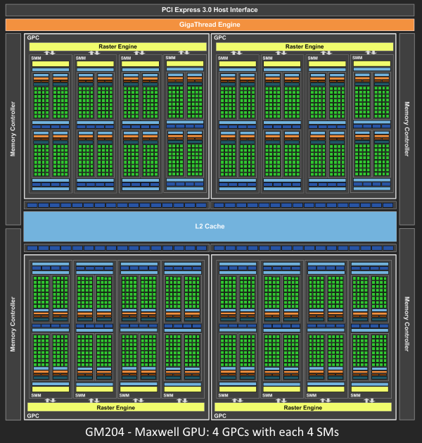
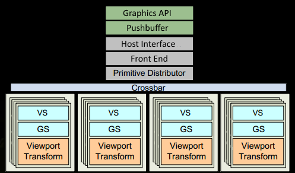
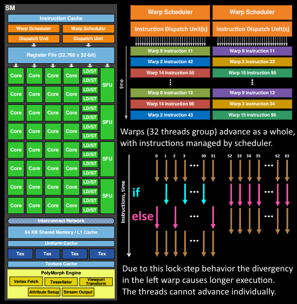
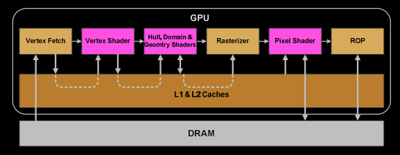
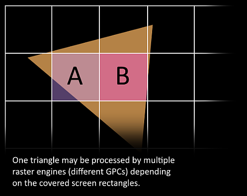

> <i class="fa-solid fa-link"></i>[Life of a triangle](https://developer.nvidia.com/content/life-triangle-nvidias-logical-pipeline)

Since the release of the ground breaking Fermi architecture almost 5 years have gone by, it might be time to refresh the principle graphics architecture beneath it. Fermi was the first NVIDIA GPU implementing a fully scalable graphics engine and its core architecture can be found in Kepler as well as Maxwell. The following article and especially the "compressed pipeline knowledge" image below should serve as a primer based on the various public materials, such as whitepapers or GTC tutorials about the GPU architecture. This article focuses on the graphics viewpoint on how the GPU works, although some principles such as how shader program code gets executed is the same for compute.

自从开创性的 Fermi 架构发布以来，已经过去了近五年时间，现在揭开其背后的基础图形架构了。Fermi 是 NVIDIA 首款实现完全可扩展图形引擎的 GPU，其核心架构也应用到 Kepler 和 Maxwell 的架构中。以下内容，特别是“管线缩略图”，广泛被各种 GPU 架构相关资料（如白皮书或 GTC 教程）所引用。本文从图形角度出发探讨 GPU 的工作原理，其中涉及到的着色器代码如何运行等原理和实际应用中是相同的。



<ul class="fa-ul" style="--fa-li-margin: -0.5em;">
  <li><i class="fa-solid fa-link"></i><a href="https://www.hardwarebg.com/b4k/files/nvidia_gf100_whitepaper.pdf">Fermi Whitepaper</a></li>
  <li><i class="fa-solid fa-link"></i><a href="https://www.nvidia.com/content/dam/en-zz/Solutions/Data-Center/tesla-product-literature/NVIDIA-Kepler-GK110-GK210-Architecture-Whitepaper.pdf">Kepler Whitepaper</a></li>
  <li><i class="fa-solid fa-link"></i><a href="https://www.techpowerup.com/gpu-specs/docs/nvidia-gtx-750-ti.pdf">Maxwell Whitepaper</a></li>
  <li><i class="fa-solid fa-link"></i><a href="https://www.highperformancegraphics.org/previous/www_2010/media/Hot3D/HPG2010_Hot3D_NVIDIA.pdf">Fast Tessellated Rendering on Fermi GF100</a></li>
  <li><i class="fa-solid fa-link"></i><a href="https://on-demand.gputechconf.com/gtc/2013/presentations/S3466-Programming-Guidelines-GPU-Architecture.pd">Programming Guidelines and GPU Architecture Reasons Behind Them</a></li>
</ul>



## <h id="Fermi">Pipeline Architecture Image</h>

    

## GPUs are Super Parallel Work Distributors

Why all this complexity? In graphics we have to deal with data amplification that creates lots of variable workloads. Each drawcall may generate a different amount of triangles. The amount of vertices after clipping is different from what our triangles were originally made of. After back-face and depth culling, not all triangles may need pixels on the screen. The screen size of a triangle can mean it requires millions of pixels or none at all.

在图形处理中，需要进行数据增强（包括但不限于裁剪、缩放、旋转、翻转、色彩变换、添加噪声等），对整个图形工作流有很大负担。每个 drawcall 都会会产生不同数量的三角形。裁剪后三角形顶点数量可能与原始三角形顶点数量不同。在背面剔除和深度剔除之后，并非所有三角形都需要在屏幕上显示。屏幕上的三角形需要上百万个像素组成，也可以不需要任何像素表示。这就是图形处理中复杂性的原因。我们需要处理这些变化，以确保图像能够正确、高效地渲染出来。

As a consequence modern GPUs let their primitives (triangles, lines, points) follow a logical pipeline, not a physical pipeline. In the old days before G80's unified architecture (think DX9 hardware, ps3, xbox360), the pipeline was represented on the chip with the different stages and work would run through it one after another. G80 essentially reused some units for both vertex and fragment shader computations, depending on the load, but it still had a serial process for the primitives/rasterization and so on. With Fermi the pipeline became fully parallel, which means the chip implements a logical pipeline (the steps a triangle goes through) by reusing multiple engines on the chip.

简单来说，现代 GPU 让基本图元（如三角形、线条、点）遵循逻辑管线，而不是物理管线。在 G80 统一架构出现之前（比如 DX9 硬件、PS3、Xbox300 等），GPU 的处理流程在芯片上被划分为不同的阶段，并且图元会按照一定的顺序一个接着一个的处理。G80 架构虽然在一定程度上实现了顶点和片元着色器计算的单元复用，但基本图元（如三角形）和栅格化等处理仍然是串行的。而到了 Fermi 架构，处理流程实现了全并行化，这意味着 GPU 通过复用芯片上的多个引擎，来并行地实现一个逻辑管线（即三角形等图元经历的各个处理步骤）。这样的设计大大提高了 GPU 的效率和性能。

Let's say we have two triangles A and B. Parts of their work could be in different logical pipeline steps. A has already been transformed and needs to be rasterized. Some of its pixels could be running pixel-shader instructions already, while others are being rejected by depth-buffer (Z-cull), others could be already being written to framebuffer, and some may actually wait. And next to all that, we could be fetching the vertices of triangle B. So while each triangle has to go through the logical steps, lots of them could be actively processed at different steps of their lifetime. The job (get drawcall's triangles on screen) is split into many smaller tasks and even subtasks that can run in parallel. Each task is scheduled to the resources that are available, which is not limited to tasks of a certain type (vertex-shading parallel to pixel-shading).

可以这样来解释：假设我们有两个三角形 A 和 B。它们的工作流程中可能包含不同的逻辑管线。三角形 A 已经完成了变换，接下来需要进行光栅化。在这个过程中，A 的一些像素可能已经在执行像素着色器指令，而另一些可能因为深度缓冲区（Z-cull）而被拒绝，还有一些可能已经被写入到帧缓冲区中，还有一些可能还在等待处理。与此同时，我们可能正在获取三角形 B 的顶点。所以，虽然每个三角形都需要按照逻辑管线进行处理，但在它们的生命周期中，很多步骤都可以并行地进行处理。整个任务（即将 drawcall 后的三角形显示在屏幕上）被分割成许多更小的任务或者子任务，这些子任务可以并行运行。每个子任务都被调度到可用的资源上，包括某些特定的任务（如顶点着色器与像素着色器也可以并行处理）。

Think of a river that fans out. Parallel pipeline streams, that are independent of each other, everyone on their own time line, some may branch more than others. If we would color-code the units of a GPU based on the triangle, or drawcall it's currently working on, it would be multi-color blinkenlights :)

可以将这个架构想象成河流的支流，形成的多条并行的支流，它们彼此独立，各自按照自己的时间线流动，有些模块可能会生成更多的支流。如果我们根据 GPU 中当前正在处理的三角形或 drawcall 来给 GPU 中的单元模块染色，那么它们就会像各种颜色的信号灯一样闪烁：)

## GPU Architecture

    

Since Fermi NVIDIA has a similar principle architecture. There is a Giga Thread Engine which manages all the work that's going on. The GPU is partitioned into multiple GPCs (Graphics Processing Cluster), each has multiple SMs (Streaming Multiprocessor) and one Raster Engine. There is lots of interconnects in this process, most notably a Crossbar that allows work migration across GPCs or other functional units like ROP (render output unit) subsystems.

英伟达（NVIDIA）的 Fermi 架构和 Maxwell 架构原理一样。用一个**千兆线程引擎**处理所有任务。GPU 被划分为多个图形处理集群（GPC），每个 GPC 都包含若干流式多处理器（SM）和一个光栅引擎（Raster Engine）。在这个过程中，存在大量的互连，其中最重要的是一个交叉开关（Crossbar），它允许任务在 GPC 之间或像 ROP（渲染输出单元）子系统等其他功能单元之间迁移。

The work that a programmer thinks of (shader program execution) is done on the SMs. It contains many Cores which do the math operations for the threads. One thread could be a vertex-, or pixel-shader invocation for example. Those cores and other units are driven by Warp Schedulers, which manage a group of 32 threads as warp and hand over the instructions to be performed to Dispatch Units. The code logic is handled by the scheduler and not inside a core itself, which just sees something like "sum register 4234 with register 4235 and store in 4230" from the dispatcher. A core itself is rather dumb, compared to a CPU where a core is pretty smart. The GPU puts the smartness into higher levels, it conducts the work of an entire ensemble (or multiple if you will).

大部分可编程的工作（着色器的运行）是在 SM（流式多处理器）上完成的。它包含许多以数学计算为核心的线程。例如，一个线程可能被顶点着色器或像素着色器所占用。核心和其他单元都由 Warp 调度器驱动，其中每个 32 个线程组成一个束，并将要执行的指令交给调度单元。代码逻辑由调度器处理，而不是核心本身，例如：“将寄存器 4234 的值与寄存器 4235 的值相加并存储在寄存器 4230 中”的指令是有调度器完成。然而，相比于 CPU 的核可以处理复杂的逻辑，GPU 的核显得更单一。原因是 GPU 的将复杂的逻辑处理放在更高的一级，它可以协调 GPU 整体进行运作。

How many of these units are actually on the GPU (how many SMs per GPC, how many GPCs..) depends on the chip configuration itself. As you can see above GM204 has 4 GPCs with each 4 SMs, but Tegra X1 for example has 1 GPC and 2 SMs, both with Maxwell design. The SM design itself (number of cores, instruction units, schedulers...) has also changed over time from generation to generation (see first image) and helped making the chips so efficient they can be scaled from high-end desktop to notebook to mobile.

这些单元实际上在 GPU 上的数量（每个 GPC 中有多少个 SM，有多少个 GPC 等）取决于芯片配置。例如 GM204 拥有 4 个 GPC，每个 GPC 中有 4 个 SM；Tegra X1 则只有 1 个 GPC 和 2 个 SM，两者都采用了 Maxwell 设计。而 SM 的设计（包括核心数量、指令单元、调度器等）也在更新迭代（请参考 [Fermi 管线架构图](#Fermi)），让芯片更加高效，能够从高端主机兼容到笔记本再到移动设备。

## The Logical Pipeline

For the sake of simplicity several details are omitted. We assume the drawcall references some index- and vertexbuffer that is already filled with data and lives in the DRAM of the GPU and uses only vertex- and pixelshader (GL: fragmentshader).

为了简化说明，假设一次 drawcall 只引用了一些索引缓冲区和顶点缓冲区，这些缓冲区已经被数据填充，并存储在 GPU 的动态随机存取存储器（DRAM）中。一次 drawcall 仅使用顶点着色器和像素着色器（在 OpenGL 中称为片段着色器）来处理数据。这是一个在 GPU 上执行的图形渲染过程，它利用已经准备好的数据来绘制图形，这些数据通过索引和顶点缓冲区来组织，并使用着色器程序来渲染最终的图像。

    

1. The program makes a drawcall in the graphics api (DX or GL). This reaches the driver at some point which does a bit of validation to check if things are "legal" and inserts the command in a GPU-readable encoding inside a pushbuffer. A lot of bottlenecks can happen here on the CPU side of things, which is why it is important programmers use apis well, and techniques that leverage the power of today's GPUs.

    当用图形 API（如 DirectX 或 OpenGL）发起一次 drawcall，命令会传到驱动程序，并进行合法性验证；然后这个命令以 GPU 可读的编码方式插入到一个推送缓冲区中。由于现代 GPU 的性能和处理速度越来越快，导致整个渲染过程在 CPU 会遇到瓶颈，所以要规范的使用图形 API 才能避免性能瓶颈。

2. After a while or explicit "flush" calls, the driver has buffered up enough work in a pushbuffer and sends it to be processed by the GPU (with some involvement of the OS). The Host Interface of the GPU picks up the commands which are processed via the Front End.

    当收到明确的“刷新”指令时或者缓存一定时间后，驱动程序会在推送缓冲区中缓存一定数量的任务，将其发送给 GPU 进行处理（操作系统这时也会参与进来）。GPU 的主机接口用来接收这些命令，并通过前端进行处理。简单来说，这个过程就是驱动程序先将一些需要 GPU 处理的任务缓存起来，当达到一定量或者通过特定操作触发时，这些任务就会被发送到 GPU 进行进一步的执行。

3. We start our work distribution in the Primitive Distributor by processing the indices in the indexbuffer and generating triangle work batches that we send out to multiple GPCs.

    在“图元分配器”（Primitive Distributor）中，开始进行任务分配的。这个过程涉及到处理索引缓冲区（indexbuffer）中的索引，生成三角形批次，然后将每个批次发送到 GPCs 进行处理。

    

        
    

4. Within a GPC, the Poly Morph Engine of one of the SMs takes care of fetching the vertex data from the triangle indices (Vertex Fetch).

    在 GPC 中，Poly Morph 模块负责从索引中检索顶点数据（顶点提取）这个过程是图形渲染流水线中的一部分，它负责从存储的三角形数据中提取出构成这些三角形的顶点信息。Poly Morph 引擎是图形处理单元（GPU）中的一个关键组件，它优化了顶点数据的提取和转换，以便后续进行光栅化和像素着色等处理。

5. After the data has been fetched, warps of 32 threads are scheduled inside the SM and will be working on the vertices.

    数据提取后，在 SM 内部会调度 32 个线程的束（warp）处理顶点。这里的“顶点”是指图计算、图形渲染或任何需要并行处理大量数据点的场景中的元素。束（warp）是 GPU 编程中的一个术语，它指的是一组并行执行的线程，这些线程在 GPU 中一起工作，以提高处理效率。在 NVIDIA 的 GPU 架构中，一个束通常包含 32 个线程。

6. The SM's warp scheduler issues the instructions for the entire warp in-order. The threads run each instruction in lock-step and can be masked out individually if they should not actively execute it. There can be multiple reasons for requiring such masking. For example when the current instruction is part of the "if (true)" branch and the thread specific data evaluated "false", or when a loop's termination criteria was reached in one thread but not another. Therefore having lots of branch divergence in a shader can increase the time spent for all threads in the warp significantly. Threads cannot advance individually, only as a warp! Warps, however, are independent of each other.

    SM 的束调度器按顺序为整个束发出指令。线程以同步的方式运行每条指令，如果指令不主动执行，则可以单独屏蔽掉这条指令。可能需要这种屏蔽方式的原因有很多，例如，当前指令只有满足`if (true)`的条件才会执行，而该线程具体的数值计算为`false`时，需要屏蔽掉该指令；或者当一个线程的循环终止条件达到而另一个线程未达到时，需要屏蔽掉已经终止的线程中的指令。因此，着色器中存在大量分支语句会显著增加束中线程运行的时间。线程不能单独运行，只能组成一个束统一调度；但是，束与束之间是独立的。

7. The warp's instruction may be completed at once or may take several dispatch turns. For example the SM typically has less units for load/store than doing basic math operations.

    指令的执行可能是立即完成的，也可能需要几个调度周期。例如，SM 中用于加载/存储的单元要比执行基本数学运算的单元要少。这意味着不同的指令可能需要不同的时间来执行，这取决于它们的类型和所需的资源。在一些情况下，比如需要频繁地访问内存时，执行速度可能会相对较慢。

8. As some instructions take longer to complete than others, especially memory loads, the warp scheduler may simply switch to another warp that is not waiting for memory. This is the key concept how GPUs overcome latency of memory reads, they simply switch out groups of active threads. To make this switching very fast, all threads managed by the scheduler have their own registers in the register-file. The more registers a shader program needs, the less threads/warps have space. The less warps we can switch between, the less useful work we can do while waiting for instructions to complete (foremost memory fetches).

    由于某些指令比其他指令需要更长的时间来完成，尤其是内存加载，束调度器会切换到另一个不在等待内存的束。这就是 GPU 解决内存存读取延迟的关键，做法就是简单地切换到活跃线程组。为了使这种切换非常快速，调度器管理的所有线程都有自己的寄存器。着色器程序需要的寄存器越多，线程或束的空间就越少。可切换的束越少，在等待指令完成（主要是内存读取）时能做的有用工作就越少。

    

        
    

9. Once the warp has completed all instructions of the vertex-shader, it's results are being processed by Viewport Transform. The triangle gets clipped by the clipspace volume and is ready for rasterization. We use L1 and L2 Caches for all this cross-task communication data.

    当顶点着色器完成了所有指令的处理后，还需要经过视口变换（Viewport Transform）进一步处理。在这个过程中，三角形会根据裁剪空间进行裁剪，以准备进行光栅化。在整个跨任务通信数据处理的过程中，会使用 L1 和 L2 缓存来加快处理速度。

    

        
    

10. Now it gets exciting, our triangle is about to be chopped up and potentially leaving the GPC it currently lives on. The bounding box of the triangle is used to decide which raster engines need to work on it, as each engine covers multiple tiles of the screen. It sends out the triangle to one or multiple GPCs via the Work Distribution Crossbar. We effectively split our triangle into lots of smaller jobs now.

    三角形被分割后，会离开它当前的 GPC。一个三角形的包围盒决定需要的光栅引擎的个数，同时每个光栅引擎会覆盖屏幕上多个像素块。这个过程是通过任务分配器的交叉开关可以将三角形分配到一个或多个 GPC(s) 进行处理。这样就三角形的数据处理分配到到多个较小的任务上进行。

    

        
    

11. Attribute Setup at the target SM will ensure that the interpolants (for example the outputs we generated in a vertex-shader) are in a pixel shader friendly format.

    在指定的 SM 上进行属性设置时，要保证插值变量（例如在顶点着色器中生成的输出）符合像素着色器处理的格式。这一步骤是为了保证在图形渲染的后续阶段，尤其是在像素着色器中，这些变量能够被正确且高效地使用。

12. The Raster Engine of a GPC works on the triangle it received and generates the pixel information for those sections that it is responsible for (also handles back-face culling and Z-cull).

    在 GPC 中的光栅引擎处理其被分配的三角形，并生成像素信息（同时还处理背面剔除和深度剔除）。

13. Again we batch up 32 pixel threads, or better say 8 times 2x2 pixel quads, which is the smallest unit we will always work with in pixel shaders. This 2x2 quad allows us to calculate derivatives for things like texture mip map filtering (big change in texture coordinates within quad causes higher mip). Those threads within the 2x2 quad whose sample locations are not actually covering the triangle, are masked out (gl_HelperInvocation). One of the local SM's warp scheduler will manage the pixel-shading task.

    将 32 个像素线程分成 8 个 2x2 像素块，这是像素着色器中处理的最小单元。2x2 像素块是用来计算诸如纹理 mip-map 贴图的导数（如果 2x2 像素块内的纹理坐标变化较大，将使用更高分辨率的 mip-map 贴图）。在 2x2 像素块内，那些不实际覆盖三角形的线程会被屏蔽。用其中一个 SM 的束调度器管理像素着色的任务。

14. The same warp scheduler instruction game, that we had in the vertex-shader logical stage, is now performed on the pixel-shader threads. The lock-step processing is particularly handy because we can access the values within a pixel quad almost for free, as all threads are guaranteed to have their data computed up to the same instruction point (NV_shader_thread_group).

    像素着色器线程中的束调度器使用了与顶点着色器阶段相同的调度机制。这个机制允许在像素块内访问值几乎不需要任何代价，所以同步处理非常方便。由于所有线程的数据都保证计算到同一步指令位置，线程之间可以高效地共享数据。

    

        
    

15. Are we there yet? Almost, our pixel-shader has completed the calculation of the colors to be written to the rendertargets and we also have a depth value. At this point we have to take the original api ordering of triangles into account before we hand that data over to one of the ROP (render output unit) subsystems, which in itself has multiple ROP units. Here depth-testing, blending with the framebuffer and so on is performed. These operations need to happen atomically (one color/depth set at a time) to ensure we don't have one triangle's color and another triangle's depth value when both cover the same pixel. NVIDIA typically applies memory compression, to reduce memory bandwidth requirements, which increases "effective" bandwidth (see GTX 980 pdf).

    像素着色器完成颜色和深度值的计算后，需要考虑三角形按照 API 中的顺序传递给 ROP 单元。在 ROP 单元中进行深度测试和帧缓冲区混合等操作，这些操作是原子性的，以保证渲染结果的正确性。NVIDIA 还使用内存压缩技术来减少内存带宽需求，从而提高传输效率（参考 [GTX 980](https://www.studocu.com/it/document/politecnico-di-milano/advanced-computer-architectures/ge-force-gtx-980-whitepaper-final/2232255)）。

## Further Reading

<ul class="fa-ul" style="--fa-li-margin: -0.5em;">
  <li><i class="fa-solid fa-link"></i><a href="https://fgiesen.wordpress.com/2011/07/09/a-trip-through-the-graphics-pipeline-2011-index/">A trip through the graphics-pipeline</a></li>
  <li><i class="fa-solid fa-link"></i><a href="http://on-demand.gputechconf.com/gtc/2013/video/S3466-Performance-Optimization-Guidelines-GPU-Architecture-Details.mp4">Performance Optimization Guidelines and the GPU Architecture behind them</a></li>
  <li><i class="fa-solid fa-link"></i><a href="http://graphics.stanford.edu/papers/pomegranate/">Pomegranate: A Fully Scalable Graphics Architecture </a></li>
</ul>
