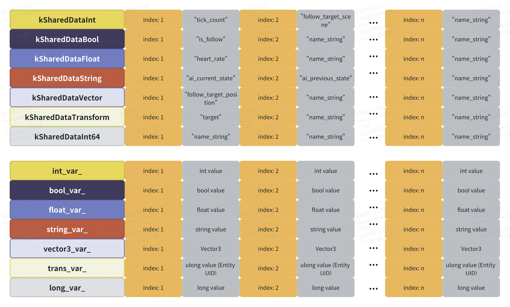
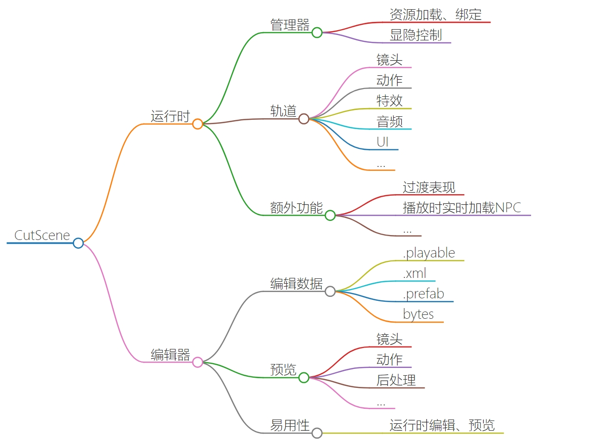

## 客户端自动战斗 AI

### Behaviour Designer 行为树插件

#### AI 的解决方案

- 编码：反应型 AI
  - 状态机
  - 行为树
  - 基于规则的系统
- 求解：协商行 AI
  - A*
  - 目标导向型行动计划（GOAP）
  - 层次人物网规划（HTN）
  - 规划器
- 学习：机器学习
  - 模仿学习
  - 强化学习

游戏中常见的 AI 解决方案都是反应型 AI，RO 中大量用到反应型 AI 的行为树作为解决方案，这个行为树插件就是 Behaviour Designer

### Behaviour Designer 中的 Task

简单行为树实际上就是 Task 的集合，Task 有四种不同的类型：

- Action 动作——代表了某种状态，最基本的任务
- Conditional 条件——用来检测是否达到某种条件
- Composite 复合——包含了一系列子任务列表的父任务
- Decorator 修饰符——也是一个父任务，并且只能包含一个子任务，是用来修改子任务的行为。例如将一个子任务运行 10 次（Repeater），或者对子任务的结果取反（Inverter）

#### Action 和 Conditional 自定义 Task

一般情况下只会在 Behaviour Designer 中定义 Action 和 Conditional，Composite 和 Decorator 使用提供的就可以，下面的 Action 代码由工具自动生成

```c#
[BehaviorDesigner.Runtime.Tasks.TaskDescriptionAttribute("血量属性比较")]
public class MAISelfCompareByHP : BehaviorDesigner.Runtime.Tasks.Action
{
    [BehaviorDesigner.Runtime.Tasks.TooltipAttribute("是否自己")]
    public BehaviorDesigner.Runtime.SharedBool is_self;
    [BehaviorDesigner.Runtime.Tasks.TooltipAttribute("目标")]
    public BehaviorDesigner.Runtime.SharedTransform target;
    [BehaviorDesigner.Runtime.Tasks.TooltipAttribute("值类型 (hp 血量 、hp 百分比）")]
    public MoonClient.MAISelfCompareByHP.MHPValueType hp_value_type;
    [BehaviorDesigner.Runtime.Tasks.TooltipAttribute("比较类型")]
    public MoonClient.MNumberComparisonType hp_cmp_type;
    [BehaviorDesigner.Runtime.Tasks.TooltipAttribute("右值")]
    public BehaviorDesigner.Runtime.SharedFloat right_value;
    [BehaviorDesigner.Runtime.Tasks.TooltipAttribute("保存左值结果")]
    public BehaviorDesigner.Runtime.SharedFloat store_left_value;
    private MoonClient.MAISelfCompareByHP node;
    private MEntity entity;
    private MoonClient.MAISelfCompareByHP.MNodeArgs args;
   
    public override void OnAwake()
    {
     entity = MEntityMgr.singleton.GetEntity(ulong.Parse(Owner.gameObject.name));
     if(entity == null) return;
     node = new MoonClient.MAISelfCompareByHP();
     args = new MoonClient.MAISelfCompareByHP.MNodeArgs();
      args.is_self = is_self.swigValue;
      args.hp_value_type = hp_value_type;
      args.hp_cmp_type = hp_cmp_type;
      args.right_value = right_value.swigValue;
      args.store_left_value = store_left_value.swigValue;
     node.SetNodeArgs(args);
    }
    
    public override TaskStatus OnUpdate()
    {
     if(entity == null) return TaskStatus.Failure;
     return node.Update(entity) ? TaskStatus.Success : TaskStatus.Failure;
    }
}
```

#### 常用的 Parent Tasks

- Composite 复合类型
  - Sequence 将其所有子节点依次执行，也就是说当前一个返回“完成”状态后，再运行先一个子节点
[Image]
  The sequence task is similar to an "and" operation. It will return failure as soon as one of its child tasks return failure. If a child task returns success then it will sequentially run the next task. If all child tasks return success then it will return success.
  和“and”操作符逻辑类似，下面的子任务按照从左到右的顺序执行，如果有一个子任务返回 false，后续子任务都不执行，并且该任务直接返回 false
  - Selector 选择其子节点的某一个执行
[Image]
  The selector task is similar to an "or" operation. It will return success as soon as one of its child tasks return success. If a child task returns failure then it will sequentially run the next task. If no child task returns success then it will return failure.
  和“or”操作符逻辑类似，让子任务从左到右依次执行，如果有一个人物返回 true，后续所有人物就不执行，该任务直接返回 true
  - Parallel 将其所有子节点都运行一遍
- Decorator 装饰器类型
  - Inverter
  - Repeater
  - Return Failure 和 Return Success
  ```c#
    // ReturnFailure.cs
    public override TaskStatus Decorate(TaskStatus status)
    {
        // Return failure even if the child task returned success.
        if (status == TaskStatus.Success) {
            return TaskStatus.Failure;
        }
        return status;
    }

    // ReturnSuccess.cs
    public override TaskStatus Decorate(TaskStatus status)
    {
        // Return success even if the child task returned failure.
        if (status == TaskStatus.Failure) {
            return TaskStatus.Success;
        }
        return status;
    }
  ```
  无论返回成功还是失败，都是返回相应任务对应的结果
  - Until Failure 和 Until Success
  - Random Probability

### 变量相关

行为树的优点是非常灵活，因为所有任务都是解耦合的，任务之间是不互相依赖的。但是有时候需要提供彼此共享的信息，这是会用到行为树提供的共享变量类型。在需要的 Task 中定义了某个类型，需要在行为树中创建该类型，并在 Task 中引用该类型

局部变量就是当前行为树可以共享的变量，全局变量就是所有行为树都可以共享的变量，Behaviour Designer 内置的共享变量类型有以下几种：

```c#
SharedAnimationCurve
SharedBool
SharedColor
SharedFloat
SharedGameObject
SharedGameObjectList
SharedInt
SharedMaterial
SharedObject
SharedObjectList
SharedQuaternion
SharedRect
SharedString
SharedTransform
SharedTransformList
SharedVector2
SharedVector3Int
SharedVector3
SharedVector3Int
SharedVector4
```

### Behaviour Designer 中的共享变量的理解

Behaviour Designer 的共享变量是一种黑板（Blackboard）设计模式
输入内容的来源取决于行为树用在整个 AI 架构的哪一层，可以是游戏世界的信息，或者是上层模块的输出。输入的形式，可以是分散的（Decentralized），也可以是集中的（Centralized）。举个例子来说，如果我们做一个战士是移动，还是攻击的决策，这是决策层的行为，所以输入内容就是游戏世界的信息，它可能包括战士自身状态（在模块 A 中），敌人状态（在模块 B 中），装备物品情况（在模块 C），地图场景情况（在模块 D 中）等等，所以，当我们搜索和执行行为树时，我们需要从 4 个模块中获取信息来帮助决策，这样的方式就是我上面说的分散的方式，它的好处是调用非常直接（可能是用多个 Singleton 提供的接口），没有数据冗余，缺点是使得行为树对于数据的依赖度太分散。

集中的方式的话，就是我们可以定义一个数据结构专门用于行为树的输入，将上面提到的需要用到的数据，在进行行为树决策前，先从各个模块中收集到这个数据结构里，然后再递交给行为树使用。集中式的输入减少了输入和行为树之间的接口数量（只和预定义的数据结构通信），但缺点是，存在数据冗余。不过，我们可以看到集中式的数据输入使得行为树的表现更像一个黑盒了（可以伪造数据来测试行为树），这也是我们一直以来想要的。可以参看下面对于两种方式的示意图：
在行为树的使用过程中，发现有时候节点和节点间，行为树和行为树之间确实需要有数据共享，比如对于序列（Sequence）节点来说，它的执行行为是依次执行每一个子节点，直白一点说的话，就是执行完一个再执行下一个。一般用到序列的行为，其子节点间总会有一些联系，这里就可能存在节点间通信的问题。再比如，在一些团队 AI 的决策过程中，当前 AI 的行为树决策可能需要参考其他 AI 的决策结果，所以这样就存在了行为树之间需要通信的情况。

所以，在实践过程中，我们还会定义另一块黑板来负责行为树间和节点间的通信需求，示意图如下

### RO 中的`MShareData`

#### 可共享的变量类型

```c#
public enum MSharedDataType
{    
    kSharedDataInt = 0,
    kSharedDataBool,
    kSharedDataFloat,
    kSharedDataString,
    kSharedDataVector,
    kSharedDataTransform,
    kSharedDataInt64,
    kSharedDataTypeCount,
};
```

#### AI 节点中变量名和值的存储

主要由记录变量名对应的哈希值（其实就是自增值）和存储各个变量类型的数组（类型值数组）建立起来的映射关系，这些数组里以变量名的哈希值作为下标，存储相应的值；主要的变量如下：
```c#
// 存储变量名的哈希值，每种变量类型分别记录，读取时根据不同的变量类型读取相应的类型值数组
private static Dictionary<string, uint>[] name_hash_ =
    new Dictionary<string, uint>[(int)MSharedDataType.kSharedDataTypeCount];
private static uint[] name_index_ =
    new uint[(int)MSharedDataType.kSharedDataTypeCount]; //int 型数组里面的值默认初始化为 0
    
// 声明类型值数组
private const int kMaxAIDataCount = 150; // 所有变量的数量上限
private float[] float_var_;
private int[] int_var_;
private long[] long_var_;
private bool[] bool_var_;
private ulong[] trans_var_;
private string[] string_var_;
private Vector3[] vector3_var_;

/*默认初始化 
 * bool --> false
 * int、float --> 0
 * 其他值类型 --> 该类型字段默认值
 * 引用类型（包括 string) --> null
*/
float_var_ = new float[kMaxAIDataCount];
int_var_ = new int[kMaxAIDataCount];
long_var_ = new long[kMaxAIDataCount];
bool_var_ = new bool[kMaxAIDataCount];
trans_var_ = new ulong[kMaxAIDataCount];
string_var_ = new string[kMaxAIDataCount];
vector3_var_ = new Vector3[kMaxAIDataCount];
```

运行时通过以下映射关系读取对应 AI 节点中的变量值

<center>
    
</center>

#### PB 数据

##### 客户端行为树的 Node 生成

- 主要解析运行时 AI 代码的源文件，遍历 Assets/Scripts/MoonClient/AI/Node 目录下所有。cs 文件，源文件中每个类都继承自 MAINodeAction 或者 MAINodeAction，根据基类的不同导出不同类型的节点
[Image]
- 根据类中定义 MNodeArgs 的成员变量添加 public 成员变量，成员变量的类型根据下面的字典映射
  ```c#
    private static readonly Dictionary<Type, Type> typeRemapDict = new Dictionary<Type, Type>()
    {
        {typeof(int), typeof(SharedInt) },
        {typeof(long), typeof(SharedLong) },
        {typeof(ulong), typeof(SharedULong) },
        {typeof(float), typeof(SharedFloat) },
        {typeof(string), typeof(SharedString) },
        {typeof(bool), typeof(SharedBool) },
        {typeof(UnityEngine.Vector3), typeof(SharedUnityVector3) },
        {typeof(ROGameLibs.Vector3), typeof(SharedVector3) },
        {typeof(SWIGTYPE_p_Vector3), typeof(SharedVector3) },
    #if LIBS_EDITOR
        {typeof(SWIGTYPE_p_ROObject), typeof(SharedTransform) },
    #endif
        {typeof(MoonClient.MEntity), typeof(SharedTransform) },
        {typeof(IntVector), typeof(SharedIntList) },
        {typeof(LongVector), typeof(SharedLongList) },
        {typeof(FloatVector), typeof(SharedFloatList) },
        {typeof(StringVector), typeof(SharedStringList) },
        {typeof(ULongVector), typeof(SharedULongList) },
    };
  ```
- 同时根据属性 NodeComment，设置编辑器中变量的悬浮注释
- 固定格式的代码段
  ```c#
  private MoonClient.XXX node; // XXX 为源文件类名
  private MEntity entity;
  private MoonClient.XXX.MNodeArgs args; // XXX 为源文件类名
  
  public override void OnAwake()
  {
      entity = MEntityMgr.singleton.GetEntity(ulong.Parse(Owner.  gameObject.name));
      if(entity == null) return;
      node = new MoonClient.MAIAutoFollow();
      args = new MoonClient.MAIAutoFollow.MNodeArgs();
      // args.follow_target_radius = follow_target_radius.swigValue;
      // args.teleport_distance = teleport_distance.swigValue;
      // 源文件中 MNodeArgs 的成员变量赋值
      node.SetNodeArgs(args);
  }

  public override TaskStatus OnUpdate()
  {
      if(entity == null) return TaskStatus.Failure;
      return node.Update(entity) ? TaskStatus.Success : TaskStatus.  Failure;
  }
  ```

### 运行时 AI
#### 初始化
- 初始化 AI 组件：MPlayer::InitComponents
- 初始化行为树：MAIComponent::InitBehaviorTree
  - 初始化所有玩家通用的 AI 树：MAIBehaviorTree::Init
    - 加载 PlayerAI/Player_Auto_AI.bytes 文件：MAITreeManager::LoadFile
    - 构造 AI 树：MAITreeManager::BuildAITree
    - 递归构造节点：MAITreeManager::BuildOneNode
      - 未初始化时，初始化所有节点类型对象的委托：MAINodeFactory::CreateAINodeByName
      - 初始化完成即调用，解析 PB 初始化节点

#### 调用逻辑

- 在 MAIComponent::Update 每次 Update 满足一定条件后都执行一次_behaviorTree.Tick(Entity)
- 每次 tick 都从 AINode 的 RootNode 递归到每个子节点，执行相应业务逻辑节点的 Update 函数中的逻辑

#### 客户端如何进行自动释放

* 策划会在行为树中配置一些列的条件（顺序执行或选择执行）
  * 自动跟随的距离
  * Entity 类型限制
  * 战斗半径大小
  * 变身情况
  * ...
* 依次遍历装配在自动战斗槽位的技能（1~6）
* 当第 i 个槽位有装配技能时，根据技能 id 读取技能表中配置的`AITreeName`
* 将查询到的`AITreeName`放置到`tree_name`共享变量中
* 再通过`MAIDynamicTreeReference`读取`tree_name`中的值，并读取改节点树的 PB，合并到当前`MAIDynamicTreeReference`的父节点上
* 读取到相关技能节点树后，根据策划的配置条件，满足后可释放
  * 技能是否存在
  * 释放技能后，是否存在不可叠加的 buff
  * ...
* 释放技能：通过`MWaitingDataMgr`添加可释放的技能到待执行队列中，每次 update 走技能释放逻辑

### 相关改进

线上 bug：某些职业释放技能后，已经上了不可叠加的 buff（buff 效果消失之前不能够重复释放改技能），但是客户端的 AI 依然会继续持续释放，造成抽搐的表现（偶现问题没有查到具体原因）
解决方案：更改`MAICastSkill`节点，释放次数超过一定数值，不可释放该技能

## 附身

### 需求

* 技能：灵喵附身
* 技能描述：喵喵附身于选中的队友身上，每秒消耗 5 点自然力量，持续 20 秒，自身处于无敌状态，且将自身 10%的六维属性附加于附身的队友

### 实现方式

* 释放技能为角色添加 Buff
* 客户端根据 Buff 状态类型进行判断，如果是附身 Buff 状态类型
  * 附身目标只有一个，取服务器发过来的第一个 Buff 相关目标（区别于 Buff 目标）的 uid
  * 在`MBuffComponent`组件中记录该 uid
  * 广播`StopMove`事件，让玩家无法移动
  * 设置玩家的位置、朝向与被附身的玩家一致
* 屏蔽玩家的碰撞体，使玩家和被附身的人保持一致
* 在`MHideComponent`组件中，将玩家设置为半透明状态
* 控制移动
  * 屏蔽摇杆和点击地面的移动效果
  * 在`MMoveComponent`组件的 Update 中，每帧设置玩家的移动距离改为和被附身的玩家做差
    ```c#
    var buffFollowTarget = Entity.BuffFollowTarget;
    if (buffFollowTarget != null)
    {
        Entity.AppendMove(buffFollowTarget.Position - Entity.Position);
    }
    else
    {
        Entity.AppendMove(Entity.ServerPos - Entity.Position);
    }
    ```

## Odin OdinMenuTree

## UI 框架

### Windows 生命周期

- 打开 UI：Active -> BindEvents -> OnActive -> OnShow -> AfterShow
- 关闭 UI：Deactive -> UnBindEvents -> OnHide -> OnDeActive -> AfterOnDeActive -> ReleaseAll

### `UIBase`

- `OnLoad`：加载资源
  - `baseloadCallback`：资源加载成功后的回调
  - `Init`：初始化
- `OnBindPanel`：绑定预制
- `OnUnload`：释放资源，关闭界面或者切换语言
- `Init`：`OnUnload`后调用
- `Uninit`：`UnLoad`或关闭游戏进程后调用
- `OnActive`：`Active`后调用
- `OnDeActive`：`DeActive`后调用
- `OnShow`
- `AfterShow`：当上层界面完全关闭后调用
- `OnHide`
- `BindEvents`：`Active`后，`OnActive`之前调用
- `Update`
- `UpdateInput`
- `OnLogout`
- `OnReconnected`

### `UIManager`

- UIManager 打开关闭界面以组的方式进行处理。
  - 所有的组信息都会进栈进行管理。
  - 会根据配置来确定这个组里面有哪些界面
  - 没做配置的界面会把这一个界面当成一组
  - 支持静态配置和打开界面时传递动态配置

> - `ActiveUI`打开某个 Window 函数入口
> - 通过`require`指定 Window 名字，并进行初始化`UI[panelClassName].new()`
> - 为当前 Window 添加`groupName`
> - `_createUIPanelConfig` 生成 UIPanel 配置，得到界面的配置数据
> - `ActiveUIPanelInGroup` 打开界面时对栈进行处理

#### 设置 UI 层级（UILayer）
```lua
---@class UILayer
UILayer = {
    Normal = 0,   -- 20
    Function = 1, -- 40
    Tips = 2,     -- 60
    Guiding = 3,  -- 80
    Top = 4       -- 100
}
```

#### 界面类型（ActiveType）

* `None`：不做任何处理
* `Normal`：显示时会把这个界面加入主界面组中（NormalLayer -> MainPanelsGroupGroup，无视设置的 UILayer 放到 NormalLayer）
* `Exclusive`：显示时会隐藏前面的组（隐藏 Normal Exclusive 类型 UI，Layer 无关）
* `Standalone`：显示后不会被 Exclusive 类型隐藏

## 剧本解析

### 代码结构

```
clientcode\CSProject\MoonClient\CommandSystem:. 
│  CommandBlock.cs 创建以及执行 Block 的方法都会在这里
│  CommandBlockManager.cs 上下文环境管理，变量储存
│  CommandBlockTriggerManager.cs 触发器管理
│  CommandConst.cs 所有与命令相关的常量都会记录在这里
│   
├─Attribute 静态语法检查
│      CommandArgsAttribute.cs 
│      CommandCheckAttribute.cs 
│       
├─Checker 静态语法检查
│      CommandBlockChecker.cs 
│       
├─Commands C#命令
│  │  BaseCommand.cs 
│  │  LuaCommand.cs 
│  │   
│  ├─NPC 
│  │      ChangeEmotionCommand.cs 
│  │      .​.. 省略
│  │       
│  ├─Other 
│  │      FindElfCommand.cs 
│  │      ShowModelAlarmCommand.cs 
│  │       
│  └─System 
│          AddLocalBuffCommand.cs 
│          .​.. 省略
│           
├─Compile 二进制编译
│      CommandBlockBinaryCompiler.cs 
│      CommandBlockParser.cs 
│       
├─Data PB 数据结构以及动态参数解析
│      BaseArg.cs 
│      BlockIndexArg.cs 
│      BlockVarArg.cs 
│      CommandBlockArg.cs 
│      CommandBlockStringArg.cs 
│      CommandData.cs 
│      CommandLuaArg.cs 
│      ExpressionArg.cs 
│      FunctionArg.cs 
│      ValueArg.cs 
│       
├─Expression 表达式词法解析器
│      EOFToken.cs 
│      IdentifierToken.cs 
│      Lexer.cs 
│      LuaConverter.cs 
│      NumberToken.cs 
│      StringToken.cs 
│      Token.cs 
│       
└─Trigger 触发器相关
    │  CommandTrigger.cs 
    │   
    └─Event 触发器事件埋点
            BaseEvent.cs 
            OnCollectSuccEvent.cs 
            OnDamagedByPlayerEvent.cs 
            OnEnterDungeons.cs 
            OnExitDungeons.cs 
            OnKilledByPlayerEvent.cs 
            OnNpcCreateEvent.cs 
            OnNpcDestroyEvent.cs 
            OnStartCollectEvent.cs
```

在`ScriptHandle`函数解析每一行剧本时确定是用 C#中的`BaseCommand`还是 Lua 中的`LuaCommand`进行解析

```c#
//只有在列出的类型或者 Lua 类型才会通过池子进行复用
if (CommandConst.CommandTypeDict.TryGetValue(dacommandType, out var type))
{
    command = UUIDObjectPool.Get(type) as BaseCommand;
}
else
{
    var luaCommand = UUIDObjectPool.Get(typeof(LuaCommand)) as LuaCommand;
    luaCommand?.SetCodeId(data.commandType);
    command = luaCommand;
}
```

### 解析特殊表达式

```c#
// Arg 数字 | 任意字符 | LUA<<函数名>> | <<函数名>>
public static readonly string ArgsRegex = @"{{Arg(\d+?)}}|{{(.+?)}}|LUA<<(.+?)>>|<<(.+?)>>";
public CommandBlockStringArg Init(string origin)
{
    OriginString = origin;
    if (origin == null)
    {
        return this;
    }
    _formatString = origin;
    int argNum = 0;
    var argMatch = Regex.Matches(_formatString, ArgsRegex);
    foreach (Match match in argMatch)
    {
        var blockArgValue = match.Groups[1].Value;
        var blockVarValue = match.Groups[2].Value;
        var luaValue = match.Groups[3].Value;
        var exprValue = match.Groups[4].Value;
        if (!string.IsNullOrEmpty(blockArgValue))
        {
            if (int.TryParse(blockArgValue, out int index))
            {
                var arg = MCommonObjectPool<BlockIndexArg>.Get().Init(index);
                _formatArgs.Add(arg);
                _formatString = _formatString.Replace(match.Groups[0].Value, $"{{{argNum}}}");
                argNum++;
            }
        }
        else if (!string.IsNullOrEmpty(blockVarValue))
        {
            var arg = MCommonObjectPool<BlockVarArg>.Get().Init(blockVarValue);
            _formatArgs.Add(arg);
            _formatString = _formatString.Replace(match.Groups[0].Value, $"{{{argNum}}}");
            argNum++;
        }
        else if (!string.IsNullOrEmpty(luaValue))
        {
            var arg = MCommonObjectPool<CommandLuaArg>.Get().Init(luaValue);
            _formatArgs.Add(arg);
            _formatString = _formatString.Replace(match.Groups[0].Value, $"{{{argNum}}}");
            argNum++;
        }
        else if (!string.IsNullOrEmpty(exprValue))
        {
            var arg = MCommonObjectPool<ExpressionArg>.Get().Init(exprValue);
            _formatArgs.Add(arg);
            _formatString = _formatString.Replace(match.Groups[0].Value, $"{{{argNum}}}");
            argNum++;
        }
    }
    return this;
}
```

## UI Renderer Texture

### 使用 URP 管线进行 RT 渲染

- `CreatUIModelData`：RtModelAssistant[RT 动效助手] 进行模型创建
  - `MModel.OriginData`设置相关数据
  - `Layer`设置为`ID_RTFACTORY`，只渲染`ID_RTFACTORY`层
- `MUIRTData`：定义 RT 渲染设置数据
  - `RawImage`
  - 相机位置
  - 描边
  - 阴影
  - 反射
  - 大小
- `CreateRawImageRT`
  - 创建新的 RawImage
  - 创建新的 RTStage，用于管理 RT
    - `RTCamera.Init`
      - 加载 Camera 预制（UIRTCamera）
      - Culling Mask
      - 位置
      - projectionMatrix
      - targetTexture
      - 替他
        - 阴影
        - 反射
  - RawImage 与 RTStage 绑定
- UIRTCamera（采用 UniversalRenderPipelineAsset_RTRenderer 管线配置）
  - 由于设定了 Culling Mask，相机只会照到需要渲染的物体

#### 自定义`MCBRTRendererFeature`

- 调用`CreatUIModelData`时会存储 Rt 和对其应的渲染数据`RawImageRtDataDicAdd`
- `UpdateRawImageRT` 处理模型的 renders
  - 收集全部 renders
  - 收集不透明材质的 renders
- `UpdateRendererByRawImage` 开始真正的渲染
  - 渲染 All Renders
    - 初始化`CBRTData`
    - `RenderEx`
      - 检查设备是否支持`RenderTextureFormat.ARGB32`
      - texture 大小是否为正数
      - `GetRenderTexture`
        - `CameraMode` 相机模式
        - `OutlineRenderer`Shader 传入相机位置属性标记`_CameraPos`
        - `data.pMatrix.m00 /= aspect;`
        - 判断是否可以使用共享 RT `_sharedRT`
          - `_sharedRT`会在`Awake`时初始化为`Vector2.one`的大小
          - 不使用共享 RT 时，则会根据传入的`width`和`height`大小获取 texture `RenderTexture.GetTemporary`
        - 创建渲染队列
        - 设置材质的标识符和 rt 关联
  - 描边、阴影、描边
    - 因为在场景中模型的材质和 UI 中用的材质不一样所以需要替换一下
    - `MResLoader.singleton.CreateMatFromPool(MShaderUtil.EffectOutlineMaterialPath);`
    - 记录到`CBRTQuene`的`materialDict`中
- `MCBRTRenderPass`执行 URP 管线中的`Excute`函数，通过`CommandBuff`进行绘制
  - 不使用共享 RT 绘制，绘制单个 RT
    - 设置渲染目标 `SetRenderTarget` texture 为初始化 CBRT 队列时传入的 texture
    - 清除渲染状态 `ClearRenderTarget`
    - 调用绘制函数 `DrawRenderers`
  - 开启了共享 RT 绘制的会继续绘制共享 RT
    - 设置渲染目标 `SetRenderTarget` texture 为`_sharedRT`
    - 清除渲染状态 `ClearRenderTarget`
    - 调用绘制函数 `DrawRenderers`
- 绘制 `DrawRenderers`
  - 设置自定义 MVP 矩阵
  - 根据 Render 的材质生成`CommandBuffer`列表
  - 根据`renderQueue`和`CameraDistance`对`CommandBuffer`列表进行排序
  - 调用`DrawRenderer`进行渲染
- 每帧进行`_sharedRT`大小检测，超出 256 进行扩容
    ```c#
    private void LateUpdate()
    {
        //if (_temporaryCBRTs.Count > _GCThreshold)
        {
            //当池中数量超过阈值时触发清空空队列，提升一些性能
            ReleaseEmpty();
        }
        //合并 RT 图集
        List<CBRTQuene> rtQuenes = MListPool<CBRTQuene>.Get();
        foreach (var rtQuene in _CBRTQuenes)
        {
            if (rtQuene.isValid && rtQuene.isRTAltas && rtQueneIsInActiveRawImage())
            {
                rtQuenes.Add(rtQuene);
            }
        }
        if (rtQuenes.Count == 0)
        {
            ResizeShareRT(Vector2.one);
            MListPool<CBRTQuene>.Release(rtQuenes);
            return;
        }
        rtQuenes.Sort((x, y) => y.clipRect.width.CompareTo(xclipRect.width));
        // clipRect 计算 x y
        Vector2 targetSize = new Vector2(256, 256);
        bool loop = true; // 重新计算
        while (loop)
        {
            Vector2 position = Vector2.zero;
            float nextX = 0.0f;
            loop = false;
            foreach (var rtQuene in rtQuenes)
            {
                // 一个 ClipRect.height 高超出 y，则 y *= 2
                if (rtQuene.clipRect.height > targetSize.y)
                {
                    loop = true;
                    targetSize.y *= 2;
                    break;
                }
                // 高超出了 y，则下一列
                if (position.y + rtQuene.clipRect.height >targetSize.y)
                {
                    position.x = nextX;
                    position.y = 0;                        
                }
                rtQuene.clipRect.x = position.x;
                rtQuene.clipRect.y = position.y;
                nextX = Mathf.Max(nextX, position.x + rtQueneclipRect.width);
                // nextX 超出 x
                if (nextX > targetSize.x )
                {
                    loop = true;
                    // 先扩展 x
                    if (targetSize.x <= targetSize.y)
                    {
                        targetSize.x += 256;
                    }
                    // 再扩展 y
                    else
                    {
                        targetSize.y += 256;
                    }
                    break;
                }
                position.y += rtQuene.clipRect.height;
            }
        }
        ResizeShareRT(targetSize);
        foreach (var rtQuene in rtQuenes)
        {
            rtQuene.renderTexture = _sharedRT;
            rtQuene.AltasComplete();
        }
        MListPool<CBRTQuene>.Release(rtQuenes);
    }
    ```

> [RenderTexture.GetTemporary](https://docs.unity3d.com/ScriptReference/RenderTexture.GetTemporary.html)
> 
> Allocate a temporary render texture.
> 
> This function is optimized for when you need a quick RenderTexture to do some temporary calculations. Release it using ReleaseTemporary as soon as you're done with it, so another call can start reusing it if needed.
> 
> Internally Unity keeps a pool of temporary render textures, so a call to GetTemporary most often just returns an already created one (if the size and format matches). These temporary render textures are actually > destroyed when they aren't used for a couple of frames.
> 
> If you are doing a series of post-processing "blits", it's best for performance to get and release a temporary render texture for each blit, instead of getting one or two render textures upfront and reusing them. > This is mostly beneficial for mobile (tile-based) and multi-GPU systems: GetTemporary will internally do a DiscardContents call which helps to avoid costly restore operations on the previous render texture contents.
> 
> You can not depend on any particular contents of the RenderTexture you get from GetTemporary function. It might be garbage, or it might be cleared to some color, depending on the platform

## TimeLine

<center>
    
</center>

### 运行时

#### `MCutSceneMgr`

- 外部调用`Play(int id, DirectoreWrapMode mode = DirectorWrapMode.Hold, Action endCallback = null, Action = startCallback = null)`进行 CutScene 播放
- 根据表格配置的路径进行**资源**预处理`preAll`
  - 播放黑屏 显示黑屏 UI
  - 设置播放状态为`CutSceneState.Prepare`
    - 利用引用计数来决定所有资源是否加载完成，引用计数为 0 时表示资源都加载好了
    - 每次进行资源加载或预加载引用计数加 1，在加载完成后的回调函数中引用计数减 1
    - 引用计数包括：`_necessaryLoadCount`、`_preloadFlag`、`_preloadRootCount`
    - 加载完成后可以进行播放
  - 模型、特效等 Root 节点初始化；扩展功能初始化
  - 资源异步加载，加载的资源类型为`.playable`
  - 加载`.playable`资源成功后继续预加载各种根节点
    - `VcRoot`
    - `VcPathRoot`
    - `SpineRoot`
  - 加载 Track
    - 特效
    - 视频
    - 天气
    - 模型
    - 虚拟相机
    - Cinemachine
    - 动画
    - Spine 动画
- `Update`函数中每帧执行
  - 资源全部加载好之后（所有加载资源相关的引用计数为 0），设置播放状态为`CutSceneState.Ready`
  - 设置相机的裁剪遮罩
  - 设置播放状态为`CutSceneState.Play`
  - 调用 CutScene 播放开始的回调函数`_startAction`
  - 调用`PlayableDirector.Play()`进行播放
  - 调用扩展功能的`Update`函数
  - 调用 CutScene 播放结束的回调函数`_endCallback`
  - 检测是否可以更新下一个 CutScene
    - 没有循环播放或者正在播放，可进行下面的判断
    - 计算剩余时长**的相反数** `remain = (float)(_playableDirector.time - _playableDirector.duration);`
    - `DirectorWrapMode`为`Hold`时，`remain >= 0f`时立即准备下一个 CutScene 播放
    - `DirectorWrapMode`为`None`时，不太清除这块的逻辑了
      ```C#
      if (MCommonFunctions.IsEqual(_playableDirector.time, 0))
      {
          _cntZeroTime++;
      }
      if (_cntZeroTime <= 1 && (_playPath.Count <= 0 || !(Mathf.Abs(tmp) <= 0.1f)) && !(tmp >= 0f)) return;
      ```
    - 根据表格中的 CutScene 配置，取第二个路径为`nextPath`继续走资源加载然后播放的的流程

>```C#
>public enum DirectorWrapMode
>{
>    //
>    // 摘要：
>    //     Hold the last frame when the playable time reaches it's duration.
>    Hold,
>    //
>    // 摘要：
>    //     Loop back to zero time and continue playing.
>    Loop,
>    //
>    // 摘要：
>    //     Do not keep playing when the time reaches the duration.
>    None
>}
>```

### 其他辅助类

- `MCutsceneObject` 继承自`MGameObject`
- `MCutSceneHelper` 定义在 Hierarchy 结构中显示的节点名称
- `MCutSceneData` 序列化 CutScene 二进制
  - `List<MCutSceneTrack>` 序列化轨道数据
    - `CStrackType`
    - `MCutSceneModelData`
    - `MCutSceneCirtualCameraData`
    - `List<MCutSceneAnimClip>`
    - `List<MCutSceneCirCamClip>`
    - `MCutSceneSpineData`
  - `MDollyCart` 可理解为装载轨道摇臂的“轨道车”

#### `PlayableBehaviour`、`PlayableAsset`和`TrackAsset`

- `TrackAsset`：轨道资源，用来创建片段和 Playable 混合器，提供序列化数据与 Binding
- `PlayableAsset`：片段资源，用来创建 Playable 以及提供序列化数据
- `PlayableBehaviour`：逻辑行为，用来实现 Playable 具体的业务逻辑

## 资源管理

### RO 的资源打包流程

所有可能被打包的资源都会被归类到一个个的 filter 类中

- ABDir：处理后的资源存放的文件夹（前缀都是 roab/平台）
- AbType：资源类型。一共三大类型：
  - AB：需要打成 AB 的资源   基类为：`ABBaseFilter`
  - bytes：后缀为 robytes 的资源   基类为：`ABBaseFilter`
  - 直接 copy 的资源：音频、视频、Resources\QualitySetting 和 MiniStringPool 中的 json 文件基类为：`ABCopyBaseFilter`。他的基类为：`ABBaseFilter`
- Filters：将要处理的资源列表。 所有的资源都会用 ABFilter 数据结构存储

### 打 AB 流程

- XbuildAB：打 AB 的接口文件，这里可以看到打 AB 的各个步骤
- XABContainer：管理所有的 XABItem
- XABItem：AB 的最小单位，一个小的资源对应一个 XABItem 实例。但并不是所有的都会导出

步骤

- 通过 XABContainer 生成 filter 中的文件对应的 XABItem 类，又分为三类：
  - 普通 AB
  - Atlas 图集
  - Shader，将所有 Shader 打成了一个 AB，ab 名字为 shader 的跟文件夹路径的 hash
- 分析依赖
  - 分析步骤一中生成的所有 XABItem 的依赖关系，从而找到所有可能被打成 AB 的资源，并记下来其前后依赖关系（我依赖了哪些，哪些依赖了我，要求不能循环引用）
  - 确定需要导出的 AB 列表，是否导出根据如下规则
    - `Asset = 1`  //普通素材，被根素材依赖的，跟随其根素材到一个 AB 中
    - `Root = 1 << 1` //根，只有 filter 中指定的才会是根，会被单独打成 AB
    - `Standalone = 1 << 2` //被两个或者离两个以上素材引用的会被单独打成 AB
- 导出 AB
  - 导出的 AB 在 roab 这个工程目录中
  - 先打图集的 AB，再打非图集的。图集要`EditorSettings.spritePackerMode = SpritePackerMode.AlwaysOnAtlas`，非图集要设置为`SpritePackerMode.Disabled`
  - 压缩算法选了 lz4, 移动端&PC 端关闭 typetree, 为了热更的需要设置了`DeterministicAssetBundle`
  - 构建`AssetBundleBuild`的时候，场景文件不用记录所有依赖，Unity 会自动做
- 写入 dep.all 文件
  - AB 中包含的资源列表。实际测下来，只有 shader 有多个，其余的都是只有一个
  - AB 的 hash 值
  - AB 的类型
  - 需要依赖的 AB 数量及列表
- 删除冗余的 AB（给增量 bundle 使用）
  - 先从其他目录拷贝 AB（资源会有删除的）
  - 再打增量 AB
  - 判断没有用的 AB 需要删除掉
- Bytes
  - 翻译
  - 其他配置文件
  - 直接拷贝
- 脚本
  - 通过 luajit 将。lua 文件处理成二进制文件
- 其他资源

> `_analyze_step == 0`：开始分析
> `_analyze_step == 1`：存在循环依赖（A → B → A 或 A → B → C → A），直接抛出异常
> `_analyze_step == 2`：已经分析过

## 读表

### 读取整表

```lua
function GetTable()
    local l_tables = {}
    if l_tablePtr ~= nil then
        for i=1, l_tableSize do
            table.insert(l_tables, GetRow(i))
        end
	else
        logError("SkillTable l_tablePtr is nil")
    end

    return l_tables
end
```

### 读取一行

* `ROGameLibs.TableDataLuaProxy:GetRowIDByINT`

## Hash

```C#
/// <sumarry>
/// 不断地乘 33 （(hash << 5) + hash）
/// </summary>
public static uint GetHash(string str)
{
    if (str == null) return 0;
    uint hash = 0;
    for (int i = 0; i < str.Length; i++>)
    {
        hash = (hash << 5) + hash + str[i];
    }
    return hash;
}
```