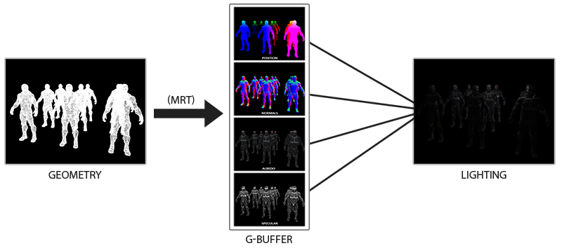

## 波克城市

### 协程是否共享堆栈

* 进程拥有自己独立的堆和栈，既不共享堆，亦不共享栈，进程由操作系统调度
* 线程拥有自己独立的栈和共享的堆，共享堆，不共享栈，线程亦由操作系统调度（标准线程是的）
* **协程和线程**一样共享堆，不共享栈，协程由程序员在协程的代码里显示调度

### 透明物体位于 Unity 哪个渲染阶段

### 已知法向纹理，如何还原法线向量

### 如何计算 MipMap 个数

### 描述 Blooming 方法

### 如何解决 AssetBundle 依赖

## B 站

### 图集是怎样生成的

### 资源加载

#### Unity `AssetDatabase`和`Resources`资源管理

Unity 常用的资源大概有以下几类：

* 纯资源（material，texture，shader，audio，...）这些资源不能直接拖到场景里使用
* 预置（prefab），这种资源需要实例化之后才能使用
* scene 也是一种资源
* 脚本对象，文本文件，unity 自己内置的资源（像新建粒子时的默认材质之类的）

Unity 管理这些资源分为两种：

* 在编辑器内管理，使用`AssetDatabase`加载卸载资源
  * 在编辑器内加载卸载资源，并不能在游戏发布时使用，它只能在编辑器内使用。但是，它加载速度快，效率高，适合在测试时使用
* 运行时管理，简单化使用`Resources`，复杂化使用 AssetBundle
  * 在运行时管理资源，简单的方法就是使用`Resources`接口。这种方式控制资源的管理效率高，资源需要放在 Resources 文件夹下。这就说明 Unity 在打包时只会打包 Resources 文件夹下的资源到终端上。 加载这个文件夹下的资源不需要扩展名。最好不要建立多个 Resources 文件夹，否则 Unity 可能会不知道要加载哪一个

## 叠纸一面

### C# 调用 Lua GC 是如何产生的，如何避免 GC

### UGUI 自适应大小

### 如何避免装箱拆箱

### Lua 元表是什么

原表是 Lua 中元表（Metatable）的一种特殊类型。元表是一种可选的附加到表上的表，用于控制表的行为。当我们进行特定的操作时，例如访问表中不存在的键、进行算术运算或比较等，Lua 会在元表中查找相应的元方法并执行相关的操作。

元表通过定义元方法来定义特定操作的行为。元方法是一组预定义的函数，以特定的键存储在元表中。当执行相关操作时，Lua 会检查元表中是否存在对应的元方法，并根据元方法的定义来处理操作。

以下是一些常见的元方法及其对应的操作：

- `__index`：该元方法用于处理当访问表中不存在的键时的行为。当 Lua 无法在表中找到对应的键时，它会查找元表中的__index 元方法。如果存在，Lua 会调用该元方法，并将表和被访问的键作为参数传递给它。该元方法可以返回一个值来作为访问的结果，或者可以是一个函数，以便进行进一步的操作。
- `__newindex`：该元方法用于处理当对表中不存在的键进行赋值时的行为。当 Lua 无法在表中找到对应的键时，它会查找元表中的__newindex 元方法。如果存在，Lua 会调用该元方法，并将表、被赋值的键和赋予的值作为参数传递给它。我们可以在该元方法中自定义处理逻辑，例如捕获赋值操作并执行自定义的操作或者抛出错误。
- `__add`、`__sub`、`__mul`、`__div`等：这些元方法用于重载表的算术运算符。当进行相应的算术运算时，Lua 会查找元表中对应的元方法，并根据元方法的定义来执行自定义的操作。我们可以在这些元方法中实现自定义的算术运算逻辑。
- `__eq`、`__lt`、`__le`：这些元方法用于重载表的比较运算符。当进行相应的比较操作时，Lua 会查找元表中对应的元方法，并根据元方法的定义来执行自定义的比较逻辑。我们可以在这些元方法中实现自定义的比较逻辑。
要将元表关联到表上，我们使用 setmetatable 函数。通过将表作为第一个参数，元表作为第二个参数传递给 setmetatable 函数，即可将元表关联到表上。

原表的应用非常广泛，可以用于实现面向对象的特性，例如继承、多态等。我们可以通过定义元方法来自定义对象的行为，同时还可以通过原表来实现一些高级功能，如代理（Proxy）、属性访问、事件触发等。通过定义适当的元方法，我们可以拦截和重定义对表的操作，从而实现各种定制化的行为。

以下是一个更具专业性的示例，演示了如何使用原表来实现代理模式：

```lua
-- 原始对象
local realObject = {
  value = 42,
  getName = function(self)
    return "Real Object"
  end
}

-- 代理对象
local proxyObject = {
  value = 0,
  getName = function(self)
    return "Proxy Object"
  end
}

-- 定义代理的元表
local proxyMetatable = {
  __index = function(table, key)
    -- 当访问值时，代理返回代理对象的值
    if key == "value" then
      return table.value
    end
    -- 当调用方法时，代理返回原始对象的方法
    if key == "getName" then
      return realObject.getName
    end
  end,
  __newindex = function(table, key, value)
    -- 代理只允许修改代理对象的值，而不影响原始对象
    if key == "value" then
      table.value = value
    end
  end
}
```

### TimeLine 和 Animator

Animator 是组件，而 Timeline 是资产

Animator 这个组件，是用来实现“使用某种动画数据来驱动所在 GameObject 及其子物体的各种参数随时间推移而发生变化”这一功能的。比如：Animator 告诉 Transform 组件将 position 和 rotation 设置到某一个数值，而这个数值的来源就是我们的动画片段（Animation clip，也就是。anim 文件资产）

但 Animator 这个组件并不直接读取。anim 资产的数据，而是通过 Animator Controller 资产来间接获取。Animator Controller 是一个状态机，可以设置一系列参数来控制多个多个动画片段之间的融合过渡。有了 Animator Controller 的参与，Animator 组件就不需要直接控制很多很多的动画片段了（特别特别麻烦），只需要控制相应的“参数”就可以达到控制很多动画片段之间的融合过渡的目的

Animator Controller 是用来整合。anim 数据的资产，Timeline 一定程度上也是。Timeline 的 Animation Track 做到事情，就是将多个动画片段按时间顺序连接起来（你可以把 Timeline 理解成一个非线性动画编辑器），这样我们就不需要手动控制这些动画片段的播放时间，只需要在需要的时候播放 Timeline 即可。当然，使用 Animator Controller 也能达到类似的目的，比如将多个片段“串起来”，但 Timeline 的整合显然更直观更好用

### Animator 如何解决帧数冲突

### Lua 插入哈希表还是数组

### `readonly`和`const`区别

- `const`修饰符
  - 初始化时机：编译时，即编译程序时将值已经嵌入代码中；
  - 值状态：不允许动态修改
  - 修饰范围：字段、局部变量
  - 主要应用场景：主要应用于程序运行中不需要改变的变量的值，比如数学符号 PI；
- `static`修饰符
  - 初始化时机：运行时，可以声明时赋值，也可以在构造函数，或使用时赋值
  - 值状态：允许修改
  - 修饰范围：类、字段、属性、方法、运算符、事件、构造函数（不能用于索引器、析构函数或类以外的类型）
  - 主要应用场景：主要作用于类的公共属性
- `readonly`修饰符
  - 初始化时机：运行时，可以声明时赋值或在类中的构造函数中赋值
  - 值状态：允许修改，但只能在构造函数中修改
  - 修饰范围：字段
  - 主要应用场景：主要作用于实例化的对象的只读属性
- `static readonly`修饰符
  - 初始化时机：运行时，是两个关键字的组合
  - 值状态：允许修改，声明时赋值或者静态构造函数中赋值
  - 修饰范围：字段
  - 主要应用场景：
    - 和`const`相比，它主要应用于引用性变量；而`const`，只能用于`string`类型的引用性变量；
    - 类的只读公共属性
总结：
- `const`是静态的、编译期变量，只能在声明变量的时候赋值。
- `readonly`是运行时变量，可以在声明的时候或在构造函数内赋值。
- `static readonly`变量就变成了静态的、编译期变量。只能静态构造函数中进行初始化。
- 同时`static readonly`可以理解为是最简单的一种单例模式实现方式。
- `const`是静态常量，`readonly`是动态常量。`const`高效，`readonly`灵活！但实际开发中我们经常用`static readonly`来代替`const`, 以平衡`const`在灵活性上的不足

## 叠纸二面

### Used Total 和 Reserved Total

在 Profiler 工具中提供了两种模式供我们监测内存的使用情况，即简易模式和详细模式。在简易模式中，我们可以看到总的内存（total）列出了两列，即 Used Total（使用总内存）和 Reserved Total（预定总内存）。Used Total 和 Reserved 均是物理内存，其中 Reserved 是 unity 向系统申请的总内存，Unity 底层为了不经常向系统申请开辟内存，开启了较大一块内存作为缓存，即所谓的 Reserved 内存，而运行时，unity 所使用的内存首先是向 Reserved 中来申请内存，当不使用时也是先向 Reserved 中释放内存，从而来保证游戏运行的流畅性。一般来说，Used Total 越大，则 Reserved Total 越大，而当 Used Total 降下去后，Reserved Total 也是会随之下降的（但并不一定与 Used Total 同步）

### 如何实现历史记录

### `EditorWindow`生命周期

<center>
    
</center>

### `Animation Clip`数据结构

### 协程的原理

#### `yield`和`IEnumerator`什么关系

`yield`是 C#的关键字，其实就是快速定义迭代器的语法糖。只要是`yield`出现在其中的方法就会被编译器自动编译成一个迭代器，对于这样的函数可以称之为迭代器函数。迭代器函数的返回值就是自动生成的迭代器类的一个对象

试试想象如果没有`yield`关键字，我们每定义一个迭代器，就要创建一个类，实现`IEnumerator`接口，接口包含的属性与方法都要正确的实现，是不是很麻烦？而利用`yield`关键字，只需要下面简单的几行代码，就可以快速定义一个迭代器。诸如迭代器类的创建，`IEnumerator`接口的实现工作编译器通通帮你做了

```C#
// 由迭代器函数定义的迭代器
IEnumerator Test()
{
    yield return 1;
    Debug.Log("Surprise");
    yield return 3;
    yield break;
    yield return 4;
}

```

#### Unity 协程机制的实现原理

协程是一种比线程更轻量级的存在，协程可完全由用户程序控制调度。协程可以通过`yield`方式进行调度转移执行权，调度时要能够保存上下文，在调度回来的时候要能够恢复。这是不是和上面“停住”代码然后又原位恢复的执行效果很像？没错，Unity 实现协程的原理，就是通过`yield return`生成的`IEnumerator`再配合控制何时触发`MoveNext`来实现了执行权的调度

具体而言，Unity 每通过`MonoBehaviour.StartCoroutine`启动一个协程，就会获得一个`IEnumerator`（`StartCoroutine`的参数就是`IEnumerator`，参数是方法名的重载版本也会通过反射拿到该方法对应的`IEnumerator`）。并在它的游戏循环中，根据条件判断是否要执行`MoveNext`方法。而这个条件就是根据`IEnumerator`的`Current`属性获得的，即`yield return`返回的值。

在启动一个协程时，Unity 会先调用得到的`IEnumerator`的`MoveNext`一次，以拿到`IEnumerator`的`Current`值。所以每启动一个协程，协程函数会立即执行到第一个 yield return 处然后“停住”。

对于不同的`Current`类型（一般是`YieldInstruction`的子类），Unity 已做好了一些默认处理，比如：

- 如果`Current`是`null`，就相当于什么也不做。在下一次游戏循环中，就会调用`MoveNext`。所以`yield return null`就起到了等待一帧的作用
- 如果`Current`是`WaitForSeconds`类型，Unity 会获取它的等待时间，每次游戏循环中都会判断时间是否到了，只有时间到了才会调用`MoveNext`。所以`yield return WaitForSeconds`就起到了等待指定时间的作用
- 如果`Current`是`UnityWebRequestAsyncOperation`类型，它是`AsyncOperation`的子类，而`AsyncOperation`有`isDone`属性，表示操作是否完成，只有`isDone`为`true`时，Unity 才会调用 M`oveNext`。对于`UnityWebRequestAsyncOperation`而言，只有请求完成了，才会将`isDone`属性设置为`true`。

也因此我们才可以使用下面的同步代码，完成本来是异步的网络请求操作。

```C#
using(UnityWebRequest webRequest = UnityWebRequest.Get("https://www.cnblogs.com/iwiniwin/p/13705456.html"))
{
    yield return webRequest.SendWebRequest();
    if(webRequest.isNetworkError)
    {
        Debug.Log("Error " + webRequest.error);
    }
    else
    {
        Debug.Log("Received " + webRequest.downloadHandler.text);
    }
}
```

#### Lua 协程

Lua 协程的相关函数封装在 coroutine 中，对应的 C API 为`lua_newthread`，`lua_resume`等。Lua 文档中的 thread 和 coroutine 是一个概念，但与操作系统的线程是两个东西。C API 通过`lua_State`维护一个协程的状态（以及 Lua 虚拟机状态的引用），协程的状态主要指协程上下文（如交互栈），Lua 虚拟机状态是全局的，可被多个协程共享

当调用`lua_newstate`时，实际上分为两步

* 创建并初始化一个 Lua 虚拟机`global_State`
* 创建一个主协程运行于虚拟机中，并返回主协程的执行上下文 LuaState

调用`lua_newthread`时，将在已有 Lua 虚拟机上，创建另一个协程执行环境，该协程与已有协程共享虚拟机状态（同一个 Lua 虚拟机中的不同协程共享`global_State`)，并返回新的执行上下文。因此将 LuaState 理解为协程执行上下文可能更合适，LuaState 本身也是一个类型为 thread 的 GCObject，无需手动释放

## 游卡

### LoopScrollView

### UI 框架

### 表格加载

## 莉莉丝

### C# 字符串优化

* 使用`string.Empty`给一个空字符串变量赋初始值，`String.Empty`是一个指代，而`""`是具体的实现
* 使用`str.Length == 0`做空串比较
* 避免不必要的字符串`ToUpper`、`ToLower`类操作
  * `ToUpper`、`ToLower`这类方法均会重新生成字符串对
  * `String.Compare`可实现忽略字符串大小写
  
  ```c#
  //不推荐的写法
  if(s1.ToUpper() == s2.ToUpper())
  //推荐的写法
  if(String.Compare(s1, s2, true) == 0)
  ```

* 用`StringBuilder`进行字符串拼接操作
* 创建`StringBuilder`应指定初始大小
* 避免滥用`StringBuilder`
  * 类似`str1 + str2 + str3 + str4`的字符串拼接操作会被编译为`String.Concat(str1, str2, str3, str4)`，效率反而高于`StringBuilder`。`String.Concat`会一次性确定字符串长度，`StringBuilder`需要做`Resize`，适用于多次生成`string`对象的情况
* 通过直接设置`.Length = 0`来初始化`StringBuilder`
* 不要使用`.Length = 0`来释放`StringBuilder`占用的内存

### 图片压缩

#### 术语

* **内存**：例如`A8R8G8B8`格式中一个像素占 4 字节，如果是 512x512 分辨率内存就占用`512 * 512 * 4B = 1048576B = 1MB`，这种内存消耗在低端设备上根本无法接受
* **带宽**：在渲染 3D 场景时，会有大量的贴图被传输到 GPU，若不限制，总线带宽很快就会成为瓶颈
* **有损**：表示对于渲染来说，有损压缩是可以接受的，一般选择压缩格式时需要在纹理质量和文件大小上寻求一个平衡
* **固定速率压缩**：因为 GPU 需要能够高效的随机访问一个像素，这意味着对任意像素，解码速度不该有太大的变化。因此，见的贴图压缩算法都是固定速率压缩。相反的例如 zip 则是一种可变速率压缩
* **向量量化（Vector Quantization，VQ）**：此技术原用于资料压缩，透过分割大数量的资料点（函数），让每个小群集都有相同的资料点，而这些小群集的所有资料就由其正中央的点作为代表
* **编码和解码速度**：一般来说编码速度慢没关系，因为通常纹理压缩只需要在游戏打包时进行一次，对于用户运行时体验完全没有影响。但解码速度必须足够快，而且基本上不能影响到渲染性能
* **压缩比**：通常以比特率或每像素的平均比特数（bits per pixel，bpp）表示，常见的为 2~8bpp。一般 RGB 原生纹理的像素指 24 位，4bpp 表示每像素占 4 位，所以也可以认为 4bpp 表示压缩比为 6:1

#### ETC

##### 基本思想

将图片分成 4x4 的若干个像素块，每个像素块按照一定规则编码成为一个 64 位 (8 字节）的数据，大概的想法是计算像素块的平均颜色，然后记录这个平均颜色和每个像素相对平均颜色的差值，平均颜色只耗费了一个像素的数据，而差值也并不记录完全真实的差值，而是从一个固定的静态数据中找到最接近的差值（RGB 三个通道差值一样），每个像素只需要记录其差值在静态数据中的索引即可

* 压缩比：对于 RGB24 图片，每个块的数据由 4x4x3 = 48 字节，压缩为 8 字节，压缩比为 6:1，针对 Alpha 图片，由 4x4x1 = 16 字节 压缩为 8 字节，所以，对于普通的 RGBA 分离为 RGB24 和 Alpha 之后分别进行 ETC1 压缩的图片，整体压缩比为 (48 + 16) : (8 + 8) = 4:1
* 文件头数据：除了编码后的数据块之外，还会存储一部分文件头数据，用来表示文件的特征码、宽高等

##### 像素块编码思想

* 将 4x4 的像素块分为两个 4x2 的子块，有水平和竖直两种分法。使用 1 位数据 flipbit 来表示是哪一种分法，还剩下 63 位数据

<center>
    
</center>

* 分别计算两个分块中 8 个像素颜色的平均值，根据两个块颜色平均值的差值，确定使用 individual 模式还是 differential 模式。使用 1 位数据 diffbit 来表示是哪种模式，还剩下 62 位数据
* 存放两个子块的平均颜色信息，individual 模式用 R4G4B4 的格式分别表示两个子块的平均颜色，differential 模式使用 R5G5B5 格式表示第一个子块的平均颜色，R3G3B3 格式表示第二个子块与第一个子块平均颜色的差值。这里使用了 8 * 3 = 24 位数据，还剩下 62 - 24 = 38 位数据
* 所有的图片共享一个全局的映射表数据，这个数据是固定的全局静态数据，并不会进入到编码数据中，这个表是一个 8 x 4 的二维数组，使用 3 位数表示第一个子块在映射表中查询的第一维索引，需要 3 位来表示 0 - 7 的下标，第二个子块同样需要 3 位数来表示，还剩下 38 - 3 * 2 = 32 位数据
* 4 x 4 像素块中的每个像素，使用 2 位数来表示该像素在映射表中查询的第二维索引，需要 2 位数来表示 0 - 3 的下标，所以消耗了 4 x 4 x 2 = 32 位数据

##### 内存布局和解码过程

以 RGB555 基本色和 RGB3333 颜色差表示的编码为例，每个 4x4 像素块经过 ETC1 编码后的 64 位数据的内存布局大概是这样

<center>
    
</center>

假如编码前像素块表示为下图，需要得到图中编号 2 对应像素的颜色，需要进行如下的解码步骤：

<center>
    
</center>

* 获取目标所在的子块：根据第 32 位 flipbit 标志位，知道这个像素块采用的是横版划分子块，2 号像素处在子块 2 中
* 获取子块 1 基本颜色：首先根据第 33 位 diffbit 标志位得知，这里采用的是 R5G5B5 基本色 + R3G3B3 差值的方式。分别从 59-63 位 (11100)、51-55 位 (00100) 和 43-47 位 (00011) 读取子块 1 基本色 RGB1=(11100, 00100, 00011) = (28, 4, 3)
* 获取子块 2 的颜色差值：这里是 differential 模式，所以需要读取子块 2 的颜色差值，从 56-58 位 (100)、48-50 位 (010) 和 40-42 位 (000) 获得颜色差值 RGB_offset=(100, 010, 000) = (-4, 2, 0)，注意这里的 3 位数据中最高位是符号位，所以差值部分的取值范围是 [-4, 3]
* 计算子块 2 的基本色：将子块 1 基本色和子块 2 差值相加，得到子块 2 的基本色，RGB2=RGB1 + RGB_offset = (28 - 4, 4+2, 3+0) = (24, 6, 3)，转为 5 位二进制表示为 RGB2=(11000, 00110, 00011)
* 扩展子块 2 基本色分量为 8 位：对 5 位标识的基本色补位为 8 位表示，得到 RGB1 = (11000110, 00110110, 00011011) = (198, 54, 27)，这就是子块 2 的基本色
  > 补位规则：
  > * individual 模式，直接将 4 位数复制到尾部，得到 8 位
  > * differential 模式，将 5 位中的高 3 位复制到尾部，得到 8 位
  > * differential 模式，一定是将子块 1 基本色和子块 2 偏移值相加后再进行补位
* 获得目标像素的颜色偏移值：目标像素下标为 2，在编码数据的第 2 位得到映射表的下标的低位 (lsb) 为 1，第 18 位得到映射表的下标高位 (msb) 为 1，假如使用如下的映射表，则可以得到映射表下标为`(lsb, msb) = (1, 1)`，对应下标为`-b`

<center>
    
</center>

  上面知道目标像素位于子块 2，这里还需要从编码数据的 34-36 获得子块 2 的修正表索引，得到索引为`(1, 1, 0) = 6`，根据上面的映射表，根据下标`(6, -b)`可以索引到像素的颜色差值为-106

* 计算目标像素的最终颜色值：这里 RGB 三个分量的差值相同，目标像素最终的颜色值为子块 2 的基本颜色 + 目标像素的颜色偏移值：
`RGB_target = RGB2 + (-106, -106, -106) = (198 - 106, 54 - 106, 27 - 106)`，修正后得到目标颜色值`RGB_target = (92, 204, 177)`

##### 编码过程

* 将图划分为 4x4 的像素块，如果不够 4x4，则将这些像素填充在 4x4 块的左上角
* 针对每个 4x4 的像素块尝试以下编码，取解码后和原像素差值最小的那种编码作为结果
  1. 确定`flipbit`，并计算两个子块的平均颜色值，这里我猜测是先将 8 个像素的`R8G8B8`取均值得到像素的平均值，然后将每个分量的后三位直接抛弃，得到`R5G5B5`
  2. 根据两个子块颜色值的差值，确定`diffbit`，根据上面得到的两个子块的`R5G5B5`，计算差值，如果差值在`[-4, 3]`之间，说明差值可以用 3 位带符号的二进制数表示，可以用`differential`模式，否则用`individual`模式
  3. 枚举不同的子块索引，确定每个子块使用映射表中的哪一组偏移值
  4. 枚举每个像素的映射下标，确定像素使用映射表中的哪一个偏移值
  5. 针对第 3 步和第 4 步的枚举，可以得到很多组不同的编码，将编码结果解压后和原始像素数据对比，取相差最小的一组编码作为最终结果
* 将图片中各个像素块编码合并

##### Unity 的几种 ETC 纹理压缩格式

* RGB ETC1 4 bit：4 bits/pixel，对 RGB 压缩比 6:1，不支持 Alpha，绝大部分安卓设备都支持
* RGB ETC2 4 bit：4 bits/pixel，对 RGB 压缩比 6:1。不支持 Alpha，ETC2 兼容 ETC1，压缩质量可能更高，但对于色度变化大的块误差也更大，需要在 OpenGL ES 3.0 和 OpenGL 4.3 以上版本
* RGBA ETC2 8bit：8 bits/pixel，对 RGBA 压缩比 4:1。支持完全的透明通道，版本要求同上
* RGB +1bit Alpha ETC2 4bit：4 bits/pixel。支持 1bit 的 Alpha 通道，也就是只支持镂空图，图片只有透明和不透明部分，没有中间的透明度

#### DXT

DXT 是一种有损纹理压缩算法，微软的 Direct 中支持，DXT 的格式包括 DXT1~DXT5，其中 DXT1 和 DXT5 较为多见

<center>
    
</center>

DXT 算法非常容易理解，而且整体看上去效果不错，但如果对局部特写，会发现在细节上会有很多丢失，这也是算法本身导致的，毕竟每个块只有两个颜色，而其他颜色都是在这两个颜色区间的差值，如果当前区域内还有其他显著颜色则必然会有丢失

这种信息的丢失主要集中在比较细的边界中，但 DXT1 在压缩率上是 RGB 的 6 倍，这种问题可以通过提高纹理分辨率的方式来解决，高宽放大 41%(`1.41 * 1.41 = 1.9881`)，这样整个纹理是以前的 2 倍，但压缩率还能保持为 3 倍，也是可以接受的。在 DXT 中还有一个主要的损失，就是 RGB 的 24 位转为了 16 位颜色，16 位中 R&B 各占 5 位，但是 G 占了 6 位，这是因为人眼对绿色最为敏感

<center>
    
</center>

另外一个问题就是 DXT3 和 DXT5 之间的对比，相比 DXT1 不支持透明度（但支持是否透明），DXT5 要大一倍（多了 64bit），和之前颜色保存方案一样对透明度也保存了两个 16 位的颜色和对应的调色板，对 RGBA 的效果也得到了保证，但 DXT3 思路不一样，它是对每一个像素保存了 4bit 的透明度，同样也是多了 64bit，但此时毕竟只有 16 个透明度选项，相比 DXT5，在压缩率上相当，但对透明色的处理不够细腻，因此在实用性上并不推荐 DXT3

#### PVRTC

PVRTC 不同于 DXT 和 ETC 这类基于块的算法，而将整张纹理分为了高频信号和低频信号，低频信号由两张低分辨率的图像 A 和 B 表示，这两张图在两个维度上都缩小了 4 倍，高频信号则是全分辨率但低精度的调制图像 M，M 记录了每个像素混合的权重。要解码时，A 和 B 图像经过双线性插值（Bilinearly）宽高放大 4 倍，然后与 M 图上的权重进行混合

<center>
    
</center>

PVRTC 4-bpp 模式下，每 4x4 像素占一个 64 位数据块，2-bpp 模式下每 8x4 像素会有一个 64 位数据块。4-bpp 模式下，A 图和 B 图缩小后都只保存一个颜色值，如下图所示，Color A 比 Color B 少 1 位，但两张图都可以选择以 RGB 或 ARGB 的方式存储（最高位决定为哪种），Color A 可以用 RGB554 或 ARGB3443 格式编码，Color B 可以用 RGB555 或 ARGB3444 格式编码

<center>
    
</center>

在解码时，为了解码任意像素，必须读取 4 个相邻的 PVRTC 块，使用这 4 个块来解码一个 5x5 块

<center>
    
</center>

使用双线性过滤来对 A 和 B 图进行扩大，然后 A 和 B 图根据 M 图与`Mode`位进行混合，这里的`Mode`位为 1 时，M 图中 10 值像素被看作是开启了 punch-through alpha，Alpha 通道会被强制清零，是为了兼容旧应用程序

<center>
    
</center>

#### ASTC

以下每个用例都对压缩方案有自己的要求：

* 支持从 1 到 4 个分量的纹理。虽然单通道纹理也可以使用 BC7、PVRTC2 或 ETC2 来存储，但空通道上大量 bit 被浪费掉了。
* 在通道之间数据无相关性的情况下，拥有可以接受的质量。这对于法线图和 RGBA 图像来说非常重要。
* 支持 LDR 和 HDR。BC6H 可用于 HDR 纹理压缩，但它不支持 alpha 通道。
* 跨平台。特别是：PVRTC 只在 iOS 平台上可用，BC6H/BC7 在移动设备中缺失，ETC 不被桌面级 GPU 所支持。对于跨平台应用程序的开发者来说，有诸多不便。
比特率/质量比的灵活性。根据纹理类型，不同程度的压缩伪影是可以接受的，因为不同图像的可压缩性是不同的。前文中提到的格式里，能提供的比特率/质量选项的不超过两个 (BC1/BC7 或 PVRTC 4bpp/2bpp) 。如果不能使用 5bpp 的压缩级别 （如果 4bpp 的质量略显不足） ，就必须使用 8bpp 的选项。带宽增加了一倍，但质量却没有明显改善。
* 支持 2D 和 3D 纹理。

概念上讲，ASTC 类似于 S3TC/BC7：一个压缩块中最多存储四个端点对和插值权重，只支持预定义的分区，特定的分区由分区 ID 指定，也存储在一个块中。在弱相关的情况下，该通道会存储一个独立的索引表。每个独立的编码被称为一个平面。或许 ASTC 最主要、最有趣的创新是用小数位编码整数值的技术，称为 BISE。同时，BISE 可以在硬件中有效实现

##### 有界整数序列编码 (Bounded Integer Sequence Encoding, BISE)

有界整数序列编码，或称 BISE，解决了如下抽象问题：从大小为$N$的字母表中给定等概率的符号序列， 找到一种编码，使得能够在常数时间复杂度内使用最少的硬件消耗提取第$i$个符号，并允许相同硬件设计能够用于多种不同大小的字母表，同时具备存储效率

例如，考虑一个由 5 个整数组成的序列，其中每个整数可以是 0，1 或 2（译者注：5 位的 3 进制数）。使用标准二进制编码时，需要为每个值分配 2 位，总共 10 位。但不同序列的数量是$3^5 = 243$，小于$2^8 = 256$。因此，可以用 8 比特对整个序列进行编码，每个值的比特率为 1.6。换句话说，可以用 8 比特来表示 5 位的 3 进制数

现在，考虑任意长度的序列，其中每个值都属于范围$[0, N - 1]$，其中$N = 3 \times 2^n$。每个值都可以用一个三进制位和$n$个比特来表示。假设$N = 12$，那么满足该条件的任何值都可以用以下形式表示：$X = t2^2 + b_1{2^1} + b_0{2^0}$，其中$t$是一个三进制位，$b_1$和$b_0$是比特位。整个序列可以被划分为五组值，最后一组会在必要时填充$0$。二进制形式下，一个特定的组可以表示为一个比特串$t_4B_4t_3B_3t_2B_2t_1B_1t_0B_0$，其中$t_i$是一个三进制位的$2$比特表示，$B_i$是一个值的剩余比特位（译注：即上文中的$b_1$和$b_0$)。只要三进制位与比特信息保持这种相关性，就可以用比特串$T_{[7]}B_4T_{[6:5]}B_3T_{[4]}B_2T_{[3:2]}B_1T_{[1:0]}B_0$保存这五组值。其中$T_{[i:j]}$为$T$的各个比特，这段数据要比原先短$2$比特

事实证明，这种编码能够保留尾部的零。例如，如果我们序列中的最后一组被填充了两个零 （所以$t_4B_4$和$t_3B_3$是零） ，那么$T_{[7]}B_4$和$T_{[6:5]}B_3$是零，它们不需要被存储。因此，任何长度的序列，假如其数值范围从$0$到$3 \times 2^n - 1$，都可以用接近于理论上的最小的比特率进行编码。同时，其中的任意值能以最小的硬件消耗容易的提取出来

同样的推理也可以应用于$N = 5 \times 2^n$的序列。这里，$3$个五进制数 （基数为$5$的数字） 可以用$7$位来编码，因为$5^3 = 125$小于$2^7 = 128$。因此，使用三进制数和五进制数的 BISE 技术在存储方面都是是有效率的 

<center>
    
</center>

##### 其他改进

ASTC 还改进了分区模式。BC6H 和 BC7 压缩方案也使用了预定义的分区集表，但这种方法不适合 ASTC，因为它支持大量的瓦片尺寸，支持更多的区域，还增加了分区 ID 字段的大小 (10 位，而 BC7 是 6 位） 。ASTC 的分区模式是用一个特殊的哈希函数生成的，它为每个纹素分配一个分区索引。这个函数将纹素在瓦片中的位置、分区 ID、瓦片大小和分区数量作为输入，并输出一个分区索引。该函数很简单，可以用硬件实现。该函数也用于 3D 纹理。图中描述了 8x8 瓦片的所有分区模式

<center>
    
</center>

ASTC 的一个更显著的特点是内插权重的编码方式。S3TC 系列方案使用每个顶点的索引来设置插值权重。根据块的类型，索引的大小可以是 2、3 或 4 比特。然而，对于 12x12 瓦片来说，即使每个像素使用 1bit 的索引，也无法存储在一个 128 位块。因此，ASTC 为权重和纹素提供独立的网格大小。例如，对于 12x12 的瓦片，只能存储 4x6 的权重网格。在解码阶段，权重网格被双线性地放大到瓦片大小。不过虽然看起来像，但是它和简单的瓦片缩放并不一样。例如，平滑的梯度通常可以用一个小的权重网格来表示，如 2x2。因此有更多的比特可用于端点。同时尖锐的边缘和颜色过渡可以用适合的分区模式进行编码。权重网格的大小是根据每个块来选择的。因此某些具有强烈垂直特征的瓦片，可以用 4x2 或 8x4 的权重网格进行编码

所有这些配置数据 （网格大小、分区数量、端点格式） 都必须存储在一个压缩块中。虽然不得不牺牲一些颜色数据位，因而可能降低图像质量，但这种方法带来了很好的灵活性，并且大大增强了压缩质量。ASTC 允许在每个块中进行不同的比特权衡，任意瓦片都可以在分区、端点和权重之间的分布选用最合适的比特分布进行编码。事实证明，即使在较低的比特率下，ASTC 也能够提供比 PVRTC、BC1-BC5 和 ETC 更好的质量。PSNR （译注：峰值信噪比） 增益平均为 1.5dB 至 2dB，大多数观察者 （译注：推测此处数值为 ASTC 对比其他压缩格式获得的增益 ) 大约能察觉 0.25dB 的增益。BC6H 的质量与之相当，而 BC7 平均比 ASTC 多出 0.5dB。不过在 8bpp 时，ASTC 和 BC7 压缩图像的 PSNR 质量都在 45dB 左右，这种差异很难从视觉上发现

此外，ASTC 是第一个支持 3D 纹理的标准压缩方案，它利用了所有三个维度的颜色相关性。nVidia 的 OpenGL(26) 的 VTC 扩展也是针对 3D 纹理的，但它只是把一个 3D 瓦片分成 2D 片，使用 BC1 方案进行压缩。ASTC 则使用 3D 权重网格和分区，利用分区模式生成器来压缩整个 3D 瓦片。不过权重网格是用单线法而非三线插值法进行放大的 (67) 。整个 3D 瓦片的压缩比分片压缩的 PSNR 高出 2dB

另外，ASTC 的所有特征都是 “正交 “的，即任何特征都可以独立使用，例如可以用两个弱相关的 HDR 通道来压缩一个三维纹理

### ASTC 块

首先是一些全局解码参数，这些参数对任何特定的纹理都是一样的。因此，没有必要在压缩块中存储这些

* 动态范围 (LDR/HDR)
* 纹理尺寸 (2D/3D)
* 瓦片尺寸
* 输出色彩空间 (sRGB/RGB)

而每块指定的数据如下

* 权重网格大小
* 权重范围 （用于 BISE 解码）
* 权重值
* 分区的数量
* 分区模式 ID
* 颜色端点模式
* 颜色端点数据
* 平面的数量 (1 或 2)
* 平面到通道的分配

纹理可以被编码为单通道、双通道、三通道或四通道图像。但解码后的值总是以 RGBA 格式输出。在 LDR sRGB 模式下，颜色值以 8 位整数返回，否则以 16 位浮点数返回。图 40 展示了 ASTC 块的布局

<center>
    
</center>

除了 BlockMode 和 Part 字段，所有字段的长度都是可变的。

Part 字段指定了分区的数量 （减一） 。在双平面模式下，分区的数量必须是 1、2 或 3。BlockMode 字段指定了平面数、权重范围和权重网格的大小。ConfigData 和 MoreConfigData 字段指定每个端点对的端点模式。

如果是 2D 瓦片，BlockMode 由 5 个字段组成。A、B、R、D、H。 特殊的 void-exten 模式有一个单独的编码，用于单色瓦片。void-exten 块还允许识别附近的单色区域。可以缩短获取相同的块的过程，并进一步减少内存带宽占用

<center>
    
</center>

A、B 字段分别指定权重网格的宽度 (N) 和高度 (M) 。D 位 （双倍） 被设置为表示双平面模式。R 字段 （范围） 和 H 位 （高精度） 指定重量范围 （见表 14) 。注意，由于 R 字段的编码，为了避免产生歧义，位$R_1$和$R_2$不能同时为零

<center>
    
</center>

ConfigData 和 MoreConfigData 指定了端点对的编码，每个端点对都可以有独立的编码模式。共有 16 种编码模式：10 种 LDR 格式和 6 种 HDR 格式。然而，HDR 纹理可以使用其中任何一种。所有这些端点格式都是基于以下基本方法之一：

* 独立性。两个 k 位的值直接存储。
* `base + offset`（类似于 ETC 的差分编码） 。第一个值为 base, 用 (k+1) 位存储。第二个值为 offset, 用 (k-1) 位存储。
* `base + scale`。两个 RGB 值由四个数值`(R、G、B、s)`表示。颜色一等于`(R，G，B)`，颜色二等于`(sR，sG，sB)`

从概念上讲，ASTC 块的解码是这样进行的。BlockMode 字段用于确定权重范围和权重网格的大小。权重数据从压缩块的尾部读取，并使用 BISE 进行解包。之后，权重被反量化为 [0, 64] 范围。如果权重网格的尺寸小于瓦片的尺寸，则使用双线性插值进行升格。

之后，Part 字段用于指定分区的数值。分区模式 ID 从块中读出，然后针对每个纹素生成哈希作为分区索引。给定分区数量，还可以利用 ConfigData 和 MoreConfigData 字段计算标量的总值，该值会被用于端点编码 （端点可以有不同数量的通道，不同的端点存储模式下会使用不同数量的值） 。然而，这些标量值的范围在 BISE 解码时必须是已知的，因为该范围并没有被明确指出。在权重和分区数据解码阶段之后，就可以知道可用于彩色端点数据的比特数。颜色端点的值会使用适用于上述比特数的最大范围的值来存储。端点被解压缩和反量化。端点对会根据分区索引来选择。端点的颜色则使用插值权重来混合

## 叠纸三面

### C#内存分配

C#开发三个重要的内存区域：托管堆内存、非托管堆内存和栈内存

<center>
    
</center>

#### 托管堆内存（Managed Heap Memory）

<center>
    
</center>

托管堆内存是由 .NET 运行时（CLR）自动管理的内存区域，用于存储对象实例和数组等引用类型数据。在堆上分配的内存会通过垃圾回收器（Garbage Collector）进行自动回收，对象的创建和销毁都是由垃圾回收器负责管理

#### 非托管堆内存（Unmanaged Heap Memory）

<center>
    
</center>

非托管堆内存是由本机代码或外部资源分配的内存区域，通常用于与非托管代码进行交互、进行底层的系统编程或使用特定的外部库。需要手动分配和释放内存，没有自动垃圾回收的机制，可以使用`Marshal` 类或`unsafe`上下文来进行非托管内存的操作

#### 栈内存（Stack Memory）

<center>
    
</center>

栈内存用于存储局部变量、方法调用和执行上下文等信息，存储的是值类型数据和引用类型数据的引用。栈内存的分配和释放是由编译器自动完成的，具有较高的效率，栈内存的作用域仅限于所属的代码块或方法

#### 优化技巧

##### 托管堆内存优化

* 使用对象池：避免频繁地创建和销毁对象，可以使用对象池来重复利用对象实例
* 减少装箱和拆箱：尽量使用泛型集合（如`List`）来避免值类型的装箱和拆箱操作
* 及时释放资源：手动释放不再使用的托管内存，如调用对象的`Dispose()`方法或使用`using`语句来确保及时释放资源

##### 非托管堆内存优化

* 尽量避免直接使用非托管内存：推荐优先使用托管内存，仅在必要时与非托管代码交互，并使用`Marshal`类的相关方法来管理非托管内存的分配和释放
* 避免内存泄漏：确保将非托管内存正确释放，避免内存泄漏问题

##### 栈内存优化

* 尽量使用局部变量：将数据存储在栈上的局部变量中，而不是使用类的实例变量。这样可以减少托管堆内存的压力，同时也提高访问速度
* 使用值类型：对于小型数据，考虑使用值类型而不是引用类型来减少内存开销和垃圾回收的成本

##### 其他优化技巧

* 避免使用过多的字符串拼接操作：频繁的字符串拼接可能会导致内存碎片和性能下降，尽量使用`StringBuilder`类来处理大量字符串拼接
* 缓存重复计算结果：如果有一些计算结果会被重复使用，可以将结果缓存起来，避免重复计算和内存消耗
* 使用合适的数据结构：选择适当的数据结构和算法来优化内存和性能，如使用哈希表、集合等数据结构
* 使用性能分析工具：使用性能分析工具（如。NET Memory Profiler）来检测内存泄漏、高内存使用和潜在性能问题

### 堆和栈的访问速度

栈是机器系统提供的数据结构，计算机会在底层对栈提供支持：分配专门的寄存器存放栈的地址，压栈出栈都有专门的指令执行，这就决定了栈的效率比较高。堆则是 C/C++函数库提供的，它的机制是很复杂的，例如为了分配一块内存，库函数会按照一定的算法（具体的算法可以参考数据结构/操作系统）在堆内存中搜索可用的足够大小的空间，如果没有足够大小的空间（可能是由于内存碎片太多），就有可能调用系统功能去增加程序数据段的内存空间，这样就有机会分到足够大小的内存，然后进行返回。显然，堆的效率比栈要低得多

### 红点系统

## 米哈游一面

### Top K 问题

#### 小顶堆

可以通过构造一个前$k$个最大元素小顶堆来解决，小顶堆上的任意节点值都必须小于等于其左右子节点值，即堆顶是最小值。具体步骤如下：

* 从数组中取前$k$个数（$0$到$k - 1$位），构造一个小顶堆
* 从$k$位开始遍历数组，每一个数据都和小顶堆的堆顶元素进行比较，如果小于堆顶元素，则不做任何处理，继续遍历下一元素；如果大于堆顶元素，则将这个元素替换掉堆顶元素，然后再堆化成一个小顶堆。
* 遍历完成后，堆顶的数据就是第$k$大的数据

##### 代码实现

```rust
let findKthLargest = function(nums, k) {
    // 从 nums 中取出前 k 个数，构建一个小顶堆
    let heap = [,], i = 0
    while(i < k) {
       heap.push(nums[i++]) 
    }
    buildHeap(heap, k)
    
    // 从 k 位开始遍历数组
    for(let i = k; i < nums.length; i++) {
        if(heap[1] < nums[i]) {
            // 替换并堆化
            heap[1] = nums[i]
            heapify(heap, k, 1)
        }
    }
    
    // 返回堆顶元素
    return heap[1]
};

// 原地建堆，从后往前，自上而下式建小顶堆
let buildHeap = (arr, k) => {
    if(k === 1) return
    // 从最后一个非叶子节点开始，自上而下式堆化
    for(let i = Math.floor(k/2); i>=1 ; i--) {
        heapify(arr, k, i)
    }
}

// 堆化
let heapify = (arr, k, i) => {
    // 自上而下式堆化
    while(true) {
        let minIndex = i
        if(2*i <= k && arr[2*i] < arr[i]) {
            minIndex = 2*i
        }
        if(2*i+1 <= k && arr[2*i+1] < arr[minIndex]) {
            minIndex = 2*i+1
        }
        if(minIndex !== i) {
            swap(arr, i, minIndex)
            i = minIndex
        } else {
            break
        }
    }
}

// 交换
let swap = (arr, i , j) => {
    let temp = arr[i]
    arr[i] = arr[j]
    arr[j] = temp
}
```

#### 快速选择（Quick Select）算法

##### 快排

快排使用了分治策略的思想，所谓分治，顾名思义，就是分而治之，将一个复杂的问题，分成两个或多个相似的子问题，在把子问题分成更小的子问题，直到更小的子问题可以简单求解，求解子问题，则原问题的解则为子问题解的合并。

快排的过程简单的说只有三步：

* 首先从序列中选取一个数作为基准数
* 将比这个数大的数全部放到它的右边，把小于或者等于它的数全部放到它的左边 （一次快排`partition`）
* 然后分别对基准的左右两边重复以上的操作，直到数组完全排序

具体按以下步骤实现：

1. 创建两个指针分别指向数组的最左端以及最右端
2. 在数组中任意取出一个元素作为基准
3. 左指针开始向右移动，遇到比基准大的停止
4. 右指针开始向左移动，遇到比基准小的元素停止，交换左右指针所指向的元素
5. 重复 3，4，直到左指针超过右指针，此时，比基准小的值就都会放在基准的左边，比基准大的值会出现在基准的右边
6. 然后分别对基准的左右两边重复以上的操作，直到数组完全排序

###### 代码实现

```rust
let quickSort = (arr) => {
  quick(arr, 0 , arr.length - 1)
}

let quick = (arr, left, right) => {
  let index
  if(left < right) {
    // 划分数组
    index = partition(arr, left, right)
    if(left < index - 1) {
      quick(arr, left, index - 1)
    }
    if(index < right) {
      quick(arr, index, right)
    }
  }
}

// 一次快排
let partition = (arr, left, right) => {
  // 取中间项为基准
  var datum = arr[Math.floor(Math.random() * (right - left + 1)) + left],
      i = left,
      j = right
  // 开始调整
  while(i <= j) {
    
    // 左指针右移
    while(arr[i] < datum) {
      i++
    }
    
    // 右指针左移
    while(arr[j] > datum) {
      j--
    }
    
    // 交换
    if(i <= j) {
      swap(arr, i, j)
      i += 1
      j -= 1
    }
  }
  return i
}

// 交换
let swap = (arr, i , j) => {
    let temp = arr[i]
    arr[i] = arr[j]
    arr[j] = temp
}

// 测试
let arr = [1, 3, 2, 5, 4]
quickSort(arr)
console.log(arr) // [1, 2, 3, 4, 5]
// 第 2 个最大值
console.log(arr[arr.length - 2])  // 4
```

##### 快速选择

仅仅需要在每执行一次快排的时候，比较基准值位置是否在$n-k$位置上

* 如果小于$n-k$，则第$k$个最大值在基准值的右边，我们只需递归快排基准值右边的子序列即可；
* 如果大于$n-k$，则第$k$个最大值在基准值的做边，我们只需递归快排基准值左边的子序列即可；
* 如果等于$n-k$，则第$k$个最大值就是基准值

###### 代码实现

```rust
let findKthLargest = function(nums, k) {
    return quickSelect(nums, nums.length - k)
};

let quickSelect = (arr, k) => {
  return quick(arr, 0 , arr.length - 1, k)
}

let quick = (arr, left, right, k) => {
  let index
  if(left < right) {
    // 划分数组
    index = partition(arr, left, right)
    // Top k
    if(k === index) {
        return arr[index]
    } else if(k < index) {
        // Top k 在左边
        return quick(arr, left, index-1, k)
    } else {
        // Top k 在右边
        return quick(arr, index+1, right, k)
    }
  }
  return arr[left]
}

let partition = (arr, left, right) => {
  // 取中间项为基准
  var datum = arr[Math.floor(Math.random() * (right - left + 1)) + left],
      i = left,
      j = right
  // 开始调整
  while(i < j) {
    
    // 左指针右移
    while(arr[i] < datum) {
      i++
    }
    
    // 右指针左移
    while(arr[j] > datum) {
      j--
    }
    
    // 交换
    if(i < j) swap(arr, i, j)

    // 当数组中存在重复数据时，即都为 datum，但位置不同
    // 继续递增 i，防止死循环
    if(arr[i] === arr[j] && i !== j) {
        i++
    }
  }
  return i
}

// 交换
let swap = (arr, i , j) => {
    let temp = arr[i]
    arr[i] = arr[j]
    arr[j] = temp
}
```

### Rebatch 和 Rebuild 的作用

#### 术语

* **Canvas** 是 Unity 渲染系统给层状几何体 ( layered geometry ) 提供的可以被画入、被放在上面或者放在世界空间的底层 Unity 组件。Canvas 负责将它包含的几何体组合成 batch，生成合适的渲染命令发送给 Unity 图形系统。这个过程在底层的 C++代码中完成，这个过程被称为一次 rebatch 或者一次 batch build。当一个 Canvas 被标记为包含需要 rebatch 的几何体时，这个 Canvas 被认为是 dirty 的。
layered geometry , 由 Canvas Renderer 组件提供给 Canvas。Canvas 负责进行渲染，Canvas Renderer 负责采集/接收

* **动静隔离** 一个子 Canvas 仅仅是一个嵌套在父 Canvas 中的组件，子 Canvas 将它的子物体和它的父 Canvas 隔离，一个子 Canvas 下 dirty 的子物体不会触发父 Canvas 的 rebuild，反之亦然（这些在某些特殊情况下是不确定的，比如说改变父 Canvas 的大小导致子 Canvas 的大小改变）

* **Graphic** 是 UGUI 的 C#库提供的一个基类。它是 UGUI 所有类的基类，给所有的 UGUI 类提供可以画在 Canvas 系统上的几何图形。大多数 Unity 内置的继承 Graphic 的类都是通过继承一个叫 MaskableGraphic 的子类来实现，这使得他们可以通过 IMaskable 接口来被隐藏。Drawable 类的子类主要是 image 和 text，已经提供了同名的组件

* **Layout** 组件控制着 RectTransform 的大小和位置，经常被用于要生成具有相似的大小和位置关系内容的复杂布局。它只依靠 RectTransform，只影响与其相关的 RectTransform 的属性。这些 layout 组件不依赖于 Graphic 类，可以独立于 UGUI 的 Graphic 组件之外使用

* **`CanvasUpdateRegistry`** Graphic 和 Layout 组件都依赖于 CanvasUpdateRegistry 类，它不会在 Unity 编辑器的界面中显示。这个类追踪那些 Graphic 和 Layout 组件必须被更新的时候，还有与其对应的 Canvas 触发了 willRenderCanvases 事件的时候。更新 Graphic 类和 Layout 类叫做** Rebuild**

> 在使用 UGUI 制作 UI 时，请牢记 Canvas 中所有几何体的绘制都在一个透明队列中，这就意味着由 UGUI 制作的几何体将从始至终伴随着 alpha 混合，所以从多边形栅格化的每个像素都将被采样，即使它被完全不透明的物体所覆盖。在手机设备上，这种高等级的过度绘制将迅速超过 GPU 填充频率的承受能力

#### Batch 构建过程（Canvas）

* Batch 构建过程是指 Canvas 通过结合网格绘制它所承载的 UI 元素，生成适当的渲染命令发送给 Unity 图形流水线。Batch 的结果被缓存复用，直到这个 Canvas 被标为 dirty，当 Canvas 中某一个构成的网格改变的时候就会标记为 dirty
* Canvas 的网格从那些 Canvas 下的 CnavasRenderer 组件中获取，但不包含任何子 Canvas
* 计算 Batch 要求按照深度排序网格，测试它们是否有重叠，共享材质等等。这个过程是多线程的，在不同的 CPU 架构下性能表现非常不同，特别是在手机芯片（通常 CPU 核心很少）和现代桌面 CPU（通常拥有四核心或者更多）之间非常不同

#### Rebuild 过程（Graphics）

Rebuild 过程是指 Layout 和 UGUI 的 C#的 Graphic 组件的网格被重新计算，这是在 CanvasUpdateRegistry 类中执行的。这是一个 C＃类，它的源码可以在 Unity 的 Bitbucket 上找到。CanvasUpdateRegistry 类中，PerformUpdate 方法，当一个 Canvas 组件触发它的 WillRenderCanvases 事件时，这个方法就会被执行。这个事件每帧调用一次。PerformUpdate 函数运行的三个步骤：

1. 通过 ICanvasElement.Rebuild 函数，请求 rebuild 被 Dirty 的 Layout 组件
2. 所有被注册的裁剪组件（例如 Mask），对需要被裁剪的组件进行剔除。这在 ClippingRegistry.Cull 中执行
3. dirty 的 Graphic 组件被要求 rebuild 其图形元素

##### Layout 和 Graphic 的 Rebuild

* Layout Rebuild 要重新计算一个或者多个 Layout 组件所包含的 UI 组件的适当位置（以及可能的大小），有必要对 Layout 应用层次的排序。在 GameObject 的 hierarchy 中靠近 root 的 Layout 可能会影响改变嵌套在它里面的其他 Layout 的位置和大小，所以必须首先计算。 为此，UGUI 根据层次结构中的深度对 dirty 的 Layout 组件列表进行排序。层次结构中较高的 Layout（即拥有较少的父 transform）将被移到列表的前面。然后，排序好的 Layout 组件的列表将被 rebuild，在这个步骤 Layout 组件控制的 UI 元素的位置和大小将被实际改变
* Graphic Rebuild 当 Graphic 组件被 rebuild 的时候，UGUI 将控制传递给 ICanvasElement 接口的 Rebuild 方法。Graphic 执行了这一步，并在 rebuild 过程中的 PreRender 阶段运行了两个不同的 rebuild 步骤：
  * 如果顶点数据已经被标为 Dirty（例如组件的 RectTransform 已经改变大小），则重建网格
  * 如果材质数据已经被标为 Dirty（例如组件的 material 或者 texture 已经被改变），则关联的 Canvas Renderer 的材质将被更新。Graphic 的 Rebuild 不会按照 Graphic 组件的特殊顺序进行，也不会进行任何的排序操作

### 前向渲染和延迟渲染

#### 正向渲染

正向渲染 (Forward Rendering) 或者正向着色法 (Forward Shading)，它是我们渲染物体的一种非常直接的方式，在场景中我们根据所有光源照亮一个物体，之后再渲染下一个物体，以此类推。它非常容易理解，也很容易实现，但是同时它对程序性能的影响也很大，因为对于每一个需要渲染的物体，程序都要对每一个光源每一个需要渲染的片段进行迭代，这是非常多的！因为大部分片段着色器的输出都会被之后的输出覆盖，正向渲染还会在场景中因为高深的复杂度（多个物体重合在一个像素上）浪费大量的片段着色器运行时间。延迟着色法 (Deferred Shading)，或者说是延迟渲染 (Deferred Rendering)，为了解决上述问题而诞生了，它大幅度地改变了我们渲染物体的方式

延迟着色法基于我们延迟 (Defer) 或推迟 (Postpone) 大部分计算量非常大的渲染（像是光照）到后期进行处理的想法。它包含两个处理阶段 (Pass)：

* 在第一个几何处理阶段 (Geometry Pass) 中，我们先渲染场景一次，之后获取对象的各种几何信息，并储存在一系列叫做 G 缓冲 (G-buffer) 的纹理中；位置向量 (Position Vector)、颜色向量 (Color Vector)、法向量 (Normal Vector) 和/或镜面值 (Specular Value)。场景中这些储存在 G 缓冲中的几何信息将会在之后用来做（更复杂的）光照计算。下面是一帧中 G 缓冲的内容

<center>
    
</center>

* 第二个光照处理阶段 (Lighting Pass) 中使用 G 缓冲内的纹理数据。在光照处理阶段中，我们渲染一个屏幕大小的方形，并使用 G 缓冲中的几何数据对每一个片段计算场景的光照；在每个像素中我们都会对 G 缓冲进行迭代。我们对于渲染过程进行解耦，将它高级的片段处理挪到后期进行，而不是直接将每个对象从顶点着色器带到片段着色器。光照计算过程还是和我们以前一样，但是现在我们需要从对应的 G 缓冲而不是顶点着色器（和一些 uniform 变量）那里获取输入变量了

<center>
    
</center>

这种渲染方法一个很大的好处就是能保证在 G 缓冲中的片段和在屏幕上呈现的像素所包含的片段信息是一样的，因为深度测试已经最终将这里的片段信息作为最顶层的片段。这样保证了对于在光照处理阶段中处理的每一个像素都只处理一次

当然这种方法也带来几个缺陷， 由于 G 缓冲要求我们在纹理颜色缓冲中存储相对比较大的场景数据，这会消耗比较多的显存，尤其是类似位置向量之类的需要高精度的场景数据。 另外一个缺点就是他不支持混色（因为我们只有最前面的片段信息）， 因此也不能使用 MSAA 了

#### G 缓冲

G 缓冲 (G-buffer) 是对所有用来储存光照相关的数据，并在最后的光照处理阶段中使用的所有纹理的总称。在正向渲染中照亮一个片段所需要的所有数据：

* 一个 3D 位置向量来计算（插值）片段位置变量供`lightDir`和`viewDir`使用
* 一个 RGB 漫反射颜色向量，也就是反照率 (Albedo)
* 一个 3D 法向量来判断平面的斜率
* 一个镜面强度 (Specular Intensity) 浮点值
* 所有光源的位置和颜色向量
* 玩家或者观察者的位置向量

光源的位置，颜色，和玩家的观察位置可以通过 uniform 变量来设置，但是其它变量对于每个对象的片段都是不同的。如果我们能以某种方式传输完全相同的数据到最终的延迟光照处理阶段中，我们就能计算与之前相同的光照效果了

```c++
while(...) // 游戏循环
{
    // 1. 几何处理阶段：渲染所有的几何/颜色数据到 G 缓冲 
    glBindFramebuffer(GL_FRAMEBUFFER, gBuffer);
    glClear(GL_COLOR_BUFFER_BIT | GL_DEPTH_BUFFER_BIT);
    gBufferShader.Use();
    for(Object obj : Objects)
    {
        ConfigureShaderTransformsAndUniforms();
        obj.Draw();
    }  
    // 2. 光照处理阶段：使用 G 缓冲计算场景的光照
    glBindFramebuffer(GL_FRAMEBUFFER, 0);
    glClear(GL_COLOR_BUFFER_BIT);
    lightingPassShader.Use();
    BindAllGBufferTextures();
    SetLightingUniforms();
    RenderQuad();
}
```

#### 延迟光照处理阶段

现在我们已经有了一大堆的片段数据储存在 G 缓冲中供我们处置，我们可以选择通过一个像素一个像素地遍历各个 G 缓冲纹理，并将储存在它们里面的内容作为光照算法的输入，来完全计算场景最终的光照颜色。由于所有的 G 缓冲纹理都代表的是最终变换的片段值，我们只需要对每一个像素执行一次昂贵的光照运算就行了。这使得延迟光照非常高效，特别是在需要调用大量重型片段着色器的复杂场景中

## 网易

### C++构造函数可以是虚函数吗

#### 为什么构造函数不可以是虚函数

##### 从内存的角度看

虚函数对应一个虚函数表，虚函数表是存储在对象的内存空间中的。而调用虚函数使用过调用虚函数表来实现的。如果构造函数是虚函数，那么就需要通过虚函数表来调用，但是对象是通过构造函数实例化的，**在调用构造函数之前，虚函数表内存空间还没有被创建，无法找到虚表**。所以构造函数不能是虚函数

##### 从使用的角度看

虚函数是通过指向派生类的基类指针或引用，访问派生类中同名覆盖成员函数。但是构造函数是通过创建对象时自动调用的，不可能通过父类的指针或者引用去调用，所以规定构造函数不能是虚函数

#### 为什么析构函数可以是虚函数

一个派生类的指针可以安全地转化为一个基类的指针。这样删除一个基类的指针的时候，C++不管这个指针指向一个基类对象还是一个派生类的对象，调用的都是基类的析构函数而不是派生类的。如果你依赖于基类的析构函数的代码来释放资源，而没有重载析构函数，那么会有资源泄漏。
C++不把虚析构函数直接作为默认值的原因是虚函数表的开销以及和 C 语言的类型的兼容性。有虚函数的对象总是在开始的位置包含一个隐含的虚函数表指针成员

### 渲染流程，CPU 阶段的剔除操作有哪些

剔除有视锥体剔除（Frustum Culling）、层级剔除（Layer Culling Mask）、遮挡剔除（Occlusion Culling）等步骤，目的是将不想被摄像机看到的物体剔除掉，减少不必要的性能开销，提高渲染效率

#### 视锥体剔除

在 Unity 中，摄像机的可视区域是一个横放的金字塔形称为视锥体，由近裁面、远裁面、视场角三个参数控制，通过计算这个视锥体与场景中的模型是否相交，没有相交就说明位于可视区域外，这样的模型就应该进行剔除
<center>
    
</center>

由于模型一般面数较多，因此会采用给模型创建包围体再计算包围体与可视区域是否相交的方式简化计算。包围体有多种计算方法，常用的有 OBB（Oriented Bounding Box，有向包围盒）、AABB（Axis-Aligned Bounding Box，轴对齐包围盒）、球形包围体（外接球）等，其中 AABB 因为计算方便而更为常用

<center>
    
</center>

#### 层级剔除

Unity 中的模型可以设置自身所处的层级（Layer），而摄像机则可以设置需要剔除掉的层级，从而跳过特定物体的渲染

<center>
    
</center>

#### 遮挡剔除

在渲染时，如果物体有前后顺序并且后方的物体完全被前方物体遮挡住，此时后方物体在摄像机中完全看不见，也就没有必要进行计算，可以进行剔除

<center>
    
</center>

### LRU 算法

LRU（Least recently used，最近最少使用）是缓存置换策略中的一种常用的算法。其核心思想是“如果数据最近被访问过，那么将来被访问的几率也更高”。当缓存队列已满时，新的元素加入队列时，需要从现有队列中移除一个元素，LRU 策略就是将最近最少被访问的元素移除，从而腾出空间给新的元素。

当对 key 进行访问时（一般有查询，更新，增加，在`get()`和`set()`两个方法中实现即可）时，将该 key 放到队列的最前端（或最后端）就行了，这样就实现了对 key 按其最后一次访问的时间降序（或升序）排列，当向空间中增加新对象时，如果空间满了，删除队尾（或队首）的对象。

#### 普通实现

借助于普通 dict 和 list 来实现，dict 保存键值对，list 保证插入的有序（借助列表来记录插入的顺序）

```python
# 基于普通 dict 和 list 实现
class LRUCache(object):
    def __init__(self, size=5):
        self.size = size
        self.cache = dict()
        self.key_list = []
 
    def get(self, key):
        if key in self.cache:
            self.key_list.remove(key)
            self.key_list.insert(0, key)
            return self.cache[key]
        else:
            return None
 
    def set(self, key, value):
        if key in self.cache:  # 更新
            self.key_list.remove(key)  
        elif len(self.cache) == self.size:  # 删除插入
            old_key = self.key_list.pop()
            self.cache.pop(old_key)
        self.cache[key] = value       # 一般插入
        self.key_list.insert(0, key)
```

使用 hash 表来定位结点位置，`get()`和`set()`的时间复杂度均为$O(1)$，空间复杂度为$O(n)$

#### 借助`OrderedDict`

python 中有一个标准库的类的`OrderedDict`（有序字典），该类有以下两个方法用来实现 LRU 算法就十分简单：

* `popitem(last=True)`：有序字典的 `popitem()` 方法移除并返回一个 (key, value) 键值对。 如果 last 值为真，则按 LIFO 后进先出的顺序返回键值对，否则就按 FIFO 先进先出的顺序返回键值对
* `move_to_end(key, last=True)`：将现有 key 移动到有序字典的任一端。 如果 last 为真值（默认）则将元素移至末尾；如果 last 为假值则将元素移至开头。如果 key 不存在则会触发 KeyError`

```python
from collections import OrderedDict, defaultdict
 
class LRU:
    def __init__(self, capacity=128):
        self.capacity = capacity    # 缓存容量
        self.cache = OrderedDict()  # 有序字典缓存
 
    def put(self, key, value):
        if key in self.cache:
            # 若数据已存在，表示命中一次，需要把数据移到缓存队列末端
            self.cache.move_to_end(key)
            return
        if len(self.cache) >= self.capacity:
            # 若缓存已满，则需要淘汰最早没有使用的数据
            self.cache.popitem(last=False)
        # 录入缓存
        self.cache[key]=value
 
    # 遍历 key
    def travel(self):
        for key in self.cache.keys():
            print(key)
 
    def get(self, key):
        if key in self.cache:
            val = self.cache.pop(key)
            self.cache[key] = val
        else:
            val = None
 
        return val
```

### 缓存算法

#### FIFO 算法

如果一个数据最先进入缓存，则应该最早淘汰掉

* `get(key)`：如果 Cache 中存在该 key，则返回对应的 value 值，否则，返回-1
* `set(key,value)`：如果 Cache 中存在该 key，则重置 value 值；如果不存在该 key，则将该 key 插入 Cache，若 Cache 已满，则淘汰最早进入 Cache 的数据

#### LRU：Least Recently used

如果数据最近被访问过，那么将来被访问的几率也更高

#### LFU：Least Frequency Used

如果数据过去被访问多次，那么将来被访问的频率也更高。注意 LFU 和 LRU 的区别，LRU 的淘汰规则是基于访问时间，而 LFU 是基于访问次数

为了能够淘汰最少使用的数据，LFU 算法最简单的一种设计思路就是：利用一个数组存储数据项，用 hashmap 存储每个数据项在数组中对应的位置，然后为每个数据项设计一个访问频次，当数据项被命中时，访问频次自增，在淘汰的时候淘汰访问频次最少的数据。这样一来，在插入数据和访问数据的时候都能达到$O(1)$的时间复杂度，在淘汰数据的时候，通过选择算法得到应该淘汰的数据项在数组中的索引，并将该索引位置的内容替换为新来的数据内容即可，这样的话，淘汰数据的操作时间复杂度为$O(n)$。
另外还有一种实现思路就是利用小顶堆+hashmap，小顶堆插入、删除操作都能达到$O(logn)$时间复杂度，因此效率相比第一种实现方法更加高效

## 骏梦

### Unity 资源管理

在 Unity 中，一般来说，资源加载方式主要分为`Resources`加载和`AssetBundle`加载。Unity 有个特殊文件夹 Resources，放在这个文件夹下的资源可以通过`Resources.Load()`来直接加载。即`Resources`加载资源方式。当获得`AssetBundle`之后，也可以调用`AssetBundle 对应`的 API 来加载资源

AB 包全名 AssetBundle（资源包）。是一种 Unity 提供的用于存放资源的包。通过将资源分布在不同的 AB 包中可以最大程度地减少运行时的内存压力，并且可以有选择地加载内容

#### 为什么要用 AB 包

1. 热更新（要热更新需要确保 AB 包打出来的资源具有唯一性，且相同资源的 AB 包检验码相同）
2. Resources 加载虽然简单方便，但是也有很多问题
   1. 对内存管理造成一定的负担
   2. 在打开应用时加载时间很长
   3. Resources 文件夹下的所有资源统一合并到一个序列化文件中（可以看成统一打一个大包，巨型 AB 包有什么问题它就有什么问题），对资源优化有一定的限制
   4. 不建议大量使用 Resources

#### 获取 AB 包方法

```C#
AssetBundle.LoadFromFile(string path)
AssetBundle.LoadFromFileAsync(string path)
AssetBundle.LoadFromMemory(byte[] binary)
AssetBundle.LoadFromMemoryAsync(byte[] binary)
AssetBundle.LoadFromStream(Stream stream)
AssetBundle.LoadFromStreamAsync(Stream stream)
WWW.AssetBundle
```

* `LoadFromFile`是从文件中加载 AB 包，它从一个给定的路径来加载 AB 包。如果 AB 包是 LZ4 加载方式，它只会加载 AB 包的 Header，之后需要什么资源再加载那部分的 AB 包 chunk。极大的减少了内存占用。
  * `LoadFromFileAsync`是它的异步版本
* `LoadFromMemory`是从内存中加载 AB 包，它从内存中的`byte[]`中加载 AB 包。它会完整的把 AB 包加载出来
  * `LoadFromMemoryAsync`是它的异步版本
* `LoadFromStream`是从流中加载 AB 包，它从一个 Stream 中加载 AB 包。跟`LoadFromFile`一样，如果 AB 包是 LZ4 加载方式，它也是只会加载 AB 包的 Header。
  * `LoadFromStreamAsync`是它的异步版本
* WWW 是 Unity 中的跟网络相关的类，可以通过该类从网络中下载资源，之后加载成 AB 包

#### 加载资源方法

```C#
AssetBundle.LoadAsset(string assetName, Type resType)
AssetBundle.LoadAssetAsync(string assetName, Type resType)
```

#### LZMA 和 LZ4

LZMA 是流压缩方式（stream-based）。流压缩再处理整个数据块时使用同一个字典，它提供了最大可能的压缩率，但是只支持顺序读取。所以加载 AB 包时，需要将整个包解压，会造成卡顿和额外内存占用。

LZ4 是块压缩方式（chunk-based）。块压缩的数据被分为大小相同的块，并被分别压缩。如果需要实时解压随机读取，块压缩是比较好的选择。`LoadFromFile()`和`LoadFromStream()`都只会加载 AB 包的 Header，相对`LoadFromMemory()`来说大大节省了内存

#### 内存占用

AB 包内的资源需要通过`AssetBundle.Load()`来加载到内存中

* 对于 GameObject 来说，通常情况下需要对其进行改动，所以它是完全复制一份该资源来进行的实例化。也就是说，当 AB 包中的 GameObject 从内存中卸载后，实例化的 GameObject 不会因此丢失。并且对实例化对象的修改不会影响到 GameObject 资源
* 对于 Shader 和 Texture 来说，通常情况下不需要对其进行改动，所以它是通过引用来进行的实例化。也就是说，当 AB 包中的 Shader 和 Texture 资源从内存中卸载后，实例化的 Shader 和 Texture 会出现资源丢失的情况。并且对实例化对象的修改会影响到 Shader 和 Texture 资源
* 对于 Material 和 Mesh 来说，有时候可能需要对其进行改动，所以它是通过引用+复制来进行的实例化。也就是说，当 AB 包中的 Material 和 Mesh 资源从内存中卸载后，实例化的 Material 和 Mesh 会出现资源丢失的情况。并且对实例化对象的修改不会影响到 Material 和 Mesh 资源

> AB 包先要从硬盘或者网络中加载到内存中，然后将 AB 包内的每一份资源加载到内存中，再之后在内存中实例化这些资源。每种资源有其自己不同的实例化方式，卸载资源的时候需要注意

#### AB 包内部结构

* `AssetBundleFileHeader`：记录了版本号、压缩等主要描述信息
* `AssetFileHeader`：包含一个文件列表，记录了每个资源的 name、offset、length 等信息
* Asset1：
  * `AssetHeader`：记录了`TypeTree`大小、文件大小、format 等信息
  * `TypeTree`（可选）：记录了`Asset`对象的 class ID。Unity 可以用 class ID 来序列化和反序列化一个类（每个 class 对应了一个 ID，如 0 是`Object`类，1 是`GameObject`类等，具体可在 Unity 官网上查询）
  * `ObjectPath`：记录了 path ID（资源唯一索引 ID）等
  * `AssetRef`：记录了 AB 包对外部资源对引用情况
* Asset2
* ...

#### 依赖问题

依赖问题，通俗的话来说就是 A 包中某资源用了 B 包中的某资源。然而如果 A 包加载了，B 包没有加载，这就会导致 A 包中的资源出现丢资源的现象。在 Unity5.0 后，`BuildAssetBundleOptions.CollectDependencies`永久开启，即 Unity 会自动检测物体引用的资源并且一并打包，防止资源丢失遗漏的问题出现。因为这个特性，有些情况下，如果没指定某公共资源的存放在哪个 AB 包中，这个公共资源就会被自动打进引用它的 AB 包中，所以出现多个不同的 AB 包中有重复的资源存在的现象。这就是资源冗余。

要防止资源冗余，就需要明确指出资源存放在哪个 AB 包中，形成依赖关系。所以对于一些公共资源，建议单独存放在一个 AB 包中。在加载的时候，如果 AB 包之间相互依赖，那么加载一个 AB 包中的资源时，先需要加载出另一个 AB 包的资源。这样就会导致不必要的消耗。所以说尽可能地减少 AB 包之间的依赖，并且公共资源尽量提前加载完成

#### 细粒度问题

细粒度问题即每个 AB 包分别放入多少资源的问题，一个好的策略至关重要。加载资源时，先要加载 AB 包，再加载资源。如果 AB 包使用了 LZMA 或 LZ4 压缩算法，还需要先给 AB 包解压。

* AB 包数量较多，包内资源较少；AB 包数量较少，包内资源较多
* 加载一个 AB 包到内存的时间短，玩家不会有卡顿感，但每个资源实际上加载时间变长；加载一个 AB 包到内存的时间较长，玩家会有卡顿感，但之后包内的每个资源加载很快
* 热更新灵活，要更新下载的包体较小；热更新不灵活，要更新下载的包体较大
* IO 次数过多，增大了硬件设备耗能和发热压力；IO 次数不多，硬件压力小

简单策略：

* 经常更新和不经常更新的对象拆分到不同的 AB 包中
* 同时加载的对象放在一个 AB 包中
* 不可能同时加载的对象拆分到不同的 AB 包中
* 根据项目逻辑功能来分组打 AB 包
* 根据同一类型对象来分组打 AB 包
* 公共资源和非公共资源拆分到不同的 AB 包中

#### 卸载问题

* 当调用`Resources.UnloadAsset()`时，虽`Object`被销毁，但 Instance ID 被保留且包含有效的 GUID 和 Local ID 引用
* 当调用`AssetBundle.Unload(true)`时，不仅`Object`被销毁，而且 Instance ID 的 GUID 和 Local ID 引用变无效
* 当调用`AssetBundle.Unload(false)`时，虽`Object`不被销毁，但 Instance ID 的 GUID 和 Local ID 引用变无效。场景中的物体会与该 AB 包分离链接。即该物体的 Instance ID 引用的 GUID 和 Local ID 会断开引用，无法再通过该 Instance ID 找到 GUID 和 Local ID
* 如果再次加载该 AB 包时，分离了链接的物体不会受该新加载的 AB 包管理。因此如果不注意的话可能会导致一些不可控的问题。Unity 中有`Resources.UnloadUnusedAssets()`方法可以很好地解决这个问题

#### 各种 ID

* 序列化后，资源用 GUID 和 Local ID 管理
* GUID 对应 Asset，GUID 存在。meta 文件中，提供了文件特定位置的抽象，是一种映射，无需关心资源在磁盘上的存放位置
* Local ID 对应 Asset 内的每一个 Object
* 虽然 GUID 和 Local ID 比较好用，但是毕竟因为存在磁盘上，读取比较耗时。因此 Unity 缓存一个 Instance ID 对应 Object，通过 Instance ID 快速找到 Object。Instance ID 是一种快速获取对象实例的 ID，包含着对 GUID 和 Local ID 的引用。解析 Instance ID 可以快速返回 Instance 表示的已加载对象，如果为加载目标对象，则可以将文件 GUID 和 Local ID 解析为对象源数据，从而允许 Unity 即时加载对象。每次 AB 包重新加载时，都会为每个对象创建新的 Instance ID

### Lua 弱表

弱表是用来告诉 Lua 虚拟机，被弱表引用的对象，不应该阻止他们被 gc 回收。与弱表相对的是强表。对于强表来说，所有被强表引用到的 gc 对象，都会被标记，从而不会被 gc 机制回收，哪怕这些变量再也没被使用到。因此，对于强表来说，如果你希望被它引用的对象能够被 gc 回收，那么你需要将它的值设置为 nil。对于弱表来说，但凡被设置为弱引用的对象，均不会被 gc 标记，当再也没有其他地方引用该对象时，它们会从弱表中被清除

```lua
t = {}

-- 使用一个 table 作为 t 的 key 值
key1 = {name = "key1"}
t[key1] = 1
key1 = nil

-- 又使用一个 table 作为 t 的 key 值
key2 = {name = "key2"}
t[key2] = 1
key2 = nil

for key, value in pairs(t) do
    print(key.name .. ":" .. value)
end
-- 强制进行一次垃圾收集
-- 此时 key1 和 key2 表都被置 nil，但是并没有被强制回收，换句话说，虽然 key1 本身为 nil，但是他先前指向的内容并没有被删除，因为这个内容被保存在了 t 中
collectgarbage()

for key, value in pairs(t) do
    print(key.name .. ":" .. value)
end
```

```lua
t = {}
-- 给 t 设置一个元表，增加__mode 元方法，赋值为"k"
setmetatable(t, {__mode = "k"});

-- 使用一个 table 作为 t 的 key 值
key1 = {name = "key1"}
t[key1] = 1
key1 = nil

-- 又使用一个 table 作为 t 的 key 值
key2 = {name = "key2"}
t[key2] = 1
key2 = nil

for key, value in pairs(t) do
    print(key.name .. ":" .. value)
end
-- 强制进行一次垃圾收集
collectgarbage()

for key, value in pairs(t) do
    print(key.name .. ":" .. value)
end
```

以上代码在创建了表`t`后，立即将 t 设置为元表，元表里面有一个`__mode`字段，值为`k`，在执行`collectgarbage()`之前，能够输出`t`中的元素，但是执行垃圾回收之后，就不能再次输出`t`中的元素的，这是因为将表设置为元表后，通过`__mode = "k"`将其指定为对键的弱引用，也就是说，一旦表中的某个键被垃圾回收，`t`中会删除这个键对应的元素

#### 弱表的用途

* 缓存机制添加自动回收功能
  当外部通过`getFromCache`获取到`tbl[key]`的值之后，如果一直持有，那么这个值就会一直在`tbl`缓存中，如果外部不再引用`tbl[key]`值时，那么它会在下一轮 gc 的时候从`tbl`被清理。这样，我们就不用去实现相对复杂的 LRU 机制，来对`tbl`的内存进行限制和处理了

```lua
local mt = {__mode="v"}
local tbl = setmetable({}, mt)

local function getFromCache(key)
    if tbl[key] then
        return tbl[key]
    end

    tbl[key] = loadFromDB(key)
    return tbl[key]
end
```

* 弱表实现默认值

```lua
local defaults = {}
setmetatable(defaults, {__mode = "k"})
local mt = {__index = function(t) return defaults[t]  end}
 
function setDefault(t, d)
    defaults[t] = d
    setmetatable(t, mt)
end
```

```lua
local metas = {}
setmetatable(metas, {__mode = "v"})
 
function setDefault(t, d)
    local mt = metas[d]
    if mt == nil then
        mt = {__index = function() return d  end}
        metas[d] = mt
    end
    setmetatable(t, mt)
end
```

### C#委托和`event`区别

委托`delegate`其实就是函数的模版，这个模版可以用来放入各种格式和他相同的函数，也就是这些真实函数的引用
当声明委托时，在编译阶段会自动生成一个类，并且继承自`MulticastDelegate`，`MulticastDelegate`继承自`Delegate`。当对委托`+=`操作时候其实是调用了`Delegate.Combine()`函数，当对委托`-=`操作时候其实是调用了`Delegate.Remove()`函数，一旦执行`Invoke`，便调用所有的回调函数

事件就是委托的一种特殊封装，事件本身其实就是一种特殊的委托。如果加了`event`的情况下，在其他类中使用带`event`字段的委托是不能直接使用`=`赋值符号的，只能使用`+=`，注意这里说的是其他类中，如果直接在声明`event`的类中还是可以直接使用`=`赋值的，当在委托声明的时候加了`event`字段之后，直接赋值的操作会变成`private`权限，那么自然在其他类中就无法直接赋值了，`+=`和`-=`重写变成了`add`和`remove`的方法，是`public`的，所以可以在外部调用

### Lambda 表达式的捕获变量

Lambda 表达式可以捕获其所在作用域中的变量。这些变量将作为 Lambda 表达式的外部变量，在 Lambda 表达式内部被引用。但是，Lambda 表达式只能捕获引用类型的变量，而不能捕获值类型的变量（除非阀门是局部变量并且被标记为`readonly`或在 Lamda 表达式之前赋值）

### Lua 空表大小

> `debug.tablemem(t)`函数用于获取`table`自身占用内存空间的大小，该函数返回四个字段：`table`占用内存大小、数组部分长度、以 2 为底哈希表部分长度的对数、哈希表部分是否为假节点。[`debug.tablemem`](https://github.com/zhyingkun/lua-5.3.5/blob/master/liblua/libraries/ldblib.c)

```lua
local tbl = {}
print(debug.tablemem(tbl)) --> 56   0   0   true
```

```c
// luaobject.h
typedef union lua_Value {
    struct GCObject* gc;
    void* p;
    int b;
    lua_Interger i;
    lua_Number n;
    lua_CFunction f;
} Value;

typedef struct lua_TValue {
    Value value_;
    int tt_;
} TValue;

// lua Table
typedef union TKey {
    struct {
        Value value_;
        int tt; // 用来标记 value_是什么类型
        int next;
    } nk;
    TValue tvk;
} TKey;

typedef struct Node {
    TKey key;
    TValue value;
} Node;

struct Table {
    CommonHeader;               // GC 部分
    TValue* array;              // 数组部分
    unsigned int arraysize;     // 数组大小
    Node* node;                 // hash 部分
    unsigned int lsizenode;     // hash 大小，实际大小为 2<sup>lsizenode
    Node* lastfree;             // 空闲指针
    struct GCObject* gclist;    // GC 部分
}
```

### C# 字典原理

```c#
private int[] buckets;  // Hash 桶
private Entry[] entries; // Entry 数组，存放元素
```

字典内部有两个主要的数组

* `Entry`结构体数组：其中存储 hash 值、键值对、发生冲突指向的上一个`Entry`位置
* `buckets`数组：存放对应`Entry`下标

### C# 变量赋值

* 值类型变量的赋值： 值类型变量中保存的是实际数据，在赋值的时候只是把数据复制一份，然后赋给另一个变量

```c#
int var1 = 2;
int var2 = var1; //编译器会先复制 var1 的值，然后把它赋给 var2. 很明显 var2 的值也为 2
```

* 引用类型变量的赋值： 引用类型变量中保存的是“指向实际数据的引用指针”。在进行赋值操作的时候，它和值类型一样，也是先有一个复制的操作，不过它复制的不是实际的数据，而是引用（真实数据的内存地址）所以引用类型的变量在赋值的时候，赋给另一变量的实际上是内存地址

```c#
class MyClass
{
    public int val;
}
struct MyStruct 
{
    public int val;
}

class Program {
    static void Main(string[] args)
    {
        MyClass objectA = new MyClass();
        MyClass objectB = objectA; //引用变量的赋值 赋值操作完成后，两个变量都指向同一内存地址 
        objectA.val = 10; //给 objectA.val 赋值=10 由于 objectB 和 objectA 指向同一内存地址，所以 ojbectB.val 的值也为 10
        objectB.val = 20; //给 objectB.val 赋值=20 由于 objectB 和 objectA 指向同一内存地址，所以 objectA.val 的值也为 20
        MyStruct structA = new MyStruct();
        MyStruct structB = structA; //结构是值类型 赋值操作完成后，两个结构中的结构信息一致。注意是“结构中的信息”一致。
        structA.val = 30;
        structB.val = 40;
        Console.WriteLine("objectA.val={0}", objectA.val); //输出结果是 20
        Console.WriteLine("objectB.val={0}", objectB.val); //输出结果是 20
        Console.WriteLine("structA.val={0}", structA.val); //输出结果是 30
        Console.WriteLine("structB.val={0}", structB.val); //输出结果是 40
    }
}
```

## 腾讯

### Unity 中影响渲染顺序的因素

<center>
    
</center>

* Canvas
  * 不同 Canvas 之间可以用以下两个属性控制渲染层级
    * Sorting Layer
    * Order in Layer
* Hierarchy 中顺序
  * 在同一个 Canvas 中，Hierarchy 的顺序决定了控件的层级关系

#### 模型深度的控制

* 空间深度：对于 3D 物体的显示先后就是完全按空间的先后来的，当然可以在 fragment shader 中关闭深度测试，或进行其他影响帧缓冲区的操作
* RenderQueue：RenderQueue 是对 unity 中所有可以渲染的物体都适用

#### 粒子特效渲染层级的控制

* 空间深度：和 3D 模型一致
* RenderQueue：和 3D 模型一致
* Sorting Order：粒子系统本身是一个 Renderer 组件，它渲染的是一个一个精灵，是一个一个片，该属性有效

### C# 垃圾回收

#### 检查回收对象

GC 能够了解某个实体目前是否依旧被应用程序的某些活动对象所引用；对于那些没有被任何活动对象直接或间接引用的对象，GC 会将其判断为垃圾。GC 在其专门的线程中运行，默默地为程序清除不再使用的内存。压缩托管堆（将当前仍旧使用的对象放在连续的内存中，可以利用局部性原理提高性能），因此空余的空间也会是一块连续的内存

垃圾回收器采用的是 mark-and-compact 算法（标记和更改对象的同步块索引中的一个位 bit），在执行垃圾回收的时候，GC 不是枚举所有访问不到的对象；相反，它是通过压缩所有相邻的可达对象来执行垃圾回收。这样，由不可访问的对象占用的内存就会被覆盖

#### 代

自上一次垃圾收集以来，新创建的对象属于第 0 代对象，而若是某个对象在经过过一次垃圾收集之后仍旧存活，那么它将成为第 1 代对象。两次及两次以上垃圾收集后仍旧没有被销毁的对象就变成了第 2 代对象。（第 0 代对象大多属于局部变量，而成员变量和全局变量（CLR 允许全局变量的定义，即便 C#中不支持）则会很快成为第 1 代对象，直至第 2 代）

每一代都会有一个预算容量（以 KB 为单位），如果分配一个新对象造成超出预算，就会启动一次垃圾回收。CLR 垃圾回收器是自调节的，所以会根据回收垃圾对象的数量动态设置预算容量的大小。 一般来说，大概 10 个周期的 GC 中，会有一次同时检查第 0 代和第 1 代对象，大概 100 个周期的 GC 中，会有一次同时检查所有对象

#### 非托管资源

.Net 提供了两种控制非托管资源生命周期的机制：终结器（finalizer）和 `IDisposable`接口

##### 终结器

* 终结器将由 GC 调用，调用将发生在对象成为垃圾之后的某个时间（无法确定其发生的具体时间），因此 .Net 并不能保证析构操作的确切时间
* 依赖终结器还会带来性能上的问题。当 GC 发现某个对象属于垃圾，但该对象需要执行终结操作时（定义了析构函数），就不能将其直接从内存中移除。首先，GC 将调用其终结器，而终结器并不在执行垃圾收集的线程上执行。GC 将把所有需要执行终结的对象放在专门的队列中，然后让另一个线程来执行这些对象的终结器。这样，GC 可以继续执行其当前的工作，在内存中移除垃圾对象。而在下一次的 GC 调用时，才会从内存中移除这些已被终结的对象。因此需要调用终结器的对象将在内存中多停留一次 GC 周期的时间，如果终结对象进入第 1 代或第 2 代，那么将停留更长的 GC 周期

因此，尽量不要使用终结器来释放非托管资源

##### `IDisposable`接口

`IDisposable.Dispose()`方法的实现中需要完成如下 4 个任务

* 释放所有非托管资源
* 释放所有托管资源，包括释放事件监听程序
* 设置一个状态标志，表示该对象已经被销毁，若是在销毁之后再次调用对象的公有方法，那么应该抛出 `ObjectDisposed`异常。
* 跳过终结操作，调用`GC.SuppressFinalize(this)`即可

由于很多非托管资源都非常宝贵（如数据库和文件句柄），所以它们应尽可能快地被清除，而不能依靠垃圾回收的发生。.Net 中使用了一种标准的模式能够在使用者正常调用是通过`IDisposable`接口释放掉非托管资源，也会在使用者忘记的情况下使用终结器释放。这个模式和 GC 配合，可以保证仅在最糟糕的情况下才调用终结器，尽可能降低其带来的性能影响

### 如何进行内存优化

* 类中存在空的`Update`、`LateUpdate`和`FixedUpdate`方法

  Unity 中的脚本其实默认都是继承自这个`Monobehavior`。`Update`、`LateUpdate`和`FixedUpdate`属于`Monobehaviour`类的“Messages”，虽然不由`Monobehavior`类继承而来，但是在`Monobehaviour`类的脚本中会生效——如果脚本中写上了这些方法，相应的脚本放到场景中，并且`enable`为`true`，那么游戏运行过程中每帧都会对其进行调用。即使这些方法为空，在运行时，它们依然会因为被调用而造成 CPU 时间的开销，其原因主要有两点

  * 这些方法是 Native 层对托管层的调用，C++与 C#之间的通信本身存在一定的开销
  * 当调用这些方法时，Unity 会进行一系列安全检测（比如确保`GameObject`没有被销毁等）导致 CPU 时间的消耗

* 对纹理`SetPixels`的调用

  `SetPixels`可用于对纹理特定的 mipmap 层的像素进行修改，它会将一组数组的像素值赋值到贴图的指定 mipmap 层，调用`Apply()`后会将像素传至显卡。需注意的是，由于`Color32`比`Color`类型所占的空间更小，使用`SetPixels32`比`SetPixels`造成的 CPU 耗时也更小。所以在效果允许的情况下，我们推荐使用`SetPixels32()`方法来取代`SetPixels()`

  * 从内存分配上讲，该函数会在托管堆中分配内存，用以存储纹理数据的像素信息，但引擎不会对其进行缓存。所以如果在频繁调用的函数中使用，就会造成持续性的堆内存分配
  * 从耗时上讲，擅长执行大规模并行运算的 GPU 来处理图片信息是非常容易的，但 CPU 在进行逐个像素信息的获取时，就显得有些吃力了。并且`GetPixels()`在实现上是由 CPU 同步执行的，所以耗时会较高，同时会阻塞调用的线程，从而可能会造成卡顿。因此在非必要的情况下，并不建议使用`GetPixels()`
* `GetComponentsInChildren`和`GetComponentsInParent`的调用
  
  `GetComponentsInChildren`用于获得**当前**`GameObject`及其**子节点**的所有给定类型的组件，返回的是一个包含所有符合条件的对象的数组；而`GetComponentsInParent`则是用于获得**当前**对象及其**父节点**上的所有给定类型的组件

  这两者的使用都会涉及到较大范围内的搜索遍历，会挤占 CPU 较大的计算资源，所以应当尽量减少相关的调用，可以尝试缓存调用的结果，避免使其出现在`Update`这样的频繁调用的函数当中。此外，对于这两个函数，建议使用接受`List`类型的引用作为参数的版本，这样就可以避免每次调用都造成堆内存的分配

* `Linq`相关函数的调用
  
  `Linq`相关的函数一般都用于对数据的查询和处理。功能上简单来讲，就是对一堆数据进行各种`if`判断和`for`循环处理。使用`Linq`提供的 API，可以写出 SQL 语句风格的代码来进行集合数据的处理，这能够明显提升代码的简明性、可读性，维护上也更方便，从而提升编写效率，但是这些优点是以性能的开销为代价的

  `Linq`在执行过程中会产生一些临时变量，而且会用到委托（`lambda`表达式）。如果使用委托作为条件的判定方法，时间开销就会很高，并且会造成一定的堆内存分配。所以在一般的 Unity 游戏项目开发中，不推荐使用`Linq`相关的函数。在编辑器功能开发中，才常常把`Linq`和`Reflection`进行配合使用

* 对`Renderer`进行`Material`/`Materials`的获取
  
  在 Unity 中，如果对`Renderer`类型调用`.material`和`.materials`，那么 Unity 就会生成新的材质球实例。其主要影响如下：
  * 通过`.material`，创建材质实例，并修改属性的方式实现多样的渲染效果，时间开销会较高
  * 使用相同 Shader，但因为`Material`实例不同的`GameObject`，所以无法进行合批，导致 Draw Call 增加，变相造成了 CPU 耗时的增加
  * 每次对新的`GameObject`的`Renderer`调用`.material`，都会生成一个新的`Material`实例，且`GameObject`销毁后，`Material`实例无法自动销毁，这会对资源管理造成一定的成本，想要处理的话就需要手动调用`UnloadUnusedAssets`来卸载，但这样就造成了性能开销；管理不好可能会造成材质球大量冗余甚至泄露，极端情况下甚至会导致过高的内存

### UI 如何降低 Draw Call

* 每个单独的材质/纹理的渲染一定是会产生 DrawCall 的，将多张小图打包成一个图集，在渲染 UI 时就可使用同一个材质/纹理，即可有效降低 Draw Call 的产生
  * 从功能角度划分图集，例如将公共 UI 打包成一个图集，将每个系统的 UI 分别打成单独的图集，主要原则是将显示上密切相关的图片打包到一起
  * 避免将无关联的东西打包在一个图集里，特别是那些不可能同时出现的元素，这样不但无法减少 DrawCall，还会增加内存消耗
  * 控制图集大小，不要让图集太大
* 合并 UI 元素
  * UGUI 的渲染过程是通过 Canvas 组件实现的。每个 Canvas 都有一个 Sorting Layer 和一个 Order in Layer 属性，用于控制 UI 元素的渲染顺序。如果 UI 元素在同一个 Sorting Layer 和 Order in Layer 下，它们就会被合并成一个 DrawCall。可以将相同的 UI 元素放在同一个 Sorting Layer 和 Order in Layer 下，以减少 DrawCall 的数量

#### 合批的规则

UGUI 在合批之前，会根据节点的 Depth、Material InstanceID 、Texture InstanceID、RendererOrder 进行排序，之后对相邻的节点进行检测，判断 Material InstanceID 和 Texture InstanceID 是否相同，如果相同则可以进行合批处理，如果这两个 UI 的 Material InstanceID 和 Texture InstanceID 都相同，但是不连续，中间有其他不同 Material InstanceID 或 Texture InstanceID 的 UI 则会打断合批

Depth 排序

* 筛选掉 Depth 为-1 的值，这部分默认不渲染
* 判断是否该元素底部是否有物体，如果没有则赋值 Depth 为 0，如果盖住物体（这块是通过 Mesh 进行判断，判断 Mesh 是否相交）则等于底部盖住的 UI 元素中 Depth 最大的值+1
* 如果两个相邻元素通过了合批测试，则这两个相邻元素的深度值相等

深度排序之后，就会根据 Texture InstanceID 进行排序，如果材质相同则对 Texture InstanceID 进行排序，如果也相同，那会根据 Inspection 面板上的 RendererOrder，最后真正进行 UI 的合批

#### Mask 影响合批

* 在`StencilMaterial.Add`的时候为这个节点增加了一个新的材质，导致了 Mask 内的物体无法和外部同样材质的物体合批
* Mask 会进行两次 Pass，第一步是对在模板缓冲中的值进行赋值，将要显示的部分缓存值设置为 1，不显示的部分设置为 0，在第二个 Pass 绘制时对模板缓冲值为 0 的部分进行剔除，所以这两个 Pass 也会带来两个 Draw Call 的生成
  
所以添加一个 Mask 最起码会增加 3 个 Draw Call

> 不同的 Mask 之间是可以合批的，虽然 Mask 会对原来的材质进行替换，添加一个新的材质，但是两个 Mask 添加的材质是相同的就支持合批（前提是两个 Mask 不重叠，当他们重叠时，因为被剔除的部分参与了运算，发现 Depth 不同并且 Material InstanceID 也不同，就无法进行合批）

#### RectMask2D 与 Mask 的区别

和 Mask 不同的是，RectMask2D 并不会产生两额外的 Pass 增加两个 Draw Call 的消耗。RectMask2D 是通过 canvasRender 里面进行了 ClipRect 的剔除，这样相比于 Mask 会带来以下不同

* RectMask2D 之间无法进行合批
* 被 RectMask2D 隐藏的物体不会参与合批计算
* RectMask2D 组件上挂载的 Image 可以参与外部的合批

### Lua 中的`pcall`和`xpcall`

* `pcall(f, arg1, ···)`：在保护模式下，用给定的参数调用函数`f`，这意味着`f`内部的任何错误，都会被`pcall`捕获，而不会传播出去。`pcall`的第一个返回值是`boolean`类型的状态码。如果`f`内部没有发生错误，那么`pcall`返回`true`加调用`f(arg, ...)`返回的所有值，否则返回`nil`加错误信息
* `xpcall (f, err, ...)`：与`pcall`类似，但是可以设置一个错误处理函数。`xpcall`在保护模式下，用给定的参数调用函数`f`，使用`err`作为错误处理函数。在`f`内部发生的任何错误，都会被`xpcall`捕获，而不会传播出去。当函数`f`内部发生错误时，会使用原始的错误信息调用`err`函数，`xpcall`返回`false`加`err`函数的第一个返回值；否则，返回`true`加调用`f(...)`返回的所有值

## 雷火

### 动画资源是如何加载的

### Animator 和 Animation 区别

### GPU Instance

### 材质相同，材质的参数不同可以进行动态合批吗

### 状态机和行为树的区别

### Playable 的使用

### 顶点动画

### 多个实体如何处理动画

## 快手

### Unity 中 C# 与 Lua 的交互

Lua 与宿主语言是通过栈进行交互的。在 c 中通常以`lua_State* L`的形式表示指向栈的一个指针，在 C# 中以`System.IntPtr L`的形式存在。栈的元素用过`index`进行索引。以负数表示从顶向底索引，以正数表示由底向顶索引

#### Lua 是获取一个 C# 对象

主要是通过`PushUserObject`来获取

```c#
static void PushUserObject(IntPtr L, object o)
{
    Type type = o.GetType();
    int reference = LuaStatic.GetMetaReference(L, type);

    if (reference <= 0)
    {
        reference = LoadPreType(L, type);
    }
                
    PushUserData(L, o, reference);
}
```

通过一个`GetMetaReference`方法获取了一个`reference`值，这个是 C# 类导出 Wrap 文件时创建的 Wrap 类对应的元表引用（因为元表是 Lua 的东西，C#里不能直接获取元表，所以这里只能拿到元表在内存中的引用 Id)

```c#
public static void PushUserData(IntPtr L, object o, int reference)
{
    int index;
    ObjectTranslator translator = ObjectTranslator.Get(L);

    if (translator.Getudata(o, out index))
    {
        if (LuaDLL.tolua_pushudata(L, index))
        {
            return;
        }

        translator.Destroyudata(index);
    }

    index = translator.AddObject(o);
    LuaDLL.tolua_pushnewudata(L, reference, index);
}
```

Lua 从 C# 获取对象的时候，实际上获取的是一个 userdata，这个 userdata 以 C# 导出的 Wrap 类为元表，以实现 Lua 对 C#方法的调用。Lua 从 C#这边获取的对象，都将被缓存到`ObjectTranlator`中的`LuaObjectPool`中

当 Lua 调用 C# 方法的时候，C# 需要获得对象的实例。通过调用 C API `tolua_rawnetobj`，从 Lua 调用栈中拿到 userdata 的值，也就是前面说的`LuaObjectPool`中缓存的索引值，根据这个索引值从`ObjectTranslator`中拿回缓存的 C# 对象

#### C# 执行 Lua 代码

C# 从 Lua 获取的对象主要是 Lua 方法和`table`。获取 Lua 方法一般都是 Lua 这边绑定一个方法到 C# 的委托。通过`CheckDelegate`方法获取到 Lua 方法对象。调用`ToLuaFunction`从 Lua 栈中获取到方法引用并创建一个对应 C# 的`LuaFunction`

```c#
public static LuaFunction ToLuaFunction(IntPtr L, int stackPos)
{
    LuaTypes type = LuaDLL.lua_type(L, stackPos);
    if (type == LuaTypes.LUA_TNIL)
    {
        return null;
    }
    stackPos = LuaDLL.abs_index(L, stackPos);
    LuaDLL.lua_pushvalue(L, stackPos);
    int reference = LuaDLL.toluaL_ref(L);
    return LuaStatic.GetFunction(L, reference);
}
```

`ToLuaFunction`会创建一个当前栈顶的对象的引用并返回`reference`，`lua_pushvalue`接口调过之后，将 Lua 方法的栈索引重新压栈，也就是说创建的当前栈顶的引用，这个`reference`现在是指向的是 Lua 方法的栈索引。之后再以这个`reference`调用`GetFunction`方法，获取`LuaFunction`

```c#
public LuaFunction GetFunction(int reference)
{
    LuaFunction func = TryGetLuaRef(reference) as LuaFunction;
    if (func == null)
    {                
        func = new LuaFunction(reference, this);
        funcRefMap.Add(reference, new WeakReference(func));
        if (LogGC)
            Debugger.Log("Alloc LuaFunction name , id {0}", reference);      
    }
    RemoveFromGCList(reference);
    return func;
}
```

若当前 Lua 方法没有缓存，这里就会以这个 Lua 方法的栈索引引用创建一个`LuaFunction`对象。并缓存到`funcRefMap`中。注意这里缓存的是`LuaFunction`的弱引用对象，这样`LuaFunction`对象就不会因为被`funcRefMap`持有引用而导致无法被 C# GC 回收，也就是说这个`funcRefMap`纯粹是用来做一个缓存，避免同一个`LuaFunction`的反复创建用，不会干扰`LuaFunction`的内存释放。

#### GC 的处理

当 Lua 从 C# 获取一个对象的时候，C# 会把这个对象缓存到`ObjectTranslator`中的`LuaObjectPool`中，从而实现 C#端可以根据 Lua 传递的 Wrap 对应的 userdata 拿回对应的 C#对象。并且也保证了当 Lua 端持有 userdata 引用的时候 C# 对象不会因为在 C# 端无其它引用而被 C# GC 回收掉。缓存在 ObjectPool 中的引用将会在 lua 端 GC 清理了 userdata 之后，由 userdata 的元方法`__gc`触发移除缓存，从而释放 C#对象的内存

当 C# 获取一个 Lua 对象的时候， 将会在 C# 端建立一个`LuaBaseRef`对象，并调用 C API 在 Lua 端创建一个对象引用，并持有在 C 环境，从而保证了在 C# 端持有 Lua 对象的时候，Lua 对象不会因为在 Lua 端无其它引用而被 Lua GC 回收掉。 C API 创建的引用将在 C# 端 GC 清理了`LuaBaseRef`引用或手动调用`Dispose()`方法之后解除，从而释放 Lua 对象的内存

## 泊松

### 笔试

#### `#include <xxx.h>`和`#include "xxx.h"`有什么差别

* 用引号，代表编译程序会优先在程序的本地目录搜索这个文件，找不到再搜索系统目录
* 用尖括号，代表编译程序只会在系统目录（系统环境变量和编译本身设置的默认搜索目录）搜索这个文件

#### 被`static`修饰的变量/函数有什么作用

* 修饰变量
  * 局部变量
    * 静态局部变量保存在全局数据区（静态存储区），而不是保存在栈中，每次的值保持到下一次调用，直到下一次赋新值
    * 静态局部变量值初始化一次；若不赋初值，在初始化的时候会自动赋值为 0；只对定义自己的函数体始终可见；把局部变量改变为静态变量是改变了他的存储方式即改变了他的生存周期
  * 全局变量
    * 全局变量本身就是静态存储方式， 静态全局变量当然也是静态存储方式。 这两者在存储方式上并无不同
    * 两者的区别在于非静态全局变量的作用域是整个源程序， 当一个源程序由多个源文件组成时，非静态的全局变量在各个源文件中都是有效的
    * 静态全局变量则限制了其作用域， 即只在定义该变量的源文件内有效， 在同一源程序的其它源文件中不能使用它
* 修饰函数
  * 如果这个静态函数出现在类里，那么它是一个静态成员函数，调用这个函数不会访问或者修改任何对象（非`static`）数据成员
  * 如果它不是出现在类中，那么它是一个普通的全局的静态函数。用 static 修饰的函数，限定在本源码文件中，不能被本源码文件以外的代码文件调用。而普通的函数，默认是`extern`的，也就是说它可以被其它代码文件调用

#### 在 C++工程里面引入 C 语言库的时候为什么要用"extern C"

由于 C 和 C++ 编译器对函数的编译处理是不完全相同的，尤其对于 C++ 来说，支持函数的重载，编译后的函数一般是以函数名和形参类型来命名的

例如函数`void fun(int, int)`编译后的可能是`_fun_int_int`不同编译器可能不同，但都采用了相似机制，用函数名和参数类型来命名编译后的函数名；而 C 语言没有类似的重载机制，一般是利用函数名来指明编译后的函数名的，对应上面的函数可能会是`_fun`这样的名字

#### 说出`const`的作用

* 修饰变量
  * 当`const`修饰变量时，该变量将被视为只读变量，即不能被修改
* 修饰函数参数，表示函数不会修改参数
* 修饰函数返回值
  * `const`修饰函数返回值时，表示函数的返回值为只读，不能被修改。这样做可以使函数返回的值更加安全，避免被误修改
* 修饰指针或引用
  * 指向只读变量的指针
  * 只读指针
  * 只读指针指向只读变量
  * 常量引用
* 修饰成员函数
  * 当`const`修饰成员函数时，表示该函数不会修改对象的状态（就是不会修改成员变量）

#### 字符串拷贝函数的形式是`char* strcpy(char* dst, const char* src)`请编写逻辑实现，并说明为什么要返回`char*`类型

```c++
char* strcpy(char* dst, const char* src)
{
    assert((dst != nullptr) && src != nullptr);
    char* res = dst;
    while ((&dst++ = *src++ != '\0'))
    {

    }
    return res;
}
```

为了实现链式表达式`int length = strlen(strcpy(dst, "xxxxx"));`

#### c++工程使用动态链接库，最后一步连接的时候提示找不到符号

* 链接时缺失了相关目标文件（.o）
* 链接时缺少相关的库文件（.a/.so）
* 链接的库文件中又使用了另一个库文件
* 多个库文件链接顺序问题
* 定义与实现不一致
* 在 c++代码中链接 c 语言的库
* C++中类中静态变量没有在类外初始化
* `inline`函数
* GCC 的 visibility 属性隐藏

#### 异常会跨线程吗

C++主线程无法捕获子线程异常

* 在主线程中声明一个变量，将该变量传递到子线程中
* 在子线程抛出异常的时候，修改变量的值为异常值
* 然后在主线程中捕获异常

在主线程中声明了一个`std::promiss<void>`类型的变量，并传递到子线程中，然后在子线程中使用`try catch`语句捕获异常然后设置给`std::promise<void>`变量；而在主线程中我们使用`std::future`获取到`std::promise`的`future`，然后使用`try catch`成功捕捉到设置到`std::promise<void>`变量中的异常

#### 以下代码有什么问题

```c++
void getMemory(char** p, int num) {
    *p = (char*)malloc(num);
}
void testMethod() {
    char* src=NULL;
    getMemory(&src, 100);
    strcpy(src, "hello");
    print(src);
}
```

```c++
void func() {
    std::vector<int> arr = {1,2,3,4,5,6};
    for (auto it = arr.begin(); it!=arr.end(); ++it) {
        if (*it > 2) {
            arr.erase(it);
        }
    }
    for (auto it = arr.begin(); it!=arr.end(); ++it) {
        std::cout <<*it <<std::endl;
    }
}
```

* 以上代码有什么问题？
* 应该怎么修改？
* 还有其他类型数据结构会出此类问题吗？
* 出现上述问题的本质是什么？

#### vector 迭代器失效

* 当容器调用`erase()`方法后，当前位置到容器末尾元素的所有迭代器全部失效。
* 当容器调用`insert()`方法后，当前位置到容器末尾元素的所有迭代器全部失效。
* 如果容器扩容，在其他地方重新又开辟了一块内存。原来容器底层的内存上所保存的迭代器全都失效了。

### 编译

#### 编译流程

##### 预处理 Preprocessing

在编译器开始编译之前，会先进行预处理。预处理器会处理代码中的所有预处理指令，例如#include 和#define 等。它会将这些指令替换成对应的代码，生成一个新的文本文件。这个新的文本文件就是编译器的输入。在预处理的过程中，还会进行条件编译，即根据条件来选择是否编译某些代码块。预处理完成后，会生成一个没有宏定义和条件编译的中间文件

预处理器的主要作用是解决代码中的宏定义，它会将宏定义展开成对应的代码。此外，预处理器还会处理#include 指令，将指定的头文件插入到源文件中，以便让编译器能够对头文件中的函数和变量进行编译

> 预处理器还会在代码中插入记号，使编译器能分辨出每一行来自哪个文件，以便在调试过程中能生成对应的错误信息

##### 编译 Compilation

编译器将预处理后的文件作为输入，对其进行词法分析、语法分析和语义分析等处理。这些处理会将代码转化成中间代码，中间代码是一种类似于**汇编语言**的低级代码。编译器将代码分成多个模块，每个模块编译成一个对象文件。在编译的过程中，编译器会对代码进行优化，以提高程序的运行效率和节省内存空间

##### 汇编 Assembly

中间代码会被汇编器转化成机器语言指令，这些指令可以被计算机直接执行。汇编的过程将每个对象文件转换成机器语言的目标文件。每个目标文件包含机器指令和数据，以及其他的控制信息。目标文件可以被链接器用于构建可执行文件

##### 链接 Linking

在编译过程中，可能会用到其他的库文件和对象文件。链接器会将这些文件与生成的可执行文件进行链接，生成最终的可执行文件。链接器的主要任务是解决符号引用问题，即通过在不同的目标文件中查找符号的定义，使得所有的符号都能够正确地被解析和链接。链接器还会对代码进行优化和压缩，以减小可执行文件的体积，并提高程序的运行效率

#### 静态链接和动态链接

链接过程主要包含了三个步骤

* 地址与空间分配 Address and Storage Allocation
* 符号解析 Symbol Resolution
* 重定位 Relocation

两步链接（Two-pass Linking）的方法

* 地址与空间分配
  * 扫描所有的输入目标文件，获得它们的各个节的长度、属性、位置，并将输入目标文件中的符号表中所有的符号定义和符号引用收集起来，统一放到一个全局的符号表。这一步，链接器能够获得所有输入目标文件的节的长度，并将它们合并，计算出输出文件中各个节合并后的长度与位置，并建立映射关系
* 符号解析与重定位
  * 使用前一步中收集到的所有信息，读取输入文件中节的输数据、重定位信息，并且进行符号解析与重定位、调整代码、调整代码中的地址等。事实上，第二步是链接过程的核心，尤其是重定位

<center>
    
</center>

##### 地址与空间分配

可执行文件中的 segment 是由目标文件中的 section 合并而来的，对于多个输入目标文件，链接器如何将它们的各个 section 合并到输出文件呢？或者说，输出文件中的空间如何分配给输入文件

###### 按序叠加

<center>
    
</center>

> 然这种方法非常简单，但是它存在一个问题：在有很多输入文件的情况下，输出文件会有很多零散的节。这种做法非常浪费空间，因为每个节都需要有一定的地址和空间对齐要求。x86 硬件的对齐要求是 4KB。如果一个节的大小只有 1 个字节，它也要在内存在重用 4KB。这样会造成大量内部碎片。所以不是一个好的方案

###### 合并相似节

一个更加实际的方法便是合并相同性质的 section，比如：将所有输入文件的`.text` section 合并到输出文件的 `text` segment

<center>
    
</center>

其中`.bss`节在目标文件和可执行文件中不占用文件的空间，但是它在装载时占用地址空间。事实上，这里的空间和地址有两层含义：
* 在输出的可执行文件中的空间
* 在装载后的虚拟地址中的空间

对于有实际数据的节，如`.text`和`.data`，它们在文件中和虚拟地址中都要分配空间，因为它们在这两者中都存在；对于`.bss`来，分配空间的意义只局限于虚拟地址空间，因为它在文件中并没有内容。这里的空间分配只关注于虚拟地址空间的分配，因为这关系到链接器后面的关于地址计算的步骤，而可执行文件本身的空间分配与链接的关系并不大

在地址与空间分配步骤完成之后，相似权限的节会被合并成段，并生成了程序头表（Program Header Table）结构

<center>
    
</center>

链接前目标文件中所有节的 VMA（Virtual Memory Address）都是 0，因为虚拟空间还没有分配。链接后，可执行文件中各个 section 被分配到了相应的虚拟地址。在 Linux x86-64 系统中，代码段总是从`0x0000000000400000`开始的，另外`.text` section 之前还有`ELF Header`、`Program Header Table`、`.init`等占用了一定的空间，所以代码段的地址不是从`0x0000000000400000`开始的

##### 符号解析

链接器解析符号引用的方法是将每个引用与它输入的可重定位目标文件的符号表中的一个确定的符号定义关联起来。对那些和引用定义在相同模块的局部符号的引用，符号解析是非常简单的。编译器只允许每个模块中每个局部符号有一个定义。静态局部变量也会有本地链接器符号，编译器还要确保它们拥有唯一的名字

然而，对于全局符号的解析要复杂得多。当编译器遇到一个不是在当前模块中定义的符号（变量或函数名）时，会假设该符号是在其他某个模块中定义的，生成一个链接器符号表条目，并把它交给链接器处理。如果链接器在它的任何输入模块中都找不到这个被引用符号的定义，就输出一条错误信息并终止

另一方面，对全局符号的解析，经常会面临多个目标文件可能会定义相同名字的全局符号。这种情况下，链接器必须要么标志一个错误，要么以某种方法选出一个定义并抛弃其他定义

###### 多重定义的全局符号解析

链接器的输入是一组可重定位目标模块。每个模块定义一组符号，有些是局部符号（只对定义该符号的模块可见），有些是全局符号（对其他模块也可见）。如果多个模块定义同名的全局符号，该如何进行取舍？

Linux 编译系统采用如下的方法解决多重定义的全局符号解析：

在编译时，编译器想汇编器输出每个全局符号，或者是强（strong）或者是弱（weak），而汇编器把这个信息隐含地编码在可重定位目标文件的符号表中。

根据强弱符号的定义，Linux 链接器使用下面的规则来处理多重定义的符号名：

* 规则 1：不允许有多个同名的强符号
* 规则 2：如果有一个强符号和多个弱符号同名，则选择强符号
* 规则 3：如果有多个弱符号同名，则从这些弱符号中任意选择一个

另一方面，由于允许一个符号定义在多个文件中，所以可能会导致一个问题：如果一个弱符号定义在多个目标文件中，而它们的类型不同，怎么办？这种情况主要有三种：

* 情况 1：两个或两个以上的强符号类型不一致
* 情况 2：有一个强符号，其他都是弱符号，出现类型不一致
* 情况 3：两个或两个以上弱符号类型不一致

其中，情况 1 由于多个强符号定义本身就是非法的，所以链接器就会报错。对于后两种情况，编译器和链接器采用一种叫 COMMON 块（Common Block）的机制来处理。其过程如下：

首先，编译器将未初始化的全局变量定义为弱符号处理。对于情况 3，最终链接时选择最大的类型。对于情况 2，最终输出结果中的符号所占空间与强符号相同，如果链接过程中有弱符号大于强符号，链接器会发出警告

##### 重定位

事实上，重定位过程也伴随着符号的解析过程。链接的前两步完成之后，链接器就已经确定所有符号的虚拟地址了，那么链接器就可以根据符号的地址对每个需要重定位的指令进行地址修正。链接器通过重定位表（Relocation Table）用来处理重定位相关的信息

对于可重定位的 ELF 文件来说，它必须包含重定位表，用来描述如何修改相应的 section 的内容。对于每个要被重定位的 ELF section 都有一个对应的重定位表。如果`.text` section 需要被重定位，则会有一个相对应叫`.rel.text`的 section 保存了代码 section 的重定位表；如果`.data` section 需要被重定位，则会有一个相对应的`.rel.tdata`的 section 保存了数据 section 的重定位表

##### 静态链接

静态链接就是在程序运行前，链接器通过对象文件中包含的重定位表，完成所有重定位操作，并最终形成一个在运行时不需要再次进行依赖库的加载和重定位操作（因为所有的依赖库在运行前都被链接到程序中了）

##### 动态链接

静态链接使得进行模块化开发，大大提供了程序的开发效率。随着，程序规模的扩大，静态链接的诸多缺点也逐渐暴露出来，如：浪费内存和磁盘空间、模块更新困难等；关于模块更新，静态链接的程序有任何更新，都必须重新编译链接，用户则需要重新下载安装该程序

动态链接指的是主程序对动态共享库或对象中符号的引用，是等到程序运行后再加载并进行重定位操作。程序的主体部分也称为主程序还是静态链接的，这部分链接是不会将依赖的动态共享库或对象链接进主程序的

###### 动态链接的基本实现

动态链接涉及运行时的链接以及多个文件的装载，必需要有操作系统的支持。因为动态链接的情况下，进程的虚拟地址空间的分布会比静态链接情况下更为复杂，还有一些存储管理、内存共享、进程线程等机制在动态链接下也会有一些微妙的变化

目前，主流操作系统都支持动态链接。在 Linux 中，ELF 动态链接文件被称为 动态共享对象（DSO，Dynamic Shared Objects），一般以`.so`为后缀；在 Windows 中，动态链接文件被称为 动态链接库（Dynamic Linking Library），一般以`.dll`为后缀

###### 动态链接程序运行时地址空间分布

对于静态链接的可执行文件来说，整个进程只有一个文件要被映射，即可执行文件。而对于动态链接，除了可执行文件，还有它所依赖的共享目标文件。

关于共享目标文件在内存中的地址分配，主要有两种解决方案，分别是：

* 静态共享库 Static Shared Library
  * 地址固定
  * 静态共享库的做法是将程序的各个模块统一交给操作系统进行管理，操作系统在某个特定的地址划分出一些地址块，为那些已知的模块预留足够的空间
  * 因为这个地址对于不同的应用程序来说，都是固定的，所以称之为静态
* 动态共享库 Dynamic Shared Libary
  * 地址不固定
  * 采用动态共享库的方式，也称为装载时重定位（Load Time Relocation）
    * 在链接时，对所有绝对地址的引用都不作重定位，而把这一步推迟到装载时再完成
    * 一旦模块装载地址确定，即目标地址确定，那么系统就对程序中所有的绝对地址引用进行重定位
  * 但是这种方式也存在一些问题
    * 态链接模块被装载映射至虚拟空间后，指令部分是在多个进程间共享的，由于装载时重定位的方法需要修改指令，所以没有办法做到同一份指令被多个进程共享，因为指令被重定位后对于每个进程来说都是不同的
  * 地址无关代码
    * 把指令中那些需要被修改的部分分离出来，跟数据部分放在一起，这样指令部分就可以保持不变，而数据部分可以在每个进程中拥有一个副本
    * 共享对象模块中的地址引用按照是否为跨模块分为两类：模块内部引用、模块外部引用。按照不用的引用方式又可分为：指令引用、数据引用
      * 类型 1：模块内部的函数调用
        * 由于被调用的函数与调用者都处于同一模块，它们之间的相对位置是固定的。对于现代的系统来说，模块内部的调用都可以是相对地址调用，或者是基于寄存器的相对调用，所以对于这种指令是不需要重定位的
      * 类型 2：模块内部的数据访问，如模块中定义的全局变量、静态变量
        * 一个模块前面一般是若干个页的代码，后面紧跟着若干个页的数据，这些页之间的相对位置是固定的，即任何一条指令与它需要访问的模块内部数据之间的相对位置是固定的，所以只需要相对于当前指令加上固定的偏移量就可以访问模块内部数据了
      * 类型 3：模块外部的函数调用
        * 模块间的数据访问比模块内部稍微麻烦一些，因为模块间的数据访问目标地址要等到装载时才决定。此时，动态链接需要使用代码无关地址技术，其基本思想是把地址相关的部分放到数据段。ELF 的实现方法是：在数据段中建立一个指向这些变量的指针数组，也称为全局偏移表（Global Offset Table，GOT），当代码需要引用该全局变量时，可以通过 GOT 中相对应的项间接引用
      * 类型 4：模块外部的数据访问，如其他模块中定义的全局变量
        * 对于模块间函数调用，同样可以采用类型 3 的方法来解决。与上面的类型有所不同的是，GOT 中响应的项保存的是目标函数的地址，当模块需要调用目标函数时，可以通过 GOT 中的项进行间接跳转
  
      ```c++
      static int a;
      extern int b;
      extern void ext();

      void bar() {
          a = 1;      // 类型 2：模块内部数据访问
          b = 2;      // 类型 4：模块外部数据访问
      }

      void foo() {
          bar();      // 类型 1：模块内部函数调用
          ext();      // 类型 4：模块外部函数调用
      }
      ```

#### 静态链接是否将所有函数都链接到可执行文件中

* 动态链接是指在生成可执行文件时不将所有程序用到的函数链接到一个文件，因为有许多函数在操作系统的 dll 文件中，当程序运行时直接从操作系统中找
* 静态链接就是把所有用到的函数全部链接到 exe 文件中
* 动态链接是只建立一个引用的接口，而真正的代码和数据存放在另外的可执行模块中，在运行时再装入
* 而静态链接是把所有的代码和数据都复制到本模块中，运行时就不再需要库了

#### 动态库抛出异常可以捕获到吗

同一个编译器编译出来的 dll 和 exe 是可以的

### 关键字和操作符

#### `extern`关键字含义

* 当它与`"C"`一起连用时，如`extern "C" void fun(int a, int b);`，则编译器在编译 fun 这个函数名时按 C 的规则去翻译相应的函数名而不是 C++ 的
* 当它不与`"C"`在一起修饰变量或函数时，如在头文件中，`extern int a;`，它的作用就是声明函数或变量的作用范围的关键字，其声明的函数和变量可以在本编译单元或其他编译单元中使用

##### 静态全局变量

> 注意使用`static`修饰变量，就不能使用`extern`来修饰，即`static`和`extern`不可同时出现

`static`修饰的全局变量的声明与定义同时进行，即当在头文件中使用`static`声明了全局变量，同时它也被定义了。`static`修饰的全局变量的作用域只能是本身的编译单元。在其他编译单元使用它时，只是简单的把其值复制给了其他编译单元，其他编译单元会另外开个内存保存它，在其他编译单元对它的修改并不影响本身在定义时的值

多个地方引用静态全局变量所在的头文件，不会出现重定义错误，因为在每个编译单元都对它开辟了额外的空间进行存储

> 一般定义 static 全局变量时，都把它放在。cpp 文件中而不是。h 文件中，这样就不会给其他编译单元造成不必要的信息污染

#### 如何使用全局变量

* 在同一文件中定义了全局变量，需要在前面使用，这时在定义之前用`extern`关键字对其进行声明

```c++
// a.cpp
extern int a;
void SetA()
{
    a = 100;
}

int a;
int main()
{
    ...
}
```

* 在一个源文件文件中定义了全局变量，需要在其他文件中使用，这时需要在其他文件中需要使用的地方之前用`extern`声明下

```c++
// a.cpp 文件，a 的定义文件
int a;  //全局变量 a 的定义
int main()
{
    ...
}
```

```c++
// b.cpp 文件
extern int a;  // 声明
void setA()
{
    a = 100;
}
```

#### 如何更改变量的`const`属性

* 强制类型转换

C++ 中的强制类型转换可以将`const`类型转换为非`const`类型

```c++
int main() {
    const int a = 10;
    int &b = const_cast<int &>(a);
    b = 20;
    cout << a << endl; // output: 20
    return 0;
}
```

`const_cast`只能在类型上进行强制转换，但不能去掉变量的实际限定符。因此，如果要去掉指向`const`对象的指针或引用的`const`限定符，必须先解除指针或引用的`const`属性，然后再进行强制类型转换

* 使用`mutable`关键字

```c++
class Foo
{
public:
    mutable int count = 0;
    void bar() const
    {
        count++;
    }
};

int main() {
    Foo foo;
    foo.bar(); // count = 1
    return 0;
}
```

#### 如何初始化`const`成员变量

* `const`成员变量初始化在构造函数的初始化列表里进行，不可以通过赋值来初始化
* 若有多个构造函数，则必须每个构造函数都必须要为`const`成员变量赋初值

#### `new`和`delete`运算符

* `new`
  * 调用`operator new`函数申请空间
  * 在申请的空间上执行构造函数，完成对象的构造
* `delete`
  * 在空间上执行析构函数，完成对象中资源的清理工作
  * 调用`operator delete`函数释放对象的空间

##### Placement 技术

系统默认的`new`关键字除了分配堆内存外还进行构造函数的调用。而实际中可能有一些已经预先分配好的内存区域，想在这些已经分配好的内存中来构建一个对象。还有一种情况是不希望进行频繁的堆内存分配和释放而只是对同一块内存进行重复的对象构建和销毁

### 面向对象

#### 多继承情况下成员变量和函数的内存分布

#### 基类和派生类指针相互赋值

* 在公有派生的情况下，派生类的指针可以直接赋值给基类指针
  * 即便基类指针指向的是一个派生类的对象，也不能通过基类指针访问基类没有而派生类中有的成员
* 基类的指针不能赋值给派生类的指针
  * 但是通过强制类型转换，也可以将基类指针强制转换成派生类指针后再赋值给派生类指针
  * 只是在这种情况下，需要保证被转换的基类指针本来就指向一个派生类的对象，这样才是安全的，否则很容易出错

```c++
#include <iostream>
using namespace std;
class CBase
{
protected:
    int n;
public:
    CBase(int i) :n(i) { }
    void Print() { cout << "CBase:n=" << n << endl; }
};

class CDerived :public CBase
{
public:
    int v;
    CDerived(int i) :CBase(i), v(2 * i) { }
    void Func() { };
    void Print()
    {
        cout << "CDerived:n=" << n << endl;
        cout << "CDerived:v=" << v << endl;
    }
};

int main()
{
    CDerived objDerived(3);
    CBase objBase(5);
    // 使得基类指针指向派生类对象
    // pBase->Func(); //错，CBase 类没有 Func() 成员函数
    // pBase->v = 5;  //错 CBase 类没有 v 成员变量
    CBase * pBase = &objDerived; 
    pBase->Print();
    cout << "1)------------" << endl;
    //CDerived * pDerived = & objBase; //错，不能将基类指针赋值给派生类指针
    CDerived * pDerived = (CDerived *)(&objBase);
    pDerived->Print();  //慎用，可能出现不可预期的错误
    cout << "2)------------" << endl;
    objDerived.Print();
    cout << "3)------------" << endl;
    pDerived->v = 128;  //往别人的空间里写入数据，会有问题
    objDerived.Print();
    return 0;
}

```

#### 在函数参数中使用未定义的类

* 前向声明：可以声明一个类而不定义它，这个声明被称为前向声明 (forward declaration)
* 声明后的类是一个不完全类型（incompete type），不完全类型只能以有限方式使用
  * 不能定义该类型的对象
  * 只能用于定义指向该类型的指针及引用
  * 用于声明（而不是定义）使用该类型作为形参类型或返回类型的函数
* 类的前向声明只适用于指针和引用的定义，如果是普通类的类型就得使用`include`

#### 如何实现接口

首先给接口类下了定义

* 接口类应该是只提供方法声明，而自身不提供方法定义的抽象类
* 接口类自身不能实例化，接口类的方法定义/实现只能由接口类的子类来完成

而对于 C++，其接口类一般具有以下特征：

* 最好不要有成员变量，但可以有静态常量 `static const`或`enum`
* 要有纯虚接口方法
* 要有虚析构函数，并提供默认实现
* 不要声明构造函数

```c++
class InterfaceTest
{
public:
    static const int START = 1;
    static const int STOP = 2;
 
    virtual void test() = 0;
 
    virtual ~InterfaceTest() = default;
}
```

#### `struct`可以定义虚函数吗

就编译器而言，除了默认的可访问性外，`struct`和`class`之间没有区别。它们只是定义同一事物的两个不同关键字。所以，结构可以有构造函数、析构函数、基类、虚函数等等

使用`struct`来处理没有这些东西的类（特别是 POD ) 是一个常见的约定，或者更进一步使用`struct`仅适用于根本没有用户定义的成员函数，只有`public`数据成员的类

> POD stands for Plain Old Data - that is, a class (whether defined with the keyword struct or the keyword class) without constructors, destructors and virtual members functions.

### 生命周期

#### 声明变量会分配内存吗

* 函数或变量在声明时，并没有给它实际的物理内存空间
* 函数或变量在定义时，它就在内存中有了实际的物理空间
* 函数或变量可以声明多次，但定义只能有一次

#### 函数栈的个数由什么决定

#### 函数栈中包含的内容

##### 函数栈

当进程被加载到内存时，会被分成很多段

* 代码段：保存程序文本，指令指针`EIP`就是指向代码段，可读可执行不可写，如果发生写操作则会提示 segmentation fault
* 数据段：保存初始化的全局变量和静态变量，可读可写不可执行
* BSS：未初始化的全局变量和静态变量
* 堆 (Heap)：动态分配内存，向地址增大的方向增长，可读可写可执行
* 栈 (Stack)：存放局部变量，函数参数，当前状态，函数调用信息等，向地址减小的方向增长，可读可写可执行
* 环境/参数段（environment/argumentssection）：用来存储系统环境变量的一份复制文件，进程在运行时可能需要。例如，运行中的进程，可以通过环境变量来访问路径、shell 名称、主机名等信息。该节是可写的，因此在缓冲区溢出（buffer overflow）攻击中都可以使用该段

###### 寄存器

* `EAX`：累加（Accumulator）寄存器，常用于函数返回值
* `EBX`：基址（Base）寄存器，以它为基址访问内存
* `ECX`：计数器（Counter）寄存器，常用作字符串和循环操作中的计数器
* `EDX`：数据（Data）寄存器，常用于乘除法和 I/O 指针
* `ESI`：源变址寄存器
* `DSI`：目的变址寄存器
* `ESP`：堆栈（Stack）指针寄存器，指向堆栈顶部
* `EBP`：基址指针寄存器，指向当前堆栈底部
* `EIP`：指令寄存器，指向下一条指令的地址

##### 栈帧 Stack Frame

其本质就是一种栈，只是这种栈专门用于保存函数调用过程中的各种信息（参数，返回地址，局部变量等）。栈帧有栈顶和栈底之分，其中栈顶的地址最低，栈底的地址最高，SP（栈指针）就是一直指向栈顶的。用`%ebp`指向栈底，也就是基址指针；用`%esp`指向栈顶，也就是栈指针

<center>
    
</center>

一般来说，将`%ebp`到`%esp`之间区域当做栈帧（也有人认为该从函数参数开始，不过这不影响分析）。并不是整个栈空间只有一个栈帧，**每调用一个函数，就会生成一个新的栈帧**。在函数调用过程中，将调用函数的函数称为*调用者（caller）*，将被调用的函数称为*被调用者（callee）*。

* *调用者*需要知道在哪里获取*被调用者*返回的值
* *被调用者*需要知道传入的参数在哪里，返回的地址在哪里
* 需要保证在*被调用者*返回后，`%ebp`、`%esp`等寄存器的值应该和调用前一致，需要使用栈来保存这些数据

#### 线程个数由什么决定

#### RAII 的用途

##### RAII

RAII 是 Resource Acquisition Is Initialization 的缩写，即“资源获取即初始化”。它是 C++语言的一种管理资源、避免资源泄漏的惯用法，利用栈对象自动销毁的特点来实现，可以通过构造函数获取资源，通过析构函数释放资源

* 将每一种资源封装在一个 RAII 类中
  * 所有资源在构造函数中获取，例如：分配内存、打开文件、建立数据库连接等；如果无法完成则在构造函数中抛出异常
  * 所有资源在析构函数中释放，例如：释放内存、关闭文件、销毁数据库连接等；不应该抛出任何异常
* 通过 RAII 类实例获取资源
  * 具有自动生命管理周期或临时对象生命周期
  * 其生命周期与第一种绑定

##### 为什么要使用 RAII

在 C++中，通过 new 运算符动态申请内存，例如：

```c++
Foo* ptr = new Foo(1);

// ...
delete ptr;
```

在这段代码中，`new`运算符在计算机内存的堆上申请了一块`Foo`类型的内存，然后将其地址赋值给存储在栈上的指针`ptr`。为了能够释放内存资源，需要使用完`new`运算符申请的内存后，手动调用`delete`运算符释放内存。但是，情况并不总是如此简单

```c++
Foo* ptr = new Foo(1);

f(ptr);  // -->① may throw exception
if(ptr->g()) {
    // ... --> ② may forget to delete ptr
    return;
}
// ...
delete ptr;
```

* 忘记`delete`释放内存。比如释放原指针指向的内存前就改变了指针的指向
* 程序抛出异常后导致无法`delete`。比如上面的①处，如果`f`函数抛出异常，没有机会运行`delete`，从而导致内存泄漏
* 需求变更后，修改了函数，新增了分支，提前返回，②处却没有`delete`
* 现实情况代码复杂的话可能没有这么显而易见
* 而通过 RAII 这样一种机制，可以使其自动释放内存

##### C++ STL 中 RAII 的应用

###### 智能指针

智能指针是 RAII 的一种实现，它是一种模板类，用于管理动态分配的对象。智能指针的主要作用是自动释放内存，从而避免内存泄漏。C++ 11 中提供了三种智能指针：`unique_ptr`、`shared_ptr`和`weak_ptr`。以`unique_ptr`为例，它的构造函数如下：

```c++
template< class T, class Deleter = std::default_delete<T> > class unique_ptr;
```

`unique_ptr`的析构函数会自动释放内存，因此，可以通过`unique_ptr`来管理动态分配的内存，从而避免内存泄漏

```c++
// release memory when ptr is out of scope
std::unique_ptr<int> ptr = std::make_unique<int>(1);
```

###### 互斥锁

在多线程编程中，`std::lock_guard`, `std::unique_lock`, `std::shared_lock`等也利用了 RAII 的原理，用于管理互斥锁。当这些类的等对象创建时，会自动获取互斥锁；当对象销毁时，会自动释放互斥锁

`std::lock_guard`的构造函数如下：

```c++
template< class Mutex > class lock_guard;
```

`std::lock_guard`的析构函数会自动释放互斥锁，因此，可以通过`std::lock_guard`来管理互斥锁，从而避免忘记释放互斥锁

```c++

std::mutex mtx;
std::lock_guard<std::mutex> lock(mtx); // unlock when lock is out of scope
```

不使用 RAII 的情况下，需要手动释放互斥锁，如下所示：

```c++
std::mutex mtx;
mtx.lock();
// ...
mtx.unlock();
```

###### 文件操作

`std::ifstream`, `std::ofstream`等 C++标准库的 IO 操作都是 RAII 的实现

###### 事务处理

数据库事务处理中，如果在事务结束时没有提交或回滚，就会导致数据库连接一直被占用，从而导致数据库连接池耗尽。因此，需要在事务结束时自动提交或回滚，从而释放数据库连接。这一过程也可以通过 RAII 来实现

### C++ 新特性

#### 智能指针

### 模板

#### `typename`和`class`的区别

##### `typename`独有的功能

由于 C++ 允许在类内定义类型别名，且其使用方法与通过类型名访问类成员的方法相同。故而，在类定义不可知的时候，编译器无法知晓类似`Type::foo`的写法具体指的是一个类型还是类内成员

例如在以下代码中，类模板`Bar`的原意是使用类`Foo`实例化，而后引用其中的`bar_type`定义名为`bar`的类内成员。然而，就`T::bar_type`而言，编译器在编译期无法确定它究竟是不是一个类型。此时就需要`typename`关键字来辅助编译器的判断

```c++
class Foo 
{
public:
    typedef int bar_type;
};

template<typename T>
class Bar
{
    /* typename */
    T::bar_type bar;
};
```

##### `class`独有的功能

C++ 的标准模板库中有名为`std::stack`的容器适配器，它能适配许多容器作为底层，实现栈的功能。其声明为

```c++
template <typename T, typename Containter = std::deque<T> >
class stack;
```

因此，在使用中，可以使用`std::stack<int>`来声明一个以`std::deque<int>`保存整型变量的栈；也可以使用 `std::stack<int, std::vector<int> >`来声明一个以`std::vector<int>`保存整型变量的栈。是否有可能以类似 `Stack<int, std::vector>`的形式，来达到同样的目的？需要有类似这样的声明

```c++
template <typename T,
    template <typename E, typename = std::allocater<E> > class Container = std::deque>
class Stack;
```

由于`Container`必须是一个容器类模板，所以，如果不适用具体的模板参数实例化，就必须将其声明为一个类模板。故此，`Container`之前需要保留标准库中容器类模板的模板参数。注意此处使用了标准库提供的内存分配器

此处`class`特有的功能，体现在`class Container`之处。此处虽然是在声明`Stack`这个类模板，但是此处的`class`不能替换为`typename`，否则编译器会报错

> 指定**模板模板**时，必须使用`class`关键字，在这种情况下，它不能与`typename`互换

#### 模板泛化、特化、偏特化

* 模板特化按对象类型可分为类模板特化和全局模板函数函数特化
* 按特化类型可分为全特化和偏特化
  * 偏特化包括范围偏特化和参数数量偏特化
  * 全局模板函数不支持偏特化，因为函数有重载，所以函数偏特化都是重载
* 特化的优先级高于泛化
  * 编译器会先去匹配特化和偏特化，后去匹配泛化

##### 类模板特化

```c++
template <typename T1, typename T2>
class testFun 
{
public:
    testFun(T1 t1, T2 t2) : a(t1), b(t2) 
    {
        cout << "类模板" << endl;
    }
private:
    T1 a;
    T2 b;
};
//全特化
template <>
class testFun<int, string>
{
public:
    testFun(int t1, string t2) : a(t1), b(t2)
    {
        cout << "全特化" << endl;
    }
private:
    int a;
    string b;
};
//参数数量偏特化
template <typename T2>
class testFun<int, T2>
{
public:
    testFun(int t1, T2 t2) : a(t1), b(t2)
    {
        cout << "参数数量偏特化" << endl;
    }
private:
    int a;
    T2 b;
};
 
template <typename T1, typename T2>
class testFun<T1*, T2*>
{
public:
    testFun(T1* t1, T2* t2) : a(t1), b(t2)
    {
        cout << "范围偏特化，指针偏特化" << endl;
    }
private:
    T1* a;
    T2* b;
};
 
template <typename T1, typename T2>
class testFun<T1 const, T2 const>
{
public:
    testFun(T1 t1, T2 t2) : a(t1), b(t2)
    {
        cout << "范围偏特化，const 偏特化" << endl;
    }
private:
    T1 a;
    T2 b;
};
```

##### 函数模板特化

```c++
//函数模板
template<typename T1, typename T2>
void testfun(T1 ta, T2 t2) {
    cout << "模板函数" << endl;
}
//全特化 1，会被重载，退化为偏特化
template<>
void testfun(char ta, string t2) {
    cout << "全特化" << endl;
}
//全特化 2，不会被重载
template<>
void testfun(int ta, string t2) {
    cout << "全特化" << endl;
}
//偏特化（重载）
template<typename T2>
void testfun(int t1, T2 t2) {
    cout << "偏特化" << endl;
}
/*不支持 const 范围偏特化
template<typename T1, typename T2>
void testfun(T1 const t1, T2 const t2) {
    cout << "const 偏特化" << endl;
}*/
template<typename T1, typename T2>
void testfun(T1* t1, T2* t2) {
    cout << "指针偏特化" << endl;
}
```