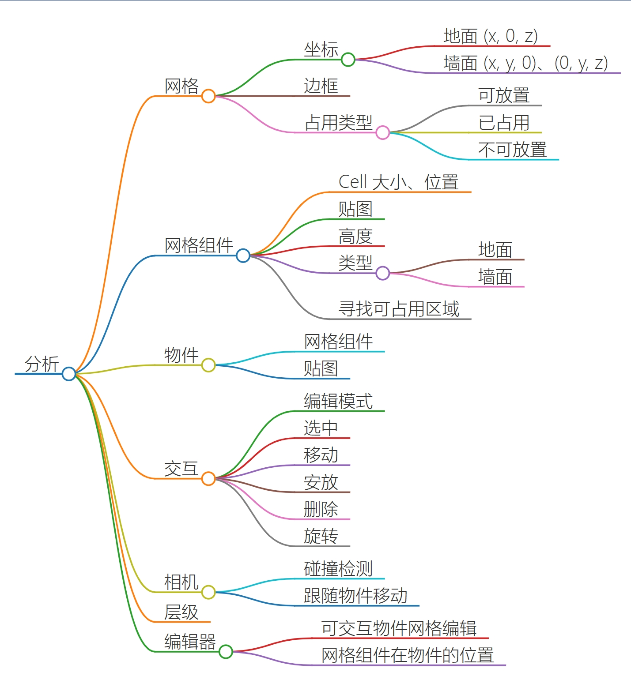
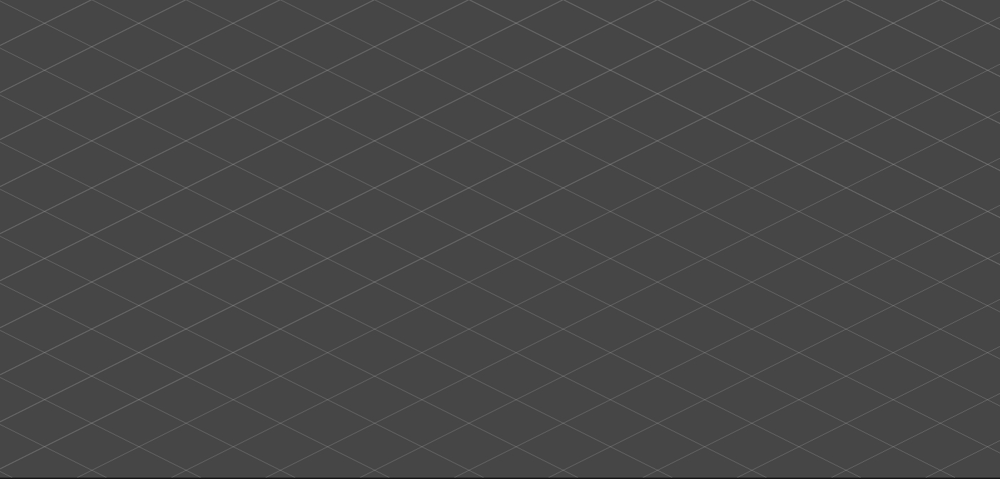
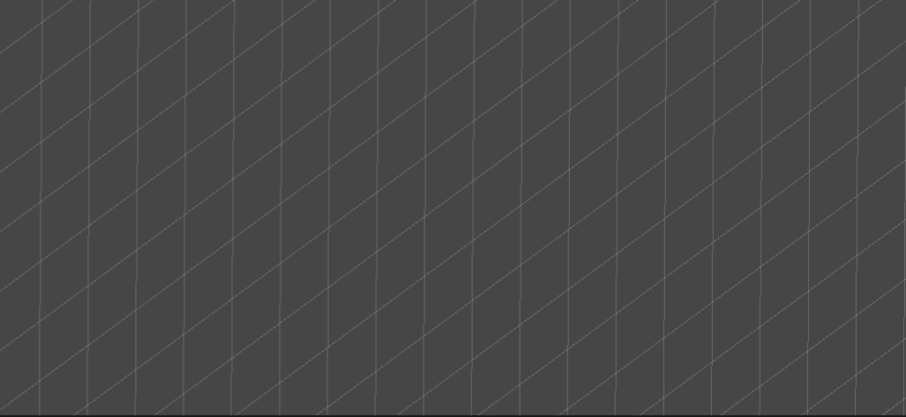

## 分析

<center>
    
</center>

## 相关细节

### 自定义网格

基础网格
```C#
public class Grid<T>
{
    public T[, ] grids;
    public Vector3 rotation; // 为 0 时表示地面，63（arctan2）时表示墙面
    public int width;
    public int height;
    private Vector3 cellSize; // 网格大小，类似 unity 中 tilemap，layout 设置为`isometric`类型，(2, 1, 1) 表示每个 cell 的 width:height 为 2:1
    private Vector3 origin;
}
```

网格物件
```C#
public class GridObject
{
    public int x, y;
    private Grid<GridObject> grid;
    public PlaceableObject PlaceableObject;
    public bool CanBuild;
    public GridObject(Grid<GridObject> grid, int x, int y)
    {
        this.grid = grid;
        this.x = x;
        this.y = y;
    }
}
```

<center>
    
    
</center>

### 可放置物件

```C#
public class PlaceableObject
{
    public int depth; // 记录物件的深度，每有一个物件被放置深度加一
    public Vector2Int offset; // 相对于网格原点的偏移
    public Transform placedObjectTransform; // 贴图 transform
    public List<Vector2Int> GridPositions; // 占据的网格大小
    private List<Grid<GridObject>> grids; // 物件也有网格，用于堆叠
}
```

### 遮挡和排序

- 深度值越大的（即被放置到其他物件之上），越靠前
- 网格索引(x, 0, z)越小排序越靠前
- 地面的可以遮挡墙面的

### 工具

- 定义可编辑场景，导入相关资源
- 编辑模式
  - 编辑物件的Placeable部分
  - 编辑物件的Grid部分
  - 删除区域
- 响应利用射线检测鼠标位置，在不同编辑模式下，将屏幕坐标转成世界坐标，再转换到网格坐标
- 存储编辑结果
  - 利用`ScriptableObject`、`Json`、二进制等存储方式进行保存
  - 加载
