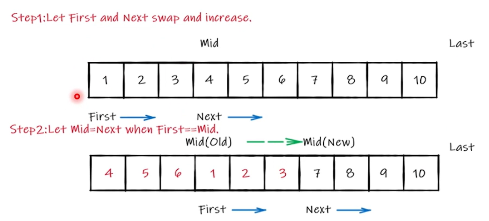
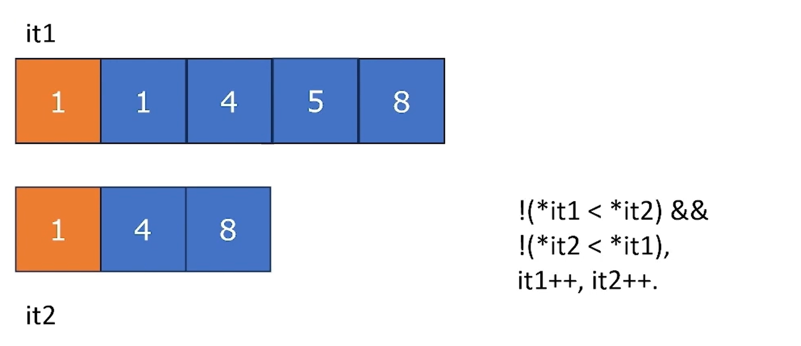
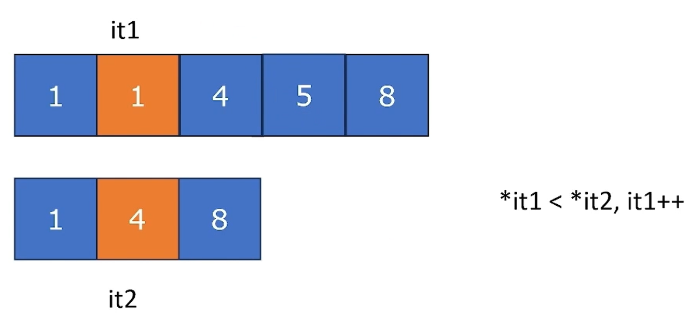
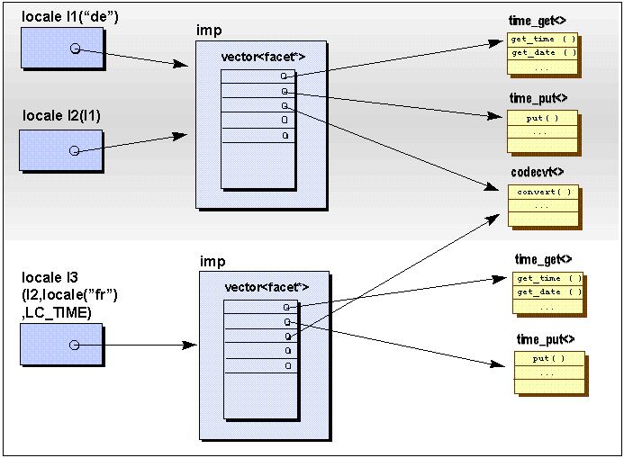

### Basics Review

#### Array Type

* Multidimensional array 多维数组
  * 除了第一维其它维必须明确指出大小（explicit size）
  * 不可以全部 decay
  * Dynamic allocation
    * `malloc` in C and `new`/`new []` in C++
    * `new`和`malloc`返回都是指针
    * 释放

#### Function

* 函数返回类型不能是函数或者数组（但是可以是它们的引用）
  * 不应该返回局部变量的指针或者引用（超出了局部变量生命周期的范围）
    * e.g. `int& Test() { int a = 1; return &a; }`
  * 声明为`static`的局部变量具有全局性
* Function pointers 函数指针
  * `void(*)(int)`
  * clockwise/spiral rule
  * Type alias 用 C++ 11 中的`using`
  
    ```C++
    using MyFuncType1 = int(*)(float);
    using MyFuncType2 = int(*)(int);
    using MyFuncType3 = int(*)(MyFuncType1);
    ```

  * C 语言中可以用`typedef`，但是没有`using`强大

#### Attribute

* `[[attribute]]` C++ 11，`[[attribute("reason")]]` C++ 20
* `[[deprecated]]`和`[[deprecated("reason")]]` C++ 14
* `[[noreturn]]` C++ 11
* `[[maybe_unused]]` C++ 17

e.g.

```C++
[[nodiscard]] int Add(int a, int b) { return a + b; }

int main()
{
    Add(1, 2); // int res = Add(1, 2);
    return 0
}
```

warning: 放弃具有 [[nodiscard]] 属性函数的返回值

#### Enumeration

> 一个被限制取值的类

* 比较像使用全局变量
* 同时进行整形运算也没有安全检查
* C++ 11 引入了 scoped enumeration 提高安全性

e.g.

```C++
// enum Day { Monday };
enum class Day { Monday };

int main()
{
    // int a = Monday;
    Day a = Day::Monday
    return 0;
}
```

* 可以使用`std::underlying_type<Day>::type`或者`std::underlying_type_t<Day>` C++ 14 转成整数类型
  * C++ 23 中也可以使用`std::to_underlying<Day>(day)`
* 可以使用`Day day{1};` 初始化 C++ 17，但是不能直接赋值`Day day = 1;`或`day = 1;`
* 可以使用位操作符

#### Expression

* 运算符和表达式三个重要概念
  * Precedence 优先级
  * Associativity 结合性
  * Order 顺序
* From the view of compiler, an expression is in fact a tree, determined by associativity and precedence. e.g. `9 / 3 / 2 + 2 * 3`
  * Precedence is used to split terms first.
  * Associativity determines how the tree will grow.
  * Then, it's order of expression evaluation that computes the whole tree. 但是顺序是不确定的
    * `f1() + f2() + f3()`，`f1()`，`f1()`，`f1()`哪一个先被 evaluated 是不确定的
* There are some rules
  * For `&&` and `||`, since they have short-circuit property, the first part will be fully evaluated.
  * For a function call, all parameters (including `a` for e.g. `a.Func()` or `a->Func()`) are fully evaluated before entering the function.
  * 三目运算
  * 逗号表达式
  * C++ 17
    * Parameters in function are evaluated indeterminately, i.e. every sub-tree represented by te parameter is fully evaluated in a **non-overlap** way 不会以交叠的形式 evaluated
    * 运算符重载，和 build-in 运算符的 evaluated 顺序一致，而不是被当作普通函数
    * More useful examples: chained call
  
```C++
std::string s = "I have it even works if you don't believe";
s.replace(0, 8, "").replace(s.find("even"), 4, "sometimes").replace(s.find("you don't"), 9, "I");
```

### class

#### Ctor & Dtor

* 拷贝构造函数
* 赋值构造函数
* The recommended way is member initializer list:
  * `member1{ ... }, member2{ ... }, ... { /* function body */ }`
  * `{}` is used since C++ 11
* 默认构造函数建议使用`Class() = default;`
* 如果成员变量有默认值，就不建议使用上面的构造函数的形式，而是直接用默认值初始化

#### Initialization of Object

* Since C++ 11, Uniform Initialization is introduced
  * 所有的初始化都可以用`{}`
  * 相比于`()`更安全 Narrowing Conversion 缩窄变换检查
    * the converted type cannot represent all values
      * `uint32_t`类型用`uint16_t`初始化，编译器会报错
    * the facilitates type safety
* Value initialization: No parameter for initialization `T a()`， `T a{}`， `new T{}`， `new T()`
* Direct initialization: `T a(x, y, ...)`，`T(x, y, ...)`，`new T(x, y, ...)`，`T a{x, y, ...}`
* Copy initialization: `T a = xx;`，`T a[] = { xx, ... };`
  * Ctors that use `explicit` cannot use this way
  * Before C++ 17, this also requires available copy ctor.
  
```C++
class A { public: explicit A(int a) {} };
void Func(A a) {}
int main()
{
    A a = 1;    // error
    A a = A(1);
    Func(1);    // error
    Func(A(1)); 
    return 0
}
```

* List initialization
* Aggregate initialization

#### Member Functions

* 所有的成员函数都隐式有一个`this`指针
* 如果期望函数不能更改成员变量，可以使用`const`关键字 make `this` to be `const`
* 静态成员函数
  * 没有`this`指针

#### Access Control

* `private`、`protected`、`public`，默认是`private`
* `protected`用在继承中
* 友元

#### Inheritance

* 子类/派生类、父类/基类
* 子类/派生类可以访问父类中所有`public`和`protected`成员
* 继承和组合
* 派生类可以隐式的转化成基类

##### Slicing Problem

```c++
int main()
{
    Student student1{ ... }, student2{ ... };
    Person& student1Ref = student1;
    student1Ref = student2;
    return 0;
}
```

* There exists implicit conversion in `student1Ref = student2` so actually it calls `Person::operator=(const Person&)`
* Can decorating `operator=` with `virtual` help
  * `Person::operator=` needs `const Person&` but `Student::operator=` accepts `const Student&` 参数都不一样，虚函数都不生效
* This is called "slicing" because such operation will only affect the base slice but not the initial object as whole 只影响了一小片
* Polymorphic base class should hide their copy & move functions if it has data member, otherwise deleting them 对于具有多态属性的基类，应该隐藏它们的拷贝和移动函数
* Make copy & move functions `protected` so derived class can call them

##### Multiple Inheritance

```c++
class Elephant {};
class Seal {};
class ElephantSeal : public Elephant, public Seal {};
```

* Dreaded diamond
* C++ introduces virtual inheritance
  * All virtual bases will be merged and seen as the same

```c++
class Animal { public: int weight; };
class Elephant : public virtual Animal {};
class Seal : virtual public Animal {}; // virtual 和 public 顺序是不重要的
class ElephantSeat : public Elephant, public Seal {};
```

* That is, you define many ABCs, which tries to reduce data members and non-pure-virtual member functions as much as you can 定义很多抽象类，尽可能减少成员变量和非纯虚函数的数量，最好是没有
* They usually denote "-able" functionality 这样展现出来的就是就有某种能力

#### Polymorphism 多态

* you can use the base class to load the derived object and call its own methods 使用基类的指针/引用，承载派生类的对象，从而调用派生类的方法
* virtual pointer and virtual table
* Every object whose class has a virtual method will have a virtual pointer, which points to virtual table of its class 每个类中都有一个指向虚表的指针，虚表内容就是声明为`virtual`函数的地址
* In C++ 11, it's recommended to use `override` 子类没有`override`编译器会报错
* `final` It means override, and the derived class cannot override again 继承链中的最后一个节点
  * `class A final { ... };` 让类不能被继承
  * 去虚化，编译优化
* `abstract class` 抽象类
  * 抽象类不能被实例化
  * 可以是使用抽象类的指针，指向的都是派生类的对象
  * C++通过纯虚函数实现抽象类 `virtual void PrintInfo() const = 0;`
  * 派生类继承自抽象类必须实现纯虚函数，否则仍然是抽象类
  * Don't call **any** virtual function and any function that calls virtual function in ctor & dtor 在构造函数和析构函数中不要调用任何虚函数，也不要掉调用任何可能调用虚函数的函数
  * You should usually make dtor of base class `virtual` 通常将析构函数声明为虚函数
    * deleting `Base*` that cast from `Derived*` will lead to correct dtor 派生类指针赋给基类，当调用`delete`时，如果不基类不是虚析构函数，就会调用基类的析构函数
  * 构造函数不能是纯虚函数

#### Some Covert Facts in Inheritance

* `override`不止表示复写虚函数的含义，对于非虚函数的复写也叫“override”
* `private` inheritance usually denotes the relation of **has-a**
* 虚函数的返回类型可以有些许改变：you can use `Base*` to both accept `Base*` and `Derived*` 复写虚函数的返回值可以是指向基类的指针，也可以是指向派生类的指针
  * 智能指针不能有“协变”
* 当虚方法有默认参数的时候，用什么类型的指针调用时，就会返回该类型内的默认值
  * 默认的参数在编译期间被识别，虚表是在运行时跳转的

e.g.

```C++
void Parent::Go(int i = 2) { std::cout << "Base's go with i = " << i << "\n"; }
void Child::Go(int i = 4) { std::cout << "Derived's go with i = " << i << "\n"; }

Child child;
child.Go(); // Derived's go with i = 4
Parent& childRef = child;
childRef.Go();  // Base's go with i = 2
```

* 可以更改虚方法的访问属性（但是不建议）

### `struct`

* 和`class`基本上一样，除了`struct`默认的访问控制是`public`
  * 不应该有成员函数，最多有 ctor、dtor 和运算符重载
  * With these constraints (except for ctor), `struct` will be an aggregate, which can use aggregate initialization
    * Since C++ 20, aggregate can also use **designated initialization** 指定初始化

e.g.

```C++
struct Priority { int cal; }
struct Point
{
    int x, y;
    Priority priority[2];
}

int main()
{
    Point p{ .x = 1, .y = 2, .priority = { { .val = 1}, { .val = 2 } } };
    return 0;
}
```

### Function Overloading 函数重载

* C++ 中就是相同的函数名不同的参数
  * C 中是禁止的
* This is done by compilers using a technique called **name mangling**
* Operator Overloading 运算符重载
  * `+`，`-`，`*`，`/`，`%`，`|`，`&`，`^`，`<<`，`>>`：推荐使用在全局函数中
  * `+=`，`-=`，`*=`，`/=`，`|=`，`&=`，`^=`，`<<=`，`>>=`：必须是成员函数 since the first operand must be a "named" object; return reference (i.e. `*this`)
  * Prefix`++` & Prefix`--`：必须是成员函数 return `*this`
  * Postfix`++` & Postfix`--` have an unused parameter int, which is used to distinguish the prefix and postfix
  * `*`，`->`：usually used in e.g. some wrapper of pointers
  * `&&`，`||`：short-circuit 特性会失效
  * `<=>`：三路比较运算符
  * `()`
  * `[]`
    * Since C++ 23, you can use multidimensional subscript in `operator[]`

### Lambda Expression

* 本质上是一个匿名的`struct`，重载了`operator() const`方法
* Basic format: `auto func = [captures](params) -> ReturnType { function body; };`
  * Captures are actually members of the `struct`
  * ReturnType, params and function are for `operator()`
  * Every lambda expression has its unique type
  * 不传任何参数`()`可以省略掉
* 建议将 Lambda 表达式中的捕获的东西明确写出来
* static 和 global 变量是不需要被捕获的
* 捕获`this`指针
  * `this` by reference, since only copy pointer
  * `*this` really copy all members
  * 包括私有成员也可以捕获
* You may add specifiers after `()`
  * `mutable`: since C++ 17, remove `const` in `operator()`
  * `static`: since C++ 23, same as `static operator()`
  * `constexpr`、`consteval`、`noexcept`

```C++
int main()
{
    int i = 0;
    auto m = [i] {i = 1; return 0; }; // 不允许修改 i = 1，因为重载的 operator() 是 const
    auto m = [i]() mutable {i = 1; return 0; }; // 修改的不是外面定义的变量，本质上修改的是 i 的拷贝
}
```

* It's also legal to add attributes between `[]` and `()`
* 函数也可以写成 Lambda 表达式的形式 `auto Foo(params) -> ReturnType { function body; }`

Code Block With Initializer

```C++
auto it = table.find(1);
if (it == table.end())
    //
else
    //
```

* `it`会泄露出去，下面如果继续判断会再定义迭代器类型的变量
* Since C++ 17, you mey code like

```C++
if (auto it = table.find(1); it == table.end())
    //
else
    //
```

* Since C++ 20, range-based for loop can also add an additional initializer, e.g. `for (auto vec = GetVec(); auto& m : vec);`
* Since C++ 23, type alias declaration can also be initializer, e.g. `if (using T = xx; ...)`

### Template

* Since C++ 17, CATD(class template argument deduction) is introduced, meaning that the argument of ctor can deduce the template parameter of class. e.g. `std::vector v{1, 2, 3, 4}`
* Lambda expression can also use template

## Container

* `std::size_t`: the type of `sizeof()` 意味着对象的大小不能超过`std::size_t`所表示的范围
  * 也意味着数组的大小不能超过`std::size_t`所表示的范围
  * 容器的大小也不能超过`std::size_t`
* `std::ptrdiff_t`：两个指针相减得到的类型

### Iterators

* Input/Output iterator
  * For output `*it = val`, `it++`, `++it`, 'it1 = it2'
  * For input `==`, `!=`, `->`
* Forward iterator: e.g. linked list
* Bidirectional iterator: `--it`, `it--` e.g. double linked list, map
* Random access iterator: `+`, `-`, `+=`, `-=`, `[]`, `<`, `>`, `<=`, `>=`, `!=` e.g. deque
* Contiguous iterator (since C++ 17): 保证地址空间是连续的
* **IMPORTANT**: Iterator are as unsafe as pointers 线程不安全的
* All containers can get their iterators by:
  * `.begin()`, `.end()`
  * `.cbegin()`, `cend()` read-only access
* 双向链表等还提供了倒序的遍历迭代器
  * `.rbegin()`, `.rend()`, `.crbegin()`, `crend()`
* 还可以使用全局的方法得到迭代器
  * `std::begin(vec)`, `std::end(vec)`
  * C++ 20 建议使用`std::ranges::begin`
  * 只有类似`int arr[5]`传入到`std::begin()`或`std::end()`中才有效，指针传入进来是无效的
* There are also general methods of iterator operations, defined in `<iterator>`
  * `std::advance(InputIt& it, n)`: `it += n`
  * `std::next(InputIt it, n = 1)`: `return it + n`
  * `std::prev(InputIt it, n = 1)`: `return it - n`
  * `std::distance(InputIt it1, InputIt it2)`: `return it2 - it1` 不同的容器时间复杂度不一样

#### Iterator traits（显著的特点，特征）

* Iterators provide some types to show their information:
  * `value_type`: The type of elements referred to
  * `difference_type`: The type that can be used to represent the distance between elements (usually `ptrdiff_t`) 迭代器之间的距离所表示的类型，一般就是`ptrdiff_t`
  * `iterator_category`: e.g. `input_iterator_tag`, `continuous_iterator_tag`
  * `pointer` & `reference`: only available in container iterators 只有在容器中才会有的特性
    * 可以使用`std::iterator_traits<IteratorType>::xxx`获取

#### Stream iterator

* `std::istream_iterator<T>` & `std:ostream_iterator<T>`
* The default constructed `istream_iterator` is `end()` 默认的构造函数表示终止的迭代器

#### Iterator adaptor

有两种类型的迭代器适配器

* One is created from iterators to preform different utilities:
  * E.g. reversed iterators 反向迭代器，++ 的本质上是 --，所以可以用`begin()`初始化，即`std:::reverse_iterator r{ p.begin() }`
  * You can get the underlying iterator by `.base()`, which actually returns the iterator that points to the elements after the referred one 调用`.base()`实际上是指向当前指向位置的下一个元素
    * `rbegin().base() == end()`
* Another is created from containers to work more than "iterate"
  * `std::back_insert_iterator{container}`: `*it = val` will call `push_back(val)` to insert
  * `std:front_insert_iterator{container}`: call `push_front(val)` to insert
  * `std::insert_iterator{container, pos}`: call `insert(pos, val)` to insert
* Notice that inserting/assigning a range directly is usually better than inserting one by one for `vector` or `deque`

### Sequential Container

#### Array

* E.g. `int a[5]` will decay to `int*` when passing to function, and the size information is dropped 以参数的方式传递到函数中会退化成指针，并且大小也被舍弃了
* `std::array<T, size>` the same as `T[size]`. It always preserves size, can copy from another array, and can do more things like bound check
* It's allocated on stack
  * But if you `new std::array`, then it;s still allocated on heap
* 特殊的构造函数需要额外的`{}` e.g. `struct S { int i; int j; }`初始化时是`std::array<S, 2> arr{{ {1, 2}, {3, 4}}}`
  * 第一个`{}`是`array`本身初始化的`{}`
  * 第二个`{}`是数组初始化的`{}`
* For member accessing 成员访问
  * `operator[]`
  * `at()` will check the bound
  * `front()`, `back()`: get the first/last element of vector 首先要保证非空
  * If you want to get the raw pointer of array content, you can use `.data()`
* Additional methods
  * `.swap()`
  * `operator=`, `operator<=>` 三路比较运算符
  * `.fill()` 将整个数组填充为某个特定值
  * `std::to_array`(C-style array)
* Size operations
  * `.size()`: return `size_t`
  * `empty()`
  * `.max_size()`: get maximum possible size in this system(usually useless)

#### vector

* 动态数组
  * 支持随机访问，占据连续空间
  * When inserting and removing elements at the end (i.e. pushing/poping back), the complexity is amortized（均摊） $O(1)$
  * If not at end, it'll be $O(n)$
* 在 cache 上的效果非常不错，对 cache 利用率非常显著
* 实现思路
  * 准备一部分空间，这样在 pushing 或者 poping 的时候时间复杂度才是$O(1)$
  * 当容量不够的时候在重新分配（reallocation），重分配的均摊复杂度也要求是$O(1)$
  * The element number is called size; total space is called capacity
  * 重分配的策略
    * The easiest strategy is increasing space linearly
      * E.g. 0 -> 4 -> 8 -> 12 -> 16 -> ...
      * Every $k$ operations will trigger reallocation an copy $n = km$ elements
        * So, the amortized complexity is $\Theta(\frac{\sum_{i = 1}^m{ki}}{km}) = \Theta(m) = \Theta(\frac{n}{k})$
        * Considering that $k$ is an constant, this is still $O(n)$
    * So, what about exponentially（指数）?
      * E.g. 1 -> 2 -> 4 -> 8 -> 16 -> 32 -> ...
      * Every $2^k$ operations will trigger reallocation an copy $n = 2^k$ elements
        * So, the amortized complexity is $\Theta(\frac{\sum_{i = 1}^k{2^i}}{2^k}) = \Theta(1)$
    * Finally, why is the exponent 2?
      * 可以证明任何大于 1 的指数最后的均摊复杂度都是$O(1)$
      * This is a trade-off between space and time 空间和时间的权衡
      * In MS（微软）, it's 1.5
  * vector 不会自动的进行缩容（shrink），但是会暴露出接口手动缩容
  * Insert 是从后向前的（move backwards）
  * Removal is similar, but move forwards from the end of deletion to the deletion point, and finally destruct the last several elements
  * `std::initializer_list`
  * For member accessing (same as array)
    * operator[]`,`at()`: accessing by index;`at()` will check th bound, i.e. if the index is greater than size, `std::out_of_range` will be thrown
    * `front()`, `back()`: get the first/last element of vector
    * If you want to get the raw pointer of array content, you can use `.data()`
  * For capacity operations (i.e. adjust memory)
    * `.capacity()`: get capacity (return `size_t`)
    * `.reserve(n)`: 直接分配`n`大小的内存，如果比当前 capacity 小就什么都不做，size 是不会改变的
      * 作用是前提知道需要分配的数量，一次性分配，就不需要有扩容的操作了
    * `.shrink_to_fit`: request to shrink the capacity so that `capacity == size`
  * For size operations
    * `.size()`
    * `.empty()`
    * `.resize(n, obj = Object{})`
    * `.clear()`: remove all things; size will be 0 after this
  * `.push_back(obj)`
  * `.emplace_back(params)`: insert an element constructed by params at the end 就地根据`params`构造元素
    * Since C++ 17, it returns reference of inserted element (before it's `void`)
  * `.pop_back()`
  * `.insert(const_iterator pos, xxx)`
  * `.erase(const_iterator pos)`, `.erase(const_iterator first, const_iterator last)`: erase a single element/elements from `[first, last)`
    * insert/erase will return next valid iterator of inserted/erase elements
  * Interact with another vector
    * `.assign`
    * `.swap(vec)`
  * Since C++ 23, ranges-related methods are added
    * `.assign_range(Range)`
    * `insert_range(const_iterator pos, Range)`
    * `append_range(Range)`

#### Iterator Invalidation

* 迭代器就是指针的包装，但是指针是不安全的
* 导致不安全的情况
  * reallocation 重分配，造成原来保存的指针悬垂
  * Insertion & removal 插入和删除
* For vector
  * If the capacity changes, all iterators are invalid

    ```c++
    #include<vector>

    int main()
    {
        std::vector{1, 2, 3, 4};
        auto it = v.begin();
        v.reserve(10086); // 会导致上一行的`it`失效
        it = v.begin(); // 必须进行重新获取
    }
    ```

  * If the capacity doesn't change, but some elements are moved, iterators after the changed points are invalid

#### Span

* 视图 View means that it doesn't actually hold the data; it observes the data
* Span is a view for contiguous memory (e.g. vector, array, string, C-style array initializer list, etc.)
* 可以像 array 一样操控 span
* `.first(N)/.last(N)`
* `.subspan(beginPos(, size))`
* span is just a pointer with a size

#### Dequeue Double-Ended Queue 双端队列

* 最主要的特点就是
  * $O(1)$ on insertion & removal of elements at the front or the back
  * Random access
* Other properties are just like vector
  * `push_front`
  * `emplace_front`
  * `pop_front`
  * `prepend_range` C++ 23
* Circular queue
  * When enqueue, tail moves forward
  * When dequeue, head moves forward
  * If `tail == head` i.e. the queue is full, overwrite the element at head, both tail and head move forward
* Dequeue 相当于动态的循环队列，当队列满的时候需要进行扩容
  * 扩容是做到均摊复杂度是$O(1)$
  * 可以做到随机访问的原理是 e.g. `deque[i]` is just `vec[(head + i) % size]`
* 实现方式
  * 降低拷贝的代价
  * 通常的实现方式是使用动态循环队列（called map），里面的元素是指针
    * 指针指向一个 block，block 中存储对象
    * block 的大小是固定的
  * Dequeue 中的数据结构
    * The map and its size
    * The block size
    * The global offset of the first element `off`
      * We can use `off / block_size` to know the position of head
    * Element numbers
  * 重新分配的时候只需要拷贝指针
  * Map reallocation in dequeue
    * 假设新加的 block 的大小是`count`
    * 需要使得循环队列仍然是连续的
      * First, copy all elements from `vec[head, vecEnd]` to `newVec[head, currEnd]`
      * Then, if `head <= count`, copy `[0, head)` to `[currEnd, ...)`
      * Else, copy after `currEnd` as mush as possible, and the rest is arranged to the `newVecBegin`
      * Finally, set all the rest to `nullptr`
* Dequeue iterator invalidation
  * All iterators are seen as invalid after insertion 插入之后所有的迭代器都是失效的，还包括
    * `resize`
    * `shrink_to_fit`
    * `clear`

#### List

* Double linked list
* Properties
  * $O(1)$ insertion and removal
  * $O(1)$ splice 融合另一个 list 的一部分元素
  * 不支持随机访问
* 每个节点都已一个数据`T data`、`prev`、`next`，并且第一个节点的`prev`指向`nullptr`，最后一个节点的`next`指向`nullptr`
* 微软用循环 list 实现的
  * 引入了哨兵节点 sentinel node，是`prev`指针的前一个节点，`next`指针的后一个节点
  * 不需要特判 nullptr`
* There are two methods to move nodes from another list
  * 和`insert(pos, it1, it2)`有区别，`insert`只是拷贝，没有清除操作
  * `.merge(list2)/.merge(list2, cmp)`，通常用在已排序的 list 中
  * `.splice(pos, list2, ...)`
    * `()`: insert the total `list2` to pos
    * `(it2)`: insert `it2` to `pos` (and remove it from `list2`)
    * `(first, last)`: insert `[first, last)` to `pos` (abd remove them from `list2`)

#### Froward list

* Single linked list
* Forward list 的目的是为了减少存储空间，所以不提供`.size()`函数
* 只存储头部节点

### Container adaptors

* 容器适配器是对已经存在的容器进行包装，通常情况下不提供迭代器

#### Stack

* Stack is a LIFO data structure
* The provide container show have `push_back`, `emplace_back`, `pop_back`, so vector, deque and list are all OK
* APIs
  * `.pop()`
  * `.push(val)`, `.emplace(params)`
  * `.push_range(params)` C++ 23
  * `.top()`
  * `.empty()`, `.size()`
  * `.swap(s2)`
  * `operator=`
  * `operator<=>`

### Queue

* Queue is a FIFO data structure
* `.front()`
* `.end()`

#### Priority queue

* It's defined in `<queue>`
* It's in fact max heap
  * 插入或者弹出元素的时间复杂度是$O(\mathbf{log} n)$
  * 建堆的时间复杂度是$O(n)$
  * Percolation is the core algorithm
    * 插入的时候进行上滤 percolate up
    * 删除的时候进行下滤 percolate down

#### Flat containers

* The only defect of map/unordered_map/... is that they're really cache-unfriendly
* Flat containers 对缓存利用率更高
  * The functionality is same as set/map
  * But it's in fact an ordered "vector"
    * 没有冗余的数据，对 cache 更友好
    * 本质上是两个 "vector"
* The whole definition is `std::flat_map<Key, Value, Compare = std::less<Key>, ContainerForKey = std::vector<Key>, ContainerForValue = std::vector<Value>>`
* 也可以使用 deque 作为容器
* The complexity
  * For lookup, $O(\mathbf{log}N)$ 二分查找
  * For insertion/removal, $O(n)$
  * For `iterator++`, $O(1)$

### Associative containers

* They're called associative because they associate key with value
  * The value can also be omitted
* There exist ordered one and unordered one
  * 有序的需要比较函数 less than
    * BBST (balanced binary search tree) 查找、插入、删除的时间复杂度都是$o(\mathbf{log}n)$
      * RB tree
      * AVL
  * 无序的需要提供哈希函数和判断是否相等的函数
    * 查找、插入、删除的时间复杂度都是$o(1)$

#### Map

* The key is unique; a single key cannot be mapped to multiple values
* `std::map<Key, Value, CMPForKey = std::less<Key>>`
  * 默认是小于号
  * `CMPForKey` should be able to accept `const key`
* For member accessing
  * `operator[]`, `at()`
  * Bidirectional iterators
    * Notice that the worst complexity of `++/--` is $O(\mathbf{log}N)$
    * 对 BBST 进行中序遍历就能得到有序的序列
      * `.begin()` is just the leftmost node and `.rbegin()` is just the rightmost node
* Note
  * `operator[]` will insert a default-constructed value if the key doesn't exits
    * 如果 key 不存在并且默认构造的值也不是真正需要的，用`insert_xxx`效率更高
    * `const map`不能用`operator[]`
    * 如果 value 是不能被默认构造的（例如没有默认构造函数）也是不能用`operator[]`
  * Key-value pair is stored in RB tree, so iterator also points to the pair
  * You can use structured binding to facilitate iteration

```C++
std::map<string::string, int> scoreTable{
    { "Li", 99 },
    { "God Liu", 99 },
    { "Saint Liu", 99 },
    { "Liang", 99 },
};

for (auto& [name, score] : scoreTable)
    std::cout << name << ' ' << score << '\n';
```

* APIs
  * `.lower_bound(key)`: find `it` that `prev(it)->key < key <= it->key`
    * Use key as a lower bound to make `[it, end) >= key`
  * `.lower_bound(key)`: find `it` that `prev(it)->key <= key < it->key`
    * Use key as a lower bound to make `[begin, it) <= key`
  * `.equal_range(key)`: find `it` pair with the same key as `key` in range
  * Insertion
    * 因为键是唯一的，插入的时候如果 key 存在会失败；无论失败成功都返回`pair<iterator, bool>`
      * If succeed, `iterator` refers to inserted element and `bool` is `true`
      * If fail, `iterator` refers to the element with the same key and `bool` is false`
    * 插入失败会有多个处理方式
      * Leave it unchanged
        * `.insert({key, value})`
        * `.emplace(params)`
      * Overwrite it (C++ 17)
        * `.insert_or_assign(key, value)`: return `pair<iterator, bool>`
      * Leave it unchanged and even not construct the inserted value (C++ 17)
        * `.try_emplace(key, params)`: same as `emplace`, except that the params are used to construct value, and `emplace` is not forbidden to construct the pair in failure 构造 value 非常昂贵的时候使用
    * You can also provide a hint iterator for insertion
      * hint iterator 在被插入元素后面的时候会有效率提升，在前面的话会使效率降低
      * Hint is often used in idiom blow

        ```C++
        auto pLoc = someMap.lower_bound(someKey);
        if (pLoc != someMap.end() && !(someMap.Key_comp()(someKey, pLoc->first)))
            return pLoc->second;
        else {
            auto newValue = expensiveCalculation();
            someMap.insert(pLoc, make_pair(someKey, new Value));
            return newValue;
        }
        ```

  * Erasure
    * `.erase(...)`
      * `(key)`
      * `(iterator pos)`
      * `(iterator first, iterator last)`
  * `.extract(key)`, `extract(iterator pos)`: extract out the node from the map
  * `.insert(node_type&&)`: insert the node to the map
  * `.merge(another map/multimap)`

> **Structured binding**
>
> * Structured binding is just `auto& [...]{ xx }`
>   * `{ xx }` can be `(xx)` or `=xx`
>   * `auto&` can be anything
>   * `xx` can be a pair; it can also be
>     * An object with all public data members, which will be bound on them
>     * A C-style array or `std::array`, which will be bound on elements `arr[i]`
>     * A tuple-like thing, which will be bound on every element
>   * Note
>     * pair and `std::array` is also somewhat tuple-like thing and can use some tuple methods, e.g. `std::get` pair 和`std::array`也可以像 tuple 一样，访问的时候也可以使用访问 tuple 的方法
>     * 结构化绑定时一个新的声明，不能绑定已经存在的变量，如果想绑定已存在的变量可以使用`std::tie(name, score) = pair`
>     * 结构化绑定的本质是匿名结构体，结构体中的变量是别名
>
>         ```C++
>         std::tuple<int, float> a{ 1, 1.0f };
>         const auto& [b, c] = a;
>         decltype(b) m = 0; // const int m  = 0;
>         ```
>
>     * Structured binding is usually more efficient than novice/careless programmers 建议使用结构化绑定
>
> **Tuple**
>
> * `std::tuple<int, float, double> t{1, 2.0f, 3.0};`
> * It can only be accessed by an index that can be determined in compile time 下标访问的下标只能在编译时确定
>   * `std::get<0>(tuple)` to get the `int 1`
>   * C++ 14 可以使用类型获取相应的值，前提是类型不能重复 e.g. `std::get<int>(tuple)`
>   * `std::tuple_cat`
>

#### Set

* Set is just a map without value
* The only difference with amp is that it doesn't have `operator[]` and `.at()`
* The iterator points to only key instead of key-value pair

#### Multimap

* 把 key 的唯一性取消了
* 不能使用`operator[]`和`.at()`
* 相等的值的顺序取决于插入时的顺序
* 插入永远都是成功的
* Nodes of multimap and map can be exchanged 两个容器的节点是可以相互替换的

#### Multiset

* Except for only key and no value, same as multimap
* You can also exchange nodes of multiset and set

#### Unordered map

* `std::unordered_map<Key, Value, Hash = std::hash<key>, Equal = std::equal_to<Key>>`
* Many types have `std::hash<Type>`, e.g. `std::string`, `float`, etc.
* The hash value of different keys may be same, so we need `Equal` to judge which key is wanted
* 微软的实现在解决冲突的时候用双向链表，并且链接相邻的 Bucket 延申出来的双向链表，并添加一个哨兵节点
* 当插入数据太多的时候，每个 bucket 也会链接很多数据
  * 这样会增加查找的复杂度
  * $\frac{\text{size}}{\text{bucket num}}$ is called load factor 装载因子
  * 装载因子过大时，需要对 bucket array 进行扩容
  * Rehash 重哈希
* APIs
  * `.bucket_count()`: size of bucket array
  * `.load_factor()`: `size() / bucket_count()`
  * `.max_load_factor()`: when load factor exceeds this limit, refresh will happen
  * `.rehash(n)`: make `bucket_count() = max(n, ceil(size() / max_load_factor()))` and rehash
  * `.reserve(n)`
  * `.bucket(key)`: get the bucket index of the key
  * `.begin(index)`, `.cbegin(index)`, `.end(index)`, `.cend(index)`: get the iterator of the bucket at index
  * `.bucket_size(index)`: get the size of bucket at index
* You can also extract nodes and insert them

## Ranges

* Using ranges is very like functional programming
* There are three important components in ranges:
  * Range: A type provides a begin iterator and end sentinel, so that it can be iterated over
  * View: A range that can be moved in $O(1)$, copied in $O(1)$ (or cannot be copied) and destructed in $O(1)$
  * Range adaptor
* Note
  * Range 可以按照迭代器进行分类
  * 计算是惰性计算
* They're all defined in `<range>`; all views are defines as `std::ranges::xx_view`, and all range adaptors are defined as `std::views::xx`
  * 一般用别名来简化定义`namespace stdr = std::ranges`和`namespace stdv = std::views`
  * `stdr::iota_view{lower, upper = INF}`, `stdv::iota(lower, upper = INF)`: 和 python 中的`range(a, b)`类似

  ```C++
  for (const auto oddNum : stdv::iota(1, 10)
    | stdv::filter([](int num) { return num % 2 == 1; })
    | stdv::take(3))
  {
      std::cout << oddNum << '';
  }
  ```

* Writable
  * `stdv::filter(Pred)`: drop the element if the predicate function `Pred` returns `false`
  * `stdv::take(x)`: take first `x` elements (but not exceed `end`)
  * `stdv::take_while(Pred)`: take elements until `Pred` return `false` (or `end`)
  * `stdv::drop(x)`: drop first `x` elements
  * `stdv::drop_while(Pred)`: drop elements until `Pred` returns `false`
  * `stdv::reverse`
  * `stdv::keys`: get the first element from a tuple-like thing
  * `stdv::values`
  * `stdv::elements<i>`: get the `i`th element from a tuple-like thing
  * `stdv::stride(k)`: use `k` as stride to iterate
    * e.g. `stdv::iota(1, 0) | stdv::stride(2)` gets `{1, 3, 5, 7, 9}`
  * `stdv::join`: flattens the ranges to a single range 需要用`|`连接
  * `stdv::join_with(xx)`: fill the interval with `xx` 需要用`|`连接
  * `stdv::zip(r1, r2, ...)`: zip values from ranges to a tuple
  * `stdv::cartesian_product(r1, r2, ...)`: return a tuple of elements from the cartesian product of these ranges
  * `stdv::enumerate`: return `std::tuple<Integer, T&>`; Integer is index whose tpe is diff type of iterator
  * `stdv::slide(width)`: slide the range in a sliding window of `width`
    * e.g. `std::vector v{1, 2, 3, 4, 5}; v | stdv::slide(3)` gets `{{1, 2, 3}, {2, 3, 4}, {3, 4, 5}}`
  * `stdv::adjacent<width>`: same as `stdv::slide(width)`
  * `stdv::pairwise`: i.e. stdv::adjacent<2>
  * `stdv::chunk(width)`: partition the range by `width`
  * `stdv::chunk_by(pred2)`: partition the range by `pred2`, i.e. a view sill stop when `pred2(*it, *next(it))` return `false`
  * `stdv::split(xx)`
  * `stdv::lazy_split(xx)`
* Read-only
  * Either make the view const, i.e. `std::as_const`; this will return `const T&` or `tuple<const T&, ...>`
  * Or return value, i.e. transform-related, which will return `T` or `tuple<T, ...>`
    * `stdv::zip_transform(TransformN, r1, r2, ...)`: return a view of `TransformN(ele1, ele2, ...)`
    * `stdv::adjacent_transform<N>(TransformN)`: return a view of `TransformN(...)`, where `...` is the elements of the sliding windows
    * `stdv::transform(Transform)`: transform element to another element

      ```C++
      std::vector<int> v{ 1, 2, 3, 4, 5 };
      int cnt = 0;
      auto r = v | stdv::transform([&cnt](const int ele) {
          std::cout << std::format("cnt={}, ele={}\n", cnt, ele);
          cnt++;
          return cnt + ele;
      }) | stdv::take_while([](const int ele) { return ele < 10; });
      for (const auto& i : r);
      // output:
      // cnt=0, ele=1
      // cnt=1, ele=1
      // cnt=2, ele=2
      // cnt=3, ele=2
      // cnt=4, ele=3
      // cnt=5, ele=3
      // cnt=6, ele=4
      ```

      * `++` will trigger transform since `take_while` needs the transformed value to advance the iterator (i.e. by `Pred(*it)`)
      * `const auto& ele = *it` will trigger it again
      * That's because the result doesn't reference some existing elements, but generate from temporary; every time you need it, lazy evaluation generate it again 太 lazy 了
      * Sometimes, you may want to convert a range to a e.g. container, which needs to eagerly evaluate all
        * `stdr::to`, e.g. `stdr::to<std::vector>()`
* There are also some naïve range factories
  * `stdv::single(obj)`: make a view that copies/moves an object, i.e. the view owns only a single element
  * `stdv::empty<T>`: create an empty view
  * `stdv::repeat(r, k = INF)`: repeat a range `r` for `k` times, i.e. like a range `[r, r, r, ...]`
  * `stdv::istream<xxx>(stream)`: similar to `istream_iterator`; it caches value
  * `stdr::subrange(first, last)`

## Generator

```python
def func(end):
    begin = 0
    while begin != end:
        yield begin
        begin += 1

generator = func(10)
for num in generator:
    print(num)
```

When the function reaches `yield`, it will pause and `return` the number; when iterator moves forward, the function will resume and continue to execute until the next `yield` or real `return`

* Since C++ 23, generator is also supported by **coroutine**
  * Coroutines **cooperates** with each other and yield their execution flow themselves 协程之间是相互配合的控制流
    * By contrast, for threads, they usually compete with each other and are interrupted by OS to give other threads chances to execute 线程则是抢占式的
* Generator is just the same; when you need the next value , you just yield your execution flow to the generator function; when the generator function completes its task, it will give back the right of execution
* Generator is also an `input_range` and view; it provides `begin()` and `end()` to iterate, and `++` the iterator will resume the function
  * NOTICE: Call `.begin()` will start the coroutine

e.g.

```C++
std::generator<int> func(int end)
{
    std::cout << "Ahh...";
    for (int begin = 0; begin < end; begin++)
        co_yield begin;
    co_return;
}
auto generator = func(3);

for (auto it = generator.begin(); it != generator.end(); it++)
    std::cout << *it;
// or
for (auto& num : generator)
    std::cout << num;
```

* Some notes
  * One generator can only be used once 只能使用一次
  * Generator has `operator=`
  * `co_return` can be omitted
  * Saving contexts also needs memory, so an allocator can also be provided as the last template parameter

## Function 函数

### Pointer to member functions

* Member functions can be static or non-static
  * Static ones are just normal functions with some `Class::`, their pointers are same as normal ones
  * Non-static ones are always bound to some specific objects, i.e. there is a `this` pointer as a parameter

e.g.

```C++
class Person
{
    public: unsigned int age;
    void AddAge(unsigned int n) {
        age += n;
    }
}

using FuncPtr = void (Person::*)(unsigned int);

int main()
{
    Person p{ 0 }, *pointer = &p;
    FuncPtr ptr = &Person::AddAge;
    (p.*ptr)(5);
    (pointer->*ptr)(5);

    // C++ 17
    std::invoke(ptr, p, 5);
    std::invoke(ptr, pointer, 5);
    return 0;
}
```

* Define a pointer to member function is `Ret (Class::*)(params)`
* `std::invoke` define in `<functional>` since C++ 17
* Since C++ 23, `std::invoke_r<Result>` is provided

### Callable parameter

#### Function as parameter

* 函数指针也可以实现将函数视为参数来传递，但是有两个问题
  * 有时候函数指针的参数类型有严格的限制，例如 `int` can be converted to `double`, `func(double)` is also acceptable
  * In C++, usually what you need is just "something callable", i.e. a functor is allowed 有时候只是想传入一个可调用的类型
* 有两种方式解决
  * Use a template parameter `<algorithm>`常用的方法采用模板参数接受可调用的参数
  * Use a `std::function` defined in `<functional>`
    * `std::function<RetType(Args...)>` can adopt almost all callable that have the return type **convertible** to `RetType` and accept `Args`
    * The member function even preserves polymorphism
    * After getting the `std::function`, you can just use `operator()` to call it
    * Even more powerful, you can bind some parameters to get new functors
      * E.g. you can use `std::bind(any_callable, params)` to get a `std::function` `std::bind`已经没有用了，完全可以用 Lambda 表达式绑定
    * There are two defects
      * Performance: It roughly causes 10% - 20% performance loss compared with direct function call
        * 有可能会用`new`/`delete`自定义`ctor`/`dtor`
        * 解决方式是使用 SOO(small object optimization)，在栈上准备一块小的 buffer 用于分配函数空间
        * 如果绑定的 Lambda 表达是太大可以使用`auto lambda = xx;`，然后再通过`std::ref(lambda)`传给`std::function`的构造函数（但是要注意声明周期），但是不可以使用`std::ref(&&xx)(){...}`，lambda 表达式会立马失效
      * The second defect of `std::function` is that it cannot really accept all functors 并不是支持所有的可调用类型
        * When the functor is not copiable (e.g. move-only, like `std::unique_ptr`) 仿函数不能拷贝的就不能接受
          * Thus, since C++ 23, `std::move_only_function` is introduced
  * Reference wrapper
    * `std::(c)ref()` in fact create `std::reference_wrapper<(const) T>`, which can be seen as an instantiated reference
      * 例如容器中不可能存储引用类型的，如果想储存引用类型可以使用`std::vector<std::reference_wrapper<T>>`
      * It's in fact a wrapper of pointer, but it cannot be null, just like reference
      * Different from reference, it can be bound to another object by `operator=`, just like pointer 引用是不可以换绑的，但是`std::ref()`可以
    * It's also used to denote "it should be a reference" explicitly in some methods in standard library, e.g. `std::bind_back` or `std::bind_front`
* There are also some predefined template functors in `<functional>`
  * Arithmetic functors: `plus`, `minus`, `multiplies`, `divides`, `modulus`, `negate`
  * Comparison functors: `equal_to`, `not_equal_to`, `greater`, `less`, `greater_equal`, `less_equal`, `compare_three_way`
  * Logical functors: `logical_and`, `logical_or`, `logical_not`
  * Bitwise functors: `bit_and`, `bit_or`, `bit_xor`, `bit_not`
  * These `Functor<T>` all have `auto operator()(const T&, const T&) const`

#### Lambda expression

* We call lambda expression without capture *stateless lambda*; otherwise *stateful lambda*
* 可以使用`decltype(...)`去推断 lambda 表达式的类型
* 理论上可以使用推断出来的仿函数的类型进行声明，但是只有再 C++ 20 之后才是合法的
  * E.g. `auto l = [](int a, int b) { return a + b; }; using T = decltype(l); T l2{};`
  * 只适用 stateless lambda

## Algorithms

### Algorithms' Consist

* Iterator pairs 迭代器对，或者直接传入 ranges
* Predicate function / transform function 判别函数或者变换函数，通常情况下变换都是`const&`，或者对于比较小的类型传入拷贝
* 大部分算法都返回一个范围迭代器
* 从来都不会改变序列的大小
* Callables of algorithm are of value type instead of reference type 判别函数或者变换函数都是传递值类型，不是引用类型

### Search

* 两种搜索算法
  * Linear search
    * Find single value
      * `std::find`
      * `std::find_if`
    * Find one of values in a range
      * `std::find_first_of`
    * Find a sub-sequence in a sequence (Pattern matching)
      * `std::search`
      * `std::find_end`
    * Others
      * `std::adjacent_find(begin, end[, Pred2])`: 相邻元素相等的位置
      * `std::search_n(begin, end, count, value, [, Pred2])`
  * Binary search, which is applied on sorted sequence
    * `std::binary_search`: return bool, denoting whether `value` exists in `[begin, end)`
    * `std::lower_bound`: return `it` so that `value` is the lower bound of `[it, end)`
    * `std::upper_bound`: return `it` so that `value` is the lower upper of `[begin, end)`
    * `std::equal_range`: return an iterator pair `(it1, it2)` so that `value` is equal to `[it1, it2)`

### Comparison

* `std::equal(begin1, end1, ..., [, Pred2])`: return a bool
* `std::lexicographical_compare(begin1, end1, begin2, end2[, Pred2])`: return bool; Pred2` acts as `operator<>`
  * Compare until `ele1 < ele2 || ele2 < ele1`
* `std::lexicographical_compare_three_way(begin1, end1, begin2, end2[, Pred2])`: return an ordering; `Pred2` acts as `operator<=>`
* `std::mismatch(begin1, end1, ...[, Pred2])`:  return an iterator pair `(it1, it2)` denoting the first occurrence of mismatching
* These algorithms are all $O(N)$

### Counting

* `std::all_of/any_of/none_of(begin, end, Pred)`
* `std::count(begin, end, value)`
* `std::count_if(begin, end, Pred)`
* These algorithms are all $O(N)$

### Generating and Transforming

* `std::fill(begin, end, value)`
* `std::fill_n(begin, count, value)`
* `std::generate(begin, end, Gen)`: for each element in `[begin, end)`, `ele = Gen()`
* `std::for_each(begin, end, Transform)`: for each element in `[begin, end)`, call `Transform(ele)`
* `std::transform`: There are unary/binary transforms
  * `(begin, end, dstBegin, Transform)`: unary 一元
  * `(begin, end, begin2, dstBeing, Transform)`: binary, the transformation is `Transform(*it1, *it2)`

### Modifying

* `std::remove(begin, end, value)/std::remove_if(begin, end, Pred)`: return the iterator so that `[begin, it)` has no element that is equal to `value` or make `Pred` return `true`
  * 不会真的擦除迭代器
  * Since C++ 20, they're integrated as methods `std::erase/std::erase_if`
* `std::unique(begin, end[, Pred2])`: return the iterator so that `[begin, it)` has not adjacent equal element; `Pred2` acts as `operator==` 使得在`[begin, it)`区间内没有相邻且相等的元素
* These algorithms are all $O(N)$, by the technique of dual pointers 算法用双指针实现
  * 定义两个指针`before`和`after`
  * 两个指针一开始都指向`begin`
  * 先前进`after`
  * 判断`*before == *after`；相等只前进`after`，不相等则前进`before`，并将`after`指向的值和`before`交换，前进`after`
  * 直到`after == end`
  * 需要考虑`begin == end`和整个序列就是 unique 的情况
* `std::replace(begin, end, oldValue, newValue)/std::replace_if(begin, end, Pred, newValue)`
* `std::swap(x, y)`
* `std::iter_swap(it1, it2)`
* `std::swap_range(begin1, end1, begin2)`
* `std::reverse(begin, end)`
* `std::rotate(begin, mid, end)`: left rotate `[begin, mid)`
  * 2, 3, 4, 4, 5 -> 4, 5, 2, 3, 4 相当于左移
  * Rotate is also $O(n)$
    * brute-force method: swap each element ot its position (just like bubble sort). This will be $O(k(n - k))$ 一个一个的交换，需要两层循环
      * 可以考虑将第一个元素拿出来，再确定序列中哪一个元素会再下一步出现在第一个位置，然后进行替换，以此类推完成旋转
      * 但是这种方式对 cache 不友好
    * swap all groups together
      * The complexity is $O(n)$
        <center>
            
        </center>
    * reverse
      * In fact, reverse is the basis of many algorithms
      * `[begin, mid - 1]``[mid, end - 1]`
      * Reverse two sub-sequences, get `[mid - 1, being]``[end - 1, mid]`
      * Reverse the total sequence, get `[mid, end - 1]``[begin, mid - 1]`
      * The complexity is $\Theta(k) + \Theta(n - k) + \Theta(n)$
* `std::shift_left/right(begin, end, n)`: the dropped elements are permanently dropped (invalid)

### Copying

* `std::copy(begin1, end1, dstBegin)`
* `std::copy_if(begin1, end1, dstBegin[, Pred])`
* `std::copy_n(begin1, n, dstBegin)`
* `std::copy_backward(begin1, end1, dstBegin)`

### Partition and Sort

#### Partition

Partition denotes that a range is divide into two parts; assuming predicate function `Pred`, then there exists an iterator `it` (i.e. partition point 轴点） so that all elements in `[begin, it)` make `Pred` return `true` while `[it, end)` make `Pred` return `false` 左边的都小于轴点（使得`Pred`函数返回`true`），右边的都大于轴点（使得`Pred`函数返回`false`）

* `std::is_partitioned(begin, end, Pred)`
* `std::partition(begin, end, Pred)`
* `std::stable_partition(begin, end, Pred)`: each sub-partition preserves the original order 保证 partition 后的结果和原序列的顺序一致
  * 原序列 `{ 0, 1, 9, 4, 5, 2, 7, 8 }`, `Pred`为`[](const int ele) { return ele % 2; }`左边是奇数右边是偶数
  * `std::partition`: `{ 7, 1, 9, 5, 4, 2, 0, 8}`
  * `std::stable_partition`: `{ 1, 9, 5, 7, 0, 4, 2, 8 }`
  * Implementation:
    * When the memory is enough （内存足够）, prepare a buffer; move the `false` range to the buffer and move the `true` range to be consecutive (just like preform `std::remove_if()`, with removed range saved in buffer). Then move the buffer elements back
    * When the memory is not enough （内存不够）, divide the sequence into two halves and stable partition each half
      * This will from `[true, false], [true, false]` sequence 最终都会变成这样的序列
      * Rotate the middle `[false, true]` so that the final result is totally partitioned
      * $T(n) = 2T(\frac{n}{2}) + O(n)$, to it's overall $o(n\mathbf{log}n)$
* `std::partition_point(begin, end, Pred)`: assume the range is a partition 前提是序列已经是 partition

#### Sort

* `std::is_sorted(begin, end[, Pred2])` $O(N)$
* `std::is_sorted_until(begin, end[, Pred2])` $O(N)$
* `std::sort(begin, end[, Pred2])` $O(N \mathbf{log}N)$
* `std::stable_sort(begin, end[, Pred2])`
  * $O(N)$ space complexity, $O(N \mathbf{log}N)$ time complexity
  * If space is insufficient, $O(N (\mathbf{log}N)^2)$ time complexity
* Since `std::sort` requires the complexity exactly $O(N \mathbf{log}N)$, quick sort is not enough 快排只是平均意义上的$O(N \mathbf{log}N)$，最坏的情况是$O(N^2)$
* C++标准库广泛使用的排序算法是 Introspective Sort( IntroSort)
  * It integrates insertion sort, heap sort and quick sort 结合了插入排序，堆排序和快排
  * When the element number is **low enough**, insertion sort is used
  * When the recursion is too deep, heap sort is used
    * 避免快排的最坏情况
    * 堆排序是稳定$O(N \mathbf{log}N)$
    * 堆排序速度不是很快，对 cache 也不是很友好
* `std::partial_sort(begin, mid, end)`
* `std::nth_element(begin, mid, end)`: rearrange `[begin, end)` so that `*mid` is sorted (i.e. same as the `*mid` in the full sorted range) and the whole range is partitioned by it 在排好序的中第 n 个位置的元素
* `std::merge(begin1, end1, begin2, end2, dstBegin[, Pred2])`
* `std::inplace_merge(begin, mid, end)`

#### Heap

* `std::is_heap(_until)(begin, end[, Pred2])`
* `std::make_heap(begin, end[, Pred2])`: Floyd algorithm $O(N)$
* `std::push_heap(begin, end[, Pred2])`
* `std::pop_heap(begin, end[, Pred2])`
* `std::sort_heap(begin, end[, Pred2])`

#### Set Operations

Set operations are used on **sorted** range, including `set`

* `std::includes(begin1, end1, begin2, end2[, Pred2])`: check whether th second range is subset of the first range
  <center>
      
      
  </center>
* `std::set_intersection(begin1, end1, begin2, end2, dstBegin[, Pred2])`: $A \cap B$
* `std::set_union(begin1, end1, begin2, end2, dstBegin[, Pred2])`: $A \cup B$
* `std::set_symmetric_difference(begin1, end1, begin2, end2, dstBegin[, Pred2])`: $A - B$
* `std::set_difference(begin1, end1, begin2, end2, dstBegin[, Pred2])`: $A - (A \cap B)$

#### MinMax

* `std::min/max/minmax(a, b[, Pred2])`: return (pair of) reference of the smaller/bigger element
* `std::min_element/max_element/minmax_element(begin, end[, Pred2])`: return the iterator of the minimum/maximum value in the range
* `std::clamp(value, low, high)`

#### Permutation

Permutation means that two sequence are **unorderly equal**

* `std::is_permutation(begin, end1, begin2[, Pred2])`
  * $O(n^2)$
* `std::prev/next_permutation(begin, end[, Pred2])`: return the sequence to the previous/next permutation

#### Numeric Algorithms

They are all $O(N)$

* For the most basic ones:
  * `std::iota(begin, end, beginVal)`: fill in `[begin, end)` with `{beginVal, ++beginVal, ...}`
  * `std::adjacent_difference(begin, end, dstBegin, Op = std::minus)`: as its name, output `{val[0], val[1] - val[0], val[2] - val[1], ...}`
  * `std::accumulate(begin, end, initVal, Op = std::plus)`: accumulate all values, return $\text{initVal} + \sum_{\text{begin}}^{\text{end}}\text{val}$
  * `std::partial_sum(begin, end, dstBegin, Op = std::plus)`: output `{val[0], val[0] + val[1], val[0] + val[1] + val[2], ...}`
  * `std::inner_product(begin1, end1, begin2, initVal, Op1 = std::plus, Op2 = std::multiplies)`: finally get `initVal + a[0] * b[0] + a[1] * b[1] + ...`
  * `std::reduce(begin, end, initVal, Op = std::plus)`: same as accumulate
  * `std::inclusive_scan(begin, end, dstBegin, Op = std::plus[, initVal])`: same as partial sum
  * `std::transform_reduce(begin1, end1, begin2, initVal, ReduceOp = std::plus, BiTransformOp = std::multiplies)`: same as inner product
  * `std::exclusive_scan(begin, end, dstBegin, initVal, Op = std::plus)`: similar to partial, but exclude the element itself, i.e. the sequence is `{initVal, initVal + val[0], ..., initVal + val[0] + ... + val[n - 2]}`
  * `std::transform_inclusive_scan(begin, end, dstBegin, Op, UnaryTransformOp[, initVal])`
  * `std::transform_exclusive_scan(begin, end, dstBegin, Op, UnaryTransformOp[, initVal])`
* `std::gcd(a, b)`: 最大公约数
* `std::lcm(a, b)`: 最小公倍数
* `std::midpoint(a, b)`: since C++ 20, return `a + (b - a) / 2`

#### Parallel Algorithm

* There are two kinds of parallelism
  * SIMD: single instruction multiple data 单指令多数据
  * SIMT: single instruction multiple threads
* Since C++ 17, parallel-version algorithms are added
* Defined in `<execution>`
  * There are four execution policies defined in `std::execution`
    * `seq`: sequenced policy 完全不并行
    * `par`: parallel policy 并行
    * `unseq`: unsequenced policy (since C++ 20) 算法可以适应 SIMD
    * `par_unseq`: parallel and unsequenced policy
* There are four kinds of data dependencies
  * RAR: read after read 可以使用`par_unseq`
    * E.g. `std::adjacent_find`
  * RAW: read after write, e.g. `a[j] = a[j - 1] + 1`
  * WAR: write after read, e.g. `a[j - 1] = a[j] + 1`
  * WAW: write after write
* Parallel algorithms
  * `std::partition`, `std::nth_element`
  * `std::merge`
  * `std::inplace_merge`
* There are also some algorithms that cannot be parallelized
  * Those who only operate on several values, e.g. `std::min/max/minmax/clamp`, `std::swap/iter_swap`
  * 随机算法
  * `std::search`
  * `std::push/pop/make/sort_heap`
  * 排列算法
  * 二叉搜索算法
  * Ordered numeric algorithms, i.e. `std::iota/accumulate/inner_product/partial_sum`

#### Range-version Algorithms

算法中需要声明迭代器，当操作的是一整个容器时，就需要`begin`和`end`，所以可以使用`ranges`。range-version 算法也可以叫做 constrained algorithms，使得算法操作更加灵活

* You can additionally specify **projection** as the last parameter, i.e. transformation of elements before entering the real function 最后一个参数可以指定一个映射，例如使用 transform 在传入函数前进行变换
  * This just changes criteria（标准；条件）, the element itself is unchanged
  * Multiple ranges may specify multiple projections

```c++
std::vector vec{ -1, 2, -3, 4, -5, 6 };
auto print = [](int i) {
    std::cout << i << ", ";
};
std::cout << "with abs() projection: \n";
std::ranges::sort(vec, {}, [](int i) { return std::abs(i); });
std::range::for_each(vec, print);
```

* Range-version algorithms also have these advantages
  * 使用了 C++20 中的 concept
  * The range doesn't need to be comma (i.e. `begin/end` with the same type) `begin`和`end`不要求类型相同
  * 更加安全
  * 有些算法被加强了
  * 新的方法加入进来
  * 用模板方法更容易
* There are also some defects
  * 不能使用并行算法
  * 一些算法被削弱了
  * 返回值类型并不和`std::`相同，返回值改变有以下几种形式
    * `stdr::in_in_result<I1, I2>`: 本来返回两个迭代器，现在返回了一个结构体，里面的成员变量是两个迭代器
    * `stdr::in_out_result<I, O>`
    * `stdr::in_in_out_result<I1, I2, O>`
      * `stdr::set_union/intersection/symmetric_difference`
      * `stdr::merge`
      * binary `stdr::transform`
    * `stdr::in_out_out_result<I1, I2, O>`
      * `stdr::partition_copy`
    * `stdr::in_found_result<T>`

## Lifetime

### Storage duration 存储持续性

There are four kinds of storage duration

* Static storage duration: global variables, static variables in a function/class
* Automatic storage duration: variables that belong to a block scope ro function arguments 定义的时候构造，退出的时候析构
* Dynamic storage duration: you can create objects by using or some other allocation functions
* Thread storage duration: 线程创建的时候构造，线程退出的时候析构

The lifetime of an object begins when storage with proper alignment and size is allocated and the object is initialized 合适的对齐，合适的大小，以及初始化

The lifetime of an object ends when it's destroy, or the dtor is called, or its storage is released or reused by non-nested object 析构函数被调用，存储被释放，被重用（`float`类型的变量通过某些手段被`int`类型变量占用）

Temporary objects are only alive until the statement ends (i.e. until `;`) 临时变量的声明周期只到语句结束之前，也就是`;`分号之后才结束

* 函数中的参数传递`const&`或`std::function_ref`是安全的
* 返回临时变量可以延长对象的生命周期，例如`const&`
  
  ```c++
  struct A{};
  A bar() { return A{}; };
  const A& a = bar();
  ```

In modern C++, **pointer is far beyond address**; it has type `T*`, and you can hardly ever access some address by it when there are no underlying objects of type `T` alive 指针的功能远远超出寻址的语义，指针是带有类型的概念；如果指针指向的地址不符合指针具有的类型，如果再用指针访问相应的元素就会是无效的

### Placement new

“就地初始化” `ConstructOnBuffet`, which won't allocate memory, but only create the object at the place 不在重新分配内存，直接在现有已开辟的内存空间中创建对象

```c++
alignas(T) unsigned chat buf[sizeof(T)];
T* tptr = new(buf) T;
tptr->~T();
```

* `new(buffet) Type Initializer`, where `Initializer` is optional
* Of course, you need to make sure the alignment satisfies the requirement of the type, so you can use keyword `alignas`  为了保证类型对齐需要用到在 C++ 11 引入的关键字`alignas`

> * `std::byte`: defined in `<cstddef>` since C++ 17; it's just an enumeration class and explicitly represents a byte (before we may use `unsigned char`)
> * Trivial dtor
>   * It's implicitly declared or declared with `=default` 隐式生成（编译器）的或者被定义为`default`
>   * It's non-virtual and all non-static data members have trivial dtor 所有的非静态成员都有 trivial dtor，并且成员不能是虚的
>   * For example
>     * ✅`struct A{ int a; float b; };`
>     * ✅`class A{ int a; public: float b; ~A() = default };`
>     * ✅`class A{ int a; public: float b; virtual ~A() = default };`
>     * ❎`class B : public A{};`
>     * ❎`class A{ ~A() {} };`
>     * ❎`class A{ std::unique_ptr<int> ptr; };`

### Corner Cases

* Case1: if you construct an object that has the same type as the original object, and they occupies exactly same storage, then the original name, pointers and references are still valid 就像赋值符号一样
* Case2: it's best to reuse storage of plain types like `int` or classes that have trivial dtor 如果要重用内存尽量使用简单的类型，例如`int`或者带有 trivial dtor 的类，对于其他类型编译器会在退出当前 scope 时候会自动调用析构函数
* Case3: it's illegal to reuse memory of `const` objects that have determined their value in the compilation time
* Case4: `unsigned char/std::byte` array is explicitly regulated to be able to provide storage 这两个类型的数组是明确地可以提供 storage 的
* Case5: It's legal to access the underlying object by pointers without the same type in these cases (type punning/aliasing 类型堆叠/类型别名） 在少数情况下可以使用不同类型的指针访问一些对象
  * add/remove cv-qualification `int`类型的指针可以使用`const int`类型的指针访问
  * decayed array 用指针访问数组的元素
  * if the underlying type is integer, then using the pointer of its signed/unsigned variant to access it is OK
  * convert it to `(unsigned) char*/ std::byte*` 允许将对象视作字节数组 byte array
* Case6:If you have an old pointer where you've constructed a new object, but you want to use the old pointer to get the new pointer, you can use `std::launder`（洗涤；洗钱） defined in `<new>` since C++ 17
  * `std::launder(reinterpret_cast<A*>(buffer))` to get the actual valid pointer 用旧的指针获得指向新的对象的指针

### Strict Aliasing Rules

Strict aliasing rules, if pointers are not aliased or not contained as member, then compilers can freely assume that they're different objects 本质上就是检查两个指针指向的区域有没有可能重叠

```c++
struct T
{
    uint8_t* target;
    char* source;
    void Unpack(int size)
    {
        while (size > 0)
        {
            uint64_t t;
            std::memcpy(&t, source, sizeof(t));
            target[0] = t & 0x7;
            target[1] = (t >> 3) & 0x7;
            target[2] = (t >> 6) & 0x7;
            target[3] = (t >> 9) & 0x7;
            source += 6, size -= 6, target += 16;
        }
    }
};
```

* Compared with non-member version (i.e. `Unpack(uint8_t* target, char* src, int size)`), it's 15% slower
* `target` is an alias of `this`. It will then always reload `target[i]` instead of caching a `qword` to prevent change of `target` 编译器认为`target`是`this`的别名

### Others

* Attention to lambda lifetime
  * Lambda lifetime should always be shorter than reference captures
  * If you capture in the class, then this only captures members by `this`, which may be invalid after destruction 如果`this`被析构掉，就算是把`this`拷贝出来，还是失效的
* Attention to view lifetime
  * Sometimes you mey return a view generated by range adaptor in a function (e.g. `v | std::reverse`)
    * For lvalue, it's same as the lvalue itself, i.e. `v` here
    * For rvalue, it'll same as return a value, so that it's always safe 临时值
  * 所有的 range adaptors 在调用之前都会调用`stdv::all`尝试将 range 转换成 view；但是对于 view 来说不做任何事情
    * For lvalue range, it'll create a `stdr::ref_view`
    * For rvalue range, it'll create a `stdr::owning_view`

## Type Safety

### Implicit Conversion

* Some implicit conversions are automatic (standard conversions), and others are user-defined 很多隐式的转型都是自动的
  * E.g. `operator float()`. If you declare it as `explicit`, then implicit conversion will be disabled
* Standard conversions
  * Lvalue-to rvalue conversion, array-to-pointer conversion, function-to-pointer conversion
    * Decay actually means
      * Array/Function -> pointer
      * Or for other types, remove remove references first, remove cv-qualifiers(const & volatile) next
      * You can use `std::decay_t<T>` to get the decayed type
      * `auto a = xx;` will also decay the deduced type, while `auto&` will not
        * But structured binding `auto [a, b] = xx;` "seems" not decay decay 看似没发生，其实是发生在结构化绑定的实现上，相当于`auto anonymous = xx;`，`a`和`b`是成员变量的别名，decay 发生在`anonymous`中
  * Numeric promotions and conversions
    * Promotion: promotion has higher precedence and will not lose precision
      * `b + c` where `b` and `c` are `unsigned short` will in fact silently promote them to `int` and then do `+` 先提升到`int`然后再做加法
      * 至少提升到`int`
      * `float` can be promoted to `double`
    * Signed value has negative values while unsigned ones don't, but conversion may happen
    * `float` cannot represent all `int/...` but `int` can be converted to `float` implicitly
    * Any scalar types can be converted to `bool`
    * Pointers can be converted to `void*` to base class, and `nullptr` can be converted to pointer directly
    * Pointer to member of derived class can also be converted to pointer to member of base class, i.e. `Derived::int*` -> `Base::int*`
    * There are also some numeric conversions that need explicit cast 数值上的转换需要显示的转换
      * Narrow integer conversion will mod $2^n$ 例如`int` -> `short`，`long long` -> `int`会把高位的位数截断
      * Narrow floating conversion will be rounded
      * Floating to integer will truncate the digits after dot; UB if truncated integer is not representable by converted type
  * (Exception-specified) function pointer conversion
    * 可以把`noexcept`的函数指针转换成没有`noexcept`的函数指针
  * Qualification conversions
    * You can convert a non-const/non-volatile to const/volatile one

### Static Cast

`static_cast` is the most powerful one, which can process almost all of normal conversion,defined as `static_cast<TargetType>(Exp)`

> **Standard-layout**
>
> * 所有的成员都有相同的访问属性
> * 没有虚函数
> * The base class is not the type of the first member data 基类对象不能是子类第一个成员变量
> * 整个继承结构，只能有其中一个类是有非静态的变量

* All implicit conversions can be explicitly denoted by `static_cast` 可以做任何一种隐式的转换，也会允许逆操作 e.g. `int` -> `short`, `double` -> `float`
* Scoped enumeration can be converted to/from integer or floating point, which is same as the underlying integer type
* Inheritance-related conversions
  * upcast 向基类转换；更安全的
  * downcast 向派生类转换；有点危险
* For `static_cast`, besides inheritance-related pointer conversion, it also processes `void*`
  * You can convert any object pointer to `void*` (this is also implicit conversion)
  * You can also convert explicitly `void*` to any object pointer 前提是对象潜在的类型`U`和指针的类型`T`有某种特殊的关系——pointer-interconvertible
    * `T == U`
    * `U` is a union type, while `T` is type of its member
    * `U` is standard-layout, while `T` is type of its first member or its base class
    * Or all vice versa/transitivity
* 并不保证地址是相同的
* Convert to `void`: just discard value, nothing happens
* Construct new object: if the object ctor can accept a single parameter, which is convertible from the expression, then it in fact constructs a new object. E.g. `static_cast<A>(a)` for `A(int)`
* Transform value category
* `static_cast` can be used to specify which overload of functions is used by function-to-pointer conversion

### Dynamic Cast and RTTI

#### Dynamic Cast

`static_cast`在继承链中检查是非常弱的（可以说是不做检查），即便转换的对象不是派生类的类型仍然会做转换，只是会带来 undefined behavior。`dynamic_cast`尝试解决这个问题，如果转换不合适会失败

* 引用上转换失败会抛出异常`throw std::bad_cast`
* 指针上转换失败会返回`nullptr`
* 比 UB 更强，更容易定位 bug

为了做了运行时检查，C++ 编译器会在文件中保留运行时的类型识别（RTTI, Run-Time Type Information/Identification），`dynamic_cast`只能用在多态的类型转换中，因为 RTTI 依赖于虚指针等特性。但是`dynamic_cast`性能上要比`static_cast`慢 10 倍甚至百倍

* You can do downcast in polymorphic types
  * 被转换的对象，潜在的对象类型必须和基类的类型相同，否则不能转换成功
  * `dynamic_cast`不能用在当前类构造函数和析构函数中，因为当前类的虚指针不是完整的
* You can also do sidecast in polymorphic types with multiple inheritance

#### RTTI

C++ 提供了一种方式可以直接得到类型的信息，定义在`<typeinfo>`，同样要限制使用，会造成性能上的问题。可以使用`typeid(xxx)`得到`const std::type_info`，类似于`sizeof`操作符。`type_info`是只读的，不能通过拷贝或者构造，只能通过`typeid`获得或者引用。可以使用`.name()`进行 debug

* `.name()`
* `.hash_code()`
* `.before()`

RTTI is unfriendly to shared library 对动态链接库不是友好的

* Since GCC 3.0, symbols are compared equality by address instead fo names. So to preserve only one symbol across many `.obj` file, it  merges them when linking (like in static library) 符号使用地址比较相等性，而不是通过名字比较相等性；即使两个符号的名字是相等的，地址不相等，当出现在不同的`.obj`文件中的时候，会将名字相等的符号进行地址合并
* So to load shared library quickly, many procedures are omitted, which includes resolving different RTTI symbols 为了快速链接动态链接库，很多步骤都要被省略，其中也包括 RTTI 符号的合并

#### Const Cast

* It tries to drop the cv-qualifiers
  * 明确的知道了原来的对象就是非 read-only，然后接收到的对象是`const`类型的
  * The author forgets the `const` in parameter, but it in fact doesn't write it
* `volatile` is similar 把`volatile`去掉会有 cache 的风险，`volatile`要求每次使用都要到内存中重新去读
* 一般情况下用不到

#### Reinterpret Cast

`reinterpret_cast` is used to process pointers of different types, which is dangerous because of life time

* Converting from an object pointer to another type, i.e. `reinterpret_cast<T*>(xxx)`
  * This is same as `static_cast<T*>)(static_cast<(cv) void*>(xxx))`
  * `std::launder`
* Converting from a pointer to function to another type of pointer to function; or pointer to member to another one
* Converting pointer to integer or vice versa （反之亦然）
  * A pointer can be converted to integer by `reinterpret_cast` if the integer is large enough (`std::uintptr_t`)
  * This integer can be converted back to get the original pointer
  * `reinterpret_cast` from `0/NULL` is UB
  * Reference is also convertible 引用和指针一样

#### Type-safe `union` and `void*`

* Since C++ 17, `<variant>` and `<any>` are introduced to guarantee the safety
  * `std::variant` can be seen as a `union` with a `size_t` index, which will inspect whether the member is  in its lifetime when getting
  
    ```c++
    std::variant<int, float, int, std::vector<int>> v{ 1.0f };
    // 类似于
    union Union {
        int _1;
        float _2;
        int _3;
        std::vector<int> _4;
    };
    ```
  
    * For construction
      * By default, the first alternative is value-initialized 默认第一个位置被初始化
      * You can also assign a value with the same type of some alternative, then this's the active alternative
      * You can also construct the member in place,i.e. by `(std::in_place_type<T>, args...)`
      * You can construct by index, i.e. `(std::in_place_index<Index>, args...)`
    * To access or check the existence of alternative
      * `.index()`: return the index of active alternative
      * These methods need the examined type **unique** in type params
        * `std::hold_alternative<T>(v)`: return Boolean that denotes whether the active alternative is of type `T`
        * `std::get<T>(v)`: return the active alternative of type `T` 传入引用
        * `std::get_if<T>(v)`: return the pointer to the active alternative of type `T` 传入指针
      * If not unique, you can also use index-based access: `std::get<I>(v)`, `std::get_if<I>(v)`
    * Besides type safety, the most important extension of `std::variant` than `union` is that it implements **visitor pattern**
  * `std::any` can be seen as a `void*` with the original type "stored" magically, so that you'll fail to grasp（理解；领会） the inner object with the wrong type 可以加载任意的对象

    ```c++
    std::any a{ 1 };
    a = 2.0f;
    a = "test";
    ```

    * 承载的对象必须有构造函数，类型会 decay
    * You can also default-construct it or call `.reset()`, then it holds nothing
    * `.has_value()`
    * `(std::in_place_t<T>, args...)`
    * When you need to get the underlying object, you need to use `std::any_cast<T>(a)` or `(&a)`
    * `std::any` can have SBO (small buffer optimization) like `std::function` 标准库会给`std::any`在栈上分配比较小的 buffer，存储一些非常小的对象，而不是在堆上分配内存
    * `.swap/std::swap/.emplace`
    * `.type()`
    * `std::make_any`, same as constructing `std::any`

## Programming in Multiple Files

Remember the compilation procedures of C

* Preprocess, where comments are stripped and **macros are processed** (so that your `#include` can get the file correctly)
* Compile, where each source file is compiled independently 编译
* Assemble; this is not something we care since it just translate assembly to object file 汇编
* Link, to locate symbols that are referred in other TUs(Translation unit) 链接

### Preprocessor 预处理器

To be specific, preprocessing can be divided into 6 phases

* Read files and map them to translation character set, which guarantees UTF-7 to be supported 读文件 映射
* Backslashes as the end of line are processed to concatenate two physical lines into a single logical line 处理反斜杠`\`
* Comments and macros are extracted, and the whole file is parsed
* Preprocessor runs to process all macros
* String literals are encoded as specified by the prefix 处理字符串常量，按照指定的前缀进行编码
* Adjacent string literals are concatenated ；邻近的字符串拼接

A preprocessing directive begins with `#`. There are four kinds of directives

* `#include ...`, which copies all file content into the current file
  * `#include <...>`
  * `#include "..."`
* `#define` i.e. macros, which does pure text replacement
  * `#define FUNC(a, b) a + b`
  * Parameters of macros can be blank
  * Parameters of macros are directly parsed by commas when no paratheses surrounded, e.g. `FUNC(SomeFunc<int, double>())` -> `SomeFunc<int + double>()` 用`,`直接进行分词，遇到`,`就会替换
    * You need to add an additional pair of paratheses to help parse, e.g. `FUNC((SomeFunc<int, double>()), 3)`
    * You can use `...` for parameters of any number, and reference them by `__VA_ARGS__` 变长参数的替换
    * Since C++ 20, you can use `__VA_OPT__(content)`, which will be enabled only when `__VA_ARGS__` is not empty
    * `#` can be used to turn parameters to strings, and  `##` can be used to concatenate parameters to make them a whole token

      ```c++
      #define NameToStr(a, b) #a #b
      auto str = NameToStr(1, aa)

      #define ConcatName(a, id) a ## id
      int ConcatName(a, 1) = 0;
      std::cout << a1;
      ```

  * You need `#undef` to drop the definition of the macro 取消宏定义
* Conditional choice of code
  * `#ifdef`, (`#elifdef` since C++ 23), `#else`
  * `#ifndef`, (`#elifndef` since C++ 23), `#else`
  * `#if defined xx` is equivalent to `#ifdef xx`
  * `#endif`
  * `#if`, `#elif`, `#else`
* `#pragma` is in fact a macro for implementation-defined usage 需要查看编译器文档或者其他相关文档才能知道具体的用途
  * `#pragma once`, `#pragma pack`
* `#line`: specify the line number manually

### Compile

#### Declaration & Definition

* Translation unit (TU)
  * 每一个源文件都是单独进行编译，最后通过连接器去链接未知的符号，每个源文件通过预处理将其他符号加到当前文件中，这一整个处理结果就是 TU
  * C++要求先声明再使用，所以每个 TU 首先要看到所使用的声明
  * C/C++ has One-Definition Rule (ODR), meaning that each entity should have only one definition in a TU or even in a program 一个实体只能定义一次
* 典型的声明和定义
  * Function prototype & one with function body 函数签名和具有函数体的函数，也包括类的成员函数
  * `class A;`, `class A{ ... }`, `struct` 类的声明和定义
  * `enum class A (: Type)`
* 类的声明是一个比较特殊的实体，对于函数来说只需要暴露函数的签名就可以使用，但是对于类来说声明是远远不能够使用类
* It only requires the class to be defined only once in a TU
* Besides, class definition requires to fully see all definitions of its members & base classes 类的定义必须要求有完整的定义，包括类的成员和基类
  * You cannot `class Vector3; class A { Vector3 v; };`
  * This is because compilers need to determine the layout of the class; if definition of some members are unknown, its `sizeof` is unclear 编译器必须知道类的大小
* We can use mere class declarations in these cases 只需要使用类的声明的情况
  * As an argument of prototype; its members and layout are not used 做为函数的参数
  * When you only needs a pointer or reference as members 用指针或者引用指向类
* Notes
  * It's allowed to put definition of methods into class definition
  * Return types and parameter types of declarations and definitions of methods should be the same
  * `friend` will implicitly declares the class or function
  * Class members in class definition is in fact definition instead of just simple declaration, so we don't need to define it again in .cpp
  * Default parameters of functions should be put into declaration, and shouldn't be put into definition
  * Type alias (like `using`) and `static_assert` are also declarations
  * **header guard** 解决定义出现两次的问题 `#pragma once`
* Template 的声明和定义
  * Template will not preserve its information to object file
  * 在头文件中写声明和定义
  * Function template in class should also be put into header

#### Namespace

* When code base is large, name conflicts usually happen 解决命名冲突，C 语言中解决方式是加大量的前缀
* `using namespace xx` is like `from xx import *`
* `using yy::xx` is like `from yy import xx`
* You should **never** put `using namespace xxx` or `using xx` into header files
* Inline namespace has nothing to do with `inline`. It'll expose contents into the parent namespace, as if there is a `using namespace xx` 和关键字`inline`毫无关系，目的是把所包含的内容暴露到上层命名空间中
  
  ```c++
  namespace Test6
  {
      inline namespace Implv1
      {
          void Func();
      }
  }
  namespace Test6::Implv1
  {
      void Func()
      {
          std::cout << "This is v1.\n";
      }
  }
  // 调用的时候完全可以将`Implv1`忽略掉
  Test6::Func();
  ```

  > 老代码需要兼容，新代码可以平滑过渡

#### Inline

* Recall procedures of function calls
  * Caller saves registers on the stack
  * Jump to the calling position 跳转到函数所在的地址
  * Callee saves registers, execute code, and restores registers 对于函数本身来说也会保存寄存器，并执行代码，在把寄存器中的内存恢复
  * Jumping back by popping up the return address
  * Caller restores registers on the stack
* If we can fuse function body into the caller and optimize together, then register saving / restoring and jumping will be almost eliminated 直接将内联函数插入到调用的地方，寄存器的保存和恢复，以及跳转的开销会被消除以达到优化的目的
* Inline function should be put into header files 因为每个源文件都需要知道内联的函数体
* `inline`也会造成其他问题
  * The code size may bloat（膨胀）, since the function body is inserted everywhere
  * Utility of instruction cache may be lower, since the same function has different addresses 对 i-cache 的利用率降低，相同的代码具有完全不一样的地址
  * Inline function won't create their function address, so you cannot "jump to the next" when debugging 进行 debug 时把整个函数跳过去了
* `inline` is just an suggestion to compiler, and compiler may choose to not inline the body
  * 递归调用
  * 函数本身逻辑比较复杂
  * 不知道什么时候使用`inline`合适
* Since C++ 17, inline variables are introduced 内联变量，可以直接把内联变量放到头文件中
  * This mainly facilitates header-only libraries, since they hope to use some global variables without source files
  * Inline variables can also be in class definitions, so that `static` variable can be unnecessary to split definition and declaration 静态变量就不需要分开声明和定义了
* Inline functions/variables may cause double symbols in shared libraries 内联函数/变量会在动态链接是造成双定义
  * 静态链接库是需要完全的符号合并
  * 但是动态链接库的符号是未必进行合并的 RTTI
  * 在链接库的内外会存在两个版本的变量

### Linkage

External linkage: Linker can always find the symbol in other TUs 链接器在大多数情况下都能在其他的 TU 中找到相关符号，这种的叫做外部链接，几乎所有的实体在不加关键字的情况下，都是 external linkage

* Class members
* Functions
* Functions declared by `friend`
* Enumerations
* Templates
* Non-const variables, volatile variables and inline variables

Internal linkage: 但是有的时候不想暴露实体，使用外部链接会让其他 TU 窃取实现的私密性

* `static` in introduced to force internal linkage 用`static`关键字声明内部链接性实体
  * Unlike static member functions, `static` that denotes linkage is necessary in definition 在函数定义时需要带上`static`，成员函数则不需要
  * 外部链接性和模板实例化不会冲突，完全是两个不相干的概念
* Another way is to define things in an anonymous namespace 需要定义大量的内部链接性实体时候可以使用
* There are some special cases where entities are born with internal linkage
  * `const` global variables
  * Anonymous unions

#### Singleton

* Reason
  * The sequence of initializing global variables across TU isn't determined 全局变量初始化的顺序在同一个 TU 中可以保证，但是在不同的 TU 中不能保证
  * Side effects caused by global variables may not be executed

```c++
// singleton.h
#pragma once
class Singleton
{
public:
    static Singleton& GetInstance();
private:
    Singleton() = default;
}
// singleton.cpp
#include "singleton.h"

Singleton& Singleton::GetInstance()
{
    static Singleton* instance = new Singleton();
    return *instance;
}
```

* No linkage 无链性
  * This happens for static local variables (i.e. `static` variables in functions) and normal local variables
  * You can even define a class inside the block scope, which also has no linkage

## XMake

XMake acts as both a build tool and a package manager

* (Optional) Project name, project version and required xmake version

  ```lua
  set_project("Programming in Multiple Files")
  set_xmakever("2.8.1")
  set_version("0.0.0"
  ```

* Modes and language version

  ```lua
  add_rules("mode.debug", "mode.release")
  set_languages("cxx20")
  ```

* Some other options

  ```lua
  set_policy("build.warning", true)
  set_warning("all")
  ```

  * `set_policy("build.warning", true)` means that report warning even if compile success
* Add required packages `add_requires("ctre 3.8.1", "catch2")`
* Specify the building target

  ```lua
  target("example")
      set_kind("binary")
      add_headerfiles("example1/*.h")
      add_files("example1/*.cpp")
  ```

  * `target(name)`
  * `set_kind(...)`
    * `binary` will compile the executable
    * `static` static library
    * `shared` stared library/dynamic-linked library
    * `phony` empty, just used to combine targets like libraries
    * `header_only` for projects that only have header files
  * `add_files(...)`
  * `add_headerfiles(...)`
* `xmake` to compile all targets
  * `xmake -b xx` to compile specific targets
  * `xmake run xx` to run specific executable

## Modules

* There are several problems in headers
  * Non-inline functions cannot be defined to keep ODR
  * `#include` always requires the preprocessor to copy all contents, which makes the real file huge and drags the compilation stage
  * If marcos aren't undef, they will be leaked
* Every module has only one primary interface unit
  * Begin with `export module Name` 在文件开始时声明
  * It regulates that entities are visible to other modules by `export` 文件中的其他实体都可以加`export`关键字
  * Module interface files have no determined suffix
    * msvc - ixx
    * clang - cppm
    * gcc - don't care
    * It can also be mmp, mmx
  * `export import` 字面意义
  * Modules 也允许声明和定义分离，原理是 module implementation unit
    * It begins with `module Name;` and shouldn't have any `export`
    * A module can have multiple implementation files, as long as they all begin with `module Name;` 一个模块可以有多个源文件去实现
    * You can directly `import "xxx.h"`; they're called **header unit**
    * C++ uses **global module fragment**
      * It begins before `export module Name;` or `module Name;`

    ```c++
    module; // global module fragment

    #define NEED_PARAM
    #include "Old.h"

    module Person; //
    ```

* You can partition either interface or implementation 如果模块太大也可以进行拆分
  * Interface partition unit: begin with `export module Name:SubName;`
  * Implementation partition unit: begin with `module Name:SubName2;`
  * 分区时模块内部的概念，对其他模块是透明的
    * Inside the module, it can use `import :SubName` to import the partition
    * But in other modules, they cannot use `import Name:SubName`
  * Unlike module implementation, implementation partition is not implementation of interface partition 模块的实现分区和模块的接口分区并不是实现的对应关系，不能在出现同名的分区了
    * If there exists `module A:B`; there shouldn't exist `export module A:B`
  * Partitions cannot have partitions (depth == 1) 分区不能再进行分区

## Error Handling

### Error code extension

#### Optional

* It uses an additional `bool` to denote "exist or not" 用`bool`值来表示是否存在
  * Empty value then introduced as `std::nullopt`, which essentially makes the underlying `bool` to be the `false`

    ```c++
    template<typename Key, typename Val>
    std::optional<Val> Get(const std::map<Key, Val>& map, const Key& key)
    {
        if (auto it = map.find(key); it != map.end()
            return it->second;
        return std::nullopt;
    }
    ```

* Ctor, `operator=`, `swap`, `emplace`, `std::swap`, `std::make_optional`
  * Ctor can also accept `(std::in_place, Args to construct T)`
* `operator<=>`
* `std::hash`; unlike `std::variant`, it's guaranteed for `std::optional` to have the same hash as `std::hash<T>` if it's not `std::nullopt`
* You can just use `std::optional` as a nullable pointer
  * `operator->/operator*/operator bool`, as if a T*
    * The behavior is undefined for `->/*` if it's in fact `std::nullopt`
  * `.has_value()`, `.value()` (which will throw `std::bad_optional_access` instead of `std::nullopt`)
  * `.value_or(xx)` can provide a default value
* Note
  * Most of types in Java and C# are nullable, which makes them "optional" automatically 像是 Java 和 C# 语言大部分的变量类型都是自动的"optional"，但是也会有效率上的问题
  * `std::optional`, `std::expected`, `std::any` and `std::variant` are sometimes called "vocabulary type" 它们都不能用作引用类型去实例化模板 `std::optional<int&>`
  * Though `std::optional` only store an additional `bool`, this alignment and padding will make it in fact larger

#### Expected

* It uses an Error type (i.e. `std::expected<T, E>`) instead of `null` to denote absent value 用第二个模板参数来表达错误类型，更被建议用作错误处理

```c++
std::expected<double, std::errc> parse_number(std::string_view& str)
{
    double result;
    auto begin = str.data();
    auto [end, ec] = std::from_chars(begin, begin + str.size(), result);

    if (ec != std::errc{})
        return std::unexpected{ ec };
    if (std::isinf(result))
        return std::unexpected{ std::errc::result_out_of_range };
    str.remove_prefix(end - begin);
    return result;
}
```

#### Monad

* `<T1, E1>.and_then(T1)` needs to return `<T2, E1>`
  * For `std::optional`, it's obligated to return `std::optional<T2>`
* `<T1, E1>.transform(T1)` needs to return `T2`, which will construct `<T2, E1>` automatically
  * For `std::optional`, it's obligated return `T2`, which will construct `<T2>`
* `<T1, E1>.or_else(T1)` needs to return `<T1, E2>`
  * For `std::optional`, it's obligated return `std::optional<T1>`
* `<T1, E1>.transform_error(E1)` needs to return `E2`, which will construct `<T1, E2>` automatically

```c++
auto process = [](std::string_view str)
{
    std::print("str: {:?}, ", str);
    parse_number(str).transform([](double val)
    {
        std::println("value: {}", val);
        return val;
    }).transform_error([](std::errc err)
    {
        if (err == std::errc::invalid_argument)
            std::println("error: invalid input");
        else if (err == std::errc::result_out_of_range)
            std::println("error: overflow");
        return err;
    });
}

for (auto src : { "42", "32abc", "meow", "inf" })
    process(src);
```

### Exception

* Exception is a technique that will automatically propagate to the caller if it's omitted 异常可以将调用者忽略的错误自动地传递给更上层的调用者
  * For example, function chain A -> B -> C -> D, if D throws an exception, and D doesn't catch it, then C needs to do so; if C doesn't, B needs to do so; etc.
* `try - catch` block to catch an exception

```c++
try
{
    Test();
}
catch (const std::out_of_range& error)
{
    std::cout << "Encountering error: ";
    std::cout << error.what() << "\n";
}
catch (const std::invalid_argument& error)
{
    // ...
}
catch ( ... ) { /* ... */}
```

> `.what()` is a virtual method of `std::exception`

* Note
  * You only need to catch exception when this method can handle it
  * Though you can throw any type, it's recommended to throw a type inherited from `std::exception`
    * Reason: base class can also match derived class exception to catch it, so you can always `catch(const std::exception&)` and print `.what()` to know information
  * Catch block is matched one by one catch 块是线性的进行的
  * Though it's allowed to catch with or without `const/&`, exception should definitely be caught by `const Type&`
  * If you're in a `catch` block and find that the caught exception still cannot be handled, you can use a single `throw;` to throw this exception again 不能处理异常可以继续往上抛出，最好不抛出异常对象
  * If another exception is thrown during internal exception handling (e.g. dtor throw an exception during stack unwinding), `std::terminate` will also be called 在处理异常的时候由出现了异常会直接终结，不可能在异常中再重新抛出异常了

### Exception Safety

* Exception safety means that when an exception is thrown and caught, program is still in a valid state and can correctly run 当异常被抛出并且被捕获后，程序依然处于有效状态并且正确运行
  * No guarantee 没有异常安全性
    * 资源或内存泄漏
    * 不变量被破坏
    * 内存发生了损毁，一片内存写了一部分就发生了损坏并退出了程序
  * Basic guarantee: at least program can run normally, no resources leak, invariants are maintained, etc
    * RAII is a really important technique for basic guarantee
    * 解决方案是使用析构函数 use destructor
    * RAII (Resource acquirement is initialization): acquire resources in ctor and release them in dtor 在构造函数里申请资源，在析构函数里释放资源，这就是 RAII
      * `std::unique_ptr` to manage heap memory instead of `new/delete`
      * `std::lock_guard` to manage mutex instead of `lock/unlock`
      * `std::fstream` to manage file instead of `FILE* fopen/fclose`
      * 自己编写的类也要符合 RAII 的原则
    * To sum up, all members that have been fully constructed will be destruct, but dtor of itself won't be called 只有在构造函数中完全初始化（没有异常）析构函数才会执行

      ```c++
      MyData(int id) : ptr1{ nullptr }, someData{ nullptr } {
          auto init_ptr1 = std::unique_ptr<int>{ new int {id} };
          auto init_someData = std::unique_ptr<int>{ new int {id} };
          // will never throw below
          ptr1 = init_ptr1.release(); // release ownership, so dtor of
          someData = init_someData.release(); // unique_ptr does nothing
      }

      ~MyData() { delete ptr1; delete someData; }
      ```

      * 指针抛出的异常是`std::bad_alloc`
      * `new(std::nothrow)` will return `nullptr` instead of throwing exception. e.g. `new(std::throw) int{id}` 但是仍然需要判断`nullptr`
  * Strong exception guarantee 强异常保证，当函数抛出异常后，程序能够回滚到原来的状态
    * Most of methods in STL obey strong exception guarantee
      * `std::vector::push_back()`, `std::vector` has same elements as before even if exception is thrown 当插入元素失败的时候，原来`vector`中的元素还存在
    * A technique to maintain strong exception guarantee in assignment operator is copy-and-swap idiom 拷贝交换惯用法

      ```c++
      template<typename T>
      class Vector
      {
      public:
          Vector(std::size_t num, const T& val)
          {
              std::unique_ptr<T[]> arr{ new T[num] };
              std::ranges::fill(arr.get(), arr.get() + num, val);
              first_ = arr.release();
              last_ = end_ = first_ + num;
          }

          std::size_t size() const noexcept { return last_ - first_; }
          auto& operator[](std::size_t idx) noexcept { return first_[idx]; }
          const auto& operator[](std::size_t idx) const noexcept { return first_[idx]; }

          Vector(const Vector& another)
          {
              auto size = another.size();
              std::unique_ptr<T[]> arr{ new T[size] };
              std::ranges::copy(another.first_, another.last_, arr.get());
              first_ = arr.release();
              last_ = end_ = first_ + size;
          }
      private:
          T* first_, *last_, *end_;
      };
      ```

      如何实现`operator=`

      ```c++
      Vector& operator=(const Vector& another)
      {
          delete[] first_; // 只是放指针所指向的内存
          auto size = another.size();
          std::unique_ptr<T[]> arr{ new T[size] };
          first_ = arr.release();
          std::ranges::copy(another.first_, another.last_, first_);
          last_ = end_ = first_ + size;
          return *this;
      }
      ```

      如果`new`抛出异常，尽管内存已经释放掉了，但是`first_`和`end_`仍然不变，所以`.size()`依然不变

      ```c++
      Vector& operator=(const Vector& another)
      {
          delete[] first_;
          first_ = last_ = end_ = nullptr; // 将指针也释放掉
          auto size = another.size();
          std::unique_ptr<T[]> arr{ new T[size] };
          first_ = arr.release();
          std::ranges::copy(another.first_, another.last_, first_);
          last_ = end_ = first_ + size;
          return *this;
      }
      ```

      如果`std::ranges::copy`出现了异常，那么`first_ ，`last_`，`end_`状态又是不一致的，`first_`被先赋值的

      ```c++
      Vector& operator=(const Vector& another)
      {
          delete[] first_;
          first_ = last_ = end_ = nullptr; // 将指针也释放掉
          auto size = another.size();
          std::unique_ptr<T[]> arr{ new T[size] };
          std::ranges::copy(another.first_, another.last_, first_);
          // only release when all exceptions are possibly thrown!
          first_ = arr.release();
          last_ = end_ = first_ + size;
          return *this;
      }
      ```

      满足了基本异常安全的保证，但是不满足强异常安全性的保证，必须保证释放资源是在所有可能抛出异常语句的后面

      ```c++
      Vector& operator=(const Vector& another)
      {
          auto size = another.size();
          std::unique_ptr<T[]> arr{ new T[size] };
          std::ranges::copy(another.first_, another.last_, first_);
          delete[] first_;
          first_ = arr.release();
          last_ = end_ = first_ + size;
          return *this;
      }
      ```

      除了`delete[]`其他的和构造函数几乎一样，可以换一种方式实现

      ```c++
      friend void swap(Vector& vec1, Vector& vec2) noexcept
      {
          std::range::swap(vec1.first_, vec2.first_);
          std::range::swap(vec1.last_, vec2.last_);
          std::range::swap(vec1.end_, vec2.end_);
      }
      Vector& operator=(const Vector& another)
      {
          Vector vec{ another };
          swap(vec, *this);
          return *this;
      }
      ```

      * Allocating memory before releasing, which increases peak memory
      * Swap cost it slightly higher than direct assignment
      * May be not optimal for performance
    * Exception safety of containers
      * All read-only & `.swap()` don't throw at all 所有只读方法和`.swap()`都不抛出异常，除了故意抛出异常的函数
      * For `std::vector`, `.push_back()`, `emplace_back()`, or `.insert/emplace/insert_range/append_range()` only one element at back provide strong exception guarantee
      * For `std::list/forward_list`, all strong exception guarantee 因为内存不是连续的，所有的方法都会保证强异常安全性
      * For `std::deque`, it's similar to `std::vector`, adding push at front
      * For associative containers, `.insert/...` a node only a single element has strong exception guarantee

  * Strongest exception safety 最强异常安全性：一个方法永远都不会抛出异常可以加上`noexcept`标识符
    * If your function is labeled as `noexcept` but it throws exception, then `std::terminate` will be called
    * `noexcept` is also an operator 也是一个运算符，用 evaluate 函数是否标记了`noexcept`标识符
    * **IMPORT**: destructor & deallocation is always assumed to be `noexcept` by standard library 标准库永远假设析构函数和释放行为不会抛出异常
      * Dtor is the only function by default `noexcept` without any explicit specifier if all dtors of members are `noexcept`
      * 编译器自动生成的构造函数或赋值函数也是`noexcept`
    * Since C++ 17, noexcept function pointer is also supported C++ 17 支持了函数指针用`noexcept`标识 e.g. `using Ptr = void(*)(int) noexcept; Ptr ptr = square;` 不能指向可以抛出异常的函数
    * General rule: for normal methods, only when the operation obviously doesn't throw should you add `noexcept`
      * Merely read-only methods in containers (like `.size()`) are marked as `noexcept`

### When to use exception

* Exception is relatively costly compared with other error handling mechanisms, like it relies on heap allocation 相对于其他错误处理机制代价更高，需要保证抛出异常发生情况是极少数的情况；只有在抛出和捕获的时候才有开销
* Besides, in current typical implementations, stack unwinding of exception needs a global lock, which is really unfriendly to multi-threading programs 对多线程不友好
* Also, exception is highly dependent on platform (just like RTTI)

### Assertion

Assertion is a technique to **check expected behaviors** of functions or code segments **when debugging**

* When the parameter is evaluated to `false`, program will be aborted
  * `std::abort()` is the default behavior of `std::terminate()`, but latter can change its behavior by `std::set_terminate_handler(...)`
  * It's a macro defined in `<cassert>`
* `assert`用作没有副作用行为的条件检查
* `assert` is done in runtime; if you want to determine in compile time, you can use keyword `static_asset(xx, msg)`, `msg` can be omitted since C++ 17
* 通常用于内部的方法，检查已应过滤掉，但是仍然会出现的非法的情况，用于在 **debug** 中定位问题
* Assertion 在安全检查方面是非常有限的
* `Contract` C++ 26 is likely to add `contract`, which will enrich it a lot

### Debug Helpers

* Source Location
  * Before C++ 20, we may use maros `__FILE__` and `__LINE__`, which will be substituted to source file name and line number
  
    ```c++
    static void CheckError(cudaError_t error, const char* file, int line)
    {
        if (error == cudaSuccess)
            return;
        std::cerr << "Cuda Error at file " << file << "line : " line << " :" << cudaGetErrorString(error);
        exit(EXIT_FAILURE);
    }

    #define CHECK_ERROR(error) (CheckError((error), __FILE__, __LINE__))
    ```

    `__FILE__`和`__LINE__`是不能用在`CheckError`的默认参数中的，因为这两个宏是在预处理的时候确定的，而不是在调用的时候确定的

  * Since C++ 20, `<source_location>` is added to solve it
    * `void logError(std::string_view errorInfo, std::ostream& logFile = std::cerr, const std::source_location& location =  std::source_location::current());`
  
    ```c++
    void logError(std::string_view errorInfo, std::ostream &logFile = std::cerr, const std::source_location &location = std::source_location::current())
    {
        logFile << std::format("In file {} function {} - line {}, Error :\n{}\n",
            location.file_name(), location.function_name(), location.line(), errorInfo);
        return;
    }
    ```

* stacktrace
  * Since C++ 23, in `<stacktrace>`
  * Similar to `source_location`, you need `std::stacktrace::current` to get it; but you may print it directly

* debugging, Since C++ 26, in `<debugging>`

### Unit Test

#### Catch2

A C++ unit test framework - <font color="#3FC1C9">**Catch2**</font>

* Catch2 uses macro, so still remember to add paratheses for comma
* Catch2 overloads `operator&&` and `operator||`, so using them **won't be short-circuit**
  * Thus, you may need to split it to multiple `REQUIRE`
* `SECTION` can be generated dynamically; you just need to ensure they have different names

## String and String View

* 常量字符串类型`const char[]`赋值给`auto`类型会退化为`const char*`，C++中不能将`const char[]`赋值给`char*`，除非使用`const_cast`
* 可以使用空格或换行来连接两个字符串常量 e.g. `"123" "456"`和`"123456"`一样，编译器编译的时候会进行拼接
* Raw strings: 任意字符都不会被转义 escaped
  * `\\\n\"`在普通字符串解释为`\\n"`，但是用裸字符串表示`R"(\\\n\")"`就是 6 个字符
  * 例如 Windows 系统中的文件路径
  * 裸字符解析主要是通过匹配`"(`和`')"'`，但是可以在`"`和`(`或`)`之间加入任意其他通配符配合将中间的字符部分解析为裸字符串 e.g. `R"+(I want a )"!)+"`

### String

* `std::string`是`std::vector<char>`的加强版
* 很多方法和`std::vector`一模一样
* 提供了`.length()`函数，和`.size()`一样，只是 length 是更常见命名习惯
* `.append`, `.append_range`和`insert(str.end(), ...)`一样，但是不能插入一个字符串，返回值是对 string 的引用
* `.assign`, `.insert`, `.erase`, `.append`都提供了下标的版本
* `.starts_with`, `ends_with` (C++ 20); `contains` (C++ 23)
* `.substr(index(, count))`: 从`index`开始到`count`结束，`count`默认是`std::string::npos`，会创建新的对象
* `.replace`: replace part of the string with a new string same as sub-string
* `.data()`, `.c_str()`: get the underlying pointer
  * C++ 17 之后`.data()`返回的是`char*`，而不是`const char*`
  * `.c_str()`返回的是`const char *`
* Search
  * 如果找不到则返回`std::string::npos`，也就是`static_cast<size_t>(-1)`一个很大的数
  * `.find()`,`rfind()`: 正向查找或逆向查找
  * `find_first_of()`, `find_first_not_of()`, `find_last_of()`, `find_last_not_of()`
* Notes
  * `find()`时，使用不等号来判断是否找到，而不是用`>`, `>=`, `<`, `<=`
  * `std::string` guarantees the underlying string is null-terminated
    * `std::string`可以存储`'\0'`
  * `std::string` has **SSO** (small string optimization) 段字符串优化
    * 当 string 非常小的时候可以放到栈上而不是放到堆上，降低内存分配
    * 具体 string 在栈上可以容纳多少字符是由标准库实现的；在 x64 libstdc++/VC 上是 15，在 libc++ 上是 22
  * C++ 23 introduces another optimization for resizing
    * Resize 通常需要用固定的字符（例如`'\0'`）去填充，通常需要`reserve`和`insert`两个步骤，性能上会有损耗
    * `.resize_and_overwrite(newSize, Op)`意义更明确，并且是覆盖
  * 和数字进行相互转换
    * `std::stoi/sto(u)l/sto(u)ll(string, std::size_t* end = nullptr, int base = 10)`
      * It will stop at the end of the first parsed number, and try to write the stop index to `*end` 在结束之前解析好，解析失败会抛出异常`std::invalid_argument`
    * Base（进制） can be 2 - 36 按照字母表的顺序添加；`base=0`时会根据字符串前缀自动解析进制大小
      * 前缀时`0`是八进制
      * 前缀是`0x`是十六进制
    * `std::stof/stod/stold(string, std::size_t* end = nullptr)`
    * `std::to_string()`

### String View

如果在函数中仅仅是读取一个 string，就会用`const std::string&`作为参数，如果传入的是 C-string 类型，就会构造一个临时的 string 对象，这种情况可以使用`std::string_view`（C++ 17）。可以理解为本身就存储了一个`const char*`

* `.substr`返回的仍然是`std::string_view`而不是`std::string`
* 不支持`operator+`
* `std::string_view` is not required to be null-terminated 都是通过 length 识别长度的
* The pointer it contains can be `nullptr`
  * C++ 23 开始不能使用`nullptr`进行构造
* 当`std::string_view`做为返回值时，注意指针悬垂的问题
  * 返回`std::string`是安全的
* 作为模板参数时也要注意声明周期

### User-defined literals 用户定义自变量

* 类似数值类型`1ull`表示数字`1`是`unsigned long long` 类型的，字符串对象也可以使用用户自定义变量
* `std::string`: `"PKU"s`
* `std::string_view`: `"PKU"sv`
* `1s` for seconds, `1.1ms` for milliseconds, `1d` for a day
* `1i` for pure imaginary number 复数，`1.2if`, `2.5id`
* Remember `using namespace std::literals;` in your local scope
* 也可以自己定义用户定义自变量
  * `constexpr unsigned int operator"" _KB(unsigned long long m) { return static_cast<unsigned int>(m) * 1024; }`
  * The parameter type is limited 参数类型的限制
    * 对整数来说只支持`unsigned long long`，最大的整数类型
    * 对浮点数只支持`long double`
    * 对字符`char`
    * 对 C-strings`const CHAR*, std::size_t`
    * 最后兜底（fallback）类型是`const char*`

### charconv

* `stoi/to_string` will create new `std::string`; we may want to provide storage ourselves
  * E.g. `stoi(std::string{view})` is costly, since we only read the string 耗费资源
  * Also, they may throw exceptions, which are expensive sometimes 抛出异常也很耗费资源
* You can use `std::from_chars` and `std::to_chars` in `<charconv>`
  * `std::from_chars(const char* begin, const char* end, val)` will try to save the result into `val` (an integer or a floating point)
  * It returns `std::from_chars_result`, which includes `.ptr` as stopping point and `.ec` as error code
  * When `ec == std::errc{}`, success; it’s also possible that `ec == std::errc::invalid_argument`, or `std::errc::result_out_of_range`
  * You can use structured binding, e.g. `if(auto [ptr, ec] = xx; ec != std::errc{})`.

* `std::from_chars(const char* begin, const char* end, val)` will try to save the result into `val` 必须以数字开头
  * `base/std::chars_format` 进制或格式
* `std::to_chars(const char* begin, const char* end, val)` will try to write `val` (an integer or a floating point) into `[begin, end)`
  * `base/std::chars_format`

## Unicode

* Unicode has these basic elements:
  * Byte, i.e. computer representation
  * Code unit, i.e. (byte count ÷ minimal bytes) used to represent a character (1 for UTF-8, 2 for UTF-16, 4 for UTF-32) 一个 code unit 并不一定是合法的字符
  * Code point, i.e. each Unicode character
  * Text element, i.e. what humans really see on the screen

### Unicode Support in C++

* There are `char8_t/char16_t/char32_t` for UTF-8/16/32, but it’s used as one code unit, instead of one code point
  * They’re at least 8/16/32 bits to hold one code unit 表示 code unit 比较合适
  * You can use `u8/u/U` as prefix separately


But one code point may (and usually) have more than one code unit, so some weird things may happen

```c++
char8_t ch1 = u8'A'; // correct
char8_t ch2 = u8'刘'; // cannot be represented in 1 byte, compile error
const char8_t str1 = u8"刘"; // correct, but sizeof(str1) = 3, 2 for 刘 and 1 for null-termination
```

There are also types like `std::u8string`, but they are all in code units

* This makes traversal really hard, e.g. `for(auto ch : std::u8string{u8"刘"})` will not get `刘`, but several code units 遍历实际上得到的也是 code unit
* `.size()`, `.find_first_of()` … are also for code unit


* So in fact, e.g. `std::string`, `std::string_view` are just instantiation of template `std::string`和`std::string_view`实际上是模板的实例化
  * More specifically, i.e. `std::basic_string<char>` and `std::basic_string_view<char>`
  * So, e.g. `std::u8string`, `std::u8string_view` are just `std::basic_string<char8_t>` and `std::basic_string_view<char8_t>`
  * Since `char8_t` itself is code unit, the string represents vector of code units too
  * It also accepts `Traits = std::char_traits<charT>` as the second template parameter, which regulates operations used by basic_string like comparison of characters. So theoretically (but usually not used) you can define you own character type as long as it’s standard-layout and trivial, then give a `YourString` with the `NewTraits<NewCharType>`
  * You can also provide an allocator, just like STL
* Weak Unicode support is mostly due to its complexity C++ 本身提供 Unicode 的支持不是很好，所以需要 Unicode 官方的标准库，或者使用其他的标准库
  * C++ core guideline recommends you to use ICU (International Components for Unicode), Boost.Locale, etc. for complete Unicode support
  * You may also use utf8cpp, which operates UTF-8 by code point, since ICU is too large for small project
* Besides, input/output Unicode is troublesome in C++ 在 C++ 中 Unicode 的输入输出比较麻烦
* There is also a wide character `wchar_t` in C/C++ 宽字符类型（C++ 11 之前）
  * It’s platform dependent, only regulated that "it has the same property with one of integer types" 内部的表示由平台决定，用正数类型表示其大小
  * It's UTF-16 on Windows, while UTF-32 on Linux
  * Prefix for wide character/string literals is `L`, e.g. `L"爱情可以慷慨又自私"`
  * And, you can also use `std::wcout/wcin/wstring(_view)`

```c++
template<typename T>
void DecomposeToByte(const T& str) {
    for (int i = 0; i < str.size(); i++) {
        auto ch = static_cast<unsigned int>(str[i]);
        unsigned int mask = (1 << CHAR_BIT) - 1;
        for (int j = 0; j < sizeof(str[0]); j++) {
            std::cout << std::format("{:02x} ", (mask & ch));
            ch >> 8;
        }
        std::cout << "=>";
    }
    std::cout << "\n";
    return;
}

std::wstring s1 = L"\U0001F449";
std::u8string s2 = u8"\U0001F449";
std::u16string s3 = u"\U0001F449";
std::u32string s4 = U"\U0001F449";
```


In fact, C-string or `std::string` is more like **a byte array** instead of an ASCII string 事实上 C-string 或者`std::string`本质上是字节数组而不是 ASCII


### Locale

* Locale is used for localization
  * Each `std::locale` contains information for a set of -dependent features by `std::facet` objects
  * Standard facets are divided into six categories:
    * Collate: i.e. how characters are compared, transformed or hashed 字符如何进行比较，变换或哈希
    * Numeric: `num_get`, `num_put`, `numpunct`
      * `num_get` will affect how `std::cin` works, `num_put` -> `std::cout`, `numpunct` only affect punctuation 标点符号
      * For example, in German, `1.234,56` means `1234.56`; if you use Germany locale, then inputting `1.234,56` will correctly get it instead of `1.234`
    * Time: `time_get/time_put`
    * Monetary: `money_get/money_put/moneypunct` 财政的；货币的
    * Message: transform some error message to another language
    * Ctype: `ctype/codecvt`, how characters are classified and converted, e.g. is upper 字符如何进行分类，其他字符集如何向其进行转化
  * Locale 会影响输入输出流、字符识别和匹配

<center>
    
</center>



* 每个 locale 创建出来都会指向一个实现
* 复制的时候只是复制指针
* 每个实现的数据结构都是`vector<facet*>`
* `facet`可以复用



* Locale is cheap to copy; it uses reference count when copied and points to same set of facets 拷贝的代价很小
* Facets use the address of a static member `id` to group; e.g. if you want a new facet, you need to inherit from `std::locale::facet` and have static `std::locale::id id` 不同的类的实现会 
* Facet will be deleted when it’s never referenced, so `new` is correct. It also uses reference count `facet`不需要担心内存泄漏的问题，通过引用计数来管理的
* Create a new group of facet 如何创建新的 facet

  ```c++
  class Umlaut : public std::locale::facet {                   //1
  public:
      static std::locale::id id;                               //2
      Umlaut(std::size_t refs=0): std::locale::facet(refs) {}  //3
      bool is_umlaut(char c) const {return do_isumlaut(c);}    //4
  protected:
      virtual bool do_isumlaut(char) const;                    //5
  };
  ```
