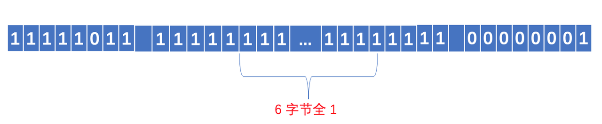

> 🔗 [原文链接](https://sunyunqiang.com/blog/protobuf_encode/)

Protobuf 是由 Google 设计的一种高效、轻量级的信息描述格式，起初是在 Google 内部使用，后来被开放出来，它具有语言中立、平台中立、高效、可扩展等特性，它非常适合用来做数据存储、RPC 数据交换等。与 json、xml 相比，Protobuf 的编码长度更短、传输效率更高，其实严格意义上讲，json、xml 并非是一种「编码」, 而只能称之为「格式」, json、xml 的内容本身都是字符形式，它们的编码采用的是 ASCII 编码，本文讲述 Protobuf 的底层编码原理，以便于了解 Protobuf 为什么编码长度短并且扩展性强，与此同时我们也将了解到它有哪些不足
Protobuf 的一个典型应用场景便是做通信的数据交换格式，它在通信管道上是以纯二进制的形式进行传输，发送端使用编码器将数据序列化为二进制，接收端使用解码器将收到的二进制流进行反序列化从而取得原始信息，因此当对通信管道进行抓包时无法获知数据的详细内容，事实上，同一段 Protobuf 的二进制数据流，在接收端使用不同的解码格式进行解码，可能得到完全不同的信息。在了解 Protobuf 的底层编码细节之前，需要首先了解 Protobuf 所用到的两种主要的编码方式，它们分别是 Varints 编码和 Zigzag 编码

### 1.1 Varints 编码

通常来说，普通的 int 数据类型，无论其值的大小，所占用的存储空间都是相等的，这点可以引起人们的思考，是否可以根据数值的大小来动态地占用存储空间，使得值比较小的数字占用较少的字节数，值相对比较大的数字占用较多的字节数，这便是变长整型编码的基本思想，采用变长整型编码的数字，其占用的字节数不是完全一致的，为了达到这一点，Varints 编码使用每个字节的最高有效位作为标志位，而剩余的 7 位以二进制补码的形式来存储数字值本身，当最高有效位为 1 时，代表其后还跟有字节，当最高有效位为 0 时，代表已经是该数字的最后的一个字节，在 Protobuf 中，使用的是 Base128 Varints 编码，之所以叫这个名字原因即是在这种方式中，使用 7 bit 来存储数字，在 Protobuf 中，Base128 Varints 采用的是小端序，即数字的低位存放在高地址，举例来看，对于数字 1, 我们假设 int 类型占 4 个字节，以标准的整型存储，其二进制表示应为

00000000 00000000 00000000 00000001

可见，只有最后一个字节存储了有效数值，前 3 个字节都是 0, 若采用 Varints 编码，其二进制形式为

00000001

因为其没有后续字节，因此其最高有效位为 0, 其余的 7 位以补码形式存放 1, 再比如数字 666, 其以标准的整型存储，其二进制表示为

00000000 00000000 00000010 10011010

而采用 Varints 编码，其二进制形式为

10011010 00000101

我们可以尝试来复原一下上面这个 Base128 Varints 编码的二进制串，首先看最高有效位，高 8 位的最高有效位为 1, 代表其后还跟有有效字节，低 8 位的最高有效位为 0, 代表其已是最后一个字节，由于 Protobuf 采用小端字节序存储数据，因此我们移除两个字节的最高有效位，并交换字节序便得到

1010011010

转换为十进制，即是数字 666

从上面的编码解码过程可以看出，可变长整型编码对于不同大小的数字，其所占用的存储空间是不同的，编码思想与 CPU 的间接寻址原理相似，都是用一比特来标识是否走到末尾，但采用这种方式存储数字，也有一个相对不好的点便是，无法对一个序列的数值进行随机查找，因为每个数字所占用的存储空间不是等长的，因此若要获得序列中的第 N 个数字，无法像等长存储那样在查找之前直接计算出 Offset, 只能从头开始顺序查找

### 1.2 Zigzag 编码

Varints 编码的实质在于去掉数字开头的 0, 因此可缩短数字所占的存储字节数，在上面的例子中，我们只举例说明了正数的 Varints 编码，但如果数字为负数，则采用 Varints 编码会恒定占用 10 个字节，原因在于负数的符号位为 1, 对于负数其从符号位开始的高位均为 1, 在 Protobuf 的具体实现中，会将此视为一个很大的无符号数，以 Go 语言的实现为例，对于 int32 类型的 pb 字段，对于如下定义的 proto
```proto
syntax = "proto3";
package pbTest;

message Request {
    int32 a = 1;
}
```
Request 中包含类型为 int32 类型的字段，当 a 为负数时，其序列化之后将恒定占用 10 个字节，我们可以使用如下的测试代码
``` go
func main() {
    a := pbTest.Request{
        A: -5,
    }
    bytes, err := proto.Marshal(&a)
    if err != nil {
        fmt.Println(err)
        return
    }
    fmt.Println(fmt.Sprintf("%08b", bytes))
}
```
对于 int32 类型的数字 -5, 其序列化之后的二进制为

<center>
    
</center>

究其原因在于 Protobuf 的内部将 int32 类型的负数转换为 uint64 来处理，转换后的 uint64 数值的高位全为 1, 相当于是一个 8 字节的很大的无符号数，因此采用 Base128 Varints 编码后将恒定占用 10 个字节的空间，可见 Varints 编码对于表示负数毫无优势，甚至比普通的固定 32 位存储还要多占 4 个字节。Varints 编码的实质在于设法移除数字开头的 0 比特，而对于负数，由于其数字高位都是 1, 因此 Varints 编码在此场景下失效，Zigzag 编码便是为了解决这个问题，Zigzag 编码的大致思想是首先对负数做一次变换，将其映射为一个正数，变换以后便可以使用 Varints 编码进行压缩，这里关键的一点在于变换的算法，首先算法必须是可逆的，即可以根据变换后的值计算出原始值，否则就无法解码，同时要求变换算法要尽可能简单，以避免影响 Protobuf 编码、解码的速度，我们假设 n 是一个 32 位类型的数字，则 Zigzag 编码的计算方式为

`(n << 1) ^ (n >> 31)`

要注意这里左边是逻辑移位，右边是算术移位，右边的含义实际是得到一个全 1 （对于负数） 或全 0 （对于正数）的比特序列，因为对于任意一个位数为 η 的有符号数 n, 其最高位为符号位，剩下的 η - 1 位为数字位，将其算术右移 η - 1 位，由于是算术移位，因此右移时左边产生的空位将由符号位来填充，进行 η - 1 次算术右移之后便得到 η 位与原先的符号位相等的序列，然后对两边按位异或便得到 Zigzag 编码，我们用一个图示来直观地说明 Zigzag 编码的设计思想，为了简化，我们假定数字是 16 位的，先来看负数的情形，假设数字为 -5, 其在内存中的形式为

11111111 11111011

首先对其进行一次逻辑左移，移位后空出的比特位由 0 填充

11111111 11110110

然后对原数字进行 15 次算术右移，得到 16 位全为原符号位（即 1) 的数字

11111111 11111111

然后对逻辑移位和算术移位的结果按位异或，便得到最终的 Zigzag 编码

00000000 00001001

可以看到，对负数使用 Zigzag 编码以后，其高位的 1 全部变成了 0, 这样以来我们便可以使用 Varints 编码进行进一步地压缩，再来看正数的情形，对于 16 位的正数 5, 其在内存中的存储形式为

00000000 00000101

我们按照与负数相同的处理方法，可以得到其 Zigzag 编码为

00000000 00001010

从上面的结果来看，无论是正数还是负数，经过 Zigzag 编码以后，数字高位都是 0, 这样以来，便可以进一步使用 Varints 编码进行数据压缩，即 Zigzag 编码在 Protobuf 中并不单独使用，而是配合 Varints 编码共同来进行数据压缩，Google 在 Protobuf 的官方文档中写道：
Google Protobuf
If you use int32 or int64 as the type for a negative number, the resulting varint is always ten bytes long – it is, effectively, treated like a very large unsigned integer. If you use one of the signed types, the resulting varint uses ZigZag encoding, which is much more efficient.

在上面的讨论中，我们了解了 Protobuf 所使用的 Varints 编码和 Zigzag 编码的编码原理，本节我们来讨论 Protobuf 的数据组织方式，首先来看一个例子，假设客户端和服务端使用 protobuf 作为数据交换格式，proto 的具体定义为
```proto
syntax = "proto3";
package pbTest;

message Request {
    int32 age = 1;
}
```
Request 中包含了一个名称为 name 的字段，客户端和服务端双方都用同一份相同的 proto 文件是没有任何问题的，假设客户端自己将 proto 文件做了修改，修改后的 proto 文件如下
```proto
syntax = "proto3";
package pbTest;

message Request {
    int32 age_test = 1;
}
```
在这种情形下，服务端不修改应用程序仍能够正确地解码，原因在于序列化后的 Protobuf 没有使用字段名称，而仅仅采用了字段编号，与 json xml 等相比，Protobuf 不是一种完全自描述的协议格式，即接收端在没有 proto 文件定义的前提下是无法解码一个 protobuf 消息体的，与此相对的，json xml 等协议格式是完全自描述的，拿到了 json 消息体，便可以知道这段消息体中有哪些字段，每个字段的值分别是什么，其实对于客户端和服务端通信双方来说，约定好了消息格式之后完全没有必要在每一条消息中都携带字段名称，Protobuf 在通信数据中移除字段名称，这可以大大降低消息的长度，提高通信效率，Protobuf 进一步将通信线路上消息类型做了划分，如下表所示

<center>
    
</center>

对于 int32, int64, uint32 等数据类型在序列化之后都会转为 Varints 编码，除去两种已标记为 deprecated 的类型，目前 Protobuf 在序列化之后的消息类型 (wire-type) 总共有 4 种，Protobuf 除了存储字段的值之外，还存储了字段的编号以及字段在通信线路上的格式类型 (wire-type), 具体的存储方式为

`field_num << 3 | wire type`

即将字段标号逻辑左移 3 位，然后与该字段的 wire type 的编号按位或，在上表中可以看到，wire type 总共有 6 种类型，因此可以用 3 位二进制来标识，所以低 3 位实际上存储了其后所跟的数据的 wire type, 接收端可以利用这些信息，结合 proto 文件来解码消息结构体，我们以上面 proto 为例来看一段 Protobuf 实际序列化之后的完整二进制数据，假设 age 为 5, 由于 age 在 proto 文件中定义的是 int32 类型，因此序列化之后它的 wire type 为 0, 其字段编号为 1, 因此按照上面的计算方式，即 1 << 3 | 0, 所以其类型和字段编号的信息只占 1 个字节，即 00001000, 后面跟上字段值 5 的 Varints 编码，所以整个结构体序列化之后为

<center>
    
</center>

有了字段编号和 wire type, 其后所跟的数据的长度便是确定的，因此 Protobuf 是一种非常紧密的数据组织格式，其不需要特别地加入额外的分隔符来分割一个消息字段，这可大大提升通信的效率，规避冗余的数据传输

### 1.4 总结

* Protobuf 是一种高效的数据描述格式，具有平台无关、语言无关、可扩展等特点，适合做数据存储、RPC 的通信协议等场景
* Protobuf 采用 Varints 编码和 Zigzag 编码来编码数据，其中 Varints 编码的思想是移除数字高位的 0, 用变长的二进制位来描述一个数字，对于小数字，其编码长度短，可提高数据传输效率，但由于它在每个字节的最高位额外采用了一个标志位来标记其后是否还跟有有效字节，因此对于大的正数，它会比使用普通的定长格式占用更多的空间，另外对于负数，直接采用 Varints 编码将恒定占用 10 个字节，Zigzag 编码可将负数映射为无符号的正数，然后采用 Varints 编码进行数据压缩，在各种语言的 Protobuf 实现中，对于 int32 类型的数据，Protobuf 都会转为 uint64 而后使用 Varints 编码来处理，因此当字段可能为负数时，我们应使用 sint32 或 sint64, 这样 Protobuf 会按照 Zigzag 编码将数据变换后再采用 Varints 编码进行压缩，从而缩短数据的二进制位数
* Protobuf 不是完全自描述的信息描述格式，接收端需要有相应的解码器（即 proto 定义）才可解析数据格式，序列化后的 Protobuf 数据不携带字段名，只使用字段编号来标识一个字段，因此更改 proto 的字段名不会影响数据解析（但这显然不是一种好的行为）, 字段编号会被编码进二进制的消息结构中，因此我们应尽可能地使用小字段编号
* Protobuf 是一种紧密的消息结构，编码后字段之间没有间隔，每个字段头由两部分组成：字段编号和 wire type, 字段头可确定数据段的长度，因此其字段之前无需加入间隔，也无需引入特定的数据来标记字段末尾，因此 Protobuf 的编码长度短，传输效率高
