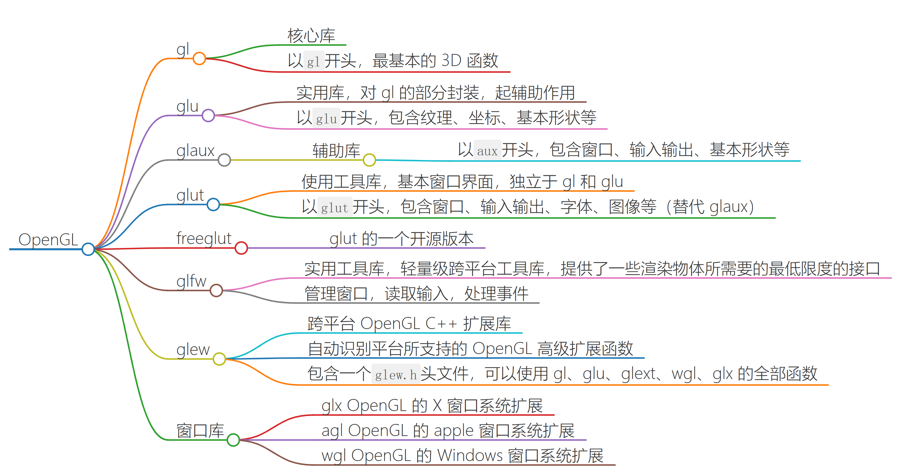
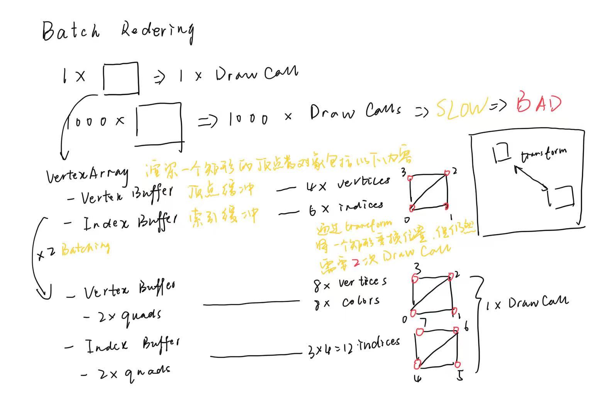

<center>
    
</center>

<!-- more -->

### 目录结构

```plaintext
|-- dependence
    |-- glew-2.1.0
    |-- glfw-3.4.bin.WIN32
    |-- glfw-3.4.bin.WIN64
        |-- include
        |-- ...
        |-- lib-static-ucrt
            |-- glfw3.dll
            |-- glfw3dll.dll
|-- src
    |-- HelloOpenGl.cpp
|-- xmake.lua
```

### xmake 配置

```lua
set_project("OpenGL Tutorial")
add_rules("mode.debug", "mode.release")

target("HelloOpenGL")
    set_kind("binary")
    add_files("src/*.cpp")
    add_includedirs("/dependence/glfw-3.4.bin.WIN64/include") -- include 文件
    add_includedirs("/dependence/glew-2.1.0/include")
    add_linkdirs("/dependence/glfw-3.4.bin.WIN64/lib-static-ucrt") -- gcc 编译的静态链接库目录
    add_linkdirs("/dependence/glew-2.1.0/lib/Release/Win32")
    add_linkdirs("/dependence/glew-2.1.0/bin/Release/x64")
    add_links("glfw3dll", "glew32") -- 链接 glfw 和 glew
    add_syslinks("opengl32") -- 链接系统库
```

### Notes

* 顶点着色器
  * 每个顶点运行一次
  * 确定位置
* 片段/像素着色器
  * 填充三角形的每个像素计算一次
* 为什么索引缓冲是`unsigned int`无符号的
* 错误处理
  * `glGetError`
  * 宏定义
* uniform 变量
* VAO vertex array object
  * 当空间中有多个对象、网格、顶点缓冲区等，每个都要进行绑定着色器、**绑定顶点缓冲区**、**设置顶点布局**、**绑定索引缓冲区**、调用 DrawCall 进行绘制
  * 绑定顶点缓冲区之后还要声明顶点缓冲区的布局，不同的顶点缓冲区有不同的布局
  * 实际上都是和 VAO 有关系
  * VAO 它将所有顶点绘制过程中的这些设置和绑定过程集中存储在一起
  * VAO 是否生效由配置文件类型决定的 The compalibility profile makes VAO object 0 a default object. The core OpenGL profile makes VAO object 0 not an object at all
  * 什么时候使用 VAO
    * 如果使用核心配置，就必须使用自定义的 VAO
    * 如果只使用兼容性配置，有一个默认的 VAO
* 着色器处理的步骤
  * 传入文件或者字符串，可以编译为着色器
  * 绑定和解绑着色器
  * 可以设置着色器中的不同的`uniform`
* 渲染器类
  * 调用 Draw Call 时需要顶点数组、索引缓冲区、着色器
  * 解绑不是必要的，解绑只会浪费性能
  * 正常会用材质替换着色器
* 如何通过 OpenGL 将硬盘中的 png 图片显示到屏幕上（png 并不是引擎直接使用的格式，大多数引擎都有自己的纹理格式）
  * 将图像加载到内存中——`stb_image`
  * 获取像素的数组，然后传到显存中——OpenGL
  * 通过着色器来读取纹理，并计算出真正的像素值——像素/片段着色器（绑定纹理）
  * 在 OpenGL 中，用 slots 来绑定纹理，可以一次性绑定多个纹理
    * 在 Windows 上有 32 个 slots
    * 在移动设备，Android 或 IOS 上可能会有 8 个 slots
  * OpenGL 加载纹理是从左下角开始，即左下角的坐标是`(0, 0)`，正常加载的图片是从左上角开始遍历，所以加载图片后需要垂直翻转
  * 纹理坐标
    * 指定每个顶点对应的纹理是什么，根据顶点对应的**纹理坐标**进行采样
    * 片段着色器会根据要渲染的像素的位置，进行插值计算具体的颜色值
* 混合
  * Blending determies how we combine our output color with what is already in our target buffer
    * Output: the color we output from our fragment shader 从片段着色器中输出的颜色 **SRC**
    * Target buffer: the buffer our fragment shader is drawing to 已经存在的缓冲区上的颜色 **DEST**
  * 如何控制混合
    * `glEnable`、`glDisable`
    * `glBlendFunc(src, dest)`
      * src: how the src RGBA factor is computed (default is `GL_ONE`) 默认是 1，每个通道都是单独计算的
      * dest: how the dest RGBA factor is computed (default is `GL_ZERO`) 默认是 0，也就是说 src 会覆盖到 dest 上面
    * `glBlendEquation(mode)`
      * mode: how we combine the src and dest colors
      * Default value is `GL_FUNC_ADD`
* 投影矩阵
  * 投影就是在多维空间中确定坐标系
  * 将场景中三维空间中的坐标转换到 NDC（Normalized Device Coordinates），即标准空间
  * 在窗口中渲染的内容的坐标范围必须从左到右在`[-1, 1]`之间，从上到下在`[-1, 1]`之间
  * 投影矩阵的作用就是决定坐标空间是什么样的
    * 无论是正交（Orthographic）处理后的顶点，还是透视（Perspective）处理后的顶点，最终都会映射到标准空间中
* 视图矩阵 相机的变换（位移和方向）
* 模型矩阵 对象的变换（位移、旋转、缩放，TRS）
* ImGui
  * 测试框架
    * 声明周期
    * 封装 ImGui
* 批渲染
  * 在一次 DrawCall 中渲染多个对象

<center>
    
</center>

#### 纹理的批渲染

* 颜色是 uniform 变量可以放到顶点缓冲中，但是不能把纹理放到顶点缓冲区中
* 但是可以像颜色一样提供纹理索引，这个索引在渲染 Quad 时，从顶点着色器传到片段着色器
* 片段着色器用作纹理数组和采样数组这些 uniform 的索引

C++ 代码中定义

```C++
// (x, y, x) 表示坐标
// (r, g, b, a) 表示颜色
// (u, v) 表示纹理
// texture_index 就是上面说的纹理索引，对应纹理槽位
float vertices[] = {
  x, y, z, r, g, b, a, u, v, texture_index_1,
  ...
  x, y, z, r, g, b, a, u, v, texture_index_2,
}
```

Shader 中的定义

```glsl
// vertex.shader
layout (location = 0) in vec3 position;
layout (location = 1) in vec4 color;
layout (location = 2) in vec2 texCoord;
layout (location = 3) in float texIndex;

...

out vec4 _color;
out vec2 _texCoord;
out float _texIndex;

// fragment.shader
layout (location = 0) out vec4 color;

uniform sampler2D textureSamplers[2];

in vec4 _color;
in vec2 _texCoord;
in float _texIndex;

void main()
{
  int index = int(_texIndex);
  color = texture(textureSamplers[index], _texCoord); // 根据索引进行采样
}
```

将纹理和槽绑定，利用 uniform 传递数据到 shader

```c++
glBindTextureUnit(0, texture1);
glBindTextureUnit(1, texture2);

auto loc = glGetUniformLocation(shader->GetRenderId(), "textureSamplers");
int samplers[2] = { 0, 1 };
glUniform1iv(loc, 2, samplers);
```

#### 动态顶点缓冲

预先分配好最大的顶点缓冲区的大小（比如 1KB）

* 将顶点数组用结构化的方式表示

```c++
struct Vertex
{
  float Position[3];
  float Color[4];
  float TexCoords[2];
  float TexId;
}
```

* 绑定缓冲数据时使用`GL_DYNAMIC_DRAW`类型
* 绑定顶点属性时`offset`使用内置函数`offsetof`来确定每种数据类型的偏移量

```c++
glBufferData(GL_ARRAY_BUFFER, sizeof(Vertex) * 1000, nullptr, GL_DYNAMIC_DRAW);
...
glVertexAttribPointer(0, 3, GL_FLOAT, GL_FALSE, sizeof(Vertex), (const void*)offsetof(Vertex, Position));
glVertexAttribPointer(1, 4, GL_FLOAT, GL_FALSE, sizeof(Vertex), (const void*)offsetof(Vertex, Color));
glVertexAttribPointer(2, 2, GL_FLOAT, GL_FALSE, sizeof(Vertex), (const void*)offsetof(Vertex, TexCoords));
glVertexAttribPointer(3, 1, GL_FLOAT, GL_FALSE, sizeof(Vertex), (const void*)offsetof(Vertex, TexId));
```

* 动态绑定顶点缓冲

```c++
// 一个 quad 需要四个点
std::array<Vertex, 4> CreateQuad(float x, float y, float texId)
{
  Vertex v0;
  ...
  Vertex v1;
  ...
  Vertex v2;
  ...
  Vertex v3;
  ...
  return { v0, v1, v2, v3 };
}

auto q0 = CreateQuad(-1.5f, -0.5f, 0.0f);
auto q1 = CreateQuad(0.5f, -0.5f, 1.0f);

// 通过内存拷贝的方式直接将`std::array`中的内容拷贝到一维数组中
Vertex vertices[8];
memcpy(vertices, q0.data(), q0.size() * sizeof(Vertex));
memcpy(vertices + q0.size(), q1.data(), q0.size() * sizeof(Vertex));
...
glBufferSubData(GL_ARRAY_BUFFER, 0, sizeof(vertices), vertices);
```

#### 动态索引缓冲

* 首先确定绘制的最大的 Quad 的数量`maxQuadCount`
* 由`maxQuadCount`确定顶点数量（`maxQuadCount * 4`）和索引数量（`maxQuadCount * 6`）

```c++
uint32_t indices[maxQuadCount * 6];
uint32_t offset = 0;
for (size_t i = 0; i < maxQuadCount * 6; i += 6)
{
  indices[i + 0] = 0 + offset;
  indices[i + 1] = 1 + offset;
  indices[i + 2] = 2 + offset;

  indices[i + 3] = 2 + offset;
  indices[i + 4] = 3 + offset;
  indices[i + 5] = 0 + offset;

  offset += 4;
}
```

* 更改`CreateQuad`函数，传入预先定义好大小的顶点数据结构数组，如`std::array<Vertex, 1000>`，同时增加顶点索引数量

```c++
Vertex* CreateQuad(Vertex* target, float x, float y, float textureId)
{
  target->Position = { x, y, 0.0f };
  target->Color = { 0.18f, 0.6f, 0.96f, 1.0f };
  target->TexCoors = { 0.0f, 0.0f };
  target->TexId = textureId;
  target++;
  ...

  return target;
}

size_t indexCount = 0
std::array<Vertex, 1000> vertices;
Vertex* buffer = vertices.data();

for (int y = 0; y < 5; y++)
{
  for (int x = 0; x < 5; x++)
  {
    buffer = CreateQuad(buffer, x, y, (x + y) % 2);
    indexCount += 6;
  }
}

glBufferSubData(GL_ARRAY_BUFFER, 0, vertices.size() * sizeof(Vertex), vertices.data());
...
glDrawElements(GL_TRIANGLE, indexCount, GL_UNSIGNED_INT, nullptr);
```

### APIs

* `glGenBuffers`: Generate buffer object names 生成缓冲区的标识
  * `n`: Specifies the number of buffer object names to be generated 需要缓冲区标识的数量
  * `buffers`: Specifies an array in which the generated buffer object names are stored 用于存放缓冲区标识
* `glBindBuffer`： Bind a named buffer object 绑定缓冲区标识的对象类型

  `glBindBuffer` binds a buffer object to the specified buffer binding point. Calling `glBindBuffer` with target set to one of the accepted symbolic constants and buffer set to the name of a buffer object binds that buffer object name to the target. If no buffer object with name buffer exists, one is created with that name. When a buffer object is bound to a target, the previous binding for that target is automatically broken.
  `glBindBuffer`函数将缓冲对象绑定到 OpenGL 上下文环境中，调用`glBindBuffer`函数，需要将 target 设置为一个符号常量（指定缓冲对象的类型），将 buffer 设置为缓冲对象的标识符，这样就将缓冲对象和标识符进行绑定了。如果标识符没有关联缓冲对象，就创建一个缓冲对象。当缓冲对象已经确定好对象类型，之前绑定的类型就会失效

  Buffer object names are unsigned integers. The value zero is reserved, but there is no default buffer object for each buffer object target. Instead, buffer set to zero effectively unbinds any buffer object previously bound, and restores client memory usage for that buffer object target (if supported for that target). Buffer object names and the corresponding buffer object contents are local to the shared object space of the current GL rendering context; two rendering contexts share buffer object names only if they explicitly enable sharing between contexts through the appropriate GL windows interfaces functions.
  因为缓冲区对象标识符是无符号类型的整数（非负整数），如果标识符是 0 意味着缓冲区对象类型没有绑定任何缓冲区对象，这样可以将 buffer 参数设置为 0 表示从缓冲区对象类型和缓冲区解绑，同时也会清除原来缓冲区中的内容。
  * `target`: Specifies the target to which the buffer object is bound
    * `GL_ARRAY_BUFFER`: Vertex attributes
    * `GL_ATOMIC_COUNTER_BUFFER`: Atomic counter storage
    * `GL_COPY_READ_BUFFER`: Buffer copy source
    * `GL_COPY_WRITE_BUFFER`: Buffer copy destination
    * `GL_DISPATCH_INDIRECT_BUFFER`: Indirect compute dispatch commands
    * `GL_DRAW_INDIRECT_BUFFER`: Indirect command arguments
    * `GL_ELEMENT_ARRAY_BUFFER`: Vertex array indices
    * `GL_PIXEL_PACK_BUFFER`: Pixel read target
    * `GL_PIXEL_UNPACK_BUFFER`: Texture data source
    * `GL_QUERY_BUFFER`: Query result buffer
    * `GL_SHADER_STORAGE_BUFFER`: Read-write storage for shaders
    * `GL_TEXTURE_BUFFER`: Texture data buffer
    * `GL_TRANSFORM_FEEDBACK_BUFFER`: Transform feedback buffer
    * `GL_UNIFORM_BUFFER`: Uniform block storage
  * `buffer`: Specifies the name of a buffer object
* `glBufferData`: 用来把用户定义的数据复制到当前绑定缓冲的函数
  * `GLenum target`: 目标缓冲的类型
  * `GLsizeiptr size`: 传输数据的大小（以字节为单位），一般用`sizeof()`函数
  * `const void * data`: 实际数据
  * `GLenum usage`: 显卡如何管理给定的数据
    * `GL_STATIC_DRAW`: 数据不会或几乎不会改变
    * `GL_DYNAMIC_DRAW`: 数据会被改变很多
    * `GL_STREAM_DRAW`: 数据每次绘制时都会改变
* `glVertexAttribPointer`: 将 CPU 的数组缓冲区绑定到 GPU 的顶点缓冲区
  * `GLuint index`: Specifies the index of the generic vertex attribute to be modified 顶点属性的位置
  * `GLint size`: Specifies the number of components per generic vertex attribute. Must be 1, 2, 3, 4. Additionally, the symbolic constant `GL_BGRA` is accepted by `glVertexAttribPointer`. The initial value is 4 顶点每个属性的元素数量，一定是 1，2，3，4 中的一个数。~~当`type`为`GL_BGRA`时，初始值是 4~~
  * `GLenum type`: Specifies the data type of each component in the array. 顶点每个属性的元素的数据类型枚举
  * `GLboolean normalized`: Specifies whether fixed-point data values should be normalized (`GL_TRUE`) or converted directly as fixed-point values (`GL_FALSE`) when they are accessed 如果设置为`GL_TRUE`，所有数据都会被映射到`[0, 1]`之间（对于有符号类型的数据是`[-1, 1]`之间）
  * `GLsizei stride`: Specifies the byte offset between consecutive generic vertex attributes. If stride​ is 0, the generic vertex attributes are understood to be tightly packed in the array. The initial value is 0 在顶点若干属性中两个相同属性之间的步长，如果步长是 0
  * `const void * pointer`: Specifies a offset of the first component of the first generic vertex attribute in the array in the data store of the buffer currently bound to the `GL_ARRAY_BUFFER` target. The initial value is 0. 每个顶点属性相对于起始属性的偏移量的指针的位置
* `glGetError`: 返回错误标志的值。每个可检测的错误都分配有数字代码和符号名称。发生错误时，错误标志将设置为相应的错误代码值。在调用`glGetError`（返回错误代码）之前，不会记录其他错误，并将标志重置为`GL_NO_ERROR`。如果对`glGetError`的调用返回`GL_NO_ERROR`，则自上次调用`glGetError`或自 GL 初始化以来，没有可检测到的错误
* `glGenTextures`: generate texture names

  `glGenTextures` returns n texture names in textures. There is no guarantee that the names form a contiguous set of integers; however, it is guaranteed that none of the returned names was in use immediately before the call to `glGenTextures` 能够保证在调用`glGenTextures`前返回的标识符是没有被用过的

  The generated textures have no dimensionality; they assume the dimensionality of the texture target to which they are first bound 生成的纹理是没有维度的，假定纹理的维度是第一次绑定的维度（不是很理解）

  Texture names returned by a call to `glGenTextures` are not returned by subsequent calls, unless they are first deleted with `glDeleteTextures` 连续调用`glGenTextures`不会返回表示符了，除非先调用`glDeleteTextures`删除纹理
* `glBindTexture`： 将一个纹理标识符绑定到一个纹理对象上
  Texture names and the corresponding texture contents are local to the shared object space of the current GL rendering context; two rendering contexts share texture names only if they explicitly enable sharing between contexts through the appropriate GL windows interfaces functions. 对于当前的 GL 渲染上下文中的共享对象空间，纹理名称以及它们对应的纹理内容是局部的；只有在显式开启上下文之间的共享，两个渲染上下文才可以共享纹理名称
* `glTexParameteri`
* `glTexImage2D`
* `glActiveTexture`
* `glClear`
  * 不调用`glClear`的话，下一帧的内容会和上一帧的内容重叠在一起，上一帧的物体还在原来的地方
  * `glClearColor`
    * 指定刷新颜色缓冲区时所用的颜色
    * `glClearColor`只是设置缓冲区颜色，并不不会清除缓冲区的颜色，需要在设置好颜色之后调用`glClear`才会刷新缓冲区的颜色
    * `glClearColor`并不是必须的
* `glUniform1iv`
