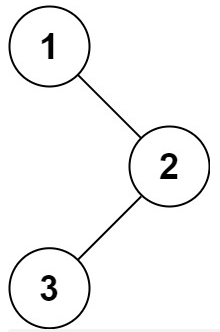
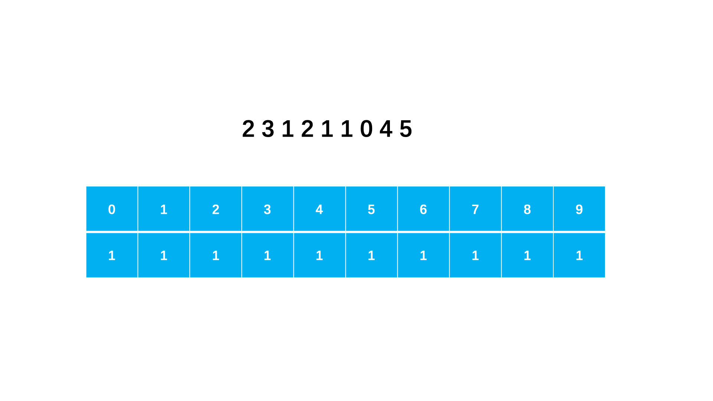
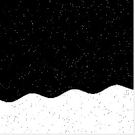
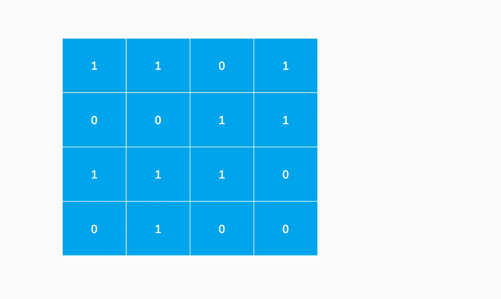

## 反转链表

描述
给定一个单链表的头结点 pHead（该头节点是有值的，比如在下图，它的 val 是 1)，长度为 n，反转该链表后，返回新链表的表头。

数据范围：$0 \leq n \leq 1000$

要求：空间复杂度$O(1)$，时间复杂度$O(n)$。

如当输入链表`{1, 2, 3}`时，
经反转后，原链表变为`{3, 2, 1}`，所以对应的输出为`{3, 2, 1}`。
以上转换过程如下图所示：

<center>
    
</center>

### Solution

```c++
/**
 * struct ListNode {
 *	int val;
 *	struct ListNode *next;
 *	ListNode(int x) : val(x), next(nullptr) {}
 * };
 */
class Solution {
public:
    /**
     * 代码中的类名、方法名、参数名已经指定，请勿修改，直接返回方法规定的值即可
     *
     * 
     * @param head ListNode 类 
     * @return ListNode 类
     */
    ListNode* ReverseList(ListNode* head) {
        // write code here
        if (head == nullptr || head->next == nullptr)
            return head;
        auto p = head->next;
        head->next = nullptr;
        while (p) {
            auto q = p->next;
            p->next = head;
            head = p;
            p = q;
        }
        return head;
    }
};
```

## 二叉树遍历

* 前序遍历：根节点、左子节点、右子节点
* 中序遍历：左子节点、根节点、右子节点
* 后序遍历：左子节点、右子节点、根节点


根据根节点的位置确定遍历的类别


### 前序遍历

给你二叉树的根节点 root ，返回它节点值的前序遍历。

数据范围：二叉树的节点数量满足$0 \leq n \leq 100$，二叉树节点的值满足$0 \leq val \leq 1000$，树的各节点的值各不相同

<center>
    
</center>

#### Solution

```c++
/**
 * struct TreeNode {
 *	int val;
 *	struct TreeNode *left;
 *	struct TreeNode *right;
 *	TreeNode(int x) : val(x), left(nullptr), right(nullptr) {}
 * };
 */
class Solution {
public:
    /**
     * 代码中的类名、方法名、参数名已经指定，请勿修改，直接返回方法规定的值即可
     *
     * 
     * @param root TreeNode 类 
     * @return int 整型 vector
     */
    vector<int> preorderTraversal(TreeNode* root) {
        // write code here
        vector<int> res;
        if (!root)
            return res;
        stack<TreeNode*> container;
        container.push(root);
        while (!container.empty()) {
            auto node = container.top();
            res.push_back(node->val);
            container.pop();
            if (node->right) container.push(node->right);
            if (node->left) container.push(node->left);
        }
        return res;
    }
};
```

## 合并两个有序数组

给你两个按非递减顺序排列的整数数组`nums1`和`nums2`，另有两个整数`m`和`n`，分别表示`nums1`和`nums2`中的元素数目。

请你合并`nums2`到`nums1`中，使合并后的数组同样按非递减顺序排列。

注意：最终，合并后数组不应由函数返回，而是存储在数组`nums1`中。为了应对这种情况，`nums1`的初始长度为`m+n`，其中前`m`个元素表示应合并的元素，后`n`个元素为`0`，应忽略。`nums2`的长度为`n`。


示例 1：

输入：`nums1=[1,2,3,0,0,0],m=3,nums2=[2,5,6],n=3`
输出：`[1,2,2,3,5,6]`
解释：需要合并`[1,2,3]`和`[2,5,6]`。
合并结果是`[1,2,2,3,5,6]`，其中斜体加粗标注的为`nums1`中的元素。




示例 2：

输入：`nums1=[1],m=1,nums2=[],n=0`
输出：`[1]`
解释：需要合并`[1]`和`[]`。
合并结果是`[1]`。




示例 3：

输入：`nums1=[0],m=0,nums2=[1],n=1`
输出：`[1]`
解释：需要合并的数组是`[]`和`[1]`。
合并结果是`[1]`。
注意，因为`m=0`，所以`nums1``中没有元素。nums1`中仅存的`0`仅仅是为了确保合并结果可以顺利存放到`nums1`中。


### Solution

```c++
class Solution {
public:
    void merge(vector<int>& nums1, int m, vector<int>& nums2, int n) {
        int i = m - 1;
        int j = n - 1;
        int p = m + n - 1;
        while (p >= 0 && j >= 0) {
            if (i < 0) {
                nums1[p] = nums2[j];
                p--;
                j--;
            }
            else if (nums2[j] >= nums1[i]) {
                nums1[p] = nums2[j];
                p--;
                j--;
            }
            else {
                swap(nums1[i], nums1[p]);
                p--;
                i--;
            }
        }
    }
};
```

```c++
class Solution {
public:
    void merge(vector<int>& nums1, int m, vector<int>& nums2, int n) {
        int i = m - 1; // nums1 的有效部分的最后一个元素的索引
        int j = n - 1; // nums2 的最后一个元素的索引
        int k = m + n - 1; // 合并后数组的最后一个位置的索引

        // 从后往前合并
        while (i >= 0 && j >= 0) {
            if (nums1[i] > nums2[j]) {
                nums1[k--] = nums1[i--];
            } else {
                nums1[k--] = nums2[j--];
            }
        }

        // 如果 nums2 中还有剩余的元素，继续放入 nums1
        while (j >= 0) {
            nums1[k--] = nums2[j--];
        }
    }
};
```

## 完全平方数

给你一个整数 `n` ，返回 和为 `n` 的完全平方数的最少数量 。

完全平方数 是一个整数，其值等于另一个整数的平方；换句话说，其值等于一个整数自乘的积。例如，1、4、9 和 16 都是完全平方数，而 3 和 11 不是。


示例 1：

输入：n = 12
输出：3
解释：12 = 4 + 4 + 4



示例 2：

输入：n = 13
输出：2
解释：13 = 4 + 9


### 思路及算法

我们可以依据题目的要求写出状态表达式：$f(i)$表示最少需要多少个数的平方来表示整数$i$。

这些数必然落在区间$[1, \sqrt{n}]$。我们可以枚举这些数，假设当前枚举到$j$，那么我们还需要取若干数的平方，构成$i - j^2$。此时我们发现该子问题和原问题类似，只是规模变小了。这符合了动态规划的要求，于是我们可以写出状态转移方程。

$$
f(i) = 1 + \min_{j = 1}^{\sqrt{i}}{f(i - j^2)}
$$

其中$f(0) = 0$为边界条件，实际上我们无法表示数字 0，只是为了保证状态转移过程中遇到$j$恰为$\sqrt{i}$的情况合法。

同时因为计算$f(i)$时所需要用到$f(i - j^2)$的状态仅有，必然小于$i$，因此我们只需要从小到大地枚举$i$来计算$f(i)$即可。

### Solution

```c++
class Solution {
public:
    int numSquares(int n) {
        vector<int> f(n + 1);
        for (int i = 1; i <= n; i++) {
            int minn = INT_MAX;
            for (int j = 1; j * j <= i; j++) {
                minn = min(minn, f[i - j * j]);
            }
            f[i] = minn + 1;
        }
        return f[n];
    }
};
```

## 把数字翻译成字符串

有一种将字母编码成数字的方式：'a'->1, 'b->2', ... , 'z->26'。

现在给一串数字，返回有多少种可能的译码结果

### 思路及算法

动态规划算法的基本思想是：将待求解的问题分解成若干个相互联系的子问题，先求解子问题，然后从这些子问题的解得到原问题的解；对于重复出现的子问题，只在第一次遇到的时候对它进行求解，并把答案保存起来，让以后再次遇到时直接引用答案，不必重新求解。动态规划算法将问题的解决方案视为一系列决策的结果

思路：

对于普通数组 1-9，译码方式只有一种，但是对于 11-19，21-26，译码方式有可选择的两种方案，因此我们使用动态规划将两种方案累计。

具体做法：

step 1：用辅助数组`dp`表示前`i`个数的译码方法有多少种。
step 2：对于一个数，我们可以直接译码它，也可以将其与前面的 1 或者 2 组合起来译码：如果直接译码，则`dp[i] = dp[i − 1]`；如果组合译码，则`dp[i] = dp[i − 2]`。
step 3：对于只有一种译码方式的，选上种`dp[i−1]`即可，对于满足两种译码方式（10，20 不能）则是`dp[i − 1] + dp[i − 2]`
step 4：依次相加，最后的`dp[length]`即为所求答案。

图示：

<center>
    
</center>

### Solution

```c++
class Solution {
public:
    int solve(string nums) {
        //排除 0
        if(nums == "0")  
            return 0;
        //排除只有一种可能的 10 和 20
        if(nums == "10" || nums == "20")  
            return 1;
        //当 0 的前面不是 1 或 2 时，无法译码，0 种
        for(int i = 1; i < nums.length(); i++){  
            if(nums[i] == '0')
                if(nums[i - 1] != '1' && nums[i - 1] != '2')
                    return 0;
        }
        //辅助数组初始化为 1
        vector<int> dp(nums.length() + 1, 1);  
        for(int i = 2; i <= nums.length(); i++){
            //在 11-19，21-26 之间的情况
            if((nums[i - 2] == '1' && nums[i - 1] != '0') || (nums[i - 2] == '2' && nums[i - 1] > '0' && nums[i - 1] < '7'))
               dp[i] = dp[i - 1] + dp[i - 2];
            else
                dp[i] = dp[i - 1];
        }
        return dp[nums.length()];
    }
};
```

## 最小区间

你有`k`个非递减排列的整数列表。找到一个最小区间，使得`k`个列表中的每个列表至少有一个数包含在其中。

我们定义如果`b - a < d - c`或者在`b - a == d - c`时`a < c`，则区间`[a, b]`比`[c, d]`小。


示例 1：

输入：`nums = [[4,10,15,24,26], [0,9,12,20], [5,18,22,30]]`
输出：`[20,24]`
解释：
列表 1：`[4, 10, 15, 24, 26]`，`24`在区间`[20,24]`中。
列表 2：`[0, 9, 12, 20]`，`20`在区间`[20,24]`中。
列表 3：`[5, 18, 22, 30]`，`22`在区间`[20,24]`中。



示例 2：

输入：`nums = [[1,2,3],[1,2,3],[1,2,3]]`
输出：`[1,1]`


### 思路

给定$k$个列表，需要找到最小区间，使得每个列表都至少有一个数在该区间中。该问题可以转化为，从$k$个列表中各取一个数，使得这$k$个数中的最大值与最小值的差最小。

假设这$k$个数中的最小值是第$i$个列表中的$x$，对于任意$j \neq i$，设第$j$个列表中被选为$k$个数之一的数是$y$，则为了找到最小区间，$y$应该取第$j$个列表中大于等于$x$的最小的数，这是一个贪心的策略。贪心策略的正确性简单证明如下：假设$z$也是第$j$个列表中的数，且$z > y$，则有$z − x > y − x$，同时包含$x$和$z$的区间一定不会小于同时包含$x$和$y$的区间。因此，其余$k − 1$个列表中应该取大于等于$x$的最小的数。

由于$k$个列表都是升序排列的，因此对每个列表维护一个指针，通过指针得到列表中的元素，指针右移之后指向的元素一定大于或等于之前的元素。

使用最小堆维护$k$个指针指向的元素中的最小值，同时维护堆中元素的最大值。初始时，$k$个指针都指向下标 0，最大元素即为所有列表的下标 0 位置的元素中的最大值。每次从堆中取出最小值，根据最大值和最小值计算当前区间，如果当前区间小于最小区间则用当前区间更新最小区间，然后将对应列表的指针右移，将新元素加入堆中，并更新堆中元素的最大值。

如果一个列表的指针超出该列表的下标范围，则说明该列表中的所有元素都被遍历过，堆中不会再有该列表中的元素，因此退出循环。

### Solution

```c++
class Solution {
public:
    vector<int> smallestRange(vector<vector<int>>& nums) {
        int rangeLeft = 0, rangeRight = INT_MAX;
        int size = nums.size();
        vector<int> next(size);
        
        auto cmp = [&](const int& u, const int& v) {
            return nums[u][next[u]] > nums[v][next[v]];
        };
        priority_queue<int, vector<int>, decltype(cmp)> pq(cmp);
        int minValue = 0, maxValue = INT_MIN;
        for (int i = 0; i < size; ++i) {
            pq.emplace(i);
            maxValue = max(maxValue, nums[i][0]);
        }

        while (true) {
            int row = pq.top();
            pq.pop();
            minValue = nums[row][next[row]];
            if (maxValue - minValue < rangeRight - rangeLeft) {
                rangeLeft = minValue;
                rangeRight = maxValue;
            }
            if (next[row] == nums[row].size() - 1) {
                break;
            }
            ++next[row];
            maxValue = max(maxValue, nums[row][next[row]]);
            pq.emplace(row);
        }

        return {rangeLeft, rangeRight};
    }
};
```

## Water

给定四个空杯子，容量分别为 S1 S2 S3 S4，允许进行以下操作：

1. 将某个杯子接满水
2. 将某个杯子里的水全部倒掉
3. 将杯子 A 中的水倒进杯子 B，直到 A 倒空或者 B 被倒满

问最少要多少步操作才能使得这四个杯子装的水分别为 T1 T2 T3 T4



```plaintext
输入例子：
0 2 3 4
0 1 2 4

输出例子：
6

例子说明：
    (0,0,0,0) ->
    (0,2,0,0) ->
    (0,2,3,0) ->
    (0,2,0,3) ->
    (0,0,2,3) ->
    (0,2,2,3) ->
    (0,1,2,4)
```



### Solution

```c++
#include<bits/stdc++.h>
using namespace std;

bool mem[64][64][64][64] = { false };

bool equal(int s[4], int T[4]) {
    return (s[0] == T[0]) && (s[1] == T[1]) && (s[2] == T[2]) && (s[3] == T[3]);
}

int bfs(int S[4], int T[4]) {
    queue<tuple<int,int,int,int>> q;
    auto x = make_tuple(0, 0, 0, 0);
    q.push(x);
    mem[0][0][0][0] = true;
    int step = 0, cap[4] = { 0 };
    while (!q.empty()) {
        int size = q.size();
        while (size--) {
            tie(cap[0], cap[1], cap[2], cap[3]) = q.front(); q.pop();
            if(equal(cap, T)) {
                return step;
            }
            for (int i = 0; i < 3; ++i) {
                switch (i) {
                    case 0: // 将某个杯子倒满
                        for (int j = 0, tmp = 0; j < 4; ++j){
                            tmp = cap[j];
                            cap[j] = S[j];
                            x = make_tuple(cap[0], cap[1], cap[2], cap[3]);
                            if(!mem[cap[0]][cap[1]][cap[2]][cap[3]]) {
                                mem[cap[0]][cap[1]][cap[2]][cap[3]] = true;
                                q.push(x);
                            }
                            cap[j] = tmp;
                        }
                        break;
                    case 1: // 将某个杯子倒空
                        for (int j = 0, tmp = 0; j < 4; ++j) {
                            tmp = cap[j];
                            cap[j] = 0;
                            x = make_tuple(cap[0], cap[1], cap[2], cap[3]);
                            if(!mem[cap[0]][cap[1]][cap[2]][cap[3]]) {
                                mem[cap[0]][cap[1]][cap[2]][cap[3]]=true;
                                q.push(x);
                            }
                            cap[j] = tmp;
                        }
                        break;
                    case 2: // 将杯子 j 倒向杯子 z
                        for (int j = 0; j < 4; ++j) {
                            int tmp1,tmp2,need;
                            for (int z = 0; z < 4; ++z){
                                if (j == z) continue;
                                tmp1 = cap[j], tmp2 = cap[z];
                                need = min(cap[j], S[z]-cap[z]);
                                cap[j] -= need;
                                cap[z] += need;
                                x = make_tuple(cap[0], cap[1], cap[2], cap[3]);
                                if (!mem[cap[0]][cap[1]][cap[2]][cap[3]]) {
                                    mem[cap[0]][cap[1]][cap[2]][cap[3]] = true;
                                    q.push(x);
                                }
                                cap[j] = tmp1, cap[z] = tmp2;
                            }
                        }
                }//end switch
            }
        }//end inner while
        ++step;
    }//end outer while
    return -1;
}

int main(){
    int S[4] = {0}, T[4] = {0};
    cin >> S[0] >> S[1] >> S[2] >> S[3];
    cin >> T[0] >> T[1] >> T[2] >> T[3];
    if (S[0] == 0 && S[1] == 0 && S[2] == 0 && S[3] == 0 && !equal(S,T)) {
        cout << -1 << endl;
    } else {
        int ret = bfs(S, T);
        cout << ret << endl;
    }
    return 0;
}
```

## 分割后处理

研究地球空间科学的永强想研究海岸线的长度和海岸线面积之间的关系，为此他找来了很多航拍图像。在航拍图像上利用图像分割的方法，把图像的每个像素标记成陆地（1）和水面（0）。

示例图片：

<center>
    
</center>

现在永强想知道每张图中陆地部分的面积。

已知每张图最底部的一条边都是陆地，并且在一张图上陆地都是四邻域联通的。

但是永强发现分割的结果有很多的噪声，于是他定义了如下规则试图去除噪声：

* 如果一个水面区域被陆地包围，则将这个区域记为陆地；
* 在 a 的基础上如果一个陆地区域不和底边的陆地相连，那么这是一个岛屿，不计入陆地的面积。



```plaintext
输入例子：
5 6
1 0 0 1 0 0
0 0 1 0 1 0
1 1 1 1 1 0
1 0 0 1 1 1
1 1 1 1 1 1

输出例子：
21
```



### 思路

* 从边缘且为水的位置开始遍历，将所有没有被陆地包围的水标记为 2
  
  ```text
  1 2 2 1 2 2
  2 2 1 0 1 2 
  1 1 1 1 1 2 
  1 0 0 1 1 1 
  1 1 1 1 1 1
  ```

* 将被陆地包围的水标记为 1（陆地）

  ```text
  1 2 2 1 2 2 
  2 2 1 1 1 2 
  1 1 1 1 1 2 
  1 1 1 1 1 1 
  1 1 1 1 1 1
  ```

* 从下边缘且为陆地的位置开始遍历，标记所有陆地为 3，同时计算面积

  ```text
  1 2 2 3 2 2
  2 2 3 3 3 2 
  3 3 3 3 3 2 
  3 3 3 3 3 3 
  3 3 3 3 3 3
  ```

此时岛屿标记为 1，水标记为 2，陆地标记为 3

### Solution

```c++
#include <bits/stdc++.h>
using namespace std;

int result = 0;

void surround(vector<vector<int>>& pic, int i, int j) {
    if (i < 0 || i >= pic.size() || j < 0 || j >= pic[0].size() || pic[i][j] == 1 || pic[i][j] == 2) return;
    pic[i][j] = 2;
    int dx[4] = {-1, 1, 0, 0};
    int dy[4] = {0, 0, -1, 1};
    for (int k = 0; k < 4; k++) {
        surround(pic, i + dx[k], j + dy[k]);
    }
}

void cal_area(vector<vector<int>>& pic, int i, int j) {
    if (i < 0 || i >= pic.size() || j < 0 || j >= pic[0].size() || pic[i][j] == 2 || pic[i][j] == 3) return;
    pic[i][j] = 3;
    result++;
    int dx[4] = {-1, 1, 0, 0};
    int dy[4] = {0, 0, -1, 1};
    for (int k = 0; k < 4; k++) {
        cal_area(pic, i + dx[k], j + dy[k]);
    }
}

int main() {
    int m, n;
    cin >> m >> n;
    vector<vector<int>> pic(m, vector<int> (n, 0));
    for (int i = 0; i < m; i++) {
        for (int j = 0; j < n; j++){
            cin >> pic[i][j];
        }
    }
    // 1. 从边缘且为水的位置开始遍历，将所有没有被陆地包围的水标记为 2
    for (int i = 0; i < m; i++) {
        for (int j = 0; j < n; j++){
            bool edge = i == 0 || i == m - 1 || j == 0 || j == n - 1;
            if (pic[i][j] == 0 && edge) {
                surround(pic, i, j);
            }
        }
    }
    // 2. 将被陆地包围的水标记为 1（陆地）
    for (int i = 0; i < m; i++) {
        for (int j = 0; j < n; j++){
            if (pic[i][j] == 0) {
                pic[i][j] = 1;
            }
        }
    }
    // 3. 从下边缘且为陆地的位置开始遍历，标记所有陆地为 3，同时计算面积
    for (int i = 0; i < m; i++) {
        for (int j = 0; j < n; j++){
           bool bottom = i == m - 1;
           if (pic[i][j] == 1 && bottom) {
               cal_area(pic, i, j);
            }
        }
    }
    cout << result << endl;
    return 0;
}
```

## 删除有序链表中重复的元素

### I

删除给出链表中的重复元素（链表中元素从小到大有序），使链表中的所有元素都只出现一次
例如：
给出的链表为`1 → 1 → 2`, 返回`1 → 2`
给出的链表为`1 → 1 → 2 → 3 → 3`, 返回`1 → 2 → 3`

#### Solution

```c++
/**
 * struct ListNode {
 * int val;
 * struct ListNode *next;
 * ListNode(int x) : val(x), next(nullptr) {}
 * };
 */
class Solution {
public:
    /**
     * 代码中的类名、方法名、参数名已经指定，请勿修改，直接返回方法规定的值即可
     *
     * 
     * @param head ListNode 类 
     * @return ListNode 类
     */
    ListNode* deleteDuplicates(ListNode* head) {
        // write code here
        if (head == nullptr)
            return head;
        auto p = head;
        auto q = p->next;
        while (q) {
            if (p->val == q->val) {
                p->next = q->next;
            }
            else {
                p = p->next;
            }
            q = q->next;
        }
        return head;
    }
};
```

### II

给出一个升序排序的链表，删除链表中的所有重复出现的元素，只保留原链表中只出现一次的元素。
例如：
给出的链表为`1 → 2 → 3 → 3 → 4 → 4 → 5`, 返回`1 → 2 → 5`
给出的链表为`1 → 1 → 1 → 2 → 3`, 返回`2 → 3`

<center>
    
</center>

#### Solution

```c++
/**
 * struct ListNode {
 *	int val;
 *	struct ListNode *next;
 *	ListNode(int x) : val(x), next(nullptr) {}
 * };
 */
class Solution {
public:
    /**
     * 代码中的类名、方法名、参数名已经指定，请勿修改，直接返回方法规定的值即可
     *
     * 
     * @param head ListNode 类 
     * @return ListNode 类
     */
    ListNode* deleteDuplicates(ListNode* head) {
        // write code here
        if (head == nullptr)
            return head;
        auto p = head;
        auto q = head->next;
        if (q == nullptr)
            return head;
        auto* h = new ListNode(0);
        h->next = head;
        head = h;
        while (q) {
            if (p->val != q->val) {
                h = p;
                p = q;
                q = q->next;
            }
            else {
                while (q && q->val == p->val) {
                    q = q->next;
                }
                h->next = p = q;
                if (q) q = q->next;
            }
        }
        return head->next;
    }
};
```

```c++
class Solution {
public:
    ListNode* deleteDuplicates(ListNode* head) {
        //空链表
        if(head == NULL) 
            return NULL;
        ListNode* res = new ListNode(0);
        //在链表前加一个表头
        res->next = head; 
        ListNode* cur = res;
        while(cur->next != NULL && cur->next->next != NULL){ 
            //遇到相邻两个节点值相同
            if(cur->next->val == cur->next->next->val){ 
                int temp = cur->next->val;
                //将所有相同的都跳过
                while (cur->next != NULL && cur->next->val == temp) 
                    cur->next = cur->next->next;
            }
            else 
                cur = cur->next;
        }
        //返回时去掉表头
        return res->next; 
    }
};
```

## 岛屿数量

给一个 01 矩阵，1 代表是陆地，0 代表海洋， 如果两个 1 相邻，那么这两个 1 属于同一个岛。我们只考虑上下左右为相邻。
岛屿：相邻陆地可以组成一个岛屿（相邻：上下左右） 判断岛屿个数。
例如：
输入
$$
\begin{bmatrix}
1 & 1 & 0 & 0 & 0 \\\\
0 & 1 & 0 & 1 & 1 \\\\
0 & 0 & 0 & 1 & 1 \\\\
0 & 0 & 0 & 0 & 0 \\\\
0 & 0 & 1 & 1 & 1 \\\\
\end{bmatrix}
$$
对应的输出为 3
（注：存储的 01 数据其实是字符'0','1')

<center>
    
</center>

### Solution

```c++
class Solution {
public:
    void dfs(int i, int j, size_t height, size_t width, vector<vector<char>>& grid) {
        grid[i][j] = '0';
        if (i + 1 < height && grid[i + 1][j] == '1') { dfs(i + 1, j, height, width, grid); }
        if (j + 1 < width && grid[i][j + 1] == '1') { dfs(i, j + 1, height, width, grid); }
        if (i - 1 >= 0 && grid[i - 1][j] == '1') { dfs(i - 1, j, height, width, grid); }
        if (j - 1 >= 0 && grid[i][j - 1] == '1') { dfs(i, j - 1, height, width, grid); }
    }
    /**
     * 代码中的类名、方法名、参数名已经指定，请勿修改，直接返回方法规定的值即可
     *
     * 判断岛屿数量
     * @param grid char 字符型 vector<vector<>> 
     * @return int 整型
     */
    int solve(vector<vector<char> >& grid) {
        // write code here
        int res = 0;
        size_t height = grid.size();
        if (height == 0)
            return 0;
        size_t width = grid[0].size();
        for (auto i = 0; i < height; i++) {
            for (auto j = 0; j < width; j++) {
                if (grid[i][j] == '1') {
                    res++;
                    dfs(i, j, height, width, grid);
                }
            }
        }
        return res;
    }
};
```

## 判断是不是完全二叉树

给定一个二叉树，确定他是否是一个完全二叉树。

完全二叉树的定义：若二叉树的深度为$h$，除第$h$层外，其它各层的结点数都达到最大个数，第$h$层所有的叶子结点都连续集中在最左边，这就是完全二叉树。（第$h$层可能包含$[1, 2h]$个节点）


    
    
    


### Solution

```c++
/**
 * struct TreeNode {
 * int val;
 * struct TreeNode *left;
 * struct TreeNode *right;
 * TreeNode(int x) : val(x), left(nullptr), right(nullptr) {}
 * };
 */
class Solution {
public:
    /**
     * 代码中的类名、方法名、参数名已经指定，请勿修改，直接返回方法规定的值即可
     *
     * 
     * @param root TreeNode类 
     * @return bool布尔型
     */
    bool isCompleteTree(TreeNode* root) {
        // write code here
        if (!root) return true;
        if (root->left && (!root->left->left || !root->left->right) && root->right && (root->right->left || root->right->right)) // 对应左子树不完全，右子树完全
            return false;
        if (root->left && root->left->left && !root->right) return false; // 对应只包含左子节点的情况
        if (!root->left && root->right) return false; // 正常非完全的情况
        return isCompleteTree(root->left) && isCompleteTree(root->right);
    }
};
```

<center>
    
</center>

```c++
class Solution {
  public:
    bool isCompleteTree(TreeNode* root) {
        //空树一定是完全二叉树
        if(root == NULL) 
            return true;
        queue<TreeNode*> q;
        //根节点先访问
        q.push(root); 
        //定义一个首次出现的标记位
        bool flag = false; 
        //层次遍历
        while(!q.empty()){ 
            int sz = q.size();
            for (int i = 0; i < sz; i++) {
                TreeNode* cur = q.front();
                q.pop();
                //标记第一次遇到空节点
                if (cur == NULL) 
                    flag = true; 
                else{
                    //后续访问已经遇到空节点了，说明经过了叶子
                    if (flag) return false;
                    q.push(cur->left);
                    q.push(cur->right);
                }
            }
        }
        return true;
    }
};
```