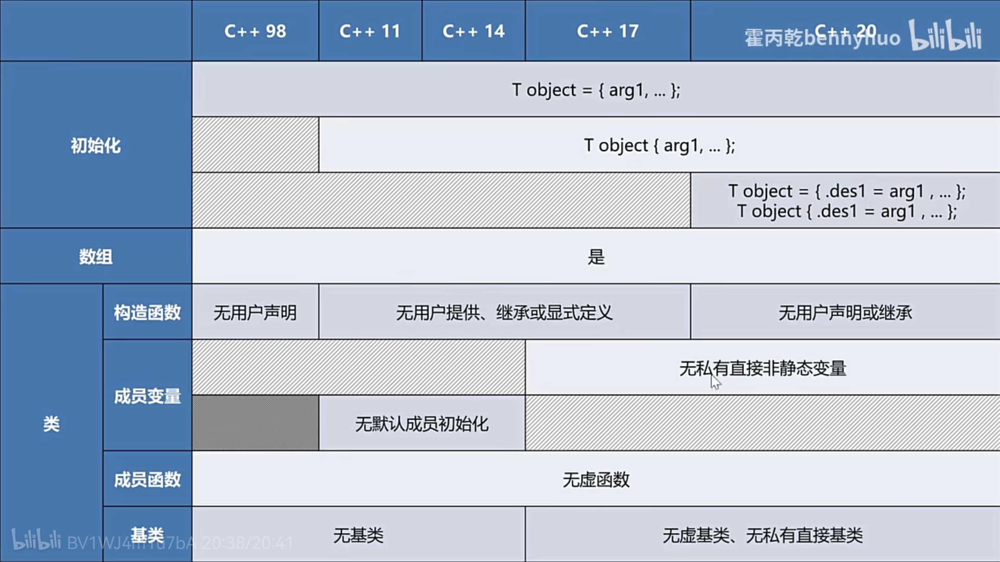

本书是一本 C++ 进阶图书，全书分为 42 章，深入探讨了从 C++ 11 到 C++ 20 引入的核心特性。书中不仅通过大量的实例代码讲解特性的概念和语法，还从编译器的角度分析特性的实现原理

<!-- more -->

## 01 新基础类型

### 整数类型`long long`

* `long long`**至少**表示 64 位的整数
* `long`不能比`int`短，所以可以相等
* `long`就是`long int`，同理`long long`就是`long long int`
* 初始化可以添加`l`或`L`后缀，`long long x = 65536LL;`
* 可以用于枚举类型或位域
  
  ```c++
  enum longlong_enum : long long {
      x1,
      x2
  };

  struct longlong_struct { // 位域可以用来解析协议
      long long x1 : 8,
      long long x2 : 24,
      long long x3 : 32
  }
  ```


`long long`格式化输出可以使用`%lld`、`%llu`，`int`格式化输出可以使用`%d`，`short`格式化输出可以使用`%h`，应该是 half 的意思


### 新字符串类型`char16_t`和`char32_t`

* 分别对应 Unicode 的 UTF-16 和 UTF-32
* UTF-32 编码简单但是占用内存多
  * 所有字符都映射
* UTF-16 占用内存少但是不够用
  * 常用字符做唯一映射
  * 其余字符采用了一种特殊的方法表示 Unicode 字符
* UTF-8 一般序列化到磁盘中，不存在内存中
  * 变长编码
  * 查找和获取大小比较麻烦
* `wchar_t`存在的问题
  * 在 Windows 上`wchat_t`是 16 位，而在 Linux 和 macOS 上`wchat_t`是 32 位的
  * 无法保证相同的代码在不同平台上有相同的行为
  * `char16_t`和`char32_t`解决了这个问题
* `char8_t`字符类型 
  * 使用`char`类型来处理 UTF-8 字符虽然可行，但是也会带来一些困扰，比如当库函数需要同时处理多种字符时必须采用不同的函数名称，以区分普通字符和 UTF-8 字符
  * `char8_t`可以代替`char`作为 UTF-8 的字符类型

## 02 内联和嵌套命名空间

C++11 标准增强了命名空间的特性，提出了内联命名空间的概念。内联命名空间能够把空间内函数和类型导出到父命名空间中，这样即使不指定子命名空间也可以使用其空间内的函数和类型了

```c++
#include <iostream>

namespace Parent {
    namespace Child1 {
        void foo() { std::cout << "Child1: foo()" << std::endl; }
    }
    inline namespace Child2 {
        void foo() { std::cout < "Child2: foo()"<< std::endl; }
    }
}
int main() {
    Parent::Child1::foo();
    Parent::foo(); // 兼容老代码，删掉 Child2 命名空间效果是一样的
} 
```

* 嵌套命名空间的简化语法 

  ```c++
  namespace A::B::C {
      int foo () { return 5; }
  }
  ```

* 内联命名空间 
  
  ```c++
  namespace A::B::inline C {
      int foo () { return 5; }
  }
  // 或者
  namespace A::inline B::C {
      int foo () { return 5; }
  }
  ```

## 03 `auto`占位符

* C++ 98 开始就有了，平常定义的变量都是`auto`的，也可以不写
* C++ 11 开始赋予了新的含义
* 声明多个变量时，从左往右推导，必须一致
* 条件表达式推导出更强的类型 e.g. `auto i = true ? 5 : 8.8` `i`的类型为`double`
* 初始化静态成员变量必须加`const` 
  
  ```c++
  struct sometype {
      static const auto i = 5;
  }
  ```

  * C++ 17 标准中，`auto`可以在没有`const`的情况下使用 

    ```c++
    struct sometype {
        static inline auto i = 5;
    }
    ```

* C++ 20 之前，无法在函数形参列表中使用`auto`声明形参 e.g. `void echo(auto str) { ... }`
  * `auto`可以为 lambda 表达式声明形参 
* 如果`auto`声明的变量时按值初始化，则推导出的类型会忽略 cv 限定符
  
  ```c++
  const int i = 5;
  auto j = i;       // auto 推导类型为 int，而非 const int
  auto &m = i;      // auto 推导类型为 const int，m 推导类型为 const int&
  auto *k = &i;     // auto 推导类型为 const int，k 推导类型为 const int*
  const auto n = j; // auto 推导类型为 int，n 的类型为 const int
  ```

  * 对于值类型的推导只是值上的关系，没有内存的关联
  * 但是对于引用或指针涉及到了内存的关联，需要保留 cv 限定符
* 使用`auto`声明变量初始化时，目标对象如果是引用，则引用属性会被忽略
  
  ```c++
  int i = 5;
  int &j = i;
  auto m = j; // auto 推导类型为 int，而非 int&
  ```

* 使用`auto`和万能引用声明变量时，对于左值会将`auto`推导为应用类型

  ```c++
  int i = 5;
  auto&& m = i; // auto 推导类型为 int&，这里涉及引用折叠的概念（遇左则左）
  auto&& j = 5; // auto 推导类型为 int
  ```

* 使用`auto`声明变量，如果对象目标是一个数组或者函数，则`auto`会被推导为对应的指针类型
* 当`auto`关键字与列表初始化组合时  
  * 直接使用列表初始化，列表中必须为单元素，否则无法编译，`auto`类型被推导为单元素的类型
  * 用等号加初始化列表，列表中可以包含单个或多个元素，`auto`类型别推导为`std::initializer_list<T>`，其中`T`是元素类型
  
  ```c++
  auto x1 = { 1, 2 };   // x1 类型为 std::initializer_list<int>
  auto x2 = { 1, 2.0 }; // 编译失败，花括号中元素类型不同
  auto x3{ 1, 2 };      // 编译失败，不是单个元素
  auto x4 = { 3 };      // x4 类型为 std::initializer_list<int>
  auto x5{ 3 };         // x5 类型为 int
  ```



```c++
class Base {
public:
    virtual void f() {
        std::cout << "Base::f()" << std::endl;
    }
};

class Derived : public Base {
public:
    virtual void f() {
        std::cout << "Derived::f()" << std::endl;
    }
}

Base* d = new Derived();
auto b = *d;
b.f();
```

由于`auto b = *d;`是按值赋值的，因此`auto`会直接推导为`Base`。代码自然会调用`Base`的复制构造函数，也就是说`Derived`被切割（Sliced）成了`Base`，如果是`auto &b1 = *d`或者`auto *b2 = d`则会触发多态的性质



* 返回类型声明为`auto`的推导 e.g. `auto sum(int a, int b) { return a + b; }` 
  * 如果有多重返回值，那么需要保证返回值类型是相同的，否则会编译失败

    ```c++
    auto sum(long a, long b) {
        if (a < 0) {
            return 0; // 返回 int 类型
        }
        else {
            return a + b; // 返回 long 类型
        }
    }
    ```

* 可以把`auto`写到 lambda 表达式的形参中，这样就得到了一个泛型的 lambda 表达式 
* 非类型模板形参占位符 

   ```c++
   #include <iostream>
   template<auto N>
   void f() {
      std::cout << N << std::endl;
   }
   int main() {
      f<5>();   // N 为 int 类型
      f<'c'>(); // N 为 char 类型
      f<5.0>(); // 编译失败，模板参数不能为 double
   }
   ```

## 04 `decltype`说明符

* 使用`decltype`说明符可以获取对象或者表达式的类型，其语法与`typeof`类似 

```c++
auto sum(int a1, int a2) -> int {
    return a1 + a2;
}
```

C++ 11 标准中，`auto`作为占位符不能是编译器对函数返回类型进行推导，必须使用返回类型后置的形式指定返回类型，如果想泛化这个函数，需要使用到函数模板

```c++
template<class T>
T sum(T a1, T a2) {
    return a1 + a2;
}
auto x1 = sum(5, 10);
```

但是如果传递不同类型的实参，则无法编译通过 e.g. `auto x2 = sum(5, 10.5);`，只能增加模板类型来解决了

```c++
template<class R, class T1, class T2>
R sum(T1 a1, T2 a2) {
    return a1 + a2;
}
auto x3 = sum<double>(5, 10.5);
```

这时可以使用`decltype`进行优化 

```c++
template<class T1, class T2>
auto sum(T1 a1, T2 a2) -> decltype(a1 + a2) {
    return a1 + a2;
}
```



* `decltype(a1 + a2)`的作用域是这个函数，也就是说表达式里面的变量必须是在函数中的形参
* 编译阶段进行推导



C++ 14 标准已经支持对`auto`声明的返回类型进行推导了 
  
```c++
template<class T1, class T2>
auto sum(T1 a1, T2 a2) { // 直接去掉 decltype 说明符即可
    return a1 + a2;
}
```

`auto`作为返回类型的占位符还存在一些问题

```c++
template<class T>
auto return_ref(T& t) {
    return t;
}
int x1 = 0;
static_assert(std::is_reference_v<decltype(return_ref(x1))>); // 编译错误，返回值不为引用类型
```

这里`auto`被推导为值类型，参考`auto`占位符规则，如果想正确地返回引用类型，则需要使用`decltype`说明符

```c++
template<class T>
auto return_ref(T& t) -> decltype(t) {
    return t;
}
int x1 = 0;
static_assert(std::is_reference_v<decltype(return_ref(x1))>); // 编译成功
```

* 推导规则 `decltype(e)`，`e`的类型为`T`
  * 如果`e`是一个未加括号的标识符表达式（结构化绑定除外）或者未加括号的类成员访问，则`decltype(e)`推断出的类型是`e`的类型`T`。如果并不存在这样的类型，或者`e`是一组重载函数，则无法进行推导 
    * 如果加上括号则推断出的是引用类型
  * 如果`e`是一个函数调用或者仿函数调用，那么`decltype(e)`推断出的类型是其返回值的类型
  * 如果`e`是一个类型为`T`的左值，则`decltype(e)`是`T&`
  * 如果`e`是一个类型为`T`的将亡值，则`decltype(e)`是`T&&`
  * 除去以上情况，则`decltype(e)`是`T`
* cv 限定符的推导
  * 通常情况下，`decltype(e)`所推导的类型会同步`e`的 cv 限定符
  * 当`e`是未加括号的成员变量时，父对象表达式的 cv 限定符会被忽略，不能同步推导结果，只有加括号时 cv 限定符会同步到推断结果
  
    ```c++
    struct A {
        double x;
    }
    const A* a = new A();
    decltype(a->x); //  decltype(a->x) 推导类型为 double，const 属性被忽略
    ```

* `decltype(auto)` 
  * 告诉编译器用`decltype`推导表达式规则来推导`auto`
  * `decltype(auto)`必须单独声明，不能结合指针、引用以及 cv 限定符
  
  ```c++
  int i;
  int&& f();
  auto x1a = i;                     // x1a 推导类型为 int
  decltype(auto) x1d = i;           // x1d 推导类型为 int
  auto x2a = (i);                   // x2a 推导类型为 int
  decltype(auto) x2d = (i);         // x2d 推导类型为 int&
  auto x3a = f();                   // x3a 推导类型为 int
  decltype(auto) x3d = f();         // x3d 推导类型为 int&&
  auto x4a = { 1, 2 };              // x 推导类型为 std::initializer_list<int>
  decltype(auto) x4d = { 1, 2 };    // 编译失败，{ 1, 2 }不是表达式
  auto *x5a = &i;                   // x5a 推导类型为 int*
  decltype(auto) *x5d = &i;         // x 编译失败，decltype(auto) 必须单独声明
  ```

  * `auto`和`decltype(auto)`的用法几乎相同，只是在推导规则上遵循`decltype`而已
  * 之前代码`return_ref`想返回一个引用类型，但是如果直接使用`auto`，则一定会返回一个值类型，解决方案是采用后置的方式声明返回类型，现在可以通过`decltype(auto)`也可以解决
  
    ```c++
    template<class T>
    decltype(auto) return_ref(T& t) {
        return t;
    }
    int x1 = 0;
    static_assert(std::is_reference_v<decltype(return_ref(x1))>); // 编译成功
    ```

  * `decltype(auto)`作为非理性模板形参占位符
  
  ```c++
  #include <iostream>
   template<decltype(auto) N>
   void f() {
      std::cout << N << std::endl;
   }
   static const int x = 11;
   static int y = 7;
   int main() {
      f<x>();   // N 为 const int 类型
      f<(x)>(); // N 为 const int& 类型
      f<y>();   // 编译失败，因为 y 不是一个常量，编译器无法对函数模板进行实例化
      f<(y)>(); // N 为 int& 类型，恰好对于静态对象而言内存地址时固定的，所以可以通过编译
   }
  ```

## 05 函数返回类型后置 

* 返回类型比较复杂的是时候，比如返回一个函数指针类型，使用返回类型后置

  ```c++
  int bar_impl(int x) {
      return x;
  }

  typedef int(*bar)(int);
  bar foo1() {
      return bar_impl;
  }

  auto foo2() -> int (*)(int) {
      return bar_impl;
  }
  ```

  有了返回类型后置，返回类型就可以用`auto`占位符，再后置函数指针类型，不需要写`typedef`
* 推导函数模板返回类型

## 06 右值引用

### 左值和右值

* `i++`：先把`i`的值取出来存到临时变量中，再把`i`加一，最后返回的是临时变量的值，属于右值（将亡值）
* `++i`：自增后将自己返回，属于左值
* 但凡能取地址`&`，就是左值
* 通常字面量都是一个右值，除了字符串字面量以外
  * 字符串是一块连续的内存，通常存在静态数据去里面

### 左值引用



* 指针最危险的地方在于可以运算
* C++ 是弱类型语言，类型之前可以随意转换



```c++
int &x1 = 7; // 编译错误
const int &x2 = 11; // 编译成功
```

* 非常量左值的引用对象必须是一个左值
  * 
* 常量左值引用的对象可以是左值，也可以是右值
* 在函数形参列表中有着很大的作用

```c++
class X {
public:
    X() {}
    X(const X&) {}
    X& operator = (const X&) { return *this; }
};

X make_X() {
    return X();
}

int main() {
    X x1;
    X x2;
    X x3(make_X());
    x3 = make_X();
}
```

* 如果将类`X`的复制构造函数和复制赋值构造函数形参类型的常量性删除，则`X x3(make_X());`和`x3 = make_X();`会报错，因为非常量左值引用无法绑定到右值上
* 缺点是一旦使用了常量左值应用，就无法在函数内部修改该对象的内容



```c++
X make_X() {
    return X(); 
}
```

C++ 17 之后编译器有做拷贝优化，虽然返回值是右值，函数返回类型是左值，因为做了拷贝优化所以不会报错



### 右值引用

* 右值引用可以延长右值的声明周期
* 右值引用可以减少对象复制，提升程序性能

```c++
#include <iostream>
class BigMemoryPool {
public:
    static const int PoolSize = 4096;
    BigMemoryPool() : pool_(new char[PoolSize]) {}
    ~BigMemoryPool()
    {
        if (pool_ != nullptr) {
            delete[] pool_;
        }
    }
    // 移动构造器
    BigMemoryPool(BigMemoryPool&& other)
    {
        std::cout << "move big memory pool." << std::endl;
        pool_ = other.pool_;
        other.pool_ = nullptr;
    }
    // 复制构造器
    BigMemoryPool(const BigMemoryPool& other) : pool_(new char[PoolSize])
    {
        std::cout << "copy big memory pool." << std::endl;
        memcpy(pool_, other.pool_, PoolSize);
    }
private:
    char *pool_;
};

BigMemoryPool get_pool(const BigMemoryPool& pool)
{
    return pool;
}

BigMemoryPool make_pool()
{
    BigMemoryPool pool;
    return get_pool(pool);
}

int main()
{
    BigMemoryPool my_pool = make_pool();
}
```

* 调用复制构造函数会严重影响运行性能
* 对于复制构造函数而言形参是一个左值引用，函数的实参必须是一个具名的左值，不能破坏实参对象的前提下复制目标对象
* 移动构造函数接受的是一个右值，通过转移实参对象的数据以达成构造目标对象的目的，也就是说实参对象是会被修改的
  * 传过来的参数用过之后就没有用了
* 编译器生成的移动构造函数和复制构造函数并没有什么区别
* 编写移动语义的函数时建议确保函数不会抛出异常
* 如果无法保证移动构造函数不会抛出异常，可以使用`noexcept`说明符限制该函数。这样当函数抛出异常的时候，程序不会再继续执行而是调用`std::terminate`中止执行

### 值类别


    


* 左值和右值实际上指的是表达式，表达式的结果就是值
* 将亡值产生
  * 使用类型转换将泛左值转换为该类型的右值引用
  * 临时量实质化 

    ```c++
    struct X {
        int a;
    };
    
    int main() {
        int b = X().a;
    }
    ```

    * 纯右值转换到临时对象的过程
    * 每当纯右值出现在一个需要泛左值的地方时，临时量实质化都会发生——创建一个临时对象并且使用纯右值对其进行初始化
    * 只要返回的是纯右值就不会调用类的构造函数了
* 在 C++11 标准中可以在不创建临时值的情况下显式地将左值通过`static_cast`转换为将亡值
  
  ```c++
  int i = 0;
  int &&k = static_cast<int&&>(i);
  ```

* 这个转换既不改变生命周期也不改变内存地址，最大作用是让左值使用移动语义
* 正确的使用场景是在一个右值被转换为左值后需要再次转换为右值

```c++
void move_pool(BigMemoryPool &&pool)
{
    std::cout << "call move_pool" << std::endl;
    BigMemoryPool my_pool(pool);
}

int main()
{
    move_pool(make_pool());
}
```

* 无论一个函数的实参是左值还是右值，其形参都是一个左值，即使这个形参看上去是一个右值引用
* `BigMemoryPool my_pool(pool);` 还是会调用复制构造函数而非移动构造函数
* `BigMemoryPool my_pool(static_cast<BigMemoryPool&&>(pool));`则会调用移动构造函数进行构造
* 在 C++ 11 的标准库中还提供了一个函数模板`std::move`将左值转换为右值 e.g. `BigMemoryPool my_pool(std::move(pool));`

### 万能引用和引用折叠

```c++
void foo(int &&i) {} // i 为右值引用

template<class T>
void bar(T &&t) {} // t 为万能引用
```

* `&&i`就是定义出来具体的参数，字面意思
* 而模板有实例化的过程，所以就是万能引用
* 所谓的万能引用就是发生类型推导

| 模板类型 | `T`实际类型 | 最终类型 |
|----------|-------------|----------|
| `T&`     | `R`         | `R&`     |
| `T&`     | `R&`        | `R&`     |
| `T&`     | `R&&`       | `R&`     |
| `T&&`    | `R`         | `R&&`    |
| `T&&`    | `R&`        | `R&`     |



“遇左则左”

* 只要有左值引用参与进来，最后推导的结果就是一个左值引用
* 只有实际类型是一个非引用类型或者右值引用类型时，最后推导出来的才是一个右值引用



```c++
#include <iostream>
#include <string>

template<class T>
void show_type(T t)
{
    std::cout << typeid(t).name() << std::endl;
}

template<class T>
void normal_forwarding(T t)
{
    show_type(t);
}

std::string get_string()
{
    return "hi world";
}

int main()
{
    std::string s = "hello world";
    normal_forwarding(s);
    normal_forwarding(get_string()); // 编译失败
}
```

* `normal_forwarding(get_string());`因为`normal_forwarding`接受的是左值，而传入的是右值
* 可以将`void normal_forwarding(T &t)`替换为`void normal_forwarding (const T &t)`来解决这个问题
  * 常量左值引用是可以引用右值的
  * 但是不能修改传入进来的数据了
* 可以用引用折叠规则来处理
  
  ```c++
  template<class T>
  void perfect_forwarding(T &&t)
  {
      show_type(static_cast<T&&>(t));
  }
  ```

* 在 C++ 11 的标准库中提供了一个`std::forward`函数模板，在函数内部也是使用`static_cast`进行类型转换

`remove_reference`移除引用，根据不同的类型去匹配

```c++
template <class _Ty>
struct remove_reference {
    using type                 = _Ty;
    using _Const_thru_ref_type = const _Ty;
};

template <class _Ty>
struct remove_reference<_Ty&> {
    using type                 = _Ty;
    using _Const_thru_ref_type = const _Ty&;
};

template <class _Ty>
struct remove_reference<_Ty&&> {
    using type                 = _Ty;
    using _Const_thru_ref_type = const _Ty&&;
};
```

`std::forward`

```c++
template <class _Ty>
constexpr _Ty&& forward(remove_reference_t<_Ty>& _Arg) noexcept {
    return static_cast<_Ty&&>(_Arg);
}
```

`std::move`

```c++
template <class _Ty>
constexpr remove_reference_t<_Ty>&& move(_Ty&& _Arg) noexcept {
    return static_cast<remove_reference_t<_Ty>&&>(_Arg);
}
```

### 针对局部变量和右值引用的隐式移动操作

```c++
#include <iostream>

struct X {
    X() = default;
    X(const X&) {
        std::cout << "copy ctor" << std::endl;
    }

    X(X&&) {
        std::cout << "move ctor" << std::endl;
    }
};

X get(X x) {
    return x;
}

int main() {
    X x = get(X{});
}
```



`-fno-elide-constructors`选项用于关闭返回值优化，才会出现三次输出



* 如果没有移动构造函数，则会调用三次复制构造函数
* 如果定义了移动构造函数，会隐式地采用移动构造函数，调用三次移动构造函数
* 隐式移动操作针对右值引用和`throw`的情况进行了扩展 
* 可隐式移动的对象必须是一个非易失或一个右值引用的非易失自动存储对象，在以下情况下可以使用移动代替复制
  * `return`或者`co_return`语句中的返回对象是函数或者 lambda 表达式中的对象或形参
  * `throw 语`句中抛出的对象是函数或`try`代码块中的对象

### 小结

对于这些优化空间，C++ 委员会已经对标准库进行了优化，比如常用的容器`vector`、`list`和`map`等均已支持移动构造函数和移动赋值运算符函数。另外，如`make_pair`、`make_tuple`以及`make_shared`等也都使用完美转发以提高程序的性能

## 07 lambda 表达式

* 语法定义：<font color="#FF204E">[captures]</font><font color="#A0153E">(params)</font> <font color="#58A399">specifiers</font> <font color="#A8CD9F">exception</font> <font color="#496989">-> ret</font> <font color="#00224D">{ body }</font>
  * <font color="#FF204E">`[captures]`</font>在大部分其他语言是不存在的，因为诸如 Java、C# 等语言是有 GC 机制的，不需要担心捕获对象的声明周期的问题
  * <font color="#FF204E">`[captures]`</font> —— 捕获列表，它可以捕获当前函数作用域的零个或多个变量，变量之间用逗号分隔。捕获列表的捕获方式有两种：按值捕获和引用捕获
  * <font color="#A0153E">`(params)`</font> —— 可选参数列表，语法和普通函数的参数列表一样，在不需要参数的时候可以忽略参数列表
  * <font color="#58A399">`specifiers`</font> —— 可选限定符，C++11 中可以用`mutable`，它允许在 lambda 表达式函数体内改变按值捕获的变量，或者调用非`const`的成员函数
  * <font color="#A8CD9F">`exception`</font> —— 可选异常说明符，可以使用`noexcept`来指明 lambda 是否会抛出异常
  * <font color="#496989">`-> ret`</font> —— 可选返回值类型，不同于普通函数，lambda 表达式使用返回类型后置的语法来表示返回类型，如果没有返回值（`void`类型），可以忽略包括`->`在内的整个部分
  * <font color="#00224D">`{ body }`</font> —— lambda 表达式的函数体，这个部分和普通函数的函数体一样
* 不允许捕获全局变量和静态变量，因为可以直接使用
* **lambda 表达式按值捕获每次调用都会保留上一次修改的值**，具体参考 lambda 表达式实现原理
* 特殊的捕获方法
  * `[this]` —— 捕获`this`指针，捕获`this`指针可以使用`this`类型的成员变量和函数
  * `[=]` —— 捕获 lambda 表达式定义作用域的全部变量的值，包括`this`
  * `[&]` —— 捕获 lambda 表达式定义作用域的全部变量的引用，包括`this`
* lambda 表达式的优势在于书写简单方便且易于维护
* 函数对象的优势在于使用更加灵活不受限制
* lambda 表达式实现原理

  ```c++
  #include <iostream>
  int main()
  {
      int x = 5, y = 8;
      auto foo = [=] { return x * y; };
      int z = foo();
  }
  ```

  用 CppInsights 输出其 GIMPLE 的中间代码

  ```c++
  #include <iostream>
  int main()
  {
      int x = 5;
      int y = 8;
      
      class __lambda_5_16
      {
      public: 
          inline /*constexpr */ int operator()() const
          {
              return x * y;
          }
          
      private: 
          int x;
          int y;
          
      public:
          __lambda_5_16(int & _x, int & _y): x{_x}, y{_y} {}
      };
  
      __lambda_5_16 foo = __lambda_5_16{x, y};
      int z = foo.operator()();
      return 0;
  }
  ```

  * lambda 表达式在编译期会由编译器自动生成一个闭包类，在运行时由这个闭包类产生一个对象，称为闭包。在 C++中，所谓的闭包可以简单地理解为一个匿名且可以包含定义时作用域上下文的函数对象
  * lambda 表达式是 C++11 提供的一块语法糖而已，lambda 表达式的功能完全能够手动实现，而且如果实现合理，代码在运行效率上也不会有差距，只不过实用 lambda 表达式让代码编写更加轻松了
* 无状态的 lambda 表达式
  * 有状态会在匿名类中定义按值捕获的变量，从而在每次调用的时候都会保持变量上一次的状态
  * 如果是无状态的 lambda 表达式，可以隐式转换为函数指针

    ```c++
    void f(void(*)()) {}
    void g() { f([] {}); } // 编译成功
    ```

  * 尽量让 lambda 表达式“纯粹”一些，不捕获外部变量
* 在 STL 中使用 lambda 表达式
  * `std::sort`、`std::find_if`
* 广义捕获 
  * 简单捕获
  * 初始化捕获
    * 捕获表达式结果
    * 自定义捕获变量名

    ```c++
    int main() {
        int x = 5;
        auto foo1 = [x = x + 1] { return x; }; // 两个 x 的作用域不一样
        auto foo2 = [r = x + 1] { return r; }; // 推荐的写法
    }
    ```

    ```c++
    #include <string>
    int main()
    {
        std::string x = "hello c++ ";
        auto foo = [x = std::move(x)]{ return x + "world"; };
    }
    ```

    * 使用`std::move`对捕获列表变量 x 进行初始化，这样避免了简单捕获的复制对象操作
  * 异步调用时复制`this`对象，防止 lambda 表达式被调用时因原始`this`对象被析构造成未定义的行为

    ```c++
    #include <iostream>
    #include <future>
    class Work {
    private:
        int value;
    public:
        Work() : value(42) {}
        std::future<int> spawn() {
            return std::async([=]() -> int { return value; });
        }
    };
    std::future<int> foo() {
        Work tmp;
        return tmp.spawn();
    }

    int main() {
        std::future<int> f = foo();
        f.wait();
        std::cout << "f.get() = " << f.get() << std::endl;
    }
    ```

    

    输出结果

    ```plaintext
    f.get() = 32766
    ```

    `f.wait()`调用之后，访问`value`这块内存的时候已经是未知的状态
    

    解决方法就是可以将对象复制到 lambda 表达式内

    ```c++
    class Work {
    private:
        int value;
    public:
        Work() : value(42) {}
        std::future<int> spawn() {
            return std::async([=, tmp = *this]() -> int { return tmp.value; });
        }
    };
    ```

    
    这种方式也不能解决所有问题，一个技术手段是不能解决所有问题的，需要在合适的场景下提出不同的解决方案
    

* 泛型 lambda 表达式 
  * 定义方式不用`template`关键字，只需要使用`auto`占位符即可
  
  ```c++
  int main()
  {
      auto foo = [](auto a) { return a; };
      int three = foo(3);
      char const* hello = foo("hello");
  }
  ```

* 常量 lambda 表达式 
* 捕获`*this`增强 
  * 不需要额外定义变量初始化捕获列表，直接使用`*this`就是一份拷贝
* 捕获`[=, this]` 
  * 表达的意思和`[=]`相同，目的区分它与`[=,*this]`的不同
  * C++ 20 标准中还特别强调了要用`[=, this]`代替`[=]`
  * 希望捕获`this`时，把`this`写出来

```c++
template <typename T>
struct is_std_vector : std::false_type { };

template <typename T>
struct is_std_vector<std::vector<T>> : std::true_type { };

auto f = [](auto vector) {
    static_assert(is_std_vector<decltype(vector)>::value, "");
};

f(1); // 静态断言失败，需要传入 vector<T>类型

auto v = std::vector<int>();
f(v); // 正确
```

* 普通的函数模板可以轻松地通过形参模式匹配一个实参为`vector`的容器对象，但是对于 lambda 表达式，`auto`不具备这种表达能力，所以不得不实现`is_std_vector`，并且通过`static_assert`来辅助判断实参的真实类型是否为`vector`
* 如果用 lambda 表达式想获取`vector`里面的`T`的类型就会更复杂
  
  ```c++
  auto f = [] (auto vector) {
      using T = typename decltype(vector)::value_type;
      // ...
  }
  ```

  * `vector`容器类型会使用内嵌类型`value_type`表示存储对象的类型
  * 不能保证面对的所有容器都会实现这一规则，所以依赖内嵌类型是不可靠的
* 还有一个问题是`decltype(obj)`有时候并不能直接获取想要的类型
  
  ```c++
  auto f = [](const auto& x) {
      using T = decltype(x);
      T copy = x; // 可以编译，但是语义错误
      using Iterator = typename T::iterator; // 编译错误
  };
  ```

  * `decltype(x)`推导出来的类型并不是`std::vector`，而是`const std::vector &`，所以`T copy = x;`不是一个复制而是引用
  * 对于一个引用类型来说，`T::iterator`也是不符合语法的，所以编译出错
  * 可以将类型的 cv 以及引用属性删除

    ```c++
    auto f = [](const auto& x) {
        using T = std::decay_t<decltype(x)>;
        T copy = x;
        using Iterator = typename T::iterator;
    };
    ```

* 模板语法的泛型 lambda 表达式 
  * `[]<template T>(T t) {}`
* 可构造和可赋值的无状态 lambda 表达式 
  * `std::sort`和`std::find_if`这样的函数需要一个函数对象或函数指针来辅助排序和查找，这种情况可以使用 lambda 表达式完成任务
  * `std::map`的比较函数对象是通过模板参数确定的，这个时候需要的是一个类型

    ```c++
    auto greater = [](auto x, auto y) { return x > y; };
    std::map<std::string, int, decltype(greater)> mymap; // 需要的是类型所以用`decltype`
    ```

    
    * 但是在 C++ 17 标准中是不可行的，因为 lambda 表达式类型无法构造，lambda 表达式的默认构造函数已经被删除了
    * 无状态的 lambda 表达式也没办法赋值，原因是复制赋值函数被删除了
    * 使用 C++ 20 标准的编译环境来编译上面的代码是可行的
    

## 08 非静态数据成员默认初始化

* 声明非静态数据成员的同时直接对其使用`=`或者`{}`初始化 
* 在此之前只有类型为整型或者枚举类型的常量静态数据成员才可以这样初始化
* 初始化列表对数据成员的初始化总是优先于声明时默认初始化
* 不要使用括号`()`对非静态数据成员进行初始化，因为这样会造成解析问题，所以会编译错误
* 不要用`auto`来声明和初始化非静态数据成员
* 位域的默认初始化 
  
  ```c++
  struct S {
      int y : 8 = 11;
      int z : 4 = { 7 };
  }
  ```

  `int`数据的低 8 位被初始化为 11，紧跟它的高 4 位被初始化为 7

## 09 列表初始化

* 列表初始化，使用大括号`{}`对变量进行初始化 
* 传统变量初始化的规则一样，它也区分为直接初始化和拷贝初始化

```c++
#include <string>
struct C {
    C(std::string a, int b) {}
    C(int a) {}
};

void foo(C) {}

C bar() {
    return {"world", 5};
}

int main() {
    int x = {5};                // 拷贝初始化
    int x1{8};                  // 直接初始化
    C x2 = {4};                 // 拷贝初始化
    C x3{2};                    // 直接初始化
    foo({8});                   // 拷贝初始化
    foo({"hello", 8});          // 拷贝初始化
    C x4 = bar();               // 拷贝初始化
    C *x5 = new C{ "hi", 42 };  // 直接初始化
}
```

* `std::initializer_list`简单地说就是一个支持`begin`、`end`以及`size`成员函数的类模板
  * 实际上是一块连续的内存，也就是数组
* 隐式缩窄转换问题
  
  ```c++
  int x = 12345;
  char y = x; // 将超过 char 大小的数据赋值给 char，明显是一个隐式缩窄转换
  ```

  * 传统变量初始化中是没有问题的，代码能顺利通过编译
  * 如果采用列表初始化，根据标准编译器通常会给出一个错误
  * 隐式缩窄转换发生的情况 <font color="#FF204E">表示范围大的类型向表示范围小的类型转换就发生了缩窄</font>
    * 从浮点类型转换整数类型
    * 从`long double`转换到`double`或`float`，或从`double`转换到`float`，除非转换源是常量表达式以及转换后的实际值在目标可以表示的值范围内
    * 从整数类型或非强枚举类型转换到浮点类型，除非转换源是常量表达式，转换后的实际值适合目标类型并且能够将生成目标类型的目标值转换回原始类型的原始值
    * 从整数类型或非强枚举类型转换到不能代表所有原始类型值的整数类型，除非源是一个常量表达式，其值在转换之后能够适合目标类型

  ```c++
  int x = 999;
  const int y = 999;
  const int z = 99;
  const double cdb = 99.9;
  double db = 99.9;
  char c1 = x; // 编译成功，传统变量初始化支持隐式缩窄转换
  char c2{ x }; // 编译失败，可能是隐式缩窄转换，对应规则 4
  char c3{ y }; // 编译失败，确定是隐式缩窄转换，999 超出 char 能够适应的范围，对应规则 4
  char c4{ z }; // 编译成功，99 在 char 能够适应的范围内，对应规则 4
  unsigned char uc1 = { 5 }; // 编译成功，5 在 unsigned char 能够适应的范围内，
  // 对应规则 4
  unsigned char uc2 = { -1 }; // 编译失败，unsigned char 不能够适应负数，对应规则 4
  unsigned int ui1 = { -1 }; //编译失败，unsigned int 不能够适应负数，对应规则 4
  signed int si1 = { (unsigned int)-1 }; //编译失败，signed int 不能够适应-1 所对应的
  //unsigned int，通常是 4294967295，对应规则 4
  int ii = { 2.0 }; // 编译失败，int 不能适应浮点范围，对应规则 1
  float f1{ x }; // 编译失败，float 可能无法适应整数或者互相转换，对应规则 3
  float f2{ 7 }; // 编译成功，7 能够适应 float，且 float 也能转换回整数 7，对应规则 3
  float f3{ cdb }; // 编译成功，99.9 能适应 float，对应规则 2
  float f4{ db }; // 编译失败，可能是隐式缩窄转无法表达 double，对应规则 2
  ```

* 如果有一个类同时拥有满足列表初始化的构造函数，且其中一个是以`std::initializer_list`为参数，那么编译器将优先以`std::initializer_list`为参数构造函数
* 指定初始化 
  
  ```C++
  struct Point {
      int x;
      int y;
      int z;
  };
  Point p{ .x = 4, .y = 2 }; // z = 0
  ```

  * 并不是什么对象都能够指定初始化
    * 对象必须是一个聚合类型
    * 指定的数据成员必须是非静态数据成员 <font color="#A0153E">静态数据成员不属于某个对象</font>
    * 每个非静态数据成员最多只能初始化一次

      ```c++
      Point p{ .y = 4, .y = 2 }; // 编译失败，y 不能初始化多次
      ```

    * 非静态数据成员的初始化必须按照声明的顺序进行
      * 在 C 语言中，乱序的指定初始化是合法的，但 C++ 不行
      * C++ 中的数据成员会按照声明的顺序构造，按照顺序指定初始化会让代码更容易阅读

      ```c++
      Point p{ .y = 4, .x = 2 }; // C++ 编译失败，C 编译正常
      ```

    * 针对联合体中的数据成员只能初始化一次，不能同时指定

      ```c++
      union u {
          int a;
          const char* b;
      };
      u f = { .a = 1 }; // 编译成功
      u g = { .b = "a" }; // 编译成功
      u h = { .a = 1, .b = "a" }; // 编译失败，同时指定初始化联合体中的多个数据成员
      ```

    * 不能嵌套指定初始化数据成员
      * C 语言中也是允许的
      * C++ 标准认为这个特性很少有用，所以直接禁止了

      ```c++
      struct Line {
          Point a;
          Point b;
      };
      Line l{ .a.y = 5 }; // 编译失败，.a.y = 5 访问了嵌套成员，不符合 C++ 标准
      ```

      * 如果确实想嵌套指定初始化，可以换一种形式来达到目的

        ```c++
        Line l{ .a { .y = 5 } };
        ```

    * 一旦使用指定初始化，就不能混用其他方法对数据成员初始化了

      ```c++
      Point p{ .x = 2, 3 }; // 编译失败，混用数据成员的初始化
      ```

    * 指定初始化不能初始化数组的某一位置 <font color="#A0153E">C++ 标准中给出的禁止理由非常简单，它的语法和 lambda 表达式冲突了</font>

      ```c++
      int arr[3] = { [1] = 5 }; // 编译失败
      ```

## 10 默认和删除函数

* 在没有自定义构造函数的情况下，编译器会为类添加默认的构造函数
  * 默认构造函数
  * 析构函数
  * 复制构造函数
  * 复制赋值运算符函数
  * 移动构造函数 
  * 移动赋值运算符函数 
* 添加默认特殊成员函数也会带来一些问题
  * 声明任何构造函数都会抑制默认构造函数的添加 <font color="#A0153E">显示的定义了非默认构造函数，编译器不再为类提供默认构造函数</font>
  * 一旦用自定义构造函数代替默认构造函数，类就将转变为<font color="#FF204E">**非平凡类型**</font>
    * <font color="#496989">如果自定义了构造函数（即使是默认构造函数），有可能编译器只能看到声明，看不到实现，就没办法做一些优化处理了</font>
    * 平凡类型可以想象为 C 的结构体
  * 没有明确的办法彻底禁止特殊成员函数的生成 <font color="#A0153E"> C++ 11 之前</font>

禁止重载函数的某些版本

```c++
class Base {
    void foo(long &); // 访问属性设置为 private，目的不想让其被重载
public:
    void foo(int) {}
};

class Derived : public Base {
public:
    using Base::foo; // 将父类中所有`foo`函数全部导入
    void foo(const char *) {}
};

int main()
{
    Derived d;
    d.foo("hello");
    d.foo(5);
}
```

* 无法通过编译。因为`using`说明符无法将基类的私有成员函数引入子类当中
* C++ 11 标准提供了一种方法能够简单有效又精确地控制默认特殊成员函数的添加和删除
* 在声明函数的尾部添加`= default`和`= delete`
* 相对于使用`private`限制函数访问，使用`= delete`更加彻底，它从编译层面上抑制了函数的生成，所以无论调用者是什么身份（包括类的成员函数），都无法调用被删除的函数
* 显式删除不仅适用于类的成员函数，对于普通函数同样有效 <font color="#A0153E">应用于普通函数的意义就不大了</font>
* 显式删除还可以用于类的`new`运算符和类析构函数
  * 作用于`new`运算符可以阻止该类在堆上动态创建对象
* 在类的构造函数上同时使用`explicit`和`= delete`是一个不明智的做法，它常常会造成代码行为混乱难以理解，应尽量避免这样做

## 11 非受限联合类型

* C++ 中的联合类型（`union`）可以说是节约内存的一个典型代表
* 在联合类型中多个对象可以共享一片内存，相应的这片内存也只能由一个对象使用
* 过去的 C++ 标准规定，联合类型的成员变量的类型不能是一个非平凡类型，也就是说它的成员类型不能有自定义构造函数
* 在 C++11 中如果有联合类型中存在非平凡类型，那么这个联合类型的特殊成员函数将被隐式删除，也就是说必须至少提供联合类型的构造和析构函数

```c++
#include <iostream>
#include <string>
#include <vector>

union U {
    U() {} // 存在非平凡类型成员，必须提供构造函数
    ~U() {} // 存在非平凡类型成员，必须提供析构函数
    int x1;
    float x2;
    std::string x3;
    std::vector<int> x4;
};

int main() {
    U u;
    u.x3 = "hello world"; // 因为非平凡类型 x3 并没有被构造，所以在赋值操作的时候必然会出错
    std::cout << u.x3;
}
```

修改后

```c++
#include <iostream>
#include <string>
#include <vector>

union U {
    U() : x3() {}
    ~U() { x3.~basic_string(); }
    int x1;
    float x2;
    std::string x3;
    std::vector<int> x4;
};

int main() {
    U u;
    u.x3 = "hello world";
    std::cout << u.x3;
}
```

* 在构造函数中添加了初始化列表来构造`x3`，在析构函数中手动调用了`x3`的析构函数
* 联合类型在析构的时候编译器并不知道当前激活的是哪个成员，所以无法自动调用成员的析构函数
* 但是如果初始化`x4`又会出现问题，所以继续修改代码

```c++
#include <iostream>
#include <string>
#include <vector>
union U {
    U() {}
    ~U() {}
    int x1;
    float x2;
    std::string x3;
    std::vector<int> x4;
};

int main() {
    U u;

    new(&u.x3) std::string("hello world");
    std::cout << u.x3 << std::endl;
    u.x3.~basic_string();

    new(&u.x4) std::vector<int>;
    u.x4.push_back(58);
    std::cout << u.x4[0] << std::endl;
    u.x4.~vector();
}
```

* 上面的代码用了 placement new 的技巧来初始化构造`x3`和`x4`对象
* 在使用完对象后手动调用对象的析构函数
* 通过这样的方法保证了联合类型使用的灵活性和正确性

* 联合类型其实就是 C 语言的遗产
* 可以使用`std::variant`来代替联合类型 
  * 是<font color="#A8CD9F">类型安全</font>的联合类型

  ```c++
  #include <cassert>
  #include <iostream>
  #include <string>
  #include <variant>
 
  int main()
  {
      std::variant<int, float> v, w;
      v = 42; // v contains int
      int i = std::get<int>(v);
      assert(42 == i); // succeeds
      w = std::get<int>(v);
      w = std::get<0>(v); // same effect as the previous line
      w = v; // same effect as the previous line
   
      // std::get<double>(v); // error: no double in [int, float]
      // std::get<3>(v);      // error: valid index values are 0 and 1
   
      // 类型安全就是可以抛出异常并且捕获
      try
      {
          std::get<float>(w); // w contains int, not float: will throw
      }
      catch (const std::bad_variant_access& ex)
      {
          std::cout << ex.what() << '\n';
      }
   
      using namespace std::literals;
   
      std::variant<std::string> x("abc");
      // converting constructors work when unambiguous
      x = "def"; // converting assignment also works when unambiguous
   
      std::variant<std::string, void const*> y("abc");
      // casts to void const* when passed a char const*
      assert(std::holds_alternative<void const*>(y)); // succeeds
      y = "xyz"s;
      assert(std::holds_alternative<std::string>(y)); // succeeds
  }
  ```

## 12 委托构造函数

```c++
class X {
public:
    X() : a_(0), b_(0.) { CommonInit(); }
    X(int a) : a_(a), b_(0.) { CommonInit(); }
    X(double b) : a_(0), b_(b) { CommonInit(); }
    X(int a, double b) : a_(a), b_(b) { CommonInit(); }
private:
    void CommonInit() {}
    int a_;
    double b_;
};
```

* 构造函数构造对象时，确保构造路径只有一条，否则如果漏改了某些构造函数会出现问题
* 大量重复代码
* 所有的构造函数都依赖同一个初始函数

如果成员初始化都在`CommonInit`里面也会有其他问题

```c++
class Y {
    Y operator= (Y) = delete;
}

class X {
public:
    X() { CommonInit(0, 0); }
    X(int a) { CommonInit(a, 0); }
    X(double b) { CommonInit(0, b); }
    X(int a, double b) { CommonInit(a, b); }
private:
    void CommonInit(int a, double b) {
        a_ = a;
        b_ = b;
        c_ = "hello world";
        y_ = Y(); // 赋值构造函数被 delete 了，编译报错
    }
    int a_;
    double b_;
    std::string c_;
    Y y_;
};
```

* `c_`并不是初始化，而是赋值操作
  * 对象的初始化在构造函数主题执行之前，也就是初始化列表阶段就已经执行了
  * 用`CommonInit`“初始化”`c_`其实对其进行了两次操作：一次初始化，另一次的赋值
* 有些情况时不能使用函数主体对成员对象进行赋值的
  * 禁用了赋值运算符的数据成员 e.g. `class Y`

* 委托构造函数 
  * 某个类型的一个构造函数可以委托同类型的另一个构造函数对对象惊醒初始化
  * 前者为委托构造函数
  * 后者为代理构造函数
  * 委托构造函数会将控制权交给代理构造函数，在代理构造函数执行完成之后，再执行委托构造函数的主体
  * 路径是唯一了

```c++
class X
{
public:
    X() : X(0, 0.) {}
    X(int a) : X(a, 0.) {}
    X(double b) : X(0, b) {}
    X(int a, double b) : a_(a), b_(b) { CommonInit(); }
private:
    void CommonInit() {}
    int a_;
    double b_;
};
```

* Note
  * 每个构造函数都可以委托另一个构造函数为代理
  * 不要递归循环委托
    * 最好的习惯就是指定一个<font color="#FF204E">**主构造函数**</font>，其他构造函数都委托到这个主构造函数
    * <font color="#496989">就一个负重前行就可以了，不用折腾别的构造函数了</font>
  * 如果一个构造函数为委托构造函数，那么其初始化列表里就不能对数据成员和基类进行初始化

    ```c++
    class X
    {
    public:
        X() : a_(0), b_(0) { CommonInit(); }
        X(int a) : X(), a_(a) {} // 编译错误，委托构造函数不能在初始化列表初始化成员变量
        X(double b) : X(), b_(b) {}// 编译错误，委托构造函数不能在初始化列表初始化成员变量
    private:
        void CommonInit() {}
        int a_;
        double b_;
    };
    ```

    * 根据 C++ 标准规定，一旦类型有一个构造函数完成执行，那么就会认为其构造的对象已经构造完成
    * 代理构造函数执行完成以后，编译器认为对象已经构造成功，再次执行初始化列表必然会导致不可预知的问题，所以 C++ 标准禁止了这样的语法

  * 委托构造函数的执行顺序是先执行代理构造函数的初始化列表，然后执行代理构造函数的主体，最后执行委托构造函数的主体
  * 如果在代理构造函数执行完成后，委托构造函数主体抛出了异常，则自动调用该类型的析构函数

* **委托模板构造函数**是指一个构造函数将控制权委托到同类型的一个模板构造函数，<font color="#A0153E">就是代理构造函数是一个函数模板</font>

```c++
#include <vector>
#include <list>
#include <deque>
class X {
    template<class T> X(T first, T last) : l_(first, last) { }
    std::list<int> l_;
public:
    X(std::vector<short>&);
    X(std::deque<int>&);
};

X::X(std::vector<short>& v) : X(v.begin(), v.end()) { }
X::X(std::deque<int>& v) : X(v.begin(), v.end()) { }

int main() {
    std::vector<short> a{ 1,2,3,4,5 };
    std::deque<int> b{ 1,2,3,4,5 };
    X x1(a);
    X x2(b);
}
```

* 捕获委托构造函数的异常

```c++
#include <iostream>
class X {
public:
    X() try : X(0) {}
    catch (int e) {
        std::cout << "catch: " << e << std::endl;
        throw 3;
    }

    X(int a) try : X(a, 0.) {}
    catch (int e)
    {
        std::cout << "catch: " << e << std::endl;
        throw 2;
    }

    X(double b) : X(0, b) {}
    X(int a, double b) : a_(a), b_(b) { throw 1; }
private:
    int a_;
    double b_;
};

int main() {
    try {
        X x;
    }
    catch (int e) {
    std::cout << "catch: " << e << std::endl;
    }
}
```


使用 Function-try-block 的代码格式，也可以应用到普通函数上


* 委托参数较少的构造函数
  * 通常情况下将参数较少的构造函数委托给参数较多的构造函数
  * 也可以从参数较多的构造函数委托参数较少的构造函数，例如完成一些最基础的初始化工作

## 13 继承构造函数

```c++
class Base {
public:
    Base() : x_(0), y_(0.) {};
    Base(int x, double y) : x_(x), y_(y) {}
    Base(int x) : x_(x), y_(0.) {}
    Base(double y) : x_(0), y_(y) {}
    void SomeFunc() {}
private:
    int x_;
    double y_;
};
class Derived : public Base {
public:
    Derived() {};
    Derived(int x, double y) : Base(x, y) {}
    Derived(int x) : Base(x) {}
    Derived(double y) : Base(y) {}
    void SomeFunc() {}
};
```

* 一个类有很多构造入口就不是一个很好的设计
* `Derived`并不会自动继承`Base`里面所有的构造函数，所以要把基类所有的构造函数都要重新写一遍
* C++ 中可以使用`using`关键字将基类的函数引入派生类
* C++ 11 将`using`关键字的能力进行了扩展，使其能够引入基类的构造函数
* 派生类`Derived`使用`using Base::Base`让编译器为自己生成转发到基类的构造函数

  ```c++
  class Derived : public Base {
  public:
      using Base::Base;
      void SomeFunc() {}
  };
  ```

* Note
  * 派生类是隐式继承基类的构造函数，所以只有在程序中使用了这些构造函数，编译器才会为派生类生成继承构造函数的代码
  * 派生类不会继承基类的默认构造函数和复制构造函数
    * 继承基类的默认构造函数和默认复制构造函数的做法是多余的
  * 继承构造函数不会影响派生类默认构造函数的隐式声明，也就是说对于继承基类构造函数的派生类，编译器依然会为其自动生成默认构造函数的代码
  * 在派生类中声明签名相同的构造函数会禁止继承相应的构造函数
  * 派生类继承多个签名相同的构造函数会导致编译失败
  
    ```c++
    class Base1 {
    public:
        Base1(int) { std::cout << "Base1(int x)" << std::endl; };
    };

    class Base2 {
    public:
        Base2(int) { std::cout << "Base2(int x)" << std::endl; };
    };

    class Derived : public Base1, Base2 {
    public:
        using Base1::Base1;
        using Base2::Base2;
    };
    int main() {
        Derived d(5);
    }
    ```

    * 编译器不知道用哪个
    * 最好的解决办法就是不要搞多继承
  * 继承构造函数的基类构造函数不能为私有
    * `protected`是可以的
  * 继承基类构造函数时，不会继承默认参数

## 14 强枚举类型

* 枚举类型的弊端
  * 一个枚举类型不允许分配到另外一种枚举类型
  * 整型也无法隐式转换成枚举类型，枚举类型却可以隐式转换为整型
  * 枚举类型会把其内部的枚举标识符导出到枚举被定义的作用域，这样重复定义的概率就变大了

    ```c++
    enum HighSchool {
        student,
        teacher,
        principal
    };
    enum University {
        student,
        professor,
        principal
    };
    ```

    `principal`重定义了

  * 无法指定枚举类型的底层类型
    * 不同的编译器对于相同枚举类型可能会有不同的底层类型
* 强枚举类型 
  * 枚举标识符属于强枚举类型的作用域
  * 枚举标识符不会隐式转换为整型
  * 能指定强枚举类型的底层类型，底层类型默认为 int 类型
  * 在枚举定义的`enum`关键字之后加上`class`关键字
  * 相同类型可以比较，不同类型比较没有意义
  * 可以通过`static_cast`对其进行强制类型转换
* 列表初始化有底层类型枚举对象 
  * 从 C++ 17 标准开始，对有底层类型的枚举类型对象可以直接使用列表初始化

    ```c++
    enum class Color {
        Red,
        Green,
        Blue
    };
    int main() {
        Color c{ 5 }; // 编译成功
        Color c1 = 5; // 编译失败
        Color c2 = { 5 }; // 编译失败
        Color c3(5); // 编译失败
    }
    ```

  * 没有指定底层类型的枚举类型是无法使用列表初始化的
  * 同所有的列表初始化一样，它禁止缩窄转换

    ```c++
    enum class Color : char {}
    int main() {
        Color c{ 7.11 };
    }
    ```

* 使用`using`打开强枚举类型 

  ```c++
  enum class Color {
      Red,
      Green,
      Blue
  };

  const char* ColorToString(Color c)
  {
      switch (c)
      {
          using enum Color;
          case Red: return "Red";
          case Green: return "Green";
          case Blue: return "Blue";
          default:
              return "none";
      }
  }
  ```

## 15 扩展的聚合类型

### 聚合类型

* 没有用户提供的构造函数
* 没有私有和受保护的非静态数据成员
  * 可以类比于 C 结构体中的数据成员，因为都是`public`
* 没有虚函数
* <font color="#A8CD9F">必须是公开的基类，不能是私有或者受保护的基类</font>
* <font color="#A8CD9F">必须是非虚继承</font>



* 基类是否是聚合类型与派生类是否为聚合类型没有关系
* 在标准库`<type_traits>`中提供了一个聚合类型的甄别办法`is_aggregate`，判断目标类型是否为聚合类型



### 聚合类型的初始化
  
```c++
#include <iostream>
#include <string>
class MyStringWithIndex : public std::string {
public:
    int index_ = 0;
};

std::ostream& operator << (std::ostream &o, const MyStringWithIndex& s) {
    o << s.index_ << ":" << s.c_str();
    return o;
}

int main() {
    MyStringWithIndex s{ {"hello world"}, 11 };
    std::cout << s << std::endl;
}
```

* `MyStringWithIndex`是聚合类型，`{"hello world"}`是基类初始化方式，`11`是派生类的初始化方式
* `{"hello world"}`的大括号也可以省略，即`MyStringWithIndex s{ "hello world", 11 }`
* 如果派生类存在多个基类，那么其初始化的顺序与继承的顺序相同
* 基类中的构造函数如果是受保护的关系，它不允许在聚合类型初始化中被调用
  * 需要为派生类提供一个默认构造函数，就不是聚合类型了
* 用户<font color="#FF204E">**提供**</font>的构造函数和用户<font color="#FF204E">**声明**</font>的构造函数是有区别的

  ```c++
  #include <iostream>
  struct X {
      X() = default;
  };

  struct Y {
      Y() = delete;
  };

  int main() {
      std::cout << std::boolalpha << "std::is_aggregate_v<X> : " << std::is_aggregate_v<X> << std::endl;
      std::cout << std::boolalpha << "std::is_aggregate_v<Y> : " << std::is_aggregate_v<Y> << std::endl;
  }
  ```

  * C++ 17 认为类中存在用户声明的构造函数是聚合类型，所以`X`和`Y`都是聚合类型

  ```c++
  Y y1; // 编译失败，使用了删除函数
  Y y2{}; // 编译成功，聚合类型初始化
  ```

  * 这个问题很容易在真实的开发过程中被忽略，从而导致意想不到的结果
  * 所以在 C++ 20 标准中禁止聚合类型使用用户声明的构造函数 
    * 用 C++20 环境编译后`X`和`Y`都不是聚合类型了
* 使用带小括号的列表初始化聚合类型对象 

  ```c++
  struct X {
      int i;
      float f;
  };
  X x(11, 7.0f);
  ```

  * 带大括号的列表初始化是不支持缩窄转换，但是带小括号的列表初始化却是支持缩窄转换的

<center>
    
</center>

## 16 `override`和`final`

### 重写、重载和隐藏

* 重写（override）：在 C++ 中是指派生类覆盖了基类的虚函数，这里的覆盖必须满足有相同的函数签名和返回类型，也就是说有相同的函数名、形参列表以及返回类型
* 重载（overload）：它通常是指在同一个类中有两个或者两个以上函数，它们的函数名相同，但是函数签名不同，也就是说有不同的形参
* 隐藏（overwrite）：隐藏是指基类成员函数，无论它是否为虚函数，当派生类出现同名函数时，如果派生类函数签名不同于基类函数，则基类函数会被隐藏。如果派生类函数签名与基类函数相同，则需要确定基类函数是否为虚函数，如果是虚函数，则这里的概念就是重写；否则基类函数也会被隐藏
  * 如果还想使用基类函数，可以使用`using`关键字将其引入派生类

### `override`说明符

```c++
class Base {
public:
    virtual void some_func() {}
    virtual void foo(int x) {}
    virtual void bar() const {}
    void baz() {}
};

class Derived : public Base {
public:
    virtual void sone_func() {} // 拼写错误
    virtual void foo(int &x) {} // 函数签名不一样
    virtual void bar() {} // 函数签名不一样
    virtual void baz() {} // 基类成员函数不是虚函数
};
```



* 派生类`Derived`的 4 个函数都没有触发重写操作
* 稍不注意就会无法重写基类虚函数
* 即使写错了代码，编译器也可能不会提示任何错误信息，直到程序编译成功后，运行测试才会发现其中的逻辑问题



* C++ 11 标准提供了`override`说明符 
  * `override`说明符必须放到虚函数的尾部
  * 告诉诉编译器这个虚函数需要覆盖基类的虚函数
  * 编译器发现该虚函数不符合重写规则，会给出错误提示
  * 基类如果改了成员函数，派生类却不知道，这个时候加上`override`编译器就能检查出来了

```c++
class Derived : public Base {
public:
    virtual void sone_func() override {}
    virtual void foo(int override &x
    virtual void bar() override {}
    virtual void baz() override {}
};
```

### `final`说明符

* 可以为基类声明纯虚函数来迫使派生类继承并且重写这个纯虚函数
* C++ 11 标准引入 final 说明符来阻止派生类去继承基类的虚函数 
* `override`和`final`可以同时出现
* 类定义的时候声明了`final`，那么这个类将不能作为基类被其他类继承

```c++
class Base {
public:
    virtual void foo(int x) {}
};

class Derived : public Base {
public:
    void foo(int x) final {};
};

class Derived2 : public Derived {
public:
    void foo(int x) {}; // 编译报错
};
```



C++ 11 标准中，`override`和`final`并没有被作为保留的关键字，其中`override`只有在虚函数尾部才有意义，而`final`只有在虚函数尾部以及类声明的时候才有意义

```c++
class X {
public:
    void override() {}
    void final() {}
    int override = 1;
    int final = 2;
}
```

这样的代码都是可以的，为了兼容老代码



## 17 基于范围的`for`循环

* C++ 11 标准引入了基于范围的`for`循环特性，该特性隐藏了迭代器的初始化和更新过程 
* `for (range_declaration : range_expression) loop_statement`，必须满足下面 2 个条件之一
  * 对象类型定义了`begin`和`end`成员函数
  * 定义了以对象类型为参数的`begin`和`end`普通函数
* 对于复杂的对象使用引用，而对于基础类型使用值，因为这样能够减少内存的复制
* 如果不会在循环过程中修改引用对象，那么推荐在范围声明中加上`const`限定符，免得犯错误
* C++ 11 标准中基于范围的`for`循环相当于以下伪代码 
  
  ```c++
  {
      auto && __range = range_expression;
      for (auto __begin = begin_expr, __end = end_expr; __begin != __end; ++__begin) {
          range_declaration = *__begin;
          loop_statement
      }
  }
  ```

  `auto __begin = begin_expr, __end = end_expr;`表明了`begin`和`end`必须类型相同，但是没有必要
* C++ 17 标准对基于范围的`for`循环的实现进行了改进 

  ```c++
  {
      auto && __range = range_expression;
      auto __begin = begin_expr;
      auto __end = end_expr;
      for (; __begin != __end; ++__begin) {
          range_declaration = *__begin;
          loop_statement
      }
  }
  ```

对于`auto && __range = range_expression;`，如果`range_expression`是一个纯右值，那么右值引用会扩展其生命周期，保证其整个`for`循环过程中访问的安全性。但如果`range_ expression`是一个泛左值，那结果可就不确定了

```c++
class T {
    std::vector<int> data_;
public:
    std::vector<int>& items() { return data_; }
    // ...
};

T foo() {
    T t;
    return t;
}

for (auto& x : foo().items()) {} // 未定义行为
```



因为`foo().items()`返回的是一个泛左值类型`std::vector<int>&`，也就是在`foo().items()`表达式的一瞬间是有用的，之后就找不到了，所以出现了 UB



对于这种情况将数据复制出来是一种解决方法

```c++
T thing = foo();
for (auto& x : foo().items()) {}
```

在 C++ 20 标准中，基于范围的 for 循环增加了对初始化语句的支持 

```c++
for (T thing = foo(); auto& x : foo().items()) {}
```

## 18 支持初始化语句的`if`和`switch`

* 支持初始化语句的`if`和`switch` 
  * `if`控制结构可以在执行条件语句之前先执行一个初始化语句 `if (init; condition) {}`
  * 其中`init`是初始化语句，`conditio`n 是条件语句，它们之间使用分号分隔
  * 变量的作用于不会泄露到外面
  * `switch`在通过条件判断确定执行的代码分支之前也可以接受一个初始化语句

## 19 `static_assert`声明

* 运行时断言
  * 静态断言出现之前
  * 只有在程序运行时才会起作用
  * 直接终止程序，没有必要直接终止程序
  * Release 断言都要关掉的
  * 性能上也会有问题
* 静态断言`static_assert` 
  * 所有处理必须在编译期间执行，不允许有空间或时间上的运行时成本
  * 它必须具有简单的语法
  * 断言失败可以显示丰富的错误诊断信息
  * 它可以在命名空间、类或代码块内使用
  * 失败的断言会在编译阶段报错
  * 第一个实参必须是常量表达式，因为编译器无法计算运行时才能确定结果的表达式

  ```c++
  #include <type_traits>
  class A {};

  class B : public A {};

  class C {};

  template<class T>
  class E {
      static_assert(std::is_base_of<A, T>::value, "T is not base of A");
  };

  int main(int argc, char *argv[]) {
      static_assert(argc > 0, "argc > 0"); // 使用错误，argc>0 不是常量表达式
      E<C> x; // 使用正确，但由于 A 不是 C 的基类，所以触发断言
      static_assert(sizeof(int) >= 4, "sizeof(int) >= 4"); // 使用正确，表达式返回真，不会触发失败断言
      E<B> y; // 使用正确，A 是 B 的基类，不会触发失败断言
  }
  ```

  * 要使用单参数的`static_assert` 

## 20 结构化绑定

* C++ 11 标准中同样引入了元组的概念，通过元组 C++ 也能返回多个值

```c++
#include <iostream>
#include <tuple>
std::tuple<int, int> return_multiple_values() {
    return std::make_tuple(11, 7);
}

int main() {
    int x = 0, y = 0;
    std::tie(x, y) = return_multiple_values();
    std::cout << "x=" << x << " y=" << y << std::endl;
}
```

如果不使用`std::tie(x, y)`而是直接使用`std::tuple(x, y)`来接受返回值，即

```c++
std::tuple(x, y) = return_multiple_values();
```

因为`std::tuple`构造函数参数不是引用，无法修改实参的值，而且返回的是一个临时对象，这一行语句结束后临时对象就失效，所以可以使用引用的形式接受返回值，即

```c++
std::tuple<int&, int>(x, y) = return_multiple_values();
```

这样对比下来发现`x`的值改变了，`y`的值没有改变

* C++ 11 必须指定`return_multiple_values`函数的返回值类型，提前声明变量
* 可以使用`auto`的新特性来简化返回类型的声明 
* 结构化绑定是指将一个或者多个名称绑定到初始化对象中的一个或者多个子对象（或者元素）上，相当于给初始化对象的子对象（或者元素）起了别名 

### 深入理解结构化绑定

```c++
#include <iostream>
#include <string>
struct BindTest {
    int a = 42;
    std::string b = "hello structured binding";
};

int main()
{
    BindTest bt;
    const auto[x, y] = bt;
    auto& [x1, y1] = bt;
    auto [x2, y2] = bt;
}
```

经过解语法糖后

```c++
#include <iostream>
#include <string>
struct BindTest {
  int a = 42;
  std::basic_string<char, std::char_traits<char>, std::allocator<char> > b = std::basic_string<char, std::char_traits<char>, std::allocator<char> >("hello structured binding", std::allocator<char>());
  // inline constexpr BindTest(const BindTest &) noexcept(false) = default;
  // inline constexpr ~BindTest() noexcept = default;
  // inline constexpr BindTest() noexcept(false) = default;
};

int main() {
    BindTest bt = BindTest();

    // const auto[x, y] = bt;
    const BindTest __bt11 = BindTest(bt);
    const int & x = __bt11.a;
    const std::basic_string<char, std::char_traits<char>, std::allocator<char> > & y = __bt11.b;

    // auto& [x1, y1] = bt;
    BindTest & __bt13 = bt;
    int & x1 = __bt13.a;
    std::basic_string<char, std::char_traits<char>, std::allocator<char> > & y1 = __bt13.b;

    // auto [x2, y2] = bt;
    BindTest __bt15 = BindTest(bt);
    int & x2 = __bt15.a;
    std::basic_string<char, std::char_traits<char>, std::allocator<char> > & y2 = __bt15.b;

    return 0;
}
```

* 绑定后的变量和原来的结构体中的数据不是同一块内存，是匿名构造了一个新的对象，然后引用原来对象中的数据成员，可以理解为原来对象成员变量的别名
* 只有匿名对象是原来对象的引用，才能够修改原来对象的数据
* 使用结构化绑定无法忽略对象的子对象或者元素

  ```c++
  auto t = std::make_tuple(42, "hello world");
  auto [x] = t; // 编译报错
  ```

  * 在 C++ 11 标准下可以使用`std::tie`加`std::ignore`解决

    ```c++
    auto t = std::make_tuple(42, "hello world");
    int x = 0, y = 0;
    std::tie(x, std::ignore) = t;
    std::tie(y, std::ignore) = t;
    ```

  * 但是结构化绑定的别名无法在同一个作用域中重复使用

    ```c++
    auto t = std::make_tuple(42, "hello world");
    auto[x, std::ignore] = t;
    auto[y, std::ignore] = t; // 编译错误，std::ignore 无法重复声明
    ```

### 结构化绑定的 3 中类型

* 绑定到原生数组

```c++
#include <iostream>
int main()
{
    int a[3]{ 1, 3, 5 };
    auto[x, y, z] = a;
    std::cout << "[x, y, z]=["
        << x << ", "
        << y << ", "
        << z << "]" << std::endl;
}
```

* 绑定到结构体和类对象
  * 类或者结构体中的非静态数据成员个数必须和标识符列表中的别名的个数相同
  * 这些数据成员必须是公有的
    * C++ 20 标准规定结构化绑定的限制不再强调必须为公开数据成员 
  * 这些数据成员必须是在同一个类或者基类中

    ```c++
    class BindBase1 {
    public:
        int a = 42;
        double b = 11.7;
    };
    class BindTest1 : public BindBase1 {};

    class BindBase2 {};
    class BindTest2 : public BindBase2 {
    public:
        int a = 42;
        double b = 11.7;
    };

    class BindBase3 {
    public:
        int a = 42;
    };
    class BindTest3 : public BindBase3 {
    public:
        double b = 11.7;
    };

    int main() {
        BindTest1 bt1;
        BindTest2 bt2;
        BindTest3 bt3;
        auto[x1, y1] = bt1; // 编译成功
        auto[x2, y2] = bt2; // 编译成功
        auto[x3, y3] = bt3; // 编译错误
    }
    ```

  * 定的类和结构体中不能存在匿名联合体
* 绑定到元组和类元组的对象
  * <font color="#A0153E">类元组就是像元组一样的东西</font>，满足元组抽象的几种条件；对于元组或者类元组类型`T` <font color="#A8CD9F">就跟 C++ 20 中的协程一样，只要按照某种模式写就行了</font>
    * 需要满足`std::tuple_size<T>::value`是一个符合语法的表达式，并且该表达式获得的整数值与标识符列表中的别名个数相同 <font color="#A8CD9F">能取到大小</font>
    * 类型`T`还需要保证`std::tuple_element<i, T>::type`也是一个符合语法的表达式，其中`i`是小于`std::tuple_size<T>::value`的整数，表达式代表了类型`T`中第`i`个元素的类型 <font color="#A8CD9F">能取到类型</font>
    * 类型`T`必须存在合法的成员函数模板`get<i>()`或者函数模板`get<i>(t)`，其中`i`是小于`std::tuple_size<T>::value`的整数，`t`是类型`T`的实例，`get<i>()`和`get<i>(t)`返回的是实例`t`中第`i`个元素的值 <font color="#A8CD9F">能取到值</font>

## 21 `noexcept`关键字

* 异常不仅是语法层的概念
* 很多语言都把异常作为逻辑的一部分
* 返回一个`optional`，而不是抛异常，这样在发生异常的时候可以有选择的处理：是继续取里面的值还是向上传递
* `optional`是一个返回值，需要调用者去关心，去处理，但是异常就可能不受到关心
* 移动构造函数中包含着一个严重的异常陷阱
  * 在 C++ 11 之前，由于没有移动语义，只能将原始容器的数据复制到新容器中。如果在数据复制的过程中复制构造函数发生了异常，那么可以丢弃新的容器，保留原始的容器
  * 但是有了移动语义，原始容器的数据会逐一地移动到新容器中，如果数据移动的途中发生异常，那么原始容器也将无法继续使用，因为已经有一部分数据移动到新的容器中
* C++ 标准委员会提出了`noexcept`说明符 
  * 它既是一个说明符，也是一个运算符
  * 作为说明符，它能够用来说明函数是否会抛出异常
    * `noexcept`只是告诉编译器不会抛出异常，但函数不一定真的不会抛出异常
    * 在声明了`noexcept`的函数中抛出异常时，程序会调用`std::terminate`去结束程序的生命周期
  * 作为运算符，`noexcept`还能接受一个返回布尔的常量表达式
    * 当表达式为`true`的时候，其行为和不带参数一样，表示函数不会抛出异常
    * 当表达式为`false`的时候，则表示该函数有可能会抛出异常
    * 由于`noexcept`对表达式的评估是在编译阶段执行的，因此表达式必须是一个常量表达式
    * 广泛应用于模板当中，看到编译阶段执行，大概率给模板使用

    ```c++
    template <class T>
    T copy(const T &o) noexcept(std::is_fundamental<T>::value) {
        ...
    }
    ```

    * 只有在`T`是一个基础类型时复制函数才会被声明为`noexcept`，因为基础类型的复制是不会发生异常的，
    * 如果`T`是复杂类型么调用其复制构造函数是有可能发生异常的，直接声明`noexcept`会导致当函数遇到异常的时候程序被终止
    * `noexcept`运算符能够准确地判断函数是否有声明不会抛出异常
    * 还希望在类型`T`的复制构造函数保证不抛出异常的情况下都使用`noexcept`声明

    ```c++
    template <class T>
    T copy(const T &o) noexcept(noexcept(T(o))) {
        ...
    }
    ```

    * 只不过两个`noexcept`关键字发挥了不同的作用
      * 第二个关键字是运算符，它判断`T(o)`是否有可能抛出异常
      * 第一个`noexcept`关键字则是说明符，它接受第二个运算符的返回值，以此决定`T`类型的复制函数是否声明为不抛出异常

### 用`noexcept`来解决移动构造问题

现在`noexcept`运算符可以判断目标类型的移动构造函数是否有可能抛出异常。如果没有抛出异常的可能，那么函数可以选择进行移动操作；否则将使用传统的复制操作

```c++
template<class T>
void swap(T& a, T& b) noexcept(
    noexcept(T(std::move(a))) && noexcept(a.operator=(std::move(b)))
) {
    T tmp(std::move(a));
    a = std::move(b);
    b = std::move(tmp);
}
```

* 检查类型`T`的移动构造函数和移动赋值函数是否都不会抛出异常
* 通过移动构造函数和移动赋值函数移动对象`a`和`b`
* 但是只进行了移动交换，当交换的两个对象在移动时可能抛出异常情况下，需要使用拷贝交换而不是移动交换

```c++
template<class T>
void swap(T& a, T& b) noexcept(
    noexcept(T(std::move(a))) && noexcept(a.operator=(std::move(b)))
) {
    static_assert(noexcept(T(std::move(a))) && noexcept(a.operator=(std::move(b))));
    T tmp(std::move(a));
    a = std::move(b);
    b = std::move(tmp);
}
```

只是不能让用，但是还是没有解决问题，最终的交换函数

```c++
#include <iostream>
#include <type_traits>

struct X {
    X() {}
    X(X&&) noexcept {}
    X(const X&) {}
    X operator= (X&&) noexcept { return *this; }
    X operator= (const X&) { return *this; }
};

struct X1 {
    X1() {}
    X1(X1&&) {}
    X1(const X1&) {}
    X1 operator= (X1&&) { return *this; }
    X1 operator= (const X1&) { return *this; }
};

template<typename T>
void swap_impl(T& a, T& b, std::integral_constant<bool, true>) noexcept {
    T tmp(std::move(a));
    a = std::move(b);
    b = std::move(tmp);
}

template<typename T>
void swap_impl(T& a, T& b, std::integral_constant<bool, false>) {
    T tmp(a);
    a = b;
    b = tmp;
}

template<typename T>
void swap(T& a, T& b) noexcept(
    noexcept(swap_impl(a, b, std::integral_constant<bool, noexcept(T(std::move(a))) &&
    noexcept(a.operator=(std::move(b)))>()))
) {
    swap_impl(a, b, std::integral_constant<bool, noexcept(T(std::move(a))) && noexcept(a.operator=(std::move(b)))>());
}

int main() {
    X x1, x2;
    swap(x1, x2);
    X1 x3, x4;
    swap(x3, x4);
}
```

`noexcept(T(std::move(a))) && noexcept(a.operator=(std:: move(b)))`这段代码完全可以使用`std::is_nothrow_move_constructible<T>::value && std::is_nothrow_move_ assignable<T>::value`来代替

### `noexcept`和`throw()`


`throw()`什么都不抛，就是没有异常


* `throw()`能用的地方`noexcept`也可以用，反过来不行
* 如果一个函数在声明了`noexcept`的基础上抛出了异常，那么程序将不需要展开堆栈，它不会调用`std::unexpected`，而是调用`std::terminate`结束程序
* `throw()`则需要展开堆栈，并调用`std::unexpected`
* 在 C++ 17 标准中，`throw()`成为`noexcept`的一个别名，`throw()`和`noexcept`拥有了同样的行为和实现 
* 在 C++ 20 中`throw()`被标准移除 

### 默认使用`noexcept`的函数

* 默认构造函数、默认复制构造函数、默认赋值函数、默认移动构造函数和默认移动赋值函数会默认带有`noexcept`声明
  * 对应的函数在类型的基类和成员中也具有`noexcept`声明，否则其对应函数将不再默认带有`noexcept`声明
  * 自定义实现的函数默认也不会带有`noexcept`声明
* 类型的析构函数以及`delete`运算符默认带有`noexcept`声明
  * 即使自定义实现的析构函数也会默认带有`noexcept`声明

### 使用`noexcept`的时机

* 一定不会出现异常的函数。通常情况下，这种函数非常简短，例如求一个整数的绝对值、对基本类型的初始化等
* 目标是提供不会失败或者不会抛出异常的函数时可以使用`noexcept`声明
  * 对于保证不会抛出异常的函数而言，即使有错误发生，函数也更倾向用返回错误码的方式而不是抛出异常 是<font color="#A8CD9F">异常太粗暴了</font>

## 22 类型别名和别名模板

* 往往会使用`typedef`为较长的类型名定义一个别名
  * 实际上 C 语言中是比较常用的如`struct xxx`、`union xxx`
  * C++ 中`struct xxx`、`union xxx`定义后`xxx`就是类名，不需要`typedef`了
* 新的定义类型别名的方法，使用`using`关键字 

  ```c++
  typedef void(*func1)(int, int);
  using func2 = void(*)(int, int);
  ```

  对比`typedef`更加清晰

<div class="row">
  <div class="col-sm-6">
    <div class="card">
      <div class="card-body">
        <p class="card-title"><code>typedef</code>模板别名</p>
        <figure class="highlight c++"><table><tbody><tr><td class="gutter"><pre><span class="line">1</span><br><span class="line">2</span><br><span class="line">3</span><br><span class="line">4</span><br><span class="line">5</span><br><span class="line">6</span><br><span class="line">7</span><br><span class="line">8</span><br><span class="line">9</span><br><span class="line">10</span><br><span class="line">11</span><br><span class="line">12</span><br><span class="line">13</span><br><span class="line">14</span><br><span class="line">15</span><br><span class="line">16</span><br><span class="line">17</span><br></pre></td><td class="code"><pre><code class="hljs c++"><span class="hljs-meta">#<span class="hljs-keyword">include</span> <span class="hljs-string">&lt;map&gt;</span></span><br><span class="hljs-meta">#<span class="hljs-keyword">include</span> <span class="hljs-string">&lt;string&gt;</span></span><br><br><span class="hljs-keyword">template</span>&lt;<span class="hljs-keyword">class</span> <span class="hljs-title class_">T</span>&gt;<br><span class="hljs-keyword">struct</span> <span class="hljs-title class_">int_map</span> {<br>    <span class="hljs-keyword">typedef</span> std::map&lt;<span class="hljs-type">int</span>, T&gt; type;<br>};<br><br><span class="hljs-keyword">template</span>&lt;<span class="hljs-keyword">class</span> <span class="hljs-title class_">T</span>&gt;<br><span class="hljs-keyword">struct</span> <span class="hljs-title class_">X</span> {<br>    <span class="hljs-keyword">typename</span> int_map&lt;T&gt;::type int2other; <span class="hljs-comment">// 必须带有 typename 关键字，否则编译错误</span><br>};<br><br><span class="hljs-function"><span class="hljs-type">int</span> <span class="hljs-title">main</span><span class="hljs-params">()</span> </span>{<br>    int_map&lt;std::string&gt;::type int2string;<br>    int2string[<span class="hljs-number">11</span>] = <span class="hljs-string">"7"</span>;<br>}<br></code><div class="code-widget-light code-widget copy-btn" data-clipboard-snippet=""><i class="iconfont icon-copy"></i>C++</div></pre></td></tr></tbody></table></figure>
        <p>在上面这段代码中，类模板 X 没有确定模板形参 T 的类型，所以<code>int_map<T>::type</code>是一个未决类型，也就是说<code>int_map<T>::type</code>既有可能是一个类型，也有可能是一个静态成员变量，编译器是无法处理这种情况的。这里的<code>typename</code>关键字告诉编译器应该将<code>int_map<T>::type</code>作为类型来处理</p>
      </div>
    </div>
  </div>
  <div class="col-sm-6">
    <div class="card">
      <div class="card-body">
        <p class="card-title"><code>using</code>模板别名</p>
        <figure class="highlight c++"><table><tbody><tr><td class="gutter"><pre><span class="line">1</span><br><span class="line">2</span><br><span class="line">3</span><br><span class="line">4</span><br><span class="line">5</span><br><span class="line">6</span><br><span class="line">7</span><br><span class="line">8</span><br><span class="line">9</span><br><span class="line">10</span><br><span class="line">11</span><br><span class="line">12</span><br><span class="line">13</span><br><span class="line">14</span><br><span class="line">15</span><br></pre></td><td class="code"><pre><code class="hljs c++"><span class="hljs-meta">#<span class="hljs-keyword">include</span> <span class="hljs-string">&lt;map&gt;</span></span><br><span class="hljs-meta">#<span class="hljs-keyword">include</span> <span class="hljs-string">&lt;string&gt;</span></span><br><br><span class="hljs-keyword">template</span>&lt;<span class="hljs-keyword">class</span> <span class="hljs-title class_">T</span>&gt;<br><span class="hljs-keyword">using</span> int_map = std::map&lt;<span class="hljs-type">int</span>, T&gt;;<br><br><span class="hljs-keyword">template</span>&lt;<span class="hljs-keyword">class</span> <span class="hljs-title class_">T</span>&gt;<br><span class="hljs-keyword">struct</span> <span class="hljs-title class_">X</span> {<br>    <span class="hljs-keyword">typename</span> int_map&lt;T&gt;::type int2other; <span class="hljs-comment">// 编译成功，别名模板不会有任何问题</span><br>};<br><br><span class="hljs-function"><span class="hljs-type">int</span> <span class="hljs-title">main</span><span class="hljs-params">()</span> </span>{<br>    int_map&lt;std::string&gt;::type int2string;<br>    int2string[<span class="hljs-number">11</span>] = <span class="hljs-string">"7"</span>;<br>}<br></code><div class="code-widget-light code-widget copy-btn" data-clipboard-snippet=""><i class="iconfont icon-copy"></i>C++</div></pre></td></tr></tbody></table></figure>
        <p>别名模板不会有<code>::type</code>的困扰，当然也不会有这样的问题了。当然，为了保证与老代码的兼容性，<code>typedef</code>的方案依然存在。别名模板的模板元编程函数使用<code>_t</code>作为其名称的后缀以示区分</p>
      </div>
    </div>
  </div>
</div>

## 23 指针字面量`nullptr`

* `NULL`是一个宏，在 C++ 11 标准之前其本质就是 0

  ```c++
  #ifndef NULL
      #ifdef __cplusplus
          #define NULL 0
      #else
          #define NULL ((void *)0)
      #endif
  #endif
  ```

* 使用 0 代表不同类型的特殊规则给 C++ 带来了二义性

  ```c++
  void f(int) {
      std::cout << "int" << std::endl;
  }

  void f(char *) {
      std::cout << "char *" << std::endl;
  }

  f(NULL);
  f(reinterpret_cast<char *>(NULL));
  ```

  > `f(NULL)`会造成 UB

  ```c++
  std::string s1(false);
  std::string s2(true);
  ```

  > `false`被隐式转换为 0，`true`不能隐式转换成 1，所以`std::string s2(true)`在 MSVC 中编译报错

* `nullptr`表示空指针的字面量 
  * 它是一个`std::nullptr_t`类型的纯右值
  * 不允许运用在算术表达式中或者与非指针类型进行比较（除了空指针常量 0）
  * 可以隐式转换为各种指针类型，但是无法隐式转换到非指针类型
  * 可以为函数模板或者类设计一些空指针类型的特化版本

    ```c++
    #include <iostream>
    template<class T>
    struct widget {
        widget() {
            std::cout << "template" << std::endl;
        }
    };

    template<>
    struct widget<std::nullptr_t> {
        widget() {
            std::cout << "nullptr" << std::endl;
        }
    };

    template<class T>
    widget<T>* make_widget(T) {
        return new widget<T>();
    }

    int main() {
        auto w1 = make_widget(0);
        auto w2 = make_widget(nullptr);
    }
    ```

## 24 三向比较

* C++ 20 标准新引入了一个名为“太空飞船”（spaceship）的运算符`<=>` 
*运算符`<=>`的返回值只能与 0 和自身类型来比较，如果同其他数值比较，编译器会报错
* 三向比较的返回类型：`std::strong_ordering`、`std::weak_ordering`以及`std::partial_ordering`
  * `std::strong_ordering` 表达的是一种可替换性
    * 对于基本类型中的`int`类型，三向比较返回的是`std::strong_ordering`
    * 默认情况下自定义类型是不存在三向比较运算符函数的，需要用户显式默认声明
  * `std::weak_ordering` 表达的是不可替换性
    * 基础类型中并没有，但是它常常发生在用户自定义类中，比如一个大小写不敏感的字符串类
  * `std::partial_ordering` 表示进行比较的两个操作数没有关系
    * 基础类型中的浮点数
    * 浮点的集合中存在一个特殊的 NaN（not a number），它和其他浮点数值是没关系的
* 对基础类型的支持
  * 对两个算术类型的操作数进行一般算术转换，然后进行比较
    * 整型的比较结果为`std::strong_ordering`
    * 浮点型的比较结果为`std::partial_ordering`
  * 对于无作用域枚举类型和整型操作数，枚举类型会转换为整型再进行比较，无作用域枚举类型无法与浮点类型比较
  * 对两个相同枚举类型的操作数比较结果，如果枚举类型不同，则无法编译
  * 对于其中一个操作数为`bool`类型的情况，另一个操作数必须也是`bool`类型，否则无法编译
  * 不支持作比较的两个操作数为数组的情况，会导致编译出错
  * 对于其中一个操作数为指针类型的情况，需要另一个操作数是同样类型的指针，或者是可以转换为相同类型的指针，比如数组到指针的转换、派生类指针到基类指针的转换等

    ```c++
    char arr1[5];
    char arr2[5];
    char* ptr = arr2;
    auto r = ptr <=> arr1;
    ```

* C++20 标准规定，如果用户为自定义类型声明了三向比较运算符，那么编译器会为其自动生成`<`、`>`、`<=`和`>=`这 4 种运算符函数
* 现在 C++ 20 标准已经推荐使用`<=>`和`==`运算符自动生成其他比较运算符函数
  * 有了`<=>`可以生成`<`、`>`、`<=`和`>=`
  * 有了`==`可以生成`!=`
* 在用户自定义类型中，实现了`<`、`==`运算符函数的数据成员类型，在该类型的三向比较中将自动生成合适的比较代码

  ```c++
  struct Legacy {
      int n;
      bool operator==(const Legacy& rhs) const {
          return n == rhs.n;
      }

      bool operator<(const Legacy& rhs) const {
          return n < rhs.n;
      }
  };
  struct TreeWay {
      Legacy m;
      std::strong_ordering operator<=>(const TreeWay &) const = default;
  };

  TreeWay t1, t2;
  bool r = t1 < t2;
  ```

  结构体`TreeWay`的三向比较操作会调用结构体`Legacy`中的`<`和`==`运算符来完成

## 25 线程局部存储

* 线程局部存储是指对象内存在线程开始后分配，线程结束时回收且每个线程有该对象自己的实例
* `thread_local`说明符可以用来声明线程生命周期的对象
  * 能与`static`或`extern`结合，分别指定内部或外部链接
  * 和`static`类似，但是在多线程访问时`thread_local`修饰的变量在每个线程中是独立的，`static`修饰的变量在线程之间是一份内存
* 使用取地址运算符`&`取到的线程局部存储变量的地址是运行时被计算出来的，它不是一个常量，也就是说无法和`constexpr`结合

  ```c++
  thread_local int tv;
  static int sv;
  int main()
  {
      constexpr int *sp = &sv; // 编译成功，sv 的地址在编译时确定
      constexpr int *tp = &tv; // 编译失败，tv 的地址在运行时确定
  }
  ```

* 线程局部存储对象的初始化和销毁。在同一个线程中，一个线程局部存储对象只会初始化一次
* 对象的销毁也只会发生一次，通常发生在线程退出的时刻

## 26 扩展的`inline`说明符

* 在 C++ 17 标准之前，非常量静态成员变量的声明和定义必须分开进行
  * `include`是单纯的宏替换 <font color="#A0153E">以小博大，谓之“宏”</font>
* C++ 17 增强了`inline`说明符的能力，它允许我们内联定义静态变量 

```c++
#include <iostream>
#include <string>

class X {
public:
    inline static std::string text{"hello"};
};

int main() {
    X::text += " world";
    std::cout << X::text << std::endl;
}
```


针对于`inline`函数，有时候并不一定需要用户手动去指定，编译器会做优化；也就是说编译器也会决定哪些函数是可以内联的，很多时候能覆盖绝大多数的场景


## 27 常量表达式

<div class="row">
  <div class="col-sm-6">
    <div class="card">
      <div class="card-body">
        <p class="card-title">宏定义或这常量定义</p>
        <figure class="highlight c++"><table><tbody><tr><td class="gutter"><pre><span class="line">1</span><br><span class="line">2</span><br><span class="line">3</span><br><span class="line">4</span><br><span class="line">5</span><br><span class="line">6</span><br><span class="line">7</span><br><span class="line">8</span><br><span class="line">9</span><br><span class="line">10</span><br><span class="line">11</span><br><span class="line">12</span><br><span class="line">13</span><br><span class="line">14</span><br><span class="line">15</span><br><span class="line">16</span><br><span class="line">17</span><br><span class="line">18</span><br><span class="line">19</span><br><span class="line">20</span><br><span class="line">21</span><br><span class="line">22</span><br><span class="line">23</span><br><span class="line">24</span><br><span class="line">25</span><br><span class="line">26</span><br><span class="line">27</span><br><span class="line">28</span><br><span class="line">29</span><br><span class="line">30</span><br></pre></td><td class="code"><pre><code class="hljs c++"><span class="hljs-type">const</span> <span class="hljs-type">int</span> index0 = <span class="hljs-number">0</span>;<br><span class="hljs-meta">#<span class="hljs-keyword">define</span> index1 1</span><br><br><span class="hljs-comment">// case 语句</span><br><span class="hljs-keyword">switch</span> (argc) {<br>    <span class="hljs-keyword">case</span> index0:<br>        std::cout &lt;&lt; <span class="hljs-string">"index0"</span> &lt;&lt; std::endl;<br>        <span class="hljs-keyword">break</span>;<br>    <span class="hljs-keyword">case</span> index1:<br>        std::cout &lt;&lt; <span class="hljs-string">"index1"</span> &lt;&lt; std::endl;<br>        <span class="hljs-keyword">break</span>;<br>    <span class="hljs-keyword">default</span>:<br>        std::cout &lt;&lt; <span class="hljs-string">"none"</span> &lt;&lt; std::endl;<br>}<br><br><span class="hljs-type">const</span> <span class="hljs-type">int</span> x_size = <span class="hljs-number">5</span> + <span class="hljs-number">8</span>;<br><span class="hljs-meta">#<span class="hljs-keyword">define</span> y_size 6 + 7</span><br><span class="hljs-comment">// 数组长度</span><br><span class="hljs-type">char</span> buffer[x_size][y_size] = { <span class="hljs-number">0</span> };<br><br><span class="hljs-comment">// 枚举成员</span><br><span class="hljs-keyword">enum</span> {<br>    enum_index0 = index0,<br>    enum_index1 = index1,<br>};<br><br>std::tuple&lt;<span class="hljs-type">int</span>, <span class="hljs-type">char</span>&gt; tp = std::<span class="hljs-built_in">make_tuple</span>(<span class="hljs-number">4</span>, <span class="hljs-string">'3'</span>);<br><span class="hljs-comment">// 非类型的模板参数</span><br><span class="hljs-type">int</span> x1 = std::<span class="hljs-built_in">get</span>&lt;index0&gt;(tp);<br><span class="hljs-type">char</span> x2 = std::<span class="hljs-built_in">get</span>&lt;index1&gt;(tp);<br></code><div class="code-widget copy-btn code-widget-light" data-clipboard-snippet=""><i class="iconfont icon-copy"></i>C++</div></pre></td></tr></tbody></table></figure>
        <ul>
          <li>C++ 程序员应该尽量少使用宏，因为预处理器对于宏只是简单的字符替换，完全没有类型检查，而且宏使用不当出现的错误难以排查</li>
          <li>可以用模板代替</li>
        </ul>
      </div>
    </div>
  </div>
  <div class="col-sm-6">
    <div class="card">
      <div class="card-body">
        <p class="card-title">将宏或常量改为函数调用</p>
        <figure class="highlight c++"><table><tbody><tr><td class="gutter"><pre><span class="line">1</span><br><span class="line">2</span><br><span class="line">3</span><br><span class="line">4</span><br><span class="line">5</span><br><span class="line">6</span><br><span class="line">7</span><br><span class="line">8</span><br><span class="line">9</span><br><span class="line">10</span><br><span class="line">11</span><br><span class="line">12</span><br><span class="line">13</span><br><span class="line">14</span><br><span class="line">15</span><br><span class="line">16</span><br><span class="line">17</span><br><span class="line">18</span><br><span class="line">19</span><br><span class="line">20</span><br><span class="line">21</span><br><span class="line">22</span><br><span class="line">23</span><br><span class="line">24</span><br><span class="line">25</span><br><span class="line">26</span><br><span class="line">27</span><br><span class="line">28</span><br><span class="line">29</span><br><span class="line">30</span><br><span class="line">31</span><br><span class="line">32</span><br><span class="line">33</span><br><span class="line">34</span><br><span class="line">35</span><br><span class="line">36</span><br><span class="line">37</span><br><span class="line">38</span><br><span class="line">39</span><br><span class="line">40</span><br><span class="line">41</span><br><span class="line">42</span><br><span class="line">43</span><br><span class="line">44</span><br><span class="line">45</span><br><span class="line">46</span><br></pre></td><td class="code"><pre><code class="hljs c++"><span class="hljs-function"><span class="hljs-type">int</span> <span class="hljs-title">get_index0</span><span class="hljs-params">()</span> </span>{<br>    <span class="hljs-keyword">return</span> <span class="hljs-number">0</span>;<br>}<br><br><span class="hljs-function"><span class="hljs-type">int</span> <span class="hljs-title">get_index1</span><span class="hljs-params">()</span> </span>{<br>    <span class="hljs-keyword">return</span> <span class="hljs-number">1</span>;<br>}<br><br><span class="hljs-function"><span class="hljs-type">int</span> <span class="hljs-title">get_x_size</span><span class="hljs-params">()</span> </span>{<br>    <span class="hljs-keyword">return</span> <span class="hljs-number">5</span> + <span class="hljs-number">8</span>;<br>}<br><br><span class="hljs-function"><span class="hljs-type">int</span> <span class="hljs-title">get_y_size</span><span class="hljs-params">()</span> </span>{<br>    <span class="hljs-keyword">return</span> <span class="hljs-number">6</span> + <span class="hljs-number">7</span>;<br>}<br><br><span class="hljs-type">const</span> <span class="hljs-type">int</span> index0 = <span class="hljs-built_in">get_index0</span>();<br><span class="hljs-meta">#<span class="hljs-keyword">define</span> index1 get_index1()</span><br><br><span class="hljs-comment">// case 语句</span><br><span class="hljs-keyword">switch</span> (argc) {<br>    <span class="hljs-keyword">case</span> index0:<br>        std::cout &lt;&lt; <span class="hljs-string">"index0"</span> &lt;&lt; std::endl;<br>        <span class="hljs-keyword">break</span>;<br>    <span class="hljs-keyword">case</span> index1:<br>        std::cout &lt;&lt; <span class="hljs-string">"index1"</span> &lt;&lt; std::endl;<br>        <span class="hljs-keyword">break</span>;<br>    <span class="hljs-keyword">default</span>:<br>        std::cout &lt;&lt; <span class="hljs-string">"none"</span> &lt;&lt; std::endl;<br>}<br><br><span class="hljs-type">const</span> <span class="hljs-type">int</span> x_size = <span class="hljs-built_in">get_x_size</span>();<br><span class="hljs-meta">#<span class="hljs-keyword">define</span> y_size get_y_size()</span><br><span class="hljs-comment">// 数组长度</span><br><span class="hljs-type">char</span> buffer[x_size][y_size] = { <span class="hljs-number">0</span> };<br><br><span class="hljs-comment">// 枚举成员</span><br><span class="hljs-keyword">enum</span> {<br>    enum_index0 = index0,<br>    enum_index1 = index1,<br>};<br><br>std::tuple&lt;<span class="hljs-type">int</span>, <span class="hljs-type">char</span>&gt; tp = std::<span class="hljs-built_in">make_tuple</span>(<span class="hljs-number">4</span>, <span class="hljs-string">'3'</span>);<br><span class="hljs-comment">// 非类型的模板参数</span><br><span class="hljs-type">int</span> x1 = std::<span class="hljs-built_in">get</span>&lt;index0&gt;(tp);<br><span class="hljs-type">char</span> x2 = std::<span class="hljs-built_in">get</span>&lt;index1&gt;(tp);<br></code><div class="code-widget-light code-widget copy-btn" data-clipboard-snippet=""><i class="iconfont icon-copy"></i>C++</div></pre></td></tr></tbody></table></figure>
        <p>无法通过编译，无论是宏定义的函数调用，还是通过函数返回值初始化<code>const</code>变量都是在运行时确定的</p>
      </div>
    </div>
  </div>
</div>


C 语言中可支持在栈上开辟变长数组（VLA），C++ 没有必要


* C 语言`<limit.h>`中定义了各种整型类型的最大值和最小值，是通过宏定义的
* C++ 为了避免宏的使用，在`<limit>`中采用模板特化的方式来定义最值，返回的是函数计算后的值，但是必须在运行时计算，仍然会导致常量无法确定的问题
  * `char buffer[std::numeric_limits<unsigned char>::max()] = {0};` 编译报错
* C++ 11 标准中定义一个新的关键字`constexpr`，它能够有效地定义常量表达式 

### `constexpr`值和函数

`constexpr`值即常量表达式值，是一个用`constexpr`说明符声明的变量或者数据成员，它要求该值必须在编译期计算 <font color="#FF204E">**常量表达式值必须由常量表达式初始化**</font>

```c++
// 正常使用
constexpr int x1 = 42;
char buffer1[x1] = { 0 };

// 将 constexpr 替换为 const 也可以正常使用
const int x2 = 42;
char buffer2[x2] = { 0 };

int x3 = 42;
const int x4 = x3; // 定义和初始化成功，但是编译器并不一定把它作为一个编译期需要确定的值
char buffer[x4] = { 0 }; // 编译失败，x4 无法作为数组长度

int x5 = 42;
constexpr int x6 = x5; // 编译失败，x6 无法用 x5 初始化
char buffer[x6] = { 0 };
```

* `constexpr`是一个加强版的`const`，它不仅要求常量表达式是常量，并且要求是一个编译阶段就能够确定其值的常量
* 常量和常量是不一样的
  * 编译器/编译时常量
    * 数值类型，`bool`类型，字符串类型
  * 运行期/运行时常量
* `constexpr`函数，常量表达式函数的返回值可以在编译阶段就计算出来
  * 函数必须返回一个值，所以它的返回值类型不能是`void`
  * 函数体必须只有一条语句：`return expr`，其中`expr`必须也是一个常量表达式。如果函数有形参，则将形参替换到`expr`中后，`expr`仍然必须是一个常量表达式
  * 函数使用之前必须有定义
  * 函数必须用`constexpr`声明
* 虽然常量表达式函数的返回值可以在编译期计算出来，但是这个行为并不是确定的
  * 当带形参的常量表达式函数接受了一个非常量实参时，常量表达式函数可能会退化为普通函数
* `constexpr`构造函数
  * 构造函数必须用`constexpr`声明
  * 构造函数初始化列表中必须是常量表达式
  * 构造函数的函数体必须为空（这一点基于构造函数没有返回值，所以不存在`return expr`）

    ```c++
    class X {
    public:
        constexpr X() : x1(5) {}
        constexpr X(int i) : x1(i) {}
        constexpr int get() const {
            return x1;
        }
    private:
        int x1;
    };

    constexpr X x;
    char buffer[x.get()] = { 0 };
    ```

    * 称这样的类为字面量类类型（literal class type）
    * `constexpr`会自动给函数带上`const`属性
    * 常量表达式构造函数拥有和常量表达式函数相同的退化特性，当它的实参不是常量表达式的时候，构造函数可以退化为普通构造函数
  * 使用`constexpr`声明自定义类型的变量，必须确保这个自定义类型的析构函数是平凡的，否则也是无法通过编译的
    * 自定义类型中不能有用户自定义的析构函数
    * 析构函数不能是虚函数
    * 基类和成员的析构函数必须都是平凡的
  * `constexpr`说明符则支持声明浮点类型的常量表达式值，而且标准还规定其精度必须至少和运行时的精度相同
  
    ```c++
    constexpr double sum(double x) {
        return x > 0 ? x + sum(x - 1) : 0;
    }

    constexpr double x = sum(5);
    ```

### 常量表达式函数的增强 

* 函数体允许声明变量，除了没有初始化、`static`和`thread_local`变量
* 函数允许出现`if`和`switch`语句，不能使用`goto`语句
* 函数允许所有的循环语句，包括`for`、`while`、`do-while`
* 函数可以修改生命周期和常量表达式相同的对象
  
  ```c++
  constexpr int next(int x) {
      return ++x;
  }

  char buffer[next(5)] = { 0 };
  ```

  `x`的声明周期和常量的生命周期一致

* 函数的返回值可以声明为`void`
* `constexpr`声明的成员函数不再具有`const`属性
* 除了在常量表达式函数特性方面做了增强，也在标准库方面做了增强，包括`<complex>`、`<chrono>`、`<array>`、`<initializer_list>`、`<utility>`和`<tuple>`

### `constexpr`lambda 表达式和内联属性

* lambda 表达式在条件允许的情况下都会隐式声明为`constexpr` 
* 当lambda表达式不满足`constexpr`的条件时也没有关系，变成运行时的lambda表达式，只要用在合适的地方就可以了
* 可以强制要求lambda表达式是一个常量表达式，用`constexpr`去声明它即可
  * 可以检查lambda表达式是否有可能是一个常量表达式，如果不能则会编译报错
* `constexpr`声明静态成员变量时，也被赋予了该变量的内联属性 

  ```c++
  class X {
  public:
      static constexpr int num{ 5 };
  };
  ```

  * C++ 11 中`num`只有声明没有定义，实际上是编译器直接将`X::num`替换为`5`，如果对`num`取地址，即`&X::num`连接器会提示`X::num`缺少定义
  * C++ 17 中`num{ 5 }`既是声明也是定义

### `if constexpr`

