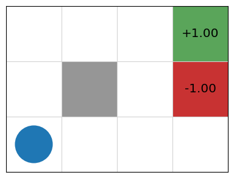

## Basics

$$\mathcal{M} = (S, A, P, r, \gamma)$$

* 有的地方写作$(S, s_0, A, P, r, \gamma)$
* $S$: state space, $s_0 \in S$: initial state
  * 在代码就是`s0 = mdp.reset()`
* $A$: action space, $A(s) \subseteq A$ applicable in each state 当前状态$s$下允许的动作
* $P_a(s \prime | s)$转移概率（trasition probabilities），对于$s \in S, a \in A(s)$
  * 也可以写作：$P(s \prime | s, a)$
  * 是概率化的（即 probabilistic state model），而非确定性的（deterministic）的
  * 如果是确定性的，那就是一个经典的序列决策问题了
* $r(s, a, s \prime)$: reward function，可以为正（奖励）；也可以为负（惩罚）
  * 设计一个 MDP 环境，很大一部分是在设计 reward function
  * $r(s, a)$: 确定性的情况下
  * $r(s, a, s \prime)$: 是在不确定的情况下产生的奖励，就好像抛硬币，不知道下一次出现的是正面还是反面，这时就需要用概率分布来计算了
* $\gamma$: discount factor
  * $0 \leq \gamma < 1$
  * 一般又把这种 MDP 称之为 discounted reward MDP
* MDP 的求解是一个序列决策问题（sequence decision making）

### Probabilistic State Model

* 抛硬币：正面朝上的概率是$\frac{1}{2}$，反面朝上的概率也是$\frac{1}{2}$
* 掷 2 个骰子计算点数和：和为 2 的概率是$\frac{1}{36}$，和为 2 的概率是$\frac{1}{18}$，和为 4 的概率是$\frac{3}{36}$，$\cdots$，和为 12 的概率是$\frac{1}{36}$
* 机械臂去拿一个东西：成功的概率是$\frac{4}{5}$，失败的概率是$\frac{1}{5}$
* 打开一个网页：404 的概率 1%，200 的概率 99%
* $\cdots$

### Discounted Reward

* 如果 agent 在与环境交互中得到一些列的 reward $r_1, r_2, \cdots$，则有

    $$
    \begin{aligned}
    V &= r_1 + \gamma r_2 + \gamma^2 r_3 + \gamma^3 r_4 + \cdots \\\\
    &= r_r + \gamma(r_2 + \gamma(r_3 + \gamma(r_4 + \cdots))) \\\\
    V_t &= r_t + \gamma V_{r + 1}
    \end{aligned}
    $$

  * 递归定义，体现子问题的结构（可以使用动态规划）
  * $V_{t + 1}$的价值通过$\gamma V_{t + 1}$折到现在
  * 因为要最大化 discounted reward，所以$\gamma < 1$会隐式地得到一个更短路径
    * 另外一个角度是：aciton 会有 cost

## Grid World

    

