<center>
    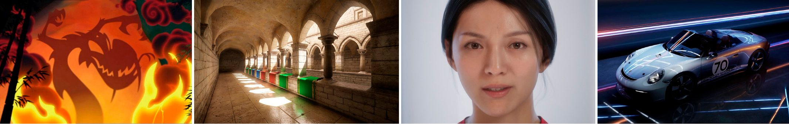
</center>

<!-- more -->

### OpenGL

#### Vertex Shader & Fragment Shader

* For each vertex in parallel 每一个顶点都要做
  * 在 OpenGL 中调用程序定义的 vertex shader：做顶点变换，包括 MVP 变换、需要插值的属性输出给 fragment shader
* For each primitive, OpenGL rasterizes 对每一个片元，OpenGL 进行
  * Generates a fragment for each pixel the fragment covers
* For each fragment in parallel 每一个片段都要做
  * 在 OpenGL 中调用程序定义的 fragment shader：做着色和光照计算

### Shadow Mapping

#### Render from Light & Eye

* Pass 1: Output a "depth texture" from the light source 从光源的角度出发生成一幅深度图
* Pass 2: Render a standard image from eye

#### Project to light for shadows

* Project visible points in eye view back to light source 连向光源，比较场景上的深度和 Shadow Map 中的深度的大小

#### Issues in Shadow Mapping

##### Self Occlusion

<center>
    
</center>

从光源的角度看场景所形成的 shadow map 是一个离散的图，shadow map 上一个像素所覆盖的区域是的**深度值**则为一个**常数**，也就是说 shadow map 记录的深度不是连续的，与实际场景不符。当进行第二次 Pass 时，从场景某一点出发看向光源，就会被遮挡住，如图中黑色部分

> 如果光源方向从上往下垂直照向平面的时候没有自遮挡的问题，如果光源方向几乎平行与平面时自遮挡的问题最严重

* Adding a (variable) bias to reduce self occlusion

  如果实际的深度与的差值小于某个阈值就不算遮挡，相当于遮挡物距场景长的点足够小就忽略这个遮挡物。这个阈值可以不是一个常数，可以根据光源的角度变化。也可以从下图去理解这个 Shadow Bias。

  <center>
      
  </center>

  但是可能回造成悬浮（）的问题，因为物体看起来轻轻悬浮在表面之上。

  **解决方案**（目前没有完美的解决方案）：

  * 找到一个合适的 Shadow Bias——工业界的解决方法

  * Second-dpeth shadow mapping——实际中没有人用
    * Using the midpoint between first and second depths in shadow map
    * requires objects to be 
    * the overhead may not worth it

##### Alias

###### 实时渲染中阴影背后的数学知识

There are a lot of useful inequalities in 

设$f(x)$和$g(x)$在$[a, b]$上都可积，则：

* Schwarz 不等式
  $$
  \left[\int_a^b{f(x)g(x)\mathrm{d}x}\right]^2 \le \int_a^b{f^2(x)\mathrm{d}x} \cdot \int_a^b{g^2(x)\mathrm{d}x}
  $$

* Minkowksi 不等式
  $$
  \left\\{\int_a^b{\left[f(x) + g(x)\right]^2dx}\right\\}^{\frac{1}{2}} \le \left[\int_a^b{f^2(x)dx}\right]^{\frac{1}{2}} + \left[\int_a^b{g^2(x)dx}\right]^{\frac{1}{2}}
  $$

在实时渲染中不太关心不等，关心的是近似相等，贯穿整个实时渲染的一个重要的不等式如下：
$$
\int_\Omega{f(x)g(x)\mathrm{d}x} \approx \frac{\int_\Omega{f(x)\mathrm{d}x}}{\int_\Omega \mathrm{d}x} \cdot \int_\Omega{g(x)\mathrm{d}x}
$$
什么时候上述不等式更加准确：

* $g(x)$的足够小
* $g(x)$是足够光滑的

###### Percentage Closer Soft Shadows

* Percentage Closer Filtering

  * Perform multipule(e.g. $7 \times 7$) depth comparisons for each fragment
  * Then, averages **result of** comparisons

  > **过滤或平均的是什么？**
  >
  > 平均的是任意 shading point 做的很多次阴影深度比较的结果，既不是对 shadow map 做模糊操作，也不是对最后的阴影图做模糊操作

* Filter size <-> blocker distance 如何确定 filter 的大小

<center>
    
</center>

$$
w_{Penumbra} = \frac{(d_{Receiver} - d_{Blocker})\cdot w_{Light}}{d_{Blocker}}
$$

###### <span id="steps"></span>The complete algorithm of PCSS

* Step 1: Blocker search (getting the average blocker depth in a certain region)
* Step 2:  estimation (using the average blocker depth to determine the filter size)
* Step 3: Percentage Closer Filtering

###### Which region to perform blocker search? 如何确定 blocker 的大小

<center>
    
</center>

光源看去生成一个 shadow map，假设 shadow map 放在视锥体的近平面上，从 shading point 连向光源，计算在 shadow map 上覆盖的区域即为 blocker size

### Variance Soft Shadow Mapping

#### A Deeper Look at PCF

* Filter / Convolution
  $$
  \[w * f\](p) = \sum_{q \in \aleph(p)}{w(p, q)f(q)}
  $$

* In PCSS
  $$
  V(x) = \sum_{q \in \aleph(p)}{w(p, q) \cdot \chi^+[D_{SM}(q) - D_{scene}(x)]}
  $$
  每一个 shadow map 上$q$点的深度和场景上$x$点的深度比较，按照某种形式加权平均起来

* Therefore, PCF is not filtering the shadow map then compare 并不是对 shadow map 做模糊然后比较
  $$
  V(s) \neq \chi^+\left\\{\[w * D_{SM}\](q) - D_{scene}(x)\right\\}
  $$
  
* And PCF is not filtering the resulting image with binary visibilities 也不是最后的阴影图做模糊操作
  $$
  V(s) \neq \sum_{y \in \aleph(x)}{w(x, y)V(y)}
  $$

#### Variance Soft Shadow Mapping

##### Which step(s) can be slow?

* [Step 1](#steps)
* [Step 3](#steps)

##### Variance Soft Shadow Mapping

> **PCF** 可以理解为在一场考试中知道自己多少分，想知道自己的排名在百分之几，就需要把所有的人的成绩都统计出来，VSSM 则不需要知道所有人的成绩，就好比知道成绩的分布，然后根据自己的成绩就知道所在位置了

* Key Idea: Quickly compute the **mean** and **variance** of depths in an area

* Mean

  * Hardware MIPMAPing
  * Summed Area Tables(SAT)

* Variance

  * $Var(x) = E(X^2) - E^2(X)$ 利用期望和方差关系的公式，$E(X^2)$可以由另外一个 shadow map，这个 shadow map 记录的时所有深度值的平方，在 OpenGL 中可以将这个深度平方的值记录在其他通道中（纹理由 R、G、B、A 四个通道，shadow map 占用一个通道）
  * Just generate a "square-depth map" along with the shadow map

* Percentage of texels that are closer than the shading point 知道了期望和方差如何计算深度比 shading point 更近点的占比

  可由单边切比雪夫不等式更快的算出来：
  $$
  P(x > t) \le \frac{\sigma^2}{\sigma^2 + (t - \mu)^2}
  $$
  $\mu$是均值，$\sigma^2$是方差，只要知道均值和方差即可带入上述公式，但是必须满足$t > \mu$，可以直观感受切比雪夫不等式

  <center>
      
  </center>

###### Blocker search

<center>
    
</center>

假设 shading point 的深度是 7，已经知道了$5 \times 5$区域大小的平均深度$z_{avg}$，但是小于 7 的遮挡物的平均深度是未知的

* Key idea
  * Blocker（$z < t$的部分，蓝色部分）的平均值记为$z_{occ}$
  * Non-blocker（$z > t$的部分，红色部分）的平均值记为$z_{unocc}$
  * 满足$\frac{N_1}{N}z_{unocc} + \frac{N_2}{N}z_{occ} = z_{avg}$
  * 根据切比雪夫可以估计：$\frac{N_1}{N} = P(x > t)$，$\frac{N_2}{N} = 1 - P(x > t)$
  * 又做了个假设：$z_{unocc} = t$，例如大多数的阴影接受物体是一个平面
* [Step 1](#steps) solved with  additional cost

#### SAT for Range Query

> Need to quickly grab $\mu$ and $\sigma$ from an arbitrary range (rectangular) 需要快速计算出任意矩形范围内的均值和方差
> $$
> P(x > t) \le \frac{\sigma^2}{\sigma^2 + (t - \mu)^2}
> $$

对于均值$\mu$，**MIPMAP** 和 Summed Area Table 都可以来计算，**MIPMAP** 存在误差的问题，并且不能查询非正方形的区域

##### Classic data structure and algorithm (prefix sum) 经典数据结构——前缀和

###### 一维

<center>
    
</center>

###### 二维

<center>
    
</center>

####  Shadow Mapping

<center>
    
</center>

##### Moments

* 最简单的矩：$x, x^2, x^3, x^4, \dots$
* **VSSM** is  using the first two orders of moments

##### What can moments do?

* Conclusion: first $m$ orders of moments can represent a function with $\frac{m}{2}$ steps
* Usually, 4 is good enough to approximate the actual CDF of depth dist

### Environment Mapping

#### Distance Field Soft Shadow

* Distance function: At any point, giving the minimun distance (could be signed distance) to the closest location on an object 在空间中的任何一个点，到某个物体表面的最小距离（距离场可以是有向的，比如在物体内部为负，在物体外部为正）

* An Example: Blending (linear interp.) a moving boundary

  <center>
      
  </center>

##### The Usages of Distance Fields

* Ray marching (Sphere tracing) to perform ray-SDF intersection

  任何一个点上都相当于定义了一个安全距离（safe distance），利用这个安全距离可以近似求出光线与场景中物体的交点

* Use SDF to determine the (approx.) percentage of occlusion

  把安全距离延申为安全角度（safe angle），最后转换为阴影的值

##### How to compute the safe angle?

利用反三角函数：$arcsin\frac{SDF(p)}{\\|p - o\\|}$，图形学中不提倡计算反三角函数（计算量很大），可以通过距离的比值来表示角度的近似，即：$min\left\\{\frac{k \cdot SDF(P)}{\\|p - o\\|}, 1.0\right\\}$，$k$用来控制阴影的软硬程度

#### Shading from Environment Lighting

##### How to use it to shade point (without shadows)?

<center>
    
</center>

不考虑 visibility，任何一个 Shading Point 都要求解这个渲染方程，计算量特别大，不能用在实时渲染中，即如果存在采样（sample）的操作，就很难应用在实时渲染中

###### The Split Sum: 1st Stage

* Recall: the approximation

  $$
  \int_{\Omega}f(x)g(x)\mathrm{d}x \approx \frac{\int_{\Omega_G}{f(x)}\mathrm{d}x}{\int_{\Omega_G}\mathrm{d}x} \cdot \int_{\Omega}{g(x)\mathrm{d}x}
  $$
  
* Conditions for acceptable accuracy? 这个公式什么时候会比较准确

  * $g(x)$的比较小的情况下→BRDF is glossy
  * 或者$g(x)$的值比较的情况下→BRDF is diffuse
  
* 于是就可以把光源项拆出来
  $$
  L_o(p, \omega_o) \approx \frac{\int_{\Omega_{f_r}}{L_i(p, \omega_i)}\mathrm{d}\omega_i}{\int_{\Omega_{f_r}}\mathrm{d}\omega_i} \cdot \int_{\Omega^+}{f_r(p, \omega_i, \omega_o)\cos \theta_i\mathrm{d}\omega_i}
  $$
  拆出来的项相当于把 Light 对应区域积分并归一化，也就是把 IBL 表示的一张图进行

  **为什么要做 pre-filtering：**Then query the per-filtered environment lighting at the $r$(mirror reflected) drection

###### The Split Sum: 2nd Stage

> 如何避免对 BRDF 积分的采样，即
>
> $$\int_{\Omega^+}{f_r(p, \omega_i, \omega_o)\cos \theta_id\omega_i}$$
>
> Idea：Precompute its value for all possible combinations of variables roughness, color(Fresnel term), etc. 预计算所有的参数的可能性
>
> 基于微表面的 BRDF 需要考虑的参数：
>
> * fresnel term 菲尼尔项
> * NDF 微表面的法线分布

**Recall : Microfacet BRDF**

<center>
    
</center>

菲尼尔项可以用 Schlick's 方法近似：
$$
R(\theta) = R_0 + (1 - R_0)(1 - \cos \theta)^5 \\\\
R_0 = \left(\frac{n_1 - n_2}{n_1 + n_2}\right)^2
$$
$R_0$：初始反射率

$\theta$：入射角度

法线分布可以使用 Beckmann distribution：
$$
D(h) = \frac{e^{\frac{\tan^2\theta_h}{\alpha^2}}}{\pi\alpha^2\cos^4\theta_h}
$$
$\alpha$：物体的粗糙度

$\theta_h$：半程向量和法线的夹角

<center>
    
</center>

由于两个类型的角度可以近似，预计算的维度为三维，但仍然需要降维。可以把菲尼尔项的近似形式——Schlick's 带入到积分中：
$$
\begin{aligned}
\int_{\Omega^+}{f_r(p, \omega_i, \omega_o)\cos \theta_id\omega_i} &\approx \int_{\Omega^+}\frac{f_r}{F}F\cos \theta_i\mathrm{d}\omega_i \\\\
&\approx \int_{\Omega^+}\frac{f_r}{F}{(R_0 + (1 - R_0)(1 - \cos \theta)^5)}\cos \theta_i\mathrm{d}\omega_i \\\\
&\approx R_0\int_{\Omega^+}\frac{f_r}{F}(1 - (1 - \cos \theta)^5)\cos \theta_i\mathrm{d}\omega_i + \int_{\Omega^+}\frac{f_r}{F}(1 - \cos \theta)^5\cos \theta_i\mathrm{d}\omega_i
\end{aligned}
$$
Each integral produces one value for each (roughness, incident angle) pair

在实时领域、工业界通常写为求和，所以也被称为 **split sum** 方法：
$$
\frac{1}{N}\sum_{k = 1}^{N}{\frac{L_i(\mathbf{l}_k)f(\mathbf{l}_k, \mathbf{v})\cos \theta\_{\mathbf{l}_k}}{p(\mathbf{l}_k, \mathbf{v})}} \approx \left(\frac{1}{N}\sum_\{k = 1\}^{N}{L_i(\mathbf{l}_k)}\right)\left(\frac{1}{N}\sum_\{k = 1\}^{N}{\frac{f(\mathbf{l}_k, \mathbf{v})\cos \theta\_{\mathbf{l}_k}}{p(\mathbf{l}_k, \mathbf{v})}}\right)
$$

<!--$$-->
<!--\frac{1}{N}\sum_{k = 1}^{N}{\frac{L_i(\mathbf{l}_k)f(\mathbf{l}_k, \mathbf{v})\cos \theta\_{\mathbf{l}_k}}{p(\mathbf{l}_k, \mathbf{v})}} \approx \left(\frac{1}{N}\sum_{k = 1}^{N}{L_i(\mathbf{l}_k)}\right)\left(\frac{1}{N}\sum_{k = 1}^{N}{\frac{f(\mathbf{l}_k, \mathbf{v})\cos \theta\_{\mathbf{l}_k}}{p(\mathbf{l}_k, \mathbf{v})}}\right)-->
<!--$$-->

#### Shadow from environment lighting

> In general, very difficult for real-time rendering 环境光照下的阴影做不到

##### Different perspectives of view

* As a many-light problem 环境光照可以认为是很多光源，每一个光源都要生成一个 Shadow Map 代价非常大
* As a sampling problem 通过解渲染方程需要大量的采样，求解 Visibility Term 项是最难的，只能盲目的采样

##### Industrial solution

Generate one (or a little bit more) shadows 从最亮的一个或几个光源下生成阴影

### Precomputed Radiance Transfer

#### [Background knowledge](22.md)

##### Fourier Transform

Represent a function as a weighted sum of sines and cosines 一个函数可以写成若干$\sin$项和$\cos$项的组合

###### A general understanding

Any product integra can be considered as filtering 两个函数相乘再积分就认为是滤波操作
$$
\int_{\Omega}{f(x)g(x)\mathrm{d}x}
$$

##### Basis Functions

A set of functions that can be used to represent other functions in general 一个函数可以描述为其他函数的线性组合
$$
f(x) = \sum_i{c_i \cdot B_i(x)}
$$

* The Fourier series is a set of basis functions
* The  series can also be a set of basis functions ($1, x, x^2, x^3, \dots$)

#### Real-time environment lighting

##### Spherical Harmonics

> 定义：A set of 2D basis functions $B_i(\omega)$ defined on the sphere 一系列定义在球面上的二维基函数，“球面上”表示方向

<center>
    
    <p>Alternative picture for the real spherical harmonics</p>
</center>
> 到底是什么？
>
> 一堆函数，每一阶拥有一种频率，阶越高对应的基函数的数量越多

* Each SH basis function $B_i(\omega)$ is associated with a () polynomial

* <span id="coefficient "></span>Projection: obtaining the coefficient of each SH basis function 已知任何一个二维的函数${f(\omega)}$，任何一个基函数对应的系数可以通过 Product Integral 获得，求系数的过程就叫做**投影**
  $$
  c_i = \int_{\omega}{f(\omega)}B_i(\omega)\mathrm{d}\omega
  $$

##### Analytic Irradiance Formula

<center>
    
    <p>用 SH 描述<strong>BRDF</strong></p>
</center>

用不同阶的 SH 描述**全局光照**

<center>
    
</center>

> 对于任何的光照条件，只要材质是 Diffused，都可以用前三阶的 SH 来**描述光照**

##### A Brief Summarization

* Usage of basis function
  * Representing any function (with enough #basis) 足够多的基函数可以表示一个函数
  * Keeping a certain frequency contents (with a low #basis) 保留一些低频信息，可以用前几阶的基函数
  * Reducing integrals to dot products
* But here it’s still shading from environment lighting
  * No shadows yet 仍然没有加入阴影

#### Precomputed Radiance Transfer

##### Rendering under environment lighting

$$
L(\mathbf{o}) = \int_{\Omega}{L(\mathbf{i})V(\mathbf{i})\rho(\mathbf{i}, \mathbf{o})\max(0, \mathbf{n} \cdot \mathbf{i})}\mathrm{d}\mathbf{i}
$$

* $L(\mathbf{i})$：Ligghting Term 环境光
* $V(\mathbf{i})$：Visibility Term 从一点往四面八方看，结果要么是 0，要么是 1
* $\rho(\mathbf{i}, \mathbf{o})\max(0, \mathbf{n} \cdot \mathbf{i})$：BRDF Term 原本是四维的，但是从某个地方看即表示知道观察方向，也就知道了入射方向，就可以用二维变量描述

> $i$, incoming directions
>
> $o$,view directions

Brute-force computation 这三项都可以描述成二维的球面函数，如果这样计算量会特别大

##### Basic idea of PRT

> **假设：**场景中其他所有的都不变，只有光照会发生变化，在这种情况下 light transport 也可以当作球面函数

* Approximate lighting using basis functions 把光照拆成 basis functions
  * $L(\mathbf{i}) = \sum{l_iB_i(\mathbf{i})}$
* Precomputation stage
  * compute light transport, and project to basis function space
* Runtime stage
  * dot product (diffuse) or matrix-vector multiplication (glossy)

###### Diffuse Case

> BRDF——$\rho$是一个常值

$$
\begin{aligned}
L(\mathbf{o}) &= \rho \int_{\Omega}{L(\mathbf{i})V(\mathbf{i})\max(0, \mathbf{n} \cdot \mathbf{i})}\mathrm{d}\mathbf{i} \\\\
&\approx \rho \sum{l_i}\int_{\Omega}{B_i(\mathbf{i})V(\mathbf{i})\max(0, \mathbf{n} \cdot \mathbf{i})}\mathrm{d}\mathbf{i} \\\\
&\approx \rho \sum{l_iT_i}
\end{aligned}
$$

* 一种理解方式

  * 上式中的$\int_{\Omega}{B_i(\mathbf{i})V(\mathbf{i})\max(0, \mathbf{n} \cdot \mathbf{i})}d\mathbf{i}$就是 light transport 的球面函数投影到某个基函数上的[系数](#coefficient )

  * Reduce rendering computation to dot product $\rho \sum{l_i}T_i$就是两个向量的点乘

* 另一种理解方式

  * **Separately** precompute lighting and light transport
  * 光照项分别为 lighting coefficient 和 basis functions

  $$
  L(\omega_i) \approx \sum_{p}{c_pB_p(\omega_i)}
  $$

  * 光照传输项分别为 lighting transport coefficient 和 basis functions

  $$
  T(\omega_i) \approx \sum_{q}{c_qB_q(\omega_i)}
  $$

  $$
  \begin{aligned}
  L(p, \omega_o) &= \int_{\Omega^+}{L_i(p, \omega_i)f_r(p, \omega_i, \omega_o)\cos \theta_i V(p, \omega_i)}\mathrm{d}\omega_i \\\\
  &= \sum_p{\sum_q}{c_pc_q}\int_{\Omega^+}{B_p(\omega_i)B_q(\omega_i)}\mathrm{d}\omega_i
  \end{aligned}
  $$

  > Why is it a dot product? (This seems to be $o(n^2)$ rather than $o(n)$?)
  >
  > 虽然看起来像是二维的求和，但是根据 SH 的正交性，只有当$p = q$时积分不为 0；相当于计算二维矩阵对角线上的值

###### Glossy Case

$$
\begin{aligned}
L(\mathbf{o}) &= \int_{\Omega}{L(\mathbf{i})V(\mathbf{i})\rho(\mathbf{i}, \mathbf{o})\max(0, \mathbf{n} \cdot \mathbf{i})}\mathrm{d}\mathbf{i}
\\\\
&\Downarrow
\\\\
L(\mathbf{o}) &\approx \sum{l_iT_i(\mathbf{o})}
\end{aligned}
$$

与 Diffuse 的区别在于 BRDF，Diffuse 的 BRDF 是一个常数，Glossy 的 BRDF 表示不同方向入射光线照到物体表面，反射到不同的方向的结果，所以 Glossy 的 BRDF 是一个的向量。给定任意观察方向$\mathbf{o}$，light transport 都会投影出来一组完全不同的向量，所以在任意观察方向上 light transport 不是个常数，而是$\mathbf{o}$的函数

> Glossy 的物体有一个非常重要的性质——**和视点有关**，Diffuse 的物体和**视点无关**

##### Interreflections and 

> * L：Light 光照
> * E：Eye 眼睛
> * G：Glossy
> * D：Diffuse
> * S：Specular

Runtime is independent of transport complexity

L(D|G)\*E、LS\*(D|G)\*E 起点都是光照，终点都是视角，中间的部分都可以认为是 Light Transport，所以运行时的复杂度和 Light Transport 的复杂度无关

##### Basis Functions $B(\mathbf{i})$

###### Properties 性质

* orthonormal 正交性
  $$
  \begin{aligned}
  \int_{\Omega}{B_i(\mathbf{i}) \cdot B_j(\mathbf{i})} = 1 \quad (i = j)\\\\
  \int_{\Omega}{B_i(\mathbf{i}) \cdot B_j(\mathbf{i})} = 0 \quad (i \neq j)
  \end{aligned}
  $$
  
* simple projection/reconstruction 投影易算

  * Projection to SH space
    $$
    l_i = \int_{\Omega}{L(\mathbf{i}) \cdot B_i(\mathbf{i})}\mathrm{d}\mathbf{i}
    $$

  * Reconstruction
    $$
    L(\mathbf{i}) \approx \sum{l_iB_i(\mathbf{i})}
    $$

* simple rotation 旋转任意一个基函数某个角度，都可以被同阶的基函数线性组合得到

* simple convolution

* few basis functions: low freqs

##### More basis functions

* ~~Spherical Harmonics (SH)~~
* Wavelet 定义在二维平面上
  * 2D Haar wavelet
  * Projection
    * Wavelet Transformation
    * Retain a small number of  non-zero coefficients  保留了一小部分非零的基函数的系数
  * A non-linear approximation 保留非零或最大的数值
  * All-frequency representation 支持全频率表示
  * 不支持快速旋转
* Zonal Harmonics
* Spherical Gaussian (SG)
* Piecewise Constant

##### Precomputation

> light transport 投影到任何一个基函数上，相当于用 basis functions 所描述的环境光照，照亮各个物体，从而计算物体各个点上 shading 的值，相当于 render equation

$$
T_i \approx \int_{\Omega}{B_i(\mathbf{i})V(\mathbf{i})\max(0, \mathbf{n} \cdot \mathbf{i})}\mathrm{d}\mathbf{i}
$$

##### Run-time Rendering

$$
L(\mathbf{o}) \approx \rho \sum{l_iT_i}
$$

* Rendering at each point is reduced to a dot product
  * First, project the lighting to the basis to obtain $l_i$
  * Or, rotate the lighting instead of re-projection
  * Then, compute the dot product
* Real-time: easily implemented in shader

### Real-Time Global Illumination

#### Reflective Shadow Maps (RSM)

* Which surface patches are directly lit? 什么样的表面能都被光源直接照射到

  * Perfectly solved with a classic shadow map 可以通过 Shadow Map 计算出
  * Each pixel on the shadow map is a small surface patch Shadow Map 上的每一个像素都是一片次级光源
  * Assumption
    * Any reflector is diffuse 假设任何次级光源的材质都是 Diffuse
    * Therefore, outgoing radiance is uniform toward all directions

* What is the contribution from each surface patch to $x$

  <center>
      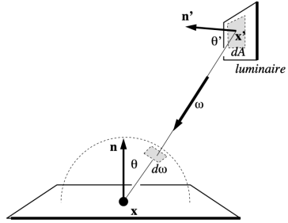
  </center>

  * An integration over the solid angle covered by the patch
  * Can be converted to the integration on the area of the patch
  
  $$
  \begin{aligned}
  L_o(p, \omega_0) &= \int_{\Omega_{patch}}{L_i(p, \omega_i)V(p, \omega_i)f_r(p, \omega_i, \omega_o)\cos{\theta_i}\mathrm{d}\omega_i} \\\\
  &= \int_{A_{patch}}{L_i(p \rightarrow q)V(p, \omega_i)f_r(p, \omega_i, \omega_o)\frac{\cos{p}\cos{q}}{\Arrowvert p - q\Arrowvert^2}\mathrm{d}A}
  \end{aligned}
  $$
  
* For a diffuse reflective path
  
  * $f_r = \frac{\rho}{\pi}$
  
  * $L_i = f_r \cdot \frac{\Phi}{dA}$
  
  * Therefore
    $$
    E_p(x, n) = \Phi_p\frac{\max\\{0, \langle n_p\|x - x_p\rangle\\} \max\\{0, \langle n\|x_p - x \rangle\\}}{\Arrowvert x - x_p\Arrowvert^4}
    $$
  
* Not all pixels in the RSM can contribute
  
  * Visibility 可见性
  * Orientation 方向
  * Distance 距离
  
* What is needed to record in an RSM?
  
  * Depth
  * World coordinate
  * Normal
  * flux
  * etc.
  
#### Light Propagation Volumes (LPV)

> * Key problem
>
>   Query the radiance from any direction at any position *从任何一个方向到达任意一点的 radiance 是多少*
>
> * Key Idea
>
>   Radiance travels in straight line and does not change *radiance 在传播过程中不会衰减*
>
> * Key solution
>
>   Use a 3D grid to propagate radiance from directly illuminated surfaces to anywhere else

##### Steps

* Generation of raidance point scene representation 哪些点作为次级光源（哪些点接收到直接光照）

  * This is to find directly lit surfaces 哪些 surface 被直接照亮
  * Simply applying RSM would suffice 可以利用 RSM
  * May use a reduces set of diffuse sufface patches (virtual light sources) 不必要所有的 patch 都当作次级光源，可以利用采样等方法降低 patch 的数量

* Injection of point cloud of virtual light sources into radiance volume 把场景中接收到直接光照的点放到场景中划分好的格子中

  * Pre-subdivide the scene into a 3D grid 首先场景中有一个三维的格子，工业界大多数用三维纹理
  * For each grid cell, find enclosed vitual light sources 每个格子内都有朝向不同的次级光源
  * Sum up their directional radiance distribution 把这些次级光源的 radiance 累加
  * Project to first 2 orders of SHs (4 in total) 利用 SH 对每个格子内的次级光源的分布进行压缩

* Volumtric radiance propagation

  * For each grid cell collect the radiance received from each of its 6 faces

    <center>
        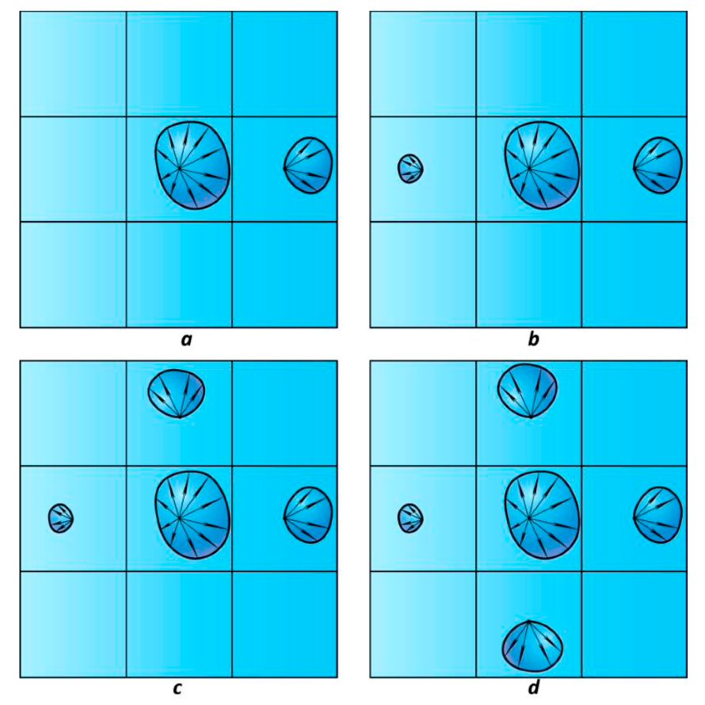
    </center>

  * Sum up, and again use SH to represent

  * Repeat this propagation several times till the volume becomes stable 迭代

* Scene lighting with final light propagation volume 传播完成后就知道了场景中每个格子上的 radiance，直接拿去渲染

  * For any shading point, find the grid cell it is located in
  * Grab the incident radiance in the grid cell (from all directions)
  * Shade

###### Light leaking

<center>
    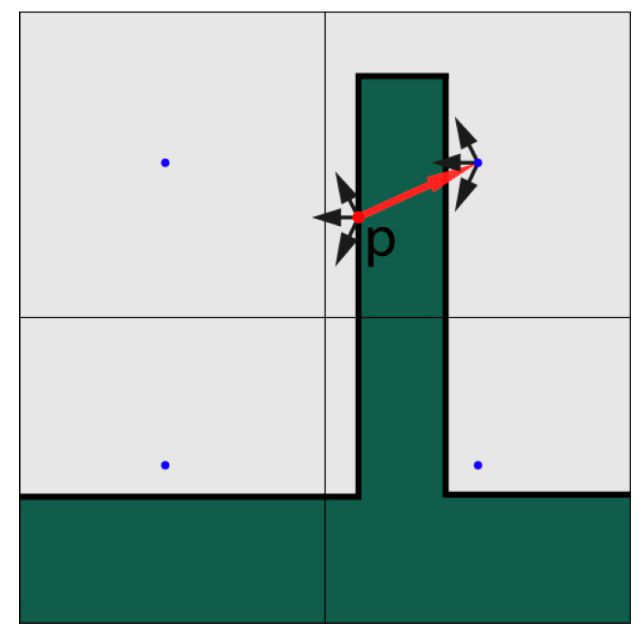
    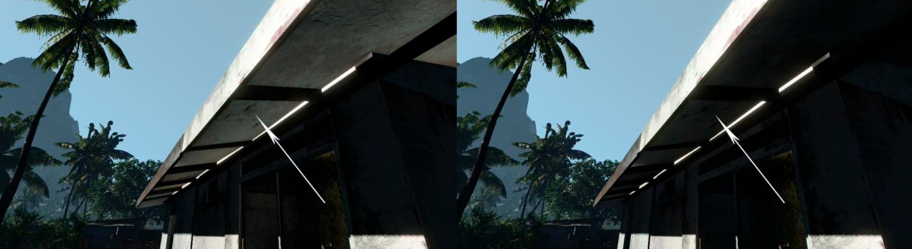
</center>

> 假设$p$点是次级光源，但是无论如何都不会有从$p$点反射出去的 radiance 到右边的情况，但是由于把场景划分成格子，这两个点都在一个格子里面，所以这两个点的 radiance 是一样的。如果格子划分的特别小是可以解决 light leaking 的问题，但是计算时间和存储的问题，工业界会用不同分辨率的格子——cascade

#### Voxel Global Illumination (VXGI)

> * Still a two-pass algorithm
> * Two main diffetences with RSM
>   * Directly illuminated pixels -> (hierachical) voxel 从 RSM 的像素表示的微小的表面到整个场景划分出来具有层次结构的格子
>   * Sampling on RSM -> tracing reflected cones in 3D (Note the inaccuracy in sampling RSM) RSM 和 LPV 做传播都是 ray-tracing（每个点用一个光线传播），VXGI 是 cone-tracing（每个点用锥形的形式进行光线传播）

### Real-Time Global Illumination (Screen Space)

What's is "screen space"?

* Using information only from "the screen"
* In other words, post processing on existing renderings

#### Screen Space Ambient Occlusion (SSAO)

##### Why AO? 为什么要

* Cheap to implement
* But enhances the sense of relative positions 通过阴影的方式，物体的立体感的更加明显了

##### What is SSAO?

* An approximation of global illumination 对全局光照的近似
* In screen space

##### Theory

* Still, everything starts from the rendering equation
  $$
  L_o(p, \omega_0) = \int_{\Omega_{+}}{L_i(p, \omega_i)f_r(p, \omega_i, \omega_o)V(p, \omega_i)\cos{\theta_i}\mathrm{d}\omega_i}
  $$

* And again
  $$
  \int_{\Omega}{f(x)g(x)}\mathrm{d}x \approx \frac{\int_{\Omega_G}f(x)\mathrm{d}x}{\int_{\Omega_G}\mathrm{d}x} \cdot \int_{\Omega}g(x)\mathrm{d}x
  $$

* Sepatating the visibility term 把 visibility 项拆除去
  
  $$
  L^{indir}\_o(p, \omega_o) \approx \frac{\int_{\Omega_+}V(p, \omega_i)\cos{\theta_i}\mathrm{d}\omega_i}{\int_{\Omega_+}\cos{\theta_i}\mathrm{d}\omega_i} \cdot \int_{\Omega_+}L^{indir}_i(p, \omega_i)f_r(p, \omega_i, \omega_o)\cos{\theta_i}\mathrm{d}\omega_i
  $$
  
  乘号$\cdot$左边一项可以写为（the weight-averaged visibility $\overline{V}$ from all directions）：
  $$
  k_A = \frac{\int_{\Omega_+}{V(p, \omega)\cos \theta_i\mathrm{d}\omega_i}}{\pi}
  $$
  
  乘号$\cdot$右边一项可以写为（constant for AO）：
  $$
  L^{indir}_i(p) \cdot \frac{\rho}{\pi} \cdot \pi = L^{indir}_i(p) \cdot \rho
  $$
  
* A deeper understanding 1
  $$
  \begin{aligned}
  \int_{\Omega}{f(x)g(x)}\mathrm{d}x &\approx \frac{\int_{\Omega_G}f(x)\mathrm{d}x}{\int_{\Omega_G}\mathrm{d}x} \cdot \int_{\Omega}g(x)\mathrm{d}x \\\\
  &= \overline{f(x)} \cdot \int_{\Omega}g(x)\mathrm{d}x
  \end{aligned}
  $$
  the average $f(x)$ in the support of $G$

* A deeper understanding 2

  * Why can we take the cosine term with $d\omega_i$?
  
    $$
    L^{indir}\_o(p, \omega_o) \approx \frac{\int_{\Omega_+}V(p, \omega_i)\cos{\theta_i}\mathrm{d}\omega_i}{\int_{\Omega_+}\cos{\theta_i}\mathrm{d}\omega_i} \cdot \int_{\Omega_+}L^{indir}_i(p, \omega_i)f_r(p, \omega_i, \omega_o)\cos{\theta_i}\mathrm{d}\omega_i
    $$

  * Projected solid angle $dx_\perp = \cos\theta_id\omega_i$

    将单位球上的面积投影到一个单位圆上

    * unit hemisphere -> unit disk
    * integration of peojected solid angle -> the area of the unit disk

    <center>
        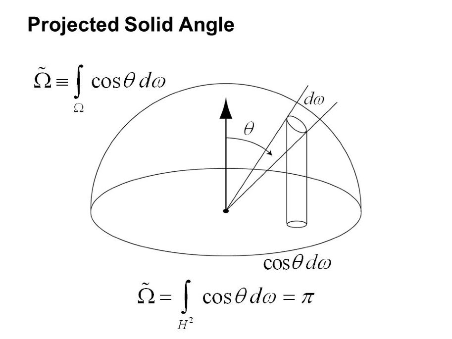
    </center>

* Actually, a much simpler understanding

  * Uniform incident lighting - $L_i$ is constant

  * Diffuse DSDF - $f_r = \frac{\rho}{\pi}$ is also constant

  * Therefore, taking both out of the integral:
    $$
    \begin{aligned}
    L_o(p, \omega_0) &= \int_{\Omega{+}}{L_i(p, \omega_i)f_r(p, \omega_i, \omega_o)V(p, \omega_i)\cos{\theta_i}\mathrm{d}\omega_i} \\\\
    &= \frac{\rho}{\pi} \cdot L_i(p) \cdot \int_{\Omega+}V(p, \omega_i) \cos\theta_i\mathrm{d}\omega_i
    \end{aligned}
    $$

##### Ambient occlusion using the z-buffer

<center>
    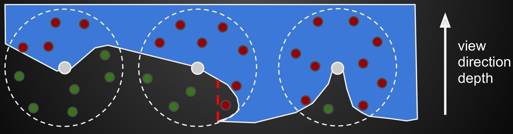
</center>

* Using the readily available depth buffer as an approximation of the scene geometry 任何一个 Shading Point 都以自身为中心，半径为$r$的球内部采样一些点，判断采样点能否被 Shading Point 看到
* Take samples in a sphere around each pixel and test against buffer
* If more than half the samples are inside, AO is applied, amount depending on ratio of samples that pass and fail depth test
* Uses sphere instead of hemisphere, since normal information isn't available 所有的渲染方程的定义域都是半球，那为什么 AO 用整个球？因为 Camera 渲染出来不能既知道深度有知道法线，不知道法线就无法用半球来估计
* Approximation of the scene geometry, some fails are incorrect. The one behind the red line for example. False occlusions.
* Samples are not weighted by $\cos \theta$, so not physically accurate, but looks convincing.

### Horizon based ambient occlusion (HBAO)

* Also done in screen space.
* Approximates ray-tracing the depth buffer
* Requires that the normal is know, and only samples in a hemisphere

<center>
    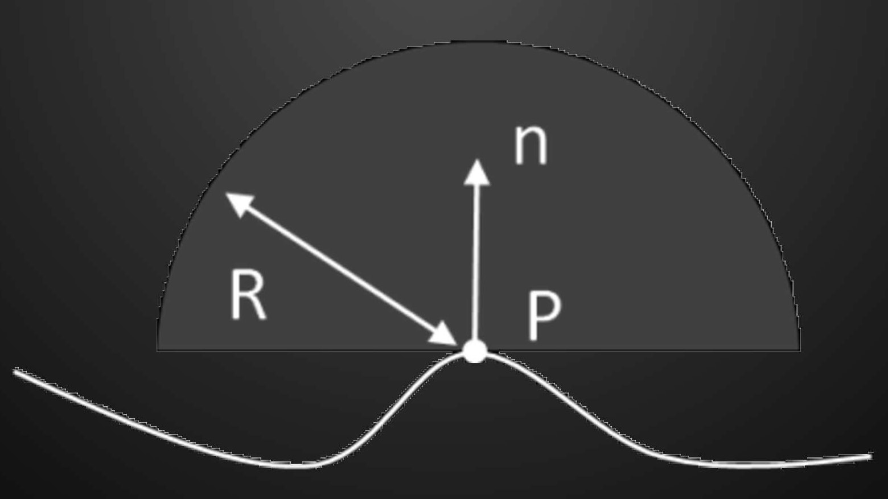
</center>

#### Screen Space Directional Occlusion (SSDO)

##### Very similar to path tracing

* At shading point $p$, shoot a random ray
* if it does not hit an obstacle, direct illumination
* If it hits one, indirect illumination

##### Comparison with SSAO

* AO: <font color="EE5007">**indirect illumination**</font> +  <font color="F8CB2E">**no indirect illuminatino**</font>

  在 AO 中，红色圈内的表示能接收到间接光照，橙色圈内的表示没有间接光照

* DO: <font color="EE5007">**no indirect illumination**</font> +  <font color="F8CB2E">**indirect illuminatino**</font>

  在 DO 中，红色圈内则表示直接光照，橙色圈内则表示能接收到间接光照

<center>
    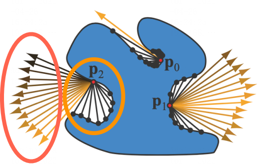
</center>

##### Consider unoccluded and occluded directions separately

$$
\begin{aligned}
L^{dir}_o(p, \omega_o) &= \int_\{\Omega+,V=1\}L^{dir}_i(p,\omega_i)f_r(p,\omega_i, \omega_o)\cos\theta_i\mathrm{d}\omega_i
\\\\
L^{indir}_o(p, \omega_o) &= \int_\{\Omega+,V=0\}L^{indir}_i(p,\omega_i)f_r(p,\omega_i, \omega_o)\cos\theta_i\mathrm{d}\omega_i
\end{aligned}
$$

##### SSDO similar to HBAO

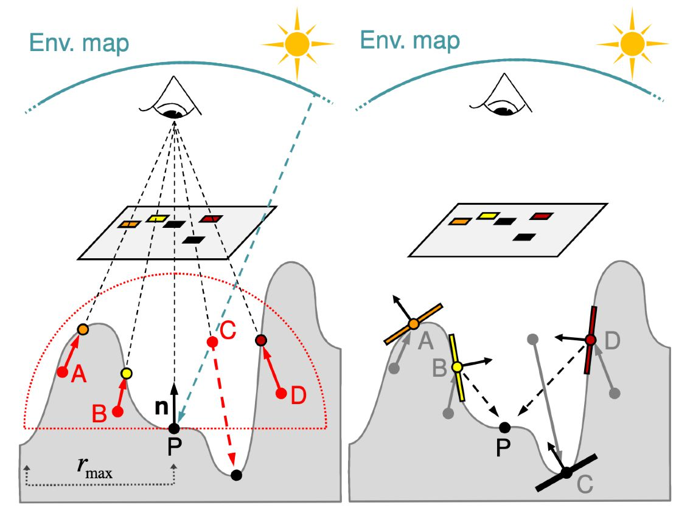
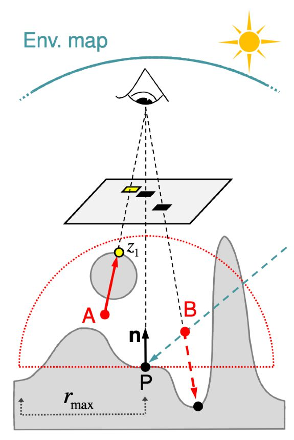

从$P$点往$A$、$B$、$C$、$D$方向看能不能被挡住，还做之前的假设——不管从$P$到$A$能不能被挡住，只考虑从相机到$A$能不能被挡住（非常大胆的假设，但一定程度上是有效的）。右面的一幅图可以理解为对$P$有贡献的点的和，$A$点由于被遮挡所以不计算在内。
这样假设也会出现一些大问题，如第三幅图的情况——$A$从相机视角被一个悬浮的物体挡住了，但是$P$点是可以直接看到$A$点。

##### Issues

* GI in a short range 只能解决一个小的范围内的全局光照

* Visibility 对于可见性不准确

* Screen space issue: missing informaiton from **unseen**surfaces 丢失看不见部分的信息

  <center>
      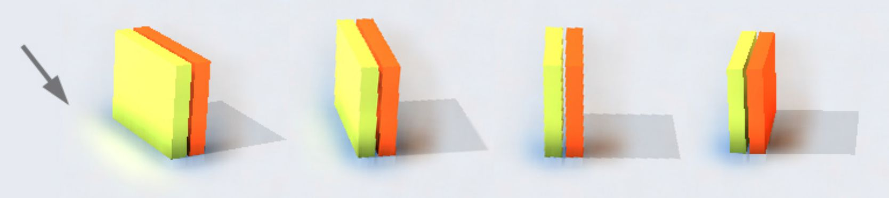
  </center>

#### Screen Space Reflection (SSR)

##### What is SSR?

* Still, one way to intoduce Global Illumination in RTR 实时渲染中实现全局光照的一种方式
* Performing ray tracing 屏幕空间上的光线追踪
* But does not require 3D primitives (triangles, etc.) 不需要三维空间中的各种信息

##### Two fundametal tasks of SSR

* Intersection: between any ray and scene
* Shading: contribution from intersected pixels to the shading point

##### Basic SSR Algorithm - Mirror Reflection

* For each fragment

  * Compute reflection ray
  * Trace along ray direction (using depth buffer)
  * Use color of intersection point as reflection color

* Linear Raymarch (Find intersection point)

  <center>
      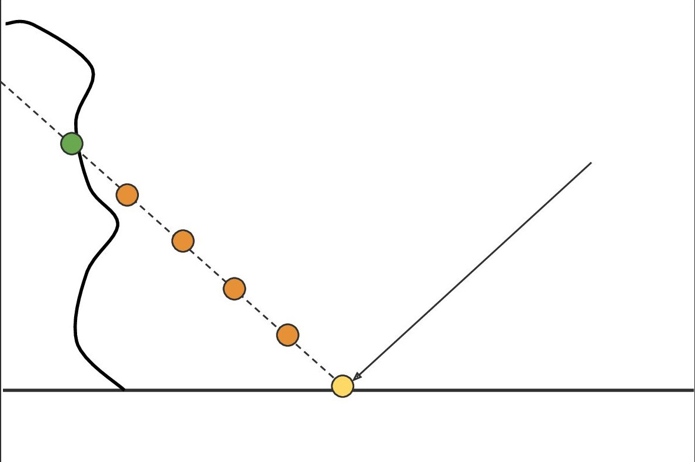
  </center>

  * At each step, check depth value
  * Quality depends on step size
  * Can be refined

* Generate Depth Mip-Map

  <center>
      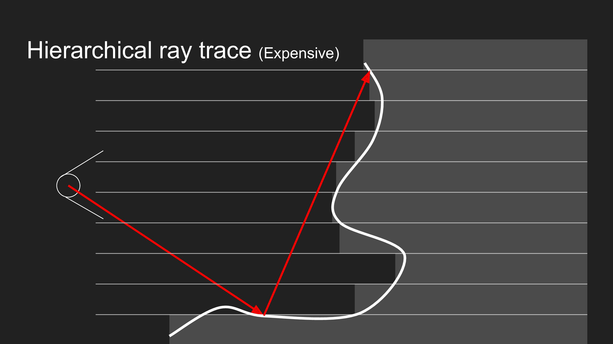
  </center>

  * Use min values instead of average

    <center>
        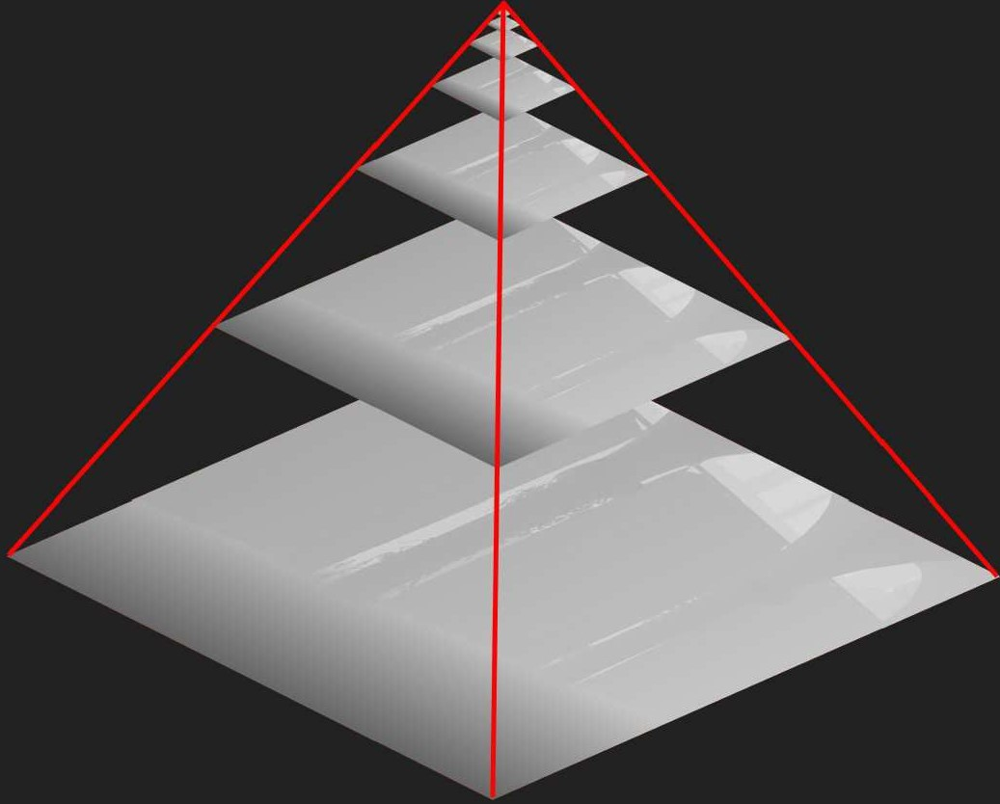
    </center>

  > 和正常的 Mip-Map 的做法不一样的地方在于，上一层的 4 个像素不再是下一层的平均值，而是最小值，也就是深度离场景最近的位置

##### Why Depth Mipmap

* Very similar to the hierarchy(BVH, KD-tree) in 3D 对场景建立一个层次结构
* Enabling faster rejecting of non-intersecting in a bunch 很容易跳过不可能相交的像素
* The min operation guarantees a conservative logic 这个最小的操作就会得到一个保守的逻辑
  * If a ray does not even intersect a larger node, it will never intersect any child nodes of it 如果一个像素不和其上层的像素相交，也不可能和下层的像素（子节点）相交

<center>
    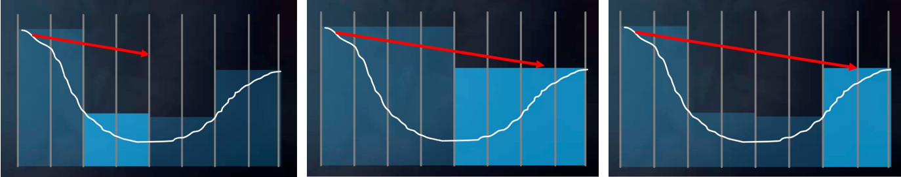
</center>
```c++
mip = 0;
while (level > -1)
{
    step through current cell;
    if (above Z place) ++level;
    if (below Z plane) --level;
}
```

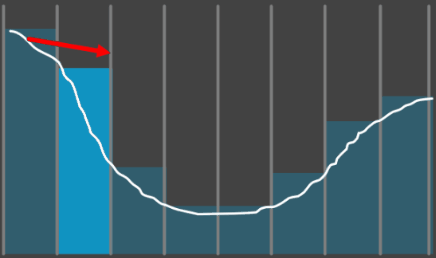

##### Problem

* Hidden Geometry Problem 对场景的理解只到外面的“壳”
* Edge Cutoff 会出现明显的 cut
  * Edge Fading 根据反射光走的距离做衰减，虚化边缘

##### Shading using SSR

* Absolutely no difference from path tracing 从在三维场景中的光线追踪到场景中“壳”的光线追踪
  * Just again assuming diffuse reflections / secondary lights

* Requirements
  * Sharp and blurry reflections
  * Contact hardening
  * Specular elgonation
  * Per-pixel roughness and normal
* Improvements
  * BRDF importance sampling

### Real-Time Physically-Based Materials (surface models)

#### Microfacet BRDF 微表面

##### PBR and PBR Materials

* Physically-Based Rendering(PBR)
  * Everything in rendering should be physically based
  * Materials, lighting, camera, light transport, etc.
  * Not just materials, but usually referred to as materials :)
* PBR materials in RTR
  * The RTR community is much behind the offline community 在实时渲染中的 PBR 材质要落后于离线渲染
  * "PB" in RTR is usually not actually physically based :) 在实时渲染中提到的“Physically-Based”基本都不是“Physically-Based”
  * For surfaces, mostly just micorfacet models (used wrong so not PBR) and disney principled (artist friendly but still not PBR)
  * For volumes, mostly focused on fast and approximate single scattering and multiple scattering (for clound, hair, skin, etc.)

##### Microfacet BRDF

$$
f(\mathbf{i}, \mathbf{o}) = \frac{F(\mathbf{i}, \mathbf{h})G(\mathbf{i}, \mathbf{o}, \mathbf{h})D(\mathbf{h})}{4(\mathbf{n}, \mathbf{i})(\mathbf{n}, \mathbf{o})}
$$

###### $F(\mathbf{i}, \mathbf{h})$ Fresnel term

* 从一个角度看过去，有多少能量被反射。当站在河边：
  * 垂直水面看下去反射的光就会少
  * 看水面远处的地方反射的光会增加
* Accurate: need to consider polarization 精确的方程式需要考虑到极化
* Approximate: Schlick's approximation 简单的估计
  * $R(\theta) = R_0 + (1 - R_0)(1 - \cos \theta)^5$
  * $R_0 = \left( \frac{n_1 - n_2}{n_1 + n_2} \right)^2$ 基础反射率

###### $G(\mathbf{i}, \mathbf{o}, \mathbf{h})$: shadowing-masking term

###### $D(\mathbf{h})$: distribution of normals NDF(Normal Distribution Function) 法线的分布

* Concentrated <==> flossy
* Spread <==> diffuse

##### Normal Distribution Function (NDF)

* has noting to do with the normal distribution in stats 不同于统计学中的正态分布
* Various models to describe it: Beckmann, GGX, etc.

###### Beckmann NDF

> * Similar to a Gaussian
>   $$
>   f(x) = \frac{e^{-\frac{(x - \mu)^2}{2 \sigma^2}}}{\sqrt{2 \pi \sigma^2}}
>   $$
>
>
> * But defined on the **slope space** 坡度空间
>
><center>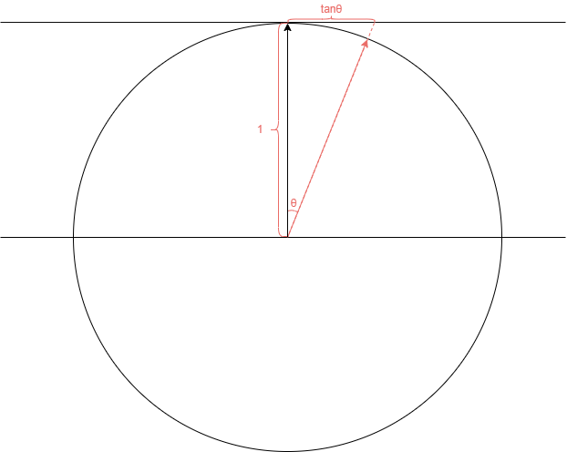</center>
>
> * 使用$\tan \theta$作为参数可以永远保证不存在面朝下的微表面

$$
D(h) = \frac{e^{-\frac{\tan^2 \theta_h}{\alpha^2}}}{\pi \alpha^2 \cos^2 \theta_h}
$$

$\alpha$: roughness of the surface (the samller, the more like mirror/specular) 相当于正太分布的标准差

$\theta_h$: angle between half vector $h$ and normal $n$

###### GGX (or Trowbridge-Reitz)

* Typical characteristic: long tail 明显的特点：“长尾”
* 在 grazing angle 的时候还是有能量

###### Extending GGX

GTR (Generalized Trowbridge-Reitz), even longer tails 更长的“拖尾”

##### Shadowing-Masking Term

Or, the geometry term $G$

* Account for self-occlusion of microfacets 解决的是微表面之间自遮挡的问题以及 grazing angles 的问题
* Shadowing -- light, masking -- eye 从 light 的角度看，微表面自遮挡的现象——Shadowing 从眼睛的角度看，看不到微表面的现象——Masking
* Provide darkening esp. around grazing angles 需要提供一个变暗的操作

###### A commonly used shadowing-masking term

* The Smith shadowing-masking term
* Decupling shadowing and masking 将 shadowing 和 masking 分开

$$
G(i, o, m) \approx G_1(i, m)G_2(o, m)
$$

##### Kulla-Conty Approximation for Multiple Bounces

* Missing energy 能量损失

  * Especially prominent when roughness is high 随着粗超度增大能量损失越明显
  * 微表面越粗糙度，沟壑越大，当光线打到微表面的时候，反射的光越容易被其他的微表面挡住，损失的能量越多

* Adding back the missing energy

  * Heitz et al. 2016 基于模拟的方法
  * But can be too slow for RTR

* The Kulla-Conty Approximation

  * What's the overall energy of an outgoing 2D BRDF lobe?
    $$
    E(\mu_0) = \int^{2\pi}_0{\int^1_0{f(\mu_o, \mu_i, \phi)}\mu_i\mathrm{d}\mu_i}\mathrm{d}\phi
    $$

    > $\mu = \sin \theta$

  * Key Idea 设计了一种 BRDF，使得丢失的能量正是原来丢掉的部分

    * We can design an additional lobe that intergrates to $1 - E(\mu_o)$ 有多少能量被遮挡掉
    * The outgoing BRDF lobe can be different for different incident dir.
    * Consider reciprocity, it should be of the form $c(1 - E(\mu_i))(1 - E(\mu_o))$
    * Therefor,
        $$
        f_{ms}(\mu_o, \mu_i) = \frac{(1 - E(\mu_i))(1 - E(\mu_o))}{\pi(1 - E_{avg})}, E_{avg} = \int_0^1{E(\mu)\mu\mathrm{d}\mu}
        $$
    * Precompute / tabulate

    * What if the BRDF has color?
      * 有颜色意味着有能量被吸收，意味着能量有损失
      * So we'll just need to compute the overall energy loss 由于颜色造成的能量损失

    * Define the average Frensel (how much energy is reflected) 不管入射角多大，计算平均每次反射会损失多少能量
        $$
        F_{avg} = \frac{\int_0^1{F(\mu)\mu\mathrm{d}\mu}}{\int_0^1\mu\mathrm{d}\mu} = 2\int_0^1{F(\mu)\mu\mathrm{d}\mu}
        $$

    * Therefor, the proportion of energy (color) that 最后能看到的能量的构成
      * You can directly see: $F_{avg}E_{avg}$
      * After one bounce then be seen: $F_{avg}(1 - (E_{avg})) \cdot F_{avg}E_{avg}$
      * ...
      * After $k$ bounces then be seen: $F_{avg}^k(1 - (E_{avg}))^k \cdot F_{avg}E_{avg}$

    * Adding everything up, we have the color term 级数求和得到最终的结果
      * Which will be directly multiplied on the <font color="#EA5455">uncolored</font>  **additional BRDF**

        $$
        \frac{F_{avg}E_{avg}}{1 - F_{avg}(1 - E_{avg})}
        $$

##### Shading Microfacet Models using Linearly Transformed Cosines (LTC)

* Solves the shading of microfacet models
  * Mainly on GGX, though others are also fine
  * No shadows 不考虑阴影
  * <font color="#F7C04A">Under polgon shaped lighting</font> 多边形光源
  * <font color="#EA5455">Split Sum 本质上是做环境光下的 Shading</font>

* Key Idea
  * Any outgoing 2D BRDF lobe can be transformed to a cosine
  * The shape of the light can be transformed along
  * Integration the transformed light on a cosine lobe is **<font color="#F7C04A">analytic</font>** 转换后的积分是有 **<font color="#F7C04A">解析解</font>** 的

* Observations 任何 cosine 的 lobe 都可以通过$M$变换，变换成 BRDF 的 lobe
  * BRDF $\enspace \stackrel{M^{-1}}{\longrightarrow} \enspace$ Cosine
  * Direction: $\omega_i \enspace \stackrel{M^{-1}}{\longrightarrow} \enspace \omega_i^\prime$
  * Domain to integrate: $P \enspace \stackrel{M^{-1}}{\longrightarrow} \enspace P^\prime$

<center>
    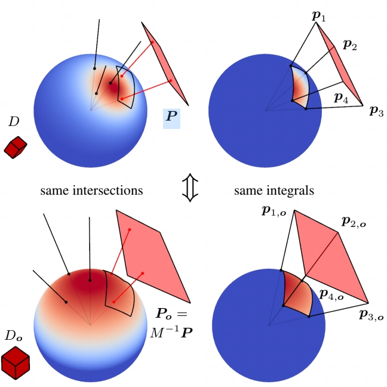
</center>

* Approach

A simple change of variable 替换变量 $\omega_i = \frac{M\omega_i^\prime}{\|{M\omega_i^\prime}\|}$

$$
\begin{aligned}
L(\omega_o) &= L_i \cdot \int_P{F(\omega_i)\mathrm{d}\omega_i} \\\\
&= L_i \cdot \int_P{\cos(\omega_i^\prime)\mathrm{d}{\frac{M\omega_i^\prime}{\|{M\omega_i^\prime}\|}}} \\\\
&= L_i \cdot \int_{P^\prime}{\cos(\omega_i^\prime)J\mathrm{d}{\omega_i^\prime}}
\end{aligned}
$$

> * 渲染方程有三个部分：入射光、Cosine、BRDF，$F$表示把 Cosine 和 BRDF 合到了一起，在多边形覆盖的立体角内进行积分
> * 通过这个变换把$F$变成 Cosine
> * 引入 Jacobi 项
> * 给定一个 GGX 模型的法线分布，已知出射的 BRDF 的 lobe，变换成 Cosine；从不同的方向观察得到不同的 BRDF 的 lobe，每一种 lobe 都要变换成 Cosine，对于常见的 lobe 可以预计算一个变换矩阵
> * 各项异性的表面可以用 LTC，各项异性：有一根光线打入后，根据不同的观察方向，会有不同的 BRDF

#### Disney's Principled BRDF

* Motivation
  * No physically-based materials are good at rep. all real materials 微表面模型并不能表示所有的材质
  * Physically-based materials are not artist friendly 对“艺术家”来说非常不友好
    * e.g. "the complex index of refraction $n-ik$"

<center>
    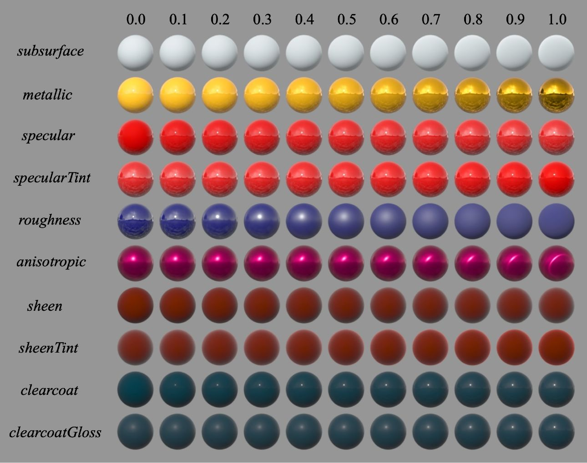
</center>

* A table showing the effects of **individual** parameters
  * subsurface 次表面散射 比 Diffuse 还要平的效果
  * metallic 金属性
  * specular 相当于 Blinn-Phong 模型中的$K_s$，控制镜面反射区域的大小
  * specular Tint 可以表示镜面反射的颜色
  * roughness 粗糙程度
  * anisotropy 各项异性
  * sheen 雾化效果
  * sheen Tint 雾化效果（颜色）
  * clearcoat 清漆
  * clearcoat Gloss 清漆（光滑程度）

#### Non-Photorealistic Rendering (NPR 非真实感渲染）

* Characteristics of NPR

  * Starts from photorealistic rendering
  * Exploits abstraction
  * Strengthens important parts

* Applications of NPR

  * Art 艺术
  * Visualization 可视化
  * Instruciton 说明书
  * Education
  * Entertainment 娱乐
  * ...

##### Outline Rendering

* Outlines are not just contours 不仅仅是轮廓
  * [B]oundary / border edge 边界；边缘
  * [C]rease 折痕
  * [M]aterial edge 材质的边界
  * [S]ilhouette edge 剪影；有多个面共享的边界
    * 必须是物体的外轮廓边界
    * 有多个面共享的边界

<center>
    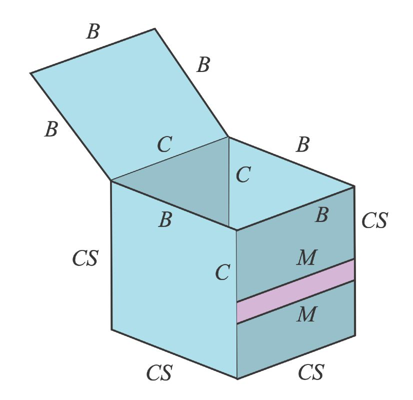
</center>

###### Outline Rendering -- Shading [Silhouette]

Darken the surface where the shading normal is  to viewing direciton 观察的方向和物体上某一点的法线方向几乎垂直的边就是 [Silhouette] 边，但会造成描边粗细不一样

###### Outline Rendering -- Geometry

Backface fattening

* Render frontface normally
* "Fatten" backfaces, then render again 背向观察者的面上的三角面片都扩大，然后进行渲染
* Extension: fatten along vertex normals

###### Outline Rendering -- Image

Edge detection in images

* Usually use a Sobel detector

##### Color blocks 大量的色块

* Hard shading: thresholding on shading 在 shading 的过程中阈值化
* Posterization: thresholding on the final image color 在最后的图像上阈值化
* May not be binary 阈值化不一定只是二值化

##### Some Note

* NPR is art driven
* But you need the ability to "translate" artists' needs into rendering insights
* Communicaiton is important
* Sometimes, per character, even per part

### Real-Time Ray Tracing (RTRT)

In 2018, NVIDA announced GeForce RTX series (Turing architecture) 有了 RTX 之后，允许我们每秒追踪更多的光线 （tensor core 加速神经网络感知；RT core 加速光线追踪），每秒钟能够追踪 10G 的光线，然而实际应用中：只能一个像素用一个样本采样，得到光线追踪的结果

1 SPP(**<font color="#F7C04A">sample per pixel</font>**) path tracing = 1 <font color="#EA5455">rasterization</font> (primary) + 1 ray (primary visibility) + 1 ray (secondary bounce) + (secondary visibility)

* <font color="#EA5455">rasterization</font> 光栅化和 primary ray 的结果是等价的，但是光栅化可以更快
* 1 SPP 噪声是一个夸张的结果
* 所以 RTX 关键的技术是 **<font color="#F7C04A">Denosing 降噪</font>**

Goals **<font color="#F7C04A">with 1 SPP</font>**

* Quality (no overblur, no artifacts, keep all details ...)
* Speed (less than 2ms to denoise one frame)

Industrial Solution **<font color="#EA5455">Temporal</font>**

* Suppose the previous frame is denoised and reuse it 认为当前帧的前一帧是已经滤波好了的
* Use <font color="#19A7CE">motion vectors</font> to find previous locations
* Enssentially increased SPP

G-Buffers

* The  infomation acquired **<font color="#F7C04A">FOR FREE</font>** during rendering 在渲染场景的过程中“免费”得到的一些信息，但 **<font color="#F7C04A">FOR FREE</font>*** 并不是 100%的“免费”
* Usually, per pixel depth, normal, world coordinate, etc.
* Therefore, only **screen space** info

#### Back Projection

* Pixel $x$ in the current frame $i$
  * ~~Where was it in the last frame i - 1 ?~~ 要找到上一帧像素$x$在哪，但是可以换一种描述
  * What pixel in fram $i - 1$ contains <font color="#EA5455">the same place/point</font> that you see through pixel $x$ in frame $i$? 在上一帧哪一个像素是在当前帧所观察到的点

* Back projection
  * if world coord $s$ is available as a G-buffer, just take it 第一种方法
  * Otherwise, $s = M^{-1}V^{-1}P^{-1}E^{-1}x$(still require $z$ value) 第二种方法
  * Motion is known: $s^\prime \stackrel{T}{\longrightarrow} s$, thus $s^\prime = T^{-1}s$ 物体如果存在运动
  * Project world coord in frame $i - 1$ to its screen: $x^\prime = E^\prime P^\prime V^\prime M^\prime s^\prime$

#### Temporal Accum./Denoising

> * $\tilde{C}$: unfiltered
> * $\bar{C}$: filtered

This frame ($i$-th frame)
$$
\bar{C}^{(i)} = Filter[\tilde{C}^{(i)}]
$$
\bar{C}^{(i)} = \alpha\bar{C}^{(i)} + (1 - \alpha)\tilde{C}^{(i - 1)}, \alpha \in [0.1, 0.2]
$$
> 80% - 90% cobtributions from last frame(s)

Temporal Failure

Temporal info is not always available
* Failure case 1: switching scenes (**<font color="#F7C04A">burn-in period</font>**) 切换场景或者第一帧
* Failure case 2: walking backwards in a hallway (**<font color="#F7C04A">screen space issue</font>**) 在走廊中倒退镜头，越来越多的信息会出现在视野范围内
* Failure case 3: suddenly appearing background (**<font color="#F7C04A">disocclusion</font>**)

Adjustments to Temporal Failure

* Clamping: Clamp previous toward current 把上一帧的结果“拉”到当前帧
* Detection 检测到底要不要用以前的信息
    * Use e.g. object ID to detect temporal failure 每个物体都给定一个渲染 ID
    * Tune $\alpha$, binary or continuously 微调$\alpha$
    * Possibly strengthen / enlarge spatial filtering
> 会重新引入一些噪声

Some Side Notes

* The temporal accumulation is inspired by Temporal Anti-Aliasing(TAA) 这两个概念几乎等同
  * They are very similar
  * Temporal reuse essentially increses the sampling rate

#### Implementation of filtering

Suppose we want to (low-pass) filter an image 希望保留低频信息
* To remove (usually high-frequency) noise
* Now only focus on the spatial domain <font color="#617143">spatial domain 空间域区别于频域</font>

Inputs

* A noisy image $\tilde{C}$
* A filter kernel $K$, could vary per pixel

Output - A filterd image $\bar{C}$

Let's assume a Gaussian filter centered at pixel $i$ (2D)
* Any peixl $j$ in the neighborhood of $i$ would contribute 从高斯的$3\sigma$范围内取，包括本身
* Based on the distance between $i$ and $j$
  ***
  ***
    $$
    \begin{align*}
    & For \enspace each \enspace pixel \enspace i\\\\
    &    \qquad sum_{weights} = 0.0 \\\\
    &    \qquad sum_{weightedvalues} = 0.0 \\\\
    &    \qquad For \enspace each \enspace pixel \enspace j \enspace around \enspace i \\\\
    &        \qquad\qquad Calculate \enspace the \enspace weight \enspace w_{ij} = G(|i - j|, \sigma) \\\\
    &        \qquad\qquad sum_{weightedvalues} += w_{ij} * C^{input}[j] \\\\
    &        \qquad\qquad sum_{weights} += w_{ij} \\\\
    &    \qquad C^{output}[i] = sum_{weightedvalues} / sum_{weights}
    \end{align*}
    $$
  ***
> $sum_{weightedvalues} / sum_{weights}$目的是做归一化
> Test whether $sum_{weights}$ is zero (for other kernels) 对于其他的滤波核需要判断$sum_{weights}$不为 0，高斯滤波核必定不为 0
> Color can be multi-channel

##### Bilateral filtering 双边滤波

Observation The boundary <-> drastically changing colors 边界就是颜色变换非常剧烈的地方

Idea

* How to keep the boundary?
* Let pixel $j$ contribute less if its color is too different to $i$ 如果$i$和$j$颜色差距很大，就让$j$的贡献变小

$$
w(i, j, k, l) = exp\left(-\frac{(i - k)^2 + (j - l)^2}{2\sigma^2_d} - \frac{\|I(i, j) - I(k, l))\|^2}{2\sigma^2_r}\right)
$$

$(i, j)$是一个点，$(k, l)$是另一个点

##### Joint Bilateral filtering 联合双边滤波

* Gaussian filtering: 1 metric (distance) 高斯滤波提出了一个标准——距离
* Bilateral filtering: 2 metric (position distance & color distance) 双边滤波提出了两个标准

<center>
    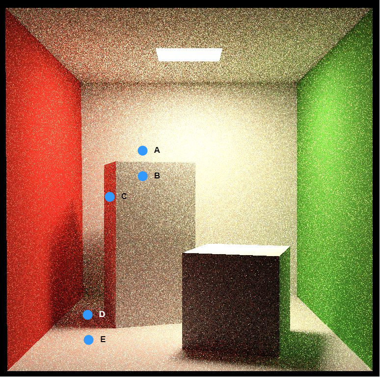
</center>

Suppose we consider 假设考虑 G-Buffer 生成的两种种额外的信息
* Depth
* Normal
* Color 颜色不属于 G-Buffer 生成出来的

Why we do not blur the boundary between
* A and B: depth
* B and C: normal
* D and E: color

##### Implementing Large Filters

* For samll filters, this is fine (e.g. $7 \times 7$)
* For large filters, this can be <font color="#F7C04A">prohibitively heavy</font> (e.g. $64 \times 64$)

Solution 1: Separate Passes

Consider a 2D Gaussian filter
* Seprate it inro a horizontal pass ($1 \times N$) and a vertical pass ($N \times 1$) 对于任何一个像素来说，都取它周围$1 \times N$或$N \times 1$的范围进行高斯滤波
* #queries: $N^2 \rightarrow N + N$ 查询次数从$N^2$到$2N$

> 为什么能够从$N^2$到$2N$
>
> A 2D Guassian filter kernel is separable 二维的高斯函数的定义就是可以拆分的
>
> $G_{2D}(x, y) = G_{1D}(x) \cdot G_{1D}(y)$
>
> filtering == convolution 滤波就是卷积
>
> $\int\int{F(x_0, y_0)G_{2D}(x_0 - x, y_0 - y)\mathrm{d}x\mathrm{d}y} = \int\left(\int{F(x_0, y_0)G_{1D}(x_0 - x)\mathrm{d}x}\right)G_{1D}(y_0 - y)\mathrm{d}y$

Solution 2: Progressively Growing Sizes

A-trous wavelet

* Multiple passes, each is a $5 \times 5$ filter
* Ther interval between samples is growing ($2^i$) (save e.g. $64^2 \Rightarrow 5^2 \times 5$) 样本和样本之间的间隔都是$2^i$
<center>
    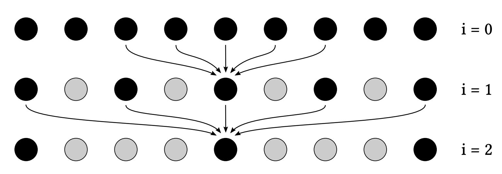
</center>

> * Why growing sizes？为什么要用逐渐增大的 filter，而不是直接使用一个大的 filter
>
>   Applying larger filter == removing lower frequencies 用更大的 filter 意味着去除更低的频率，用越小的 filter 意味着去掉更高的频率，不断的去除不同的频率
>
> * Why is it safe to skip samples? 为什么能够跳着采样
>
>   Sampling == repeating the spectrum 采样在频域就是搬移频谱，将有规则的频谱段搬移到无规则的频谱段
>
> <center>
>    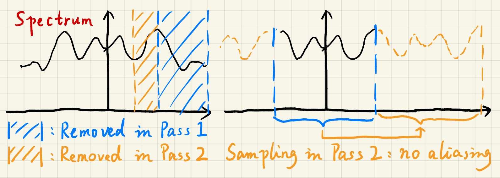
> </center>
>
> 如图所示，通过第一个 pass，高频率部分被干掉，所有的频率都集中在蓝色区域内，第二个 pass 相当于做了一个采样，也就是把第一个 pass 留下来的频谱向左或向右搬移一次

####  Removal

Filtering is not aimighty

* Sometimes the filtered result still noisy, even 
* Mostly due to extremely bright pixels (outliers)

##### Outlier Detection and Clamping

* For each pixel, take a look at its e.g. $7 \times 7$ neighborhood
* Compute mean and variance 计算均值和方差
* Value outside $[\mu - k\sigma, \mu + k\sigma]$ $\rightarrow$ outlier 在范围之外的就是 outlier
* Clamp any value outside $[\mu - k\sigma, \mu + k\sigma]$ to this range
* Note: this is <font color="#F7C04A">NOT</font> throwing away (zero out) the outlier 并不是丢弃掉 outlier，而是把 outlier 限制到一个范围内

#### Spatiotemporal Variance-Guided Filtring (SVGF)

3 factors to guide filtering

<center>
    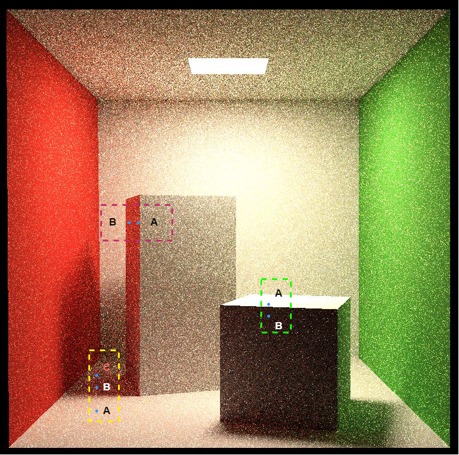
</center>

* <font color="#C92C6D">Depth</font>

$$
w_z = exp\left(-\frac{\left| z(p) - z(q) \right|}{\sigma_z \left|\nabla z(p) \cdot (p - q) \right| + \epsilon}\right)
$$

A and B are on the same plane, of similar color, so they should be contribute to each other. But the depth between A and B are very different

只是有衰减的形状但并不是高斯的形式，$\epsilon$是为了防止出现除 0 的情况，$\sigma_z$控制衰减快慢的参数，A 和 B 其实是在同一平面上，但是如果用正常的深度比较 A 和 B 的深度差距会很大，所以使用他们所在的切平面上的深度差异。$\nabla z(p)$任一点的深度的梯度，那么$\left|\nabla z(p) \cdot (p - q) \right|$可以表示为深度的变化量

* <font color="#16FF00">Normal</font>

$$
w_n = \max(0, n(p) \cdot n(q))^{\sigma_n}
$$

点积可以确定两个向量的差异，$\sigma_n$变化系数

Note: in case normal maps exist, use macro normal 有法线贴图的情况

* <font color="#FFED00">Color</font>
  B 点可能刚好取到噪声上，需要用 B 点标准差，所以要用到 SVGF 中的 Variance
  * Caculate spatially in $7 \times 7$
  * Also averaged over time using motion vectors
  * Take another $3 \times 3$ spatial filter before use $g_{3 \times 3}$就是在使用前计算出来的

<font color="#F7C04A">Luminance</font> (grayscale color value)

$$
w_l = exp\left(-\frac{\left|l_i(p) - l_i(q)\right|}{\sigma_l\sqrt{g_{3 \times 3}(Var(l_i(p)))}+ \epsilon}\right)
$$

#### Recurrent AutoEncoder (RAE)

Interactive Reconstruction of Monte Carlo Image Sequence using a <font color="#EA5455">Recurrent</font> denoising <font color="#F7C04A">AutoEncoder</font>
* A post-processing network that does denosing
* With help of G-buffers
* The network automatically performs temporal accumulation

Key architecture design

* AutoEncoder (or U-Net) structure
* Recurrent convolutional block

<center>
    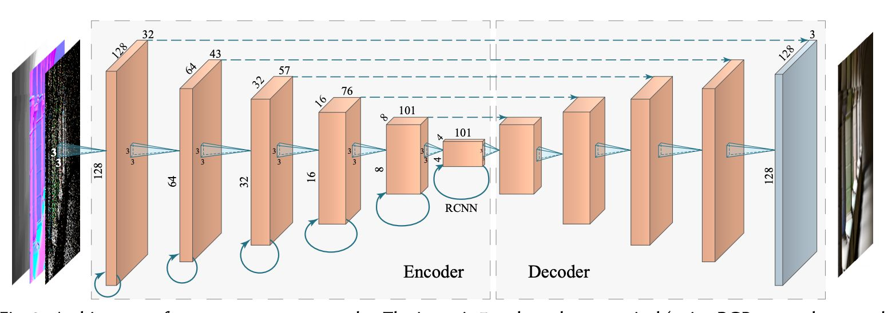
</center>

### A  of Instustrail Solution

#### Temporal Anti-Aliasing (TAA)

Why aliasing?
* Not enough samples per pixel during rasterization
* Therefor, the ultimate solution is to be use more samples

<center>
    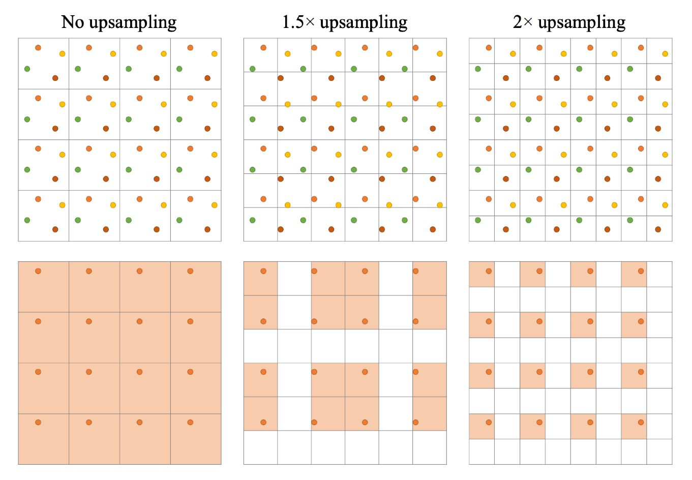
</center>

<center>
    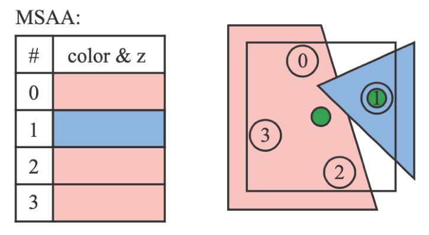
</center>

* MSAA (Multisample) vs SSAA (Supersampling)
  * SSAA is straightforward
    * Renderring at a larger resolutiont, then downsample 把场景按照原来几倍的分辨率渲染，渲染完成后再进行降采样
    * The ultimate solution, but costly 基本上 100%正确
  * MSAA: an improvement on performance 在 SSAA 基础上做了近似是的效率能够提上去
    * The same primitive is shaded only once 每个三角形只采样一次，通过维护一个表来实现
    * Reuse samples across pixels
* State of the art image based anti-aliasing solution
  * SMAA (Enhanced subpixel  AA)
  * History: FXAA → MLAA (Morphological AA) → SMAA
* <font color="#F7C04A">G-buffers should never be anti-aliased</font>

#### Temporal Super Resolution

Super resolution (or super sampling)

* literal understanding: increasing resolution 给一张低分辨率的图变成高分辨率的图
* Source 1 (DLSS 1.0): out of nowhere / completely guessed 信息来源什么都没有，全靠猜
* Source 2 (DLSS 2.0): from temporal information
  * Main Problem
    * Upon temporal failure, clamping is no longer an option
    * Because we need a clear value for each smaller pixel
    * Therefore, key is how to use temporal info samrter than clamping
  * An important practical issue
    * If DLSS itself runs at 30ms per frame, it's dead already
    * Network inference performance optimization (classified)

#### Deferred Shading
Originally invented to <font color="#EA5455">save shading time</font> 节省 shading 的时间

Consider the rasterization process
* Triangles → fragments → depth test → shade → pixel
* Each fragment needs to be shaded (in what scenario?) 在什么情况下每一个 fragment 都需要 shading，从远到近渲染可能会出现
* Complexity: $O(\\# fragment \cdot \\# light)$

Key Observation
* Most fragment will not be seen in the final image 很多 fragment 最后不会被看到，但是中间某个阶段对其进行了着色
* Due to depth test / occlusion
* Cane we only shade those <font color="#F7C04A">visible fragments</font>?

Modifying the rasterizaiton process
* Just rasterize the scene twice 光栅化两次
* Pass 1: no shading, just update the depth buffer 第一次不做着色，只对深度缓存进行更新
* Pass 2 is the same (why does this guarantee shading visible fragment only?) 第二次光栅化开始做着色
* Implicitly, this is assuming **rasterzing the scene** is way faster then **shading all unseen fragments** (usually trye) 跑一边光栅化的时间要比渲染全部 fragments 的时间要快

Issue
* Difficult to do anti-aliasing 不能用 AA
* But almost completely solved by TAA 但是 TAA 是可以用的 <font color="#617143">为什么？</font>

#### Tiled Shading

Subdivide the screen into tiles of e.g. $32 \times 32$ then shade each 建立在 deferred shading 的基础上，把屏幕分成小块，每个小块单独做 shading

Not all lights can illuminate a specific tile 光源覆盖的范围是随着距离衰减的，可以把覆盖范围想象成球形

<center>
    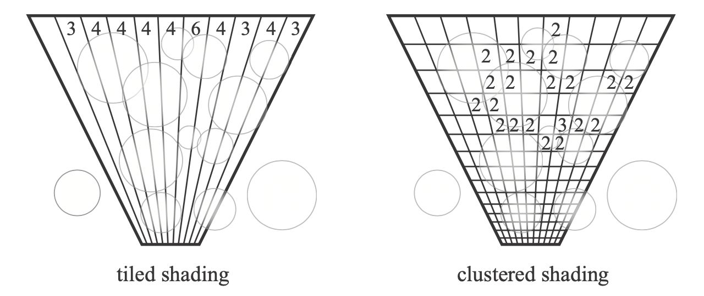
</center>

#### Clustered Shading

* Further subdivide each tile into different depth segments
* Essentially subdividing the view frustum into a 3D grid

复杂度更加减少，但是实现越来越复杂

#### Level of Detail (LoD) Solutions

<center>
    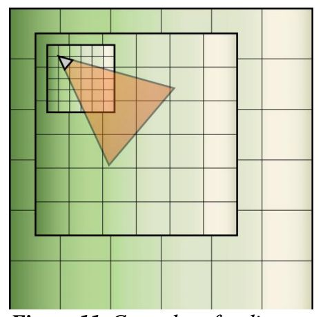
    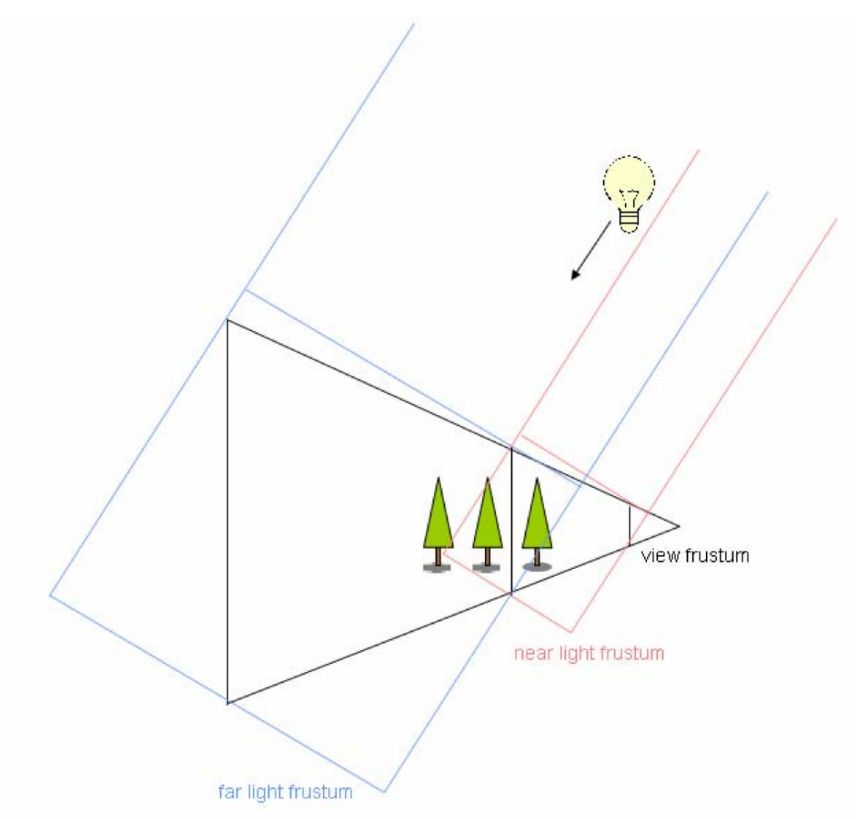
</center>

Example

* Cascaded shadow maps 距离 Camera 越远的地方就可以用越粗糙的 Shadow Map
  * 范围有一定的重叠，保证切换不同大小的 Shadow Map 有平滑的过度
* Cascaded LPV
* Geometric LoD
  * Based on the distance to the camera, choose the right object ot show
  * Popping artifacts? Leave it to TAA
  * This is Nanite in UE5 动态的选取 LoD 的实现

Key Challenge

* Transition between different levels 不同层级之间的转换
* Usually need some overlapping and blending near boundaries

#### Global Illumination Solutions

A possible solution to GI may include
* <font color="#F7C04A">SSR for a rough GI approximation</font>
* Upon SSR failure, switching to more complex ray tracing.
* Either hardware(RTRT) or software 或者用硬件做 tracing，或者用软件做 tracing
  * Software ray tracing
    * <font color="#F7C04A">HQ SDF for individual objects that are closed-by</font> 近处的用高质量的 SDF，SDF 可以让我们快速的在 shader 里面做 tracing
    * <font color="#F7C04A">LQ SDF for the entire scene</font> 远处的用低质量的 SDF
    * <font color="#F7C04A">RSM if there are strong directional / point light</font> 非常强的方向光源或点光源用 RSM
    * Probes that stores irradiance in a 3D grid (Dynamic Diffuse GI, DDGI)
  * Hardware ray tracing
    * <font color="#F7C04A">Doesn't have to use the original geometry, but low-poly proxies</font> 用简化了的模型代替原始模型
    * Probes (RTXGI)

The <font color="#F7C04A">hightlighted</font> solutions are mixed to get <font color="#EA5455">Lumen</font> in UE5

### A lot of uncovered topics

* Texturing an SDF SDF 贴纹理
* Transparent material and order-independent transparency 透明物体渲染顺序
* Particle rendering
* Post processing (depth of field, motion blur, etc.)
* Random seed and blue noise 实时渲染中怎么利用随机数种子 蓝噪声
* Foveated rendering
* Probe based global illumination 基于探针的 GI
* ReSTIR, Neural Radiance Caching, etc. 更先进的实时渲染技术
* Many-light theory and light cuts
* Participating media, SSSSS 云烟雾，次表面散射
* Hair appearance
* ...

***


[1] 类似花瓣的“瓣”，BRDF 是四维的，但是给定观察方向，会反射出来一个类似于“花瓣”的分布 <font color="#617143">lobe: n. （脑、肺等的）叶；裂片；耳垂；波瓣</font>


