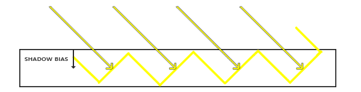
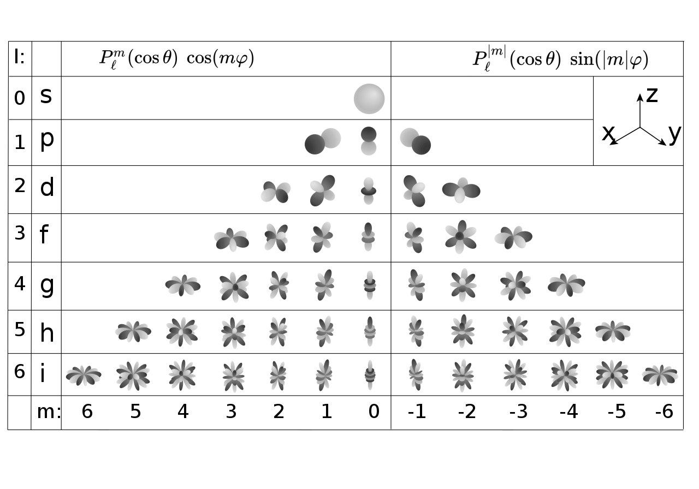

### OpenGL

#### Vertex Shader & Fragment Shader

* For each vertex in parallel 每一个顶点都要做
  * 在OpenGL中调用程序定义的vertex shader：做顶点变换，包括MVP变换、需要插值的属性输出给fragment shader
* For each primitive, OpenGL rasterizes 对每一个片元，OpenGL进行
  * Generates a fragment for each pixel the fragment covers
* For each fragment in parallel 每一个片段都要做
  * 在OpenGL中调用程序定义的fragment shader：做着色和光照计算

### Shadow Mapping

#### Render from Light & Eye

* Pass 1: Output a "depth texture" from the light source 从光源的角度出发生成一幅深度图
* Pass 2: Render a standard image from eye

#### Project to light for shadows

* Project visible points in eye view back to light source 连向光源，比较场景上的深度和Shadow Map中的深度的大小

#### Issues in Shadow Mapping

##### Self Occlusion

    

从光源的角度看场景所形成的shadow map是一个离散的图，shadow map上一个像素所覆盖的区域是的**深度值**则为一个**常数**，也就是说shadow map记录的深度不是连续的，与实际场景不符。当进行第二次Pass时，从场景某一点出发看向光源，就会被遮挡住，如图中黑色部分

> 如果光源方向从上往下垂直照向平面的时候没有自遮挡的问题，如果光源方向几乎平行与平面时自遮挡的问题最严重

* Adding a (variable) bias to reduce self occlusion

  如果实际的深度与的差值小于某个阈值就不算遮挡，相当于遮挡物距场景长的点足够小就忽略这个遮挡物。这个阈值可以不是一个常数，可以根据光源的角度变化。也可以从下图去理解这个Shadow Bias。

  

      
  

  但是可能回造成悬浮（）的问题，因为物体看起来轻轻悬浮在表面之上。

  **解决方案**（目前没有完美的解决方案）：

  * 找到一个合适的Shadow Bias——工业界的解决方法

  * Second-dpeth shadow mapping——实际中没有人用
    * Using the midpoint between first and second depths in shadow map
    * requires objects to be 
    * the overhead may not worth it

##### Alias

###### 实时渲染中阴影背后的数学知识

There are a lot of useful inequalities in 

设$f(x)$和$g(x)$在$[a, b]$上都可积，则：

* Schwarz不等式
  $$
  \left[\int_a^b{f(x)g(x)dx}\right]^2 \le \int_a^b{f^2(x)dx} \cdot \int_a^b{g^2(x)dx}
  $$

* Minkowksi不等式
  $$
  \left\\{\int_a^b{\left[f(x) + g(x)\right]^2dx}\right\\}^{\frac{1}{2}} \le \left[\int_a^b{f^2(x)dx}\right]^{\frac{1}{2}} + \left[\int_a^b{g^2(x)dx}\right]^{\frac{1}{2}}
  $$

在实时渲染中不太关心不等，关心的是近似相等，贯穿整个实时渲染的一个重要的不等式如下：
$$
\int_\Omega{f(x)g(x)dx} \approx \frac{\int_\Omega{f(x)dx}}{\int_\Omega dx} \cdot \int_\Omega{g(x)dx}
$$
什么时候上述不等式更加准确：

* $g(x)$的足够小
* $g(x)$是足够光滑的

###### Percentage Closer Soft Shadows

* Percentage Closer Filtering

  * Perform multipule(e.g. $7 \times 7$) depth comparisons for each fragment
  * Then, averages **result of** comparisons

  > **过滤或平均的是什么？**
  >
  > 平均的是任意shading point做的很多次阴影深度比较的结果，既不是对shadow map做模糊操作，也不是对最后的阴影图做模糊操作

* Filter size <-> blocker distance 如何确定filter的大小

    

$$
w_{Penumbra} = \frac{(d_{Receiver} - d_{Blocker})\cdot w_{Light}}{d_{Blocker}}
$$

###### The complete algorithm of PCSS

* Step 1: Blocker search (getting the average blocker depth in a certain region)
* Step 2:  estimation (using the average blocker depth to determine the filter size)
* Step 3: Percentage Closer Filtering

###### Which region to perform blocker search? 如何确定blocker的大小

    

光源看去生成一个shadow map，假设shadow map放在视锥体的近平面上，从shading point连向光源，计算在shadow map上覆盖的区域即为blocker size

### Variance Soft Shadow Mapping

#### A Deeper Look at PCF

* Filter / Convolution
  $$
  \[w * f\](p) = \sum_{q \in \aleph(p)}{w(p, q)f(q)}
  $$

* In PCSS
  $$
  V(x) = \sum_{q \in \aleph(p)}{w(p, q) \cdot \chi^+[D_{SM}(q) - D_{scene}(x)]}
  $$
  每一个shadow map上$q$点的深度和场景上$x$点的深度比较，按照某种形式加权平均起来

* Therefore, PCF is not filtering the shadow map then compare 并不是对shadow map做模糊然后比较
  $$
  V(s) \neq \chi^+\left\\{\[w * D_{SM}\](q) - D_{scene}(x)\right\\}
  $$
  
* And PCF is not filtering the resulting image with binary visibilities 也不是最后的阴影图做模糊操作
  $$
  V(s) \neq \sum_{y \in \aleph(x)}{w(x, y)V(y)}
  $$

#### Variance Soft Shadow Mapping

##### Which step(s) can be slow?

* [Step 1](#steps)
* [Step 3](#steps)

#####  Variance Soft Shadow Mapping

> **PCF**可以理解为在一场考试中知道自己多少分，想知道自己的排名在百分之几，就需要把所有的人的成绩都统计出来，VSSM则不需要知道所有人的成绩，就好比知道成绩的分布，然后根据自己的成绩就知道所在位置了

* Key Idea: Quickly compute the **mean** and **variance** of depths in an area

* Mean

  * Hardware MIPMAPing
  * Summed Area Tables(SAT)

* Variance

  * $Var(x) = E(X^2) - E^2(X)$ 利用期望和方差关系的公式，$E(X^2)$可以由另外一个shadow map，这个shadow map记录的时所有深度值的平方，在OpenGL中可以将这个深度平方的值记录在其他通道中（纹理由R、G、B、A四个通道，shadow map占用一个通道）
  * Just generate a "square-depth map" along with the shadow map

* Percentage of texels that are closer than the shading point 知道了期望和方差如何计算深度比shading point更近点的占比

  可由单边切比雪夫不等式更快的算出来：
  $$
  P(x > t) \le \frac{\sigma^2}{\sigma^2 + (t - \mu)^2}
  $$
  $\mu$是均值，$\sigma^2$是方差，只要知道均值和方差即可带入上述公式，但是必须满足$t > \mu$，可以直观感受切比雪夫不等式

  

      
  

###### Blocker search

    

假设shading point的深度是7，已经知道了$5 \times 5$区域大小的平均深度$z_{avg}$，但是小于7的遮挡物的平均深度是未知的

* Key idea
  * Blocker（$z < t$的部分，蓝色部分）的平均值记为$z_{occ}$
  * Non-blocker（$z > t$的部分，红色部分）的平均值记为$z_{unocc}$
  * 满足$\frac{N_1}{N}z_{unocc} + \frac{N_2}{N}z_{occ} = z_{avg}$
  * 根据切比雪夫可以估计：$\frac{N_1}{N} = P(x > t)$，$\frac{N_2}{N} = 1 - P(x > t)$
  * 又做了个假设：$z_{unocc} = t$，例如大多数的阴影接受物体是一个平面
* [Step 1](#steps) solved with  additional cost

#### SAT for Range Query

> Need to quickly grab $\mu$ and $\sigma$ from an arbitrary range (rectangular) 需要快速计算出任意矩形范围内的均值和方差
> $$
> P(x > t) \le \frac{\sigma^2}{\sigma^2 + (t - \mu)^2}
> $$

对于均值$\mu$，**MIPMAP**和Summed Area Table都可以来计算，**MIPMAP**存在误差的问题，并且不能查询非正方形的区域

##### Classic data structure and algorithm (prefix sum) 经典数据结构——前缀和

###### 一维：

    

###### 二维：

    

####  Shadow Mapping

    

##### Moments

* 最简单的矩：$x, x^2, x^3, x^4, \dots$
* **VSSM** is  using the first two orders of moments

##### What can moments do?

* Conclusion: first $m$ orders of moments can represent a function with $\frac{m}{2}$ steps
* Usually, 4 is good enough to approximate the actual CDF of depth dist

### Environment Mapping

#### Distance Field Soft Shadow

* Distance function: At any point, giving the minimun distance (could be signed distance) to the closest location on an object 在空间中的任何一个点，到某个物体表面的最小距离（距离场可以是有向的，比如在物体内部为负，在物体外部为正）

* An Example: Blending (linear interp.) a moving boundary

  

      
  

##### The Usages of Distance Fields

* Ray marching (Sphere tracing) to perform ray-SDF intersection

  任何一个点上都相当于定义了一个安全距离（safe distance），利用这个安全距离可以近似求出光线与场景中物体的交点

* Use SDF to determine the (approx.) percentage of occlusion

  把安全距离延申为安全角度（safe angle），最后转换为阴影的值

##### How to compute the safe angle?

利用反三角函数：$arcsin\frac{SDF(p)}{\\|p - o\\|}$，图形学中不提倡计算反三角函数（计算量很大），可以通过距离的比值来表示角度的近似，即：$min\left\\{\frac{k \cdot SDF(P)}{\\|p - o\\|}, 1.0\right\\}$，$k$用来控制阴影的软硬程度

#### Shading from Environment Lighting

##### How to use it to shade point (without shadows)? 

    

不考虑visibility，任何一个Shading Point都要求解这个渲染方程，计算量特别大，不能用在实时渲染中，即如果存在采样（sample）的操作，就很难应用在实时渲染中

###### The Split Sum: 1st Stage

* Recall: the approximation

  $$
  \int_{\Omega}f(x)g(x)dx \approx \frac{\int_{\Omega_G}{f(x)}dx}{\int_{\Omega_G}dx} \cdot \int_{\Omega}{g(x)dx}
  $$
  
* Conditions for acceptable accuracy? 这个公式什么时候会比较准确

  * $g(x)$的比较小的情况下→BRDF is glossy
  * 或者$g(x)$的值比较的情况下→BRDF is diffuse
  
* 于是就可以把光源项拆出来
  $$
  L_o(p, \omega_o) \approx \frac{\int_{\Omega_{f_r}}{L_i(p, \omega_i)}d\omega_i}{\int_{\Omega_{f_r}}d\omega_i} \cdot \int_{\Omega^+}{f_r(p, \omega_i, \omega_o)\cos \theta_id\omega_i}
  $$
  拆出来的项相当于把Light对应区域积分并归一化，也就是把IBL表示的一张图进行

  **为什么要做pre-filtering：**Then query the per-filtered environment lighting at the $r$(mirror reflected) drection

###### The Split Sum: 2nd Stage

> 如何避免对BRDF积分的采样，即
>
> $$\int_{\Omega^+}{f_r(p, \omega_i, \omega_o)\cos \theta_id\omega_i}$$
>
> Idea：Precompute its value for all possible combinations of variables roughness, color(Fresnel term), etc. 预计算所有的参数的可能性
>
> 基于微表面的BRDF需要考虑的参数：
>
> * fresnel term 菲尼尔项
> * NDF 微表面的法线分布

**Recall : Microfacet BRDF**

    

菲尼尔项可以用Schlick's方法近似：
$$
R(\theta) = R_0 + (1 - R_0)(1 - \cos \theta)^5 \\\\
R_0 = \left(\frac{n_1 - n_2}{n_1 + n_2}\right)^2
$$
$R_0$：初始反射率

$\theta$：入射角度

法线分布可以使用Beckmann distribution：
$$
D(h) = \frac{e^{\frac{\tan^2\theta_h}{\alpha^2}}}{\pi\alpha^2\cos^4\theta_h}
$$
$\alpha$：物体的粗糙度

$\theta_h$：半程向量和法线的夹角

    

由于两个类型的角度可以近似，预计算的维度为三维，但仍然需要降维。可以把菲尼尔项的近似形式——Schlick's带入到积分中：
$$
\begin{aligned}
\int_{\Omega^+}{f_r(p, \omega_i, \omega_o)\cos \theta_id\omega_i} &\approx \int_{\Omega^+}\frac{f_r}{F}F\cos \theta_id\omega_i \\\\
&\approx \int_{\Omega^+}\frac{f_r}{F}{(R_0 + (1 - R_0)(1 - \cos \theta)^5)}\cos \theta_id\omega_i \\\\
&\approx R_0\int_{\Omega^+}\frac{f_r}{F}(1 - (1 - \cos \theta)^5)\cos \theta_id\omega_i + \int_{\Omega^+}\frac{f_r}{F}(1 - \cos \theta)^5\cos \theta_id\omega_i
\end{aligned}
$$
Each integral produces one value for each (roughness, incident angle) pair

在实时领域\工业界通常写为求和，所以也被称为**split sum**方法：
$$
\frac{1}{N}\sum_{k = 1}^{N}{\frac{L_i(\mathbf{l}_k)f(\mathbf{l}_k, \mathbf{v})\cos \theta\_{\mathbf{l}_k}}{p(\mathbf{l}_k, \mathbf{v})}} \approx \left(\frac{1}{N}\sum_\{k = 1\}^{N}{L_i(\mathbf{l}_k)}\right)\left(\frac{1}{N}\sum_\{k = 1\}^{N}{\frac{f(\mathbf{l}_k, \mathbf{v})\cos \theta\_{\mathbf{l}_k}}{p(\mathbf{l}_k, \mathbf{v})}}\right)
$$

<!--$$-->
<!--\frac{1}{N}\sum_{k = 1}^{N}{\frac{L_i(\mathbf{l}_k)f(\mathbf{l}_k, \mathbf{v})\cos \theta\_{\mathbf{l}_k}}{p(\mathbf{l}_k, \mathbf{v})}} \approx \left(\frac{1}{N}\sum_{k = 1}^{N}{L_i(\mathbf{l}_k)}\right)\left(\frac{1}{N}\sum_{k = 1}^{N}{\frac{f(\mathbf{l}_k, \mathbf{v})\cos \theta\_{\mathbf{l}_k}}{p(\mathbf{l}_k, \mathbf{v})}}\right)-->
<!--$$-->

#### Shadow from environment lighting

> In general, very difficult for real-time rendering 环境光照下的阴影做不到

##### Different perspectives of view

- As a many-light problem 环境光照可以认为是很多光源，每一个光源都要生成一个Shadow Map代价非常大
- As a sampling problem 通过解渲染方程需要大量的采样，求解Visibility Term项是最难的，只能盲目的采样

##### Industrial solution

Generate one (or a little bit more) shadows 从最亮的一个或几个光源下生成阴影

### Precomputed Radiance Transfer

#### [Background knowledge](22.md)

##### Fourier Transform

Represent a function as a weighted sum of sines and cosines 一个函数可以写成若干$\sin$项和$\cos$项的组合

###### A general understanding

Any product integra can be considered as filtering 两个函数相乘再积分就认为是滤波操作
$$
\int_{\Omega}{f(x)g(x)dx}
$$

##### Basis Functions

A set of functions that can be used to represent other functions in general 一个函数可以描述为其他函数的线性组合
$$
f(x) = \sum_i{c_i \cdot B_i(x)}
$$

* The Fourier series is a set of basis functions
* The  series can also be a set of basis functions ($1, x, x^2, x^3, \dots$)

#### Real-time environment lighting

##### Spherical Harmonics

> 定义：A set of 2D basis functions $B_i(\omega)$ defined on the sphere 一系列定义在球面上的二维基函数，“球面上”表示方向

    
    
Alternative picture for the real spherical harmonics

> 到底是什么？
>
> 一堆函数，每一阶拥有一种频率，阶越高对应的基函数的数量越多

* Each SH basis function $B_i(\omega)$ is associated with a () polynomial

* Projection: obtaining the coefficient of each SH basis function 已知任何一个二维的函数${f(\omega)}$，任何一个基函数对应的系数可以通过Product Integral获得，求系数的过程就叫做**投影**
  $$
  c_i = \int_{\omega}{f(\omega)}B_i(\omega)d\omega
  $$

##### Analytic Irradiance Formula

    
    
用SH描述<strong>BRDF</strong>

用不同阶的SH描述**全局光照**

    

> 对于任何的光照条件，只要材质是Diffused，都可以用前三阶的SH来**描述光照**

##### A Brief Summarization

* Usage of basis function
  * Representing any function (with enough #basis) 足够多的基函数可以表示一个函数
  * Keeping a certain frequency contents (with a low #basis) 保留一些低频信息，可以用前几阶的基函数
  * Reducing integrals to dot products
* But here it’s still shading from environment lighting
  * No shadows yet 仍然没有加入阴影

#### Precomputed Radiance Transfer

##### Rendering under environment lighting

$$
L(\mathbf{o}) = \int_{\Omega}{L(\mathbf{i})V(\mathbf{i})\rho(\mathbf{i}, \mathbf{o})\max(0, \mathbf{n} \cdot \mathbf{i})}d\mathbf{i}
$$

* $L(\mathbf{i})$：Ligghting Term 环境光
* $V(\mathbf{i})$：Visibility Term 从一点往四面八方看，结果要么是0，要么是1
* $\rho(\mathbf{i}, \mathbf{o})\max(0, \mathbf{n} \cdot \mathbf{i})$：BRDF Term 原本是四维的，但是从某个地方看即表示知道观察方向，也就知道了入射方向，就可以用二维变量描述

> $i$, incoming directions
>
> $o$,view directions

Brute-force computation 这三项都可以描述成二维的球面函数，如果这样计算量会特别大

##### Basic idea of PRT

> **假设：**场景中其他所有的都不变，只有光照会发生变化，在这种情况下light transport也可以当作球面函数

* Approximate lighting using basis functions 把光照拆成basis functions
  * $L(\mathbf{i}) = \sum{l_iB_i(\mathbf{i})}$
* Precomputation stage
  * compute light transport, and project to basis function space
* Runtime stage
  * dot product (diffuse) or matrix-vector multiplication (glossy)

###### Diffuse Case

> BRDF——$\rho$是一个常值

$$
\begin{aligned}
L(\mathbf{o}) &= \rho \int_{\Omega}{L(\mathbf{i})V(\mathbf{i})\max(0, \mathbf{n} \cdot \mathbf{i})}d\mathbf{i} \\\\
&\approx \rho \sum{l_i}\int_{\Omega}{B_i(\mathbf{i})V(\mathbf{i})\max(0, \mathbf{n} \cdot \mathbf{i})}d\mathbf{i} \\\\
&\approx \rho \sum{l_iT_i}
\end{aligned}
$$

* 一种理解方式

  * 上式中的$\int_{\Omega}{B_i(\mathbf{i})V(\mathbf{i})\max(0, \mathbf{n} \cdot \mathbf{i})}d\mathbf{i}$就是light transport的球面函数投影到某个基函数上的[系数](#coefficient )

  * Reduce rendering computation to dot product $\rho \sum{l_i}T_i$就是两个向量的点乘

* 另一种理解方式

  * **Separately** precompute lighting and light transport
  * 光照项分别为lighting coefficient和basis functions

  $$
  L(\omega_i) \approx \sum_{p}{c_pB_p(\omega_i)}
  $$

  * 光照传输项分别为lighting transport coefficient和basis functions

  $$
  T(\omega_i) \approx \sum_{q}{c_qB_q(\omega_i)}
  $$

  $$
  \begin{aligned}
  L(p, \omega_o) &= \int_{\Omega^+}{L_i(p, \omega_i)f_r(p, \omega_i, \omega_o)\cos \theta_i V(p, \omega_i)}d\omega_i \\\\
  &= \sum_p{\sum_q}{c_pc_q}\int_{\Omega^+}{B_p(\omega_i)B_q(\omega_i)}d\omega_i
  \end{aligned}
  $$

  > Why is it a dot product? (This seems to be $o(n^2)$ rather than $o(n)$?)
  >
  > 虽然看起来像是二维的求和，但是根据SH的正交性，只有当$p = q$时积分不为0；相当于计算二维矩阵对角线上的值

###### Glossy Case

$$
\begin{aligned}
L(\mathbf{o}) &= \int_{\Omega}{L(\mathbf{i})V(\mathbf{i})\rho(\mathbf{i}, \mathbf{o})\max(0, \mathbf{n} \cdot \mathbf{i})}d\mathbf{i}
\\\\
&\Downarrow
\\\\
L(\mathbf{o}) &\approx \sum{l_iT_i(\mathbf{o})}
\end{aligned}
$$

与Diffuse的区别在于BRDF，Diffuse的BRDF是一个常数，Glossy的BRDF表示不同方向入射光线照到物体表面，反射到不同的方向的结果，所以Glossy的BRDF是一个的向量。给定任意观察方向$\mathbf{o}$，light transport都会投影出来一组完全不同的向量，所以在任意观察方向上light transport不是个常数，而是$\mathbf{o}$的函数

> Glossy的物体有一个非常重要的性质——**和视点有关**，Diffuse的物体和**视点无关**

##### Interreflections and 

> * L：Light 光照
> * E：Eye 眼睛
> * G：Glossy
> * D：Diffuse
> * S：Specular

Runtime is independent of transport complexity

L(D|G)\*E、LS\*(D|G)\*E起点都是光照，终点都是视角，中间的部分都可以认为是Light Transport，所以运行时的复杂度和Light Transport的复杂度无关

##### Basis Functions $B(\mathbf{i})$

###### Properties 性质

* orthonormal 正交性
  $$
  \begin{aligned}
  \int_{\Omega}{B_i(\mathbf{i}) \cdot B_j(\mathbf{i})} = 1 \quad (i = j)\\\\
  \int_{\Omega}{B_i(\mathbf{i}) \cdot B_j(\mathbf{i})} = 0 \quad (i \neq j)
  \end{aligned}
  $$
  
* simple projection/reconstruction 投影易算

  * Projection to SH space
    $$
    l_i = \int_{\Omega}{L(\mathbf{i}) \cdot B_i(\mathbf{i})}d\mathbf{i}
    $$

  * Reconstruction
    $$
    L(\mathbf{i}) \approx \sum{l_iB_i(\mathbf{i})}
    $$

* simple rotation 旋转任意一个基函数某个角度，都可以被同阶的基函数线性组合得到

* simple convolution

* few basis functions: low freqs

##### More basis functions

* ~~Spherical Harmonics (SH)~~
* Wavelet 定义在二维平面上
  * 2D Haar wavelet
  * Projection
    * Wavelet Transformation
    * Retain a small number of  non-zero coefficients  保留了一小部分非零的基函数的系数
  * A non-linear approximation 保留非零或最大的数值
  * All-frequency representation 支持全频率表示
  * 不支持快速旋转
* Zonal Harmonics
* Spherical Gaussian (SG)
* Piecewise Constant

##### Precomputation

> light transport投影到任何一个基函数上，相当于用basis functions所描述的环境光照，照亮各个物体，从而计算物体各个点上shading的值，相当于render equation

$$
T_i \approx \int_{\Omega}{B_i(\mathbf{i})V(\mathbf{i})\max(0, \mathbf{n} \cdot \mathbf{i})}d\mathbf{i}
$$

##### Run-time Rendering

$$
L(\mathbf{o}) \approx \rho \sum{l_iT_i}
$$

* Rendering at each point is reduced to a dot product
  * First, project the lighting to the basis to obtain $l_i$
  * Or, rotate the lighting instead of re-projection
  * Then, compute the dot product
* Real-time: easily implemented in shader

### Real-Time Global Illumination

#### Reflflective Shadow Maps (RSM)

* Which surface patches are directly lit? 什么样的表面能都被光源直接照射到

  * Perfectly solved with a classic shadow map 可以通过Shadow Map计算出
  * Each pixel on the shadow map is a small surface patch Shadow Map上的每一个像素都是一片次级光源
  * Assumption
    * Any reflflector is diffuse 假设任何次级光源的材质都是Diffuse
    * Therefore, outgoing radiance is uniform toward all directions

* What is the contribution from each surface patch to $x$

  

      
  

  * An integration over the solid angle covered by the patch
  * Can be converted to the integration on the area of the patch

