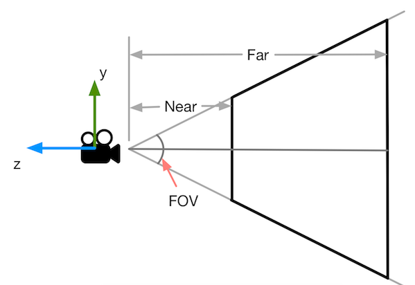
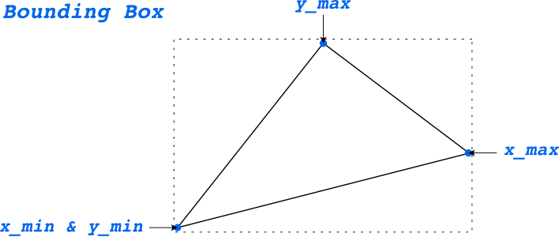
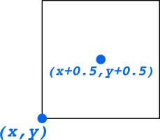

### 投影矩阵

#### 透视投影矩阵推导

<center>
    
</center>

对于正交投影（Orthographic Projection）需要把长方体$\left[l,r\right]\times\left[b,t\right]\times\left[f,n\right]$进行标准化成正方体$\left[-1,1\right]^3$，相应的变换矩阵是先进行平移变换（将长方体的中心与原点重合），再进行缩放变换（由于标准化的正方体的边长是 **2**，长宽高要归一化到 **2**），即：
$$
M_{ortho} =
\begin{bmatrix}
\frac{2}{r - l} & 0 & 0 & 0 \\\\
0 & \frac{2}{t - b} & 0 & 0 \\\\
0 & 0 & \frac{2}{n - f} & 0 \\\\
0 & 0 & 0 & 1 \\\\
\end{bmatrix}
\begin{bmatrix}
1 & 0 & 0 &  -\frac{r + l}{2} \\\\
0 & 1 & 0 & -\frac{t + b}{2} \\\\
0 & 0 & 1 & -\frac{n + f}{2} \\\\
0 & 0 & 0 & 1 \\\\
\end{bmatrix}
$$
<center>
    
</center>

对于透视投影（Perspective Projection），思路是把视锥体“挤压”成长方体，再对长方体进行归一化。于是视锥体内的所有点“挤压”到近平面上（可以想象视角在远平面外侧，方向垂直于远平面），可以根据相似三角形原理计算出“挤压”后的$x\prime = \frac{n}{z}x$和$y\prime = \frac{n}{z}y$坐标

<center>
    
</center>

那么“挤压”后的点在齐次坐标系（Homogeneous Coordinates）下可以表示为：
$$
\begin{bmatrix}
x \\\\
y \\\\
z \\\\
1 \\\\
\end{bmatrix}
\Rightarrow
\begin{bmatrix}
\frac{n}{z}x \\\\
\frac{n}{z}y \\\\
\Box  \\\\
1 \\\\
\end{bmatrix}
\Rightarrow
\begin{bmatrix}
nx \\\\
ny \\\\
\Box \\\\
z \\\\
\end{bmatrix}
$$

所以从视锥体到长方体的矩阵变换$M^{4 \times 4}_{persp \rightarrow orhto}$满足下面的等式：

$$
M^{4 \times 4}_{persp \rightarrow orhto}
\begin{bmatrix}
x \\\\
y \\\\
z \\\\
1 \\\\
\end{bmatrix} =  
\begin{bmatrix}
nx \\\\
ny \\\\
\Box \\\\
z \\\\
\end{bmatrix}
$$

即

$$
M^{4 \times 4}_{persp \rightarrow orhto}  =
\begin{bmatrix}
n & 0 & 0 & 0 \\\\
0 & n & 0 & 0 \\\\
\Box & \Box & \Box & \Box \\\\
0 & 0 & 1 & 0 \\\\
\end{bmatrix}
$$
第三行的未知值可以根据两个设定计算出来：

1. 近平面上的任意一点经过“挤压”后的$z$坐标不发生变化，近平面上的点为$\left(x, y, n, 1\right)$，挤压后还是$\left(x, y, n, 1\right)$，也可以写成$\left(nx, ny, n^2, n\right)$，所以第三行一定满足以下等式：
   $$
   \begin{pmatrix}
   0 & 0 & A & B
   \end{pmatrix}
   \begin{pmatrix}
   x \\\\
   y \\\\
   z \\\\
   1 \\\\
   \end{pmatrix}
   = n^2
   $$
   可以得出：
   $$
   An + B = n^2
   $$

2. 远平面上的任意一点经过“挤压”后的$z$坐标也不会发生变化，同上可得：
   $$
   Af + B = f^2
   $$

联立可得：
$$
\begin{cases}
A = n + f \\\\
B = -nf
\end{cases}
$$
所以透视投影矩阵可以表示为：
$$
\begin{align}
M_{persp} &= M_{ortho}M{persp \rightarrow orhto} \\\\
&=\begin{bmatrix}
\frac{2}{r - l} & 0 & 0 & 0 \\\\
0 & \frac{2}{t - b} & 0 & 0 \\\\
0 & 0 & \frac{2}{n - f} & 0 \\\\
0 & 0 & 0 & 1 \\\\
\end{bmatrix}
\begin{bmatrix}
1 & 0 & 0 &  -\frac{r + l}{2} \\\\
0 & 1 & 0 & -\frac{t + b}{2} \\\\
0 & 0 & 1 & -\frac{n + f}{2} \\\\
0 & 0 & 0 & 1 \\\\
\end{bmatrix}
\begin{bmatrix}
n & 0 & 0 & 0 \\\\
0 & n & 0 & 0 \\\\
0 & 0 & n + f & -nf \\\\
0 & 0 & 1 & 0 \\\\
\end{bmatrix}
\end{align}
$$

对于函数`get_projection_matrix`中的参数可由下图计算出：

<center>
    
</center>

长方体的中心位于原点，则$t=n\tan\frac{fov}{2}$，根据对称性$b=-t$，根据纵横比和对称性可得$r=t\times{aspect}$，$l = -r$，代入公式即可

#### 旋转与投影代码

```c++
Eigen::Matrix4f get_projection_matrix(float eye_fov, float aspect_ratio, float zNear, float zFar)
{
    // TODO: Copy-paste your implementation from the previous assignment.
    Eigen::Matrix4f projection;
    
    float fov = eye_fov * M_PI / 180.0;
    float t = std::abs(zNear) * std::tan(fov / 2.0);
    float b = -t;
    float r = t * aspect_ratio;
    float l = -r;
    float n = zNear;
    float f = zFar;
    
    Eigen::Matrix4f scale;
    scale << 1 / r - l, 0, 0, 0,
        0, 1 / t - b, 0, 0,
        0, 0, 1 / n - f, 0,
        0, 0, 0, 1;
    
    Eigen::Matrix4f translate;
    translate << 1, 0, 0, 0,
        0, 1, 0, 0,
        0, 0, 1, (n + f) / -2,
        0, 0, 0, 1;
    
    auto orthographic = scale * translate;
    Eigen::Matrix4f orthographicToProjection;
    orthographicToProjection << n, 0, 0, 0,
        0, n, 0, 0,
        0, 0, n + f, -n * f,
        0, 0, 1, 0;
    projection = orthographic * orthographicToProjection;
    
    return projection;
}
```

### 三维空间中判断一个点是否在三角形内

1. 求出向量$\overrightarrow{PA}$，$\overrightarrow{PB}$，$\overrightarrow{PC}$
2. 计算$\overrightarrow{PA} \times\overrightarrow{PB}$，$\overrightarrow{PB} \times \overrightarrow{PC}$，$\overrightarrow{PC} \times \overrightarrow{PA}$
3. 如果叉乘后三个向量方向同向则说明$P$点在三角形内部，否则在外部

```c++
static bool insideTriangle(int x, int y, const Vector3f* _v)
{   
    // TODO : Implement this function to check if the point (x, y) is inside the triangle represented by _v[0], _v[1], _v[2]
    Eigen::Vector2f side1;
    side1 << _v[1].x() - _v[0].x(), _v[1].y() - _v[0].y();
    Eigen::Vector2f side2;
    side2 << _v[2].x() - _v[1].x(), _v[2].y() - _v[1].y();
    Eigen::Vector2f side3;
    side3 << _v[0].x() - _v[2].x(), _v[0].y() - _v[2].y();
    
    Eigen::Vector2f v1;
    v1 << x - _v[0].x(), y - _v[0].y();
    Eigen::Vector2f v2;
    v2 << x - _v[1].x(), y - _v[1].y();
    Eigen::Vector2f v3;
    v3 << x - _v[2].x(), y - _v[2].y();
    
    float z1 = side1.x() * v1.y() - side1.y() * v1.x();
    float z2 = side2.x() * v2.y() - side2.y() * v2.x();
    float z3 = side3.x() * v3.y() - side3.y() * v3.x();
    
    if ((z1 > 0 && z2 > 0 && z3 > 0) || (z1 < 0 && z2 < 0 && z3 < 0))
    {
        return true;
    }
    else
    {
        return false;
    }
}
```

### 光栅化

#### [计算重心坐标](https://www.cnblogs.com/1Kasshole/p/14062190.html)

考虑三角形三个顶点$A$，$B$，$C$以及内部坐标点$P$，假设又三个值$\alpha$，$\beta$，$\gamma$满足：
$$
\begin{cases}
\alpha + \beta + \gamma = 1 \\\\
\alpha A + \beta B + \gamma C = P
\end{cases}
$$
解方程组可得
$$
\begin{cases}
\alpha = 1 - \beta - \gamma \\\\
\beta = \frac{x_P - x_A - \gamma (x_C - x_A)}{x_B - x_A} \\\\
\gamma = \frac{(x_B - x_A)(y_P - y_A) - (x_P - x_A)(y_B - y_A)}{(x_B - x_A)(y_C - y_A) - (x_C - x_A)(y_B - y_A)}
\end{cases}
$$

```c++
static std::tuple<float, float, float> computeBarycentric2D(float x, float y, const Vector3f* v)
{
    float xp = x, yp = y;
    float xa = v[0].x(), ya = v[0].y();
    float xb = v[1].x(), yb = v[1].y();
    float xc = v[2].x(), yc = v[2].y();
    float gamma = ((xb - xa) * (yp - ya) - (xp - xa) * (yb - ya)) / 
                  ((xb - xa) * (yc - ya) - (xc - xa) * (yb - ya));
    float beta = (xp - xa - gamma * (xc - xa)) / (xb - xa);
    float alpha = 1.0f - beta - gamma;
    return {alpha, beta, gamma};
}
```

<center>
    
</center>

光栅化一个三角形需要扫描三角形所在的包围盒，判断点是否在三角形内部然后通过中心坐标插值

<center>
    
</center>

所以判断是否在三角形内部需要加$0.5$

```c++
if (insideTriangle(i + 0.5f, j + 0.5f, t.v)) {
    ...
}
```

已知重心坐标$\alpha$，$\beta$，$\gamma$的值求深度值$z$的公式如下（需要做重心坐标-插值校正）：
$$
Z_P = \frac{1}{\frac{\alpha\prime}{Z_A} + \frac{\beta\prime}{Z_B} + \frac{\gamma\prime}{Z_C}}
$$
其中$\alpha\prime = \alpha\frac{Z_A}{Z_P}$，$\beta\prime = \beta\frac{Z_B}{Z_P}$，$\gamma\prime = \gamma\frac{Z_C}{Z_P}$

重心坐标是在 2D 空间里做的，不能用作插值 3D 空间的坐标，需要经过插值矫正才可以

```c++
//Screen space rasterization
void rst::rasterizer::rasterize_triangle(const Triangle& t) {
    auto v = t.toVector4();
    
    // TODO : Find out the bounding box of current triangle.
    // iterate through the pixel and find if the current pixel is inside the triangle
    auto minX = std::min(v[0].x(), std::min(v[1].x(), v[2].x()));
    auto minY = std::min(v[0].y(), std::min(v[1].y(), v[2].y()));
    auto maxX = std::max(v[0].x(), std::max(v[1].x(), v[2].x()));
    auto maxY = std::max(v[0].y(), std::max(v[1].y(), v[2].y()));
    // If so, use the following code to get the interpolated z value.
    // TODO : set the current pixel (use the set_pixel function) to the color of the triangle (use getColor function) if it should be painted.
    for (int i = minX; i <= maxX; i++) {
        for (int j = minY; j <= maxY; j++) {
            if (insideTriangle(i + 0.5f, j + 0.5f, t.v)) {
                float minDepth = FLT_MAX;
                auto tup = computeBarycentric2D(i, j, t.v);
                
                float alpha, beta, gamma;
                std::tie(alpha, beta, gamma) = tup;
                float wReciprocal = 1.0 / (alpha / v[0].w() + beta / v[1].w() + gamma / v[2].w());
                float zInterpolated = alpha * v[0].z() / v[0].w() + beta * v[1].z() / v[1].w() + gamma * v[2].z() / v[2].w();
                zInterpolated *= wReciprocal;
                minDepth = std::min(minDepth, zInterpolated);
                auto index = get_index(i, j);
                if (depth_buf[index] > minDepth) {
                    Eigen::Vector3f color = t.getColor();
                    Vector3f point;
                    point << i, j, minDepth;
                    depth_buf[index] = minDepth;
                    set_pixel(point, color);
                }
            }
        }
    }
}
```

***



[1] <a href="https://zhuanlan.zhihu.com/p/380634903">透视投影-重心坐标-插值校正</a>

[2] <a href="https://www.comp.nus.edu.sg/~lowkl/publications/lowk_persp_interp_techrep.pdf">Perspective-Correct Interpolation</a>


